# Data preparation

::: {.cell}

```{.r .cell-code}
library(dplyr)
library(ggplot2)

morphometric_data <- utils::read.csv(here::here("data", "morphometric_data.csv"), sep = ";", header = T, dec = ".")

morpho_data <- morphometric_data %>%
  select(-c(variable_abbreviation, variable_unit)) %>%
  t() %>%
  as.data.frame() %>%
  janitor::row_to_names(row_number = 1) %>%
  `rownames<-`(NULL)%>%
  # delete for now (n=1)
  filter(species!= "Diaphus_sp")

# replace empty value by NA 
morpho_data[morpho_data ==""] <- NA

# Numeric variables
morpho_data[, 4:23] <- sapply(morpho_data[, 4:23], as.numeric)
```
:::


### data imputation  
- mice algorithm: n imputation = 5, n iterations = 50
- plot comparison for Operculum Width

::: {.cell}

```{.r .cell-code}
#select numeric variables for imputation 
original_data <- morpho_data %>%
  select(1:23)

imputation <-
  mice::mice(
    original_data,
    m = 5,
    maxit = 50,
    printFlag = F
  )

imputed_data <- mice::complete(imputation)
```
:::

::: {.cell}

```{.r .cell-code}
# Metadata
metadata <-  utils::read.csv(here::here("data", "metadata.csv"), sep = ";", header = T, dec = ".")%>%
  # calculation of standardized biomass values (vertical  trawl opening * horizontal trawl opening * distance traveled)  
  mutate(volume_filtered = 24*58*distance)
```
:::


# 1. Epipelagic 
## Species * assemblages matrix


::: {.cell}

```{.r .cell-code}
# species biomass x depth  matrix 2002-2019 ----
data_biomass_2002_2019 <- utils::read.csv(here::here("data", "data_evhoe_catch_2002_2019.csv"), sep = ";", header = T, dec = ".")%>%
  replace(is.na(.), 0)%>%
  as.data.frame()%>%
  rename("species"="Code_Station")%>%
  mutate(species= gsub(" ","_", species))%>%
  t()%>%
  as.data.frame()%>%
  janitor::row_to_names(row_number = 1)%>%
  mutate_if(is.character, as.numeric)%>%
  tibble::rownames_to_column("Code_Station")%>%
  filter(!Code_Station=="H0472")%>%
  tidyr::pivot_longer(!Code_Station, names_to = "species", values_to = "Tot_V_HV")%>%
  rename("Nom_Scientifique"="species")

# species biomass x depth  matrix 2021 ----
data_biomass_2021 <- utils::read.csv(here::here("data", "data_evhoe_catch_2021.csv"), sep = ";", header = T, dec = ".")%>%
  select(Nom_Scientifique, Tot_V_HV, Code_Station)%>%
  distinct()%>%
  mutate(Nom_Scientifique= gsub(" ","_",Nom_Scientifique))

# species biomass x depth  matrix 2022 ----
data_biomass_2022 <- utils::read.csv(here::here("data", "data_evhoe_catch_2022.csv"), sep = ";", header = T, dec = ".")%>%
  select(Nom_Scientifique, Tot_V_HV, Code_Station)%>%
  distinct()%>%
  mutate(Nom_Scientifique= gsub(" ","_",Nom_Scientifique))

#merge all matrix ----
depth_fish_biomass <- rbind(data_biomass_2002_2019, data_biomass_2021, data_biomass_2022)%>%
  as.data.frame()%>%
  rename("species"="Nom_Scientifique",
         "station"="Code_Station") %>%
  left_join(metadata) %>%
  select(species, Tot_V_HV, depth, volume_filtered)%>%
  # divise biomass by the volume filtered at each trawl (g.m3)
  mutate(biomass_cpu=(Tot_V_HV/volume_filtered)*1000)%>%
  select(species, depth, biomass_cpu)%>%
  # add column with depth layer
  mutate(
    depth_layer = case_when(
      between(depth, 0, 174) ~ "Epipelagic",
      between(depth, 175, 699) ~ "Upper mesopelagic",
      between(depth, 700, 999) ~ "Lower mesopelagic",
      between(depth, 1000, 2000) ~ "Bathypelagic"))%>%
  filter(depth_layer=="Epipelagic") %>% 
  replace(is.na(.), 0)%>%
  select(-depth)%>%
  group_by(species)%>%
  mutate(biomass=sum(biomass_cpu))%>%
  select(-c(biomass_cpu))%>%
  distinct()%>%
  filter(biomass>0) %>% 
  tidyr::pivot_wider(names_from = species, values_from = biomass)%>%
  replace(is.na(.), 0)%>%
  tibble::column_to_rownames(var = "depth_layer")%>%
  as.matrix()

sp_epi <- depth_fish_biomass %>% 
  as.data.frame() %>% 
  tibble::rownames_to_column(var = "depth_layer") %>% 
  tidyr::pivot_longer(! depth_layer, names_to = "species", values_to = "biomass")

sp_epi_names <- as.vector(sp_epi$species)
```
:::


## Species * traits
### calctulate functional traits 

::: {.cell}

```{.r .cell-code}
# calculate functional numeric traits
numeric_traits <- imputed_data %>%
  na.omit() %>%
  select(-individual_code) %>%
  mutate(
    eye_size = eye_diameter / head_depth,
    orbital_length = eye_diameter / standard_length,
    oral_gape_surface = mouth_width * mouth_depth / body_width * body_depth,
    oral_gape_shape = mouth_depth / mouth_width,
    oral_gape_position = distance_upper_jaws_bottom_head / head_depth,
    lower_jaw_length = lower_jaw_length / standard_length,
    head_length = head_length / standard_length,
    body_depth = body_depth / standard_length,
    pectoral_fin_position = distance_pectoral_bottom_body / body_depth_pectoral_insertion,
    pectoral_fin_insertion = prepectoral_length / standard_length,
    transversal_shape = body_depth / body_width,
    dorsal_fin_insertion = predorsal_length / standard_length,
    eye_position = eye_height / head_depth,
    operculum_volume = operculum_depth / operculum_width,
    gill_outflow = operculum_width,
    caudal_throttle_width = caudal_peduncle_min_depth
  ) %>%
  select(
    species,
    eye_size,
    orbital_length,
    gill_outflow,
    oral_gape_surface,
    oral_gape_shape,
    oral_gape_position,
    lower_jaw_length,
    head_length,
    body_depth,
    pectoral_fin_position,
    pectoral_fin_insertion,
    transversal_shape,
    caudal_throttle_width,
    dorsal_fin_insertion,
    eye_position,
    operculum_volume
  ) %>%
  group_by(species) %>%
  summarise(across(everything(), mean, na.rm = TRUE)) %>%
  filter(species%in%sp_epi_names) %>%
  arrange(species)

# categorical traits for species without NA
cat_morpho <- morpho_data %>%
  select(
    species,
    ventral_photophores,
    gland_head,
    chin_barbel,
    small_teeth,
    large_teeth,
    fang_teeth,
    internal_teeth,
    gill_raker_types,
    oral_gape_axis
  ) %>%
  na.omit() %>%
  distinct()  %>%
  filter(species%in%sp_epi_names) %>%
  arrange(species)
```
:::

::: {.cell}

```{.r .cell-code}
# combined the two data frames
fish_traits <- numeric_traits %>%
  inner_join(cat_morpho, by = "species") %>%
  arrange(species) %>% 
  tibble::column_to_rownames("species")%>%
  # assign trait type 
  # as.factor for qualitative traits
  mutate_if(is.character, as.factor)%>%
  # as.ordered for ordered variables
  mutate_at(c("gill_raker_types", "oral_gape_axis"), as.ordered)
```
:::

::: {.cell}

```{.r .cell-code}
fish_traits_cat <- utils::read.csv(here::here("data", "fish_traits_cat.csv"), sep = ";", header = T, dec = ".") %>% 
  filter(!trait_name=="retractable_teeth")
```
:::


## Build a functional space using the mFD package


::: {.cell}

```{.r .cell-code}
sp_dist_fish <- mFD::funct.dist(
  sp_tr         = fish_traits,
  tr_cat        = fish_traits_cat,
  metric        = "gower",
  scale_euclid  = "scale_center",
  ordinal_var   = "classic",
  weight_type   = "equal",
  stop_if_NA    = TRUE)
```
:::

::: {.cell}

```{.r .cell-code}
fspaces_quality_fish <- mFD::quality.fspaces(
  sp_dist             = sp_dist_fish,
  maxdim_pcoa         = 10,
  deviation_weighting = "absolute",
  fdist_scaling       = FALSE,
  fdendro             = "average")

## Quality metrics of functional spaces ----
round(fspaces_quality_fish$"quality_fspaces", 3)
```

::: {.cell-output .cell-output-stdout}
```
               mad
pcoa_1d      0.153
pcoa_2d      0.074
pcoa_3d      0.040
pcoa_4d      0.024
pcoa_5d      0.016
pcoa_6d      0.012
pcoa_7d      0.012
pcoa_8d      0.012
pcoa_9d      0.014
pcoa_10d     0.014
tree_average 0.047
```
:::
:::


__Variance explained by each axis__

::: {.cell}

```{.r .cell-code}
# Extract eigenvalues information
eigenvalues_info <- fspaces_quality_fish$"details_fspaces"$"pc_eigenvalues"

# Create a dataframe to store the results
variance_df <- data.frame(
  PC = c("PC1", "PC2", "PC3", "PC4"),
  VarianceExplained = c(
    eigenvalues_info[1, "Cum_corr_eig"] * 100,
    (eigenvalues_info[2, "Cum_corr_eig"] - eigenvalues_info[1, "Cum_corr_eig"]) * 100,
    (eigenvalues_info[3, "Cum_corr_eig"] - eigenvalues_info[2, "Cum_corr_eig"]) * 100,
    (eigenvalues_info[4, "Cum_corr_eig"] - eigenvalues_info[3, "Cum_corr_eig"]) * 100
  )
)

htmltools::tagList(DT::datatable(variance_df))
```

::: {.cell-output-display}

```{=html}
<div class="datatables html-widget html-fill-item" id="htmlwidget-25e23c1715492286d483" style="width:100%;height:auto;"></div>
<script type="application/json" data-for="htmlwidget-25e23c1715492286d483">{"x":{"filter":"none","vertical":false,"data":[["1","2","3","4"],["PC1","PC2","PC3","PC4"],[24.15246541412373,21.30053779936385,12.95302146763426,6.759205313268835]],"container":"<table class=\"display\">\n  <thead>\n    <tr>\n      <th> <\/th>\n      <th>PC<\/th>\n      <th>VarianceExplained<\/th>\n    <\/tr>\n  <\/thead>\n<\/table>","options":{"columnDefs":[{"className":"dt-right","targets":2},{"orderable":false,"targets":0},{"name":" ","targets":0},{"name":"PC","targets":1},{"name":"VarianceExplained","targets":2}],"order":[],"autoWidth":false,"orderClasses":false}},"evals":[],"jsHooks":[]}</script>
```

:::
:::

::: {.cell}

```{.r .cell-code}
sp_faxes_coord_fish_epi <- fspaces_quality_fish$"details_fspaces"$"sp_pc_coord"

fish_tr_faxes <- mFD::traits.faxes.cor(
  sp_tr          = fish_traits, 
  sp_faxes_coord = sp_faxes_coord_fish_epi[ , c("PC1", "PC2", "PC3", "PC4")], 
  plot           = F)

## Print traits with significant effect ----
traits_effect <- fish_tr_faxes[which(fish_tr_faxes$p.value< 0.05),] %>% 
  as.data.frame() %>% 
  arrange(axis, desc(value))

htmltools::tagList(DT::datatable(traits_effect))
```

::: {.cell-output-display}

```{=html}
<div class="datatables html-widget html-fill-item" id="htmlwidget-15ddcb568a975ae392d7" style="width:100%;height:auto;"></div>
<script type="application/json" data-for="htmlwidget-15ddcb568a975ae392d7">{"x":{"filter":"none","vertical":false,"data":[["1","2","3","4","5","6","7","8","9","10","11","12","13","14","15","16","17","18","19","20","21","22","23","24","25","26","27","28","29","30"],["head_length","orbital_length","gill_raker_types","pectoral_fin_insertion","lower_jaw_length","body_depth","small_teeth","transversal_shape","fang_teeth","gland_head","large_teeth","ventral_photophores","eye_size","oral_gape_surface","oral_gape_axis","gill_outflow","ventral_photophores","large_teeth","lower_jaw_length","gill_raker_types","body_depth","pectoral_fin_position","fang_teeth","caudal_throttle_width","internal_teeth","eye_position","oral_gape_axis","operculum_volume","operculum_volume","pectoral_fin_position"],["PC1","PC1","PC1","PC1","PC1","PC1","PC1","PC1","PC1","PC1","PC1","PC1","PC2","PC2","PC2","PC2","PC2","PC2","PC2","PC2","PC2","PC2","PC2","PC2","PC3","PC3","PC3","PC3","PC4","PC4"],["Linear Model","Linear Model","Kruskal-Wallis","Linear Model","Linear Model","Linear Model","Kruskal-Wallis","Linear Model","Kruskal-Wallis","Kruskal-Wallis","Kruskal-Wallis","Kruskal-Wallis","Linear Model","Linear Model","Kruskal-Wallis","Linear Model","Kruskal-Wallis","Kruskal-Wallis","Linear Model","Kruskal-Wallis","Linear Model","Linear Model","Kruskal-Wallis","Linear Model","Kruskal-Wallis","Linear Model","Kruskal-Wallis","Linear Model","Linear Model","Linear Model"],["r2","r2","eta2","r2","r2","r2","eta2","r2","eta2","eta2","eta2","eta2","r2","r2","eta2","r2","eta2","eta2","r2","eta2","r2","r2","eta2","r2","eta2","r2","eta2","r2","r2","r2"],[0.781,0.642,0.491,0.446,0.413,0.412,0.38,0.287,0.254,0.22,0.209,0.197,0.606,0.601,0.525,0.475,0.458,0.387,0.366,0.293,0.268,0.234,0.229,0.193,0.593,0.408,0.3,0.207,0.5600000000000001,0.233],[0,0,0.0044,0.0009,0.0017,0.0017,0.0042,0.0123,0.0159,0.0228,0.0258,0.0293,0,0,0.0033,0.0005,0.0018,0.0039,0.0036,0.0264,0.0163,0.0264,0.0208,0.0465,0.0005,0.0018,0.0248,0.038,0.0001,0.0267]],"container":"<table class=\"display\">\n  <thead>\n    <tr>\n      <th> <\/th>\n      <th>trait<\/th>\n      <th>axis<\/th>\n      <th>test<\/th>\n      <th>stat<\/th>\n      <th>value<\/th>\n      <th>p.value<\/th>\n    <\/tr>\n  <\/thead>\n<\/table>","options":{"columnDefs":[{"className":"dt-right","targets":[5,6]},{"orderable":false,"targets":0},{"name":" ","targets":0},{"name":"trait","targets":1},{"name":"axis","targets":2},{"name":"test","targets":3},{"name":"stat","targets":4},{"name":"value","targets":5},{"name":"p.value","targets":6}],"order":[],"autoWidth":false,"orderClasses":false}},"evals":[],"jsHooks":[]}</script>
```

:::
:::


## Plotting the selected functional space and position of species

::: {.cell}

```{.r .cell-code}
sp_faxes_coord_fish <- fspaces_quality_fish$"details_fspaces"$"sp_pc_coord"

big_plot <- mFD::funct.space.plot(
  sp_faxes_coord  = sp_faxes_coord_fish_epi[ , c("PC1", "PC2", "PC3", "PC4")],
  faxes           = c("PC1", "PC2", "PC3", "PC4"),
  name_file       = NULL,
  faxes_nm        = NULL,
  range_faxes = c(-0.4,0.4),
  plot_ch         = TRUE,
  shape_pool      = 20,
  size_pool = 2,
  size_vert = 1,
  color_ch = "darkgrey",
  color_vert      = "#FEA520",
  fill_vert       = "#FEA520",
  color_pool = "grey",
  plot_vertices   = TRUE,
  check_input     = TRUE)

big_plot$"patchwork"
```

::: {.cell-output-display}
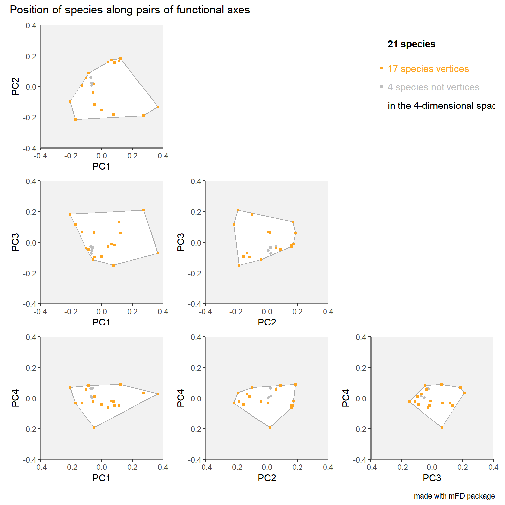{width=768}
:::

```{.r .cell-code}
ggsave("functional_space_epi.png", path = "figures", dpi = 700, height = 9, width = 9)
```
:::

::: {.cell}

```{.r .cell-code}
big_plot$PC1_PC2
```

::: {.cell-output-display}
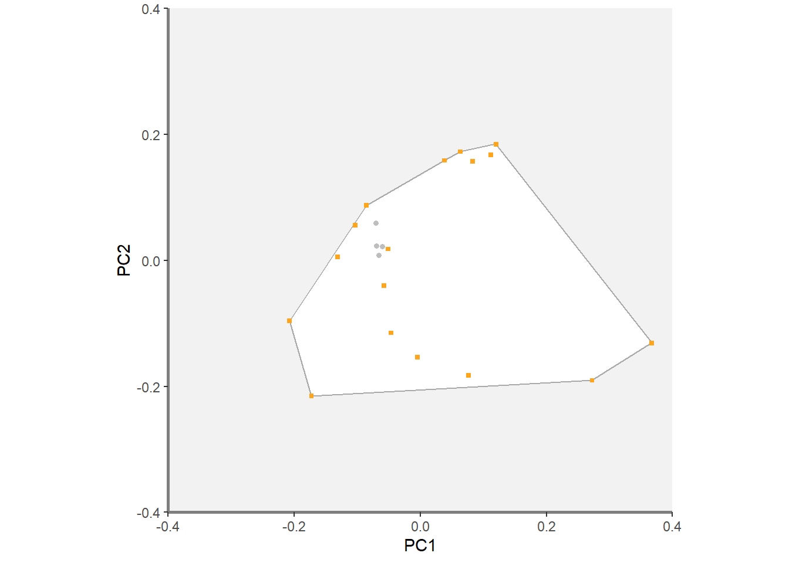{width=672}
:::

```{.r .cell-code}
ggsave("functional_space_epi_PC1.png", path = "figures", dpi = 700, height = 2, width = 2)
```
:::

::: {.cell}

```{.r .cell-code}
big_plot$PC3_PC4
```

::: {.cell-output-display}
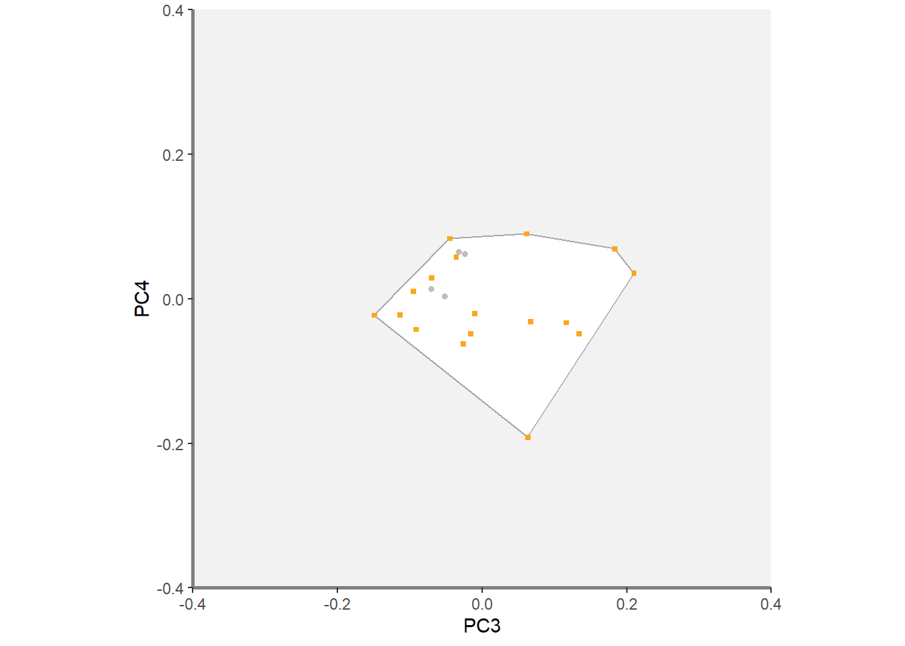{width=672}
:::

```{.r .cell-code}
ggsave("functional_space_epi_PC3.png", path = "figures", dpi = 700, height = 2, width = 2)
```
:::


# 2. Upper mesopelagic
## Species * assemblages matrix


::: {.cell}

```{.r .cell-code}
#merge all matrix ----
depth_fish_biomass <- rbind(data_biomass_2002_2019, data_biomass_2021, data_biomass_2022)%>%
  as.data.frame()%>%
  rename("species"="Nom_Scientifique",
         "station"="Code_Station") %>%
  left_join(metadata) %>%
  select(species, Tot_V_HV, depth, volume_filtered)%>%
  # divise biomass by the volume filtered at each trawl (g.m3)
  mutate(biomass_cpu=(Tot_V_HV/volume_filtered)*1000)%>%
  select(species, depth, biomass_cpu)%>%
  # add column with depth layer
  mutate(
    depth_layer = case_when(
      between(depth, 0, 174) ~ "Epipelagic",
      between(depth, 175, 699) ~ "Upper mesopelagic",
      between(depth, 700, 999) ~ "Lower mesopelagic",
      between(depth, 1000, 2000) ~ "Bathypelagic"))%>%
  filter(depth_layer=="Upper mesopelagic") %>% 
  replace(is.na(.), 0)%>%
  select(-depth)%>%
  group_by(species)%>%
  mutate(biomass=sum(biomass_cpu))%>%
  select(-c(biomass_cpu))%>%
  distinct()%>%
  filter(biomass>0) %>% 
  tidyr::pivot_wider(names_from = species, values_from = biomass)%>%
  replace(is.na(.), 0)%>%
  tibble::column_to_rownames(var = "depth_layer")%>%
    #change species name
  rename("Lampanyctus_ater"="Nannobrachium_atrum")%>%
  rename("Cyclothone_sp"="Cyclothone")%>%
  rename("Stomias_boa"="Stomias_boa_boa") %>%
  as.matrix()

sp_up <- depth_fish_biomass %>% 
  as.data.frame() %>% 
  tibble::rownames_to_column(var = "depth_layer") %>% 
  tidyr::pivot_longer(! depth_layer, names_to = "species", values_to = "biomass")

sp_up_nm <- as.vector(sp_up$species)
```
:::


## Species * traits
### calctulate functional traits 

::: {.cell}

```{.r .cell-code}
# calculate functional numeric traits
numeric_traits <- imputed_data %>%
  na.omit() %>%
  select(-individual_code) %>%
  mutate(
    eye_size = eye_diameter / head_depth,
    orbital_length = eye_diameter / standard_length,
    oral_gape_surface = mouth_width * mouth_depth / body_width * body_depth,
    oral_gape_shape = mouth_depth / mouth_width,
    oral_gape_position = distance_upper_jaws_bottom_head / head_depth,
    lower_jaw_length = lower_jaw_length / standard_length,
    head_length = head_length / standard_length,
    body_depth = body_depth / standard_length,
    pectoral_fin_position = distance_pectoral_bottom_body / body_depth_pectoral_insertion,
    pectoral_fin_insertion = prepectoral_length / standard_length,
    transversal_shape = body_depth / body_width,
    dorsal_fin_insertion = predorsal_length / standard_length,
    eye_position = eye_height / head_depth,
    operculum_volume = operculum_depth / operculum_width,
    gill_outflow = operculum_width,
    caudal_throttle_width = caudal_peduncle_min_depth
  ) %>%
  select(
    species,
    eye_size,
    orbital_length,
    gill_outflow,
    oral_gape_surface,
    oral_gape_shape,
    oral_gape_position,
    lower_jaw_length,
    head_length,
    body_depth,
    pectoral_fin_position,
    pectoral_fin_insertion,
    transversal_shape,
    caudal_throttle_width,
    dorsal_fin_insertion,
    eye_position,
    operculum_volume
  ) %>%
  group_by(species) %>%
  summarise(across(everything(), mean, na.rm = TRUE)) %>%
  filter(species%in%sp_up_nm) %>%
  arrange(species)

# categorical traits for species without NA
cat_morpho <- morpho_data %>%
  select(
    species,
    ventral_photophores,
    gland_head,
    chin_barbel,
    small_teeth,
    large_teeth,
    fang_teeth,
    internal_teeth,
    retractable_teeth,
    gill_raker_types,
    oral_gape_axis
  ) %>%
  na.omit() %>%
  distinct()  %>%
  filter(species%in%sp_up_nm) %>%
  arrange(species)
```
:::

::: {.cell}

```{.r .cell-code}
# combined the two data frames
fish_traits <- numeric_traits %>%
  inner_join(cat_morpho, by = "species") %>%
  arrange(species) %>% 
  tibble::column_to_rownames("species")%>%
  # assign trait type 
  # as.factor for qualitative traits
  mutate_if(is.character, as.factor)%>%
  # as.ordered for ordered variables
  mutate_at(c("gill_raker_types", "oral_gape_axis"), as.ordered)
```
:::

::: {.cell}

```{.r .cell-code}
fish_traits_cat <- utils::read.csv(here::here("data", "fish_traits_cat.csv"), sep = ";", header = T, dec = ".")
```
:::


## Build a functional space using the mFD package


::: {.cell}

```{.r .cell-code}
sp_dist_fish <- mFD::funct.dist(
  sp_tr         = fish_traits,
  tr_cat        = fish_traits_cat,
  metric        = "gower",
  scale_euclid  = "scale_center",
  ordinal_var   = "classic",
  weight_type   = "equal",
  stop_if_NA    = TRUE)
```
:::

::: {.cell}

```{.r .cell-code}
fspaces_quality_fish <- mFD::quality.fspaces(
  sp_dist             = sp_dist_fish,
  maxdim_pcoa         = 10,
  deviation_weighting = "absolute",
  fdist_scaling       = FALSE,
  fdendro             = "average")

## Quality metrics of functional spaces ----
round(fspaces_quality_fish$"quality_fspaces", 3)
```

::: {.cell-output .cell-output-stdout}
```
               mad
pcoa_1d      0.150
pcoa_2d      0.081
pcoa_3d      0.048
pcoa_4d      0.029
pcoa_5d      0.021
pcoa_6d      0.016
pcoa_7d      0.013
pcoa_8d      0.014
pcoa_9d      0.017
pcoa_10d     0.019
tree_average 0.041
```
:::
:::


__Variance explained by each axis__

::: {.cell}

```{.r .cell-code}
# Extract eigenvalues information
eigenvalues_info <- fspaces_quality_fish$"details_fspaces"$"pc_eigenvalues"

# Create a dataframe to store the results
variance_df <- data.frame(
  PC = c("PC1", "PC2", "PC3", "PC4"),
  VarianceExplained = c(
    eigenvalues_info[1, "Cum_corr_eig"] * 100,
    (eigenvalues_info[2, "Cum_corr_eig"] - eigenvalues_info[1, "Cum_corr_eig"]) * 100,
    (eigenvalues_info[3, "Cum_corr_eig"] - eigenvalues_info[2, "Cum_corr_eig"]) * 100,
    (eigenvalues_info[4, "Cum_corr_eig"] - eigenvalues_info[3, "Cum_corr_eig"]) * 100
  )
)

htmltools::tagList(DT::datatable(variance_df))
```

::: {.cell-output-display}

```{=html}
<div class="datatables html-widget html-fill-item" id="htmlwidget-9d0420910bba4b7d39bb" style="width:100%;height:auto;"></div>
<script type="application/json" data-for="htmlwidget-9d0420910bba4b7d39bb">{"x":{"filter":"none","vertical":false,"data":[["1","2","3","4"],["PC1","PC2","PC3","PC4"],[21.45800232438552,14.14735383779209,9.778648000313256,8.059508247208919]],"container":"<table class=\"display\">\n  <thead>\n    <tr>\n      <th> <\/th>\n      <th>PC<\/th>\n      <th>VarianceExplained<\/th>\n    <\/tr>\n  <\/thead>\n<\/table>","options":{"columnDefs":[{"className":"dt-right","targets":2},{"orderable":false,"targets":0},{"name":" ","targets":0},{"name":"PC","targets":1},{"name":"VarianceExplained","targets":2}],"order":[],"autoWidth":false,"orderClasses":false}},"evals":[],"jsHooks":[]}</script>
```

:::
:::


### __Summary of traits with a significant effect__


::: {.cell}

```{.r .cell-code}
sp_faxes_coord_fish_um <- fspaces_quality_fish$"details_fspaces"$"sp_pc_coord"

fish_tr_faxes <- mFD::traits.faxes.cor(
  sp_tr          = fish_traits, 
  sp_faxes_coord = sp_faxes_coord_fish_um[ , c("PC1", "PC2", "PC3", "PC4")], 
  plot           = F)

## Print traits with significant effect ----
traits_effect <- fish_tr_faxes[which(fish_tr_faxes$p.value< 0.05),] %>% 
  as.data.frame() %>% 
  arrange(axis, desc(value))

htmltools::tagList(DT::datatable(traits_effect))
```

::: {.cell-output-display}

```{=html}
<div class="datatables html-widget html-fill-item" id="htmlwidget-4936e87bdcc2a702015d" style="width:100%;height:auto;"></div>
<script type="application/json" data-for="htmlwidget-4936e87bdcc2a702015d">{"x":{"filter":"none","vertical":false,"data":[["1","2","3","4","5","6","7","8","9","10","11","12","13","14","15","16","17","18","19","20","21","22","23","24","25","26","27","28","29","30","31","32","33","34","35","36","37","38"],["gill_raker_types","fang_teeth","head_length","orbital_length","small_teeth","pectoral_fin_insertion","large_teeth","gland_head","chin_barbel","body_depth","oral_gape_surface","transversal_shape","ventral_photophores","lower_jaw_length","oral_gape_axis","oral_gape_surface","body_depth","caudal_throttle_width","gill_outflow","pectoral_fin_position","large_teeth","head_length","gill_raker_types","eye_size","pectoral_fin_insertion","orbital_length","ventral_photophores","internal_teeth","eye_position","dorsal_fin_insertion","oral_gape_axis","chin_barbel","transversal_shape","ventral_photophores","eye_size","oral_gape_position","operculum_volume","chin_barbel"],["PC1","PC1","PC1","PC1","PC1","PC1","PC1","PC1","PC1","PC1","PC1","PC1","PC1","PC2","PC2","PC2","PC2","PC2","PC2","PC2","PC2","PC2","PC2","PC2","PC2","PC2","PC2","PC3","PC3","PC3","PC3","PC3","PC3","PC4","PC4","PC4","PC4","PC4"],["Kruskal-Wallis","Kruskal-Wallis","Linear Model","Linear Model","Kruskal-Wallis","Linear Model","Kruskal-Wallis","Kruskal-Wallis","Kruskal-Wallis","Linear Model","Linear Model","Linear Model","Kruskal-Wallis","Linear Model","Kruskal-Wallis","Linear Model","Linear Model","Linear Model","Linear Model","Linear Model","Kruskal-Wallis","Linear Model","Kruskal-Wallis","Linear Model","Linear Model","Linear Model","Kruskal-Wallis","Kruskal-Wallis","Linear Model","Linear Model","Kruskal-Wallis","Kruskal-Wallis","Linear Model","Kruskal-Wallis","Linear Model","Linear Model","Linear Model","Kruskal-Wallis"],["eta2","eta2","r2","r2","eta2","r2","eta2","eta2","eta2","r2","r2","r2","eta2","r2","eta2","r2","r2","r2","r2","r2","eta2","r2","eta2","r2","r2","r2","eta2","eta2","r2","r2","eta2","eta2","r2","eta2","r2","r2","r2","eta2"],[0.506,0.487,0.464,0.436,0.412,0.405,0.398,0.344,0.186,0.178,0.174,0.168,0.129,0.629,0.5570000000000001,0.474,0.413,0.389,0.377,0.374,0.283,0.275,0.267,0.237,0.225,0.219,0.113,0.678,0.331,0.245,0.216,0.2,0.155,0.369,0.304,0.268,0.24,0.111],[0.0007,0.0002,0.0001,0.0001,0.0005999999999999999,0.0003,0.0008,0.0016,0.0158,0.0255,0.0272,0.0301,0.0371,0,0.0003,0.0001,0.0002,0.0004,0.0005,0.0005,0.0038,0.0042,0.0131,0.0086,0.0108,0.0121,0.0473,0,0.0014,0.0074,0.0247,0.0128,0.0379,0.0011,0.0023,0.0048,0.0081,0.049]],"container":"<table class=\"display\">\n  <thead>\n    <tr>\n      <th> <\/th>\n      <th>trait<\/th>\n      <th>axis<\/th>\n      <th>test<\/th>\n      <th>stat<\/th>\n      <th>value<\/th>\n      <th>p.value<\/th>\n    <\/tr>\n  <\/thead>\n<\/table>","options":{"columnDefs":[{"className":"dt-right","targets":[5,6]},{"orderable":false,"targets":0},{"name":" ","targets":0},{"name":"trait","targets":1},{"name":"axis","targets":2},{"name":"test","targets":3},{"name":"stat","targets":4},{"name":"value","targets":5},{"name":"p.value","targets":6}],"order":[],"autoWidth":false,"orderClasses":false}},"evals":[],"jsHooks":[]}</script>
```

:::
:::


## Plotting the selected functional space and position of species

::: {.cell}

```{.r .cell-code}
sp_faxes_coord_fish <- fspaces_quality_fish$"details_fspaces"$"sp_pc_coord"

big_plot <- mFD::funct.space.plot(
  sp_faxes_coord  = sp_faxes_coord_fish[ , c("PC1", "PC2", "PC3", "PC4")],
  faxes           = c("PC1", "PC2", "PC3", "PC4"),
  name_file       = NULL,
  faxes_nm        = NULL,
  range_faxes = c(-0.4,0.4),
  plot_ch         = TRUE,
  shape_pool      = 20,
  size_pool = 2,
  #plot_sp_nm =sp_names, 
  size_vert = 1,
  color_ch = "darkgrey",
  color_vert      = "#D62246",
  fill_vert       = "#D62246",
  color_pool = "grey",
  plot_vertices   = TRUE,
  check_input     = TRUE)

big_plot$"patchwork"
```

::: {.cell-output-display}
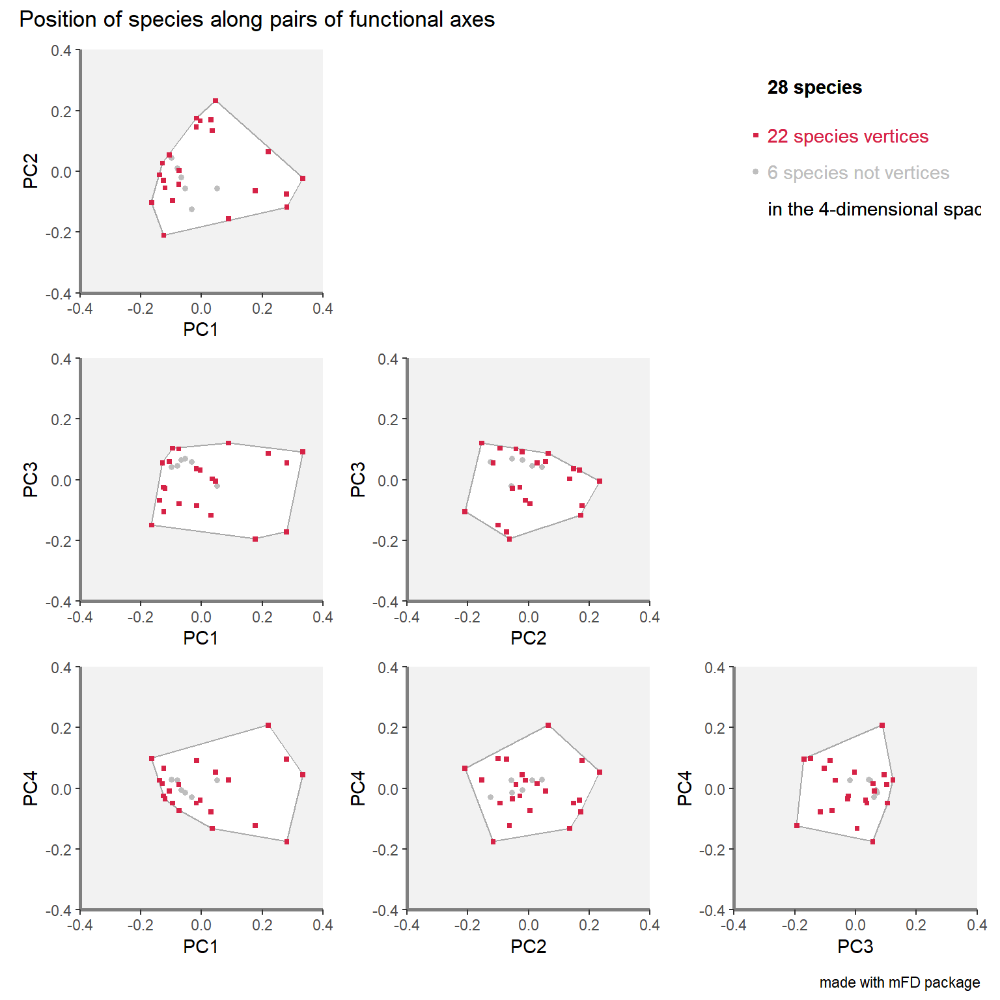{width=768}
:::

```{.r .cell-code}
ggsave("functional_space_up.png", path = "figures", dpi = 700, height = 9, width = 9)
```
:::

::: {.cell}

```{.r .cell-code}
sp_faxes_coord_fish <- fspaces_quality_fish$"details_fspaces"$"sp_pc_coord"

sp_names <- rownames(sp_faxes_coord_fish)

big_plot <- mFD::funct.space.plot(
  sp_faxes_coord  = sp_faxes_coord_fish[ , c("PC1", "PC2", "PC3", "PC4")],
  faxes           = c("PC1", "PC2", "PC3", "PC4"),
  name_file       = NULL,
  faxes_nm        = NULL,
  range_faxes = c(-0.4,0.4),
  plot_ch         = TRUE,
  shape_pool      = 20,
  size_pool = 2,
  #plot_sp_nm =sp_names, 
  size_vert = 1,
  color_ch = "darkgrey",
  color_vert      = "#D62246",
  fill_vert       = "#D62246",
  color_pool = "grey",
  plot_vertices   = TRUE,
  check_input     = TRUE)

big_plot$PC1_PC2
```

::: {.cell-output-display}
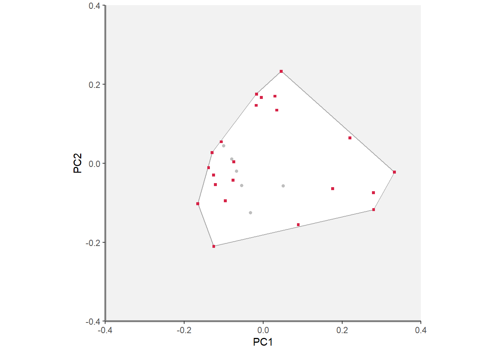{width=672}
:::

```{.r .cell-code}
ggsave("functional_space_up_PC1.png", path = "figures", dpi = 700, height = 2, width = 2)
```
:::

::: {.cell}

```{.r .cell-code}
big_plot$PC3_PC4
```

::: {.cell-output-display}
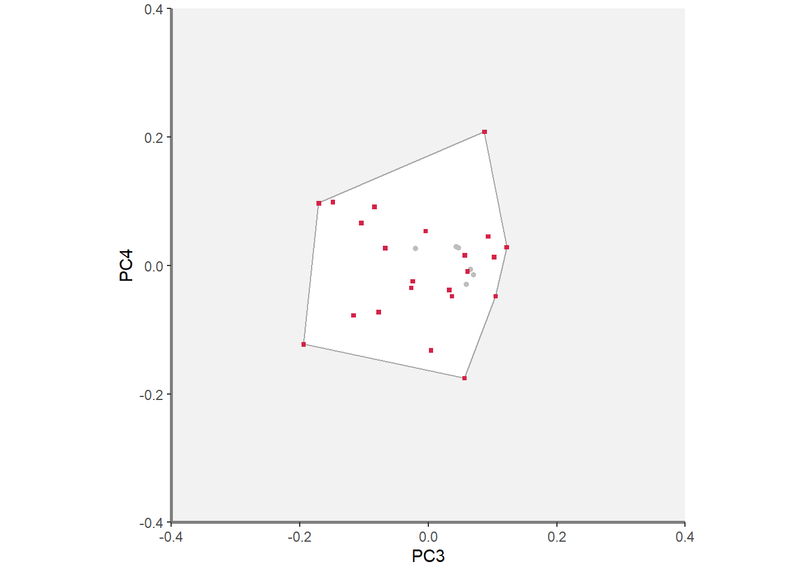{width=672}
:::

```{.r .cell-code}
ggsave("functional_space_up_PC3.png", path = "figures", dpi = 700, height = 2, width = 2)
```
:::


# 3. Lower mesopelagic
## Species * assemblages matrix


::: {.cell}

```{.r .cell-code}
#merge all matrix ----
depth_fish_biomass <- rbind(data_biomass_2002_2019, data_biomass_2021, data_biomass_2022)%>%
  as.data.frame()%>%
  rename("species"="Nom_Scientifique",
         "station"="Code_Station") %>%
  left_join(metadata) %>%
  select(species, Tot_V_HV, depth, volume_filtered)%>%
  # divise biomass by the volume filtered at each trawl (g.m3)
  mutate(biomass_cpu=(Tot_V_HV/volume_filtered)*1000)%>%
  select(species, depth, biomass_cpu)%>%
  # add column with depth layer
  mutate(
    depth_layer = case_when(
      between(depth, 0, 174) ~ "Epipelagic",
      between(depth, 175, 699) ~ "Upper mesopelagic",
      between(depth, 700, 999) ~ "Lower mesopelagic",
      between(depth, 1000, 2000) ~ "Bathypelagic"))%>%
  filter(depth_layer=="Lower mesopelagic") %>% 
  replace(is.na(.), 0)%>%
  select(-depth)%>%
  group_by(species)%>%
  mutate(biomass=sum(biomass_cpu))%>%
  select(-c(biomass_cpu))%>%
  distinct()%>%
  filter(biomass>0) %>% 
  tidyr::pivot_wider(names_from = species, values_from = biomass)%>%
  replace(is.na(.), 0)%>%
  tibble::column_to_rownames(var = "depth_layer")%>%
    #change species name
  rename("Lampanyctus_ater"="Nannobrachium_atrum")%>%
  rename("Cyclothone_sp"="Cyclothone")%>%
  rename("Stomias_boa"="Stomias_boa_boa") %>%
  as.matrix()

sp_lm <- depth_fish_biomass %>% 
  as.data.frame() %>% 
  tibble::rownames_to_column(var = "depth_layer") %>% 
  tidyr::pivot_longer(! depth_layer, names_to = "species", values_to = "biomass")

sp_lm_nm <- as.vector(sp_lm$species)
```
:::


## Species * traits
### calctulate functional traits 

::: {.cell}

```{.r .cell-code}
# calculate functional numeric traits
numeric_traits <- imputed_data %>%
  na.omit() %>%
  select(-individual_code) %>%
  mutate(
    eye_size = eye_diameter / head_depth,
    orbital_length = eye_diameter / standard_length,
    oral_gape_surface = mouth_width * mouth_depth / body_width * body_depth,
    oral_gape_shape = mouth_depth / mouth_width,
    oral_gape_position = distance_upper_jaws_bottom_head / head_depth,
    lower_jaw_length = lower_jaw_length / standard_length,
    head_length = head_length / standard_length,
    body_depth = body_depth / standard_length,
    pectoral_fin_position = distance_pectoral_bottom_body / body_depth_pectoral_insertion,
    pectoral_fin_insertion = prepectoral_length / standard_length,
    transversal_shape = body_depth / body_width,
    dorsal_fin_insertion = predorsal_length / standard_length,
    eye_position = eye_height / head_depth,
    operculum_volume = operculum_depth / operculum_width,
    gill_outflow = operculum_width,
    caudal_throttle_width = caudal_peduncle_min_depth
  ) %>%
  select(
    species,
    eye_size,
    orbital_length,
    gill_outflow,
    oral_gape_surface,
    oral_gape_shape,
    oral_gape_position,
    lower_jaw_length,
    head_length,
    body_depth,
    pectoral_fin_position,
    pectoral_fin_insertion,
    transversal_shape,
    caudal_throttle_width,
    dorsal_fin_insertion,
    eye_position,
    operculum_volume
  ) %>%
  group_by(species) %>%
  summarise(across(everything(), mean, na.rm = TRUE)) %>%
  filter(species%in%sp_lm_nm) %>%
  arrange(species)

# categorical traits for species without NA
cat_morpho <- morpho_data %>%
  select(
    species,
    ventral_photophores,
    gland_head,
    chin_barbel,
    small_teeth,
    large_teeth,
    fang_teeth,
    internal_teeth,
    retractable_teeth,
    gill_raker_types,
    oral_gape_axis
  ) %>%
  na.omit() %>%
  distinct()  %>%
  filter(species%in%sp_lm_nm) %>%
  arrange(species)
```
:::

::: {.cell}

```{.r .cell-code}
# combined the two data frames
fish_traits <- numeric_traits %>%
  inner_join(cat_morpho, by = "species") %>%
  arrange(species) %>% 
  tibble::column_to_rownames("species")%>%
  # assign trait type 
  # as.factor for qualitative traits
  mutate_if(is.character, as.factor)%>%
  # as.ordered for ordered variables
  mutate_at(c("gill_raker_types", "oral_gape_axis"), as.ordered)
```
:::

::: {.cell}

```{.r .cell-code}
fish_traits_cat <- utils::read.csv(here::here("data", "fish_traits_cat.csv"), sep = ";", header = T, dec = ".")
```
:::


## Build a functional space using the mFD package


::: {.cell}

```{.r .cell-code}
sp_dist_fish <- mFD::funct.dist(
  sp_tr         = fish_traits,
  tr_cat        = fish_traits_cat,
  metric        = "gower",
  scale_euclid  = "scale_center",
  ordinal_var   = "classic",
  weight_type   = "equal",
  stop_if_NA    = TRUE)
```
:::

::: {.cell}

```{.r .cell-code}
fspaces_quality_fish <- mFD::quality.fspaces(
  sp_dist             = sp_dist_fish,
  maxdim_pcoa         = 10,
  deviation_weighting = "absolute",
  fdist_scaling       = FALSE,
  fdendro             = "average")

## Quality metrics of functional spaces ----
round(fspaces_quality_fish$"quality_fspaces", 3)
```

::: {.cell-output .cell-output-stdout}
```
               mad
pcoa_1d      0.140
pcoa_2d      0.080
pcoa_3d      0.047
pcoa_4d      0.031
pcoa_5d      0.022
pcoa_6d      0.016
pcoa_7d      0.013
pcoa_8d      0.013
pcoa_9d      0.014
pcoa_10d     0.016
tree_average 0.040
```
:::
:::


__Variance explained by each axis__

::: {.cell}

```{.r .cell-code}
# Extract eigenvalues information
eigenvalues_info <- fspaces_quality_fish$"details_fspaces"$"pc_eigenvalues"

# Create a dataframe to store the results
variance_df <- data.frame(
  PC = c("PC1", "PC2", "PC3", "PC4"),
  VarianceExplained = c(
    eigenvalues_info[1, "Cum_corr_eig"] * 100,
    (eigenvalues_info[2, "Cum_corr_eig"] - eigenvalues_info[1, "Cum_corr_eig"]) * 100,
    (eigenvalues_info[3, "Cum_corr_eig"] - eigenvalues_info[2, "Cum_corr_eig"]) * 100,
    (eigenvalues_info[4, "Cum_corr_eig"] - eigenvalues_info[3, "Cum_corr_eig"]) * 100
  )
)

htmltools::tagList(DT::datatable(variance_df))
```

::: {.cell-output-display}

```{=html}
<div class="datatables html-widget html-fill-item" id="htmlwidget-db5368742676a67e5d16" style="width:100%;height:auto;"></div>
<script type="application/json" data-for="htmlwidget-db5368742676a67e5d16">{"x":{"filter":"none","vertical":false,"data":[["1","2","3","4"],["PC1","PC2","PC3","PC4"],[19.57691404666245,13.40669864486684,9.902842660144733,6.753493208400468]],"container":"<table class=\"display\">\n  <thead>\n    <tr>\n      <th> <\/th>\n      <th>PC<\/th>\n      <th>VarianceExplained<\/th>\n    <\/tr>\n  <\/thead>\n<\/table>","options":{"columnDefs":[{"className":"dt-right","targets":2},{"orderable":false,"targets":0},{"name":" ","targets":0},{"name":"PC","targets":1},{"name":"VarianceExplained","targets":2}],"order":[],"autoWidth":false,"orderClasses":false}},"evals":[],"jsHooks":[]}</script>
```

:::
:::


### __Summary of traits with a significant effect__


::: {.cell}

```{.r .cell-code}
sp_faxes_coord_fish_lm <- fspaces_quality_fish$"details_fspaces"$"sp_pc_coord"

fish_tr_faxes <- mFD::traits.faxes.cor(
  sp_tr          = fish_traits, 
  sp_faxes_coord = sp_faxes_coord_fish_lm[ , c("PC1", "PC2", "PC3", "PC4")], 
  plot           = F)

## Print traits with significant effect ----
traits_effect <- fish_tr_faxes[which(fish_tr_faxes$p.value< 0.05),] %>% 
  as.data.frame() %>% 
  arrange(axis, desc(value))

htmltools::tagList(DT::datatable(traits_effect))
```

::: {.cell-output-display}

```{=html}
<div class="datatables html-widget html-fill-item" id="htmlwidget-c7d5d8e0a0ad8995e765" style="width:100%;height:auto;"></div>
<script type="application/json" data-for="htmlwidget-c7d5d8e0a0ad8995e765">{"x":{"filter":"none","vertical":false,"data":[["1","2","3","4","5","6","7","8","9","10","11","12","13","14","15","16","17","18","19","20","21","22","23","24","25","26","27","28","29","30","31","32","33","34","35","36","37","38"],["head_length","orbital_length","pectoral_fin_insertion","gill_raker_types","lower_jaw_length","body_depth","fang_teeth","gland_head","large_teeth","small_teeth","oral_gape_position","ventral_photophores","transversal_shape","chin_barbel","oral_gape_axis","eye_size","large_teeth","oral_gape_surface","gill_outflow","lower_jaw_length","pectoral_fin_position","caudal_throttle_width","ventral_photophores","gill_raker_types","body_depth","fang_teeth","internal_teeth","dorsal_fin_insertion","chin_barbel","oral_gape_axis","transversal_shape","eye_position","ventral_photophores","operculum_volume","small_teeth","ventral_photophores","eye_size","large_teeth"],["PC1","PC1","PC1","PC1","PC1","PC1","PC1","PC1","PC1","PC1","PC1","PC1","PC1","PC1","PC2","PC2","PC2","PC2","PC2","PC2","PC2","PC2","PC2","PC2","PC2","PC2","PC3","PC3","PC3","PC3","PC3","PC3","PC3","PC4","PC4","PC4","PC4","PC4"],["Linear Model","Linear Model","Linear Model","Kruskal-Wallis","Linear Model","Linear Model","Kruskal-Wallis","Kruskal-Wallis","Kruskal-Wallis","Kruskal-Wallis","Linear Model","Kruskal-Wallis","Linear Model","Kruskal-Wallis","Kruskal-Wallis","Linear Model","Kruskal-Wallis","Linear Model","Linear Model","Linear Model","Linear Model","Linear Model","Kruskal-Wallis","Kruskal-Wallis","Linear Model","Kruskal-Wallis","Kruskal-Wallis","Linear Model","Kruskal-Wallis","Kruskal-Wallis","Linear Model","Linear Model","Kruskal-Wallis","Linear Model","Kruskal-Wallis","Kruskal-Wallis","Linear Model","Kruskal-Wallis"],["r2","r2","r2","eta2","r2","r2","eta2","eta2","eta2","eta2","r2","eta2","r2","eta2","eta2","r2","eta2","r2","r2","r2","r2","r2","eta2","eta2","r2","eta2","eta2","r2","eta2","eta2","r2","r2","eta2","r2","eta2","eta2","r2","eta2"],[0.704,0.604,0.597,0.538,0.406,0.322,0.317,0.23,0.229,0.22,0.19,0.172,0.166,0.142,0.579,0.478,0.438,0.437,0.356,0.345,0.326,0.285,0.255,0.232,0.219,0.169,0.667,0.242,0.23,0.185,0.169,0.156,0.104,0.414,0.273,0.143,0.126,0.116],[0,0,0,0.0002,0.0001,0.0007,0.0012,0.0049,0.0051,0.0058,0.0127,0.013,0.0207,0.0217,0.0001,0,0.0002,0,0.0003,0.0004,0.0007,0.0016,0.0033,0.0126,0.007,0.0137,0,0.0042,0.0049,0.0251,0.0193,0.0255,0.0425,0.0001,0.0024,0.0213,0.0464,0.034]],"container":"<table class=\"display\">\n  <thead>\n    <tr>\n      <th> <\/th>\n      <th>trait<\/th>\n      <th>axis<\/th>\n      <th>test<\/th>\n      <th>stat<\/th>\n      <th>value<\/th>\n      <th>p.value<\/th>\n    <\/tr>\n  <\/thead>\n<\/table>","options":{"columnDefs":[{"className":"dt-right","targets":[5,6]},{"orderable":false,"targets":0},{"name":" ","targets":0},{"name":"trait","targets":1},{"name":"axis","targets":2},{"name":"test","targets":3},{"name":"stat","targets":4},{"name":"value","targets":5},{"name":"p.value","targets":6}],"order":[],"autoWidth":false,"orderClasses":false}},"evals":[],"jsHooks":[]}</script>
```

:::
:::


## Plotting the selected functional space and position of species

::: {.cell}

```{.r .cell-code}
sp_faxes_coord_fish <- fspaces_quality_fish$"details_fspaces"$"sp_pc_coord"

big_plot <- mFD::funct.space.plot(
  sp_faxes_coord  = sp_faxes_coord_fish[ , c("PC1", "PC2", "PC3", "PC4")],
  faxes           = c("PC1", "PC2", "PC3", "PC4"),
  name_file       = NULL,
  faxes_nm        = NULL,
  range_faxes = c(-0.4,0.4),
  plot_ch         = TRUE,
  shape_pool      = 20,
  size_pool = 2,
  size_vert = 1,
  color_ch = "darkgrey",
  color_vert      = "#6255B4",
  fill_vert       = "#6255B4",
  color_pool = "grey",
  plot_vertices   = TRUE,
  check_input     = TRUE)

big_plot$"patchwork"
```

::: {.cell-output-display}
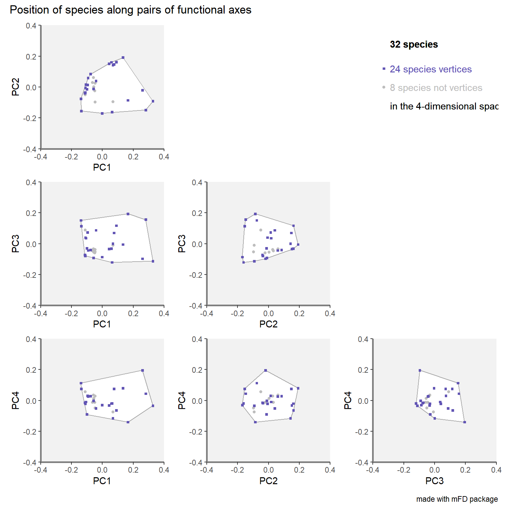{width=768}
:::

```{.r .cell-code}
ggsave("functional_space_lm.png", path = "figures", dpi = 700, height = 9, width = 9)
```
:::

::: {.cell}

```{.r .cell-code}
big_plot$PC1_PC2
```

::: {.cell-output-display}
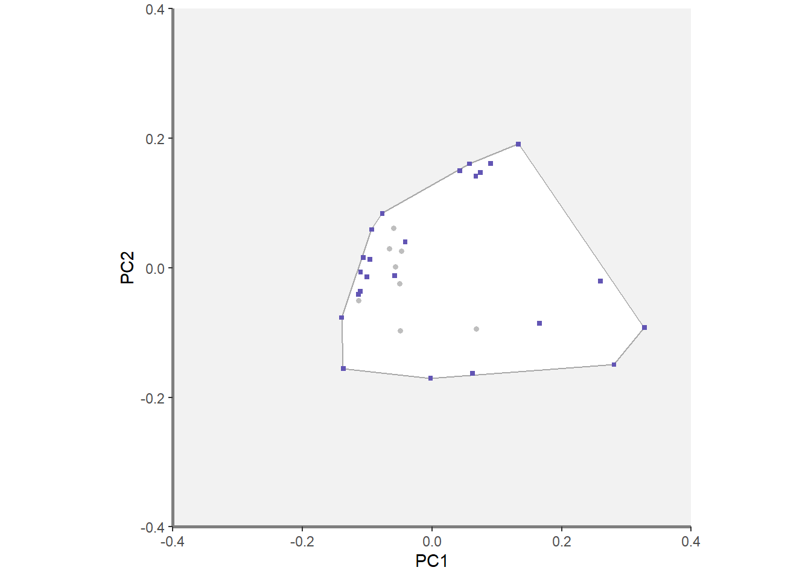{width=672}
:::

```{.r .cell-code}
ggsave("functional_space_lm_PC1.png", path = "figures", dpi = 700, height = 2, width = 2)
```
:::

::: {.cell}

```{.r .cell-code}
big_plot$PC3_PC4
```

::: {.cell-output-display}
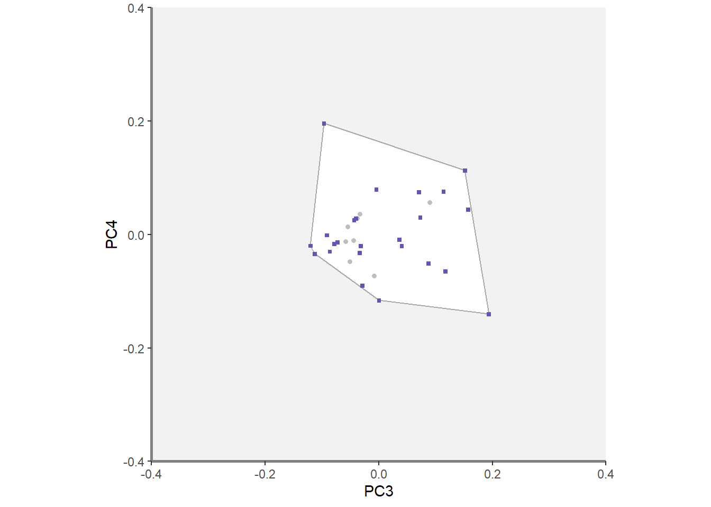{width=672}
:::

```{.r .cell-code}
ggsave("functional_space_lm_PC3.png", path = "figures", dpi = 700, height = 2, width = 2)
```
:::


# 3. Bathypelagic
## Species * assemblages matrix


::: {.cell}

```{.r .cell-code}
#merge all matrix ----
depth_fish_biomass <- rbind(data_biomass_2002_2019, data_biomass_2021, data_biomass_2022)%>%
  as.data.frame()%>%
  rename("species"="Nom_Scientifique",
         "station"="Code_Station") %>%
  left_join(metadata) %>%
  select(species, Tot_V_HV, depth, volume_filtered)%>%
  # divise biomass by the volume filtered at each trawl (g.m3)
  mutate(biomass_cpu=(Tot_V_HV/volume_filtered)*1000)%>%
  select(species, depth, biomass_cpu)%>%
  # add column with depth layer
  mutate(
    depth_layer = case_when(
      between(depth, 0, 174) ~ "Epipelagic",
      between(depth, 175, 699) ~ "Upper mesopelagic",
      between(depth, 700, 999) ~ "Lower mesopelagic",
      between(depth, 1000, 2000) ~ "Bathypelagic"))%>%
  filter(depth_layer=="Bathypelagic") %>% 
  replace(is.na(.), 0)%>%
  select(-depth)%>%
  group_by(species)%>%
  mutate(biomass=sum(biomass_cpu))%>%
  select(-c(biomass_cpu))%>%
  distinct()%>%
  filter(biomass>0) %>% 
  tidyr::pivot_wider(names_from = species, values_from = biomass)%>%
  replace(is.na(.), 0)%>%
  tibble::column_to_rownames(var = "depth_layer")%>%
    #change species name
  rename("Lampanyctus_ater"="Nannobrachium_atrum")%>%
  rename("Cyclothone_sp"="Cyclothone")%>%
  rename("Stomias_boa"="Stomias_boa_boa") %>%
  as.matrix()

sp_b <- depth_fish_biomass %>% 
  as.data.frame() %>% 
  tibble::rownames_to_column(var = "depth_layer") %>% 
  tidyr::pivot_longer(! depth_layer, names_to = "species", values_to = "biomass")

sp_b_nm <- as.vector(sp_b$species)
```
:::


## Species * traits
### calctulate functional traits 

::: {.cell}

```{.r .cell-code}
# calculate functional numeric traits
numeric_traits <- imputed_data %>%
  na.omit() %>%
  select(-individual_code) %>%
  mutate(
    eye_size = eye_diameter / head_depth,
    orbital_length = eye_diameter / standard_length,
    oral_gape_surface = mouth_width * mouth_depth / body_width * body_depth,
    oral_gape_shape = mouth_depth / mouth_width,
    oral_gape_position = distance_upper_jaws_bottom_head / head_depth,
    lower_jaw_length = lower_jaw_length / standard_length,
    head_length = head_length / standard_length,
    body_depth = body_depth / standard_length,
    pectoral_fin_position = distance_pectoral_bottom_body / body_depth_pectoral_insertion,
    pectoral_fin_insertion = prepectoral_length / standard_length,
    transversal_shape = body_depth / body_width,
    dorsal_fin_insertion = predorsal_length / standard_length,
    eye_position = eye_height / head_depth,
    operculum_volume = operculum_depth / operculum_width,
    gill_outflow = operculum_width,
    caudal_throttle_width = caudal_peduncle_min_depth
  ) %>%
  select(
    species,
    eye_size,
    orbital_length,
    gill_outflow,
    oral_gape_surface,
    oral_gape_shape,
    oral_gape_position,
    lower_jaw_length,
    head_length,
    body_depth,
    pectoral_fin_position,
    pectoral_fin_insertion,
    transversal_shape,
    caudal_throttle_width,
    dorsal_fin_insertion,
    eye_position,
    operculum_volume
  ) %>%
  group_by(species) %>%
  summarise(across(everything(), mean, na.rm = TRUE)) %>%
  filter(species%in%sp_b_nm) %>%
  arrange(species)

# categorical traits for species without NA
cat_morpho <- morpho_data %>%
  select(
    species,
    ventral_photophores,
    gland_head,
    chin_barbel,
    small_teeth,
    large_teeth,
    fang_teeth,
    internal_teeth,
    retractable_teeth,
    gill_raker_types,
    oral_gape_axis
  ) %>%
  na.omit() %>%
  distinct()  %>%
  filter(species%in%sp_b_nm) %>%
  arrange(species)
```
:::

::: {.cell}

```{.r .cell-code}
# combined the two data frames
fish_traits <- numeric_traits %>%
  inner_join(cat_morpho, by = "species") %>%
  arrange(species) %>% 
  tibble::column_to_rownames("species")%>%
  # assign trait type 
  # as.factor for qualitative traits
  mutate_if(is.character, as.factor)%>%
  # as.ordered for ordered variables
  mutate_at(c("gill_raker_types", "oral_gape_axis"), as.ordered)
```
:::

::: {.cell}

```{.r .cell-code}
fish_traits_cat <- utils::read.csv(here::here("data", "fish_traits_cat.csv"), sep = ";", header = T, dec = ".")
```
:::


## Build a functional space using the mFD package


::: {.cell}

```{.r .cell-code}
sp_dist_fish <- mFD::funct.dist(
  sp_tr         = fish_traits,
  tr_cat        = fish_traits_cat,
  metric        = "gower",
  scale_euclid  = "scale_center",
  ordinal_var   = "classic",
  weight_type   = "equal",
  stop_if_NA    = TRUE)
```
:::

::: {.cell}

```{.r .cell-code}
fspaces_quality_fish <- mFD::quality.fspaces(
  sp_dist             = sp_dist_fish,
  maxdim_pcoa         = 10,
  deviation_weighting = "absolute",
  fdist_scaling       = FALSE,
  fdendro             = "average")

## Quality metrics of functional spaces ----
round(fspaces_quality_fish$"quality_fspaces", 3)
```

::: {.cell-output .cell-output-stdout}
```
               mad
pcoa_1d      0.143
pcoa_2d      0.080
pcoa_3d      0.050
pcoa_4d      0.031
pcoa_5d      0.024
pcoa_6d      0.017
pcoa_7d      0.015
pcoa_8d      0.015
pcoa_9d      0.017
pcoa_10d     0.019
tree_average 0.040
```
:::
:::


__Variance explained by each axis__

::: {.cell}

```{.r .cell-code}
# Extract eigenvalues information
eigenvalues_info <- fspaces_quality_fish$"details_fspaces"$"pc_eigenvalues"

# Create a dataframe to store the results
variance_df <- data.frame(
  PC = c("PC1", "PC2", "PC3", "PC4"),
  VarianceExplained = c(
    eigenvalues_info[1, "Cum_corr_eig"] * 100,
    (eigenvalues_info[2, "Cum_corr_eig"] - eigenvalues_info[1, "Cum_corr_eig"]) * 100,
    (eigenvalues_info[3, "Cum_corr_eig"] - eigenvalues_info[2, "Cum_corr_eig"]) * 100,
    (eigenvalues_info[4, "Cum_corr_eig"] - eigenvalues_info[3, "Cum_corr_eig"]) * 100
  )
)

htmltools::tagList(DT::datatable(variance_df))
```

::: {.cell-output-display}

```{=html}
<div class="datatables html-widget html-fill-item" id="htmlwidget-5de2b4037383aebcbe19" style="width:100%;height:auto;"></div>
<script type="application/json" data-for="htmlwidget-5de2b4037383aebcbe19">{"x":{"filter":"none","vertical":false,"data":[["1","2","3","4"],["PC1","PC2","PC3","PC4"],[15.65017213402979,12.01470033022356,7.719597607943523,7.054572689768951]],"container":"<table class=\"display\">\n  <thead>\n    <tr>\n      <th> <\/th>\n      <th>PC<\/th>\n      <th>VarianceExplained<\/th>\n    <\/tr>\n  <\/thead>\n<\/table>","options":{"columnDefs":[{"className":"dt-right","targets":2},{"orderable":false,"targets":0},{"name":" ","targets":0},{"name":"PC","targets":1},{"name":"VarianceExplained","targets":2}],"order":[],"autoWidth":false,"orderClasses":false}},"evals":[],"jsHooks":[]}</script>
```

:::
:::


### __Summary of traits with a significant effect__


::: {.cell}

```{.r .cell-code}
sp_faxes_coord_fish_b <- fspaces_quality_fish$"details_fspaces"$"sp_pc_coord"

fish_tr_faxes <- mFD::traits.faxes.cor(
  sp_tr          = fish_traits, 
  sp_faxes_coord = sp_faxes_coord_fish_b[ , c("PC1", "PC2", "PC3", "PC4")], 
  plot           = F)

## Print traits with significant effect ----
traits_effect <- fish_tr_faxes[which(fish_tr_faxes$p.value< 0.05),] %>% 
  as.data.frame() %>% 
  arrange(axis, desc(value))

htmltools::tagList(DT::datatable(traits_effect))
```

::: {.cell-output-display}

```{=html}
<div class="datatables html-widget html-fill-item" id="htmlwidget-ace2b887718aae252cd2" style="width:100%;height:auto;"></div>
<script type="application/json" data-for="htmlwidget-ace2b887718aae252cd2">{"x":{"filter":"none","vertical":false,"data":[["1","2","3","4","5","6","7","8","9","10","11","12","13","14","15","16","17","18","19","20","21","22","23","24","25","26","27","28","29","30","31","32","33","34","35","36","37","38"],["large_teeth","fang_teeth","orbital_length","gill_raker_types","small_teeth","head_length","pectoral_fin_insertion","gland_head","eye_size","oral_gape_surface","chin_barbel","transversal_shape","internal_teeth","lower_jaw_length","oral_gape_surface","gill_outflow","pectoral_fin_insertion","caudal_throttle_width","body_depth","oral_gape_axis","head_length","gill_raker_types","pectoral_fin_position","large_teeth","eye_size","oral_gape_shape","orbital_length","internal_teeth","oral_gape_axis","transversal_shape","eye_position","body_depth","dorsal_fin_insertion","chin_barbel","ventral_photophores","oral_gape_position","chin_barbel","eye_size"],["PC1","PC1","PC1","PC1","PC1","PC1","PC1","PC1","PC1","PC1","PC1","PC1","PC1","PC2","PC2","PC2","PC2","PC2","PC2","PC2","PC2","PC2","PC2","PC2","PC2","PC2","PC2","PC3","PC3","PC3","PC3","PC3","PC3","PC3","PC4","PC4","PC4","PC4"],["Kruskal-Wallis","Kruskal-Wallis","Linear Model","Kruskal-Wallis","Kruskal-Wallis","Linear Model","Linear Model","Kruskal-Wallis","Linear Model","Linear Model","Kruskal-Wallis","Linear Model","Kruskal-Wallis","Linear Model","Linear Model","Linear Model","Linear Model","Linear Model","Linear Model","Kruskal-Wallis","Linear Model","Kruskal-Wallis","Linear Model","Kruskal-Wallis","Linear Model","Linear Model","Linear Model","Kruskal-Wallis","Kruskal-Wallis","Linear Model","Linear Model","Linear Model","Linear Model","Kruskal-Wallis","Kruskal-Wallis","Linear Model","Kruskal-Wallis","Linear Model"],["eta2","eta2","r2","eta2","eta2","r2","r2","eta2","r2","r2","eta2","r2","eta2","r2","r2","r2","r2","r2","r2","eta2","r2","eta2","r2","eta2","r2","r2","r2","eta2","eta2","r2","r2","r2","r2","eta2","eta2","r2","eta2","r2"],[0.467,0.41,0.397,0.327,0.317,0.316,0.277,0.245,0.173,0.147,0.142,0.113,0.079,0.6879999999999999,0.516,0.458,0.398,0.398,0.397,0.396,0.387,0.376,0.256,0.196,0.189,0.146,0.116,0.641,0.236,0.212,0.204,0.169,0.158,0.104,0.59,0.235,0.176,0.155],[0,0,0,0.0007,0.0003,0.0001,0.0004,0.0011,0.0069,0.0134,0.0107,0.0318,0.0437,0,0,0,0,0,0,0.0002,0,0.0003,0.0007,0.0033,0.0045,0.0137,0.0297,0,0.0042,0.0024,0.0031,0.0076,0.0101,0.0243,0,0.0013,0.0051,0.011]],"container":"<table class=\"display\">\n  <thead>\n    <tr>\n      <th> <\/th>\n      <th>trait<\/th>\n      <th>axis<\/th>\n      <th>test<\/th>\n      <th>stat<\/th>\n      <th>value<\/th>\n      <th>p.value<\/th>\n    <\/tr>\n  <\/thead>\n<\/table>","options":{"columnDefs":[{"className":"dt-right","targets":[5,6]},{"orderable":false,"targets":0},{"name":" ","targets":0},{"name":"trait","targets":1},{"name":"axis","targets":2},{"name":"test","targets":3},{"name":"stat","targets":4},{"name":"value","targets":5},{"name":"p.value","targets":6}],"order":[],"autoWidth":false,"orderClasses":false}},"evals":[],"jsHooks":[]}</script>
```

:::
:::


## Plotting the selected functional space and position of species

::: {.cell}

```{.r .cell-code}
sp_faxes_coord_fish <- fspaces_quality_fish$"details_fspaces"$"sp_pc_coord"

big_plot <- mFD::funct.space.plot(
  sp_faxes_coord  = sp_faxes_coord_fish[ , c("PC1", "PC2", "PC3", "PC4")],
  faxes           = c("PC1", "PC2", "PC3", "PC4"),
  name_file       = NULL,
  faxes_nm        = NULL,
  range_faxes = c(-0.4,0.4),
  plot_ch         = TRUE,
  shape_pool      = 20,
  size_pool = 2.5,
  size_vert = 1.5,
  color_ch = "darkgrey",
  color_vert      = "#3C685A",
  fill_vert       = "#3C685A",
  color_pool = "grey",
  plot_vertices   = TRUE,
  check_input     = TRUE)

big_plot$"patchwork"
```

::: {.cell-output-display}
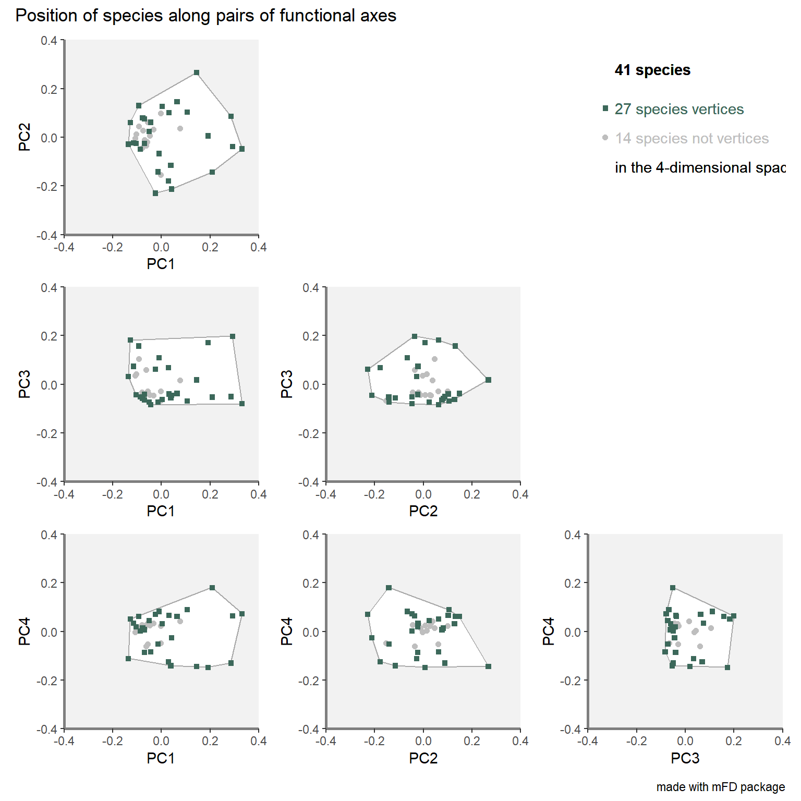{width=768}
:::

```{.r .cell-code}
ggsave("functional_space_b.png", path = "figures", dpi = 700, height = 9, width = 9)
```
:::

::: {.cell}

```{.r .cell-code}
big_plot$PC1_PC2
```

::: {.cell-output-display}
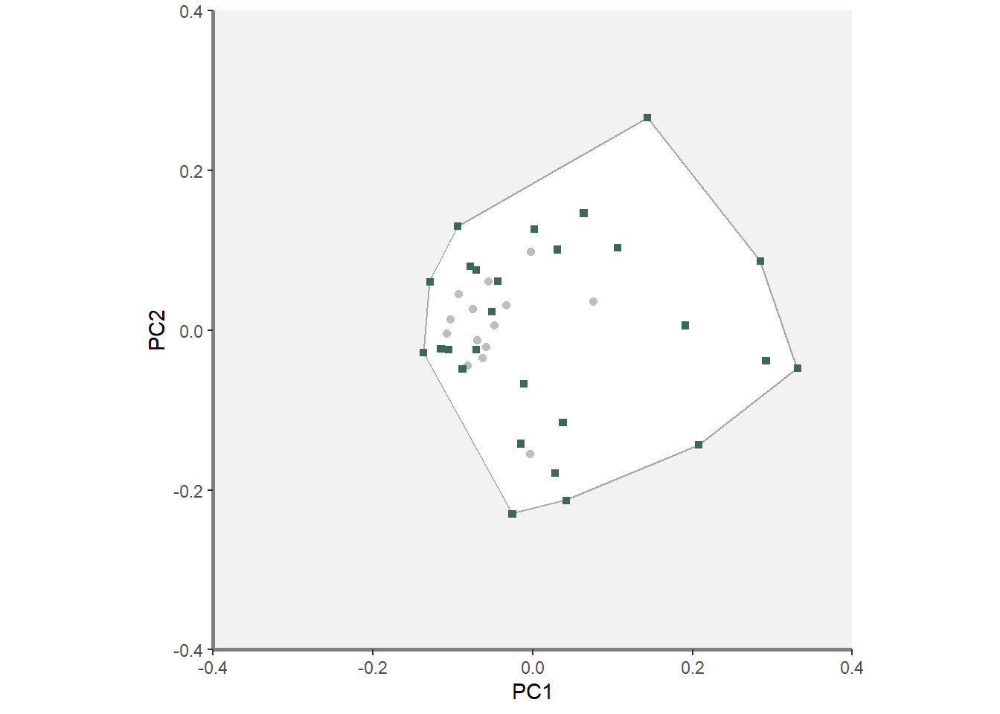{width=672}
:::

```{.r .cell-code}
ggsave("functional_space_b_PC1.png", path = "figures", dpi = 700, height = 2, width = 2)
```
:::

::: {.cell}

```{.r .cell-code}
big_plot$PC3_PC4
```

::: {.cell-output-display}
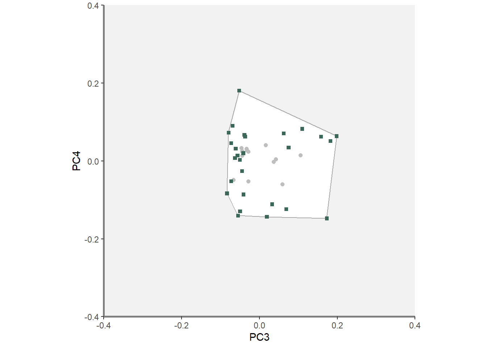{width=672}
:::

```{.r .cell-code}
ggsave("functional_space_b_PC3.png", path = "figures", dpi = 700, height = 2, width = 2)
```
:::


# 4. Total community 
## Plotting the selected functional space and position of species

::: {.cell}

```{.r .cell-code}
sp_faxes_coord_fish <- fspaces_quality_fish$"details_fspaces"$"sp_pc_coord"

big_plot <- mFD::funct.space.plot(
  sp_faxes_coord  = sp_faxes_coord_fish[ , c("PC1", "PC2", "PC3", "PC4")],
  faxes           = c("PC1", "PC2", "PC3", "PC4"),
  name_file       = NULL,
  faxes_nm        = NULL,
  range_faxes = c(-0.4,0.4),
  plot_ch         = TRUE,
  shape_pool      = 20,
  size_pool = 2.5,
  size_vert = 1.5,
  color_ch = "darkgrey",
  color_vert      = "black",
  fill_vert       = "black",
  color_pool = "grey",
  plot_vertices   = TRUE,
  check_input     = TRUE)

big_plot$"patchwork"
```

::: {.cell-output-display}
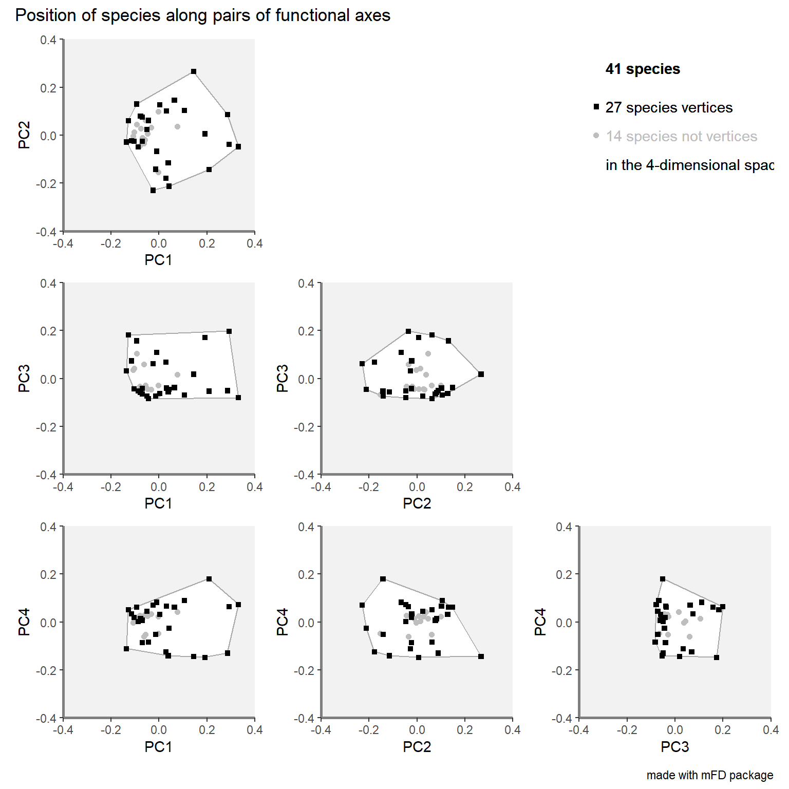{width=768}
:::

```{.r .cell-code}
ggsave("functional_space_b.png", path = "figures", dpi = 700, height = 9, width = 9)
```
:::

::: {.cell}

```{.r .cell-code}
big_plot$PC1_PC2
```

::: {.cell-output-display}
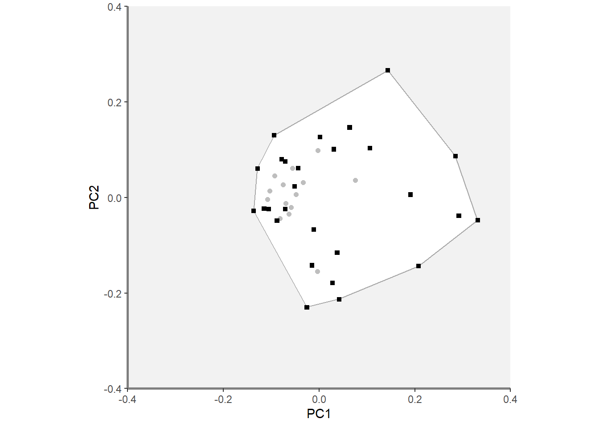{width=672}
:::

```{.r .cell-code}
ggsave("functional_space_PC1.png", path = "figures", dpi = 700, height = 4, width = 4)
```
:::

::: {.cell}

```{.r .cell-code}
big_plot$PC3_PC4
```

::: {.cell-output-display}
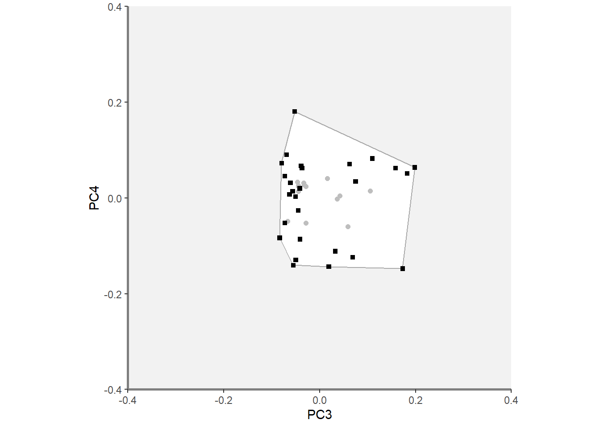{width=672}
:::

```{.r .cell-code}
ggsave("functional_space_PC3.png", path = "figures", dpi = 700, height = 4, width = 4)
```
:::
