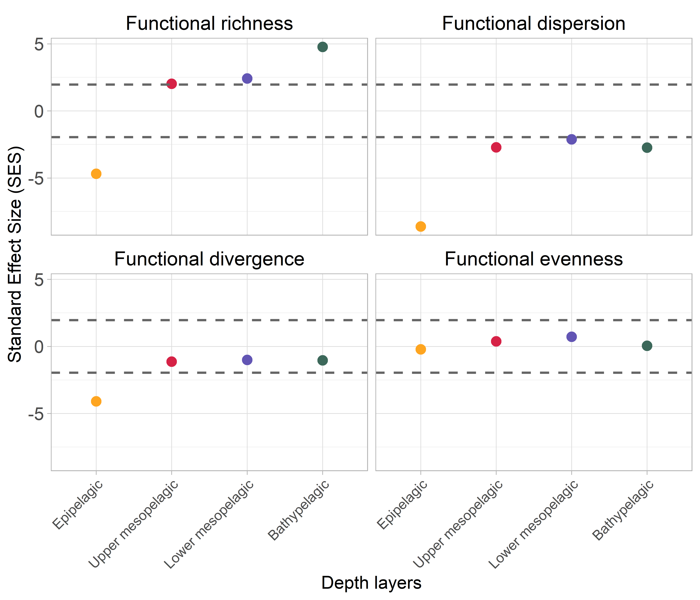
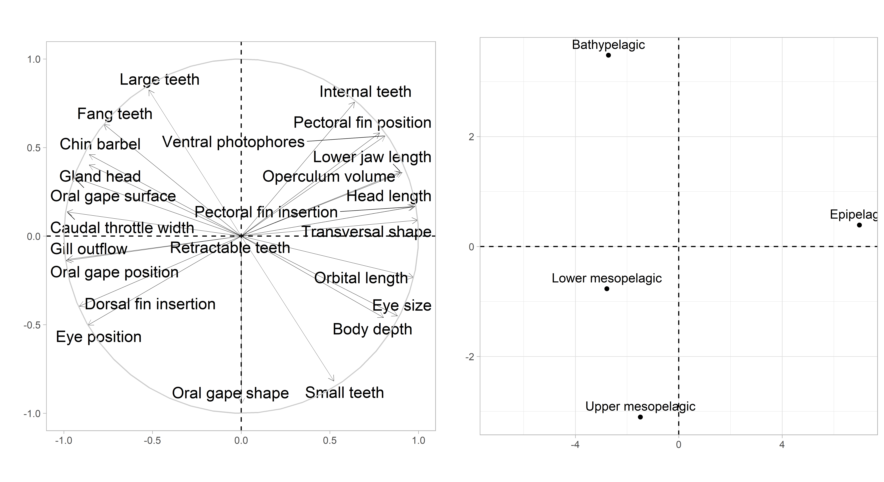
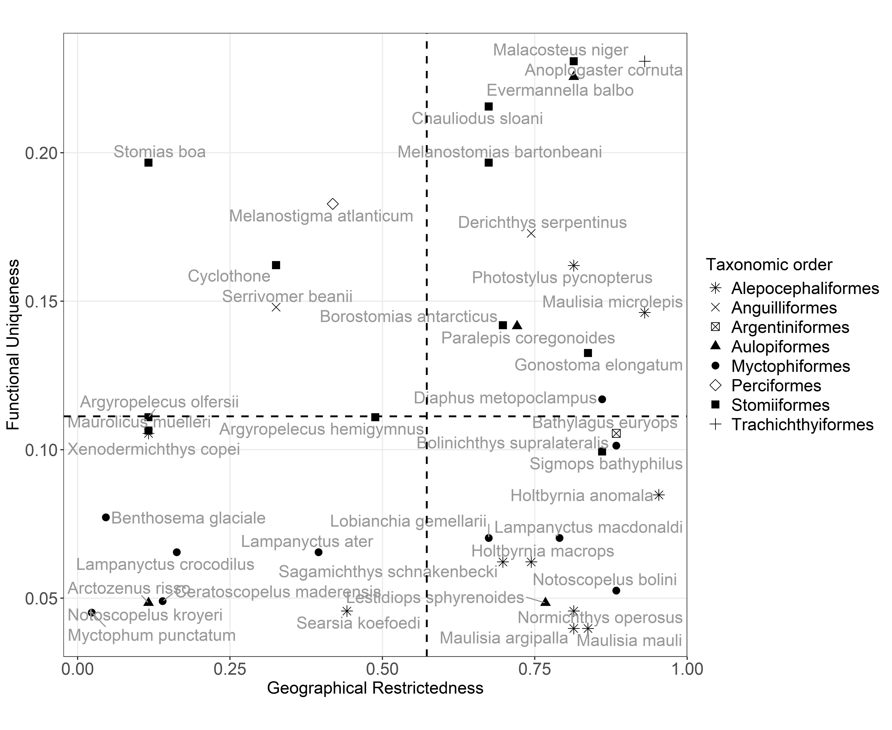

# 1. Workflow 
- You can use the scroll wheel to zoom in on the graph to view a specific element. 


::: {.cell}

```{.r .cell-code}
library(dplyr)
targets::tar_visnetwork()
```

::: {.cell-output .cell-output-stdout}

```

Attachement du package : 'dplyr'

Les objets suivants sont masqués depuis 'package:stats':

    filter, lag

Les objets suivants sont masqués depuis 'package:base':

    intersect, setdiff, setequal, union

```


:::

::: {.cell-output-display}


```{=html}
<div class="visNetwork html-widget html-fill-item" id="htmlwidget-94f5e7988b31282dcf6d" style="width:100%;height:464px;"></div>
<script type="application/json" data-for="htmlwidget-94f5e7988b31282dcf6d">{"x":{"nodes":{"name":["ACP_function","ACP_plot","calcul_functional_ri","cat_morpho","compute_SES","CWM_calcul","CWM_results","data_biomass_2002_2019","data_biomass_2021_2022","data_CWM","dbFD_result_sim","depth_fish_biomass","final_CWM_plot","fish_traits","fish_traits_cat","format_data_CWM","fspaces_quality_fish","functional_rarity","functional_space","functional_space_plot","imputation","imputed_data","morpho_data","numeric_traits","original_data","plot_CWM","plot_SES","plot_SES_fig","randomize_traits","run_simulations","save_plot","SES_combined","sp_dist_fish","sp_faxes_coord_fish","sp_names","taxonomic_families"],"type":["function","stem","function","stem","function","function","stem","stem","stem","stem","stem","stem","stem","stem","stem","function","stem","stem","stem","function","stem","stem","stem","stem","stem","function","function","stem","function","function","stem","stem","stem","stem","stem","stem"],"description":[null,null,null,null,null,null,null,null,null,null,null,null,null,null,null,null,null,null,null,null,null,null,null,null,null,null,null,null,null,null,null,null,null,null,null,null],"status":["uptodate","uptodate","uptodate","uptodate","uptodate","uptodate","uptodate","uptodate","uptodate","uptodate","uptodate","uptodate","uptodate","uptodate","uptodate","uptodate","uptodate","uptodate","uptodate","uptodate","uptodate","uptodate","uptodate","uptodate","uptodate","uptodate","uptodate","uptodate","uptodate","uptodate","uptodate","uptodate","uptodate","uptodate","uptodate","uptodate"],"seconds":[null,5.06,null,0.02,null,null,65.53,0.47,0.18,0.17,255.73,0.06,12.36,0.02,0.86,null,0.05,5.67,2.84,null,16.72,0,0.86,0.21,0,null,null,0.05,null,null,0.72,0.7,0.51,0,0,0.03],"bytes":[null,71,null,982,null,null,2695462,3985,1819,100617,122973,1742,76,6386,400,null,220357,77,80,null,84435,34735,35421,6064,34708,null,null,165498,null,null,72,375,112289,4004,595,907],"branches":[null,null,null,null,null,null,null,null,null,null,null,null,null,null,null,null,null,null,null,null,null,null,null,null,null,null,null,null,null,null,null,null,null,null,null,null],"label":["ACP_function","ACP_plot","calcul_functional_ri","cat_morpho","compute_SES","CWM_calcul","CWM_results","data_biomass_2002_2019","data_biomass_2021_2022","data_CWM","dbFD_result_sim","depth_fish_biomass","final_CWM_plot","fish_traits","fish_traits_cat","format_data_CWM","fspaces_quality_fish","functional_rarity","functional_space","functional_space_plot","imputation","imputed_data","morpho_data","numeric_traits","original_data","plot_CWM","plot_SES","plot_SES_fig","randomize_traits","run_simulations","save_plot","SES_combined","sp_dist_fish","sp_faxes_coord_fish","sp_names","taxonomic_families"],"color":["#354823","#354823","#354823","#354823","#354823","#354823","#354823","#354823","#354823","#354823","#354823","#354823","#354823","#354823","#354823","#354823","#354823","#354823","#354823","#354823","#354823","#354823","#354823","#354823","#354823","#354823","#354823","#354823","#354823","#354823","#354823","#354823","#354823","#354823","#354823","#354823"],"id":["ACP_function","ACP_plot","calcul_functional_ri","cat_morpho","compute_SES","CWM_calcul","CWM_results","data_biomass_2002_2019","data_biomass_2021_2022","data_CWM","dbFD_result_sim","depth_fish_biomass","final_CWM_plot","fish_traits","fish_traits_cat","format_data_CWM","fspaces_quality_fish","functional_rarity","functional_space","functional_space_plot","imputation","imputed_data","morpho_data","numeric_traits","original_data","plot_CWM","plot_SES","plot_SES_fig","randomize_traits","run_simulations","save_plot","SES_combined","sp_dist_fish","sp_faxes_coord_fish","sp_names","taxonomic_families"],"level":[1,11,1,2,1,1,10,8,8,9,10,9,11,6,1,1,8,10,10,1,3,4,1,5,2,1,1,12,1,2,13,11,7,9,7,8],"shape":["triangle","dot","triangle","dot","triangle","triangle","dot","dot","dot","dot","dot","dot","dot","dot","dot","triangle","dot","dot","dot","triangle","dot","dot","dot","dot","dot","triangle","triangle","dot","triangle","triangle","dot","dot","dot","dot","dot","dot"]},"edges":{"from":["ACP_function","CWM_results","morpho_data","data_CWM","CWM_calcul","sp_names","sp_names","data_biomass_2002_2019","data_biomass_2021_2022","morpho_data","format_data_CWM","depth_fish_biomass","run_simulations","fish_traits","data_biomass_2002_2019","data_biomass_2021_2022","CWM_results","plot_CWM","cat_morpho","numeric_traits","sp_dist_fish","calcul_functional_ri","data_biomass_2002_2019","taxonomic_families","depth_fish_biomass","data_biomass_2021_2022","sp_dist_fish","depth_fish_biomass","sp_faxes_coord_fish","functional_space_plot","original_data","imputation","imputed_data","morpho_data","plot_SES","SES_combined","randomize_traits","plot_SES_fig","fish_traits","depth_fish_biomass","compute_SES","dbFD_result_sim","fish_traits","fish_traits_cat","fspaces_quality_fish","fish_traits","sp_names"],"to":["ACP_plot","ACP_plot","cat_morpho","CWM_results","CWM_results","data_biomass_2002_2019","data_biomass_2021_2022","data_CWM","data_CWM","data_CWM","data_CWM","dbFD_result_sim","dbFD_result_sim","dbFD_result_sim","depth_fish_biomass","depth_fish_biomass","final_CWM_plot","final_CWM_plot","fish_traits","fish_traits","fspaces_quality_fish","functional_rarity","functional_rarity","functional_rarity","functional_rarity","functional_rarity","functional_rarity","functional_space","functional_space","functional_space","imputation","imputed_data","numeric_traits","original_data","plot_SES_fig","plot_SES_fig","run_simulations","save_plot","SES_combined","SES_combined","SES_combined","SES_combined","sp_dist_fish","sp_dist_fish","sp_faxes_coord_fish","sp_names","taxonomic_families"],"color":["#354823","#354823","#354823","#354823","#354823","#354823","#354823","#354823","#354823","#354823","#354823","#354823","#354823","#354823","#354823","#354823","#354823","#354823","#354823","#354823","#354823","#354823","#354823","#354823","#354823","#354823","#354823","#354823","#354823","#354823","#354823","#354823","#354823","#354823","#354823","#354823","#354823","#354823","#354823","#354823","#354823","#354823","#354823","#354823","#354823","#354823","#354823"],"arrows":["to","to","to","to","to","to","to","to","to","to","to","to","to","to","to","to","to","to","to","to","to","to","to","to","to","to","to","to","to","to","to","to","to","to","to","to","to","to","to","to","to","to","to","to","to","to","to"]},"nodesToDataframe":true,"edgesToDataframe":true,"options":{"width":"100%","height":"100%","nodes":{"shape":"dot","physics":false},"manipulation":{"enabled":false},"edges":{"smooth":{"type":"cubicBezier","forceDirection":"horizontal"}},"physics":{"stabilization":false},"interaction":{"zoomSpeed":1},"layout":{"hierarchical":{"enabled":true,"levelSeparation":150,"direction":"LR"}}},"groups":null,"width":null,"height":null,"idselection":{"enabled":false,"style":"width: 150px; height: 26px","useLabels":true,"main":"Select by id"},"byselection":{"enabled":false,"style":"width: 150px; height: 26px","multiple":false,"hideColor":"rgba(200,200,200,0.5)","highlight":false},"main":{"text":"","style":"font-family:Georgia, Times New Roman, Times, serif;font-weight:bold;font-size:20px;text-align:center;"},"submain":null,"footer":null,"background":"rgba(0, 0, 0, 0)","highlight":{"enabled":true,"hoverNearest":false,"degree":{"from":1,"to":1},"algorithm":"hierarchical","hideColor":"rgba(200,200,200,0.5)","labelOnly":true},"collapse":{"enabled":true,"fit":false,"resetHighlight":true,"clusterOptions":null,"keepCoord":true,"labelSuffix":"(cluster)"},"legend":{"width":0.2,"useGroups":false,"position":"right","ncol":1,"stepX":100,"stepY":100,"zoom":true,"nodes":{"label":["Up to date","Function","Regular\ntarget"],"color":["#354823","#899DA4","#899DA4"],"shape":["dot","triangle","dot"]},"nodesToDataframe":true},"tooltipStay":300,"tooltipStyle":"position: fixed;visibility:hidden;padding: 5px;white-space: nowrap;font-family: verdana;font-size:14px;font-color:#000000;background-color: #f5f4ed;-moz-border-radius: 3px;-webkit-border-radius: 3px;border-radius: 3px;border: 1px solid #808074;box-shadow: 3px 3px 10px rgba(0, 0, 0, 0.2);"},"evals":[],"jsHooks":[]}</script>
```


:::
:::


# 2. Data
- summary of size and number of individuals measured by species 


::: {.cell}

```{.r .cell-code  code-fold="true"}
summary_morpho_data <- targets::tar_read(morpho_data) %>%
  group_by(species) %>%
  summarise(
    n = n(),
    # Convert to cm
    SL_mean = round(mean(standard_length / 10, na.rm = TRUE), 2),  
    SL_sd = round(sd(standard_length / 10, na.rm = TRUE), 1),
    SL_mean_sd = paste0(SL_mean, " ± ", SL_sd)                    
  ) %>% 
  select(species, n, SL_mean_sd)

htmltools::tagList(DT::datatable(summary_morpho_data))
```

::: {.cell-output-display}


```{=html}
<div class="datatables html-widget html-fill-item" id="htmlwidget-5f4e6cb08ac7a6a17c2b" style="width:100%;height:auto;"></div>
<script type="application/json" data-for="htmlwidget-5f4e6cb08ac7a6a17c2b">{"x":{"filter":"none","vertical":false,"data":[["1","2","3","4","5","6","7","8","9","10","11","12","13","14","15","16","17","18","19","20","21","22","23","24","25","26","27","28","29","30","31","32","33","34","35","36","37","38","39","40","41"],["Anoplogaster_cornuta","Arctozenus_risso","Argyropelecus_hemigymnus","Argyropelecus_olfersii","Bathylagus_euryops","Benthosema_glaciale","Bolinichthys_supralateralis","Borostomias_antarcticus","Ceratoscopelus_maderensis","Chauliodus_sloani","Cyclothone_sp","Derichthys_serpentinus","Diaphus_metopoclampus","Evermannella_balbo","Gonostoma_elongatum","Holtbyrnia_anomala","Holtbyrnia_macrops","Lampanyctus_ater","Lampanyctus_crocodilus","Lampanyctus_macdonaldi","Lestidiops_sphyrenoides","Lobianchia_gemellarii","Malacosteus_niger","Maulisia_argipalla","Maulisia_mauli","Maulisia_microlepis","Maurolicus_muelleri","Melanostigma_atlanticum","Melanostomias_bartonbeani","Myctophum_punctatum","Normichthys_operosus","Notoscopelus_bolini","Notoscopelus_kroyeri","Paralepis_coregonoides","Photostylus_pycnopterus","Sagamichthys_schnakenbecki","Searsia_koefoedi","Serrivomer_beanii","Sigmops_bathyphilus","Stomias_boa","Xenodermichthys_copei"],[3,30,17,37,19,20,11,14,30,12,12,7,4,4,3,3,9,22,39,21,7,22,5,5,11,4,11,20,9,25,38,20,36,19,8,9,36,30,20,26,38],["12.98 ± 1.7","15.84 ± 1.5","3.08 ± 0.4","5.66 ± 1.1","12.32 ± 3.6","4.28 ± 0.2","9.59 ± 0.6","12.17 ± 5.6","6.27 ± 0.7","22.91 ± 5.9","5.3 ± 0.6","22.6 ± 3.3","6.06 ± 1.7","10.47 ± 0.3","23.57 ± 1.4","6.64 ± 0.7","7.9 ± 2.3","10.93 ± 1.1","10.76 ± 1.7","12.91 ± 0.6","14.78 ± 0.9","8.25 ± 0.7","15.72 ± 4.1","9.51 ± 1.9","11.69 ± 2.8","23.12 ± 2.2","3.16 ± 0.2","8.38 ± 1.1","23.28 ± 2.5","6.55 ± 0.8","10.47 ± 1.8","7.59 ± 0.4","7.63 ± 1.6","7.33 ± 1.5","9.58 ± 1.5","9.16 ± 2.1","11.99 ± 1.4","54.62 ± 12.1","9.18 ± 1.8","23.9 ± 4.5","10.97 ± 1.2"]],"container":"<table class=\"display\">\n  <thead>\n    <tr>\n      <th> <\/th>\n      <th>species<\/th>\n      <th>n<\/th>\n      <th>SL_mean_sd<\/th>\n    <\/tr>\n  <\/thead>\n<\/table>","options":{"columnDefs":[{"className":"dt-right","targets":2},{"orderable":false,"targets":0},{"name":" ","targets":0},{"name":"species","targets":1},{"name":"n","targets":2},{"name":"SL_mean_sd","targets":3}],"order":[],"autoWidth":false,"orderClasses":false}},"evals":[],"jsHooks":[]}</script>
```


:::
:::


# 3. Functional spaces 
- Representation of the functional space on principal coordinates 1 and 2 for the whole community, with vertice species represented by black triangles and non-vertice species by grey dots. 

- The representation of the different depth layers shows the total functional space of the community and the species absent from the depth layer in grey, while the depth functional space and the species present (dots) within it are shown in colour.


::: {.cell}

```{.r .cell-code  code-fold="true"}
targets::tar_load(functional_space)
knitr::include_graphics(functional_space)
```

::: {.cell-output-display}
{width=4000}
:::
:::


# 4. Standardized effect size 

- The workflow shows how SES has been calculated as a function of the normal or non-normal distribution of the simulated data, and whether the log transformation has permitted a normal distribution.

- To test for significant deviation of SES values from random expectations, the distribution of simulated values of each functional diversity index measured at the sampling station and depth layer level (i.e. richness, divergence, dispersal and evenness) must be symmetric and normally distributed (Botta-Dukát, 2018). Therefore, the distribution of randomly obtained values for each index was tested for normality using the Shapiro-Wilk test, and skewness was assessed to check for symmetry. Assuming a Gaussian distribution, assemblages with SES values greater than 1.96 or less than -1.96 are considered to significantly deviate from random expectations, indicating cases where either environmental filtering or limiting similarity plays a dominant role in shaping the community’s functional composition. When the normality assumption was violated, we log-transformed the simulated indices and used the 97.5% and 2.5% percentiles to test for significant deviations from random expectations.


- Standardized effect size (SES) values of functional richness, evenness, divergence, and evenness calculated by depth layer. The epipelagic layer is represented in yellow, the upper-mesopelagic layer in red, the lower-mesopelagic layer in purple and the bathypelagic in green


::: {.cell}

```{.r .cell-code  code-fold="true"}
targets::tar_load(save_plot)
knitr::include_graphics(save_plot)
```

::: {.cell-output-display}
{width=2450}
:::
:::


# 5. Community biomass-weighted mean  

- Shift in community biomass-weighted mean (CWM) of each trait along the depth gradient. Each point represents the mean of the bootstrapped values in a sampled depth. The boxplots group the values by depth layer: the epipelagic layer in yellow, the upper mesopelagic layer in red, the lower mesopelagic layer in purple and the bathypelagic layer in green


::: {.cell}

```{.r .cell-code  code-fold="true"}
targets::tar_load(final_CWM_plot)
knitr::include_graphics(final_CWM_plot)
```

::: {.cell-output-display}
{width=4800}
:::
:::


- Principal component analysis (PCA) based on the median values of community biomass-weighted mean (CWM) for each trait, with the correlation circle (A) and individual representations (B).


::: {.cell}

```{.r .cell-code  code-fold="true"}
targets::tar_load(ACP_plot)
knitr::include_graphics(ACP_plot)
```

::: {.cell-output-display}
{width=3850}
:::
:::


# 6. Functional rarity
- Relationship between functional uniqueness and geographical restrictiveness of each species. The dashed lines represented the median values of each index at the community level.


::: {.cell}

```{.r .cell-code  code-fold="true"}
targets::tar_load(functional_rarity)
knitr::include_graphics(functional_rarity)
```

::: {.cell-output-display}
{width=3850}
:::
:::