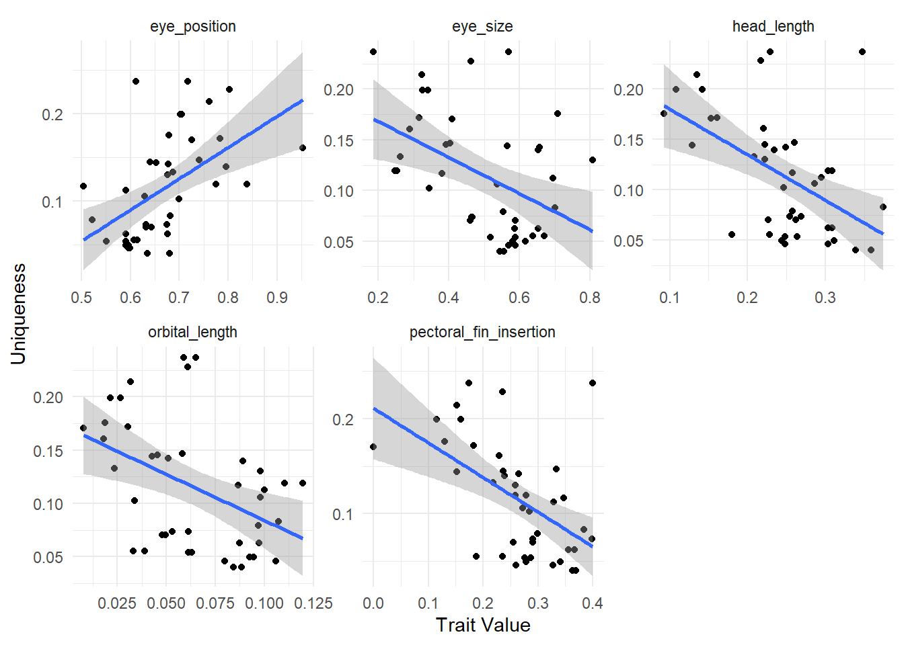
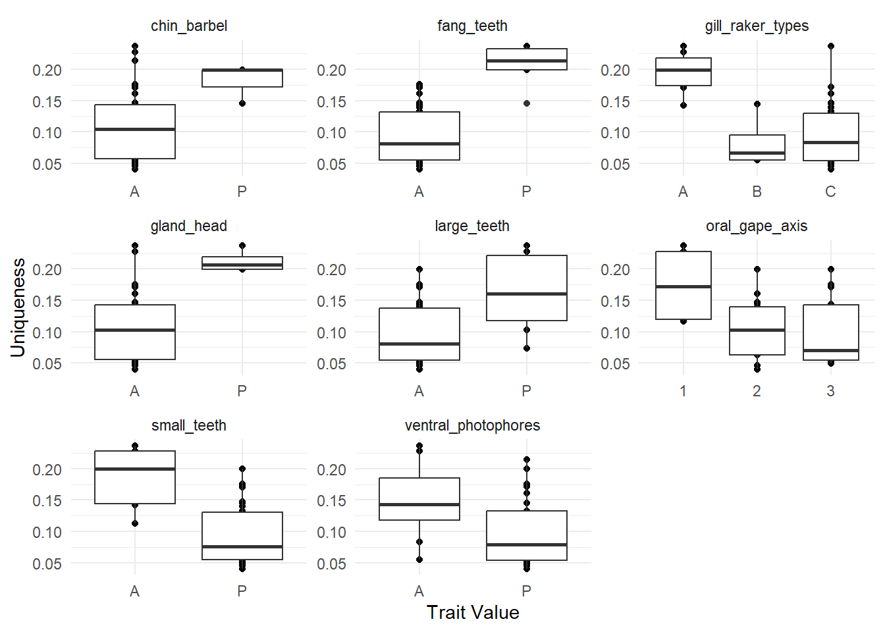

# Data preparation

::: {.cell}

```{.r .cell-code}
library(dplyr)
library(ggplot2)

morphometric_data <- utils::read.csv(here::here("data", "morphometric_data.csv"), sep = ";", header = T, dec = ".")

morpho_data <- morphometric_data %>%
  select(-c(variable_abbreviation, variable_unit)) %>%
  t() %>%
  as.data.frame() %>%
  janitor::row_to_names(row_number = 1) %>%
  `rownames<-`(NULL)%>%
  # delete for now (n=1)
  filter(species!= "Diaphus_sp")

# replace empty value by NA 
morpho_data[morpho_data ==""] <- NA

# Numeric variables
morpho_data[, 4:23] <- sapply(morpho_data[, 4:23], as.numeric)
```
:::


__Data summary__

::: {.cell}

```{.r .cell-code}
morpho_data_summary <-morpho_data %>%
  group_by(species) %>%
  count(species)

htmltools::tagList(DT::datatable(morpho_data_summary))
```

::: {.cell-output-display}

```{=html}
<div class="datatables html-widget html-fill-item" id="htmlwidget-a543c1faf5d52378ab59" style="width:100%;height:auto;"></div>
<script type="application/json" data-for="htmlwidget-a543c1faf5d52378ab59">{"x":{"filter":"none","vertical":false,"data":[["1","2","3","4","5","6","7","8","9","10","11","12","13","14","15","16","17","18","19","20","21","22","23","24","25","26","27","28","29","30","31","32","33","34","35","36","37","38","39","40","41","42"],["Anoplogaster_cornuta","Arctozenus_risso","Argyropelecus_hemigymnus","Argyropelecus_olfersii","Bathylagus_euryops","Benthosema_glaciale","Bolinichthys_supralateralis","Borostomias_antarcticus","Ceratoscopelus_maderensis","Chauliodus_sloani","Cyclothone_sp","Derichthys_serpentinus","Diaphus_metopoclampus","Eurypharynx_pelecanoides","Evermannella_balbo","Gonostoma_elongatum","Holtbyrnia_anomala","Holtbyrnia_macrops","Lampanyctus_ater","Lampanyctus_crocodilus","Lampanyctus_macdonaldi","Lestidiops_sphyrenoides","Lobianchia_gemellarii","Malacosteus_niger","Maulisia_argipalla","Maulisia_mauli","Maulisia_microlepis","Maurolicus_muelleri","Melanostigma_atlanticum","Melanostomias_bartonbeani","Myctophum_punctatum","Normichthys_operosus","Notoscopelus_bolini","Notoscopelus_kroyeri","Paralepis_coregonoides","Photostylus_pycnopterus","Sagamichthys_schnakenbecki","Searsia_koefoedi","Serrivomer_beanii","Sigmops_bathyphilus","Stomias_boa","Xenodermichthys_copei"],[3,30,17,37,19,20,11,14,30,12,12,7,4,6,4,3,3,9,22,39,21,7,22,5,5,11,4,11,20,9,25,38,20,36,19,8,9,36,30,20,26,38]],"container":"<table class=\"display\">\n  <thead>\n    <tr>\n      <th> <\/th>\n      <th>species<\/th>\n      <th>n<\/th>\n    <\/tr>\n  <\/thead>\n<\/table>","options":{"columnDefs":[{"className":"dt-right","targets":2},{"orderable":false,"targets":0},{"name":" ","targets":0},{"name":"species","targets":1},{"name":"n","targets":2}],"order":[],"autoWidth":false,"orderClasses":false}},"evals":[],"jsHooks":[]}</script>
```

:::
:::


## Missing data 
The operculum width was the variable with the highest number of missing data (n = 30). This represents 4% of the data 

__2 species with only NAs for an entire trait:__

+ _Eurpharynx pelecanoides_ : 7 traits
+ _Melanostigma atlanticum_ : 2 traits


::: {.cell}

:::


### data imputation  
- mice algorithm: n imputation = 5, n iterations = 50
- plot comparison for Operculum Width

::: {.cell}

```{.r .cell-code}
#select numeric variables for imputation 
original_data <- morpho_data %>%
  select(1:23)

imputation <-
  mice::mice(
    original_data,
    m = 5,
    maxit = 50,
    printFlag = F
  )

imputed_data <- mice::complete(imputation)

comparison <- tibble::tibble(species = original_data$species,
                             standard_length = original_data$standard_length,
                             Original = original_data$operculum_width,
                             Imputed = imputed_data$operculum_width) %>%
  arrange(species, standard_length)

ggplot(comparison, aes(standard_length, Imputed, col = is.na(Original))) +
  geom_point(size = 2, alpha=0.8) +
  facet_wrap(~species, scales = "free") +
  labs(col = "Imputed?") +
  scale_color_manual(values = c("grey60", "firebrick2")) +
  theme_bw()
```

::: {.cell-output-display}
{width=1248}
:::
:::

## Species * traits
### calctulate functional traits 

::: {.cell}

```{.r .cell-code}
# calculate functional numeric traits
numeric_traits <- imputed_data %>%
  na.omit() %>%
  select(-individual_code) %>%
  mutate(
    eye_size = eye_diameter / head_depth,
    orbital_length = eye_diameter / standard_length,
    oral_gape_surface = mouth_width * mouth_depth / body_width * body_depth,
    oral_gape_shape = mouth_depth / mouth_width,
    oral_gape_position = distance_upper_jaws_bottom_head / head_depth,
    lower_jaw_length = lower_jaw_length / standard_length,
    head_length = head_length / standard_length,
    body_depth = body_depth / standard_length,
    pectoral_fin_position = distance_pectoral_bottom_body / body_depth_pectoral_insertion,
    pectoral_fin_insertion = prepectoral_length / standard_length,
    transversal_shape = body_depth / body_width,
    dorsal_fin_insertion = predorsal_length / standard_length,
    eye_position = eye_height / head_depth,
    operculum_volume = operculum_depth / operculum_width,
    gill_outflow = operculum_width,
    caudal_throttle_width = caudal_peduncle_min_depth
  ) %>%
  select(
    species,
    eye_size,
    orbital_length,
    gill_outflow,
    oral_gape_surface,
    oral_gape_shape,
    oral_gape_position,
    lower_jaw_length,
    head_length,
    body_depth,
    pectoral_fin_position,
    pectoral_fin_insertion,
    transversal_shape,
    caudal_throttle_width,
    dorsal_fin_insertion,
    eye_position,
    operculum_volume
  ) %>%
  group_by(species) %>%
  summarise(across(everything(), mean, na.rm = TRUE)) %>%
  arrange(species)

# categorical traits for species without NA
cat_morpho <- morpho_data %>%
  select(
    species,
    ventral_photophores,
    gland_head,
    chin_barbel,
    small_teeth,
    large_teeth,
    fang_teeth,
    retractable_teeth,
    internal_teeth,
    gill_raker_types,
    oral_gape_axis
  ) %>%
    na.omit() %>%
  distinct() %>%
  arrange(species)

# combined the two data frames
fish_traits <- numeric_traits %>%
  inner_join(cat_morpho, by = "species") %>%
  arrange(species) %>% 
  tibble::column_to_rownames("species")%>%
  # assign trait type 
  # as.factor for qualitative traits
  mutate_if(is.character, as.factor)%>%
  # as.ordered for ordered variables
  mutate_at(c("gill_raker_types", "oral_gape_axis"), as.ordered)
```
:::


__Traits density distribution__

::: {.cell}

```{.r .cell-code}
density_plot_traits <- fish_traits[,1:16] %>% 
    tibble::rownames_to_column(var="species") %>% 
    tidyr::pivot_longer(!species, names_to = "traits", values_to = "values")

ggplot(density_plot_traits , aes(values)) +
  geom_histogram(bins = 10,
                 color = "darkgrey",
                 fill = "lightgray") +
  facet_wrap(~ traits, scales = "free") +
  theme_minimal()+
  theme(strip.text.x = element_text(size = 11, face = "bold"))
```

::: {.cell-output-display}
{width=1152}
:::
:::

::: {.cell}

```{.r .cell-code}
## Display the table ----
htmltools::tagList(DT::datatable(fish_traits))
```

::: {.cell-output-display}

```{=html}
<div class="datatables html-widget html-fill-item" id="htmlwidget-5a9f5b828076ec6c6b10" style="width:100%;height:auto;"></div>
<script type="application/json" data-for="htmlwidget-5a9f5b828076ec6c6b10">{"x":{"filter":"none","vertical":false,"data":[["Anoplogaster_cornuta","Arctozenus_risso","Argyropelecus_hemigymnus","Argyropelecus_olfersii","Bathylagus_euryops","Benthosema_glaciale","Bolinichthys_supralateralis","Borostomias_antarcticus","Ceratoscopelus_maderensis","Chauliodus_sloani","Cyclothone_sp","Derichthys_serpentinus","Diaphus_metopoclampus","Evermannella_balbo","Gonostoma_elongatum","Holtbyrnia_anomala","Holtbyrnia_macrops","Lampanyctus_ater","Lampanyctus_crocodilus","Lampanyctus_macdonaldi","Lestidiops_sphyrenoides","Lobianchia_gemellarii","Malacosteus_niger","Maulisia_argipalla","Maulisia_mauli","Maulisia_microlepis","Maurolicus_muelleri","Melanostigma_atlanticum","Melanostomias_bartonbeani","Myctophum_punctatum","Normichthys_operosus","Notoscopelus_bolini","Notoscopelus_kroyeri","Paralepis_coregonoides","Photostylus_pycnopterus","Sagamichthys_schnakenbecki","Searsia_koefoedi","Serrivomer_beanii","Sigmops_bathyphilus","Stomias_boa","Xenodermichthys_copei"],[0.1870635427569378,0.6649637658386287,0.2528378924337218,0.2466185816292626,0.8073379156515913,0.553876225297698,0.6943542959568116,0.3918502902611463,0.61660846298933,0.3236216278441371,0.2896732995527421,0.7087200272405964,0.3806762185788406,0.4619095739058715,0.2627730950311468,0.7001620679316158,0.5861245029650884,0.5876906171451259,0.4605188017400862,0.4635401519874494,0.6379293967644859,0.4655204987772433,0.5686707446196964,0.5560047681071145,0.5436602586272192,0.4040027222573614,0.5366700102175092,0.5653194882201393,0.3404604909527202,0.5810276131287075,0.5877979401415817,0.58721677071155,0.5177971164068327,0.6557709453691855,0.3160340663331095,0.6531117613886723,0.5695641783784532,0.4097905992320632,0.3439623137409401,0.3246954087960091,0.653061224489796],[0.06513101563336203,0.0389287067350115,0.1103521526110715,0.1195337463229555,0.09799331102128857,0.09708002840620254,0.1002020784107539,0.0454502028499367,0.09456299480839496,0.03195944404217845,0.01820101324427989,0.01870641840179216,0.08672361809853502,0.06111392066224541,0.02365859567134613,0.107319044568802,0.09736638359612411,0.04953860514578357,0.04783772722762789,0.05324648475404745,0.03316666671153076,0.06137020103787766,0.0589832944995062,0.08848446584142593,0.0843550572708857,0.05808421042835739,0.0978961923388425,0.04280718124696028,0.02667037338846572,0.09235056814949912,0.105830132758109,0.06117253100231441,0.06286434018346203,0.05113309818745389,0.03048020374468671,0.08748603143506498,0.07967153949171366,0.007796575563762054,0.03401701434877021,0.02147373395945686,0.08897126969416125],[20.92,5.567,5.503529411764706,17.14486486486486,8.536315789473685,4.7555,12.47272727272727,15.79642857142857,5.523,11.205,7.5625,4.751428571428572,6.3725,9.282500000000001,27.92,9.563333333333333,9.283333333333333,18.38136363636364,20.26,25.00333333333333,4.714285714285714,15.45818181818182,21.552,15.524,15.73,21.49,3.591818181818182,4.033,18.11777777777778,5.6848,9.430263157894737,9.629,6.779722222222222,4.898421052631579,6.5525,11.76,9.186666666666667,6.952666666666667,18.1015,6.292692307692308,19.9],[5031.841603275443,138.7767056157077,577.064898839345,3042.322434320248,215.6744532820656,288.0952119082589,857.141772877457,2308.803855788343,279.1498954349838,1427.556961259949,492.0624493762769,102.2063575036608,496.3447641966349,746.3340129817943,6250.383835528853,932.9828515696742,870.8481183231795,1516.361659863597,1550.595807548067,2223.938773657847,183.0964625226904,1226.901459954854,4216.396258458542,3465.852896151474,2055.911596674011,1384.771960858673,186.8514118522354,78.39976364627458,2537.245636289088,234.4223020823153,491.5849749801245,486.4451319733718,258.3737341886404,204.9218117143547,80.09634693327251,831.6177508083089,553.8995912160609,121.0450061746473,4544.83974684605,752.2740417495295,250.3885057471265],[0.5870925935452065,2.714184469914039,1.335486015307016,0.9925153727538065,1.208429987743106,1.157723276407389,1.145308631944953,0.9549389452177165,1.991093317522685,2.198671222745045,2.208300456016669,1.689339435970036,0.9219855888959767,1.283292920158411,0.6068674018540213,1.113954659703871,1.246595443731965,1.144873224338048,1.276737860165135,1.162473804130551,2.303006017405891,1.100038150697565,0.8484726822993502,1.230101510957001,1.163701414828532,1.248535562855231,1.285170782096033,1.345688706965169,1.398821013856888,1.335620964108464,1.182734647205846,1.278747111079255,1.574600363459755,1.327863901099197,1.080061200669548,1.244517534419419,1.112709273727527,0.5320584499681953,1.023028473395861,0.6371746875118129,1.752941176470588],[0.3951426840833095,0.6956161275567915,0.5404276289037069,0.7154754608747875,0.3502518371432042,0.3324025605583356,0.3380289556040331,0.4826993703447641,0.5595395778352831,0.7068627312794583,0.7937932689673789,0.492756633741221,0.3452486634420606,0.5829657156202231,0.4721898773185077,0.4712003973315194,0.3956514300993943,0.569742208754595,0.7716613657494861,0.5744746730161431,0.5520998821851169,0.5212153959103951,0.3530711561087431,0.4631356481458706,0.3738738564459647,0.2036324254692755,0.5855853143839959,0.4857260963559027,0.6176663797525285,0.5678597742789305,0.556466751857582,0.4896021576606608,0.6170545927657207,0.4245107644843942,0.5624538104272562,0.361697362365493,0.5212244711908143,0.586629915236263,0.6490690083932986,0.7508301997654183,0.6394557823129252],[0.2861375317012913,0.1199066289068907,0.2514373364077059,0.266959472951216,0.07531130534246093,0.1884618356794901,0.19638076001865,0.198414842989372,0.2124063307567828,0.1144114643871464,0.2040581908463124,0.04491240788019163,0.1867292921905659,0.1634947940484265,0.1777783246347302,0.2092942077891755,0.2069838979262741,0.1973450981018806,0.210637486787245,0.2048825282290511,0.1027761390567869,0.2223712374577787,0.2544654948963843,0.2078438651875588,0.2120154019923103,0.1744403226406842,0.166670163223075,0.03814429068386168,0.1234687560304594,0.1566457249526299,0.1804848574435944,0.2008815666871479,0.1969321317602301,0.1330213734139315,0.08475918421735412,0.1571232489521016,0.1366886549021795,0.08568386712504511,0.2267422887328622,0.09993380308826154,0.1139944392956441],[0.3471179569492232,0.2282622445820382,0.3034423890185704,0.308301242626706,0.2220189367194796,0.2577329098405489,0.2949444282485461,0.2219516612342632,0.3106831287972612,0.1353122370036637,0.2203047019193976,0.09229259278317947,0.2573417157046858,0.2169720130174164,0.208131053502031,0.3736914296278676,0.3084118074275706,0.2268293066821225,0.2617421786031248,0.2544000525765622,0.179483203158696,0.2690716828129346,0.2291135730880142,0.3581617707887102,0.3386367195769682,0.2602094930995654,0.2861583530888247,0.1289222320266107,0.1414616221329245,0.2434873975369473,0.3036775056329284,0.2484099358389354,0.2638957745998514,0.2491930232735534,0.1610794295053864,0.3035521067765809,0.2480447612095185,0.153233449096655,0.2463809400095261,0.1070417319987341,0.2344763670064875],[0.496765317595603,0.07231486748096279,0.5465676366743593,0.6527711514828205,0.1780472775573514,0.227186906305348,0.23575289155312,0.1471579276088384,0.1957057378562352,0.1139788839951372,0.1385564389886054,0.06475552609724118,0.2868922794103201,0.1854842390181648,0.1439966534398835,0.1995718556257012,0.1884279714218087,0.1634270563148341,0.174943368578538,0.1791292477891186,0.07016698379208147,0.2389029851391781,0.1846729123532705,0.2190923414047283,0.2006259493110997,0.2145214178694734,0.2284769602774343,0.08730489814688717,0.1281404978381019,0.2159343939861771,0.2184135875848383,0.1977431521215698,0.1921466687105275,0.09127720302297426,0.148949033138653,0.1648207240422557,0.2093720644298593,0.02676997296275347,0.1460846094753337,0.08181017986974991,0.1594068582020389],[0.327552178795381,0.2714135002835462,0.2307451284370966,0.2471710436456569,0.1987584730572414,0.4427266302964014,0.4605590043104663,0.1754328409583324,0.4771988618173915,0.289631998528789,0.1992742880547905,0.6600484532653362,0.2369353691925481,0.215888746321026,0.2073022595505449,0.2511962839831692,0.2467697101111054,0.2871973247081183,0.3811405969107963,0.1893801545617711,0.3583607039010895,0.2710821884027898,0.2070338218789051,0.1986434877697646,0.1907795219830297,0.1746990027397655,0.2251067492779084,0.2969553428678601,0.2233648323381441,0.4727531669301591,0.1841559512741846,0.2851868407331372,0.254490059280657,0.2229812001799436,0.4749769701497314,0.2228053867239246,0.2012247420149917,1,0.1973392223033529,0.1824120299750198,0.2203389830508475],[0.4003208996368177,0.2358202027404649,0.2779352032788916,0.2589592489665474,0.2591893413419795,0.2999602281286219,0.3283279074114032,0.2369008386437003,0.3413655289922946,0.1525109091904405,0.2296622405613443,0.1305046806357046,0.3475487347397182,0.234931461549684,0.2185105436064756,0.3836208813775061,0.3557612665211258,0.2573467559825086,0.2912274335906986,0.3991766831105948,0.1873220233715019,0.2905759860794116,0.1740874348298388,0.3692829665519732,0.3636636301971131,0.3343165173045963,0.2720666504252247,0.1473903023684386,0.1596798610655336,0.278532769448776,0.3277484293204377,0.2755915950773311,0.2868597770959138,0.2654937591570808,0.1830307523791412,0.3714438737412757,0.2602312413080092,1.912272743928823e-05,0.2852113862556448,0.1154570911731925,0.2391102873030584],[0.0371234059465991,0.01435870746028057,0.2549015223177563,0.1236266109740932,0.03248901608085705,0.09109791643347125,0.01988857958867888,0.03631916674726406,0.0314179790498654,0.01525793056447875,0.07135857193615111,0.01046142821823197,0.06090709882905589,0.0330170205426,0.01553375842430409,0.06429066383512382,0.04055065658457224,0.02463758734428551,0.01985425410804219,0.01871587454424042,0.01805418174713717,0.03025781637891173,0.02411855326084547,0.07493646258320825,0.03196526524002068,0.01480309413827949,0.1787182752269798,0.04130241912511247,0.01959986641736065,0.03254080223555961,0.01754916162030041,0.02763011114739326,0.02667208329968006,0.06703510034705321,0.02971955680387246,0.04254465702825964,0.01793523328064347,0.003317401467047132,0.08468757530738309,0.01107452305916778,0.0183226273795447],[10.45666666666667,3.639666666666667,3.425882352941176,5.975405405405406,6.301578947368421,3.3485,10.79727272727273,5.527142857142857,5.455333333333334,6.194166666666667,2.8375,2.242857142857143,5.945,6.265,12.76,4.013333333333334,6.078888888888889,8.561818181818182,11.33205128205128,13.30904761904762,2.92,8.897727272727273,8.033999999999999,5.81,7.612727272727272,18.175,2.204545454545455,1.3475,4.792222222222223,4.2856,8.535,6.7935,7.171944444444445,2.601052631578948,3.58375,5.828888888888889,10.18444444444444,1.211666666666667,3.299,3.472692307692308,5],[0.4441498752678317,0.6763292132260318,0.3558469543404688,0.3366190475926993,0.4650644038243057,0.4676150398984861,0.4469769590756064,0.595226309556071,0.4979362376932329,0.2551650456937953,0.5434318108133503,0.3116459625644058,0.4041028771788586,0.4314272231538535,0.5671939001428983,0.6326973503856025,0.6361420651390463,0.4410062335674381,0.4528052962800324,0.4509057936924641,0.5980112926718268,0.4076621012576387,0.8268335886150313,0.6409601116629159,0.6344647156330613,0.6389295252984915,0.5480099853470315,0.5197181442659085,0.8479658564847968,0.4275739736694765,0.6823773209990294,0.3681530667791175,0.4118070492790029,0.6313155638870939,0.7766759118958205,0.6195601138458109,0.6397333531929763,0.3299632556271487,0.5465635247269044,0.8863608137478909,0.5708989805375347],[0.7176935425650939,0.6073283805170969,0.8378677998173621,0.7753162455845988,0.6759418666886342,0.52169659214019,0.5912844468134186,0.6406218602628342,0.5968153143538497,0.7608914348764781,0.9524117126142014,0.6792564664135844,0.5041147244442608,0.8025189634953906,0.6875363082898668,0.6816922245429579,0.6757727860416617,0.6434772867086079,0.6323528989520742,0.6741368657991837,0.6136384769387926,0.6326776614466724,0.6113076825121152,0.6801791224383178,0.6352660702821236,0.7404149553188488,0.6295496228498633,0.6523412642442598,0.7023241150122855,0.5915476455975354,0.5986729794261195,0.5509132572485328,0.5914664043406563,0.6770228372535668,0.7832793790368987,0.5912461332246149,0.5965030393450671,0.7257564943563971,0.6995258484505198,0.7053026635160292,0.7959183673469388],[1.91753487412749,1.277434538561058,2.04334786732655,1.200654781647563,1.124312726235241,1.615591789989959,1.266547465086961,0.9001426533263226,1.863584481393095,1.907112349537894,1.0519546034862,1.589424108980763,1.828253739251144,1.342729773708559,1.125109185048073,1.005414520892331,1.256182599309575,0.745538622186577,0.7718925208693808,0.6972474697559381,1.474800370736597,0.9216188402082974,1.163652242245101,1.051571563080083,1.1351500186845,1.563131800106226,1.403601622773818,1.394534509216571,1.484009375370477,1.883521409429697,1.558071293993435,1.031327676466461,1.925545070392015,0.957153868401671,1.436677037589144,0.9152335515764092,1.685007419668435,1.7975179826019,0.8037016931661495,2.769898395886286,0.6834170854271358],["A","A","P","P","A","P","P","P","P","P","P","P","P","A","P","A","P","P","P","P","A","P","A","P","P","A","P","A","P","P","P","P","P","A","P","P","P","A","P","P","A"],["A","A","A","A","A","A","A","A","A","P","A","A","A","A","A","A","A","A","A","A","A","A","P","A","A","A","A","A","P","A","A","A","A","A","A","A","A","A","A","P","A"],["A","A","A","A","A","A","A","P","A","A","A","A","A","A","A","A","A","A","A","A","A","A","A","A","A","A","A","A","P","A","A","A","A","A","A","A","A","A","A","P","A"],["A","P","P","P","P","P","A","P","P","A","A","P","P","A","P","P","P","P","P","P","P","P","A","P","P","P","P","A","A","P","P","P","P","A","P","P","P","P","P","P","P"],["P","A","A","A","A","A","A","P","A","P","P","A","A","P","P","A","A","A","A","P","A","P","P","A","A","A","A","A","P","A","A","A","A","A","A","A","A","A","P","A","A"],["P","A","A","A","A","A","A","P","A","P","A","A","A","P","A","A","A","A","A","A","A","A","P","A","A","A","A","A","P","A","A","A","A","A","A","A","A","A","A","P","A"],["A","A","A","A","A","A","A","A","A","A","A","A","A","P","A","A","A","A","A","A","A","A","A","A","A","A","A","A","A","A","A","A","A","A","A","A","A","A","A","A","A"],["P","P","A","A","P","P","P","P","P","A","P","A","A","A","P","A","A","P","P","P","P","P","P","P","P","P","A","A","P","P","P","P","P","P","A","A","P","P","P","P","A"],["C","B","C","C","C","B","C","C","C","A","C","A","C","A","C","C","C","C","C","C","B","C","A","C","C","C","C","B","A","C","C","C","C","A","C","C","C","A","C","A","C"],["1","3","1","1","2","3","2","2","3","1","2","3","1","1","1","3","3","2","3","2","3","2","1","2","2","2","2","3","3","3","2","3","3","3","1","2","2","3","2","2","2"]],"container":"<table class=\"display\">\n  <thead>\n    <tr>\n      <th> <\/th>\n      <th>eye_size<\/th>\n      <th>orbital_length<\/th>\n      <th>gill_outflow<\/th>\n      <th>oral_gape_surface<\/th>\n      <th>oral_gape_shape<\/th>\n      <th>oral_gape_position<\/th>\n      <th>lower_jaw_length<\/th>\n      <th>head_length<\/th>\n      <th>body_depth<\/th>\n      <th>pectoral_fin_position<\/th>\n      <th>pectoral_fin_insertion<\/th>\n      <th>transversal_shape<\/th>\n      <th>caudal_throttle_width<\/th>\n      <th>dorsal_fin_insertion<\/th>\n      <th>eye_position<\/th>\n      <th>operculum_volume<\/th>\n      <th>ventral_photophores<\/th>\n      <th>gland_head<\/th>\n      <th>chin_barbel<\/th>\n      <th>small_teeth<\/th>\n      <th>large_teeth<\/th>\n      <th>fang_teeth<\/th>\n      <th>retractable_teeth<\/th>\n      <th>internal_teeth<\/th>\n      <th>gill_raker_types<\/th>\n      <th>oral_gape_axis<\/th>\n    <\/tr>\n  <\/thead>\n<\/table>","options":{"columnDefs":[{"className":"dt-right","targets":[1,2,3,4,5,6,7,8,9,10,11,12,13,14,15,16]},{"orderable":false,"targets":0},{"name":" ","targets":0},{"name":"eye_size","targets":1},{"name":"orbital_length","targets":2},{"name":"gill_outflow","targets":3},{"name":"oral_gape_surface","targets":4},{"name":"oral_gape_shape","targets":5},{"name":"oral_gape_position","targets":6},{"name":"lower_jaw_length","targets":7},{"name":"head_length","targets":8},{"name":"body_depth","targets":9},{"name":"pectoral_fin_position","targets":10},{"name":"pectoral_fin_insertion","targets":11},{"name":"transversal_shape","targets":12},{"name":"caudal_throttle_width","targets":13},{"name":"dorsal_fin_insertion","targets":14},{"name":"eye_position","targets":15},{"name":"operculum_volume","targets":16},{"name":"ventral_photophores","targets":17},{"name":"gland_head","targets":18},{"name":"chin_barbel","targets":19},{"name":"small_teeth","targets":20},{"name":"large_teeth","targets":21},{"name":"fang_teeth","targets":22},{"name":"retractable_teeth","targets":23},{"name":"internal_teeth","targets":24},{"name":"gill_raker_types","targets":25},{"name":"oral_gape_axis","targets":26}],"order":[],"autoWidth":false,"orderClasses":false}},"evals":[],"jsHooks":[]}</script>
```

:::
:::


__traits correlation__

::: {.cell}

```{.r .cell-code}
M <-cor(numeric_traits[, c(-1)])

ggcorrplot::ggcorrplot(M, hc.order = TRUE, type = "lower",
                       lab = TRUE, tl.cex = 9, lab_size = 3)
```

::: {.cell-output-display}
{width=768}
:::

```{.r .cell-code}
ggsave("corrplot.png", path = "figures")
```
:::

::: {.cell}

```{.r .cell-code}
# list of species 
sp_names <- c(rownames(fish_traits), "Nannobrachium_atrum", "Cyclothone", "Stomias_boa_boa")

# taxonomic_families
taxonomic_families <- sp_names %>%
  as.data.frame() %>%
  `colnames<-`("species") %>% 
  mutate(
    family = case_when(
      species %in%
        c(
          "Benthosema_glaciale",
          "Ceratoscopelus_maderensis",
          "Diaphus_metopoclampus",
          "Lampanyctus_ater",
          "Lampanyctus_crocodilus",
          "Lampanyctus_macdonaldi",
          "Lobianchia_gemellarii",
          "Myctophum_punctatum",
          "Notoscopelus_bolini",
          "Notoscopelus_kroyeri",
          "Bolinichthys_supralateralis"
        ) ~ "Myctophidae",
      species %in% c(
        "Borostomias_antarcticus",
        "Chauliodus_sloani",
        "Malacosteus_niger",
        "Melanostomias_bartonbeani",
        "Stomias_boa"
      ) ~ "Stomiidae",
      species %in% c(
        "Holtbyrnia_anomala",
        "Holtbyrnia_macrops",
        "Maulisia_argipalla",
        "Maulisia_mauli",
        "Maulisia_microlepis",
        "Normichthys_operosus",
        "Searsia_koefoedi",
        "Sagamichthys_schnakenbecki"
      ) ~ "Platytroctidae",
      species %in% c("Sigmops_bathyphilus",
                     "Gonostoma_elongatum") ~ "Gonostomatidae",
      species %in% c(
        "Argyropelecus_hemigymnus",
        "Maurolicus_muelleri",
        "Argyropelecus_olfersii"
      ) ~ "Sternoptychidae",
      species == "Anoplogaster_cornuta" ~ "Anoplogastridae",
      species %in% c("Arctozenus_risso", "Paralepis_coregonoides") ~ "Paralepididae",
      species == "Bathylagus_euryops" ~ "Bathylagidae",
      species == "Cyclothone_sp" ~ "Gonostomatidae",
      species == "Derichthys_serpentinus" ~ "Derichthyidae",
      species == "Eurypharynx_pelecanoides" ~ "Eurypharyngidae",
      species == "Evermannella_balbo" ~ "Evermannellidae",
      species == "Lestidiops_sphyrenoides" ~ "Lestidiidae",
      species == "Melanostigma_atlanticum" ~ "Zoarcidae",
      species %in% c("Photostylus_pycnopterus",
                     "Xenodermichthys_copei") ~ "Alepocephalidae",
      species == "Serrivomer_beanii" ~ "Serrivomeridae"
    )
  )
```
:::


## Species * assemblages matrix

__Number of trawl hauls per depth__

+ Epipelagic = 8 
+ Upper mesopelagic = 26 
+ Lower mesopelagic = 16 
+ Bathypelagic = 16 

::: {.cell}

```{.r .cell-code}
# Metadata
metadata <-  utils::read.csv(here::here("data", "metadata.csv"), sep = ";", header = T, dec = ".")%>%
  # calculation of standardized biomass values (vertical  trawl opening * horizontal trawl opening * distance traveled)  
  mutate(volume_filtered = 24*58*distance)

ggplot(metadata, aes(x=depth))  +
  ylab ("Number of trawls")+
  xlab("Immersion depth (m)")+
  geom_histogram(binwidth=100, col="white", fill=alpha("black",0.55))+
  theme_light()+
  coord_flip()+ 
  scale_x_reverse()+
  labs(fill= "")+
  guides(fill="none")+
  scale_y_continuous(breaks = c(2,4,6,8,10,12))+
  theme(axis.text.x= element_text(size=12),
        axis.text.y= element_text(size=12),
        axis.title.y = element_text( size=12),
        axis.ticks = element_blank())
```

::: {.cell-output-display}
{width=672}
:::
:::

::: {.cell}

```{.r .cell-code}
# species biomass x depth  matrix 2002-2019 ----
data_biomass_2002_2019 <- utils::read.csv(here::here("data", "data_evhoe_catch_2002_2019.csv"), sep = ";", header = T, dec = ".")%>%
  replace(is.na(.), 0)%>%
  as.data.frame()%>%
  rename("species"="Code_Station")%>%
  mutate(species= gsub(" ","_", species))%>%
  filter(species%in%sp_names)%>%
  t()%>%
  as.data.frame()%>%
  janitor::row_to_names(row_number = 1)%>%
  mutate_if(is.character, as.numeric)%>%
  tibble::rownames_to_column("Code_Station")%>%
  filter(!Code_Station=="H0472")%>%
  tidyr::pivot_longer(!Code_Station, names_to = "species", values_to = "Tot_V_HV")%>%
  rename("Nom_Scientifique"="species")

# species biomass x depth  matrix 2021 ----
data_biomass_2021 <- utils::read.csv(here::here("data", "data_evhoe_catch_2021.csv"), sep = ";", header = T, dec = ".")%>%
  select(Nom_Scientifique, Tot_V_HV, Code_Station)%>%
  distinct()%>%
  mutate(Nom_Scientifique= gsub(" ","_",Nom_Scientifique))%>%
  filter(Nom_Scientifique%in%sp_names)

# species biomass x depth  matrix 2022 ----
data_biomass_2022 <- utils::read.csv(here::here("data", "data_evhoe_catch_2022.csv"), sep = ";", header = T, dec = ".")%>%
  select(Nom_Scientifique, Tot_V_HV, Code_Station)%>%
  distinct()%>%
  mutate(Nom_Scientifique= gsub(" ","_",Nom_Scientifique))%>%
  filter(Nom_Scientifique%in%sp_names)

#merge all matrix ----
depth_fish_biomass <- rbind(data_biomass_2002_2019, data_biomass_2021, data_biomass_2022)%>%
  as.data.frame()%>%
   rename("species"="Nom_Scientifique",
         "station"="Code_Station") %>%
  left_join(metadata) %>%
  select(species, Tot_V_HV, depth, volume_filtered)%>%
  # divise biomass by the volume filtered at each trawl (g.m3)
  mutate(biomass_cpu=(Tot_V_HV/volume_filtered)*1000)%>%
  select(species, depth, biomass_cpu)%>%
  # add column with depth layer
  mutate(
    depth_layer = case_when(
      between(depth, 0, 174) ~ "Epipelagic",
      between(depth, 175, 699) ~ "Upper mesopelagic",
      between(depth, 700, 999) ~ "Lower mesopelagic",
      between(depth, 1000, 2000) ~ "Bathypelagic"))%>%
  replace(is.na(.), 0)%>%
  select(-depth)%>%
  group_by(species, depth_layer)%>%
  mutate(biomass=sum(biomass_cpu))%>%
  select(-c(biomass_cpu))%>%
  distinct()%>%
  tidyr::pivot_wider(names_from = species, values_from = biomass)%>%
  replace(is.na(.), 0)%>%
  tibble::column_to_rownames(var = "depth_layer")%>%
  #change species name
  rename("Lampanyctus_ater"="Nannobrachium_atrum")%>%
  rename("Cyclothone_sp"="Cyclothone")%>%
  rename("Stomias_boa"="Stomias_boa_boa") %>%
  as.matrix()
```
:::


- __assemblages__ = depth layers 
- __biomass data__ = all EVHOE data 2002-2022 (in m^3)

::: {.cell}

```{.r .cell-code}
htmltools::tagList(DT::datatable(depth_fish_biomass))
```

::: {.cell-output-display}

```{=html}
<div class="datatables html-widget html-fill-item" id="htmlwidget-9d69b731906a58aff9cf" style="width:100%;height:auto;"></div>
<script type="application/json" data-for="htmlwidget-9d69b731906a58aff9cf">{"x":{"filter":"none","vertical":false,"data":[["Upper mesopelagic","Bathypelagic","Epipelagic","Lower mesopelagic"],[0,1.46979030819833e-05,0,0],[0.0003406467398861954,0.0001662136836344161,2.247997235116746e-05,0.0003368431758956825],[9.227241317699017e-06,1.74621026731269e-06,3.073702565095805e-07,1.350435600850066e-06],[0.0004384521811043648,0.0001575347825175702,8.294544471760621e-06,0.0001114952366646062],[0,0.0003787778721707042,0,0],[2.358034623529346e-05,0.0005277701914135484,6.563685598332661e-05,0.0001064750990397179],[0,6.387171618704474e-06,0,1.843488085160593e-05],[2.013956910292874e-06,6.994079564419096e-05,2.19422970249756e-07,4.761470024474112e-06],[0.0002505891214706563,9.203276525954767e-05,4.602250525025226e-05,6.917398516323557e-05],[3.397291188001234e-06,0.0001325848282254463,2.556247673814617e-07,2.563671675378479e-05],[1.126342196284479e-05,9.960012576538391e-05,2.567248751922145e-06,0.0001747199582490278],[2.691171361888271e-06,6.266592953898372e-06,0,1.058379742894832e-05],[0,2.28785367484745e-06,0,9.384757187990091e-07],[1.870062508390188e-06,4.813791340027728e-06,0,4.12880374475559e-05],[0,1.60261481517401e-05,0,3.242315186476398e-05],[0,2.798938102147332e-05,0,0],[5.69846685013904e-06,4.644978163458014e-06,0,2.661892487971513e-06],[0.0007297286548823404,0.001596682287971848,5.200324394919217e-05,0.001250384755450965],[0,0.0003042711061727375,0,0],[1.4638098214541e-06,2.435221531643675e-06,4.771662324453952e-06,1.491095976565264e-05],[1.764407093688444e-05,7.249054994238721e-05,2.962210098371706e-06,1.000613525491782e-05],[7.55181708337206e-06,6.886475881291627e-05,0,0],[0,2.576415284237409e-05,0,1.465150268142431e-05],[8.998632207904398e-07,0.0001779188482664291,0,6.469723997890821e-06],[0,0.0001220139226306193,0,0],[2.459678973321686e-05,5.72579566626607e-05,4.784878324444082e-05,0.0003457063845522518],[3.516796308811765e-06,2.786141503038471e-05,6.58268910749268e-07,1.498218977528835e-05],[2.839296619579706e-05,3.343758464157721e-05,1.192915581113488e-06,2.048984646223213e-05],[0.0001159430378285174,0.0001823863875099718,0.0001062516187806056,0.0001535919988875278],[8.308549484029906e-06,0.0002305929776925298,6.58268910749268e-07,6.535169853553895e-05],[0,0.0007834072022762728,0,0],[0.0005374538886043501,0.0003972935861417775,2.846278619695132e-05,0.000256569947584465],[3.294686463826039e-07,5.387948649630057e-06,4.38845940499512e-07,2.405319446949731e-06],[0,9.052632253719798e-06,0,0],[3.737319094047666e-06,5.963964403942441e-06,0,1.606357653595781e-05],[3.165241984961546e-05,7.562969446033923e-05,1.601787682823219e-05,0.0001531176741582788],[9.009649424629528e-05,0.0007415390905688788,2.358796930184877e-05,0.0001955665485722926],[0,3.314879065408746e-05,4.38845940499512e-07,0],[0.0002606241551788656,0.000420133076877557,5.810413668274208e-05,0.0003366848079514813],[0.001597834021419992,0.0003984703292191134,2.073547068860194e-05,0.0009670505380047367],[0,7.408834360091849e-06,3.655434173554902e-05,7.597272180862767e-06]],"container":"<table class=\"display\">\n  <thead>\n    <tr>\n      <th> <\/th>\n      <th>Anoplogaster_cornuta<\/th>\n      <th>Arctozenus_risso<\/th>\n      <th>Argyropelecus_hemigymnus<\/th>\n      <th>Argyropelecus_olfersii<\/th>\n      <th>Bathylagus_euryops<\/th>\n      <th>Benthosema_glaciale<\/th>\n      <th>Bolinichthys_supralateralis<\/th>\n      <th>Borostomias_antarcticus<\/th>\n      <th>Ceratoscopelus_maderensis<\/th>\n      <th>Chauliodus_sloani<\/th>\n      <th>Cyclothone_sp<\/th>\n      <th>Derichthys_serpentinus<\/th>\n      <th>Diaphus_metopoclampus<\/th>\n      <th>Evermannella_balbo<\/th>\n      <th>Gonostoma_elongatum<\/th>\n      <th>Holtbyrnia_anomala<\/th>\n      <th>Holtbyrnia_macrops<\/th>\n      <th>Lampanyctus_crocodilus<\/th>\n      <th>Lampanyctus_macdonaldi<\/th>\n      <th>Lestidiops_sphyrenoides<\/th>\n      <th>Lobianchia_gemellarii<\/th>\n      <th>Malacosteus_niger<\/th>\n      <th>Maulisia_argipalla<\/th>\n      <th>Maulisia_mauli<\/th>\n      <th>Maulisia_microlepis<\/th>\n      <th>Maurolicus_muelleri<\/th>\n      <th>Melanostigma_atlanticum<\/th>\n      <th>Melanostomias_bartonbeani<\/th>\n      <th>Myctophum_punctatum<\/th>\n      <th>Lampanyctus_ater<\/th>\n      <th>Normichthys_operosus<\/th>\n      <th>Notoscopelus_kroyeri<\/th>\n      <th>Paralepis_coregonoides<\/th>\n      <th>Photostylus_pycnopterus<\/th>\n      <th>Sagamichthys_schnakenbecki<\/th>\n      <th>Searsia_koefoedi<\/th>\n      <th>Serrivomer_beanii<\/th>\n      <th>Sigmops_bathyphilus<\/th>\n      <th>Stomias_boa<\/th>\n      <th>Xenodermichthys_copei<\/th>\n      <th>Notoscopelus_bolini<\/th>\n    <\/tr>\n  <\/thead>\n<\/table>","options":{"columnDefs":[{"className":"dt-right","targets":[1,2,3,4,5,6,7,8,9,10,11,12,13,14,15,16,17,18,19,20,21,22,23,24,25,26,27,28,29,30,31,32,33,34,35,36,37,38,39,40,41]},{"orderable":false,"targets":0},{"name":" ","targets":0},{"name":"Anoplogaster_cornuta","targets":1},{"name":"Arctozenus_risso","targets":2},{"name":"Argyropelecus_hemigymnus","targets":3},{"name":"Argyropelecus_olfersii","targets":4},{"name":"Bathylagus_euryops","targets":5},{"name":"Benthosema_glaciale","targets":6},{"name":"Bolinichthys_supralateralis","targets":7},{"name":"Borostomias_antarcticus","targets":8},{"name":"Ceratoscopelus_maderensis","targets":9},{"name":"Chauliodus_sloani","targets":10},{"name":"Cyclothone_sp","targets":11},{"name":"Derichthys_serpentinus","targets":12},{"name":"Diaphus_metopoclampus","targets":13},{"name":"Evermannella_balbo","targets":14},{"name":"Gonostoma_elongatum","targets":15},{"name":"Holtbyrnia_anomala","targets":16},{"name":"Holtbyrnia_macrops","targets":17},{"name":"Lampanyctus_crocodilus","targets":18},{"name":"Lampanyctus_macdonaldi","targets":19},{"name":"Lestidiops_sphyrenoides","targets":20},{"name":"Lobianchia_gemellarii","targets":21},{"name":"Malacosteus_niger","targets":22},{"name":"Maulisia_argipalla","targets":23},{"name":"Maulisia_mauli","targets":24},{"name":"Maulisia_microlepis","targets":25},{"name":"Maurolicus_muelleri","targets":26},{"name":"Melanostigma_atlanticum","targets":27},{"name":"Melanostomias_bartonbeani","targets":28},{"name":"Myctophum_punctatum","targets":29},{"name":"Lampanyctus_ater","targets":30},{"name":"Normichthys_operosus","targets":31},{"name":"Notoscopelus_kroyeri","targets":32},{"name":"Paralepis_coregonoides","targets":33},{"name":"Photostylus_pycnopterus","targets":34},{"name":"Sagamichthys_schnakenbecki","targets":35},{"name":"Searsia_koefoedi","targets":36},{"name":"Serrivomer_beanii","targets":37},{"name":"Sigmops_bathyphilus","targets":38},{"name":"Stomias_boa","targets":39},{"name":"Xenodermichthys_copei","targets":40},{"name":"Notoscopelus_bolini","targets":41}],"order":[],"autoWidth":false,"orderClasses":false}},"evals":[],"jsHooks":[]}</script>
```

:::
:::


### Species depth distribution 

::: {.cell}

```{.r .cell-code}
depth_distribution <- rbind(data_biomass_2002_2019, data_biomass_2021, data_biomass_2022)%>%
  as.data.frame()%>%  
  rename("station"="Code_Station")%>%
  left_join(metadata)%>%
  rename("species"="Nom_Scientifique")%>% 
  select(-c(station))%>%
  distinct()%>%
  filter(Tot_V_HV>0)%>%
  group_by(species)%>%
  mutate(biomass_tot = sum(Tot_V_HV))%>%
  ungroup()%>%
  group_by(species, depth)%>%
  mutate(biomass_depth = sum(Tot_V_HV))%>%
  select(species, biomass_depth, biomass_tot, depth)%>%
  distinct()%>%
  group_by(species, depth)%>%
  mutate(biomass_rel=biomass_depth/biomass_tot*100)%>%
  select(species, depth, biomass_rel)%>%
  mutate(biomass = as.integer(biomass_rel))%>%
  select(-biomass_rel)%>%
  tidyr::uncount(biomass)

# Order in function of median depth
depth_distribution$species = with(depth_distribution, reorder(species, depth, median))  

ggplot(depth_distribution,
       aes(x = depth, y = species, group = species)) + 
  ggridges::stat_density_ridges(geom="density_ridges", scale=1.5, alpha=0.6, rel_min_height = 0.005,
                                quantile_lines = TRUE, quantiles = 2, size = 0.4, col= "gray30")+
  theme_bw()+
  ylab(label = "")+ xlab("Immersion depth (m)")+
  theme(axis.text.y = element_text(size=13),
        axis.text.x = element_text(face="italic", size=10, angle=80,vjust = 0.5, hjust=0),
        axis.title.x = element_text(size=13),
        axis.title.y = element_text(size=13))+
  xlim(0, 2000)+
  scale_y_discrete(position = "right")+
  scale_x_reverse()+
  coord_flip()+
  guides(fill="none", col="none" ,alpha="none")
```

::: {.cell-output-display}
{width=1056}
:::

```{.r .cell-code}
ggsave("depth_distribution.png", path = "figures", height = 8, width = 12)
```
:::


## Traits types

The **first column** contains **traits name**. The **second column** contains
**traits type** following this code:

* **N**: nominal trait (factor variable)
* **O**: ordinal traits (ordered variable)
* **Q**: quantitative traits (numeric values)

* 1/3 of the traits are nominal (traits related to teeth and photophores), need to give them different weights so as not to overestimate functional diversity? 

::: {.cell}

```{.r .cell-code}
fish_traits_cat <- utils::read.csv(here::here("data", "fish_traits_cat.csv"), sep = ";", header = T, dec = ".")
htmltools::tagList(DT::datatable(fish_traits_cat))
```

::: {.cell-output-display}

```{=html}
<div class="datatables html-widget html-fill-item" id="htmlwidget-d8054c47e0035dd8bd98" style="width:100%;height:auto;"></div>
<script type="application/json" data-for="htmlwidget-d8054c47e0035dd8bd98">{"x":{"filter":"none","vertical":false,"data":[["1","2","3","4","5","6","7","8","9","10","11","12","13","14","15","16","17","18","19","20","21","22","23","24","25","26"],["eye_size","orbital_length","gill_outflow","oral_gape_surface","oral_gape_shape","oral_gape_position","lower_jaw_length","head_length","body_depth","pectoral_fin_position","pectoral_fin_insertion","transversal_shape","caudal_throttle_width","dorsal_fin_insertion","eye_position","operculum_volume","ventral_photophores","gland_head","chin_barbel","small_teeth","large_teeth","fang_teeth","retractable_teeth","internal_teeth","gill_raker_types","oral_gape_axis"],["Q","Q","Q","Q","Q","Q","Q","Q","Q","Q","Q","Q","Q","Q","Q","Q","N","N","N","N","N","N","N","N","O","O"]],"container":"<table class=\"display\">\n  <thead>\n    <tr>\n      <th> <\/th>\n      <th>trait_name<\/th>\n      <th>trait_type<\/th>\n    <\/tr>\n  <\/thead>\n<\/table>","options":{"columnDefs":[{"orderable":false,"targets":0},{"name":" ","targets":0},{"name":"trait_name","targets":1},{"name":"trait_type","targets":2}],"order":[],"autoWidth":false,"orderClasses":false}},"evals":[],"jsHooks":[]}</script>
```

:::
:::

# 1. CWM 
__Community Weighted Mean__ : somme de l'abondance relative d'une espèce x valeur du trait

+ trait quantittatif : valeur moyenne du trait si on prend un individu au hasard dans l'assemblage 

+ trait catégoriel : proportion des espèces possédant ce trait, une valeur élevée peut indiquer soit qu'un grand nombre possèdent se trait ou que l'espèce avec la plus forte abondance relative possède ce trait 

+ données centrées-réduites 


::: {.cell}

```{.r .cell-code}
# spxtraits.matrix ----
spxcom.matrix <-  depth_fish_biomass %>% 
  t() %>% 
  as.data.frame() %>% 
  relocate("Epipelagic", "Upper mesopelagic", "Lower mesopelagic","Bathypelagic" ) %>% 
  tibble::rownames_to_column("species") %>% 
  arrange(species) %>% 
  tibble::column_to_rownames("species") %>% 
  as.matrix()

library(dplyr)

spxtraits.matrix <- fish_traits %>%
  mutate(across(16:23, ~ case_when(. == "P" ~ 1, 
                                   . == "A" ~ 0, 
                                   TRUE ~ as.numeric(.))),
         across(24, ~ case_when(. == "A" ~ 1, 
                                . == "B" ~ 2, 
                                . == "C" ~ 3, 
                                TRUE ~ as.numeric(.)))) %>% 
  select(-c(gill_raker_types, oral_gape_axis)) %>% 
  as.matrix()

# Remove the "[,1]" suffix from column names
names(spxtraits.matrix) <- gsub("[,1]", "", names(spxtraits.matrix))

#check rownames
#rownames(spxtraits.matrix) == rownames(spxcom.matrix)

result_CWM <- FD::functcomp(spxtraits.matrix, t(spxcom.matrix)) 
#FD::functcomp(spxtraits.matrix, t(spxcom.matrix), CWM.type = "all")

#  Calculate Total biomass
total_biomass <- colSums(spxcom.matrix)

#  Calculate Relative biomass
sp_rel_biomass <- t(spxcom.matrix) / total_biomass

# Transpose the Relative biomass Matrix for Display
t_sp_rel_biomass <- t(sp_rel_biomass)

total_sum <- colSums(t(sp_rel_biomass))

# Initialize an empty data frame to store results
CWM_df <- data.frame(
  depth_layer = character(),
  trait = character(),
  total_sum = numeric(),
  weighted_mean = numeric(),
  stringsAsFactors = FALSE
)

# Loop through each trait
for (trait in colnames(spxtraits.matrix)) {
  # Calculate the weighted sum for the current trait
  weighted_sum <- colSums(t_sp_rel_biomass * spxtraits.matrix[, trait])
  
  # Create a data frame for the current trait
  trait_df <- data.frame(
    depth_layer = colnames(t_sp_rel_biomass),
    trait = trait,
    total_sum = total_sum,
    weighted_mean = weighted_sum
  )
  
  # Append results to the main data frame
  CWM_df <- rbind(CWM_df, trait_df)
}

CWM_df <- CWM_df %>% 
  mutate(traits_names= gsub("_"," ", trait)) 

biomass <- t_sp_rel_biomass %>% 
  as.data.frame() %>% 
  tibble::rownames_to_column(var = "species") %>% 
  tidyr::pivot_longer(!species, names_to = "depth_layer", values_to = "biomass") 

sd_values <- spxtraits.matrix %>% 
  as.data.frame() %>% 
  tibble::rownames_to_column(var = "species") %>% 
  tidyr::pivot_longer(!species, names_to = "trait", values_to = "values") %>% 
  inner_join(biomass) %>% 
  filter(biomass>0) %>% 
  group_by(trait, depth_layer) %>% 
  mutate(SD= sd(values)) %>% 
  select(SD, depth_layer, trait)

CWM_df <- CWM_df %>% 
  inner_join(sd_values)

CWM_df <- CWM_df %>% 
  filter(!trait%in% c("chin_barbel",
                      "dorsal_fin_insertion", "eye_position",
                      "gland_head", "oral_gape_position", "oral_gape_shape",
                      "pectoral_fin_position", "retractable_teeth",
                      "transversal_shape")) %>% 
  mutate(traits_names= gsub("_"," ", trait)) 

CWM_df$depth_layer <- factor(CWM_df$depth_layer, 
                             levels = c("Epipelagic", "Upper mesopelagic",
                                        "Lower mesopelagic", "Bathypelagic"))

CWM_df$traits_names <- factor(CWM_df$traits_names, 
                              levels = c( "caudal throttle width", "oral gape surface",
                                         "large teeth", "eye size",
                                         "orbital length","small teeth",
                                         "internal teeth", "lower jaw length",
                                         "pectoral fin insertion", "fang teeth",
                                         "operculum volume", "ventral photophores",
                                         "gill outflow", "head length","body depth"))


ggplot(CWM_df, aes(x = depth_layer, y = weighted_mean, group = depth_layer, color = depth_layer)) +
  geom_point(position = position_dodge(width = 0.75), size = 3) +
  facet_wrap(~traits_names, scales = "free", ncol = 3) + 
  scale_color_manual(values = c("#FEA520","#D62246","#6255B4","#3C685A"))+
  labs(x = "",
       y = "Community Weighted Mean ") +
  guides(col="none")+
  theme_light()+
  theme(axis.text.x = element_blank(), 
        axis.title.x = element_blank(), 
        axis.title.y.left =  element_text(size =14), 
        strip.text = element_text(size =12, face="bold"),  
        legend.title = element_text(size =11),  
        legend.text = element_text(size =11), 
        axis.title.y = element_text(size=11),
        axis.text.y = element_text(size=12),
        strip.background=element_rect(fill="white"),
        strip.text.x = element_text(size = 12, face = "bold", color = "black"))
```

::: {.cell-output-display}
{width=864}
:::

```{.r .cell-code}
ggsave("CWM.png", path = "figures", dpi = 700, height = 10, width = 10)
```
:::


# 2. Build a functional space using the mFD package

## 2.1 Compute data summaries  


::: {.cell}

```{.r .cell-code}
## Summary of the assemblages * species data.frame ----
asb_sp_fish_summ <- mFD::asb.sp.summary(asb_sp_w = depth_fish_biomass)
asb_sp_fish_occ  <- asb_sp_fish_summ$"asb_sp_occ"

htmltools::tagList(DT::datatable(asb_sp_fish_occ))
```

::: {.cell-output-display}

```{=html}
<div class="datatables html-widget html-fill-item" id="htmlwidget-08788ca92d65a0ad6e5a" style="width:100%;height:auto;"></div>
<script type="application/json" data-for="htmlwidget-08788ca92d65a0ad6e5a">{"x":{"filter":"none","vertical":false,"data":[["Upper mesopelagic","Bathypelagic","Epipelagic","Lower mesopelagic"],[0,1,0,0],[1,1,1,1],[1,1,1,1],[1,1,1,1],[0,1,0,0],[1,1,1,1],[0,1,0,1],[1,1,1,1],[1,1,1,1],[1,1,1,1],[1,1,1,1],[1,1,0,1],[0,1,0,1],[1,1,0,1],[0,1,0,1],[0,1,0,0],[1,1,0,1],[1,1,1,1],[0,1,0,0],[1,1,1,1],[1,1,1,1],[1,1,0,0],[0,1,0,1],[1,1,0,1],[0,1,0,0],[1,1,1,1],[1,1,1,1],[1,1,1,1],[1,1,1,1],[1,1,1,1],[0,1,0,0],[1,1,1,1],[1,1,1,1],[0,1,0,0],[1,1,0,1],[1,1,1,1],[1,1,1,1],[0,1,1,0],[1,1,1,1],[1,1,1,1],[0,1,1,1]],"container":"<table class=\"display\">\n  <thead>\n    <tr>\n      <th> <\/th>\n      <th>Anoplogaster_cornuta<\/th>\n      <th>Arctozenus_risso<\/th>\n      <th>Argyropelecus_hemigymnus<\/th>\n      <th>Argyropelecus_olfersii<\/th>\n      <th>Bathylagus_euryops<\/th>\n      <th>Benthosema_glaciale<\/th>\n      <th>Bolinichthys_supralateralis<\/th>\n      <th>Borostomias_antarcticus<\/th>\n      <th>Ceratoscopelus_maderensis<\/th>\n      <th>Chauliodus_sloani<\/th>\n      <th>Cyclothone_sp<\/th>\n      <th>Derichthys_serpentinus<\/th>\n      <th>Diaphus_metopoclampus<\/th>\n      <th>Evermannella_balbo<\/th>\n      <th>Gonostoma_elongatum<\/th>\n      <th>Holtbyrnia_anomala<\/th>\n      <th>Holtbyrnia_macrops<\/th>\n      <th>Lampanyctus_crocodilus<\/th>\n      <th>Lampanyctus_macdonaldi<\/th>\n      <th>Lestidiops_sphyrenoides<\/th>\n      <th>Lobianchia_gemellarii<\/th>\n      <th>Malacosteus_niger<\/th>\n      <th>Maulisia_argipalla<\/th>\n      <th>Maulisia_mauli<\/th>\n      <th>Maulisia_microlepis<\/th>\n      <th>Maurolicus_muelleri<\/th>\n      <th>Melanostigma_atlanticum<\/th>\n      <th>Melanostomias_bartonbeani<\/th>\n      <th>Myctophum_punctatum<\/th>\n      <th>Lampanyctus_ater<\/th>\n      <th>Normichthys_operosus<\/th>\n      <th>Notoscopelus_kroyeri<\/th>\n      <th>Paralepis_coregonoides<\/th>\n      <th>Photostylus_pycnopterus<\/th>\n      <th>Sagamichthys_schnakenbecki<\/th>\n      <th>Searsia_koefoedi<\/th>\n      <th>Serrivomer_beanii<\/th>\n      <th>Sigmops_bathyphilus<\/th>\n      <th>Stomias_boa<\/th>\n      <th>Xenodermichthys_copei<\/th>\n      <th>Notoscopelus_bolini<\/th>\n    <\/tr>\n  <\/thead>\n<\/table>","options":{"columnDefs":[{"className":"dt-right","targets":[1,2,3,4,5,6,7,8,9,10,11,12,13,14,15,16,17,18,19,20,21,22,23,24,25,26,27,28,29,30,31,32,33,34,35,36,37,38,39,40,41]},{"orderable":false,"targets":0},{"name":" ","targets":0},{"name":"Anoplogaster_cornuta","targets":1},{"name":"Arctozenus_risso","targets":2},{"name":"Argyropelecus_hemigymnus","targets":3},{"name":"Argyropelecus_olfersii","targets":4},{"name":"Bathylagus_euryops","targets":5},{"name":"Benthosema_glaciale","targets":6},{"name":"Bolinichthys_supralateralis","targets":7},{"name":"Borostomias_antarcticus","targets":8},{"name":"Ceratoscopelus_maderensis","targets":9},{"name":"Chauliodus_sloani","targets":10},{"name":"Cyclothone_sp","targets":11},{"name":"Derichthys_serpentinus","targets":12},{"name":"Diaphus_metopoclampus","targets":13},{"name":"Evermannella_balbo","targets":14},{"name":"Gonostoma_elongatum","targets":15},{"name":"Holtbyrnia_anomala","targets":16},{"name":"Holtbyrnia_macrops","targets":17},{"name":"Lampanyctus_crocodilus","targets":18},{"name":"Lampanyctus_macdonaldi","targets":19},{"name":"Lestidiops_sphyrenoides","targets":20},{"name":"Lobianchia_gemellarii","targets":21},{"name":"Malacosteus_niger","targets":22},{"name":"Maulisia_argipalla","targets":23},{"name":"Maulisia_mauli","targets":24},{"name":"Maulisia_microlepis","targets":25},{"name":"Maurolicus_muelleri","targets":26},{"name":"Melanostigma_atlanticum","targets":27},{"name":"Melanostomias_bartonbeani","targets":28},{"name":"Myctophum_punctatum","targets":29},{"name":"Lampanyctus_ater","targets":30},{"name":"Normichthys_operosus","targets":31},{"name":"Notoscopelus_kroyeri","targets":32},{"name":"Paralepis_coregonoides","targets":33},{"name":"Photostylus_pycnopterus","targets":34},{"name":"Sagamichthys_schnakenbecki","targets":35},{"name":"Searsia_koefoedi","targets":36},{"name":"Serrivomer_beanii","targets":37},{"name":"Sigmops_bathyphilus","targets":38},{"name":"Stomias_boa","targets":39},{"name":"Xenodermichthys_copei","targets":40},{"name":"Notoscopelus_bolini","targets":41}],"order":[],"autoWidth":false,"orderClasses":false}},"evals":[],"jsHooks":[]}</script>
```

:::
:::


## 2.2 Computing distances between species based on functional traits
- We have non-continuous traits so we use the __Gower distance__ _(metric = "gower")_ as this method allows traits weighting.
- __scale_euclid__ = TRUE

::: {.cell}

```{.r .cell-code}
sp_dist_fish <- mFD::funct.dist(
  sp_tr         = fish_traits,
  tr_cat        = fish_traits_cat,
  metric        = "gower",
  scale_euclid  = "scale_center",
  ordinal_var   = "classic",
  weight_type   = "equal",
  stop_if_NA    = TRUE)

## Output of the function mFD::funct.dist() ----
#round(sp_dist_fish, 3)
```
:::


## 2.3 Building functional spaces and chosing the best one
### 2.3.1 Computing several multimensional functional spaces and assessing their quality

- mFD evaluates the quality of PCoA-based multidimensional spaces according to the deviation between trait-based distances and distances in the functional space (extension of Maire et al. (2015) framework). 


::: {.cell}

```{.r .cell-code}
fspaces_quality_fish <- mFD::quality.fspaces(
  sp_dist             = sp_dist_fish,
  maxdim_pcoa         = 10,
  deviation_weighting = "absolute",
  fdist_scaling       = FALSE,
  fdendro             = "average")

## Quality metrics of functional spaces ----
round(fspaces_quality_fish$"quality_fspaces", 3)
```

::: {.cell-output .cell-output-stdout}
```
               mad
pcoa_1d      0.143
pcoa_2d      0.079
pcoa_3d      0.050
pcoa_4d      0.030
pcoa_5d      0.023
pcoa_6d      0.017
pcoa_7d      0.014
pcoa_8d      0.015
pcoa_9d      0.017
pcoa_10d     0.019
tree_average 0.040
```
:::
:::

The space with the best quality has the lowest quality metric. 5-D space good ?

__Variance explained by each axis__

::: {.cell}

```{.r .cell-code}
# Extract eigenvalues information
eigenvalues_info <- fspaces_quality_fish$"details_fspaces"$"pc_eigenvalues"

# Create a dataframe to store the results
variance_df <- data.frame(
  PC = c("PC1", "PC2", "PC3", "PC4"),
  VarianceExplained = c(
    eigenvalues_info[1, "Cum_corr_eig"] * 100,
    (eigenvalues_info[2, "Cum_corr_eig"] - eigenvalues_info[1, "Cum_corr_eig"]) * 100,
    (eigenvalues_info[3, "Cum_corr_eig"] - eigenvalues_info[2, "Cum_corr_eig"]) * 100,
    (eigenvalues_info[4, "Cum_corr_eig"] - eigenvalues_info[3, "Cum_corr_eig"]) * 100
  )
)

htmltools::tagList(DT::datatable(variance_df))
```

::: {.cell-output-display}

```{=html}
<div class="datatables html-widget html-fill-item" id="htmlwidget-acf5fab4b11a43570ff5" style="width:100%;height:auto;"></div>
<script type="application/json" data-for="htmlwidget-acf5fab4b11a43570ff5">{"x":{"filter":"none","vertical":false,"data":[["1","2","3","4"],["PC1","PC2","PC3","PC4"],[15.88933730282194,12.36125614494516,7.90033000327372,7.146975524028748]],"container":"<table class=\"display\">\n  <thead>\n    <tr>\n      <th> <\/th>\n      <th>PC<\/th>\n      <th>VarianceExplained<\/th>\n    <\/tr>\n  <\/thead>\n<\/table>","options":{"columnDefs":[{"className":"dt-right","targets":2},{"orderable":false,"targets":0},{"name":" ","targets":0},{"name":"PC","targets":1},{"name":"VarianceExplained","targets":2}],"order":[],"autoWidth":false,"orderClasses":false}},"evals":[],"jsHooks":[]}</script>
```

:::
:::


### 2.3.2 Illustrating the quality of the functional spaces


::: {.cell}

```{.r .cell-code}
mFD::quality.fspaces.plot(
  fspaces_quality            = fspaces_quality_fish,
  quality_metric             = "mad",
  fspaces_plot               = c("tree_average", "pcoa_2d", "pcoa_3d", 
                                 "pcoa_4d", "pcoa_5d", "pcoa_6d"),
  name_file                  = NULL,
  range_dist                 = NULL,
  range_dev                  = NULL,
  range_qdev                 = NULL,
  gradient_deviation         = c(neg = "darkblue", nul = "grey80", pos = "darkred"),
  gradient_deviation_quality = c(low = "yellow", high = "red"),
  x_lab                      = "Trait-based distance")
```

::: {.cell-output-display}
{width=1248}
:::
:::


This function generates a figure with three panels (in rows) for each selected functional space (in columns). Each column represents a functional space, the value of the quality metric is written on the top of each column. The x-axis of all panels represents trait-based distances. The y-axis is different for each row:

+ on the first (top) row, the y-axis represents species functional distances in the multidimensional space. Thus, the closer species are to the 1:1 line, the better distances in the functional space fit trait-based ones.
+ on the second row, the y-axis shows the raw deviation of species distances in the functional space compared to trait-based distances. Thus, the raw deviation reflects the distance to the horizontal line.
+ on the third row (bottom), the y-axis shows the absolute or squared deviation of the (“scaled”) distance in the functional space. It is the deviation that is taken into account for computing the quality metric.

### 2.3.3 Testing the correlation between functional axes and traits

::: {.cell}

```{.r .cell-code}
sp_faxes_coord_fish <- fspaces_quality_fish$"details_fspaces"$"sp_pc_coord"

# As we have 26 traits we have to split the df to see correlation between functional axes and traits 
# first set ----
fish_traits_1 <- fish_traits%>%
  select(1:9)

fish_tr_faxes <- mFD::traits.faxes.cor(
  sp_tr          = fish_traits_1, 
  sp_faxes_coord = sp_faxes_coord_fish[ , c("PC1", "PC2", "PC3", "PC4")], 
  plot           = T)

## Print traits with significant effect ----
fish_tr_faxes$"tr_faxes_stat"[which(fish_tr_faxes$"tr_faxes_stat"$"p.value" < 0.05), ]
```

::: {.cell-output .cell-output-stdout}
```
                trait axis         test stat value p.value
1            eye_size  PC1 Linear Model   r2 0.169  0.0077
2            eye_size  PC2 Linear Model   r2 0.164  0.0087
3            eye_size  PC3 Linear Model   r2 0.119  0.0272
4            eye_size  PC4 Linear Model   r2 0.157  0.0104
5      orbital_length  PC1 Linear Model   r2 0.398  0.0000
6      orbital_length  PC2 Linear Model   r2 0.116  0.0290
10       gill_outflow  PC2 Linear Model   r2 0.510  0.0000
13  oral_gape_surface  PC1 Linear Model   r2 0.143  0.0147
14  oral_gape_surface  PC2 Linear Model   r2 0.504  0.0000
18    oral_gape_shape  PC2 Linear Model   r2 0.154  0.0111
24 oral_gape_position  PC4 Linear Model   r2 0.208  0.0027
26   lower_jaw_length  PC2 Linear Model   r2 0.692  0.0000
29        head_length  PC1 Linear Model   r2 0.314  0.0001
30        head_length  PC2 Linear Model   r2 0.400  0.0000
34         body_depth  PC2 Linear Model   r2 0.366  0.0000
35         body_depth  PC3 Linear Model   r2 0.190  0.0044
```
:::

```{.r .cell-code}
## Plot ----
fish_tr_faxes$"tr_faxes_plot"
```

::: {.cell-output-display}
{width=1344}
:::
:::

::: {.cell}

```{.r .cell-code}
# second set ----
fish_traits_2 <- fish_traits%>%
  select(10:18)

fish_tr_faxes_2 <- mFD::traits.faxes.cor(
  sp_tr          = fish_traits_2, 
  sp_faxes_coord = sp_faxes_coord_fish[ , c("PC1", "PC2", "PC3", "PC4")], 
  plot           = T)

## Print traits with significant effect ----
fish_tr_faxes_2$"tr_faxes_stat"[which(fish_tr_faxes_2$"tr_faxes_stat"$"p.value" < 0.05), ]
```

::: {.cell-output .cell-output-stdout}
```
                    trait axis           test stat value p.value
2   pectoral_fin_position  PC2   Linear Model   r2 0.260  0.0007
5  pectoral_fin_insertion  PC1   Linear Model   r2 0.273  0.0005
6  pectoral_fin_insertion  PC2   Linear Model   r2 0.410  0.0000
9       transversal_shape  PC1   Linear Model   r2 0.115  0.0304
11      transversal_shape  PC3   Linear Model   r2 0.223  0.0018
14  caudal_throttle_width  PC2   Linear Model   r2 0.403  0.0000
19   dorsal_fin_insertion  PC3   Linear Model   r2 0.175  0.0066
23           eye_position  PC3   Linear Model   r2 0.197  0.0037
26       operculum_volume  PC2   Linear Model   r2 0.109  0.0353
32    ventral_photophores  PC4 Kruskal-Wallis eta2 0.597  0.0000
33             gland_head  PC1 Kruskal-Wallis eta2 0.245  0.0011
```
:::

```{.r .cell-code}
## Plot ----
fish_tr_faxes_2$"tr_faxes_plot"
```

::: {.cell-output-display}
{width=1344}
:::
:::

::: {.cell}

```{.r .cell-code}
# third set ----
fish_traits_3 <- fish_traits%>%
  select(19:25)

fish_tr_faxes_3 <- mFD::traits.faxes.cor(
  sp_tr          = fish_traits_3, 
  sp_faxes_coord = sp_faxes_coord_fish[ , c("PC1", "PC2", "PC3", "PC4")], 
  plot           = T)

## Print traits with significant effect ----
fish_tr_faxes_3$"tr_faxes_stat"[which(fish_tr_faxes_3$"tr_faxes_stat"$"p.value" < 0.05), ]
```

::: {.cell-output .cell-output-stdout}
```
              trait axis           test stat value p.value
1       chin_barbel  PC1 Kruskal-Wallis eta2 0.142  0.0107
4       chin_barbel  PC4 Kruskal-Wallis eta2 0.183  0.0043
5       small_teeth  PC1 Kruskal-Wallis eta2 0.323  0.0002
9       large_teeth  PC1 Kruskal-Wallis eta2 0.467  0.0000
10      large_teeth  PC2 Kruskal-Wallis eta2 0.201  0.0030
13       fang_teeth  PC1 Kruskal-Wallis eta2 0.410  0.0000
21   internal_teeth  PC1 Kruskal-Wallis eta2 0.073  0.0499
23   internal_teeth  PC3 Kruskal-Wallis eta2 0.634  0.0000
25 gill_raker_types  PC1 Kruskal-Wallis eta2 0.327  0.0007
26 gill_raker_types  PC2 Kruskal-Wallis eta2 0.382  0.0003
```
:::

```{.r .cell-code}
## Plot ----
fish_tr_faxes_3$"tr_faxes_plot"
```

::: {.cell-output-display}
{width=1344}
:::
:::


__Summary of traits with a significant effect__


::: {.cell}

```{.r .cell-code}
sp_faxes_coord_fish <- fspaces_quality_fish$"details_fspaces"$"sp_pc_coord"

fish_tr_faxes <- mFD::traits.faxes.cor(
  sp_tr          = fish_traits, 
  sp_faxes_coord = sp_faxes_coord_fish[ , c("PC1", "PC2", "PC3", "PC4")], 
  plot           = F)

## Print traits with significant effect ----
traits_effect <- fish_tr_faxes[which(fish_tr_faxes$p.value< 0.05),] %>% 
  as.data.frame() %>% 
  arrange(axis, desc(value))

htmltools::tagList(DT::datatable(traits_effect))
```

::: {.cell-output-display}

```{=html}
<div class="datatables html-widget html-fill-item" id="htmlwidget-a5b7bb49058e8c47abf7" style="width:100%;height:auto;"></div>
<script type="application/json" data-for="htmlwidget-a5b7bb49058e8c47abf7">{"x":{"filter":"none","vertical":false,"data":[["1","2","3","4","5","6","7","8","9","10","11","12","13","14","15","16","17","18","19","20","21","22","23","24","25","26","27","28","29","30","31","32","33","34","35","36","37","38","39"],["large_teeth","fang_teeth","orbital_length","gill_raker_types","small_teeth","head_length","pectoral_fin_insertion","gland_head","eye_size","oral_gape_surface","chin_barbel","transversal_shape","internal_teeth","lower_jaw_length","gill_outflow","oral_gape_surface","pectoral_fin_insertion","caudal_throttle_width","head_length","gill_raker_types","oral_gape_axis","body_depth","pectoral_fin_position","large_teeth","eye_size","oral_gape_shape","orbital_length","operculum_volume","internal_teeth","transversal_shape","oral_gape_axis","eye_position","body_depth","dorsal_fin_insertion","eye_size","ventral_photophores","oral_gape_position","chin_barbel","eye_size"],["PC1","PC1","PC1","PC1","PC1","PC1","PC1","PC1","PC1","PC1","PC1","PC1","PC1","PC2","PC2","PC2","PC2","PC2","PC2","PC2","PC2","PC2","PC2","PC2","PC2","PC2","PC2","PC2","PC3","PC3","PC3","PC3","PC3","PC3","PC3","PC4","PC4","PC4","PC4"],["Kruskal-Wallis","Kruskal-Wallis","Linear Model","Kruskal-Wallis","Kruskal-Wallis","Linear Model","Linear Model","Kruskal-Wallis","Linear Model","Linear Model","Kruskal-Wallis","Linear Model","Kruskal-Wallis","Linear Model","Linear Model","Linear Model","Linear Model","Linear Model","Linear Model","Kruskal-Wallis","Kruskal-Wallis","Linear Model","Linear Model","Kruskal-Wallis","Linear Model","Linear Model","Linear Model","Linear Model","Kruskal-Wallis","Linear Model","Kruskal-Wallis","Linear Model","Linear Model","Linear Model","Linear Model","Kruskal-Wallis","Linear Model","Kruskal-Wallis","Linear Model"],["eta2","eta2","r2","eta2","eta2","r2","r2","eta2","r2","r2","eta2","r2","eta2","r2","r2","r2","r2","r2","r2","eta2","eta2","r2","r2","eta2","r2","r2","r2","r2","eta2","r2","eta2","r2","r2","r2","r2","eta2","r2","eta2","r2"],[0.467,0.41,0.398,0.327,0.323,0.314,0.273,0.245,0.169,0.143,0.142,0.115,0.073,0.6919999999999999,0.51,0.504,0.41,0.403,0.4,0.382,0.372,0.366,0.26,0.201,0.164,0.154,0.116,0.109,0.634,0.223,0.223,0.197,0.19,0.175,0.119,0.597,0.208,0.183,0.157],[0,0,0,0.0007,0.0002,0.0001,0.0005,0.0011,0.0077,0.0147,0.0107,0.0304,0.0499,0,0,0,0,0,0,0.0003,0.0003,0,0.0007,0.003,0.008699999999999999,0.0111,0.029,0.0353,0,0.0018,0.0053,0.0037,0.0044,0.0066,0.0272,0,0.0027,0.0043,0.0104]],"container":"<table class=\"display\">\n  <thead>\n    <tr>\n      <th> <\/th>\n      <th>trait<\/th>\n      <th>axis<\/th>\n      <th>test<\/th>\n      <th>stat<\/th>\n      <th>value<\/th>\n      <th>p.value<\/th>\n    <\/tr>\n  <\/thead>\n<\/table>","options":{"columnDefs":[{"className":"dt-right","targets":[5,6]},{"orderable":false,"targets":0},{"name":" ","targets":0},{"name":"trait","targets":1},{"name":"axis","targets":2},{"name":"test","targets":3},{"name":"stat","targets":4},{"name":"value","targets":5},{"name":"p.value","targets":6}],"order":[],"autoWidth":false,"orderClasses":false}},"evals":[],"jsHooks":[]}</script>
```

:::
:::


## 2.4 Plotting the selected functional space and position of species

::: {.cell}

```{.r .cell-code}
sp_faxes_coord_fish <- fspaces_quality_fish$"details_fspaces"$"sp_pc_coord"

big_plot <- mFD::funct.space.plot(
  sp_faxes_coord  = sp_faxes_coord_fish[ , c("PC1", "PC2", "PC3", "PC4")],
  faxes           = c("PC1", "PC2", "PC3", "PC4"),
  name_file       = NULL,
  faxes_nm        = NULL,
  range_faxes     = c(NA, NA),
  plot_ch         = TRUE,
  shape_pool      = 20,
  size_pool = 2.5,
  size_vert = 1.5,
  color_ch = "darkgrey",
  color_vert      = "black",
  fill_vert       = "black",
  color_pool = "grey",
  plot_vertices   = TRUE,
  check_input     = TRUE)

big_plot$"patchwork"
```

::: {.cell-output-display}
{width=768}
:::

```{.r .cell-code}
ggsave("functional_space.png", path = "figures", dpi = 700, height = 9, width = 9)
```
:::

::: {.cell}

```{.r .cell-code}
big_plot$PC1_PC2
```

::: {.cell-output-display}
{width=672}
:::

```{.r .cell-code}
ggsave("functional_space_PC1_PC2.png", path = "figures", dpi = 700, height = 4, width = 4)
```
:::

::: {.cell}

```{.r .cell-code}
big_plot$PC3_PC4
```

::: {.cell-output-display}
{width=672}
:::

```{.r .cell-code}
ggsave("functional_space_PC3_PC4.png", path = "figures", dpi = 700, height = 4, width = 4)
```
:::


# 3. Computing and plotting FD indices using the mFD package

## 3.1 Computing and plotting alpha FD indices


::: {.cell}

```{.r .cell-code}
alpha_fd_indices_fish <- mFD::alpha.fd.multidim(
  sp_faxes_coord   = sp_faxes_coord_fish[ , c("PC1", "PC2", "PC3", "PC4")],
  asb_sp_w         = depth_fish_biomass,
  scaling          = TRUE,
  check_input      = TRUE,
  details_returned = TRUE)
```
:::


The function has two main outputs:

+ a data.frame gathering indices values in each assemblage (for FIde values, there are as many columns as there are axes to the studied functional space).


::: {.cell}

```{.r .cell-code}
fd_ind_values_fish <- alpha_fd_indices_fish$"functional_diversity_indices"
htmltools::tagList(DT::datatable(round(fd_ind_values_fish, 3)))
```

::: {.cell-output-display}

```{=html}
<div class="datatables html-widget html-fill-item" id="htmlwidget-eecc86587b87c1a2b4a2" style="width:100%;height:auto;"></div>
<script type="application/json" data-for="htmlwidget-eecc86587b87c1a2b4a2">{"x":{"filter":"none","vertical":false,"data":[["Upper mesopelagic","Bathypelagic","Epipelagic","Lower mesopelagic"],[28,41,24,32],[0.444,0.465,0.392,0.462],[0.5610000000000001,0.543,0.519,0.528],[0.285,0.263,0.26,0.278],[0.333,0.381,0.275,0.353],[0.734,1,0.358,0.637],[0.598,0.661,0.627,0.619],[0.284,0.263,0.235,0.275],[0.383,0.399,0.391,0.383],[-0.041,-0.019,-0.04,-0.026],[-0.022,-0.018,-0.049,-0.029],[0.005,-0.035,-0.027,-0.014],[0.002,0.019,0.036,0.016]],"container":"<table class=\"display\">\n  <thead>\n    <tr>\n      <th> <\/th>\n      <th>sp_richn<\/th>\n      <th>fdis<\/th>\n      <th>fmpd<\/th>\n      <th>fnnd<\/th>\n      <th>feve<\/th>\n      <th>fric<\/th>\n      <th>fdiv<\/th>\n      <th>fori<\/th>\n      <th>fspe<\/th>\n      <th>fide_PC1<\/th>\n      <th>fide_PC2<\/th>\n      <th>fide_PC3<\/th>\n      <th>fide_PC4<\/th>\n    <\/tr>\n  <\/thead>\n<\/table>","options":{"columnDefs":[{"className":"dt-right","targets":[1,2,3,4,5,6,7,8,9,10,11,12,13]},{"orderable":false,"targets":0},{"name":" ","targets":0},{"name":"sp_richn","targets":1},{"name":"fdis","targets":2},{"name":"fmpd","targets":3},{"name":"fnnd","targets":4},{"name":"feve","targets":5},{"name":"fric","targets":6},{"name":"fdiv","targets":7},{"name":"fori","targets":8},{"name":"fspe","targets":9},{"name":"fide_PC1","targets":10},{"name":"fide_PC2","targets":11},{"name":"fide_PC3","targets":12},{"name":"fide_PC4","targets":13}],"order":[],"autoWidth":false,"orderClasses":false}},"evals":[],"jsHooks":[]}</script>
```

:::
:::

::: {.cell}

```{.r .cell-code}
fd_ind_values_fish_df <- as.data.frame(fd_ind_values_fish) %>% 
  tibble::rownames_to_column(var = "depth_layer") %>% 
  tidyr::pivot_longer(!depth_layer, names_to = "indices", values_to = "values" )

fd_ind_values_fish_df$depth_layer <- factor(fd_ind_values_fish_df$depth_layer, 
                                            levels = c("Epipelagic", "Upper mesopelagic",
                                                       "Lower mesopelagic", "Bathypelagic"))

fd_ind_values_fish_df$indices <- factor(fd_ind_values_fish_df$indices,
                                        levels = c("sp_richn", "fric", "fdis", "fdiv", 
                                        "feve", "fspe", "fide_PC1", "fide_PC2", "fide_PC3",
                                        "fide_PC4"),
                                        labels = c("Species richness", "Functional richness", "Functional dispersion", 
                                                   "Functional divergence", 
                                                   "Functional evenness", "Functional specialization",
                                                   "Functional identity PC1", "Functional identity PC2", 
                                                   "Functional identity PC3", "Functional identity PC4"))

fd_ind_values_fish_df2 <- fd_ind_values_fish_df %>% 
  filter(indices%in%c("Functional dispersion", "Functional richness",
                      "Functional divergence", "Functional specialization",
                      "Functional evenness"))

ggplot(fd_ind_values_fish_df2 , aes(x=depth_layer, y=values, fill=depth_layer)) +
  scale_fill_manual(values = c("#FEA520","#D62246","#6255B4","#3C685A"))+
  geom_bar(stat="identity", position=position_dodge(), alpha=0.8)+
  facet_wrap(~indices, ncol=3)+
  theme_minimal()+
  labs(fill="Depth layer")+
  theme(axis.text.x = element_blank(),
        legend.text = element_text(size =10),
        axis.title.x = element_blank(), 
        strip.text = element_text(face="bold", size=11), 
        panel.border = element_blank())
```

::: {.cell-output-display}
{width=960}
:::

```{.r .cell-code}
ggsave("indices.png", path = "figures", dpi = 700, width = 8)
```
:::

::: {.cell}

```{.r .cell-code}
sp_richness <- fd_ind_values_fish_df %>% 
  filter(indices%in%c("Species richness"))

ggplot(sp_richness , aes(x=depth_layer, y=values, fill=depth_layer)) +
  scale_fill_manual(values = c("#FEA520","#D62246","#6255B4","#3C685A"))+
  geom_bar(stat="identity", position=position_dodge(), alpha=0.8)+
  facet_wrap(~indices, ncol=3)+
  theme_minimal()+
 guides(fill="none")+
  theme(axis.text.x = element_blank(),
        legend.text = element_text(size =10),
        axis.title.x = element_blank(), 
        strip.text = element_text(face="bold", size=13), 
        panel.border = element_blank())
```

::: {.cell-output-display}
{width=672}
:::

```{.r .cell-code}
ggsave("species_richness.png", path = "figures", dpi = 700, width = 3, height = 3)
```
:::


__functional identity__

::: {.cell}

```{.r .cell-code}
fd_identity <- fd_ind_values_fish_df %>% 
  filter(indices%in%c("Functional identity PC1",
                      "Functional identity PC2", "Functional identity PC3",
                      "Functional identity PC4"))

ggplot(fd_identity, aes(x=depth_layer, y=values, fill=depth_layer)) +
  # paletteer::scale_fill_paletteer_d("ggsci::category20c_d3")+
  scale_fill_manual(values = c("#FEA520","#D62246","#6255B4","#3C685A"))+
  geom_bar(stat="identity", position=position_dodge(), alpha=0.8)+
  facet_wrap(~indices, ncol=2)+
  theme_minimal()+
  guides(fill="none")+
  theme(axis.text.x = element_blank(),
        legend.text = element_text(size =10),
        axis.title.x = element_blank(), 
        strip.text = element_text(face="bold"))
```

::: {.cell-output-display}
{width=672}
:::

```{.r .cell-code}
ggsave("fd_identity.png", path = "figures", dpi = 700, width = 6, height = 5)
```
:::


+ a details list of data.frames and lists gathering information such as coordinates of centroids, distances and identity of the nearest neighbour, distances to the centroid, etc. The user does not have to directly use it but it will be useful if FD indices are then plotted. It can be retrieved through:


::: {.cell}

```{.r .cell-code}
details_list_fish <- alpha_fd_indices_fish$"details"
```
:::

::: {.cell}

```{.r .cell-code}
plots_alpha <- mFD::alpha.multidim.plot(
  output_alpha_fd_multidim = alpha_fd_indices_fish,
  plot_asb_nm              = c("Epipelagic", "Bathypelagic"),
  ind_nm                   = c("fdis", "fric", "fdiv", 
                              "fspe", "fide", "feve"),
  faxes                    = NULL,
  faxes_nm                 = NULL,
  range_faxes              = c(NA, NA),
  plot_sp_nm               = NULL,
  save_file                = FALSE,
  check_input              = TRUE) 
```
:::


### __FRic Functional Richness__

- the proportion of functional space filled by species of the studied assemblage, i.e. the volume inside the convex-hull shaping species. To compute FRic the number of species must be at least higher than the number of functional axis + 1.


::: {.cell}

```{.r .cell-code}
## Compute the range of functional axes:
range_sp_coord  <- range(sp_faxes_coord_fish)

## Based on the range of species coordinates values, compute a nice range ...
## ... for functional axes:
range_faxes <- range_sp_coord +
  c(-1, 1) * (range_sp_coord[2] - range_sp_coord[1]) * 0.05


####### Create a list that will contains plots for each combination of axis:
plot_FRic <- list()

####### Compute all the combiantion we can get and the number of plots
axes_plot <- utils::combn(c("PC1", "PC2", "PC3", "PC4"), 2)
plot_nb   <- ncol(axes_plot)


######## Loop on all pairs of axes:
# for each combinaison of two axis:
for (k in (1:plot_nb)) {
  
  # get names of axes to plot:
  xy_k <- axes_plot[1:2, k]
  
  
  ####### Steps previously showed
  
  # a - Background:
  # get species coordinates along the two studied axes:
  sp_faxes_coord_xy <- sp_faxes_coord_fish[, xy_k]
  
  # Plot background with grey backrgound:
  plot_k <- mFD::background.plot(range_faxes = range_faxes, 
                                 faxes_nm = c(xy_k[1], xy_k[2]),
                                 color_bg = "grey95")
  
  
  # b - Global convex-hull:
  # Retrieve vertices coordinates along the two studied functional axes:
  vert <- mFD::vertices(sp_faxes_coord = sp_faxes_coord_xy,  
                        order_2D = FALSE, 
                        check_input = TRUE)
  
  plot_k <- mFD::pool.plot(ggplot_bg = plot_k,
                           sp_coord2D = sp_faxes_coord_xy,
                           vertices_nD = vert,
                           plot_pool = FALSE,
                           color_pool = NA,
                           fill_pool = NA,
                           alpha_ch =  0.8,
                           color_ch = "white",
                           fill_ch = "white",
                           shape_pool = NA,
                           size_pool = NA,
                           shape_vert = NA,
                           size_vert = NA,
                           color_vert = NA,
                           fill_vert = NA)
  
  
  # c - Assemblages convex-hulls and species:
  
  # Step 1: Species coordinates:
  # Bathypelagic:
  ## filter species from Bathypelagic:
  sp_filter_Bathypelagic <- mFD::sp.filter(asb_nm = c("Bathypelagic"),
                                           sp_faxes_coord = sp_faxes_coord_xy,
                                           asb_sp_w = depth_fish_biomass)
  ## get species coordinates (Bathypelagic):
  sp_faxes_coord_Bathypelagic <- sp_filter_Bathypelagic$`species coordinates`
  
  # Lower mesopelagic:
  ## filter species from Lower mesopelagic:
  sp_filter_Lower_mesopelagic <- mFD::sp.filter(asb_nm = c("Lower mesopelagic"),
                                                sp_faxes_coord = sp_faxes_coord_xy,
                                                asb_sp_w = depth_fish_biomass)
  ## get species coordinates (Lower mesopelagic):
  sp_faxes_coord_Lower_mesopelagic <- sp_filter_Lower_mesopelagic$`species coordinates`
  
  # Upper mesopelagic:
  ## filter species from Upper mesopelagic:
  sp_filter_Upper_mesopelagic <- mFD::sp.filter(asb_nm = c("Upper mesopelagic"),
                                                sp_faxes_coord = sp_faxes_coord_xy,
                                                asb_sp_w = depth_fish_biomass)
  ## get species coordinates (Upper mesopelagic):
  sp_faxes_coord_Upper_mesopelagic <- sp_filter_Upper_mesopelagic$`species coordinates`
  
  # Epipelagic:
  ## filter species from Epipelagic:
  sp_filter_Epipelagic <- mFD::sp.filter(asb_nm = c("Epipelagic"),
                                         sp_faxes_coord = sp_faxes_coord_xy,
                                         asb_sp_w = depth_fish_biomass)
  ## get species coordinates (Epipelagic):
  sp_faxes_coord_Epipelagic <- sp_filter_Epipelagic$`species coordinates`
  
  # Step 1 follow-up Vertices names:
  # Bathypelagic:
  vert_nm_Bathypelagic <- mFD::vertices(sp_faxes_coord = sp_faxes_coord_Bathypelagic,
                                        order_2D = TRUE, 
                                        check_input = TRUE)
  
  # Lower mesopelagic:
  vert_nm_Lower_mesopelagic <- mFD::vertices(sp_faxes_coord = sp_faxes_coord_Lower_mesopelagic,
                                             order_2D = TRUE, 
                                             check_input = TRUE)
  
  # Upper mesopelagic:
  vert_nm_Upper_mesopelagic <- mFD::vertices(sp_faxes_coord = sp_faxes_coord_Upper_mesopelagic,
                                             order_2D = TRUE, 
                                             check_input = TRUE)
  
  # Epipelagic:
  vert_nm_Epipelagic <- mFD::vertices(sp_faxes_coord = sp_faxes_coord_Epipelagic,
                                      order_2D = TRUE, 
                                      check_input = TRUE)
  
  # Step 2: plot convex-hulls and species of studied assemblages:
  plot_k <- mFD::fric.plot(ggplot_bg = plot_k,
                           asb_sp_coord2D = list("Bathypelagic" = sp_faxes_coord_Bathypelagic,
                                                 "Lower mesopelagic" = sp_faxes_coord_Lower_mesopelagic,
                                                 "Upper mesopelagic" = sp_faxes_coord_Upper_mesopelagic,
                                                 "Epipelagic"= sp_faxes_coord_Epipelagic),
                           asb_vertices_nD = list("Bathypelagic" = vert_nm_Bathypelagic,
                                                  "Lower mesopelagic" = vert_nm_Lower_mesopelagic,
                                                  "Upper mesopelagic" = vert_nm_Upper_mesopelagic,
                                                  "Epipelagic"= vert_nm_Epipelagic),
                           
                           plot_sp = T,
                           
                           color_ch =  c("Bathypelagic" = "#3C685A",
                                         "Lower mesopelagic" = "#6255B4",
                                         "Upper mesopelagic" = "#D62246",
                                         "Epipelagic" = "#FEA520"),
                           fill_ch = c("Bathypelagic" = "#3C685A",
                                       "Lower mesopelagic" = "#6255B4",
                                       "Upper mesopelagic" = "#D62246",
                                       "Epipelagic" = "#FEA520"),
                           alpha_ch = c("Bathypelagic" = 0.2,
                                        "Lower mesopelagic" = 0.2,
                                        "Upper mesopelagic" = 0.2,
                                        "Epipelagic" = 0.2),
                           
                           shape_sp = c("Bathypelagic" = 20,
                                        "Lower mesopelagic" = 20,
                                        "Upper mesopelagic" = 20,
                                        "Epipelagic" = 20),
                           size_sp = c("Bathypelagic" = 0.4,
                                       "Lower mesopelagic" = 0.4,
                                       "Upper mesopelagic" = 0.4,
                                       "Epipelagic" = 0.4),
                           color_sp = c("Bathypelagic" = "#3C685A",
                                        "Lower mesopelagic" = "#6255B4",
                                        "Upper mesopelagic" = "#D62246",
                                        "Epipelagic" = "#FEA520"),
                           fill_sp = c("Bathypelagic" = "white",
                                       "Lower mesopelagic" = "#6255B4",
                                       "Upper mesopelagic" = "#D62246",
                                       "Epipelagic" = "#FEA520"),
                           
                           shape_vert = c("Bathypelagic" = 17,
                                          "Lower mesopelagic" = 17,
                                          "Upper mesopelagic" = 17,
                                          "Epipelagic" = 17),
                           size_vert = c("Bathypelagic" = 4,
                                         "Lower mesopelagic" = 4,
                                         "Upper mesopelagic" = 4,
                                         "Epipelagic" = 4),
                           color_vert = c("Bathypelagic" = "#3C685A",
                                          "Lower mesopelagic" = "#6255B4",
                                          "Upper mesopelagic" = "#D62246",
                                          "Epipelagic" = "#FEA520"),
                           fill_vert = c("Bathypelagic" = "white",
                                         "Lower mesopelagic" = "#6255B4",
                                         "Upper mesopelagic" = "#D62246",
                                         "Epipelagic" = "#FEA520"))
  ####### Save the plot on the plot list:
  plot_FRic[[k]] <- plot_k
  
}

#plot_FRic

patchwork_FRic <- (plot_FRic[[1]] + patchwork::plot_spacer() + patchwork::plot_spacer() +
                     plot_FRic[[2]] + plot_FRic[[4]] + patchwork::plot_spacer() +
                     plot_FRic[[3]] + plot_FRic[[5]] + plot_FRic[[6]]) +
  patchwork::plot_layout(byrow = TRUE, heights = rep(1, 3),
                         widths = rep(1, 3), ncol = 3, nrow = 3,
                         guides = "collect")
patchwork_FRic
```

::: {.cell-output-display}
{width=1152}
:::

```{.r .cell-code}
ggsave("beta_diversity.png", path = "figures", height = 9, width = 10)
```
:::


- Only between epipelagic and bathypelagic layers 

::: {.cell}

```{.r .cell-code}
plots_alpha$"fric"$"patchwork"
```

::: {.cell-output-display}
{width=1152}
:::
:::


### __FDiv Functional Divergence__

- the proportion of the biomass supported by the species with the most extreme functional traits i.e. the ones located close to the edge of the convex-hull filled by the assemblage

::: {.cell}

```{.r .cell-code}
plots_alpha$"fdiv"$"patchwork"
```

::: {.cell-output-display}
{width=1152}
:::
:::


### __FEve Functional Evenness__

- the regularity of biomass distribution in the functional space using the Minimum Spanning Tree linking all species present in the assemblage.

::: {.cell}

```{.r .cell-code}
plots_alpha$"feve"$"patchwork"
```

::: {.cell-output-display}
{width=1152}
:::
:::


### __FSpe Functional Specialization__

- the biomass weighted mean distance to the mean position of species from the global pool (present in all assemblages).

::: {.cell}

```{.r .cell-code}
plots_alpha$"fspe"$"patchwork"
```

::: {.cell-output-display}
{width=1152}
:::
:::


### __FDis Functional Dispersion__

- the biomass weighted deviation of species traits values from the center of the functional space filled by the assemblage i.e. the biomass-weighted mean distance to the biomass-weighted mean trait values of the assemblage.


::: {.cell}

```{.r .cell-code}
plots_alpha$"fdis"$"patchwork"
```

::: {.cell-output-display}
{width=1152}
:::
:::


### __FIde Functional Identity__
- the mean traits values for the assemblage. FIde is always computed when FDis is computed.


::: {.cell}

```{.r .cell-code}
plots_alpha$"fide"$"patchwork"
```

::: {.cell-output-display}
{width=1152}
:::
:::


## 3.2.Computing and plotting beta FD indices

- The function returns a list containing:
+ a dist object with beta indices values for each pair of assemblages:

::: {.cell}

```{.r .cell-code}
beta_fd_indices_fish <- mFD::beta.fd.multidim(
      sp_faxes_coord   = sp_faxes_coord_fish[ , c("PC1", "PC2", "PC3", "PC4")],
      asb_sp_occ       = asb_sp_fish_occ,
      check_input      = TRUE,
      beta_family      = c("Jaccard"),
      details_returned = TRUE)
```

::: {.cell-output .cell-output-stdout}
```
Serial computing of convex hulls shaping assemblages with conv1

  |                                                                            
  |                                                                      |   0%
  |                                                                            
  |==================                                                    |  25%
  |                                                                            
  |===================================                                   |  50%
  |                                                                            
  |====================================================                  |  75%
  |                                                                            
  |======================================================================| 100%
Serial computing of intersections between pairs of assemblages with inter_geom_coord

  |                                                                            
  |                                                                      |   0%
  |                                                                            
  |============                                                          |  17%
  |                                                                            
  |=======================                                               |  33%
  |                                                                            
  |===================================                                   |  50%
  |                                                                            
  |===============================================                       |  67%
  |                                                                            
  |==========================================================            |  83%
  |                                                                            
  |======================================================================| 100%
```
:::

```{.r .cell-code}
head(beta_fd_indices_fish$"pairasb_fbd_indices", 10)
```

::: {.cell-output .cell-output-stdout}
```
$jac_diss
                  Upper mesopelagic Bathypelagic Epipelagic
Bathypelagic              0.2662461                        
Epipelagic                0.5127471    0.6424154           
Lower mesopelagic         0.1636469    0.3626773  0.4389525

$jac_turn
                  Upper mesopelagic Bathypelagic   Epipelagic
Bathypelagic           0.000000e+00                          
Epipelagic             2.292064e-04 3.002059e-16             
Lower mesopelagic      3.960706e-02 0.000000e+00 5.860424e-05

$jac_nest
                  Upper mesopelagic Bathypelagic Epipelagic
Bathypelagic              0.2662461                        
Epipelagic                0.5125179    0.6424154           
Lower mesopelagic         0.1240398    0.3626773  0.4388939
```
:::
:::

+ a vector containing the FRic value for each assemblage retrieved through the details_beta list:


::: {.cell}

```{.r .cell-code}
beta_fd_indices_fish$"details"$"asb_FRic"
```

::: {.cell-output .cell-output-stdout}
```
Upper mesopelagic      Bathypelagic        Epipelagic Lower mesopelagic 
        0.7337539         1.0000000         0.3575846         0.6373227 
```
:::
:::

+ a list of vectors containing names of species being vertices of the convex hull for each assemblage retrieved through the details_beta list:

::: {.cell}

```{.r .cell-code}
beta_fd_indices_fish$"details"$"asb_vertices"
```

::: {.cell-output .cell-output-stdout}
```
$`Upper mesopelagic`
 [1] "Evermannella_balbo"         "Stomias_boa"               
 [3] "Malacosteus_niger"          "Melanostigma_atlanticum"   
 [5] "Argyropelecus_olfersii"     "Xenodermichthys_copei"     
 [7] "Serrivomer_beanii"          "Arctozenus_risso"          
 [9] "Borostomias_antarcticus"    "Sagamichthys_schnakenbecki"
[11] "Lestidiops_sphyrenoides"    "Holtbyrnia_macrops"        
[13] "Lobianchia_gemellarii"      "Lampanyctus_crocodilus"    
[15] "Maurolicus_muelleri"        "Benthosema_glaciale"       
[17] "Ceratoscopelus_maderensis"  "Chauliodus_sloani"         
[19] "Maulisia_mauli"             "Derichthys_serpentinus"    
[21] "Paralepis_coregonoides"     "Argyropelecus_hemigymnus"  
[23] "Melanostomias_bartonbeani" 

$Bathypelagic
 [1] "Argyropelecus_olfersii"    "Paralepis_coregonoides"   
 [3] "Maulisia_argipalla"        "Borostomias_antarcticus"  
 [5] "Malacosteus_niger"         "Melanostigma_atlanticum"  
 [7] "Maulisia_microlepis"       "Argyropelecus_hemigymnus" 
 [9] "Stomias_boa"               "Gonostoma_elongatum"      
[11] "Lampanyctus_crocodilus"    "Serrivomer_beanii"        
[13] "Lampanyctus_macdonaldi"    "Sigmops_bathyphilus"      
[15] "Ceratoscopelus_maderensis" "Arctozenus_risso"         
[17] "Lestidiops_sphyrenoides"   "Bathylagus_euryops"       
[19] "Benthosema_glaciale"       "Evermannella_balbo"       
[21] "Chauliodus_sloani"         "Derichthys_serpentinus"   
[23] "Maurolicus_muelleri"       "Maulisia_mauli"           
[25] "Anoplogaster_cornuta"      "Holtbyrnia_anomala"       
[27] "Melanostomias_bartonbeani"

$Epipelagic
 [1] "Stomias_boa"               "Melanostigma_atlanticum"  
 [3] "Argyropelecus_olfersii"    "Arctozenus_risso"         
 [5] "Borostomias_antarcticus"   "Ceratoscopelus_maderensis"
 [7] "Xenodermichthys_copei"     "Lestidiops_sphyrenoides"  
 [9] "Lobianchia_gemellarii"     "Myctophum_punctatum"      
[11] "Maurolicus_muelleri"       "Benthosema_glaciale"      
[13] "Chauliodus_sloani"         "Paralepis_coregonoides"   
[15] "Lampanyctus_crocodilus"    "Serrivomer_beanii"        
[17] "Argyropelecus_hemigymnus"  "Melanostomias_bartonbeani"
[19] "Sigmops_bathyphilus"      

$`Lower mesopelagic`
 [1] "Evermannella_balbo"          "Stomias_boa"                
 [3] "Melanostigma_atlanticum"     "Argyropelecus_olfersii"     
 [5] "Xenodermichthys_copei"       "Serrivomer_beanii"          
 [7] "Borostomias_antarcticus"     "Lestidiops_sphyrenoides"    
 [9] "Gonostoma_elongatum"         "Lampanyctus_crocodilus"     
[11] "Ceratoscopelus_maderensis"   "Bolinichthys_supralateralis"
[13] "Arctozenus_risso"            "Maulisia_mauli"             
[15] "Maurolicus_muelleri"         "Holtbyrnia_macrops"         
[17] "Benthosema_glaciale"         "Sagamichthys_schnakenbecki" 
[19] "Chauliodus_sloani"           "Paralepis_coregonoides"     
[21] "Maulisia_argipalla"          "Derichthys_serpentinus"     
[23] "Argyropelecus_hemigymnus"    "Melanostomias_bartonbeani"  
```
:::
:::


+ overlap between convex hulls shaping each of the two species assemblages.

::: {.cell}

```{.r .cell-code}
beta_plot_fish <- mFD::beta.multidim.plot(
  output_beta_fd_multidim = beta_fd_indices_fish,
  plot_asb_nm             = c("Epipelagic", "Upper mesopelagic"),
  beta_family             = c("Jaccard"),
  plot_sp_nm              = c("Maurolicus_muelleri", "Lampanyctus_crocodilus", "Argyropelecus_olfersii"),
  faxes                   = paste0("PC", 1:4),
  name_file               = NULL,
  faxes_nm                = NULL,
  range_faxes             = c(NA, NA),
  check_input             = TRUE)

beta_plot_fish$"patchwork"
```

::: {.cell-output-display}
{width=1152}
:::
:::

::: {.cell}

```{.r .cell-code}
beta_plot_fish <- mFD::beta.multidim.plot(
  output_beta_fd_multidim = beta_fd_indices_fish,
  plot_asb_nm             = c("Upper mesopelagic", "Lower mesopelagic"),
  beta_family             = c("Jaccard"),
  plot_sp_nm              = c("Maulisia_mauli", "Evermannella_balbo", "Borostomias_antarcticus"),
  faxes                   = paste0("PC", 1:4),
  name_file               = NULL,
  faxes_nm                = NULL,
  range_faxes             = c(NA, NA),
  check_input             = TRUE)

beta_plot_fish$"patchwork"
```

::: {.cell-output-display}
{width=1152}
:::
:::

::: {.cell}

```{.r .cell-code}
beta_plot_fish <- mFD::beta.multidim.plot(
  output_beta_fd_multidim = beta_fd_indices_fish,
  plot_asb_nm             = c("Lower mesopelagic", "Bathypelagic"),
  beta_family             = c("Jaccard"),
  plot_sp_nm              = c("Anoplogaster_cornuta", "Holtbyrnia_anomala", "Photostylus_pycnopterus"),
  faxes                   = paste0("PC", 1:4),
  name_file               = NULL,
  faxes_nm                = NULL,
  range_faxes             = c(NA, NA),
  check_input             = TRUE)

beta_plot_fish$"patchwork"
```

::: {.cell-output-display}
{width=1152}
:::
:::


# 4. Functional rarity

## 4.1 Different indices of functional rarity

<span style="color:#2596be;">__Functional originality indices__</span>: 

+ __Functional distinctiveness__ is the mean of dissimilarity of the focal species to all the other species of the set of interest. It can be abundance-weighted if needed.

+ __Functional uniqueness__ is the smallest dissimilarity that exists between the focal species and the all other species in the set. It does not consider the abundance of any species.

<span style="color:#2596be;">__Rarity indices__</span>: 

+ __Scarcity__ is proportional to the relative abundance of the species. It gets close to one when the species is (relatively) rare and close to 0 when its dominant

+ __Restrictedness__ is 1 minus the ratio of sites a species occupy over the total number of sites.

## 4.2.Computing functional rarity
### 4.2.1 Functional originality at regional scale

 - For the choice or dissimilarity matrix we can use the raw dissimilarity matrix computed directly on raw traits values among species: 

::: {.cell}

```{.r .cell-code}
sp_di <- funrar::distinctiveness_global(sp_dist_fish, di_name = "distinctiveness")

htmltools::tagList(DT::datatable(sp_di))
```

::: {.cell-output-display}

```{=html}
<div class="datatables html-widget html-fill-item" id="htmlwidget-2a60d9d034ff5666d201" style="width:100%;height:auto;"></div>
<script type="application/json" data-for="htmlwidget-2a60d9d034ff5666d201">{"x":{"filter":"none","vertical":false,"data":[["1","2","3","4","5","6","7","8","9","10","11","12","13","14","15","16","17","18","19","20","21","22","23","24","25","26","27","28","29","30","31","32","33","34","35","36","37","38","39","40","41"],["Anoplogaster_cornuta","Arctozenus_risso","Argyropelecus_hemigymnus","Argyropelecus_olfersii","Bathylagus_euryops","Benthosema_glaciale","Bolinichthys_supralateralis","Borostomias_antarcticus","Ceratoscopelus_maderensis","Chauliodus_sloani","Cyclothone_sp","Derichthys_serpentinus","Diaphus_metopoclampus","Evermannella_balbo","Gonostoma_elongatum","Holtbyrnia_anomala","Holtbyrnia_macrops","Lampanyctus_ater","Lampanyctus_crocodilus","Lampanyctus_macdonaldi","Lestidiops_sphyrenoides","Lobianchia_gemellarii","Malacosteus_niger","Maulisia_argipalla","Maulisia_mauli","Maulisia_microlepis","Maurolicus_muelleri","Melanostigma_atlanticum","Melanostomias_bartonbeani","Myctophum_punctatum","Normichthys_operosus","Notoscopelus_bolini","Notoscopelus_kroyeri","Paralepis_coregonoides","Photostylus_pycnopterus","Sagamichthys_schnakenbecki","Searsia_koefoedi","Serrivomer_beanii","Sigmops_bathyphilus","Stomias_boa","Xenodermichthys_copei"],[0.3794414927457521,0.2617697866740123,0.3042417656879169,0.3015771372690048,0.2318116418141538,0.2324036670662048,0.2410407012832566,0.2804624841237206,0.2232165463255477,0.3933313276749778,0.2893046859651272,0.3097560907643885,0.2454422243210942,0.3611464644899141,0.2918135076431965,0.2558991268925227,0.2195579570816601,0.200551244098971,0.2246591430119313,0.2457187288338387,0.2585670873696416,0.217819825549063,0.3841028843681322,0.21901467696175,0.2101212219852461,0.2566823668901595,0.2321916528683431,0.2964334757050831,0.3922745500116347,0.2101885905233235,0.2048908307805575,0.2010826621930703,0.2055195692506046,0.2702272045343926,0.2587822620085837,0.2216513640107836,0.1984777731299925,0.3361989113082144,0.246616690333566,0.3898977977727224,0.251216107686118]],"container":"<table class=\"display\">\n  <thead>\n    <tr>\n      <th> <\/th>\n      <th>species<\/th>\n      <th>distinctiveness<\/th>\n    <\/tr>\n  <\/thead>\n<\/table>","options":{"columnDefs":[{"className":"dt-right","targets":2},{"orderable":false,"targets":0},{"name":" ","targets":0},{"name":"species","targets":1},{"name":"distinctiveness","targets":2}],"order":[],"autoWidth":false,"orderClasses":false}},"evals":[],"jsHooks":[]}</script>
```

:::
:::


To compute uniqueness at regional scale we also need the regional level functional dissimilarity matrix with the uniqueness() function, and the site-species matrix:

::: {.cell}

```{.r .cell-code}
sp_ui <- funrar::uniqueness(
  pres_matrix = depth_fish_biomass,
  as.matrix(sp_dist_fish)
)

quantile(sp_ui$Ui, probs = seq(0, 1, by = 0.1))
```

::: {.cell-output .cell-output-stdout}
```
        0%        10%        20%        30%        40%        50%        60% 
0.04008951 0.04884788 0.05354726 0.07071452 0.07830594 0.11248947 0.12951645 
       70%        80%        90%       100% 
0.14257571 0.17152906 0.19879383 0.23752433 
```
:::

```{.r .cell-code}
htmltools::tagList(DT::datatable(sp_ui))
```

::: {.cell-output-display}

```{=html}
<div class="datatables html-widget html-fill-item" id="htmlwidget-4803aaf0fbd8b3380123" style="width:100%;height:auto;"></div>
<script type="application/json" data-for="htmlwidget-4803aaf0fbd8b3380123">{"x":{"filter":"none","vertical":false,"data":[["1","2","3","4","5","6","7","8","9","10","11","12","13","14","15","16","17","18","19","20","21","22","23","24","25","26","27","28","29","30","31","32","33","34","35","36","37","38","39","40","41"],["Anoplogaster_cornuta","Arctozenus_risso","Argyropelecus_hemigymnus","Argyropelecus_olfersii","Bathylagus_euryops","Benthosema_glaciale","Bolinichthys_supralateralis","Borostomias_antarcticus","Ceratoscopelus_maderensis","Chauliodus_sloani","Cyclothone_sp","Derichthys_serpentinus","Diaphus_metopoclampus","Evermannella_balbo","Gonostoma_elongatum","Holtbyrnia_anomala","Holtbyrnia_macrops","Lampanyctus_crocodilus","Lampanyctus_macdonaldi","Lestidiops_sphyrenoides","Lobianchia_gemellarii","Malacosteus_niger","Maulisia_argipalla","Maulisia_mauli","Maulisia_microlepis","Maurolicus_muelleri","Melanostigma_atlanticum","Melanostomias_bartonbeani","Myctophum_punctatum","Lampanyctus_ater","Normichthys_operosus","Notoscopelus_kroyeri","Paralepis_coregonoides","Photostylus_pycnopterus","Sagamichthys_schnakenbecki","Searsia_koefoedi","Serrivomer_beanii","Sigmops_bathyphilus","Stomias_boa","Xenodermichthys_copei","Notoscopelus_bolini"],[0.2375243337511,0.05120056312943266,0.1148732781470509,0.1148732781470509,0.1295164527352002,0.07830594278759967,0.1124894701587266,0.1457982276279726,0.04884787681096838,0.2156850842983326,0.1620316459456739,0.1724517011588841,0.1156167684417163,0.2276018261005706,0.1329009569129377,0.08355135693395621,0.06108501338616432,0.07071452432699822,0.07352074870574606,0.05120056312943266,0.07352074870574606,0.2375243337511,0.04008950845140066,0.04008950845140066,0.146767087061926,0.1061511783513547,0.1425757123197096,0.1987938308140996,0.04884787681096838,0.07071452432699822,0.04559705919634795,0.05354726305666968,0.1422377948903428,0.1715290645068283,0.06108501338616432,0.04559705919634795,0.1743311108378113,0.1023198461239855,0.1987938308140996,0.1395290093076171,0.05354726305666968]],"container":"<table class=\"display\">\n  <thead>\n    <tr>\n      <th> <\/th>\n      <th>species<\/th>\n      <th>Ui<\/th>\n    <\/tr>\n  <\/thead>\n<\/table>","options":{"columnDefs":[{"className":"dt-right","targets":2},{"orderable":false,"targets":0},{"name":" ","targets":0},{"name":"species","targets":1},{"name":"Ui","targets":2}],"order":[],"autoWidth":false,"orderClasses":false}},"evals":[],"jsHooks":[]}</script>
```

:::
:::

Based on these results we see that _Anoplogaster cornuta_, and _Malacosteus niger_ are the most isolated fish in the functional space. Meaning that they have the most distant nearest neighbors.

### 4.2.2 Functional originality at local scale


::: {.cell}

```{.r .cell-code}
sp_local_di <- funrar::distinctiveness(
  depth_fish_biomass, as.matrix(sp_dist_fish)
)
sp_local_di[1:4, 1:10]
```

::: {.cell-output .cell-output-stdout}
```
                  Anoplogaster_cornuta Arctozenus_risso
Upper mesopelagic                   NA        0.2243760
Bathypelagic                  0.390491        0.2320467
Epipelagic                          NA        0.2163479
Lower mesopelagic                   NA        0.2275302
                  Argyropelecus_hemigymnus Argyropelecus_olfersii
Upper mesopelagic                0.2759349              0.2847919
Bathypelagic                     0.3042900              0.3015031
Epipelagic                       0.2761082              0.3011049
Lower mesopelagic                0.2936112              0.2898242
                  Bathylagus_euryops Benthosema_glaciale
Upper mesopelagic                 NA           0.2253537
Bathypelagic               0.2175527           0.2120316
Epipelagic                        NA           0.1730215
Lower mesopelagic                 NA           0.2186009
                  Bolinichthys_supralateralis Borostomias_antarcticus
Upper mesopelagic                          NA               0.2897440
Bathypelagic                        0.2200763               0.2710875
Epipelagic                                 NA               0.2807108
Lower mesopelagic                   0.2367626               0.2783545
                  Ceratoscopelus_maderensis Chauliodus_sloani
Upper mesopelagic                 0.2021008         0.4022338
Bathypelagic                      0.1886282         0.4156554
Epipelagic                        0.1573082         0.4121586
Lower mesopelagic                 0.1958262         0.4008959
```
:::

```{.r .cell-code}
identical(dim(sp_local_di), dim(depth_fish_biomass))
```

::: {.cell-output .cell-output-stdout}
```
[1] TRUE
```
:::
:::


To compute uniqueness at the site scale, we must use a more complex expression as it was not envisioned for local computation:

::: {.cell}

```{.r .cell-code}
depth_ui <- apply(
  depth_fish_biomass, 1,
  function(single_site, dist_m) {
    single_site = single_site[single_site > 0 & !is.na(single_site)]
    funrar::uniqueness(t(as.matrix(single_site)), dist_m)
  }, dist_m = as.matrix(sp_dist_fish)
)

head(depth_ui[1])
```

::: {.cell-output .cell-output-stdout}
```
$`Upper mesopelagic`
                      species         Ui
1            Arctozenus_risso 0.05120056
2    Argyropelecus_hemigymnus 0.11487328
3      Argyropelecus_olfersii 0.11487328
4         Benthosema_glaciale 0.07830594
5     Borostomias_antarcticus 0.14579823
6   Ceratoscopelus_maderensis 0.04884788
7           Chauliodus_sloani 0.21568508
8               Cyclothone_sp 0.20158601
9      Derichthys_serpentinus 0.17245170
10         Evermannella_balbo 0.22760183
11         Holtbyrnia_macrops 0.06108501
12     Lampanyctus_crocodilus 0.07071452
13    Lestidiops_sphyrenoides 0.05120056
14      Lobianchia_gemellarii 0.08654856
15          Malacosteus_niger 0.24445353
16             Maulisia_mauli 0.09020989
17        Maurolicus_muelleri 0.10615118
18    Melanostigma_atlanticum 0.14257571
19  Melanostomias_bartonbeani 0.19879383
20        Myctophum_punctatum 0.04884788
21           Lampanyctus_ater 0.07071452
22       Notoscopelus_kroyeri 0.05402354
23     Paralepis_coregonoides 0.14223779
24 Sagamichthys_schnakenbecki 0.06108501
25           Searsia_koefoedi 0.08995483
26          Serrivomer_beanii 0.17433111
27                Stomias_boa 0.19879383
28      Xenodermichthys_copei 0.14220308
```
:::
:::


As we had to manually build the function to compute the local uniqueness the results are strangely formatted.

We provide here a function that can help them to be more easily read:


::: {.cell}

```{.r .cell-code}
depth_ui <- lapply(names(depth_ui), function(x) {
  single_depth = depth_ui[[x]]
  single_depth$site = x
  
  return(single_depth)
})

depth_ui <- do.call(rbind, depth_ui)

#Then we can again look at the apple to see how its uniqueness varies across depths.

subset(depth_ui, species == "Melanostomias_bartonbeani")
```

::: {.cell-output .cell-output-stdout}
```
                      species        Ui              site
19  Melanostomias_bartonbeani 0.1987938 Upper mesopelagic
56  Melanostomias_bartonbeani 0.1987938      Bathypelagic
83  Melanostomias_bartonbeani 0.1987938        Epipelagic
115 Melanostomias_bartonbeani 0.1987938 Lower mesopelagic
```
:::
:::


4.3.3.Rarity indices

__scarcity__:

::: {.cell}

```{.r .cell-code}
rel_weights = funrar::make_relative(depth_fish_biomass)

si =  funrar::scarcity(rel_weights)
summary(si)
```

::: {.cell-output .cell-output-stdout}
```
 Anoplogaster_cornuta Arctozenus_risso Argyropelecus_hemigymnus
 Min.   :0.9457       Min.   :0.2087   Min.   :0.9614          
 1st Qu.:0.9457       1st Qu.:0.2275   1st Qu.:0.9834          
 Median :0.9457       Median :0.3691   Median :0.9920          
 Mean   :0.9457       Mean   :0.3698   Mean   :0.9848          
 3rd Qu.:0.9457       3rd Qu.:0.5114   3rd Qu.:0.9935          
 Max.   :0.9457       Max.   :0.5322   Max.   :0.9937          
 NA's   :3                                                     
 Argyropelecus_olfersii Bathylagus_euryops Benthosema_glaciale
 Min.   :0.1540         Min.   :0.2375     Min.   :0.1350     
 1st Qu.:0.4510         1st Qu.:0.2375     1st Qu.:0.1354     
 Median :0.5727         Median :0.2375     Median :0.3725     
 Mean   :0.5191         Mean   :0.2375     Mean   :0.4461     
 3rd Qu.:0.6407         3rd Qu.:0.2375     3rd Qu.:0.6831     
 Max.   :0.7769         Max.   :0.2375     Max.   :0.9043     
                        NA's   :3                             
 Bolinichthys_supralateralis Borostomias_antarcticus Ceratoscopelus_maderensis
 Min.   :0.9178              Min.   :0.7669          Min.   :0.2463           
 1st Qu.:0.9324              1st Qu.:0.9253          1st Qu.:0.3191           
 Median :0.9469              Median :0.9848          Median :0.5243           
 Mean   :0.9469              Mean   :0.9324          Mean   :0.5049           
 3rd Qu.:0.9615              3rd Qu.:0.9919          3rd Qu.:0.7101           
 Max.   :0.9761              Max.   :0.9933          Max.   :0.7249           
 NA's   :2                                                                    
 Chauliodus_sloani Cyclothone_sp    Derichthys_serpentinus
 Min.   :0.6046    Min.   :0.4436   Min.   :0.9520        
 1st Qu.:0.8168    1st Qu.:0.6248   1st Qu.:0.9642        
 Median :0.9366    Median :0.8050   Median :0.9765        
 Mean   :0.8675    Mean   :0.7517   Mean   :0.9723        
 3rd Qu.:0.9873    3rd Qu.:0.9319   3rd Qu.:0.9825        
 Max.   :0.9922    Max.   :0.9531   Max.   :0.9886        
                                    NA's   :1             
 Diaphus_metopoclampus Evermannella_balbo Gonostoma_elongatum
 Min.   :0.9914        Min.   :0.8253     Min.   :0.8600     
 1st Qu.:0.9924        1st Qu.:0.9036     1st Qu.:0.8803     
 Median :0.9935        Median :0.9819     Median :0.9005     
 Mean   :0.9935        Mean   :0.9331     Mean   :0.9005     
 3rd Qu.:0.9946        3rd Qu.:0.9870     3rd Qu.:0.9207     
 Max.   :0.9956        Max.   :0.9921     Max.   :0.9410     
 NA's   :2             NA's   :1          NA's   :2          
 Holtbyrnia_anomala Holtbyrnia_macrops Lampanyctus_crocodilus
 Min.   :0.8992     Min.   :0.9760     Min.   :0.002336      
 1st Qu.:0.8992     1st Qu.:0.9793     1st Qu.:0.002818      
 Median :0.8992     Median :0.9825     Median :0.023718      
 Mean   :0.8992     Mean   :0.9821     Mean   :0.063779      
 3rd Qu.:0.8992     3rd Qu.:0.9851     3rd Qu.:0.084679      
 Max.   :0.8992     Max.   :0.9877     Max.   :0.205344      
 NA's   :3          NA's   :1                                
 Lampanyctus_macdonaldi Lestidiops_sphyrenoides Lobianchia_gemellarii
 Min.   :0.3152         Min.   :0.8648          Min.   :0.7595       
 1st Qu.:0.3152         1st Qu.:0.9159          1st Qu.:0.8752       
 Median :0.3152         Median :0.9619          Median :0.9206       
 Mean   :0.3152         Mean   :0.9456          Mean   :0.8888       
 3rd Qu.:0.3152         3rd Qu.:0.9915          3rd Qu.:0.9342       
 Max.   :0.3152         Max.   :0.9938          Max.   :0.9545       
 NA's   :3                                                           
 Malacosteus_niger Maulisia_argipalla Maulisia_mauli   Maulisia_microlepis
 Min.   :0.7700    Min.   :0.9069     Min.   :0.5091   Min.   :0.6294     
 1st Qu.:0.8196    1st Qu.:0.9137     1st Qu.:0.7397   1st Qu.:0.6294     
 Median :0.8692    Median :0.9205     Median :0.9704   Median :0.6294     
 Mean   :0.8692    Mean   :0.9205     Mean   :0.8252   Mean   :0.6294     
 3rd Qu.:0.9187    3rd Qu.:0.9273     3rd Qu.:0.9833   3rd Qu.:0.6294     
 Max.   :0.9683    Max.   :0.9341     Max.   :0.9962   Max.   :0.6294     
 NA's   :2         NA's   :2          NA's   :1        NA's   :3          
 Maurolicus_muelleri Melanostigma_atlanticum Melanostomias_bartonbeani
 Min.   :0.2003      Min.   :0.8997          Min.   :0.8808           
 1st Qu.:0.2248      1st Qu.:0.9244          1st Qu.:0.8846           
 Median :0.5189      Median :0.9564          Median :0.8975           
 Mean   :0.5346      Mean   :0.9494          Mean   :0.9100           
 3rd Qu.:0.8286      3rd Qu.:0.9814          3rd Qu.:0.9229           
 Max.   :0.9004      Max.   :0.9851          Max.   :0.9643           
                                                                      
 Myctophum_punctatum Lampanyctus_ater Normichthys_operosus Notoscopelus_kroyeri
 Min.   :0.03938     Min.   :0.4168   Min.   :0.05115      Min.   :0.1010      
 1st Qu.:0.37694     1st Qu.:0.6576   1st Qu.:0.05115      1st Qu.:0.1913      
 Median :0.49498     Median :0.8515   Median :0.05115      Median :0.2623      
 Mean   :0.40978     Mean   :0.7750   Mean   :0.05115      Mean   :0.2615      
 3rd Qu.:0.52782     3rd Qu.:0.9689   3rd Qu.:0.05115      3rd Qu.:0.3325      
 Max.   :0.60979     Max.   :0.9802   Max.   :0.05115      Max.   :0.4204      
                                      NA's   :3                                
 Paralepis_coregonoides Photostylus_pycnopterus Sagamichthys_schnakenbecki
 Min.   :0.9798         Min.   :0.9662          Min.   :0.9280            
 1st Qu.:0.9850         1st Qu.:0.9662          1st Qu.:0.9528            
 Median :0.9878         Median :0.9662          Median :0.9776            
 Mean   :0.9885         Mean   :0.9662          Mean   :0.9633            
 3rd Qu.:0.9913         3rd Qu.:0.9662          3rd Qu.:0.9809            
 Max.   :0.9986         Max.   :0.9662          Max.   :0.9842            
                        NA's   :3               NA's   :1                 
 Searsia_koefoedi Serrivomer_beanii Sigmops_bathyphilus  Stomias_boa    
 Min.   :0.4905   Min.   :0.05996   Min.   :0.8818      Min.   :0.1705  
 1st Qu.:0.5832   1st Qu.:0.31697   1st Qu.:0.9080      1st Qu.:0.1949  
 Median :0.6823   Median :0.44517   Median :0.9343      Median :0.2059  
 Mean   :0.6822   Mean   :0.40779   Mean   :0.9343      Mean   :0.2278  
 3rd Qu.:0.7813   3rd Qu.:0.53599   3rd Qu.:0.9605      3rd Qu.:0.2389  
 Max.   :0.8737   Max.   :0.68088   Max.   :0.9867      Max.   :0.3289  
                                    NA's   :2                           
 Xenodermichthys_copei Notoscopelus_bolini
 Min.   :0.001095      Min.   :0.3286     
 1st Qu.:0.008619      1st Qu.:0.6470     
 Median :0.115780      Median :0.9653     
 Mean   :0.191149      Mean   :0.7554     
 3rd Qu.:0.298310      3rd Qu.:0.9688     
 Max.   :0.531940      Max.   :0.9723     
                       NA's   :1          
```
:::
:::


__restrictiveness__: 

::: {.cell}

```{.r .cell-code}
ri = funrar::restrictedness(depth_fish_biomass)
summary(ri)
```

::: {.cell-output .cell-output-stdout}
```
   species                Ri        
 Length:41          Min.   :0.0000  
 Class :character   1st Qu.:0.0000  
 Mode  :character   Median :0.0000  
                    Mean   :0.2378  
                    3rd Qu.:0.5000  
                    Max.   :0.7500  
```
:::
:::


## 4.3 Plotting functional rarity
### 4.3.1 Plotting functional originality

option to be able to colour species according to their functional originality (and not use the ready-made functions in the mfd package)

::: {.cell}

```{.r .cell-code}
# Make a summary data.frame
sp_coord_di_ui <- as.data.frame(sp_faxes_coord_fish[, 1:2])
sp_coord_di_ui$species <- rownames(sp_coord_di_ui)
rownames(sp_coord_di_ui) <- NULL
sp_coord_di_ui <- sp_coord_di_ui[, c(3, 1, 2)]
sp_coord_di_ui <- merge(sp_coord_di_ui, sp_di, by = "species")
sp_coord_di_ui <- merge(sp_coord_di_ui, sp_ui, by = "species")


plot_reg_distinctiveness <- ggplot(sp_coord_di_ui, aes(PC1, PC2)) +
  geom_hline(yintercept = 0, linetype = 2) +
  geom_vline(xintercept = 0, linetype = 2) +
  geom_point(aes(color = distinctiveness), size=3) +
  ggrepel::geom_text_repel(aes(label = species), size=4) +
  scale_color_gradient(high = "#914568", low = "#6BA1B9", "Functional\nDistinctiveness")+
  theme_bw() +
  theme(aspect.ratio = 1,
        legend.title = element_text(size=12),
        legend.text = element_text(size=12))

plot_reg_uniqueness <- ggplot(sp_coord_di_ui, aes(PC1, PC2)) +
  geom_hline(yintercept = 0, linetype = 2) +
  geom_vline(xintercept = 0, linetype = 2) +
  geom_point(aes(color = Ui), size=3) +
  ggrepel::geom_text_repel(aes(label = species), size=4) +
  scale_color_gradient(high = "#914568", low = "#6BA1B9","Functional\nUniqueness") +
  theme_bw() +
  theme(aspect.ratio = 1,
        legend.title = element_text(size=12),
        legend.text = element_text(size=12))

patchwork::wrap_plots(plot_reg_distinctiveness, plot_reg_uniqueness)
```

::: {.cell-output-display}
{width=1248}
:::

```{.r .cell-code}
ggsave("plot_reg_uniqueness.png", path = "figures", height = 12, width = 13)
```
:::

::: {.cell}

```{.r .cell-code}
# Make a summary data.frame
sp_coord_di_ui <- as.data.frame(sp_faxes_coord_fish[, 1:2])
sp_coord_di_ui$species <- rownames(sp_coord_di_ui)
rownames(sp_coord_di_ui) <- NULL
sp_coord_di_ui <- sp_coord_di_ui[, c(3, 1, 2)]
sp_coord_di_ui <- merge(sp_coord_di_ui, sp_di, by = "species")
sp_coord_di_ui <- merge(sp_coord_di_ui, sp_ui, by = "species")
sp_coord_di_ui <- sp_coord_di_ui %>%
  merge(taxonomic_families, by = "species") %>%
  mutate(shape = case_when(
    family == "Myctophidae" ~ "A",
    family == "Platytroctidae" ~ "B",
    TRUE ~ "C"
  ))
  
plot_reg_uniqueness <- ggplot(sp_coord_di_ui, aes(PC1, PC2)) +
  geom_hline(yintercept = 0, linetype = 2) +
  geom_vline(xintercept = 0, linetype = 2) +
  geom_point(aes(color = Ui, shape = shape), size = 3) +
  ggrepel::geom_text_repel(aes(label = species), size = 3.5, max.overlaps = 5) +
  scale_color_viridis_c( name = "Functional Uniqueness", option="C") +
  theme_bw() +
  scale_shape_manual(values = c(15,17,19), name = "Taxonomic family",
                     labels = c("Myctophidae", "Platytroctidae", "Other"))+
  theme(aspect.ratio = 1, legend.title = element_text(size = 12), legend.text = element_text(size = 12))
plot_reg_uniqueness 
```

::: {.cell-output-display}
{width=672}
:::

```{.r .cell-code}
ggsave("plot_reg_uniqueness.png", path = "figures", height = 8, width = 8)
```
:::


- As was done with mFD to correlate the functional axes with species’ traits we can correlate functional distinctiveness to specific traits in order to see which traits are mainly driving distinctiveness.

- Regarding local level functional originality indices, the visualization can be more difficult to grasp and depends highly on the question. Would you rather focus on visualizing the functional distinctiveness of one species across communities? Compare the distribution of functional distinctiveness values across communities?

- One idea to keep in mind is that averaging functional distinctiveness per community is exactly equal to computing functional dispersion. Functional originality is computed on a species basis, so we should be aware that if we are rather interested by community properties than we can compute functional diversity metrics which are much more appropriate.


::: {.cell}

```{.r .cell-code}
local_di_ap <- as.data.frame(sp_local_di[, c(1: 11)])
local_di_ap$depth <- rownames(local_di_ap)
```
:::


### 4.3.2. Plotting rarity

- __Functional Distinctiveness__

::: {.cell}

```{.r .cell-code}
depth_fish_biomass_2 <- rbind(data_biomass_2002_2019, data_biomass_2021, data_biomass_2022)%>%
  as.data.frame()%>%
  rename("species"="Nom_Scientifique",
         "station"="Code_Station") %>%
  left_join(metadata) %>%
  select(species, Tot_V_HV, depth, volume_filtered)%>%
  # divise biomass by the volume filtered at each trawl (g.m3)
  mutate(biomass_cpu=(Tot_V_HV/volume_filtered)*1000)%>%
  select(species, depth, biomass_cpu)%>%
  replace(is.na(.), 0)%>%
  group_by(species, depth)%>%
  mutate(biomass=sum(biomass_cpu))%>%
  select(-c(biomass_cpu))%>%
  distinct()%>%
  tidyr::pivot_wider(names_from = species, values_from = biomass)%>%
  replace(is.na(.), 0)%>%
  tibble::column_to_rownames(var = "depth")%>%
  #change species name
  rename("Lampanyctus_ater"="Nannobrachium_atrum")%>%
  rename("Cyclothone_sp"="Cyclothone")%>%
  rename("Stomias_boa"="Stomias_boa_boa") %>%
  as.matrix()

ri = funrar::restrictedness(depth_fish_biomass_2)

median_depth_fish <- depth_distribution%>%
  mutate(species = case_when(
    species == "Nannobrachium_atrum"~"Lampanyctus_ater",
    species == "Cyclothone"~"Cyclothone_sp",
    species == "Stomias_boa_boa"~"Stomias_boa",
    TRUE ~ species
  )) %>% 
  group_by(species)%>%
  summarise(median_depth= median(depth))

sp_di_ri <- merge(sp_di, ri, by = "species")
sp_di_ri_ui <- merge(sp_di_ri, sp_ui, by = "species")%>%
  left_join(median_depth_fish)

ggplot(sp_di_ri, aes(distinctiveness, Ri)) +
  geom_point(aes(col=distinctiveness), size=3) +
  ggrepel::geom_text_repel(aes(label = species), max.overlaps=22, size=3) +
  labs(x = "Functional Distinctiveness", y = "Geographical Restrictedness") +
  theme_bw() +
  scale_color_viridis_c( name = "Functional Distinctiveness", option="C") +
  theme(aspect.ratio = 1,legend.title = element_text(size = 12), legend.text = element_text(size = 12))
```

::: {.cell-output-display}
{width=768}
:::

```{.r .cell-code}
ggsave("sp_di_ri.png", path = "figures", height = 8, width = 8)
```
:::

::: {.cell}

```{.r .cell-code}
ggplot(sp_di_ri_ui, aes(distinctiveness, Ri)) +
  geom_point(aes(col=median_depth), size=3) +
  ggrepel::geom_text_repel(aes(label = species), max.overlaps=22, size=3) +
  labs(x = "Functional Distinctiveness", y = "Geographical Restrictedness") +
  theme_bw() +
  scale_color_gradient(high = "#00263A", low = "#C5F8FF","Median depth (m)") +
  theme(aspect.ratio = 1,legend.title = element_text(size = 12), legend.text = element_text(size = 12))
```

::: {.cell-output-display}
{width=768}
:::

```{.r .cell-code}
ggsave("sp_di_ri_depth.png", path = "figures", height = 8, width = 8)
```
:::


- __Functional uniqueness__

::: {.cell}

```{.r .cell-code}
sp_di_ri <- merge(sp_di, ri, by = "species")
sp_di_ri_ui <- merge(sp_di_ri, sp_ui, by = "species")%>%
  left_join(median_depth_fish)

ggplot(sp_di_ri_ui, aes(Ui, Ri)) +
  geom_point(aes(col=median_depth), size=3) +
  ggrepel::geom_text_repel(aes(label = species), max.overlaps=22, size=3) +
  labs(x = "Functional Uniqueness", y = "Geographical Restrictedness") +
  theme_bw() +
  scale_color_gradient(high = "#00263A", low = "#C5F8FF","Median depth (m)") +
  theme(aspect.ratio = 1,legend.title = element_text(size = 12), legend.text = element_text(size = 12))
```

::: {.cell-output-display}
{width=768}
:::

```{.r .cell-code}
ggsave("sp_ui_ri_depth.png", path = "figures", height = 8, width = 8)
```
:::


- plot local scale measurements:

__bathypelagic layer__

::: {.cell}

```{.r .cell-code}
sp_local_di_df <- funrar::matrix_to_stack(
  sp_local_di, value_col = "local_di", row_to_col = "depth",
  col_to_col = "species"
)
sp_local_si_df <- funrar::matrix_to_stack(
  si, value_col = "local_si", row_to_col = "depth", col_to_col = "species"
)

sp_local_di_si <- merge(
  sp_local_di_df, sp_local_si_df, by = c("depth", "species")
)

head(sp_local_di_si)
```

::: {.cell-output .cell-output-stdout}
```
         depth                  species  local_di  local_si
1 Bathypelagic     Anoplogaster_cornuta 0.3904910 0.9457498
2 Bathypelagic         Arctozenus_risso 0.2320467 0.5321842
3 Bathypelagic Argyropelecus_hemigymnus 0.3042900 0.9933952
4 Bathypelagic   Argyropelecus_olfersii 0.3015031 0.5500038
5 Bathypelagic       Bathylagus_euryops 0.2175527 0.2375381
6 Bathypelagic      Benthosema_glaciale 0.2120316 0.1349515
```
:::
:::

::: {.cell}

```{.r .cell-code}
plot_local_di_si <- ggplot(sp_local_di_si, aes(local_di, local_si)) +
  geom_point(alpha = 1/3) +
  labs(x = "Functional Distinctiveness", y = "Scarcity") +
  theme_bw() +
  theme(aspect.ratio = 1)

plot_local_di_si
```

::: {.cell-output-display}
{width=672}
:::
:::


__number families by depth layer__

::: {.cell}

```{.r .cell-code}
 depth_fish_biomass %>% 
  as.data.frame() %>% 
  tibble::rownames_to_column(var="assemblage") %>% 
  tidyr::pivot_longer(!assemblage, names_to = "species", values_to = "biomass") %>% 
  left_join(taxonomic_families) %>% 
  filter(biomass>0) %>% 
  select(assemblage, family) %>% 
   distinct() %>% 
  group_by(assemblage) %>% 
  summarize(n=n())
```

::: {.cell-output .cell-output-stdout}
```
# A tibble: 4 × 2
  assemblage            n
  <chr>             <int>
1 Bathypelagic         14
2 Epipelagic           10
3 Lower mesopelagic    12
4 Upper mesopelagic    12
```
:::
:::


__which traits are mainly driving distinctiveness?__


::: {.cell}

```{.r .cell-code}
df <- fish_traits %>%
  as.data.frame() %>%
  tibble::rownames_to_column(var = "species") %>%
  left_join(sp_di) %>%
  tibble::column_to_rownames(var = "species")

# Identify numerical and categorical traits
numeric_traits <-
  colnames(df)[sapply(df, is.numeric) &
                 colnames(df) != "distinctiveness"]
categorical_traits <-
  colnames(df)[!sapply(df, is.numeric) &
                 colnames(df) != "distinctiveness"]

# Initialize a data frame to store all results
combined_results_df <- data.frame(
  Trait = character(0),
  Type = character(0),
  Eta_R_squared = numeric(0),
  P_value = numeric(0),
  stringsAsFactors = FALSE
)

# Step 1: Perform Kruskal-Wallis test for categorical traits
for (categorical_trait in categorical_traits) {
  kruskal_result <-
    kruskal.test(df$distinctiveness ~ df[[categorical_trait]])
  
  # Calculate eta-squared for Kruskal-Wallis
  n_groups <- length(unique(df[[categorical_trait]]))
  n_total <- length(df$distinctiveness)
  h_value <- kruskal_result$statistic
  eta_squared <- (h_value - (n_groups - 1)) / (n_total - n_groups)
  
  combined_results_df <- rbind(
    combined_results_df,
    data.frame(
      Trait = categorical_trait,
      Type = "Categorical",
      Eta_R_squared = as.numeric(format(eta_squared, scientific = FALSE)),
      P_value = as.numeric(format(kruskal_result$p.value, scientific = FALSE)),
      stringsAsFactors = FALSE
    )
  )
}

# Step 2: Fit linear models for numerical traits
for (numeric_trait in numeric_traits) {
  lm_result <- lm(distinctiveness ~ df[[numeric_trait]], data = df)
  summary_stats <- summary(lm_result)
  
  combined_results_df <- rbind(
    combined_results_df,
    data.frame(
      Trait = numeric_trait,
      Type = "Numeric",
      Eta_R_squared = as.numeric(format(summary_stats$r.squared, scientific = FALSE)),
      P_value = as.numeric(format(
        summary_stats$coefficients[2, 4], scientific = FALSE
      )),
      stringsAsFactors = FALSE
    )
  )
}

# Round the numeric columns to three decimal places
combined_results_df[, c("Eta_R_squared", "P_value")] <-
  round(combined_results_df[, c("Eta_R_squared", "P_value")], 3)

htmltools::tagList(DT::datatable(combined_results_df))
```

::: {.cell-output-display}

```{=html}
<div class="datatables html-widget html-fill-item" id="htmlwidget-c0b956e8162c80c3c86f" style="width:100%;height:auto;"></div>
<script type="application/json" data-for="htmlwidget-c0b956e8162c80c3c86f">{"x":{"filter":"none","vertical":false,"data":[["1","2","3","4","5","6","7","8","9","10","11","12","13","14","15","16","17","18","19","20","21","22","23","24","25","26"],["ventral_photophores","gland_head","chin_barbel","small_teeth","large_teeth","fang_teeth","retractable_teeth","internal_teeth","gill_raker_types","oral_gape_axis","eye_size","orbital_length","gill_outflow","oral_gape_surface","oral_gape_shape","oral_gape_position","lower_jaw_length","head_length","body_depth","pectoral_fin_position","pectoral_fin_insertion","transversal_shape","caudal_throttle_width","dorsal_fin_insertion","eye_position","operculum_volume"],["Categorical","Categorical","Categorical","Categorical","Categorical","Categorical","Categorical","Categorical","Categorical","Categorical","Numeric","Numeric","Numeric","Numeric","Numeric","Numeric","Numeric","Numeric","Numeric","Numeric","Numeric","Numeric","Numeric","Numeric","Numeric","Numeric"],[0.116,0.245,0.099,0.266,0.175,0.36,0.016,0.037,0.412,0.246,0.254,0.214,0.013,0.093,0.011,0.042,0.019,0.245,0,0.008,0.309,0.002,0.028,0.011,0.225,0.146],[0.019,0.001,0.028,0.001,0.005,0,0.205,0.117,0,0.003,0.001,0.002,0.471,0.053,0.51,0.2,0.384,0.001,0.989,0.589,0,0.804,0.295,0.511,0.002,0.014]],"container":"<table class=\"display\">\n  <thead>\n    <tr>\n      <th> <\/th>\n      <th>Trait<\/th>\n      <th>Type<\/th>\n      <th>Eta_R_squared<\/th>\n      <th>P_value<\/th>\n    <\/tr>\n  <\/thead>\n<\/table>","options":{"columnDefs":[{"className":"dt-right","targets":[3,4]},{"orderable":false,"targets":0},{"name":" ","targets":0},{"name":"Trait","targets":1},{"name":"Type","targets":2},{"name":"Eta_R_squared","targets":3},{"name":"P_value","targets":4}],"order":[],"autoWidth":false,"orderClasses":false}},"evals":[],"jsHooks":[]}</script>
```

:::
:::


__which traits are mainly driving uniqueness ?__


::: {.cell}

```{.r .cell-code}
df <- fish_traits %>%
  as.data.frame() %>%
  tibble::rownames_to_column(var = "species") %>%
  left_join(sp_ui) %>%
  tibble::column_to_rownames(var = "species")

# Identify numerical and categorical traits
numeric_traits <-
  colnames(df)[sapply(df, is.numeric) &
                 colnames(df) != "Ui"]
categorical_traits <-
  colnames(df)[!sapply(df, is.numeric) &
                 colnames(df) != "Ui"]

# Initialize a data frame to store all results
combined_results_df <- data.frame(
  Trait = character(0),
  Type = character(0),
  Eta_R_squared = numeric(0),
  P_value = numeric(0),
  stringsAsFactors = FALSE
)

# Step 1: Perform Kruskal-Wallis test for categorical traits
for (categorical_trait in categorical_traits) {
  kruskal_result <-
    kruskal.test(df$Ui ~ df[[categorical_trait]])
  
  # Calculate eta-squared for Kruskal-Wallis
  n_groups <- length(unique(df[[categorical_trait]]))
  n_total <- length(df$Ui)
  h_value <- kruskal_result$statistic
  eta_squared <- (h_value - (n_groups - 1)) / (n_total - n_groups)
  
  combined_results_df <- rbind(
    combined_results_df,
    data.frame(
      Trait = categorical_trait,
      Type = "Categorical",
      Eta_R_squared = as.numeric(format(eta_squared, scientific = FALSE)),
      P_value = as.numeric(format(kruskal_result$p.value, scientific = FALSE)),
      stringsAsFactors = FALSE
    )
  )
}

# Step 2: Fit linear models for numerical traits
for (numeric_trait in numeric_traits) {
  lm_result <- lm(Ui ~ df[[numeric_trait]], data = df)
  summary_stats <- summary(lm_result)
  
  combined_results_df <- rbind(
    combined_results_df,
    data.frame(
      Trait = numeric_trait,
      Type = "Numeric",
      Eta_R_squared = as.numeric(format(summary_stats$r.squared, scientific = FALSE)),
      P_value = as.numeric(format(
        summary_stats$coefficients[2, 4], scientific = FALSE
      )),
      stringsAsFactors = FALSE
    )
  )
}

# Round the numeric columns to three decimal places
combined_results_df[, c("Eta_R_squared", "P_value")] <-
  round(combined_results_df[, c("Eta_R_squared", "P_value")], 3)

htmltools::tagList(DT::datatable(combined_results_df))
```

::: {.cell-output-display}

```{=html}
<div class="datatables html-widget html-fill-item" id="htmlwidget-dbad15d73bfe8d28c089" style="width:100%;height:auto;"></div>
<script type="application/json" data-for="htmlwidget-dbad15d73bfe8d28c089">{"x":{"filter":"none","vertical":false,"data":[["1","2","3","4","5","6","7","8","9","10","11","12","13","14","15","16","17","18","19","20","21","22","23","24","25","26"],["ventral_photophores","gland_head","chin_barbel","small_teeth","large_teeth","fang_teeth","retractable_teeth","internal_teeth","gill_raker_types","oral_gape_axis","eye_size","orbital_length","gill_outflow","oral_gape_surface","oral_gape_shape","oral_gape_position","lower_jaw_length","head_length","body_depth","pectoral_fin_position","pectoral_fin_insertion","transversal_shape","caudal_throttle_width","dorsal_fin_insertion","eye_position","operculum_volume"],["Categorical","Categorical","Categorical","Categorical","Categorical","Categorical","Categorical","Categorical","Categorical","Categorical","Numeric","Numeric","Numeric","Numeric","Numeric","Numeric","Numeric","Numeric","Numeric","Numeric","Numeric","Numeric","Numeric","Numeric","Numeric","Numeric"],[0.096,0.2,0.077,0.314,0.203,0.375,0.034,0.04,0.358,0.193,0.207,0.201,0.021,0.06,0.049,0.002,0.034,0.255,0.001,0.008,0.271,0.006,0.007,0.005,0.276,0.062],[0.029,0.003,0.045,0,0.003,0,0.128,0.11,0,0.008999999999999999,0.003,0.003,0.368,0.123,0.164,0.761,0.248,0.001,0.855,0.57,0,0.634,0.592,0.669,0,0.115]],"container":"<table class=\"display\">\n  <thead>\n    <tr>\n      <th> <\/th>\n      <th>Trait<\/th>\n      <th>Type<\/th>\n      <th>Eta_R_squared<\/th>\n      <th>P_value<\/th>\n    <\/tr>\n  <\/thead>\n<\/table>","options":{"columnDefs":[{"className":"dt-right","targets":[3,4]},{"orderable":false,"targets":0},{"name":" ","targets":0},{"name":"Trait","targets":1},{"name":"Type","targets":2},{"name":"Eta_R_squared","targets":3},{"name":"P_value","targets":4}],"order":[],"autoWidth":false,"orderClasses":false}},"evals":[],"jsHooks":[]}</script>
```

:::
:::

::: {.cell}

```{.r .cell-code}
df_long <- tidyr::gather(df, key = "Trait", value = "TraitValue", -Ui)

# Filter only significant traits
significant_traits <- combined_results_df[combined_results_df$P_value < 0.05, "Trait"]

df_long_filtered <- df_long[df_long$Trait %in% significant_traits, ]

# numeric traits 
numeric_traits <- df_long_filtered %>% 
  filter(Trait%in% c("head_length","eye_size", 
                     "pectoral_fin_insertion",
                     "eye_position", "orbital_length"))

numeric_traits$TraitValue <- as.numeric(numeric_traits$TraitValue)

ggplot(numeric_traits, aes(x = TraitValue, y = Ui)) +
  labs(x = "Trait Value", y = "Uniqueness") +
  theme_minimal() +
  facet_wrap(~ Trait, scales = "free") +
  geom_point() +
  geom_smooth(method = "lm") 
```

::: {.cell-output-display}
{width=672}
:::
:::

::: {.cell}

```{.r .cell-code}
categorical_traits <- df_long_filtered %>% 
  filter(!Trait%in% c("head_length","eye_size", 
                     "pectoral_fin_insertion",
                     "eye_position", "orbital_length"))

ggplot(categorical_traits, aes(x = TraitValue, y = Ui)) +
  labs(x = "Trait Value", y = "Uniqueness") +
  theme_minimal() +
  facet_wrap(~ Trait, scales = "free") +
  geom_point() +
  geom_boxplot()
```

::: {.cell-output-display}
{width=672}
:::
:::


__Relation between biomass and distinctiveness__

::: {.cell}

```{.r .cell-code}
depth_biomass <- rbind(data_biomass_2002_2019, data_biomass_2021, data_biomass_2022)%>%
  as.data.frame()%>%
  rename("species"="Nom_Scientifique",
         "station"="Code_Station") %>%
  left_join(metadata) %>%
  select(species, Tot_V_HV, depth, volume_filtered)%>%
  # divise biomass by the volume filtered at each trawl (g.m3)
  mutate(biomass_cpu=(Tot_V_HV/volume_filtered)*1000)%>%
  select(species, depth, biomass_cpu)%>%
  group_by(species, depth)%>%
  mutate(biomass=sum(biomass_cpu))%>%
  select(-c(biomass_cpu))%>%
  distinct()  %>%
  mutate(species = case_when(
    species == "Nannobrachium_atrum" ~ "Lampanyctus_ater",
    species == "Cyclothone" ~ "Cyclothone_sp",
    species == "Stomias_boa_boa" ~ "Stomias_boa",
    TRUE ~ species
  ))
```
:::


__Uniqueness - biomass__
__log__

::: {.cell}

```{.r .cell-code}
Ui_biomass <- depth_biomass %>% 
  group_by(species) %>% 
  mutate(biomass_sp = sum(biomass)) %>% 
  select(species, biomass_sp) %>% 
  distinct() %>% 
  inner_join(sp_ui)

ggplot(Ui_biomass , aes(x = Ui, y = log(biomass_sp))) +
  geom_point(size = 2, aes(col=Ui)) +
  scale_color_viridis_c( name = "Functional Uniqueness", option="C") +
  labs(x="Uniqueness", y= "Log biomass")+
  geom_text(aes(label = species), hjust = 0.7, vjust = -1, size = 3.5) +
  theme_bw()+
  theme(aspect.ratio = 1, legend.title = element_text(size = 12), legend.text = element_text(size = 12))
```

::: {.cell-output-display}
{width=672}
:::

```{.r .cell-code}
ggsave("Ui_biomass_log.png", path = "figures", height = 8, width=8)
```
:::


__Uniqueness - abundance__

::: {.cell}

```{.r .cell-code}
# list of species 
sp_names <- c(rownames(fish_traits), "Nannobrachium_atrum", "Cyclothone", "Stomias_boa_boa")

# Metadata
metadata <-  utils::read.csv(here::here("data", "metadata.csv"), sep = ";", header = T, dec = ".")%>%
  # calculation of standardized abundance values (vertical  trawl opening * horizontal trawl opening * distance traveled)  
  mutate(volume_filtered = 24*58*distance)

# species abundance x depth  matrix 2002-2019 ----
data_abundance_2002_2019 <- utils::read.csv(here::here("data", "data_evhoe_catch_2002_2019_abundance.csv"), sep = ";", header = T, dec = ".")%>%
  replace(is.na(.), 0)%>%
  as.data.frame()%>%
  rename("species"="Code_Station")%>%
  mutate(species= gsub(" ","_", species))%>%
  filter(species%in%sp_names)%>%
  t()%>%
  as.data.frame()%>%
  janitor::row_to_names(row_number = 1)%>%
  mutate_if(is.character, as.numeric)%>%
  tibble::rownames_to_column("Code_Station")%>%
  filter(!Code_Station=="H0472")%>%
  tidyr::pivot_longer(!Code_Station, names_to = "species", values_to = "Tot_V_HV")%>%
  rename("Nom_Scientifique"="species") %>% 
  rename("abundance"="Tot_V_HV")

# species abundance x depth  matrix 2021 ----
data_abundance_2021 <- utils::read.csv(here::here("data", "data_evhoe_catch_2021.csv"), sep = ";", header = T, dec = ".")%>%
  select(Nom_Scientifique, Nbr, Code_Station)%>%
  filter(Nbr>0) %>% 
  group_by(Nom_Scientifique, Code_Station) %>% 
  mutate(abundance=sum(Nbr)) %>% 
  select(Nom_Scientifique, abundance, Code_Station) %>% 
  distinct() %>% 
  mutate(Nom_Scientifique= gsub(" ","_",Nom_Scientifique))%>%
  filter(Nom_Scientifique%in%sp_names)

# species abundance x depth  matrix 2022 ----
data_abundance_2022 <- utils::read.csv(here::here("data", "data_evhoe_catch_2022.csv"), sep = ";", header = T, dec = ".")%>%
  select(Nom_Scientifique, Nbr, Code_Station)%>%
  filter(Nbr>0) %>% 
  group_by(Nom_Scientifique, Code_Station) %>% 
  mutate(abundance=sum(Nbr)) %>% 
  select(Nom_Scientifique, abundance, Code_Station) %>% 
  distinct() %>% 
  mutate(Nom_Scientifique= gsub(" ","_",Nom_Scientifique))%>%
  filter(Nom_Scientifique%in%sp_names)

# merge all matrix ----
depth_fish_abundance <- rbind(data_abundance_2002_2019, data_abundance_2021, data_abundance_2022)%>%
  as.data.frame()%>%
  rename("species"="Nom_Scientifique",
         "station"="Code_Station") %>%  
  left_join(metadata) %>% 
  select(species, abundance, depth, volume_filtered)%>%
  # divise abundance by the volume filtered at each trawl (g.m3)
  mutate(abundance_cpu=(abundance/volume_filtered)*1000)%>%
  select(species, depth, abundance_cpu)%>%  
  # add column with depth layer
  mutate(
    depth_layer = case_when(
      between(depth, 0, 174) ~ "Epipelagic",
      between(depth, 175, 699) ~ "Upper mesopelagic",
      between(depth, 700, 999) ~ "Lower mesopelagic",
      between(depth, 1000, 2000) ~ "Bathypelagic"))%>%
  replace(is.na(.), 0)%>%
  select(-depth)%>%
  group_by(species, depth_layer)%>%
  mutate(abundance=sum(abundance_cpu))%>%
  select(-c(abundance_cpu))%>%
  distinct()%>%
  tidyr::pivot_wider(names_from = species, values_from = abundance)%>%
  replace(is.na(.), 0)%>%
  tibble::column_to_rownames(var = "depth_layer")%>% 
  #change species name
  rename("Lampanyctus_ater"="Nannobrachium_atrum")%>%
  rename("Cyclothone_sp"="Cyclothone")%>%
  rename("Stomias_boa"="Stomias_boa_boa") %>% 
  as.matrix()

depth_abundance <- depth_fish_abundance %>%
  as.data.frame() %>%
  tibble::rownames_to_column(var = "assemblage") %>%
  tidyr::pivot_longer(!assemblage, names_to = "species", values_to = "abundance") %>%
  filter(abundance > 0)

Ui_abundance <- depth_abundance %>% 
  group_by(species) %>% 
  mutate(abundance_sp = sum(abundance)) %>% 
  select(species, abundance_sp) %>% 
  distinct() %>% 
  inner_join(sp_ui)

ggplot(Ui_abundance , aes(x = Ui, y = log(abundance_sp))) +
  geom_point(size = 2, aes(col=Ui)) +
  scale_color_viridis_c( name = "Functional Uniqueness", option="C") +
  labs(x="Uniqueness")+
  geom_text(aes(label = species), hjust = 1, vjust = -1, size = 3.5) +
  theme_bw()+
  theme(aspect.ratio = 1, legend.title = element_text(size = 12), legend.text = element_text(size = 12))
```

::: {.cell-output-display}
{width=672}
:::

```{.r .cell-code}
ggsave("Ui_abundance_log.png", path = "figures", height = 8, width=8)
```
:::


__Distinctiveness vs abundance__

::: {.cell}

```{.r .cell-code}
Di_abundance <- depth_abundance %>% 
  group_by(species) %>% 
  mutate(abundance_sp = sum(abundance)) %>% 
  select(species, abundance_sp) %>% 
  distinct() %>% 
  inner_join(sp_di)

ggplot(Di_abundance , aes(x = distinctiveness, y = log(abundance_sp))) +
  geom_point(size = 2, aes(col=distinctiveness)) +
  scale_color_viridis_c( name = "Functional distinctiveness", option="C") +
  labs(x="Distinctiveness")+
  geom_text(aes(label = species), hjust = 1, vjust = -1, size = 3.5) +
  theme_bw()+
  theme(aspect.ratio = 1, legend.title = element_text(size = 12), legend.text = element_text(size = 12))
```

::: {.cell-output-display}
{width=672}
:::

```{.r .cell-code}
ggsave("Di_abundance_log.png", path = "figures", height = 8, width=8)
```
:::

::: {.cell}

```{.r .cell-code}
Di_biomass <- depth_biomass %>% 
  group_by(species) %>% 
  mutate(biomass_sp = sum(biomass)) %>% 
  select(species, biomass_sp) %>% 
  distinct() %>% 
  inner_join(sp_di)

ggplot(Di_biomass , aes(x = distinctiveness, y = log(biomass_sp))) +
  geom_point(size = 2, aes(col=distinctiveness)) +
  scale_color_viridis_c( name = "Functional distinctiveness", option="C") +
  labs(x="Distinctiveness")+
  geom_text(aes(label = species), hjust = 1, vjust = -1, size = 3.5) +
  theme_bw()+
  theme(aspect.ratio = 1, legend.title = element_text(size = 12), legend.text = element_text(size = 12))
```

::: {.cell-output-display}
{width=672}
:::

```{.r .cell-code}
ggsave("Di_biomass_log.png", path = "figures", height = 8, width=8)
```
:::
