# Data preparation

::: {.cell}

```{.r .cell-code}
library(dplyr)
library(ggplot2)

morphometric_data <- utils::read.csv(here::here("data", "morphometric_data.csv"), sep = ";", header = T, dec = ".")

morpho_data <- morphometric_data %>%
  select(-c(variable_abbreviation, variable_unit)) %>%
  t() %>%
  as.data.frame() %>%
  janitor::row_to_names(row_number = 1) %>%
  `rownames<-`(NULL)%>%
  # delete for now (n=1)
  filter(species!= "Diaphus_sp")

# replace empty value by NA 
morpho_data[morpho_data ==""] <- NA

# Numeric variables
morpho_data[, 4:23] <- sapply(morpho_data[, 4:23], as.numeric)
```
:::


__Data summary__

::: {.cell}

```{.r .cell-code}
morpho_data_summary <-morpho_data %>%
  group_by(species) %>%
  count(species)

#htmltools::tagList(DT::datatable(morpho_data_summary))
```
:::


## Missing data 
The operculum width was the variable with the highest number of missing data (n = 30). This represents 4% of the data 

__2 species with only NAs for an entire trait:__

+ _Eurpharynx pelecanoides_ : 7 traits
+ _Melanostigma atlanticum_ : 2 traits


::: {.cell}

:::


### data imputation  
- mice algorithm: n imputation = 5, n iterations = 50
- plot comparison for Operculum Width

::: {.cell}

```{.r .cell-code}
#select numeric variables for imputation 
original_data <- morpho_data %>%
  select(1:23)

imputation <-
  mice::mice(
    original_data,
    m = 5,
    maxit = 50,
    printFlag = F
  )

imputed_data <- mice::complete(imputation)

comparison <- tibble::tibble(species = original_data$species,
                             standard_length = original_data$standard_length,
                             Original = original_data$operculum_width,
                             Imputed = imputed_data$operculum_width) %>%
  arrange(species, standard_length)

ggplot(comparison, aes(standard_length, Imputed, col = is.na(Original))) +
  geom_point(size = 2, alpha=0.8) +
  facet_wrap(~species, scales = "free") +
  labs(col = "Imputed?") +
  scale_color_manual(values = c("grey60", "firebrick2")) +
  theme_bw()
```

::: {.cell-output-display}
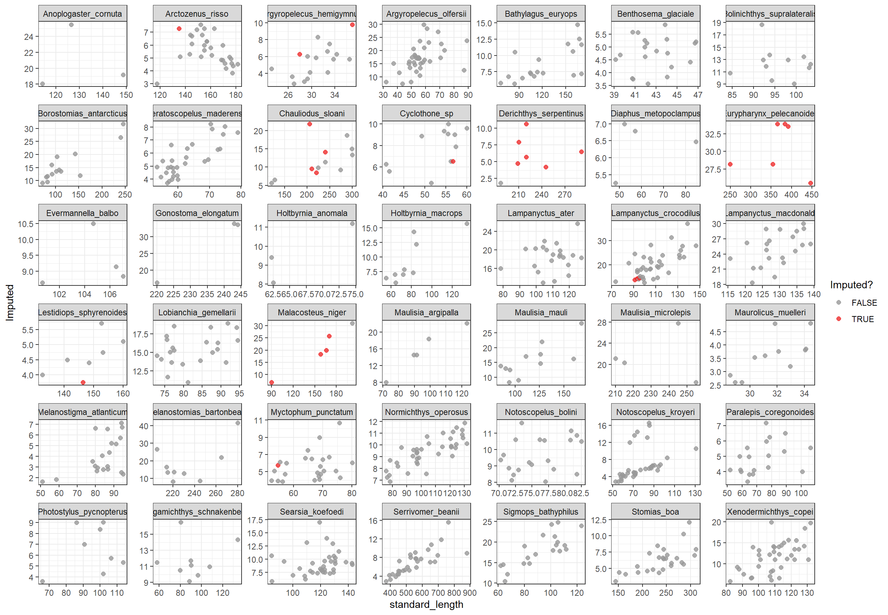{width=1248}
:::
:::

## Species * traits
### calctulate functional traits 

::: {.cell}

```{.r .cell-code}
# calculate functional numeric traits
numeric_traits <- imputed_data %>%
  na.omit() %>%
  select(-individual_code) %>%
  mutate(
    eye_size = eye_diameter / head_depth,
    orbital_length = eye_diameter / standard_length,
    oral_gape_surface = mouth_width * mouth_depth / body_width * body_depth,
    oral_gape_shape = mouth_depth / mouth_width,
    oral_gape_position = distance_upper_jaws_bottom_head / head_depth,
    lower_jaw_length = lower_jaw_length / standard_length,
    head_length = head_length / standard_length,
    body_depth = body_depth / standard_length,
    pectoral_fin_position = distance_pectoral_bottom_body / body_depth_pectoral_insertion,
    pectoral_fin_insertion = prepectoral_length / standard_length,
    transversal_shape = body_depth / body_width,
    dorsal_fin_insertion = predorsal_length / standard_length,
    eye_position = eye_height / head_depth,
    operculum_volume = operculum_depth / operculum_width,
    gill_outflow = operculum_width,
    caudal_throttle_width = caudal_peduncle_min_depth
  ) %>%
  select(
    species,
    eye_size,
    orbital_length,
    gill_outflow,
    oral_gape_surface,
    oral_gape_shape,
    oral_gape_position,
    lower_jaw_length,
    head_length,
    body_depth,
    pectoral_fin_position,
    pectoral_fin_insertion,
    transversal_shape,
    caudal_throttle_width,
    dorsal_fin_insertion,
    eye_position,
    operculum_volume
  ) %>%
  group_by(species) %>%
  summarise(across(everything(), mean, na.rm = TRUE)) %>%
  arrange(species)

# categorical traits for species without NA
cat_morpho <- morpho_data %>%
  select(
    species,
    ventral_photophores,
    gland_head,
    chin_barbel,
    small_teeth,
    large_teeth,
    fang_teeth,
    retractable_teeth,
    internal_teeth,
    gill_raker_types,
    oral_gape_axis
  ) %>%
    na.omit() %>%
  distinct() %>%
  arrange(species)

# combined the two data frames
fish_traits <- numeric_traits %>%
  inner_join(cat_morpho, by = "species") %>%
  arrange(species) %>% 
  tibble::column_to_rownames("species")%>%
  # assign trait type 
  # as.factor for qualitative traits
  mutate_if(is.character, as.factor)%>%
  # as.ordered for ordered variables
  mutate_at(c("gill_raker_types", "oral_gape_axis"), as.ordered)
```
:::


__Traits density distribution__

::: {.cell}

```{.r .cell-code}
density_plot_traits <- fish_traits[,1:16] %>% 
    tibble::rownames_to_column(var="species") %>% 
    tidyr::pivot_longer(!species, names_to = "traits", values_to = "values")

ggplot(density_plot_traits , aes(values)) +
  geom_histogram(bins = 10,
                 color = "darkgrey",
                 fill = "lightgray") +
  facet_wrap(~ traits, scales = "free") +
  theme_minimal()+
  theme(strip.text.x = element_text(size = 11, face = "bold"))
```

::: {.cell-output-display}
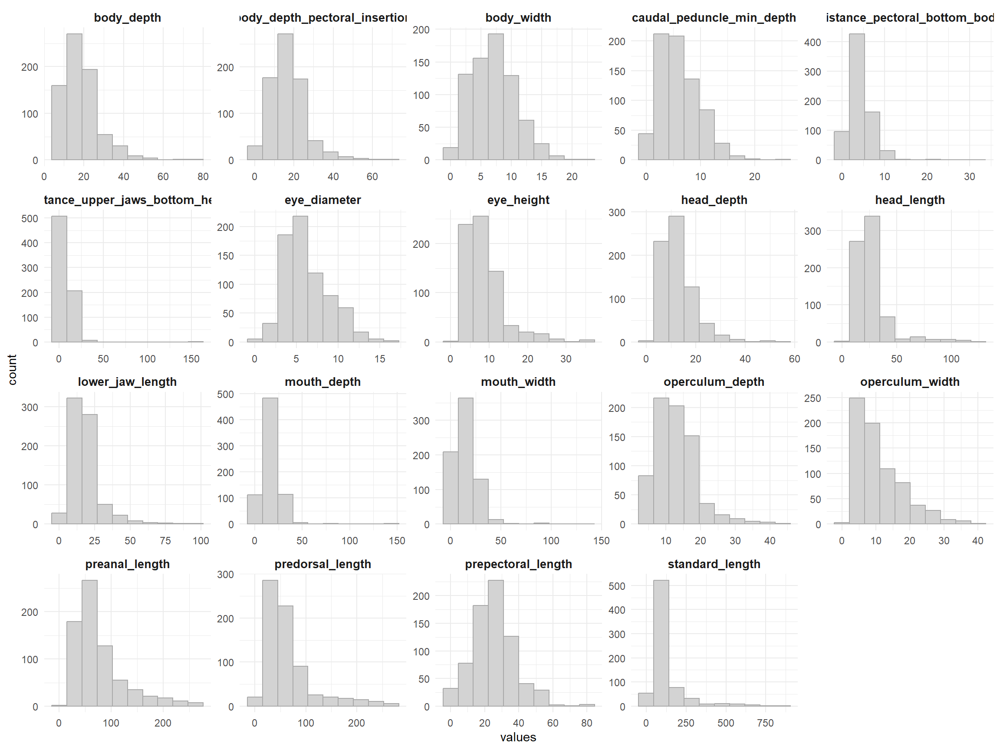{width=1152}
:::
:::

::: {.cell}

```{.r .cell-code}
## Display the table ----
htmltools::tagList(DT::datatable(fish_traits))
```

::: {.cell-output-display}

```{=html}
<div class="datatables html-widget html-fill-item" id="htmlwidget-279a832dae0d508778ff" style="width:100%;height:auto;"></div>
<script type="application/json" data-for="htmlwidget-279a832dae0d508778ff">{"x":{"filter":"none","vertical":false,"data":[["Anoplogaster_cornuta","Arctozenus_risso","Argyropelecus_hemigymnus","Argyropelecus_olfersii","Bathylagus_euryops","Benthosema_glaciale","Bolinichthys_supralateralis","Borostomias_antarcticus","Ceratoscopelus_maderensis","Chauliodus_sloani","Cyclothone_sp","Derichthys_serpentinus","Diaphus_metopoclampus","Evermannella_balbo","Gonostoma_elongatum","Holtbyrnia_anomala","Holtbyrnia_macrops","Lampanyctus_ater","Lampanyctus_crocodilus","Lampanyctus_macdonaldi","Lestidiops_sphyrenoides","Lobianchia_gemellarii","Malacosteus_niger","Maulisia_argipalla","Maulisia_mauli","Maulisia_microlepis","Maurolicus_muelleri","Melanostigma_atlanticum","Melanostomias_bartonbeani","Myctophum_punctatum","Normichthys_operosus","Notoscopelus_bolini","Notoscopelus_kroyeri","Paralepis_coregonoides","Photostylus_pycnopterus","Sagamichthys_schnakenbecki","Searsia_koefoedi","Serrivomer_beanii","Sigmops_bathyphilus","Stomias_boa","Xenodermichthys_copei"],[0.1870635427569378,0.6662342439395983,0.2528378924337218,0.2466185816292626,0.8073379156515913,0.553876225297698,0.6943542959568116,0.3918502902611463,0.61660846298933,0.3236216278441371,0.2896732995527421,0.7087200272405964,0.3806762185788406,0.4619095739058715,0.2627730950311468,0.7001620679316158,0.5861245029650884,0.5876906171451259,0.4605188017400862,0.4635401519874494,0.6379293967644859,0.4655204987772433,0.5686707446196964,0.5560047681071145,0.5436602586272192,0.4040027222573614,0.5366700102175092,0.5653194882201393,0.3404604909527202,0.5810276131287075,0.5877979401415817,0.58721677071155,0.5177971164068327,0.6557709453691855,0.3160340663331095,0.6531117613886723,0.5695641783784532,0.4097905992320632,0.3439623137409401,0.3246954087960091,0.653061224489796],[0.06513101563336203,0.03900061514640332,0.1103521526110715,0.1195337463229555,0.0974148495316086,0.09708002840620254,0.1002020784107539,0.0454502028499367,0.09456299480839496,0.03195944404217845,0.01820101324427989,0.01870641840179216,0.08672361809853502,0.06111392066224541,0.02365859567134613,0.107319044568802,0.09736638359612411,0.04953860514578357,0.04783772722762789,0.05324648475404745,0.03316666671153076,0.06137020103787766,0.0589832944995062,0.08848446584142593,0.0843550572708857,0.05808421042835739,0.0978961923388425,0.04280718124696028,0.02667037338846572,0.09235056814949912,0.105830132758109,0.06117253100231441,0.06286434018346203,0.05113309818745389,0.03048020374468671,0.08748603143506498,0.07967153949171366,0.007796575563762054,0.03401701434877021,0.02147373395945686,0.08897126969416125],[20.92,5.51,5.891764705882353,17.14486486486486,8.536315789473685,4.7555,12.47272727272727,15.79642857142857,5.523,10.795,8.138333333333334,4.775714285714286,6.3725,9.282500000000001,27.92,9.563333333333333,9.283333333333333,18.38136363636364,20.05128205128205,25.00333333333333,4.818571428571429,15.45818181818182,22.634,15.524,15.73,21.49,3.591818181818182,4.033,18.11777777777778,5.6224,9.430263157894737,9.629,6.779722222222222,4.898421052631579,6.5525,11.76,9.186666666666667,6.952666666666667,18.1015,6.292692307692308,19.9],[4662.042734854391,138.1158367386051,565.3571957087651,3042.322434320248,215.6744532820656,288.0952119082589,857.141772877457,2308.803855788343,280.9240294556024,1427.556961259949,455.5050890633374,102.2063575036608,496.3447641966349,746.3340129817943,6250.383835528853,1073.608822082495,870.8481183231795,1516.361659863597,1550.595807548067,2223.938773657847,192.3695993962881,1226.901459954854,4216.396258458542,3465.852896151474,2055.911596674011,1384.771960858673,186.8514118522354,78.39976364627458,2537.245636289088,234.4223020823153,482.9489975001663,486.4451319733718,256.6981040937214,207.1355822524318,80.09634693327251,828.0270267218062,555.0247245493943,121.0450061746473,4544.83974684605,687.1719817258471,250.3885057471265],[0.5589037281470387,2.713344261812962,1.386652536612277,0.9925153727538065,1.208429987743106,1.157723276407389,1.145308631944953,0.9549389452177165,1.99438980773017,2.198671222745045,2.407359852745906,1.689339435970036,0.9219855888959767,1.283292920158411,0.6068674018540213,1.084763039383196,1.246595443731965,1.144873224338048,1.276737860165135,1.162473804130551,2.180803211716847,1.100038150697565,0.8484726822993502,1.230101510957001,1.163701414828532,1.248535562855231,1.285170782096033,1.345688706965169,1.398821013856888,1.335620964108464,1.165827172483055,1.278747111079255,1.604890023737143,1.209042318448762,1.080061200669548,1.253134291420322,1.116267018664583,0.5320584499681953,1.023028473395861,0.7206841142392854,1.752941176470588],[0.3951426840833095,0.6956161275567915,0.5404276289037069,0.7474445396458337,0.3502518371432042,0.3324025605583356,0.3380289556040331,0.4826993703447641,0.5595395778352831,0.7068627312794583,0.7937932689673789,0.492756633741221,0.3452486634420606,0.5829657156202231,0.4721898773185077,0.4712003973315194,0.3956514300993943,0.5682437072560935,0.7716613657494861,0.5744746730161431,0.5520998821851169,0.5212153959103951,0.3530711561087431,0.4631356481458706,0.3738738564459647,0.2036324254692755,0.5855853143839959,0.4857260963559027,0.6176663797525285,0.5678597742789305,0.556466751857582,0.4896021576606608,0.6229573705434985,0.4245107644843942,0.5624538104272562,0.361697362365493,0.5212244711908143,0.586629915236263,0.6490690083932986,0.7577383401687043,0.6394557823129252],[0.2861375317012913,0.1199066289068907,0.2514373364077059,0.266959472951216,0.07475791459387701,0.1884618356794901,0.19638076001865,0.198414842989372,0.2124063307567828,0.1144114643871464,0.2040581908463124,0.04491240788019163,0.1867292921905659,0.1634947940484265,0.1777783246347302,0.2092942077891755,0.2069838979262741,0.1973450981018806,0.210637486787245,0.2048825282290511,0.1027761390567869,0.2223712374577787,0.2544654948963843,0.2078438651875588,0.2120154019923103,0.1744403226406842,0.166670163223075,0.03814429068386168,0.1234687560304594,0.1566457249526299,0.1804848574435944,0.2008815666871479,0.1961820567527294,0.1330213734139315,0.08475918421735412,0.1571232489521016,0.1366886549021795,0.08568386712504511,0.2267422887328622,0.09993380308826154,0.1139944392956441],[0.3471179569492232,0.2282622445820382,0.3034423890185704,0.308301242626706,0.220665116700292,0.2577329098405489,0.2949444282485461,0.2219516612342632,0.3106831287972612,0.1353122370036637,0.2203047019193976,0.09229259278317947,0.2573417157046858,0.2169720130174164,0.208131053502031,0.3736914296278676,0.3084118074275706,0.2268293066821225,0.2617421786031248,0.2544000525765622,0.179483203158696,0.2690716828129346,0.2291135730880142,0.3581617707887102,0.3386367195769682,0.2602094930995654,0.2861583530888247,0.1289222320266107,0.1414616221329245,0.2434873975369473,0.3036775056329284,0.2484099358389354,0.2638957745998514,0.2491930232735534,0.1610794295053864,0.3035521067765809,0.2480447612095185,0.153233449096655,0.2463809400095261,0.1073673323243344,0.2344763670064875],[0.496765317595603,0.07231486748096279,0.5465676366743593,0.6527711514828205,0.1771068190255039,0.227186906305348,0.23575289155312,0.1471579276088384,0.1957057378562352,0.1139788839951372,0.1385564389886054,0.06475552609724118,0.2868922794103201,0.1854842390181648,0.1439966534398835,0.1995718556257012,0.1884279714218087,0.1634270563148341,0.174943368578538,0.1791292477891186,0.07016698379208147,0.2389029851391781,0.1846729123532705,0.2190923414047283,0.2006259493110997,0.2145214178694734,0.2284769602774343,0.08730489814688717,0.1281404978381019,0.2159343939861771,0.2184135875848383,0.1977431521215698,0.1921466687105275,0.09127720302297426,0.148949033138653,0.1648207240422557,0.2093720644298593,0.02676997296275347,0.1460846094753337,0.08181017986974991,0.1594068582020389],[0.327552178795381,0.273739081678895,0.2307451284370966,0.2471710436456569,0.1987584730572414,0.4427266302964014,0.4605590043104663,0.1754328409583324,0.4771988618173915,0.289631998528789,0.1992742880547905,0.6600484532653362,0.2369353691925481,0.215888746321026,0.2073022595505449,0.2511962839831692,0.2467697101111054,0.3006302989195356,0.3801533853024294,0.1874527169200478,0.3583607039010895,0.2710821884027898,0.2070338218789051,0.1986434877697646,0.1907795219830297,0.1746990027397655,0.2251067492779084,0.3133699461064863,0.2233648323381441,0.4727531669301591,0.1841559512741846,0.2851868407331372,0.254490059280657,0.2229812001799436,0.4749769701497314,0.2145058832404344,0.2012247420149917,1,0.1973392223033529,0.1824120299750198,0.2203389830508475],[0.4003208996368177,0.2358202027404649,0.2779352032788916,0.2589592489665474,0.2575897057637524,0.2999602281286219,0.3283279074114032,0.2369008386437003,0.3413655289922946,0.1525109091904405,0.2296622405613443,0.1305046806357046,0.3475487347397182,0.234931461549684,0.2185105436064756,0.3836208813775061,0.3557612665211258,0.2550765280432923,0.2912274335906986,0.3991766831105948,0.1873220233715019,0.2905759860794116,0.1740874348298388,0.3692829665519732,0.3636636301971131,0.3343165173045963,0.2720666504252247,0.1433219020852564,0.1596798610655336,0.278532769448776,0.3277484293204377,0.2755915950773311,0.2868597770959138,0.2654937591570808,0.1830307523791412,0.3629341186561781,0.2602312413080092,1.912272743928823e-05,0.2852113862556448,0.1154570911731925,0.2391102873030584],[0.0371234059465991,0.01435870746028057,0.2549015223177563,0.1236266109740932,0.03234091237505429,0.09109791643347125,0.01988857958867888,0.03631916674726406,0.0314179790498654,0.01525793056447875,0.07135857193615111,0.01046142821823197,0.06090709882905589,0.0330170205426,0.01553375842430409,0.06429066383512382,0.04055065658457224,0.02463758734428551,0.01985425410804219,0.01871587454424042,0.01805418174713717,0.03025781637891173,0.02411855326084547,0.07493646258320825,0.03196526524002068,0.01480309413827949,0.1787182752269798,0.04130241912511247,0.01959986641736065,0.03254080223555961,0.01754916162030041,0.02763011114739326,0.02667208329968006,0.06703510034705321,0.02971955680387246,0.04254465702825964,0.01793523328064347,0.003317401467047132,0.08468757530738309,0.01107452305916778,0.0183226273795447],[10.45666666666667,3.639666666666667,3.425882352941176,5.975405405405406,6.301578947368421,3.3485,10.79727272727273,5.527142857142857,5.455333333333334,6.194166666666667,2.8375,2.242857142857143,5.945,6.265,12.76,4.013333333333334,6.078888888888889,8.561818181818182,11.33205128205128,13.30904761904762,2.92,8.897727272727273,8.033999999999999,5.81,7.612727272727272,18.175,2.204545454545455,1.3475,4.792222222222223,4.2856,8.535,6.7935,7.103055555555556,2.601052631578948,3.58375,5.828888888888889,10.18444444444444,1.211666666666667,3.299,3.472692307692308,5],[0.4441498752678317,0.6717810650778836,0.3558469543404688,0.3397134068623472,0.4620008815586645,0.4676150398984861,0.4469769590756064,0.5781920099833722,0.4979362376932329,0.2551650456937953,0.5434318108133503,0.3116459625644058,0.4041028771788586,0.4314272231538535,0.5671939001428983,0.6326973503856025,0.6361420651390463,0.4410062335674381,0.4528052962800324,0.4509057936924641,0.5980112926718268,0.4076621012576387,0.8268335886150313,0.6409601116629159,0.6344647156330613,0.6389295252984915,0.5480099853470315,0.5295325954161336,0.8479658564847968,0.4275739736694765,0.6823773209990294,0.3681530667791175,0.4118070492790029,0.6313155638870939,0.7766759118958205,0.6195601138458109,0.6397333531929763,0.3299632556271487,0.5465635247269044,0.8863608137478909,0.5708989805375347],[0.7176935425650939,0.6073283805170969,0.8378677998173621,0.7863724628459343,0.6759418666886342,0.52169659214019,0.5912844468134186,0.6406218602628342,0.5968153143538497,0.7608914348764781,0.9524117126142014,0.6792564664135844,0.5041147244442608,0.8025189634953906,0.6875363082898668,0.6816922245429579,0.6757727860416617,0.6434772867086079,0.6323528989520742,0.6741368657991837,0.6136384769387926,0.6326776614466724,0.6113076825121152,0.6801791224383178,0.6352660702821236,0.7404149553188488,0.6295496228498633,0.6523412642442598,0.7023241150122855,0.5915476455975354,0.5986729794261195,0.5509132572485328,0.5914664043406563,0.6770228372535668,0.7832793790368987,0.5912461332246149,0.5965030393450671,0.7257564943563971,0.6995258484505198,0.7053026635160292,0.7959183673469388],[1.91753487412749,1.297198189742802,1.998038180157904,1.200654781647563,1.124312726235241,1.615591789989959,1.266547465086961,0.9001426533263226,1.863584481393095,2.10689524654164,0.9541404596023743,1.681213614664557,1.828253739251144,1.342729773708559,1.125109185048073,1.005414520892331,1.256182599309575,0.745538622186577,0.7793530764695225,0.6972474697559381,1.447533900479166,0.9216188402082974,1.107725971705759,1.051571563080083,1.1351500186845,1.563131800106226,1.403601622773818,1.394534509216571,1.484009375370477,1.897408701751206,1.558071293993435,1.031327676466461,1.925545070392015,0.957153868401671,1.436677037589144,0.9152335515764092,1.685007419668435,1.7975179826019,0.8037016931661495,2.769898395886286,0.6834170854271358],["A","A","P","P","A","P","P","P","P","P","P","P","P","A","P","A","P","P","P","P","A","P","A","P","P","A","P","A","P","P","P","P","P","A","P","P","P","A","P","P","A"],["A","A","A","A","A","A","A","A","A","P","A","A","A","A","A","A","A","A","A","A","A","A","P","A","A","A","A","A","P","A","A","A","A","A","A","A","A","A","A","P","A"],["A","A","A","A","A","A","A","P","A","A","A","A","A","A","A","A","A","A","A","A","A","A","A","A","A","A","A","A","P","A","A","A","A","A","A","A","A","A","A","P","A"],["A","P","P","P","P","P","A","P","P","A","A","P","P","A","P","P","P","P","P","P","P","P","A","P","P","P","P","A","A","P","P","P","P","A","P","P","P","P","P","P","P"],["P","A","A","A","A","A","A","P","A","P","P","A","A","P","P","A","A","A","A","P","A","P","P","A","A","A","A","A","P","A","A","A","A","A","A","A","A","A","P","A","A"],["P","A","A","A","A","A","A","P","A","P","A","A","A","P","A","A","A","A","A","A","A","A","P","A","A","A","A","A","P","A","A","A","A","A","A","A","A","A","A","P","A"],["A","A","A","A","A","A","A","A","A","A","A","A","A","P","A","A","A","A","A","A","A","A","A","A","A","A","A","A","A","A","A","A","A","A","A","A","A","A","A","A","A"],["P","P","A","A","P","P","P","P","P","A","P","A","A","A","P","A","A","P","P","P","P","P","P","P","P","P","A","A","P","P","P","P","P","P","A","A","P","P","P","P","A"],["C","B","C","C","C","B","C","C","C","A","C","A","C","A","C","C","C","C","C","C","B","C","A","C","C","C","C","B","A","C","C","C","C","A","C","C","C","A","C","A","C"],["1","3","1","1","2","3","2","2","3","1","2","3","1","1","1","3","3","2","3","2","3","2","1","2","2","2","2","3","3","3","2","3","3","3","1","2","2","3","2","2","2"]],"container":"<table class=\"display\">\n  <thead>\n    <tr>\n      <th> <\/th>\n      <th>eye_size<\/th>\n      <th>orbital_length<\/th>\n      <th>gill_outflow<\/th>\n      <th>oral_gape_surface<\/th>\n      <th>oral_gape_shape<\/th>\n      <th>oral_gape_position<\/th>\n      <th>lower_jaw_length<\/th>\n      <th>head_length<\/th>\n      <th>body_depth<\/th>\n      <th>pectoral_fin_position<\/th>\n      <th>pectoral_fin_insertion<\/th>\n      <th>transversal_shape<\/th>\n      <th>caudal_throttle_width<\/th>\n      <th>dorsal_fin_insertion<\/th>\n      <th>eye_position<\/th>\n      <th>operculum_volume<\/th>\n      <th>ventral_photophores<\/th>\n      <th>gland_head<\/th>\n      <th>chin_barbel<\/th>\n      <th>small_teeth<\/th>\n      <th>large_teeth<\/th>\n      <th>fang_teeth<\/th>\n      <th>retractable_teeth<\/th>\n      <th>internal_teeth<\/th>\n      <th>gill_raker_types<\/th>\n      <th>oral_gape_axis<\/th>\n    <\/tr>\n  <\/thead>\n<\/table>","options":{"columnDefs":[{"className":"dt-right","targets":[1,2,3,4,5,6,7,8,9,10,11,12,13,14,15,16]},{"orderable":false,"targets":0},{"name":" ","targets":0},{"name":"eye_size","targets":1},{"name":"orbital_length","targets":2},{"name":"gill_outflow","targets":3},{"name":"oral_gape_surface","targets":4},{"name":"oral_gape_shape","targets":5},{"name":"oral_gape_position","targets":6},{"name":"lower_jaw_length","targets":7},{"name":"head_length","targets":8},{"name":"body_depth","targets":9},{"name":"pectoral_fin_position","targets":10},{"name":"pectoral_fin_insertion","targets":11},{"name":"transversal_shape","targets":12},{"name":"caudal_throttle_width","targets":13},{"name":"dorsal_fin_insertion","targets":14},{"name":"eye_position","targets":15},{"name":"operculum_volume","targets":16},{"name":"ventral_photophores","targets":17},{"name":"gland_head","targets":18},{"name":"chin_barbel","targets":19},{"name":"small_teeth","targets":20},{"name":"large_teeth","targets":21},{"name":"fang_teeth","targets":22},{"name":"retractable_teeth","targets":23},{"name":"internal_teeth","targets":24},{"name":"gill_raker_types","targets":25},{"name":"oral_gape_axis","targets":26}],"order":[],"autoWidth":false,"orderClasses":false}},"evals":[],"jsHooks":[]}</script>
```

:::
:::


__traits correlation__

::: {.cell}

```{.r .cell-code}
M <-cor(numeric_traits[, c(-1)])

ggcorrplot::ggcorrplot(M, hc.order = TRUE, type = "lower",
                       lab = TRUE, tl.cex = 9, lab_size = 3)
```

::: {.cell-output-display}
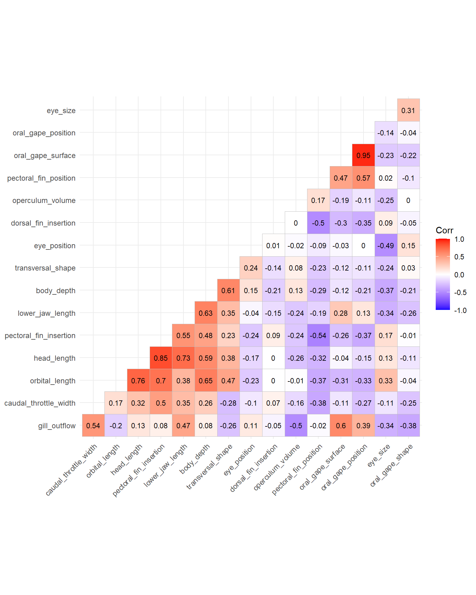{width=768}
:::

```{.r .cell-code}
ggsave("corrplot.png", path = "figures")
```
:::

::: {.cell}

```{.r .cell-code}
# list of species 
sp_names <- c(rownames(fish_traits), "Nannobrachium_atrum", "Cyclothone", "Stomias_boa_boa")

# taxonomic_families
taxonomic_families <- sp_names %>%
  as.data.frame() %>%
  `colnames<-`("species") %>% 
  mutate(
    family = case_when(
      species %in%
        c(
          "Benthosema_glaciale",
          "Ceratoscopelus_maderensis",
          "Diaphus_metopoclampus",
          "Lampanyctus_ater",
          "Lampanyctus_crocodilus",
          "Lampanyctus_macdonaldi",
          "Lobianchia_gemellarii",
          "Myctophum_punctatum",
          "Notoscopelus_bolini",
          "Notoscopelus_kroyeri",
          "Bolinichthys_supralateralis"
        ) ~ "Myctophidae",
      species %in% c(
        "Borostomias_antarcticus",
        "Chauliodus_sloani",
        "Malacosteus_niger",
        "Melanostomias_bartonbeani",
        "Stomias_boa"
      ) ~ "Stomiidae",
      species %in% c(
        "Holtbyrnia_anomala",
        "Holtbyrnia_macrops",
        "Maulisia_argipalla",
        "Maulisia_mauli",
        "Maulisia_microlepis",
        "Normichthys_operosus",
        "Searsia_koefoedi",
        "Sagamichthys_schnakenbecki"
      ) ~ "Platytroctidae",
      species %in% c("Sigmops_bathyphilus",
                     "Gonostoma_elongatum") ~ "Gonostomatidae",
      species %in% c(
        "Argyropelecus_hemigymnus",
        "Maurolicus_muelleri",
        "Argyropelecus_olfersii"
      ) ~ "Sternoptychidae",
      species == "Anoplogaster_cornuta" ~ "Anoplogastridae",
      species %in% c("Arctozenus_risso", "Paralepis_coregonoides") ~ "Paralepididae",
      species == "Bathylagus_euryops" ~ "Bathylagidae",
      species == "Cyclothone_sp" ~ "Gonostomatidae",
      species == "Derichthys_serpentinus" ~ "Derichthyidae",
      species == "Eurypharynx_pelecanoides" ~ "Eurypharyngidae",
      species == "Evermannella_balbo" ~ "Evermannellidae",
      species == "Lestidiops_sphyrenoides" ~ "Lestidiidae",
      species == "Melanostigma_atlanticum" ~ "Zoarcidae",
      species %in% c("Photostylus_pycnopterus",
                     "Xenodermichthys_copei") ~ "Alepocephalidae",
      species == "Serrivomer_beanii" ~ "Serrivomeridae"
    )
  )
```
:::


## Species * assemblages matrix

__Number of trawl hauls per depth__

+ Epipelagic = 8 
+ Upper mesopelagic = 26 
+ Lower mesopelagic = 16 
+ Bathypelagic = 16 

::: {.cell}

```{.r .cell-code}
# Metadata
metadata <-  utils::read.csv(here::here("data", "metadata.csv"), sep = ";", header = T, dec = ".")%>%
  # calculation of standardized biomass values (vertical  trawl opening * horizontal trawl opening * distance traveled)  
  mutate(volume_filtered = 24*58*distance)

ggplot(metadata, aes(x=depth))  +
  ylab ("Number of trawls")+
  xlab("Immersion depth (m)")+
  geom_histogram(binwidth=100, col="white", fill=alpha("black",0.55))+
  theme_light()+
  coord_flip()+ 
  scale_x_reverse()+
  labs(fill= "")+
  guides(fill="none")+
  scale_y_continuous(breaks = c(2,4,6,8,10,12))+
  theme(axis.text.x= element_text(size=12),
        axis.text.y= element_text(size=12),
        axis.title.y = element_text( size=12),
        axis.ticks = element_blank())
```

::: {.cell-output-display}
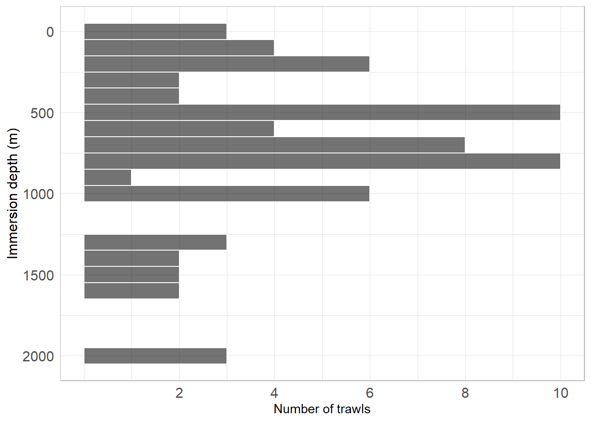{width=672}
:::
:::

::: {.cell}

```{.r .cell-code}
# species biomass x depth  matrix 2002-2019 ----
# data_biomass_2002_2019 <- utils::read.csv(here::here("data", "data_evhoe_catch_2002_2019.csv"), sep = ";", header = T, dec = ".")%>%
#   replace(is.na(.), 0)%>%
#   as.data.frame()%>%
#   rename("species"="Code_Station")%>%
#   mutate(species= gsub(" ","_", species))%>%
#   filter(species%in%sp_names)%>%
#   t()%>%
#   as.data.frame()%>%
#   janitor::row_to_names(row_number = 1)%>%
#   mutate_if(is.character, as.numeric)%>%
#   tibble::rownames_to_column("Code_Station")%>%
#   filter(!Code_Station=="H0472")%>%
#   tidyr::pivot_longer(!Code_Station, names_to = "species", values_to = "Tot_V_HV")%>%
#   rename("Nom_Scientifique"="species")

data_biomass_2002_2019 <- utils::read.csv(here::here("data", "Biomass_density_deep_pelagic_fish _Bay_of_Biscay.csv"), 
                                          sep = ";", header = TRUE, dec = ",")%>%
  rename( Code_Station= "Event.label") %>%
  select(Code_Station, 9:290) %>%
  mutate_all(~replace(., is.na(.), 0)) %>%
  select(c(contains("..g."),Code_Station)) %>%
  select(Code_Station, everything()) %>%
  select(-contains("..g.m3.")) %>% 
  rename_all(~gsub("\\.\\.g\\.", "", .)) %>% 
  rename_all(~gsub("\\.", "_", .)) %>% 
  tidyr::pivot_longer(cols = -Code_Station, names_to = "Nom_Scientifique", values_to = "Tot_V_HV") %>% 
  filter(Nom_Scientifique%in%sp_names)%>%
  filter(!Code_Station=="H0472")%>%
  replace(is.na(.), 0)

# species biomass x depth  matrix 2021 ----
data_biomass_2021 <- utils::read.csv(here::here("data", "data_evhoe_catch_2021.csv"), sep = ";", header = T, dec = ".")%>%
  select(Nom_Scientifique, Tot_V_HV, Code_Station)%>%
  distinct()%>%
  mutate(Nom_Scientifique= gsub(" ","_",Nom_Scientifique))%>%
  filter(Nom_Scientifique%in%sp_names)

# species biomass x depth  matrix 2022 ----
data_biomass_2022 <- utils::read.csv(here::here("data", "data_evhoe_catch_2022.csv"), sep = ";", header = T, dec = ".")%>%
  select(Nom_Scientifique, Tot_V_HV, Code_Station)%>%
  distinct()%>%
  mutate(Nom_Scientifique= gsub(" ","_",Nom_Scientifique))%>%
  filter(Nom_Scientifique%in%sp_names)

# #merge all matrix ----
depth_fish_biomass <- rbind(data_biomass_2002_2019, data_biomass_2021, data_biomass_2022)%>%
  as.data.frame()%>%
   rename("species"="Nom_Scientifique",
         "station"="Code_Station") %>%
  left_join(metadata) %>%
  select(species, Tot_V_HV, depth, volume_filtered)%>%
  # divise biomass by the volume filtered at each trawl (g.m3)
  mutate(biomass_cpu=(Tot_V_HV/volume_filtered)*1000)%>%
  select(species, depth, biomass_cpu)%>%
  # add column with depth layer
  mutate(
    depth_layer = case_when(
      between(depth, 0, 174) ~ "Epipelagic",
      between(depth, 175, 699) ~ "Upper mesopelagic",
      between(depth, 700, 999) ~ "Lower mesopelagic",
      between(depth, 1000, 2000) ~ "Bathypelagic"))%>%
  replace(is.na(.), 0)%>%
  select(-depth)%>%
  group_by(species, depth_layer)%>%
  mutate(biomass=sum(biomass_cpu))%>%
  select(-c(biomass_cpu))%>%
  distinct()%>%
  tidyr::pivot_wider(names_from = species, values_from = biomass)%>%
  replace(is.na(.), 0)%>%
  tibble::column_to_rownames(var = "depth_layer")%>%
  #change species name
  rename("Lampanyctus_ater"="Nannobrachium_atrum")%>%
  rename("Cyclothone_sp"="Cyclothone")%>%
  rename("Stomias_boa"="Stomias_boa_boa") %>%
  as.matrix()
```
:::


- __assemblages__ = depth layers 
- __biomass data__ = all EVHOE data 2002-2022 (in m^3)

::: {.cell}

```{.r .cell-code}
htmltools::tagList(DT::datatable(depth_fish_biomass))
```

::: {.cell-output-display}

```{=html}
<div class="datatables html-widget html-fill-item" id="htmlwidget-766b21a091acceadbaba" style="width:100%;height:auto;"></div>
<script type="application/json" data-for="htmlwidget-766b21a091acceadbaba">{"x":{"filter":"none","vertical":false,"data":[["Upper mesopelagic","Bathypelagic","Epipelagic","Lower mesopelagic"],[0,0.0146979030819833,0,0],[0.2802690854643028,0.1387884259318407,0.02247997235116746,0.3071009659888947],[0.008738230406147433,0.00174621026731269,0.0003073702565095805,0.001236083718473855],[0.3945020927886083,0.1303970354875223,0.008294544471760621,0.1055937307091076],[0,0.3660374139790999,0,0],[0.0220553249584584,0.4544702797752263,0.0640195180801041,0.1027639614949719],[0,0.002901574566284444,0,0.01843488085160593],[0.002013956910292874,0.05323396839293635,0.000219422970249756,0.004761470024474112],[0.2487392460292855,0.08936924956264901,0.04593738220271423,0.06586720721118081],[0.002614873729518701,0.09646397674232306,2.556247673814617e-07,0.02106264145873634],[0.01115182619021331,0.03838814230809446,0.002567248751922145,0.1551657863626956],[0.00269117136188827,0.004583890928592151,0,0.01010045124508982],[0,0.00228785367484745,0,0.0009384757187990092],[0.001200487872601256,0.0006236035945760196,0,0.0402246758430672],[0,0.006841410813162546,0,0.03242315186476399],[0,0.02798938102147332,0,0],[0.00569846685013904,0.004644978163458014,0,0.002661892487971513],[0.6396553587371757,1.011737056198755,0.05200324394919217,1.076240578069241],[0,0.2080108274393991,0,0],[0.0009747989099025165,2.435221531643675e-06,4.771662324453952e-06,0.01221130651668796],[0.01764407093688444,0.06793199413574852,0.002962210098371706,0.01000613525491782],[0.007551817083372061,0.03114798957702122,0,0],[0,0.007367071027602643,0,0.01445816420788091],[0.0008998632207904398,0.1704309907380967,0,0.00646972399789082],[0,0.1220139226306193,0,0],[0.02409040661507215,0.003031391334247525,0.001031107098526107,0.3427509182560748],[0.003405200536180277,0.002989196426668201,0.0006582689107492679,0.01457783018259704],[0.01263862986188355,0.01809703117647535,1.192915581113488e-06,0.017173641873322],[0.09596426429182378,0.1466950511494353,0.09825005231203113,0.1356764599018841],[0.006076634031400133,0.1835494683250038,0.0006582689107492679,0.06370832151042005],[0,0.7665227845989426,0,0],[0.3339683723072734,0.3048225628946188,0.02846278619695132,0.200480842174978],[0.0003294686463826039,0.004288395653241345,0.000438845940499512,0.002308650210178031],[0,0.005180112592732562,0,0],[0.003737319094047666,0.004592808110765526,0,0.006572370298732254],[0.03155461766730514,0.03045654143597907,0.01601787682823219,0.1269439083912892],[0.08921627460550244,0.5953450963065114,0.02358796930184877,0.1799003406867516],[0,0.031826667634204,0.000438845940499512,0],[0.230391253932721,0.3852780532563689,0.05810413668274209,0.2997243203057119],[1.332934037653269,0.2847299570135333,0.02073547068860194,0.8853547437277163],[0,7.408834360091849e-06,3.655434173554902e-05,7.597272180862767e-06]],"container":"<table class=\"display\">\n  <thead>\n    <tr>\n      <th> <\/th>\n      <th>Anoplogaster_cornuta<\/th>\n      <th>Arctozenus_risso<\/th>\n      <th>Argyropelecus_hemigymnus<\/th>\n      <th>Argyropelecus_olfersii<\/th>\n      <th>Bathylagus_euryops<\/th>\n      <th>Benthosema_glaciale<\/th>\n      <th>Bolinichthys_supralateralis<\/th>\n      <th>Borostomias_antarcticus<\/th>\n      <th>Ceratoscopelus_maderensis<\/th>\n      <th>Chauliodus_sloani<\/th>\n      <th>Cyclothone_sp<\/th>\n      <th>Derichthys_serpentinus<\/th>\n      <th>Diaphus_metopoclampus<\/th>\n      <th>Evermannella_balbo<\/th>\n      <th>Gonostoma_elongatum<\/th>\n      <th>Holtbyrnia_anomala<\/th>\n      <th>Holtbyrnia_macrops<\/th>\n      <th>Lampanyctus_crocodilus<\/th>\n      <th>Lampanyctus_macdonaldi<\/th>\n      <th>Lestidiops_sphyrenoides<\/th>\n      <th>Lobianchia_gemellarii<\/th>\n      <th>Malacosteus_niger<\/th>\n      <th>Maulisia_argipalla<\/th>\n      <th>Maulisia_mauli<\/th>\n      <th>Maulisia_microlepis<\/th>\n      <th>Maurolicus_muelleri<\/th>\n      <th>Melanostigma_atlanticum<\/th>\n      <th>Melanostomias_bartonbeani<\/th>\n      <th>Myctophum_punctatum<\/th>\n      <th>Lampanyctus_ater<\/th>\n      <th>Normichthys_operosus<\/th>\n      <th>Notoscopelus_kroyeri<\/th>\n      <th>Paralepis_coregonoides<\/th>\n      <th>Photostylus_pycnopterus<\/th>\n      <th>Sagamichthys_schnakenbecki<\/th>\n      <th>Searsia_koefoedi<\/th>\n      <th>Serrivomer_beanii<\/th>\n      <th>Sigmops_bathyphilus<\/th>\n      <th>Stomias_boa<\/th>\n      <th>Xenodermichthys_copei<\/th>\n      <th>Notoscopelus_bolini<\/th>\n    <\/tr>\n  <\/thead>\n<\/table>","options":{"columnDefs":[{"className":"dt-right","targets":[1,2,3,4,5,6,7,8,9,10,11,12,13,14,15,16,17,18,19,20,21,22,23,24,25,26,27,28,29,30,31,32,33,34,35,36,37,38,39,40,41]},{"orderable":false,"targets":0},{"name":" ","targets":0},{"name":"Anoplogaster_cornuta","targets":1},{"name":"Arctozenus_risso","targets":2},{"name":"Argyropelecus_hemigymnus","targets":3},{"name":"Argyropelecus_olfersii","targets":4},{"name":"Bathylagus_euryops","targets":5},{"name":"Benthosema_glaciale","targets":6},{"name":"Bolinichthys_supralateralis","targets":7},{"name":"Borostomias_antarcticus","targets":8},{"name":"Ceratoscopelus_maderensis","targets":9},{"name":"Chauliodus_sloani","targets":10},{"name":"Cyclothone_sp","targets":11},{"name":"Derichthys_serpentinus","targets":12},{"name":"Diaphus_metopoclampus","targets":13},{"name":"Evermannella_balbo","targets":14},{"name":"Gonostoma_elongatum","targets":15},{"name":"Holtbyrnia_anomala","targets":16},{"name":"Holtbyrnia_macrops","targets":17},{"name":"Lampanyctus_crocodilus","targets":18},{"name":"Lampanyctus_macdonaldi","targets":19},{"name":"Lestidiops_sphyrenoides","targets":20},{"name":"Lobianchia_gemellarii","targets":21},{"name":"Malacosteus_niger","targets":22},{"name":"Maulisia_argipalla","targets":23},{"name":"Maulisia_mauli","targets":24},{"name":"Maulisia_microlepis","targets":25},{"name":"Maurolicus_muelleri","targets":26},{"name":"Melanostigma_atlanticum","targets":27},{"name":"Melanostomias_bartonbeani","targets":28},{"name":"Myctophum_punctatum","targets":29},{"name":"Lampanyctus_ater","targets":30},{"name":"Normichthys_operosus","targets":31},{"name":"Notoscopelus_kroyeri","targets":32},{"name":"Paralepis_coregonoides","targets":33},{"name":"Photostylus_pycnopterus","targets":34},{"name":"Sagamichthys_schnakenbecki","targets":35},{"name":"Searsia_koefoedi","targets":36},{"name":"Serrivomer_beanii","targets":37},{"name":"Sigmops_bathyphilus","targets":38},{"name":"Stomias_boa","targets":39},{"name":"Xenodermichthys_copei","targets":40},{"name":"Notoscopelus_bolini","targets":41}],"order":[],"autoWidth":false,"orderClasses":false}},"evals":[],"jsHooks":[]}</script>
```

:::
:::


### Species depth distribution 

::: {.cell}

```{.r .cell-code}
depth_distribution <- rbind(data_biomass_2002_2019, data_biomass_2021, data_biomass_2022)%>%
  as.data.frame()%>%  
  rename("station"="Code_Station")%>%
  left_join(metadata)%>%
  rename("species"="Nom_Scientifique")%>% 
  select(-c(station))%>%
  distinct()%>%
  filter(Tot_V_HV>0)%>%
  group_by(species)%>%
  mutate(biomass_tot = sum(Tot_V_HV))%>%
  ungroup()%>%
  group_by(species, depth)%>%
  mutate(biomass_depth = sum(Tot_V_HV))%>%
  select(species, biomass_depth, biomass_tot, depth)%>%
  distinct()%>%
  group_by(species, depth)%>%
  mutate(biomass_rel=biomass_depth/biomass_tot*100)%>%
  select(species, depth, biomass_rel)%>%
  mutate(biomass = as.integer(biomass_rel))%>%
  select(-biomass_rel)%>%
  tidyr::uncount(biomass)

# Order in function of median depth
depth_distribution$species = with(depth_distribution, reorder(species, depth, median))  

ggplot(depth_distribution,
       aes(x = depth, y = species, group = species)) + 
  ggridges::stat_density_ridges(geom="density_ridges", scale=1.5, alpha=0.6, rel_min_height = 0.005,
                                quantile_lines = TRUE, quantiles = 2, size = 0.4, col= "gray30")+
  theme_bw()+
  ylab(label = "")+ xlab("Immersion depth (m)")+
  theme(axis.text.y = element_text(size=13),
        axis.text.x = element_text(face="italic", size=10, angle=80,vjust = 0.5, hjust=0),
        axis.title.x = element_text(size=13),
        axis.title.y = element_text(size=13))+
  xlim(0, 2000)+
  scale_y_discrete(position = "right")+
  scale_x_reverse()+
  coord_flip()+
  guides(fill="none", col="none" ,alpha="none")
```

::: {.cell-output-display}
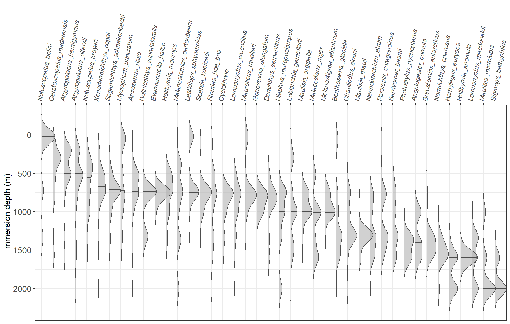{width=1056}
:::

```{.r .cell-code}
ggsave("depth_distribution.png", path = "figures", height = 8, width = 12)
```
:::


## Traits types

The **first column** contains **traits name**. The **second column** contains
**traits type** following this code:

* **N**: nominal trait (factor variable)
* **O**: ordinal traits (ordered variable)
* **Q**: quantitative traits (numeric values)

* 1/3 of the traits are nominal (traits related to teeth and photophores), need to give them different weights so as not to overestimate functional diversity? 

::: {.cell}

```{.r .cell-code}
fish_traits_cat <- utils::read.csv(here::here("data", "fish_traits_cat.csv"), sep = ";", header = T, dec = ".")
htmltools::tagList(DT::datatable(fish_traits_cat))
```

::: {.cell-output-display}

```{=html}
<div class="datatables html-widget html-fill-item" id="htmlwidget-f27e821f597972be6214" style="width:100%;height:auto;"></div>
<script type="application/json" data-for="htmlwidget-f27e821f597972be6214">{"x":{"filter":"none","vertical":false,"data":[["1","2","3","4","5","6","7","8","9","10","11","12","13","14","15","16","17","18","19","20","21","22","23","24","25","26"],["eye_size","orbital_length","gill_outflow","oral_gape_surface","oral_gape_shape","oral_gape_position","lower_jaw_length","head_length","body_depth","pectoral_fin_position","pectoral_fin_insertion","transversal_shape","caudal_throttle_width","dorsal_fin_insertion","eye_position","operculum_volume","ventral_photophores","gland_head","chin_barbel","small_teeth","large_teeth","fang_teeth","retractable_teeth","internal_teeth","gill_raker_types","oral_gape_axis"],["Q","Q","Q","Q","Q","Q","Q","Q","Q","Q","Q","Q","Q","Q","Q","Q","N","N","N","N","N","N","N","N","O","O"]],"container":"<table class=\"display\">\n  <thead>\n    <tr>\n      <th> <\/th>\n      <th>trait_name<\/th>\n      <th>trait_type<\/th>\n    <\/tr>\n  <\/thead>\n<\/table>","options":{"columnDefs":[{"orderable":false,"targets":0},{"name":" ","targets":0},{"name":"trait_name","targets":1},{"name":"trait_type","targets":2}],"order":[],"autoWidth":false,"orderClasses":false}},"evals":[],"jsHooks":[]}</script>
```

:::
:::

# 1. CWM 
__Community Weighted Mean__ : somme de l'abondance relative d'une espèce x valeur du trait

+ trait quantittatif : valeur moyenne du trait si on prend un individu au hasard dans l'assemblage 

+ trait catégoriel : proportion des espèces possédant ce trait, une valeur élevée peut indiquer soit qu'un grand nombre possèdent se trait ou que l'espèce avec la plus forte abondance relative possède ce trait 

+ données centrées-réduites 


::: {.cell}

```{.r .cell-code}
# spxtraits.matrix ----
spxcom.matrix <-  depth_fish_biomass %>% 
  t() %>% 
  as.data.frame() %>% 
  relocate("Epipelagic", "Upper mesopelagic", "Lower mesopelagic","Bathypelagic" ) %>% 
  tibble::rownames_to_column("species") %>% 
  arrange(species) %>% 
  tibble::column_to_rownames("species") %>% 
  as.matrix()

library(dplyr)

spxtraits.matrix <- fish_traits %>%
  mutate(across(16:23, ~ case_when(. == "P" ~ 1, 
                                   . == "A" ~ 0, 
                                   TRUE ~ as.numeric(.))),
         across(24, ~ case_when(. == "A" ~ 1, 
                                . == "B" ~ 2, 
                                . == "C" ~ 3, 
                                TRUE ~ as.numeric(.)))) %>% 
  select(-c(gill_raker_types, oral_gape_axis)) %>% 
  as.matrix()

# Remove the "[,1]" suffix from column names
names(spxtraits.matrix) <- gsub("[,1]", "", names(spxtraits.matrix))

#check rownames
#rownames(spxtraits.matrix) == rownames(spxcom.matrix)

result_CWM <- FD::functcomp(spxtraits.matrix, t(spxcom.matrix)) 
#FD::functcomp(spxtraits.matrix, t(spxcom.matrix), CWM.type = "all")

#  Calculate Total biomass
total_biomass <- colSums(spxcom.matrix)

#  Calculate Relative biomass
sp_rel_biomass <- t(spxcom.matrix) / total_biomass

# Transpose the Relative biomass Matrix for Display
t_sp_rel_biomass <- t(sp_rel_biomass)

total_sum <- colSums(t(sp_rel_biomass))

# Initialize an empty data frame to store results
CWM_df <- data.frame(
  depth_layer = character(),
  trait = character(),
  total_sum = numeric(),
  weighted_mean = numeric(),
  stringsAsFactors = FALSE
)

# Loop through each trait
for (trait in colnames(spxtraits.matrix)) {
  # Calculate the weighted sum for the current trait
  weighted_sum <- colSums(t_sp_rel_biomass * spxtraits.matrix[, trait])
  
  # Create a data frame for the current trait
  trait_df <- data.frame(
    depth_layer = colnames(t_sp_rel_biomass),
    trait = trait,
    total_sum = total_sum,
    weighted_mean = weighted_sum
  )
  
  # Append results to the main data frame
  CWM_df <- rbind(CWM_df, trait_df)
}

CWM_df <- CWM_df %>% 
  mutate(traits_names= gsub("_"," ", trait)) 

biomass <- t_sp_rel_biomass %>% 
  as.data.frame() %>% 
  tibble::rownames_to_column(var = "species") %>% 
  tidyr::pivot_longer(!species, names_to = "depth_layer", values_to = "biomass") 

CWM_df <- CWM_df %>% 
  filter(!trait%in% c("chin_barbel",
                      "dorsal_fin_insertion", "eye_position",
                      "gland_head", "oral_gape_position", "oral_gape_shape",
                      "pectoral_fin_position", "retractable_teeth",
                      "transversal_shape")) %>% 
  mutate(traits_names= gsub("_"," ", trait)) 

CWM_df$depth_layer <- factor(CWM_df$depth_layer, 
                             levels = c("Epipelagic", "Upper mesopelagic",
                                        "Lower mesopelagic", "Bathypelagic"))

CWM_df$traits_names <- factor(CWM_df$traits_names, 
                              levels = c( "caudal throttle width", "oral gape surface",
                                         "large teeth", "eye size",
                                         "orbital length","small teeth",
                                         "internal teeth", "lower jaw length",
                                         "pectoral fin insertion", "fang teeth",
                                         "operculum volume", "ventral photophores",
                                         "gill outflow", "head length","body depth"))


ggplot(CWM_df, aes(x = depth_layer, y = weighted_mean, group = depth_layer, color = depth_layer)) +
  geom_point(position = position_dodge(width = 0.75), size = 3) +
  facet_wrap(~traits_names, scales = "free", ncol = 3) + 
  scale_color_manual(values = c("#FEA520","#D62246","#6255B4","#3C685A"))+
  labs(x = "",
       y = "Community Weighted Mean ") +
  guides(col="none")+
  theme_light()+
  theme(axis.text.x = element_blank(), 
        axis.title.x = element_blank(), 
        axis.title.y.left =  element_text(size =14), 
        strip.text = element_text(size =14, face="bold"),  
        legend.title = element_text(size =11),  
        legend.text = element_text(size =11), 
        axis.title.y = element_text(size=11),
        axis.text.y = element_text(size=12),
        strip.background=element_rect(fill="white"),
        strip.text.x = element_text(size = 15, face = "bold", color = "black"))
```

::: {.cell-output-display}
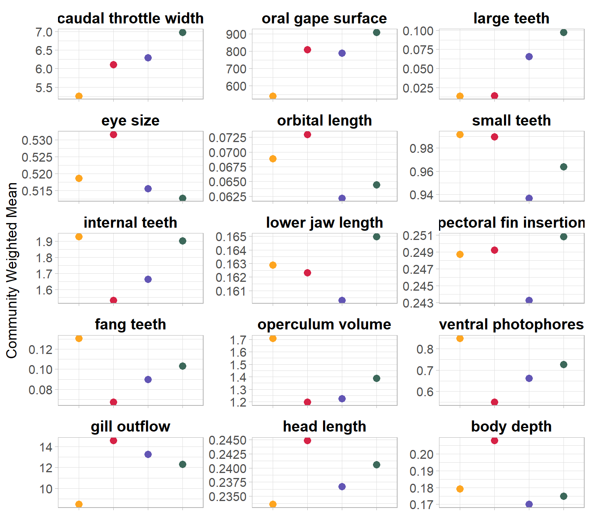{width=768}
:::

```{.r .cell-code}
ggsave("CWM.png", path = "figures", dpi = 700, height = 10, width = 10)
```
:::

## CWM bootstrap
- non parametric

::: {.cell}

```{.r .cell-code}
library(traitstrap)

# Trait 
trait_boot <- morpho_data%>% 
  inner_join(metadata) %>% 
  select(-c(individual_code, years, longitude_start,
            latitude_start, longitude_end, longitude_end,
            volume_filtered, distance)) %>% 
  mutate(
    eye_size = eye_diameter / head_depth,
    orbital_length = eye_diameter / standard_length,
    oral_gape_surface = mouth_width * mouth_depth / body_width * body_depth,
    oral_gape_shape = mouth_depth / mouth_width,
    oral_gape_position = distance_upper_jaws_bottom_head / head_depth,
    lower_jaw_length = lower_jaw_length / standard_length,
    head_length = head_length / standard_length,
    body_depth = body_depth / standard_length,
    pectoral_fin_position = distance_pectoral_bottom_body / body_depth_pectoral_insertion,
    pectoral_fin_insertion = prepectoral_length / standard_length,
    transversal_shape = body_depth / body_width,
    dorsal_fin_insertion = predorsal_length / standard_length,
    eye_position = eye_height / head_depth,
    operculum_volume = operculum_depth / operculum_width,
    gill_outflow = operculum_width,
    caudal_throttle_width = caudal_peduncle_min_depth
  ) %>%
  select(
    depth,
    species,
    eye_size,
    orbital_length,
    gill_outflow,
    oral_gape_surface,
    oral_gape_shape,
    oral_gape_position,
    lower_jaw_length,
    head_length,
    body_depth,
    pectoral_fin_position,
    pectoral_fin_insertion,
    transversal_shape,
    caudal_throttle_width,
    dorsal_fin_insertion,
    eye_position,
    operculum_volume,
    ventral_photophores, 
    gland_head,
    chin_barbel, 
    small_teeth, 
    large_teeth, 
    fang_teeth, 
    retractable_teeth, 
    internal_teeth
  ) %>%
  mutate_at(vars(ventral_photophores, 
                 gland_head,
                 chin_barbel, 
                 small_teeth, 
                 large_teeth, 
                 fang_teeth, 
                 retractable_teeth, 
                 internal_teeth), 
            funs(ifelse(. == "P", 1, ifelse(. == "A", 0, .)))) %>% 
  mutate(across(all_of(c("ventral_photophores", 
                         "gland_head",
                         "chin_barbel", 
                         "small_teeth", 
                         "large_teeth", 
                         "fang_teeth", 
                         "retractable_teeth", 
                         "internal_teeth")), as.numeric)) %>% 
  tidyr::pivot_longer(!c(species,depth), names_to = "trait", values_to = "values")%>%
  # add column with depth layer
  mutate(
    depth_layer = case_when(
      between(depth, 0, 174) ~ "Epipelagic",
      between(depth, 175, 699) ~ "Upper mesopelagic",
      between(depth, 700, 999) ~ "Lower mesopelagic",
      between(depth, 1000, 2000) ~ "Bathypelagic"))

# Community 
community <-  rbind(data_biomass_2002_2019, data_biomass_2021, data_biomass_2022)%>%
  as.data.frame()%>%
  rename("species"="Nom_Scientifique",
         "station"="Code_Station") %>%
  left_join(metadata) %>%
  select(species, Tot_V_HV, depth, volume_filtered)%>%
  # add column with depth layer
  mutate(
    depth_layer = case_when(
      between(depth, 0, 174) ~ "Epipelagic",
      between(depth, 175, 699) ~ "Upper mesopelagic",
      between(depth, 700, 999) ~ "Lower mesopelagic",
      between(depth, 1000, 2000) ~ "Bathypelagic"))%>%
  replace(is.na(.), 0)%>%
  group_by(species, depth)%>%
  mutate(biomass=sum(Tot_V_HV))%>%
  select(-c(Tot_V_HV))%>%
  distinct()%>%
  select(-c(volume_filtered)) %>% 
  filter(biomass>0) %>% 
  mutate(species = case_when(
    species == "Nannobrachium_atrum"~"Lampanyctus_ater",
    species == "Cyclothone"~"Cyclothone_sp",
    species == "Stomias_boa_boa"~"Stomias_boa",
    TRUE ~ species
  )) 

trait_filling <- trait_fill(
  # input data (mandatory)
  comm = community,
  traits = trait_boot,
  
  # specifies columns in your data (mandatory)
  abundance_col = "biomass",
  taxon_col = "species",
  trait_col = "trait",
  value_col = "values",
  
  # specifies sampling hierarchy
  scale_hierarchy = c("depth_layer", "depth"),
  
  # min number of samples
  min_n_in_sample = 9
)

# run nonparametric bootstrapping
np_bootstrapped_moments <- trait_np_bootstrap(
  trait_filling, 
  nrep = 100
)

np_bootstrapped_moments_plot <- np_bootstrapped_moments %>% 
  mutate(trait= gsub("_"," ", trait))%>%
  filter(
    trait %in% c(
      "caudal throttle width",
      "large teeth",
      "oral gape surface",
      "gill outflow",
      "internal teeth",
      "oral gape shape",
      "small teeth",
      "orbital length",
      "transversal shape",
      "operculum volume",
      "body depth",
      "eye size"
    )
  )

np_bootstrapped_moments_plot$trait <- factor(
  np_bootstrapped_moments_plot$trait,
  levels = c(
    "caudal throttle width",
    "large teeth",
    "oral gape surface",
    "gill outflow",
    "internal teeth",
    "oral gape shape",
    "small teeth",
    "orbital length",
    "transversal shape",
    "operculum volume",
    "body depth",
    "eye size"
  )
)

np_bootstrapped_moments_plot$depth_layer <- factor(np_bootstrapped_moments_plot$depth_layer, 
                                              levels = c("Epipelagic", "Upper mesopelagic", "Lower mesopelagic", "Bathypelagic"))

# Mean
ggplot(np_bootstrapped_moments_plot, aes(x=depth_layer, y=mean)) +
  geom_boxplot(aes(col=depth_layer, fill=depth_layer), alpha=0.1) +
  scale_fill_manual(values = c("#FEA520","#D62246","#6255B4","#3C685A"))+
  scale_color_manual(values = c("#FEA520","#D62246","#6255B4","#3C685A"))+
  labs(col="Depth layer", fill="Depth layer", y="Bootstrapped CWM")+
  facet_wrap(~trait, scales = "free")+
  theme_light()+
  theme(axis.text.x = element_blank(), 
        axis.title.x = element_blank(), 
        axis.title.y.left =  element_text(size =14), 
        strip.text = element_text(size =14, face="bold"),  
        legend.title = element_text(size =11),  
        legend.text = element_text(size =11), 
        axis.title.y = element_text(size=11),
        axis.text.y = element_text(size=12),
        strip.background=element_rect(fill="white"),
        strip.text.x = element_text(size = 10, color = "black"))
```

::: {.cell-output-display}
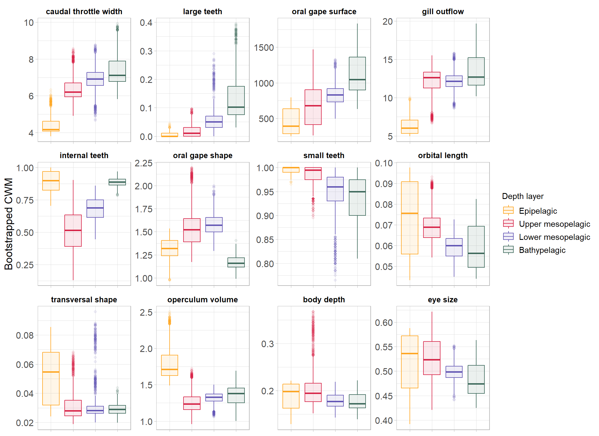{width=1056}
:::

```{.r .cell-code}
ggsave("CWM_boot.png", path = "figures/additional_analyses", dpi = 700, height = 8, width = 12)
```
:::


### Summarizes bootstrapping output

::: {.cell}

```{.r .cell-code}
# summarizes bootstrapping output
sum_boot_moment <- trait_summarise_boot_moments(
  np_bootstrapped_moments
)

htmltools::tagList(DT::datatable(sum_boot_moment))
```

::: {.cell-output-display}

```{=html}
<div class="datatables html-widget html-fill-item" id="htmlwidget-556b925c90bb2c224ecb" style="width:100%;height:auto;"></div>
<script type="application/json" data-for="htmlwidget-556b925c90bb2c224ecb">{"x":{"filter":"none","vertical":false,"data":[["1","2","3","4","5","6","7","8","9","10","11","12","13","14","15","16","17","18","19","20","21","22","23","24","25","26","27","28","29","30","31","32","33","34","35","36","37","38","39","40","41","42","43","44","45","46","47","48","49","50","51","52","53","54","55","56","57","58","59","60","61","62","63","64","65","66","67","68","69","70","71","72","73","74","75","76","77","78","79","80","81","82","83","84","85","86","87","88","89","90","91","92","93","94","95","96","97","98","99","100","101","102","103","104","105","106","107","108","109","110","111","112","113","114","115","116","117","118","119","120","121","122","123","124","125","126","127","128","129","130","131","132","133","134","135","136","137","138","139","140","141","142","143","144","145","146","147","148","149","150","151","152","153","154","155","156","157","158","159","160","161","162","163","164","165","166","167","168","169","170","171","172","173","174","175","176","177","178","179","180","181","182","183","184","185","186","187","188","189","190","191","192","193","194","195","196","197","198","199","200","201","202","203","204","205","206","207","208","209","210","211","212","213","214","215","216","217","218","219","220","221","222","223","224","225","226","227","228","229","230","231","232","233","234","235","236","237","238","239","240","241","242","243","244","245","246","247","248","249","250","251","252","253","254","255","256","257","258","259","260","261","262","263","264","265","266","267","268","269","270","271","272","273","274","275","276","277","278","279","280","281","282","283","284","285","286","287","288","289","290","291","292","293","294","295","296","297","298","299","300","301","302","303","304","305","306","307","308","309","310","311","312","313","314","315","316","317","318","319","320","321","322","323","324","325","326","327","328","329","330","331","332","333","334","335","336","337","338","339","340","341","342","343","344","345","346","347","348","349","350","351","352","353","354","355","356","357","358","359","360","361","362","363","364","365","366","367","368","369","370","371","372","373","374","375","376","377","378","379","380","381","382","383","384","385","386","387","388","389","390","391","392","393","394","395","396","397","398","399","400","401","402","403","404","405","406","407","408","409","410","411","412","413","414","415","416","417","418","419","420","421","422","423","424","425","426","427","428","429","430","431","432","433","434","435","436","437","438","439","440","441","442","443","444","445","446","447","448","449","450","451","452","453","454","455","456","457","458","459","460","461","462","463","464","465","466","467","468","469","470","471","472","473","474","475","476","477","478","479","480","481","482","483","484","485","486","487","488","489","490","491","492","493","494","495","496","497","498","499","500","501","502","503","504","505","506","507","508","509","510","511","512","513","514","515","516","517","518","519","520","521","522","523","524","525","526","527","528","529","530","531","532","533","534","535","536","537","538","539","540","541","542","543","544","545","546","547","548","549","550","551","552","553","554","555","556","557","558","559","560","561","562","563","564","565","566","567","568","569","570","571","572","573","574","575","576","577","578","579","580","581","582","583","584","585","586","587","588","589","590","591","592","593","594","595","596","597","598","599","600","601","602","603","604","605","606","607","608","609","610","611","612","613","614","615","616","617","618","619","620","621","622","623","624","625","626","627","628","629","630","631","632","633","634","635","636","637","638","639","640","641","642","643","644","645","646","647","648","649","650","651","652","653","654","655","656","657","658","659","660","661","662","663","664","665","666","667","668","669","670","671","672","673","674","675","676","677","678","679","680","681","682","683","684","685","686","687","688","689","690","691","692","693","694","695","696","697","698","699","700","701","702","703","704","705","706","707","708","709","710","711","712","713","714","715","716","717","718","719","720","721","722","723","724","725","726","727","728","729","730","731","732","733","734","735","736","737","738","739","740","741","742","743","744","745","746","747","748","749","750","751","752","753","754","755","756","757","758","759","760","761","762","763","764","765","766","767","768","769","770","771","772","773","774","775","776","777","778","779","780","781","782","783","784","785","786","787","788","789","790","791","792","793","794","795","796","797","798","799","800","801","802","803","804","805","806","807","808","809","810","811","812","813","814","815","816","817","818","819","820","821","822","823","824","825","826","827","828","829","830","831","832","833","834","835","836","837","838","839","840","841","842","843","844","845","846","847","848","849","850","851","852","853","854","855","856","857","858","859","860","861","862","863","864","865","866","867","868","869","870","871","872","873","874","875","876","877","878","879","880","881","882","883","884","885","886","887","888","889","890","891","892","893","894","895","896","897","898","899","900","901","902","903","904","905","906","907","908","909","910","911","912","913","914","915","916","917","918","919","920","921","922","923","924","925","926","927","928","929","930","931","932","933","934","935","936","937","938","939","940","941","942","943","944","945","946","947","948","949","950","951","952","953","954","955","956","957","958","959","960","961","962","963","964","965","966","967","968","969","970","971","972","973","974","975","976","977","978","979","980","981","982","983","984"],["global","global","global","global","global","global","global","global","global","global","global","global","global","global","global","global","global","global","global","global","global","global","global","global","global","global","global","global","global","global","global","global","global","global","global","global","global","global","global","global","global","global","global","global","global","global","global","global","global","global","global","global","global","global","global","global","global","global","global","global","global","global","global","global","global","global","global","global","global","global","global","global","global","global","global","global","global","global","global","global","global","global","global","global","global","global","global","global","global","global","global","global","global","global","global","global","global","global","global","global","global","global","global","global","global","global","global","global","global","global","global","global","global","global","global","global","global","global","global","global","global","global","global","global","global","global","global","global","global","global","global","global","global","global","global","global","global","global","global","global","global","global","global","global","global","global","global","global","global","global","global","global","global","global","global","global","global","global","global","global","global","global","global","global","global","global","global","global","global","global","global","global","global","global","global","global","global","global","global","global","global","global","global","global","global","global","global","global","global","global","global","global","global","global","global","global","global","global","global","global","global","global","global","global","global","global","global","global","global","global","global","global","global","global","global","global","global","global","global","global","global","global","global","global","global","global","global","global","global","global","global","global","global","global","global","global","global","global","global","global","global","global","global","global","global","global","global","global","global","global","global","global","global","global","global","global","global","global","global","global","global","global","global","global","global","global","global","global","global","global","global","global","global","global","global","global","global","global","global","global","global","global","global","global","global","global","global","global","global","global","global","global","global","global","global","global","global","global","global","global","global","global","global","global","global","global","global","global","global","global","global","global","global","global","global","global","global","global","global","global","global","global","global","global","global","global","global","global","global","global","global","global","global","global","global","global","global","global","global","global","global","global","global","global","global","global","global","global","global","global","global","global","global","global","global","global","global","global","global","global","global","global","global","global","global","global","global","global","global","global","global","global","global","global","global","global","global","global","global","global","global","global","global","global","global","global","global","global","global","global","global","global","global","global","global","global","global","global","global","global","global","global","global","global","global","global","global","global","global","global","global","global","global","global","global","global","global","global","global","global","global","global","global","global","global","global","global","global","global","global","global","global","global","global","global","global","global","global","global","global","global","global","global","global","global","global","global","global","global","global","global","global","global","global","global","global","global","global","global","global","global","global","global","global","global","global","global","global","global","global","global","global","global","global","global","global","global","global","global","global","global","global","global","global","global","global","global","global","global","global","global","global","global","global","global","global","global","global","global","global","global","global","global","global","global","global","global","global","global","global","global","global","global","global","global","global","global","global","global","global","global","global","global","global","global","global","global","global","global","global","global","global","global","global","global","global","global","global","global","global","global","global","global","global","global","global","global","global","global","global","global","global","global","global","global","global","global","global","global","global","global","global","global","global","global","global","global","global","global","global","global","global","global","global","global","global","global","global","global","global","global","global","global","global","global","global","global","global","global","global","global","global","global","global","global","global","global","global","global","global","global","global","global","global","global","global","global","global","global","global","global","global","global","global","global","global","global","global","global","global","global","global","global","global","global","global","global","global","global","global","global","global","global","global","global","global","global","global","global","global","global","global","global","global","global","global","global","global","global","global","global","global","global","global","global","global","global","global","global","global","global","global","global","global","global","global","global","global","global","global","global","global","global","global","global","global","global","global","global","global","global","global","global","global","global","global","global","global","global","global","global","global","global","global","global","global","global","global","global","global","global","global","global","global","global","global","global","global","global","global","global","global","global","global","global","global","global","global","global","global","global","global","global","global","global","global","global","global","global","global","global","global","global","global","global","global","global","global","global","global","global","global","global","global","global","global","global","global","global","global","global","global","global","global","global","global","global","global","global","global","global","global","global","global","global","global","global","global","global","global","global","global","global","global","global","global","global","global","global","global","global","global","global","global","global","global","global","global","global","global","global","global","global","global","global","global","global","global","global","global","global","global","global","global","global","global","global","global","global","global","global","global","global","global","global","global","global","global","global","global","global","global","global","global","global","global","global","global","global","global","global","global","global","global","global","global","global","global","global","global","global","global","global","global","global","global","global","global","global","global","global","global","global","global","global","global","global","global","global","global","global","global","global","global","global","global","global","global","global","global","global","global","global","global","global","global","global","global","global","global","global","global","global","global","global","global","global","global","global","global","global","global","global","global","global","global","global","global","global","global","global","global","global","global","global","global","global","global","global","global","global","global","global","global","global","global","global","global","global","global","global","global","global","global","global","global","global","global","global","global","global","global","global","global","global","global","global","global","global","global","global","global","global","global","global","global","global","global","global","global","global","global","global","global","global","global","global","global","global","global","global","global","global","global","global","global","global","global","global","global","global","global","global","global","global","global","global","global","global","global","global","global","global","global"],["Bathypelagic","Bathypelagic","Bathypelagic","Bathypelagic","Bathypelagic","Bathypelagic","Bathypelagic","Bathypelagic","Bathypelagic","Bathypelagic","Bathypelagic","Bathypelagic","Bathypelagic","Bathypelagic","Bathypelagic","Bathypelagic","Bathypelagic","Bathypelagic","Bathypelagic","Bathypelagic","Bathypelagic","Bathypelagic","Bathypelagic","Bathypelagic","Bathypelagic","Bathypelagic","Bathypelagic","Bathypelagic","Bathypelagic","Bathypelagic","Bathypelagic","Bathypelagic","Bathypelagic","Bathypelagic","Bathypelagic","Bathypelagic","Bathypelagic","Bathypelagic","Bathypelagic","Bathypelagic","Bathypelagic","Bathypelagic","Bathypelagic","Bathypelagic","Bathypelagic","Bathypelagic","Bathypelagic","Bathypelagic","Bathypelagic","Bathypelagic","Bathypelagic","Bathypelagic","Bathypelagic","Bathypelagic","Bathypelagic","Bathypelagic","Bathypelagic","Bathypelagic","Bathypelagic","Bathypelagic","Bathypelagic","Bathypelagic","Bathypelagic","Bathypelagic","Bathypelagic","Bathypelagic","Bathypelagic","Bathypelagic","Bathypelagic","Bathypelagic","Bathypelagic","Bathypelagic","Bathypelagic","Bathypelagic","Bathypelagic","Bathypelagic","Bathypelagic","Bathypelagic","Bathypelagic","Bathypelagic","Bathypelagic","Bathypelagic","Bathypelagic","Bathypelagic","Bathypelagic","Bathypelagic","Bathypelagic","Bathypelagic","Bathypelagic","Bathypelagic","Bathypelagic","Bathypelagic","Bathypelagic","Bathypelagic","Bathypelagic","Bathypelagic","Bathypelagic","Bathypelagic","Bathypelagic","Bathypelagic","Bathypelagic","Bathypelagic","Bathypelagic","Bathypelagic","Bathypelagic","Bathypelagic","Bathypelagic","Bathypelagic","Bathypelagic","Bathypelagic","Bathypelagic","Bathypelagic","Bathypelagic","Bathypelagic","Bathypelagic","Bathypelagic","Bathypelagic","Bathypelagic","Bathypelagic","Bathypelagic","Bathypelagic","Bathypelagic","Bathypelagic","Bathypelagic","Bathypelagic","Bathypelagic","Bathypelagic","Bathypelagic","Bathypelagic","Bathypelagic","Bathypelagic","Bathypelagic","Bathypelagic","Bathypelagic","Bathypelagic","Bathypelagic","Bathypelagic","Bathypelagic","Bathypelagic","Bathypelagic","Bathypelagic","Bathypelagic","Bathypelagic","Bathypelagic","Bathypelagic","Bathypelagic","Bathypelagic","Bathypelagic","Bathypelagic","Bathypelagic","Bathypelagic","Bathypelagic","Bathypelagic","Bathypelagic","Bathypelagic","Bathypelagic","Bathypelagic","Bathypelagic","Bathypelagic","Bathypelagic","Bathypelagic","Bathypelagic","Bathypelagic","Bathypelagic","Bathypelagic","Bathypelagic","Bathypelagic","Bathypelagic","Bathypelagic","Bathypelagic","Bathypelagic","Bathypelagic","Bathypelagic","Bathypelagic","Bathypelagic","Bathypelagic","Bathypelagic","Bathypelagic","Bathypelagic","Bathypelagic","Bathypelagic","Bathypelagic","Bathypelagic","Bathypelagic","Bathypelagic","Bathypelagic","Bathypelagic","Bathypelagic","Bathypelagic","Bathypelagic","Bathypelagic","Bathypelagic","Bathypelagic","Bathypelagic","Bathypelagic","Bathypelagic","Bathypelagic","Bathypelagic","Bathypelagic","Bathypelagic","Bathypelagic","Bathypelagic","Bathypelagic","Bathypelagic","Bathypelagic","Bathypelagic","Bathypelagic","Bathypelagic","Bathypelagic","Bathypelagic","Bathypelagic","Bathypelagic","Bathypelagic","Bathypelagic","Bathypelagic","Bathypelagic","Epipelagic","Epipelagic","Epipelagic","Epipelagic","Epipelagic","Epipelagic","Epipelagic","Epipelagic","Epipelagic","Epipelagic","Epipelagic","Epipelagic","Epipelagic","Epipelagic","Epipelagic","Epipelagic","Epipelagic","Epipelagic","Epipelagic","Epipelagic","Epipelagic","Epipelagic","Epipelagic","Epipelagic","Epipelagic","Epipelagic","Epipelagic","Epipelagic","Epipelagic","Epipelagic","Epipelagic","Epipelagic","Epipelagic","Epipelagic","Epipelagic","Epipelagic","Epipelagic","Epipelagic","Epipelagic","Epipelagic","Epipelagic","Epipelagic","Epipelagic","Epipelagic","Epipelagic","Epipelagic","Epipelagic","Epipelagic","Epipelagic","Epipelagic","Epipelagic","Epipelagic","Epipelagic","Epipelagic","Epipelagic","Epipelagic","Epipelagic","Epipelagic","Epipelagic","Epipelagic","Epipelagic","Epipelagic","Epipelagic","Epipelagic","Epipelagic","Epipelagic","Epipelagic","Epipelagic","Epipelagic","Epipelagic","Epipelagic","Epipelagic","Epipelagic","Epipelagic","Epipelagic","Epipelagic","Epipelagic","Epipelagic","Epipelagic","Epipelagic","Epipelagic","Epipelagic","Epipelagic","Epipelagic","Epipelagic","Epipelagic","Epipelagic","Epipelagic","Epipelagic","Epipelagic","Epipelagic","Epipelagic","Epipelagic","Epipelagic","Epipelagic","Epipelagic","Lower mesopelagic","Lower mesopelagic","Lower mesopelagic","Lower mesopelagic","Lower mesopelagic","Lower mesopelagic","Lower mesopelagic","Lower mesopelagic","Lower mesopelagic","Lower mesopelagic","Lower mesopelagic","Lower mesopelagic","Lower mesopelagic","Lower mesopelagic","Lower mesopelagic","Lower mesopelagic","Lower mesopelagic","Lower mesopelagic","Lower mesopelagic","Lower mesopelagic","Lower mesopelagic","Lower mesopelagic","Lower mesopelagic","Lower mesopelagic","Lower mesopelagic","Lower mesopelagic","Lower mesopelagic","Lower mesopelagic","Lower mesopelagic","Lower mesopelagic","Lower mesopelagic","Lower mesopelagic","Lower mesopelagic","Lower mesopelagic","Lower mesopelagic","Lower mesopelagic","Lower mesopelagic","Lower mesopelagic","Lower mesopelagic","Lower mesopelagic","Lower mesopelagic","Lower mesopelagic","Lower mesopelagic","Lower mesopelagic","Lower mesopelagic","Lower mesopelagic","Lower mesopelagic","Lower mesopelagic","Lower mesopelagic","Lower mesopelagic","Lower mesopelagic","Lower mesopelagic","Lower mesopelagic","Lower mesopelagic","Lower mesopelagic","Lower mesopelagic","Lower mesopelagic","Lower mesopelagic","Lower mesopelagic","Lower mesopelagic","Lower mesopelagic","Lower mesopelagic","Lower mesopelagic","Lower mesopelagic","Lower mesopelagic","Lower mesopelagic","Lower mesopelagic","Lower mesopelagic","Lower mesopelagic","Lower mesopelagic","Lower mesopelagic","Lower mesopelagic","Lower mesopelagic","Lower mesopelagic","Lower mesopelagic","Lower mesopelagic","Lower mesopelagic","Lower mesopelagic","Lower mesopelagic","Lower mesopelagic","Lower mesopelagic","Lower mesopelagic","Lower mesopelagic","Lower mesopelagic","Lower mesopelagic","Lower mesopelagic","Lower mesopelagic","Lower mesopelagic","Lower mesopelagic","Lower mesopelagic","Lower mesopelagic","Lower mesopelagic","Lower mesopelagic","Lower mesopelagic","Lower mesopelagic","Lower mesopelagic","Lower mesopelagic","Lower mesopelagic","Lower mesopelagic","Lower mesopelagic","Lower mesopelagic","Lower mesopelagic","Lower mesopelagic","Lower mesopelagic","Lower mesopelagic","Lower mesopelagic","Lower mesopelagic","Lower mesopelagic","Lower mesopelagic","Lower mesopelagic","Lower mesopelagic","Lower mesopelagic","Lower mesopelagic","Lower mesopelagic","Lower mesopelagic","Lower mesopelagic","Lower mesopelagic","Lower mesopelagic","Lower mesopelagic","Lower mesopelagic","Lower mesopelagic","Lower mesopelagic","Lower mesopelagic","Lower mesopelagic","Lower mesopelagic","Lower mesopelagic","Lower mesopelagic","Lower mesopelagic","Lower mesopelagic","Lower mesopelagic","Lower mesopelagic","Lower mesopelagic","Lower mesopelagic","Lower mesopelagic","Lower mesopelagic","Lower mesopelagic","Lower mesopelagic","Lower mesopelagic","Lower mesopelagic","Lower mesopelagic","Lower mesopelagic","Lower mesopelagic","Lower mesopelagic","Lower mesopelagic","Lower mesopelagic","Lower mesopelagic","Lower mesopelagic","Lower mesopelagic","Lower mesopelagic","Lower mesopelagic","Lower mesopelagic","Lower mesopelagic","Lower mesopelagic","Lower mesopelagic","Lower mesopelagic","Lower mesopelagic","Lower mesopelagic","Lower mesopelagic","Lower mesopelagic","Lower mesopelagic","Lower mesopelagic","Lower mesopelagic","Lower mesopelagic","Lower mesopelagic","Lower mesopelagic","Lower mesopelagic","Lower mesopelagic","Lower mesopelagic","Lower mesopelagic","Lower mesopelagic","Lower mesopelagic","Lower mesopelagic","Lower mesopelagic","Lower mesopelagic","Lower mesopelagic","Lower mesopelagic","Lower mesopelagic","Lower mesopelagic","Lower mesopelagic","Lower mesopelagic","Lower mesopelagic","Lower mesopelagic","Lower mesopelagic","Lower mesopelagic","Lower mesopelagic","Lower mesopelagic","Lower mesopelagic","Lower mesopelagic","Lower mesopelagic","Lower mesopelagic","Lower mesopelagic","Lower mesopelagic","Lower mesopelagic","Lower mesopelagic","Lower mesopelagic","Lower mesopelagic","Lower mesopelagic","Lower mesopelagic","Lower mesopelagic","Lower mesopelagic","Lower mesopelagic","Lower mesopelagic","Lower mesopelagic","Lower mesopelagic","Lower mesopelagic","Lower mesopelagic","Lower mesopelagic","Lower mesopelagic","Lower mesopelagic","Lower mesopelagic","Lower mesopelagic","Lower mesopelagic","Lower mesopelagic","Lower mesopelagic","Lower mesopelagic","Lower mesopelagic","Lower mesopelagic","Lower mesopelagic","Lower mesopelagic","Lower mesopelagic","Lower mesopelagic","Lower mesopelagic","Lower mesopelagic","Lower mesopelagic","Lower mesopelagic","Lower mesopelagic","Lower mesopelagic","Lower mesopelagic","Lower mesopelagic","Lower mesopelagic","Lower mesopelagic","Lower mesopelagic","Lower mesopelagic","Lower mesopelagic","Lower mesopelagic","Lower mesopelagic","Lower mesopelagic","Lower mesopelagic","Lower mesopelagic","Lower mesopelagic","Lower mesopelagic","Lower mesopelagic","Lower mesopelagic","Lower mesopelagic","Lower mesopelagic","Lower mesopelagic","Lower mesopelagic","Lower mesopelagic","Lower mesopelagic","Lower mesopelagic","Lower mesopelagic","Lower mesopelagic","Lower mesopelagic","Lower mesopelagic","Lower mesopelagic","Lower mesopelagic","Lower mesopelagic","Lower mesopelagic","Lower mesopelagic","Lower mesopelagic","Lower mesopelagic","Lower mesopelagic","Lower mesopelagic","Lower mesopelagic","Lower mesopelagic","Lower mesopelagic","Lower mesopelagic","Lower mesopelagic","Lower mesopelagic","Lower mesopelagic","Lower mesopelagic","Lower mesopelagic","Lower mesopelagic","Lower mesopelagic","Lower mesopelagic","Lower mesopelagic","Lower mesopelagic","Lower mesopelagic","Lower mesopelagic","Lower mesopelagic","Lower mesopelagic","Lower mesopelagic","Lower mesopelagic","Lower mesopelagic","Lower mesopelagic","Lower mesopelagic","Lower mesopelagic","Lower mesopelagic","Lower mesopelagic","Lower mesopelagic","Lower mesopelagic","Lower mesopelagic","Lower mesopelagic","Lower mesopelagic","Lower mesopelagic","Lower mesopelagic","Lower mesopelagic","Lower mesopelagic","Lower mesopelagic","Lower mesopelagic","Lower mesopelagic","Lower mesopelagic","Lower mesopelagic","Lower mesopelagic","Lower mesopelagic","Lower mesopelagic","Lower mesopelagic","Lower mesopelagic","Lower mesopelagic","Lower mesopelagic","Lower mesopelagic","Lower mesopelagic","Lower mesopelagic","Lower mesopelagic","Lower mesopelagic","Lower mesopelagic","Lower mesopelagic","Lower mesopelagic","Lower mesopelagic","Lower mesopelagic","Lower mesopelagic","Lower mesopelagic","Lower mesopelagic","Lower mesopelagic","Lower mesopelagic","Lower mesopelagic","Lower mesopelagic","Lower mesopelagic","Lower mesopelagic","Lower mesopelagic","Lower mesopelagic","Lower mesopelagic","Lower mesopelagic","Lower mesopelagic","Lower mesopelagic","Lower mesopelagic","Upper mesopelagic","Upper mesopelagic","Upper mesopelagic","Upper mesopelagic","Upper mesopelagic","Upper mesopelagic","Upper mesopelagic","Upper mesopelagic","Upper mesopelagic","Upper mesopelagic","Upper mesopelagic","Upper mesopelagic","Upper mesopelagic","Upper mesopelagic","Upper mesopelagic","Upper mesopelagic","Upper mesopelagic","Upper mesopelagic","Upper mesopelagic","Upper mesopelagic","Upper mesopelagic","Upper mesopelagic","Upper mesopelagic","Upper mesopelagic","Upper mesopelagic","Upper mesopelagic","Upper mesopelagic","Upper mesopelagic","Upper mesopelagic","Upper mesopelagic","Upper mesopelagic","Upper mesopelagic","Upper mesopelagic","Upper mesopelagic","Upper mesopelagic","Upper mesopelagic","Upper mesopelagic","Upper mesopelagic","Upper mesopelagic","Upper mesopelagic","Upper mesopelagic","Upper mesopelagic","Upper mesopelagic","Upper mesopelagic","Upper mesopelagic","Upper mesopelagic","Upper mesopelagic","Upper mesopelagic","Upper mesopelagic","Upper mesopelagic","Upper mesopelagic","Upper mesopelagic","Upper mesopelagic","Upper mesopelagic","Upper mesopelagic","Upper mesopelagic","Upper mesopelagic","Upper mesopelagic","Upper mesopelagic","Upper mesopelagic","Upper mesopelagic","Upper mesopelagic","Upper mesopelagic","Upper mesopelagic","Upper mesopelagic","Upper mesopelagic","Upper mesopelagic","Upper mesopelagic","Upper mesopelagic","Upper mesopelagic","Upper mesopelagic","Upper mesopelagic","Upper mesopelagic","Upper mesopelagic","Upper mesopelagic","Upper mesopelagic","Upper mesopelagic","Upper mesopelagic","Upper mesopelagic","Upper mesopelagic","Upper mesopelagic","Upper mesopelagic","Upper mesopelagic","Upper mesopelagic","Upper mesopelagic","Upper mesopelagic","Upper mesopelagic","Upper mesopelagic","Upper mesopelagic","Upper mesopelagic","Upper mesopelagic","Upper mesopelagic","Upper mesopelagic","Upper mesopelagic","Upper mesopelagic","Upper mesopelagic","Upper mesopelagic","Upper mesopelagic","Upper mesopelagic","Upper mesopelagic","Upper mesopelagic","Upper mesopelagic","Upper mesopelagic","Upper mesopelagic","Upper mesopelagic","Upper mesopelagic","Upper mesopelagic","Upper mesopelagic","Upper mesopelagic","Upper mesopelagic","Upper mesopelagic","Upper mesopelagic","Upper mesopelagic","Upper mesopelagic","Upper mesopelagic","Upper mesopelagic","Upper mesopelagic","Upper mesopelagic","Upper mesopelagic","Upper mesopelagic","Upper mesopelagic","Upper mesopelagic","Upper mesopelagic","Upper mesopelagic","Upper mesopelagic","Upper mesopelagic","Upper mesopelagic","Upper mesopelagic","Upper mesopelagic","Upper mesopelagic","Upper mesopelagic","Upper mesopelagic","Upper mesopelagic","Upper mesopelagic","Upper mesopelagic","Upper mesopelagic","Upper mesopelagic","Upper mesopelagic","Upper mesopelagic","Upper mesopelagic","Upper mesopelagic","Upper mesopelagic","Upper mesopelagic","Upper mesopelagic","Upper mesopelagic","Upper mesopelagic","Upper mesopelagic","Upper mesopelagic","Upper mesopelagic","Upper mesopelagic","Upper mesopelagic","Upper mesopelagic","Upper mesopelagic","Upper mesopelagic","Upper mesopelagic","Upper mesopelagic","Upper mesopelagic","Upper mesopelagic","Upper mesopelagic","Upper mesopelagic","Upper mesopelagic","Upper mesopelagic","Upper mesopelagic","Upper mesopelagic","Upper mesopelagic","Upper mesopelagic","Upper mesopelagic","Upper mesopelagic","Upper mesopelagic","Upper mesopelagic","Upper mesopelagic","Upper mesopelagic","Upper mesopelagic","Upper mesopelagic","Upper mesopelagic","Upper mesopelagic","Upper mesopelagic","Upper mesopelagic","Upper mesopelagic","Upper mesopelagic","Upper mesopelagic","Upper mesopelagic","Upper mesopelagic","Upper mesopelagic","Upper mesopelagic","Upper mesopelagic","Upper mesopelagic","Upper mesopelagic","Upper mesopelagic","Upper mesopelagic","Upper mesopelagic","Upper mesopelagic","Upper mesopelagic","Upper mesopelagic","Upper mesopelagic","Upper mesopelagic","Upper mesopelagic","Upper mesopelagic","Upper mesopelagic","Upper mesopelagic","Upper mesopelagic","Upper mesopelagic","Upper mesopelagic","Upper mesopelagic","Upper mesopelagic","Upper mesopelagic","Upper mesopelagic","Upper mesopelagic","Upper mesopelagic","Upper mesopelagic","Upper mesopelagic","Upper mesopelagic","Upper mesopelagic","Upper mesopelagic","Upper mesopelagic","Upper mesopelagic","Upper mesopelagic","Upper mesopelagic","Upper mesopelagic","Upper mesopelagic","Upper mesopelagic","Upper mesopelagic","Upper mesopelagic","Upper mesopelagic","Upper mesopelagic","Upper mesopelagic","Upper mesopelagic","Upper mesopelagic","Upper mesopelagic","Upper mesopelagic","Upper mesopelagic","Upper mesopelagic","Upper mesopelagic","Upper mesopelagic","Upper mesopelagic","Upper mesopelagic","Upper mesopelagic","Upper mesopelagic","Upper mesopelagic","Upper mesopelagic","Upper mesopelagic","Upper mesopelagic","Upper mesopelagic","Upper mesopelagic","Upper mesopelagic","Upper mesopelagic","Upper mesopelagic","Upper mesopelagic","Upper mesopelagic","Upper mesopelagic","Upper mesopelagic","Upper mesopelagic","Upper mesopelagic","Upper mesopelagic","Upper mesopelagic","Upper mesopelagic","Upper mesopelagic","Upper mesopelagic","Upper mesopelagic","Upper mesopelagic","Upper mesopelagic","Upper mesopelagic","Upper mesopelagic","Upper mesopelagic","Upper mesopelagic","Upper mesopelagic","Upper mesopelagic","Upper mesopelagic","Upper mesopelagic","Upper mesopelagic","Upper mesopelagic","Upper mesopelagic","Upper mesopelagic","Upper mesopelagic","Upper mesopelagic","Upper mesopelagic","Upper mesopelagic","Upper mesopelagic","Upper mesopelagic","Upper mesopelagic","Upper mesopelagic","Upper mesopelagic","Upper mesopelagic","Upper mesopelagic","Upper mesopelagic","Upper mesopelagic","Upper mesopelagic","Upper mesopelagic","Upper mesopelagic","Upper mesopelagic","Upper mesopelagic","Upper mesopelagic","Upper mesopelagic","Upper mesopelagic","Upper mesopelagic","Upper mesopelagic","Upper mesopelagic","Upper mesopelagic","Upper mesopelagic","Upper mesopelagic","Upper mesopelagic","Upper mesopelagic","Upper mesopelagic","Upper mesopelagic","Upper mesopelagic","Upper mesopelagic","Upper mesopelagic","Upper mesopelagic","Upper mesopelagic","Upper mesopelagic","Upper mesopelagic","Upper mesopelagic","Upper mesopelagic","Upper mesopelagic","Upper mesopelagic","Upper mesopelagic","Upper mesopelagic","Upper mesopelagic","Upper mesopelagic","Upper mesopelagic","Upper mesopelagic","Upper mesopelagic","Upper mesopelagic","Upper mesopelagic","Upper mesopelagic","Upper mesopelagic","Upper mesopelagic","Upper mesopelagic","Upper mesopelagic","Upper mesopelagic","Upper mesopelagic","Upper mesopelagic","Upper mesopelagic","Upper mesopelagic","Upper mesopelagic","Upper mesopelagic"],[1000,1000,1000,1000,1000,1000,1000,1000,1000,1000,1000,1000,1000,1000,1000,1000,1000,1000,1000,1000,1000,1000,1000,1000,1010,1010,1010,1010,1010,1010,1010,1010,1010,1010,1010,1010,1010,1010,1010,1010,1010,1010,1010,1010,1010,1010,1010,1010,1300,1300,1300,1300,1300,1300,1300,1300,1300,1300,1300,1300,1300,1300,1300,1300,1300,1300,1300,1300,1300,1300,1300,1300,1335,1335,1335,1335,1335,1335,1335,1335,1335,1335,1335,1335,1335,1335,1335,1335,1335,1335,1335,1335,1335,1335,1335,1335,1368,1368,1368,1368,1368,1368,1368,1368,1368,1368,1368,1368,1368,1368,1368,1368,1368,1368,1368,1368,1368,1368,1368,1368,1400,1400,1400,1400,1400,1400,1400,1400,1400,1400,1400,1400,1400,1400,1400,1400,1400,1400,1400,1400,1400,1400,1400,1400,1500,1500,1500,1500,1500,1500,1500,1500,1500,1500,1500,1500,1500,1500,1500,1500,1500,1500,1500,1500,1500,1500,1500,1500,1600,1600,1600,1600,1600,1600,1600,1600,1600,1600,1600,1600,1600,1600,1600,1600,1600,1600,1600,1600,1600,1600,1600,1600,2000,2000,2000,2000,2000,2000,2000,2000,2000,2000,2000,2000,2000,2000,2000,2000,2000,2000,2000,2000,2000,2000,2000,2000,20,20,20,20,20,20,20,20,20,20,20,20,20,20,20,20,20,20,20,20,20,20,20,20,50,50,50,50,50,50,50,50,50,50,50,50,50,50,50,50,50,50,50,50,50,50,50,50,100,100,100,100,100,100,100,100,100,100,100,100,100,100,100,100,100,100,100,100,100,100,100,100,150,150,150,150,150,150,150,150,150,150,150,150,150,150,150,150,150,150,150,150,150,150,150,150,715,715,715,715,715,715,715,715,715,715,715,715,715,715,715,715,715,715,715,715,715,715,715,715,735,735,735,735,735,735,735,735,735,735,735,735,735,735,735,735,735,735,735,735,735,735,735,735,736,736,736,736,736,736,736,736,736,736,736,736,736,736,736,736,736,736,736,736,736,736,736,736,746,746,746,746,746,746,746,746,746,746,746,746,746,746,746,746,746,746,746,746,746,746,746,746,750,750,750,750,750,750,750,750,750,750,750,750,750,750,750,750,750,750,750,750,750,750,750,750,754,754,754,754,754,754,754,754,754,754,754,754,754,754,754,754,754,754,754,754,754,754,754,754,756,756,756,756,756,756,756,756,756,756,756,756,756,756,756,756,756,756,756,756,756,756,756,756,785,785,785,785,785,785,785,785,785,785,785,785,785,785,785,785,785,785,785,785,785,785,785,785,786,786,786,786,786,786,786,786,786,786,786,786,786,786,786,786,786,786,786,786,786,786,786,786,800,800,800,800,800,800,800,800,800,800,800,800,800,800,800,800,800,800,800,800,800,800,800,800,809,809,809,809,809,809,809,809,809,809,809,809,809,809,809,809,809,809,809,809,809,809,809,809,833,833,833,833,833,833,833,833,833,833,833,833,833,833,833,833,833,833,833,833,833,833,833,833,847,847,847,847,847,847,847,847,847,847,847,847,847,847,847,847,847,847,847,847,847,847,847,847,861,861,861,861,861,861,861,861,861,861,861,861,861,861,861,861,861,861,861,861,861,861,861,861,200,200,200,200,200,200,200,200,200,200,200,200,200,200,200,200,200,200,200,200,200,200,200,200,300,300,300,300,300,300,300,300,300,300,300,300,300,300,300,300,300,300,300,300,300,300,300,300,350,350,350,350,350,350,350,350,350,350,350,350,350,350,350,350,350,350,350,350,350,350,350,350,370,370,370,370,370,370,370,370,370,370,370,370,370,370,370,370,370,370,370,370,370,370,370,370,486,486,486,486,486,486,486,486,486,486,486,486,486,486,486,486,486,486,486,486,486,486,486,486,500,500,500,500,500,500,500,500,500,500,500,500,500,500,500,500,500,500,500,500,500,500,500,500,513,513,513,513,513,513,513,513,513,513,513,513,513,513,513,513,513,513,513,513,513,513,513,513,551,551,551,551,551,551,551,551,551,551,551,551,551,551,551,551,551,551,551,551,551,551,551,551,555,555,555,555,555,555,555,555,555,555,555,555,555,555,555,555,555,555,555,555,555,555,555,555,593,593,593,593,593,593,593,593,593,593,593,593,593,593,593,593,593,593,593,593,593,593,593,593,600,600,600,600,600,600,600,600,600,600,600,600,600,600,600,600,600,600,600,600,600,600,600,600,670,670,670,670,670,670,670,670,670,670,670,670,670,670,670,670,670,670,670,670,670,670,670,670,683,683,683,683,683,683,683,683,683,683,683,683,683,683,683,683,683,683,683,683,683,683,683,683,685,685,685,685,685,685,685,685,685,685,685,685,685,685,685,685,685,685,685,685,685,685,685,685],["body_depth","caudal_throttle_width","chin_barbel","dorsal_fin_insertion","eye_position","eye_size","fang_teeth","gill_outflow","gland_head","head_length","internal_teeth","large_teeth","lower_jaw_length","operculum_volume","oral_gape_position","oral_gape_shape","oral_gape_surface","orbital_length","pectoral_fin_insertion","pectoral_fin_position","retractable_teeth","small_teeth","transversal_shape","ventral_photophores","body_depth","caudal_throttle_width","chin_barbel","dorsal_fin_insertion","eye_position","eye_size","fang_teeth","gill_outflow","gland_head","head_length","internal_teeth","large_teeth","lower_jaw_length","operculum_volume","oral_gape_position","oral_gape_shape","oral_gape_surface","orbital_length","pectoral_fin_insertion","pectoral_fin_position","retractable_teeth","small_teeth","transversal_shape","ventral_photophores","body_depth","caudal_throttle_width","chin_barbel","dorsal_fin_insertion","eye_position","eye_size","fang_teeth","gill_outflow","gland_head","head_length","internal_teeth","large_teeth","lower_jaw_length","operculum_volume","oral_gape_position","oral_gape_shape","oral_gape_surface","orbital_length","pectoral_fin_insertion","pectoral_fin_position","retractable_teeth","small_teeth","transversal_shape","ventral_photophores","body_depth","caudal_throttle_width","chin_barbel","dorsal_fin_insertion","eye_position","eye_size","fang_teeth","gill_outflow","gland_head","head_length","internal_teeth","large_teeth","lower_jaw_length","operculum_volume","oral_gape_position","oral_gape_shape","oral_gape_surface","orbital_length","pectoral_fin_insertion","pectoral_fin_position","retractable_teeth","small_teeth","transversal_shape","ventral_photophores","body_depth","caudal_throttle_width","chin_barbel","dorsal_fin_insertion","eye_position","eye_size","fang_teeth","gill_outflow","gland_head","head_length","internal_teeth","large_teeth","lower_jaw_length","operculum_volume","oral_gape_position","oral_gape_shape","oral_gape_surface","orbital_length","pectoral_fin_insertion","pectoral_fin_position","retractable_teeth","small_teeth","transversal_shape","ventral_photophores","body_depth","caudal_throttle_width","chin_barbel","dorsal_fin_insertion","eye_position","eye_size","fang_teeth","gill_outflow","gland_head","head_length","internal_teeth","large_teeth","lower_jaw_length","operculum_volume","oral_gape_position","oral_gape_shape","oral_gape_surface","orbital_length","pectoral_fin_insertion","pectoral_fin_position","retractable_teeth","small_teeth","transversal_shape","ventral_photophores","body_depth","caudal_throttle_width","chin_barbel","dorsal_fin_insertion","eye_position","eye_size","fang_teeth","gill_outflow","gland_head","head_length","internal_teeth","large_teeth","lower_jaw_length","operculum_volume","oral_gape_position","oral_gape_shape","oral_gape_surface","orbital_length","pectoral_fin_insertion","pectoral_fin_position","retractable_teeth","small_teeth","transversal_shape","ventral_photophores","body_depth","caudal_throttle_width","chin_barbel","dorsal_fin_insertion","eye_position","eye_size","fang_teeth","gill_outflow","gland_head","head_length","internal_teeth","large_teeth","lower_jaw_length","operculum_volume","oral_gape_position","oral_gape_shape","oral_gape_surface","orbital_length","pectoral_fin_insertion","pectoral_fin_position","retractable_teeth","small_teeth","transversal_shape","ventral_photophores","body_depth","caudal_throttle_width","chin_barbel","dorsal_fin_insertion","eye_position","eye_size","fang_teeth","gill_outflow","gland_head","head_length","internal_teeth","large_teeth","lower_jaw_length","operculum_volume","oral_gape_position","oral_gape_shape","oral_gape_surface","orbital_length","pectoral_fin_insertion","pectoral_fin_position","retractable_teeth","small_teeth","transversal_shape","ventral_photophores","body_depth","caudal_throttle_width","chin_barbel","dorsal_fin_insertion","eye_position","eye_size","fang_teeth","gill_outflow","gland_head","head_length","internal_teeth","large_teeth","lower_jaw_length","operculum_volume","oral_gape_position","oral_gape_shape","oral_gape_surface","orbital_length","pectoral_fin_insertion","pectoral_fin_position","retractable_teeth","small_teeth","transversal_shape","ventral_photophores","body_depth","caudal_throttle_width","chin_barbel","dorsal_fin_insertion","eye_position","eye_size","fang_teeth","gill_outflow","gland_head","head_length","internal_teeth","large_teeth","lower_jaw_length","operculum_volume","oral_gape_position","oral_gape_shape","oral_gape_surface","orbital_length","pectoral_fin_insertion","pectoral_fin_position","retractable_teeth","small_teeth","transversal_shape","ventral_photophores","body_depth","caudal_throttle_width","chin_barbel","dorsal_fin_insertion","eye_position","eye_size","fang_teeth","gill_outflow","gland_head","head_length","internal_teeth","large_teeth","lower_jaw_length","operculum_volume","oral_gape_position","oral_gape_shape","oral_gape_surface","orbital_length","pectoral_fin_insertion","pectoral_fin_position","retractable_teeth","small_teeth","transversal_shape","ventral_photophores","body_depth","caudal_throttle_width","chin_barbel","dorsal_fin_insertion","eye_position","eye_size","fang_teeth","gill_outflow","gland_head","head_length","internal_teeth","large_teeth","lower_jaw_length","operculum_volume","oral_gape_position","oral_gape_shape","oral_gape_surface","orbital_length","pectoral_fin_insertion","pectoral_fin_position","retractable_teeth","small_teeth","transversal_shape","ventral_photophores","body_depth","caudal_throttle_width","chin_barbel","dorsal_fin_insertion","eye_position","eye_size","fang_teeth","gill_outflow","gland_head","head_length","internal_teeth","large_teeth","lower_jaw_length","operculum_volume","oral_gape_position","oral_gape_shape","oral_gape_surface","orbital_length","pectoral_fin_insertion","pectoral_fin_position","retractable_teeth","small_teeth","transversal_shape","ventral_photophores","body_depth","caudal_throttle_width","chin_barbel","dorsal_fin_insertion","eye_position","eye_size","fang_teeth","gill_outflow","gland_head","head_length","internal_teeth","large_teeth","lower_jaw_length","operculum_volume","oral_gape_position","oral_gape_shape","oral_gape_surface","orbital_length","pectoral_fin_insertion","pectoral_fin_position","retractable_teeth","small_teeth","transversal_shape","ventral_photophores","body_depth","caudal_throttle_width","chin_barbel","dorsal_fin_insertion","eye_position","eye_size","fang_teeth","gill_outflow","gland_head","head_length","internal_teeth","large_teeth","lower_jaw_length","operculum_volume","oral_gape_position","oral_gape_shape","oral_gape_surface","orbital_length","pectoral_fin_insertion","pectoral_fin_position","retractable_teeth","small_teeth","transversal_shape","ventral_photophores","body_depth","caudal_throttle_width","chin_barbel","dorsal_fin_insertion","eye_position","eye_size","fang_teeth","gill_outflow","gland_head","head_length","internal_teeth","large_teeth","lower_jaw_length","operculum_volume","oral_gape_position","oral_gape_shape","oral_gape_surface","orbital_length","pectoral_fin_insertion","pectoral_fin_position","retractable_teeth","small_teeth","transversal_shape","ventral_photophores","body_depth","caudal_throttle_width","chin_barbel","dorsal_fin_insertion","eye_position","eye_size","fang_teeth","gill_outflow","gland_head","head_length","internal_teeth","large_teeth","lower_jaw_length","operculum_volume","oral_gape_position","oral_gape_shape","oral_gape_surface","orbital_length","pectoral_fin_insertion","pectoral_fin_position","retractable_teeth","small_teeth","transversal_shape","ventral_photophores","body_depth","caudal_throttle_width","chin_barbel","dorsal_fin_insertion","eye_position","eye_size","fang_teeth","gill_outflow","gland_head","head_length","internal_teeth","large_teeth","lower_jaw_length","operculum_volume","oral_gape_position","oral_gape_shape","oral_gape_surface","orbital_length","pectoral_fin_insertion","pectoral_fin_position","retractable_teeth","small_teeth","transversal_shape","ventral_photophores","body_depth","caudal_throttle_width","chin_barbel","dorsal_fin_insertion","eye_position","eye_size","fang_teeth","gill_outflow","gland_head","head_length","internal_teeth","large_teeth","lower_jaw_length","operculum_volume","oral_gape_position","oral_gape_shape","oral_gape_surface","orbital_length","pectoral_fin_insertion","pectoral_fin_position","retractable_teeth","small_teeth","transversal_shape","ventral_photophores","body_depth","caudal_throttle_width","chin_barbel","dorsal_fin_insertion","eye_position","eye_size","fang_teeth","gill_outflow","gland_head","head_length","internal_teeth","large_teeth","lower_jaw_length","operculum_volume","oral_gape_position","oral_gape_shape","oral_gape_surface","orbital_length","pectoral_fin_insertion","pectoral_fin_position","retractable_teeth","small_teeth","transversal_shape","ventral_photophores","body_depth","caudal_throttle_width","chin_barbel","dorsal_fin_insertion","eye_position","eye_size","fang_teeth","gill_outflow","gland_head","head_length","internal_teeth","large_teeth","lower_jaw_length","operculum_volume","oral_gape_position","oral_gape_shape","oral_gape_surface","orbital_length","pectoral_fin_insertion","pectoral_fin_position","retractable_teeth","small_teeth","transversal_shape","ventral_photophores","body_depth","caudal_throttle_width","chin_barbel","dorsal_fin_insertion","eye_position","eye_size","fang_teeth","gill_outflow","gland_head","head_length","internal_teeth","large_teeth","lower_jaw_length","operculum_volume","oral_gape_position","oral_gape_shape","oral_gape_surface","orbital_length","pectoral_fin_insertion","pectoral_fin_position","retractable_teeth","small_teeth","transversal_shape","ventral_photophores","body_depth","caudal_throttle_width","chin_barbel","dorsal_fin_insertion","eye_position","eye_size","fang_teeth","gill_outflow","gland_head","head_length","internal_teeth","large_teeth","lower_jaw_length","operculum_volume","oral_gape_position","oral_gape_shape","oral_gape_surface","orbital_length","pectoral_fin_insertion","pectoral_fin_position","retractable_teeth","small_teeth","transversal_shape","ventral_photophores","body_depth","caudal_throttle_width","chin_barbel","dorsal_fin_insertion","eye_position","eye_size","fang_teeth","gill_outflow","gland_head","head_length","internal_teeth","large_teeth","lower_jaw_length","operculum_volume","oral_gape_position","oral_gape_shape","oral_gape_surface","orbital_length","pectoral_fin_insertion","pectoral_fin_position","retractable_teeth","small_teeth","transversal_shape","ventral_photophores","body_depth","caudal_throttle_width","chin_barbel","dorsal_fin_insertion","eye_position","eye_size","fang_teeth","gill_outflow","gland_head","head_length","internal_teeth","large_teeth","lower_jaw_length","operculum_volume","oral_gape_position","oral_gape_shape","oral_gape_surface","orbital_length","pectoral_fin_insertion","pectoral_fin_position","retractable_teeth","small_teeth","transversal_shape","ventral_photophores","body_depth","caudal_throttle_width","chin_barbel","dorsal_fin_insertion","eye_position","eye_size","fang_teeth","gill_outflow","gland_head","head_length","internal_teeth","large_teeth","lower_jaw_length","operculum_volume","oral_gape_position","oral_gape_shape","oral_gape_surface","orbital_length","pectoral_fin_insertion","pectoral_fin_position","retractable_teeth","small_teeth","transversal_shape","ventral_photophores","body_depth","caudal_throttle_width","chin_barbel","dorsal_fin_insertion","eye_position","eye_size","fang_teeth","gill_outflow","gland_head","head_length","internal_teeth","large_teeth","lower_jaw_length","operculum_volume","oral_gape_position","oral_gape_shape","oral_gape_surface","orbital_length","pectoral_fin_insertion","pectoral_fin_position","retractable_teeth","small_teeth","transversal_shape","ventral_photophores","body_depth","caudal_throttle_width","chin_barbel","dorsal_fin_insertion","eye_position","eye_size","fang_teeth","gill_outflow","gland_head","head_length","internal_teeth","large_teeth","lower_jaw_length","operculum_volume","oral_gape_position","oral_gape_shape","oral_gape_surface","orbital_length","pectoral_fin_insertion","pectoral_fin_position","retractable_teeth","small_teeth","transversal_shape","ventral_photophores","body_depth","caudal_throttle_width","chin_barbel","dorsal_fin_insertion","eye_position","eye_size","fang_teeth","gill_outflow","gland_head","head_length","internal_teeth","large_teeth","lower_jaw_length","operculum_volume","oral_gape_position","oral_gape_shape","oral_gape_surface","orbital_length","pectoral_fin_insertion","pectoral_fin_position","retractable_teeth","small_teeth","transversal_shape","ventral_photophores","body_depth","caudal_throttle_width","chin_barbel","dorsal_fin_insertion","eye_position","eye_size","fang_teeth","gill_outflow","gland_head","head_length","internal_teeth","large_teeth","lower_jaw_length","operculum_volume","oral_gape_position","oral_gape_shape","oral_gape_surface","orbital_length","pectoral_fin_insertion","pectoral_fin_position","retractable_teeth","small_teeth","transversal_shape","ventral_photophores","body_depth","caudal_throttle_width","chin_barbel","dorsal_fin_insertion","eye_position","eye_size","fang_teeth","gill_outflow","gland_head","head_length","internal_teeth","large_teeth","lower_jaw_length","operculum_volume","oral_gape_position","oral_gape_shape","oral_gape_surface","orbital_length","pectoral_fin_insertion","pectoral_fin_position","retractable_teeth","small_teeth","transversal_shape","ventral_photophores","body_depth","caudal_throttle_width","chin_barbel","dorsal_fin_insertion","eye_position","eye_size","fang_teeth","gill_outflow","gland_head","head_length","internal_teeth","large_teeth","lower_jaw_length","operculum_volume","oral_gape_position","oral_gape_shape","oral_gape_surface","orbital_length","pectoral_fin_insertion","pectoral_fin_position","retractable_teeth","small_teeth","transversal_shape","ventral_photophores","body_depth","caudal_throttle_width","chin_barbel","dorsal_fin_insertion","eye_position","eye_size","fang_teeth","gill_outflow","gland_head","head_length","internal_teeth","large_teeth","lower_jaw_length","operculum_volume","oral_gape_position","oral_gape_shape","oral_gape_surface","orbital_length","pectoral_fin_insertion","pectoral_fin_position","retractable_teeth","small_teeth","transversal_shape","ventral_photophores","body_depth","caudal_throttle_width","chin_barbel","dorsal_fin_insertion","eye_position","eye_size","fang_teeth","gill_outflow","gland_head","head_length","internal_teeth","large_teeth","lower_jaw_length","operculum_volume","oral_gape_position","oral_gape_shape","oral_gape_surface","orbital_length","pectoral_fin_insertion","pectoral_fin_position","retractable_teeth","small_teeth","transversal_shape","ventral_photophores","body_depth","caudal_throttle_width","chin_barbel","dorsal_fin_insertion","eye_position","eye_size","fang_teeth","gill_outflow","gland_head","head_length","internal_teeth","large_teeth","lower_jaw_length","operculum_volume","oral_gape_position","oral_gape_shape","oral_gape_surface","orbital_length","pectoral_fin_insertion","pectoral_fin_position","retractable_teeth","small_teeth","transversal_shape","ventral_photophores","body_depth","caudal_throttle_width","chin_barbel","dorsal_fin_insertion","eye_position","eye_size","fang_teeth","gill_outflow","gland_head","head_length","internal_teeth","large_teeth","lower_jaw_length","operculum_volume","oral_gape_position","oral_gape_shape","oral_gape_surface","orbital_length","pectoral_fin_insertion","pectoral_fin_position","retractable_teeth","small_teeth","transversal_shape","ventral_photophores","body_depth","caudal_throttle_width","chin_barbel","dorsal_fin_insertion","eye_position","eye_size","fang_teeth","gill_outflow","gland_head","head_length","internal_teeth","large_teeth","lower_jaw_length","operculum_volume","oral_gape_position","oral_gape_shape","oral_gape_surface","orbital_length","pectoral_fin_insertion","pectoral_fin_position","retractable_teeth","small_teeth","transversal_shape","ventral_photophores","body_depth","caudal_throttle_width","chin_barbel","dorsal_fin_insertion","eye_position","eye_size","fang_teeth","gill_outflow","gland_head","head_length","internal_teeth","large_teeth","lower_jaw_length","operculum_volume","oral_gape_position","oral_gape_shape","oral_gape_surface","orbital_length","pectoral_fin_insertion","pectoral_fin_position","retractable_teeth","small_teeth","transversal_shape","ventral_photophores","body_depth","caudal_throttle_width","chin_barbel","dorsal_fin_insertion","eye_position","eye_size","fang_teeth","gill_outflow","gland_head","head_length","internal_teeth","large_teeth","lower_jaw_length","operculum_volume","oral_gape_position","oral_gape_shape","oral_gape_surface","orbital_length","pectoral_fin_insertion","pectoral_fin_position","retractable_teeth","small_teeth","transversal_shape","ventral_photophores","body_depth","caudal_throttle_width","chin_barbel","dorsal_fin_insertion","eye_position","eye_size","fang_teeth","gill_outflow","gland_head","head_length","internal_teeth","large_teeth","lower_jaw_length","operculum_volume","oral_gape_position","oral_gape_shape","oral_gape_surface","orbital_length","pectoral_fin_insertion","pectoral_fin_position","retractable_teeth","small_teeth","transversal_shape","ventral_photophores"],[100,100,100,100,100,100,100,100,100,100,100,100,100,100,100,100,100,100,100,100,100,100,100,100,100,100,100,100,100,100,100,100,100,100,100,100,100,100,100,100,100,100,100,100,100,100,100,100,100,100,100,100,100,100,100,100,100,100,100,100,100,100,100,100,100,100,100,100,100,100,100,100,100,100,100,100,100,100,100,100,100,100,100,100,100,100,100,100,100,100,100,100,100,100,100,100,100,100,100,100,100,100,100,100,100,100,100,100,100,100,100,100,100,100,100,100,100,100,100,100,100,100,100,100,100,100,100,100,100,100,100,100,100,100,100,100,100,100,100,100,100,100,100,100,100,100,100,100,100,100,100,100,100,100,100,100,100,100,100,100,100,100,100,100,100,100,100,100,100,100,100,100,100,100,100,100,100,100,100,100,100,100,100,100,100,100,100,100,100,100,100,100,100,100,100,100,100,100,100,100,100,100,100,100,100,100,100,100,100,100,100,100,100,100,100,100,100,100,100,100,100,100,100,100,100,100,100,100,100,100,100,100,100,100,100,100,100,100,100,100,100,100,100,100,100,100,100,100,100,100,100,100,100,100,100,100,100,100,100,100,100,100,100,100,100,100,100,100,100,100,100,100,100,100,100,100,100,100,100,100,100,100,100,100,100,100,100,100,100,100,100,100,100,100,100,100,100,100,100,100,100,100,100,100,100,100,100,100,100,100,100,100,100,100,100,100,100,100,100,100,100,100,100,100,100,100,100,100,100,100,100,100,100,100,100,100,100,100,100,100,100,100,100,100,100,100,100,100,100,100,100,100,100,100,100,100,100,100,100,100,100,100,100,100,100,100,100,100,100,100,100,100,100,100,100,100,100,100,100,100,100,100,100,100,100,100,100,100,100,100,100,100,100,100,100,100,100,100,100,100,100,100,100,100,100,100,100,100,100,100,100,100,100,100,100,100,100,100,100,100,100,100,100,100,100,100,100,100,100,100,100,100,100,100,100,100,100,100,100,100,100,100,100,100,100,100,100,100,100,100,100,100,100,100,100,100,100,100,100,100,100,100,100,100,100,100,100,100,100,100,100,100,100,100,100,100,100,100,100,100,100,100,100,100,100,100,100,100,100,100,100,100,100,100,100,100,100,100,100,100,100,100,100,100,100,100,100,100,100,100,100,100,100,100,100,100,100,100,100,100,100,100,100,100,100,100,100,100,100,100,100,100,100,100,100,100,100,100,100,100,100,100,100,100,100,100,100,100,100,100,100,100,100,100,100,100,100,100,100,100,100,100,100,100,100,100,100,100,100,100,100,100,100,100,100,100,100,100,100,100,100,100,100,100,100,100,100,100,100,100,100,100,100,100,100,100,100,100,100,100,100,100,100,100,100,100,100,100,100,100,100,100,100,100,100,100,100,100,100,100,100,100,100,100,100,100,100,100,100,100,100,100,100,100,100,100,100,100,100,100,100,100,100,100,100,100,100,100,100,100,100,100,100,100,100,100,100,100,100,100,100,100,100,100,100,100,100,100,100,100,100,100,100,100,100,100,100,100,100,100,100,100,100,100,100,100,100,100,100,100,100,100,100,100,100,100,100,100,100,100,100,100,100,100,100,100,100,100,100,100,100,100,100,100,100,100,100,100,100,100,100,100,100,100,100,100,100,100,100,100,100,100,100,100,100,100,100,100,100,100,100,100,100,100,100,100,100,100,100,100,100,100,100,100,100,100,100,100,100,100,100,100,100,100,100,100,100,100,100,100,100,100,100,100,100,100,100,100,100,100,100,100,100,100,100,100,100,100,100,100,100,100,100,100,100,100,100,100,100,100,100,100,100,100,100,100,100,100,100,100,100,100,100,100,100,100,100,100,100,100,100,100,100,100,100,100,100,100,100,100,100,100,100,100,100,100,100,100,100,100,100,100,100,100,100,100,100,100,100,100,100,100,100,100,100,100,100,100,100,100,100,100,100,100,100,100,100,100,100,100,100,100,100,100,100,100,100,100,100,100,100,100,100,100,100,100,100,100,100,100,100,100,100,100,100,100,100,100,100,100,100,100,100,100,100,100,100,100,100,100,100,100,100,100,100,100,100,100,100,100,100,100,100,100,100,100,100,100,100,100,100,100,100,100,100,100,100,100,100,100,100,100,100,100,100,100,100,100,100,100,100,100,100,100,100,100,100,100,100,100,100,100,100,100,100,100,100,100,100,100,100,100,100,100,100,100,100,100,100,100,100,100,100,100],[0.1599614409255608,6.840435,0.10735,0.5057672905862906,0.6237250247654181,0.4486763332954734,0.126,11.7608595,0.1175,0.2301827902033442,0.92665,0.0895,0.1664533061283408,1.575843484382144,0.6472335321199656,1.267455774061857,899.3570393031724,0.04800058988997777,0.2317859630779705,0.3897627011038469,0,0.96695,0.02494853486842169,0.7552,0.168341233310721,8.97696,0.0108,0.4765870880117368,0.6103126419686513,0.4437425260302622,0.06505,17.8975185,0.06285,0.2399188288818674,0.8669,0.1043,0.1844187373411257,1.065988173546779,0.7907231353600541,1.112109072468157,1590.108819882489,0.0483925462225047,0.2610681630799884,0.3674891989783049,0.0034,0.8867,0.02749063573600949,0.81355,0.161125653313898,6.4937225,0.0975,0.5148229554732247,0.6276949202545221,0.4709736053227164,0.1366,12.483928,0.1228,0.2365232253986661,0.88045,0.0629,0.164344986956763,1.447868049736873,0.6203009466915647,1.141544132631129,1023.507350871028,0.05608464398691274,0.2359656486296345,0.3941954078674936,0,0.95,0.02948437851607176,0.7705500000000001,0.1535089684829085,7.0090415,0.08940000000000001,0.4704325874618011,0.6698969565428479,0.4641284476059984,0.11495,13.794086,0.07565,0.2251988402536551,0.8791,0.3347,0.1646338064820172,1.282548049448414,0.6281499325074275,1.216510891140906,1115.7514080461,0.04878104360671934,0.2429439057368795,0.3890813478185569,0,0.8896500000000001,0.02979511454232649,0.7312,0.172802368509642,7.6408675,0.0788,0.4983342034452173,0.644809873793009,0.4539308780454268,0.158,15.6504495,0.15695,0.2308390613819864,0.86695,0.17405,0.1761079592922266,1.258223453993767,0.6868365058735904,1.107329657748888,1449.648487697626,0.04957310937298284,0.2337065234133045,0.3756618136868136,0,0.8705000000000001,0.02488186781061178,0.78905,0.1971241984583328,7.1070985,0.1393,0.6121727426565045,0.6342882420039925,0.5013590510359563,0.16235,10.9349355,0.13915,0.2526405806657022,0.88985,0.08395,0.1668770236425406,1.572700704931464,0.599858001314621,1.145792278487338,773.1805966560041,0.07468459261543207,0.266427304907632,0.2733341296281728,0,0.9547,0.02468426961100847,0.8193,0.1997177585199842,7.033225,0.10445,0.5451466440342002,0.6076463117618683,0.5036289878563932,0.1068,11.637911,0.0679,0.2513093466957151,0.90115,0.0673,0.1747873335580472,1.409888300195591,0.5958157136913946,1.220334763322822,930.7842281624092,0.07089860535504383,0.265450763995273,0.3125313786300151,0.001,0.9864499999999999,0.03519887191482944,0.83095,0.1741712244236252,6.829454,0.0596,0.5260279471630154,0.6419151828474849,0.5274372870770618,0.08405,11.7443085,0.07000000000000001,0.2438337092271269,0.9292,0.105,0.1596962804675888,1.424879673152432,0.5583955972818266,1.1170818499499,864.7619378169859,0.06709805993766882,0.2499507915648665,0.3603534482765173,0,0.96655,0.02840968561493659,0.6595,0.195746935502626,9.1890865,0.0513,0.5237276763295753,0.6536258724260722,0.5234490091567675,0.0631,15.1001995,0.0595,0.2430908255851098,0.89835,0.18975,0.1580675690032511,1.239871039619647,0.5390580595088357,1.190512896166417,1331.07945729513,0.06850072197973781,0.2867675506556904,0.2502110153292454,0,0.9783999999999999,0.02911964150483316,0.57455,0.2158705349735018,4.200472,0.00435,0.4508126134970274,0.5705184280321597,0.5733249193501687,0.00615,5.3822945,0.0059,0.2554950821562513,0.9974499999999999,0,0.1743160334942426,1.820140747905615,0.496493883823318,1.368543624039473,260.7020823737852,0.09274964478830353,0.2915931923618247,0.4550717503317404,0,1,0.05080061559292774,1,0.2160551787742971,4.1173715,0,0.4723149002633251,0.5536180207964412,0.5765823731019197,0,5.1129995,0,0.2728112346137541,1,0,0.1919429623704222,1.731029156380657,0.4349825884787521,1.453678994598193,276.4287379007612,0.09570659856537771,0.3100290484600483,0.4566083128876057,0,1,0.06523341575298006,1,0.1723606125774232,5.6803435,0.15145,0.5403892704710136,0.6360664422377645,0.5019205986064017,0.153,9.078054,0.1529,0.2290856489549917,0.916,0.018,0.1592833838892278,1.687989628493658,0.6215584928550778,1.35608461705124,612.3484276234506,0.06205306674990868,0.2381082379980603,0.3826993024951727,0,0.98905,0.0300084540218499,0.8067,0.1550250630685253,4.082309,0.59895,0.7200156765844987,0.6750892564941887,0.413693717614416,0.59185,6.3985965,0.5954,0.1850738848426522,0.87785,0,0.143455791942805,2.351387706497444,0.6984859261362723,1.083467486324923,663.789585341422,0.05088011733596314,0.1938054836777535,0.2629512755885965,0,1,0.0359945908776487,0.99025,0.1688272300823258,7.2911675,0.089,0.5182468995220587,0.6785800863433145,0.4823619641607342,0.10305,12.426515,0.1015,0.2339770897059146,0.78735,0.0799,0.1662337344555405,1.349461196627973,0.6531408145625515,1.529460399347853,841.4647601235608,0.05373672695455423,0.2479833918594884,0.3388771783543809,0,0.91965,0.0266450190115488,0.76035,0.1704491897133654,6.9478955,0.0668,0.5600893272910702,0.6719979178088218,0.5117897870875677,0.0694,11.82063,0.0677,0.2354586347979772,0.72205,0.07445,0.1521914576927931,1.320036645235916,0.5799599585478689,1.575543379042662,825.116598575331,0.06073428559204115,0.2523651084921182,0.3275021153802524,0,0.9038,0.03160030125922038,0.63875,0.1798589402678533,6.0545295,0.0518,0.5384584679236439,0.6782082898107835,0.5095114120331025,0.05045,9.479063,0.0499,0.2460312164359698,0.56105,0.0617,0.1578746801722409,1.389839377726504,0.6128465150686858,1.681573772746199,527.0572826322164,0.06496699851383293,0.2558054637473603,0.2887139580241614,0,0.9396,0.05736972259108025,0.7063,0.1595743800778261,6.3843145,0.08295,0.5097082985797764,0.7095722244563311,0.4656944476259757,0.19135,11.916886,0.1113,0.2206245018512841,0.69125,0.19585,0.1511357852220914,1.386968416803007,0.6215206727413584,1.438896745179754,935.9769825477576,0.04978386780605875,0.2155891060811715,0.381118952573344,0.0805,0.82015,0.02531002023037671,0.5784,0.1638986716880336,6.801251,0.08,0.5686721974872859,0.6630540753445715,0.5225090834585936,0.081,11.845697,0.08045000000000001,0.2340256476805887,0.73615,0.00505,0.1499410019060643,1.31784128842369,0.6306049126015437,1.73729174420928,757.3848409009905,0.0554159157110897,0.2483606427569009,0.3220201297961933,0,0.988,0.02360127894372758,0.52855,0.1666022589497999,6.7234725,0.06254999999999999,0.5378125363946827,0.6832855990522367,0.5002519602439606,0.0679,11.641324,0.0689,0.2286348469445039,0.6888,0.05055,0.1419101603075817,1.348959734023715,0.5826834918571564,1.493868511592131,661.0001649454119,0.05750029198513585,0.2251238342339923,0.3721457430186668,0,0.9346,0.02697214658766234,0.57265,0.1944911710358544,6.8461455,0.0495,0.5106125650490154,0.6754449654977733,0.5054597141268788,0.0721,12.300646,0.07075000000000001,0.2362978130297867,0.65735,0.0371,0.1580430909965344,1.325928643328846,0.6068737281361167,1.579596884487596,854.9150343112839,0.06328404711273046,0.2513373365164496,0.3519061827155421,0,0.96415,0.02909604396366387,0.64395,0.1956886876367237,8.2398665,0.0225,0.5237249293951459,0.6803556951157417,0.4881182168147354,0.0243,14.8086785,0.021,0.2464241806341097,0.6201,0.0533,0.1616615600391869,1.14016867814117,0.59698359185316,1.561174270169024,1135.413362071116,0.06224231847340888,0.2615357794497045,0.3327078448821646,0,0.98595,0.02821034246772898,0.6388,0.1972727610685093,7.0392835,0.1145,0.5640562789380061,0.6948008372711431,0.4856313197375639,0.1091,12.773245,0.113,0.2320172662657868,0.5551,0.0284,0.149134894351803,1.3143323596801,0.6014077693546966,1.609121345952696,848.2626279893351,0.06354054451630532,0.2524939929882281,0.3072668290069332,0,0.9658,0.02980306714281631,0.59385,0.1826050650633853,7.4165305,0.0892,0.5355615452077758,0.6665427452327036,0.4980398943706723,0.09075,12.9246945,0.08825,0.240689537694565,0.76285,0.02,0.1658327823414606,1.277807532366412,0.646320395998819,1.574002191250518,887.5434707907802,0.05965078218345236,0.2568815696354299,0.3499855421628997,0,0.9787,0.0285417029058719,0.70155,0.1919408714915353,5.4757165,0.09114999999999999,0.5549488957009738,0.6736845890283069,0.4949831675215774,0.09335,9.5207865,0.09114999999999999,0.247070282305039,0.5518,0.07085,0.1654702089144769,1.372564298749793,0.643279542373579,1.473597724699407,662.0518866036256,0.0688754541712872,0.2566943898840733,0.2793881688299871,0,0.92215,0.07758624257557019,0.8447,0.1653239990157418,7.243137,0.0999,0.5603917897244117,0.6649914894308393,0.4942057751448052,0.09765,12.8752855,0.09875,0.2316970080014082,0.748,0.0607,0.1556610421090248,1.328583831893668,0.6276572496115546,1.555162578630908,1021.247722036026,0.05485229684703364,0.2466761671279415,0.3239209886919673,0,0.97915,0.02768202151629119,0.6471,0.1877034702832193,7.25581,0.02045,0.5443116194932541,0.6735948529158392,0.5343317066185255,0.01935,12.852064,0,0.2477418332486136,0.60625,0.0368,0.1535279123794165,1.149464534167259,0.5944819881680704,1.836056941965706,803.114236145743,0.06466977745014965,0.2677942530167978,0.3174600529036675,0,0.97505,0.02705741785585374,0.5135,0.1748633264812356,6.352926,0.1032,0.5295837237461518,0.6723584197104689,0.4949357356297036,0.10575,11.7568845,0.10035,0.226579805087024,0.777,0.0392,0.1567029594677244,1.392799197127704,0.636011101758162,1.50601616635277,858.5701670316422,0.05378396057071621,0.2300298082803461,0.3732646197062358,0.003,0.95885,0.02812931646041704,0.6467000000000001,0.3320369023395183,5.7788435,0.0304,0.4975822987586441,0.6971893036617801,0.4565079586485454,0.032,13.074244,0.0318,0.2571261075473699,0.2148,0.00275,0.1752960095215755,1.240095262705447,0.6285397035814891,1.346286452924726,1160.137510337225,0.08682679003411034,0.2498725749841189,0.2286659568659297,0,0.9979,0.05782340378069568,0.5311,0.2013201760330361,5.1732875,0.0254,0.5095497882218014,0.6009823579570392,0.6038190849066409,0.0283,7.4750945,0.0265,0.287925575088924,0.8301499999999999,0.05675,0.1942695348580769,1.616120447647283,0.5632771630423271,2.104262052993458,356.8458000231402,0.08889164976670214,0.3139265530540076,0.3649182722405232,0,1,0.03517738425925004,0.84905,0.185176360534853,6.2159355,0,0.5289256531496649,0.6404809893889875,0.5669654119021492,0,11.389798,0,0.2472971773700243,0.40145,0,0.1426132158400156,1.230439627416935,0.5867845612827685,1.509083788251225,299.391905103093,0.07280771027571822,0.2645306590682037,0.1993590421684309,0,1,0.02333755589676308,0.4037,0.1738503018970292,6.111495,0.11785,0.5214401029185542,0.6329243458453069,0.522965715978331,0.1133,10.5546075,0.11325,0.2399390080712655,0.78765,0.037,0.164756002422947,1.458940181377647,0.6432766757473976,1.429228947606593,528.9430381430021,0.06079878820365878,0.2590267106177718,0.234262665835053,0,0.9591499999999999,0.0236252126059139,0.73605,0.2519078386980912,6.164232,0.0244,0.5381535598917674,0.6886987061979469,0.5129831364158643,0.03025,12.8697295,0.02945,0.2479081878870948,0.3977,0.015,0.1591757730436905,1.152294641089103,0.643459445737003,1.651994115833627,948.3157398484456,0.07335130206511968,0.2484285751586092,0.2524204618806472,0,0.98455,0.04040306656399829,0.40935,0.2075358889312588,6.2979125,0.0839,0.5404155190439276,0.6627349003988773,0.4949013256566634,0.0833,11.9947165,0.0872,0.2388091732930243,0.59015,0.0027,0.1609043949050521,1.356429564439172,0.6224235120589129,1.306428863474938,774.7323793080465,0.06556371175941939,0.2452026602005406,0.2832286181788755,0,0.9973,0.03101507842172916,0.56745,0.1922364223124306,6.2255865,0.1129,0.5456296480506637,0.6791928100759076,0.5016920180817437,0.14945,12.783241,0.14645,0.2259672581198361,0.61555,0.03705,0.1615078158209937,1.298882520062031,0.5803195331382928,1.656611620804976,792.9898764066315,0.06239894282205651,0.2293481453634116,0.3180232197336211,0,0.9621,0.02985233147162542,0.57955,0.174124969518568,6.005155,0.0565,0.5890064844859615,0.6622468274087013,0.5634983610790584,0.05875,11.4779825,0.0556,0.234209321562157,0.3281,0,0.1266075072439144,1.221288127840765,0.5850579831942053,1.585611775079313,333.7935296815604,0.07107926979262218,0.2479035074444185,0.2180101446006784,0,1,0.02669678345257343,0.30365,0.1967799323595278,6.8973735,0,0.5463421371611461,0.668268889712169,0.5562472419191743,0.00275,13.2085555,0,0.244911808261819,0.37225,0.00355,0.1436172900499378,1.075840665711148,0.5771565862217845,1.586144233608252,551.0408194656827,0.07328980496598841,0.2598597088986593,0.2533285438668743,0.00305,0.9962,0.02589437465197456,0.3781,0.1692411055569431,5.8393875,0.02515,0.5837385194823541,0.6699246025553626,0.5757885034010031,0.0219,10.9287425,0.0219,0.237477296977859,0.4715,0.0106,0.1327351155831372,1.199773499886374,0.6178068207939607,1.77576608509783,410.3913973589277,0.06716314862190258,0.2492741285701763,0.2552125296316773,0,0.9895,0.02574247839018387,0.27095,0.264133212148155,6.223231,0.06795,0.4831154369251214,0.6935675895290033,0.449814220548447,0.0699,12.952901,0.0612,0.247873970997222,0.5916,0.0081,0.1813473871211657,1.307009754254786,0.6349664618744011,1.305263243297727,1143.214546857879,0.0703926937571583,0.232656738080622,0.3737932889040334,0,1,0.04377206725681682,0.6764,0.1900448318559759,7.556184,0.0446,0.5525819626774776,0.6830595358902649,0.5243522851743054,0.0425,14.44091,0.0405,0.2394082132799911,0.4525,0.0201,0.151483772394646,1.038905867034276,0.5854727793831848,1.532690532391259,714.3806104920041,0.06677840866673689,0.2530578340134088,0.2735893904820431,0,0.972,0.02591933838593636,0.47725,0.2069900241593862,6.754903,0.1735,0.5734468682686946,0.6838849829722302,0.4826669022189108,0.1732,13.5717,0.1709,0.2314610345351359,0.5580000000000001,0.0587,0.1585277527787782,1.294313318222144,0.6180287672830583,1.421542169372573,951.5533426525731,0.06475056501985407,0.2413947532847517,0.2728427096712181,0,0.94185,0.03035684337026676,0.6416500000000001,0.16505794955486,8.02829,0.02595,0.5381398066098813,0.6682500181856414,0.5308770210463234,0.0295,13.667355,0.0259,0.2397168836514219,0.7302999999999999,0.0189,0.1565986607150899,1.119234928671224,0.5895107603533858,1.498535874864607,677.0218148529817,0.05913426374305134,0.2499804065474342,0.3339207008708135,0.0048,0.9793499999999999,0.02112407898180015,0.6083999999999999],[0.1534475368557567,6.496124549625089,0.08547506854267592,0.4928238574165262,0.6141539869313857,0.4404238252445038,0.1071036853574379,11.14607832115391,0.09347875519419942,0.2255925532441651,0.9071220480057198,0.06635683555332027,0.1630323815009755,1.525218613838897,0.6265298725041392,1.21591899933638,813.9353320259227,0.04614895952256023,0.2246205696709206,0.3698083782296765,0,0.9550604621153255,0.02326059068217034,0.7258818220969386,0.163352069009392,8.661188204683871,0.002991690517807522,0.4688972683809394,0.6005839392080283,0.4336564697357079,0.04940728781686358,17.22553552185854,0.04625538300739324,0.2365777004467773,0.8420288167234496,0.08339835442174975,0.1804793502580557,1.027294186643011,0.7662772477269099,1.076019949322765,1487.345226308323,0.04673186522798044,0.2559952316757176,0.3536605864904231,-0.001199077641388016,0.8632132747572961,0.02570210148053064,0.7847762833878422,0.1549349682404715,6.181586575728281,0.07589168697192694,0.5031776655036376,0.6169722192492845,0.460514546572023,0.1119419343414735,11.93102309022022,0.1009844277654884,0.2325964281068312,0.8584525827962379,0.04443381468738061,0.1606792510218093,1.398883032530243,0.5989788396259866,1.099380696371894,954.2955482438325,0.05351572698220762,0.2276632907545099,0.3744368006541967,0,0.9354529672573352,0.02746567979901898,0.7420000703179765,0.147186102740004,6.676235913452657,0.06934603240848296,0.4615661427489571,0.6565017992180653,0.4544144516063207,0.09307460678564089,13.12170271223877,0.05669157925428077,0.2212359898849059,0.8565103357861846,0.3018872468744732,0.1609474517376672,1.236436348043489,0.610195373144207,1.165087162185206,1029.165185175506,0.0466802133713246,0.2341594323917473,0.369655326401174,0,0.8683150687151495,0.02723438714622596,0.6975866308463643,0.1650655764510331,7.385469440380661,0.05828737762333453,0.4856424941122819,0.6342316158910253,0.4435059230091971,0.1309012281764757,15.09140233282534,0.1312881055203863,0.225945454299316,0.841794975600782,0.1484886754425497,0.1722678651202665,1.214719279171263,0.6647998624683727,1.064748509169317,1346.17103338676,0.04746829682909007,0.2260109834441218,0.3579337293214122,0,0.8453891347111344,0.02289402623695398,0.7612729747576683,0.189190094358218,6.856724198944479,0.1134408242649351,0.6022347309929418,0.6260439212839924,0.4903983884174882,0.1384662855028407,10.53411050032005,0.1159354212472708,0.2475506091384208,0.8681722056547082,0.06567467855994391,0.163621902729535,1.527972184676937,0.5841397696519079,1.110726344985787,711.6668578742767,0.07210382028445469,0.2600868551170024,0.2592548329165343,0,0.940035055197492,0.0228756460586619,0.7969843127152691,0.1906525864658487,6.797675788613401,0.08398945654720191,0.5347464913770393,0.5978201839867613,0.4930818679926987,0.08373312313986117,11.03292495125945,0.0484741503052341,0.2464890429841647,0.880093858114291,0.05014915409807682,0.1709517773269695,1.360171445294193,0.5773947180347196,1.176562236517147,857.6499966292226,0.06833995718749873,0.2590981759726582,0.2988174834816567,-0.001357022603955158,0.9772855374550727,0.03296132154267262,0.8081675971682555,0.1666566286803634,6.512962368495909,0.04265266625064222,0.5142117190058559,0.6323258027602674,0.5166010417065531,0.06170406280571546,11.20449055121443,0.05182575915469837,0.2394152209209925,0.9113946552116984,0.08178601953802647,0.1555948265187374,1.383343827427157,0.536981013109091,1.074993776757352,791.5900966575391,0.06466826582859861,0.2414839564684729,0.3415340925520748,0,0.9532035102787741,0.02650616258400734,0.6199092909583038,0.1883150603974783,8.869883730868905,0.03682920042278104,0.514558143431841,0.6432470577575625,0.5068725210533234,0.04697579772547185,14.50714906610233,0.04345870228680883,0.2385253306698026,0.8766652173637871,0.1633653645107803,0.1539043198884779,1.198307646442768,0.5218700581054873,1.152175421161919,1236.275876314668,0.06662334310902783,0.2810358952122066,0.2382877277449793,0,0.9687108933394875,0.02699880382017326,0.5401937631557091,0.2143561594856548,4.11691204320371,-0.0001252405273658511,0.4470338654226772,0.5629943962557433,0.5668475394672532,0.0006979593293201239,5.27315799435966,0.0001099004736315181,0.252047886662614,0.9937919522786992,0,0.1726473304489617,1.790709828750168,0.4850643726057012,1.333246892307906,247.6299473616673,0.09202167038761044,0.2893800327113716,0.4487962401994626,0,1,0.04858099724601187,1,0.2146258872957969,4.048244608093913,0,0.4699988136108035,0.5465041166823095,0.5714955734059664,0,5.03299646581038,0,0.2702265566217295,1,0,0.1900880189450342,1.705804340415871,0.4252932287876174,1.41859935388089,265.9522380653406,0.09512096294508354,0.3081006481145341,0.4512288423471066,0,1,0.06295211912030019,1,0.1654441325797447,5.463280424675236,0.1293929687794883,0.5266930741370102,0.6270939790924225,0.4914041364752024,0.1244491416039462,8.649399850206308,0.1275720500137684,0.224157566617874,0.8958240066645852,0.007245625743142203,0.1557686532282119,1.647252584692578,0.603991791288661,1.300782651310306,557.7959753977783,0.05989186795021053,0.231626319455971,0.3668779554560634,0,0.981146062865747,0.02800913589884656,0.7781295130025279,0.1457749469093351,3.977406422208638,0.5658119736876381,0.7065352239117487,0.6664088692054386,0.403975826800517,0.5585268576184386,6.195064793456685,0.5583859431561413,0.1782836016981875,0.8539578285083615,0,0.1394211926887257,2.295138682950647,0.6865111448715298,1.029543394166262,612.402454212374,0.04788194888085096,0.1861595865570661,0.2534546245962743,0,1,0.03152245445586833,0.9834939701455707,0.1632251169919328,7.034253296129812,0.06762078796890056,0.5076748115348025,0.6682534568481215,0.4725424226758274,0.08132054552182241,11.89916699324614,0.08319423560456954,0.230123719615982,0.7623403553957213,0.06131386418739913,0.1621722565752409,1.295433623059299,0.6320723759097787,1.46422521860675,782.5333409582181,0.05194915591380406,0.2428305962738703,0.3265398642784746,0,0.9008172030111233,0.0247630221038715,0.7279989036608736,0.1660918223290911,6.684655198146448,0.04831549925811444,0.552989223649517,0.6607015488113743,0.5006248589299932,0.05047324057789548,11.34090649314391,0.05063772547046519,0.2324332353375427,0.6964748483125048,0.05488535708158075,0.1481146002316275,1.272178350277008,0.5576732931032224,1.505445673265871,739.1338175578925,0.05851414369829016,0.2476966636517772,0.3164005648386776,0,0.8830669687247961,0.02929643898629939,0.6068618194215152,0.1756726236708273,5.82940577227994,0.03588482078979538,0.5290302569122204,0.66502213128496,0.5003615541430511,0.03514015303337704,8.983603589854203,0.03335529472226015,0.2428445812801233,0.5278967363765061,0.04582135669739655,0.1544984914037096,1.349463907413113,0.594414713510898,1.620336954823536,483.1583398797068,0.06318078729372419,0.2518905794922995,0.2806132600236855,0,0.9237458669315054,0.05303421256587042,0.6749368613712456,0.1520699053145059,6.146434292976198,0.06291095982056197,0.4972575029310951,0.6975625321847324,0.4571254990289341,0.1638639613033758,11.43603151335433,0.08786278535527248,0.2163670498534701,0.6577249829578453,0.1680152150623495,0.1475122985791522,1.336250541854063,0.6037120597287533,1.37565981481626,858.6081857783843,0.0475598830255014,0.2086385198043577,0.3629275323872831,0.05944811604198289,0.796564190621469,0.02358271632149092,0.5386731548921612,0.1557035733148379,6.577637089297656,0.06272328594654503,0.5586634438556949,0.6531183086422745,0.5116659849119723,0.06238643917825914,11.29959476256796,0.05902247357045409,0.2302596847962626,0.7068754807939144,0.0002041437049450966,0.1457108710787833,1.27003465379062,0.6101367618151585,1.666890736133462,690.3046571594041,0.05352662130288764,0.2437512567136083,0.3130387632856708,0,0.9804789856690964,0.02197080416311731,0.4933070123028966,0.1606828878288772,6.474679075956634,0.04356708636428511,0.5275772356658222,0.6714372979453219,0.4898413515689707,0.05104979843060348,11.19743044615465,0.05026501606486804,0.2248789116602439,0.6574167386827134,0.03470837537665185,0.1377870223706501,1.307259135454691,0.5632086524981368,1.426328632075052,610.2054362346275,0.05538485614729671,0.2176721536932615,0.3552333749946898,0,0.9190839607261558,0.02472103530749185,0.5350284461627206,0.1861584574460065,6.624224756447399,0.03162699117539398,0.5012666484397621,0.6652966476087208,0.4958504207220826,0.05283077504664419,11.79266199764313,0.04989243833071856,0.2316399304393335,0.6222494589814063,0.02370657480762153,0.1542826021136284,1.285750374451295,0.5867688782519951,1.511491007693371,785.9744101175588,0.0612318077388371,0.2467640599472843,0.3405369939272978,0,0.9507212693049265,0.02707028289139431,0.6063967045387492,0.1886320505859371,7.995179946533688,0.01269122223658211,0.5164157721656648,0.6683000830541636,0.4787655362098444,0.01409948505954209,14.23593257966944,0.01143892571861606,0.2436033758683534,0.5847091092014463,0.03975583356405997,0.1572063420315782,1.107586942846611,0.5765751806469055,1.500086033671739,1029.693544311587,0.0604105411889938,0.2574979613558546,0.3225589298763623,0,0.977401416326181,0.02646533554310961,0.6070010736475,0.1887413108987361,6.820781615828224,0.09083888242604579,0.5550039945215122,0.6832589437835829,0.474181183995556,0.08632108896635338,12.27963019032723,0.0946047876233016,0.228124294587383,0.5148295757322192,0.01716603274875611,0.1446600677939955,1.263137272429366,0.5840895701854225,1.546630177509725,776.542893072341,0.06127684907311356,0.2488778882534551,0.3000595031219892,0,0.9539567476484444,0.02759412223030343,0.5613773619454436,0.1763183706692704,7.138029756307778,0.07163741350357401,0.5247734451738651,0.6555234843785707,0.4892836829463335,0.07056931366355194,12.36207531949917,0.0697401745993206,0.2374333075093691,0.7306005383335198,0.009152107685049244,0.1617769716994731,1.233775035305444,0.6256418294509082,1.501860694965594,816.9761903429161,0.05750988680367454,0.2520458005167158,0.3389470350476728,0,0.9683373826480064,0.02641131892337497,0.6719850142256354,0.1855732518519634,5.212890273942196,0.07106363344922428,0.5453856623059791,0.6609514658769367,0.4860642111594884,0.07174688808424942,9.010759698819935,0.07210917464228427,0.2433179563327403,0.5192522883238539,0.05418250002083229,0.1625467903368224,1.328986789851005,0.6221247548671629,1.40607432416391,599.9341881777279,0.06658806523652282,0.2536268828996767,0.2721227051718359,0,0.9032369213121041,0.07184534623745098,0.8167135314081533,0.1600901674371044,6.97707893211658,0.08151879528244443,0.5499336025783305,0.6535096056165375,0.4830110934329955,0.07538603037564183,12.29820180286435,0.07848191043671224,0.2278007989670658,0.7139545757980472,0.04244230479103581,0.1517227700466058,1.278544288829541,0.6086704944365449,1.481233942025376,918.4638558443191,0.05293314465223779,0.2419545103549407,0.3143308429163356,0,0.9683708815787471,0.02588890270459557,0.6148903019811633,0.1803463323730707,7.013227468901944,0.009882874496148849,0.537967805153088,0.662111938193632,0.5244587847741067,0.009563000790060646,12.4000376090278,0,0.2452924232181377,0.5729668939022339,0.02411659797732931,0.1497936997914956,1.119052229047216,0.5761326012799682,1.759922707790485,732.6524862789214,0.0627949827564179,0.265239432306818,0.310737884051635,0,0.9645933796525402,0.02563679942875971,0.4739348127717807,0.1655142368690981,6.050897255759531,0.0790945917464419,0.5186007046057586,0.6610618642081814,0.485468721640656,0.08480785989151939,11.29321664955083,0.08109290108594083,0.2220740795711431,0.7454491752016759,0.02583413060641154,0.1522485527266196,1.339318434284768,0.6152668936644947,1.436071919577071,785.3833154075571,0.05148524658246467,0.2228398691449274,0.3593695438394132,-0.001082482904638631,0.9455383699364242,0.02624072122644741,0.608118982005461,0.3150676256347398,5.690534956121337,0.01883813303671212,0.4870664681640162,0.6890219589281744,0.4422290251866026,0.02129269106420924,12.69602938858623,0.01855178685576234,0.2535152092156592,0.1860120255185004,-0.001101734490571564,0.1696704624871688,1.203660841898983,0.6157511250846652,1.308188069677047,1053.331660977191,0.08464820273224916,0.2468962328300361,0.2204395351493482,0,0.9945530580820665,0.05414255379169358,0.4972436486718884,0.1959165567631233,5.061618560544386,0.01533255070270849,0.5035607089298175,0.59512840467794,0.5951048432594874,0.01690223307357573,7.113550695921678,0.01571046148280004,0.2845780845016623,0.8009134603188877,0.04088480080633888,0.1910874345732398,1.580076449406516,0.5549025713595416,2.058392617412569,319.8373869963056,0.0874754422963354,0.3101826813348079,0.3557963021281731,0,1,0.03399779833402757,0.825763304184144,0.1843008373421244,6.161642140799423,0,0.5216544337916611,0.6345019830524888,0.5582615248243776,0,11.06653043398326,0,0.2458475745370035,0.3679180538271126,0,0.1392738727857334,1.186797195805383,0.577103677550022,1.473597383785642,282.4030614813507,0.0716550046034866,0.2627057272528734,0.1952767272280482,0,1,0.02287871930879153,0.3717861323325588,0.1697026853620583,5.973215218744603,0.09499500032594596,0.509560485068863,0.6255554676875639,0.5138213076616786,0.09221551386550871,10.14614323673775,0.09264825691399346,0.2365738474825099,0.7582498093182848,0.02311010104682928,0.1614879497996925,1.401970405082414,0.6295523999282292,1.379669453187879,474.3526772347382,0.05936076491795197,0.2553347233919113,0.2273656276964091,0,0.9459679989563362,0.02269948496239028,0.7077274084533355,0.2381944807897386,6.020913641282582,0.014094563560818,0.5277481249053091,0.680788437534159,0.4999768387095848,0.01681525310091685,12.41157480130742,0.01846573669270258,0.2450757662767779,0.3616415457733956,0.005679662727739575,0.1543291984977289,1.121243587980492,0.6287559294443128,1.585232016082667,855.6855684181934,0.07120990504460688,0.2453679572300877,0.2443846914579333,0,0.9746236296521423,0.03700245134355921,0.3776263272280554,0.1961192990875391,6.070589365911833,0.06482306909040941,0.5298873931727333,0.6543195172444114,0.4848014987105386,0.06472419299032728,11.53088384170418,0.06974413935931342,0.2348346621286313,0.5558794262927766,-0.001469393047415701,0.1567996465880687,1.304048037499624,0.6103284996130894,1.260992899899556,700.018990853676,0.06362935194667758,0.2403604731952215,0.2720363408493209,0,0.9933164479583307,0.02856308589973217,0.5329661068194311,0.1825167753852229,6.03751018921221,0.09079853517355134,0.5330792426764094,0.6702467714676987,0.489633322502377,0.123729130432407,12.267634974576,0.1201044428064544,0.2220237445095002,0.580302713407679,0.02215821865876511,0.1559746993198849,1.248701464557283,0.5634459303698026,1.574911102072808,711.4988714595919,0.05999972256558576,0.2237571206460009,0.3058210085169002,0,0.9485007575968587,0.02737550710959226,0.5446540869516967,0.1708852876612273,5.877423428062217,0.03928918592244628,0.5814831896696302,0.6562668457064998,0.5529150519043313,0.04356802304564968,11.05723579560249,0.04020486761959804,0.2317052357017471,0.2943617023655205,0,0.1240014758376767,1.174789929631836,0.5731713892276594,1.533068872825723,306.8548812520423,0.06921357448012859,0.2450002838983478,0.2122979451412202,0,1,0.02474391190891307,0.2730924289002684,0.1899507851930996,6.747558419125866,0,0.5387168351102026,0.6602521678162584,0.5454147794988947,-0.0007586473263361854,12.81835326326852,0,0.2432367905503523,0.3394791781049549,-0.0005506897670582893,0.1400362339285123,1.045218074861511,0.5652145144185013,1.531547803514952,498.6985073628151,0.07172249635481268,0.2578362398328946,0.2453501567138454,-0.001087473488578128,0.9919288848947349,0.0244708286854783,0.3419341363027275,0.162421921546981,5.669908604473034,0.01518909155901446,0.5765718756346245,0.6620396533118572,0.5639637102883752,0.0115091532120959,10.54659559309994,0.01146066103722089,0.2352607563651879,0.4392956336481958,0.003847521966273448,0.129295882102283,1.166494787249949,0.6026895833525698,1.70049189786062,363.9816163209445,0.06532272813222437,0.2462346473905153,0.2455998484905571,0,0.9824110984452791,0.02375526770685,0.2418933242775365,0.2479421523422563,6.016039506719318,0.04936230177637571,0.4721451006435869,0.6847282335949219,0.4371164155462199,0.05255064842710253,12.48351421542427,0.04454667200427094,0.2437022534809213,0.5512174855321332,0.001108663369656137,0.1764845839880902,1.267395758236633,0.6194046118635426,1.243261263697939,1049.362657971366,0.06782097717042193,0.225473139951407,0.3563525295803329,0,1,0.04045268045924973,0.6426819174491032,0.1824611115116662,7.361115059210837,0.03140603137487405,0.5453523398413767,0.6740234302791593,0.5124866356710661,0.0301396691881739,14.05738425138788,0.02658285702139736,0.236720361847911,0.4133647772899444,0.01097184398012215,0.1477665456004623,1.007034113052849,0.5709517349203946,1.48262227893815,655.8908997239542,0.06519050864438221,0.2499356116517151,0.2640693173672816,0,0.9606292951277008,0.02426357660860166,0.4426646130584174,0.1955789136608117,6.563368274422573,0.1449005368419389,0.5615195108997917,0.6762296593381287,0.4729520352296132,0.1461990647374854,13.10068104409888,0.1427645053250159,0.2274026114060623,0.5185338656874561,0.04283090163782823,0.1541052291319542,1.247273868871011,0.6019692816572644,1.373616280709443,863.938300552762,0.06252363823593898,0.2366178065283861,0.2634643142324961,0,0.92626940147154,0.02802304340373156,0.6066315705086536,0.1614555882610845,7.778956870138634,0.0149933591006194,0.5293515425647822,0.6596082857145883,0.5217246525502798,0.01740817957410377,13.23572329833313,0.01472237082653956,0.2365440327463522,0.6971427377426296,0.01009286331628397,0.152701275664282,1.083020013754705,0.573306973921325,1.436806791575661,629.0479963006466,0.05736972001684666,0.2454512804554609,0.3195972324446711,-6.795333759165075e-05,0.9688654033135857,0.01991998694380093,0.5756407002948518],[0.166475344995365,7.184745450374911,0.1292249314573241,0.5187107237560549,0.6332960625994506,0.4569288413464429,0.1448963146425621,12.37564067884609,0.1415212448058006,0.2347730271625233,0.9461779519942801,0.1126431644466797,0.1698742307557062,1.626468354925392,0.667937191735792,1.318992548787333,984.7787465804222,0.0498522202573953,0.2389513564850205,0.4097170239780173,0,0.9788395378846745,0.02663647905467305,0.7845181779030613,0.17333039761205,9.292731795316129,0.01860830948219248,0.4842769076425342,0.6200413447292743,0.4538285823248165,0.08069271218313641,18.56950147814146,0.07944461699260677,0.2432599573169576,0.8917711832765504,0.1252016455782503,0.1883581244241957,1.104682160450548,0.8151690229931984,1.14819819561355,1692.872413456654,0.05005322721702896,0.2661410944842592,0.3813178114661867,0.007999077641388016,0.9101867252427039,0.02927916999148834,0.8423237166121578,0.1673163383873245,6.805858424271718,0.1191083130280731,0.5264682454428117,0.6384176212597598,0.4814326640734099,0.1612580656585265,13.03683290977978,0.1446155722345116,0.2404500226905011,0.902447417203762,0.08136618531261938,0.1680107228917166,1.496853066943504,0.6416230537571427,1.183707568890365,1092.719153498224,0.05865356099161785,0.244268006504759,0.4139540150807906,0,0.9645470327426647,0.03150307723312454,0.7990999296820236,0.159831834225813,7.341847086547344,0.1094539675915171,0.4792990321746451,0.6832921138676304,0.4738424436056761,0.1368253932143591,14.46646928776123,0.09460842074571922,0.2291616906224044,0.9016896642138154,0.3675127531255268,0.1683201612263673,1.328659750853338,0.6461044918706479,1.267934620096607,1202.337630916693,0.05088187384211409,0.2517283790820117,0.4085073692359398,0,0.9109849312848506,0.03235584193842701,0.7648133691536356,0.180539160568251,7.896265559619338,0.09931262237666547,0.5110259127781527,0.6553881316949928,0.4643558330816566,0.1850987718235243,16.20949666717466,0.1826118944796137,0.2357326684646568,0.892105024399218,0.1996113245574503,0.1799480534641866,1.301727628816272,0.708873149278808,1.149910806328459,1553.125942008492,0.05167792191687561,0.2414020633824872,0.393389898052215,0,0.8956108652888657,0.02686970938426959,0.8168270252423318,0.2050583025584476,7.357472801055521,0.1651591757350649,0.6221107543200671,0.6425325627239925,0.5123197136544245,0.1862337144971593,11.33576049967995,0.1623645787527292,0.2577305521929836,0.9115277943452919,0.1022253214400561,0.1701321445555461,1.617429225185992,0.615576232977334,1.180858211988888,834.6943354377315,0.07726536494640945,0.2727677546982616,0.2874134263398113,0,0.969364944802508,0.02649289316335504,0.8416156872847309,0.2087829305741197,7.268774211386599,0.1249105434527981,0.5555467966913611,0.6174724395369754,0.5141761077200878,0.1298668768601388,12.24289704874055,0.08732584969476589,0.2561296504072656,0.922206141885709,0.08445084590192317,0.1786228897891248,1.45960515509699,0.6142367093480696,1.264107290128497,1003.918459695596,0.07345725352258893,0.2718033520178879,0.3262452737783735,0.003357022603955158,0.9956144625449271,0.03743642228698627,0.8537324028317445,0.181685820166887,7.145945631504091,0.07654733374935778,0.5378441753201748,0.6515045629347025,0.5382735324475706,0.1063959371942845,12.28412644878557,0.08817424084530165,0.2482521975332612,0.9470053447883017,0.1282139804619735,0.1637977344164402,1.466415518877708,0.5798101814545623,1.159169923142447,937.9337789764327,0.06952785404673903,0.2584176266612602,0.3791728040009598,0,0.9798964897212259,0.03031320864586583,0.6990907090416961,0.2031788106077737,9.508289269131096,0.06577079957721896,0.5328972092273095,0.6640046870945818,0.5400254972602117,0.07922420227452816,15.69324993389767,0.07554129771319118,0.247656320500417,0.9200347826362129,0.2161346354892197,0.1622308181180243,1.281434432796526,0.5562460609121841,1.228850371170915,1425.883038275592,0.07037810085044778,0.2924992060991743,0.2621343029135115,0,0.9880891066605124,0.03124047918949305,0.6089062368442909,0.2173849104613487,4.284031956796291,0.00882524052736585,0.4545913615713777,0.578042459808576,0.5798022992330842,0.01160204067067988,5.491431005640339,0.01169009952636848,0.2589422776498885,1.001108047721301,0,0.1759847365395235,1.849571667061062,0.5079233950409349,1.40384035577104,273.774217385903,0.09347761918899661,0.2938063520122777,0.4613472604640181,0,1,0.0530202339398436,1,0.2174844702527973,4.186498391906087,0,0.4746309869158468,0.5607319249105729,0.5816691727978731,0,5.19300253418962,0,0.2753959126057787,1,0,0.1937979057958103,1.756253972345444,0.4446719481698868,1.488758635315497,286.9052377361817,0.09629223418567187,0.3119574488055624,0.4619877834281048,0,1,0.06751471238565993,1,0.1792770925751017,5.897406575324765,0.1735070312205117,0.554085466805017,0.6450389053831066,0.512437060737601,0.1815508583960538,9.506708149793692,0.1782279499862316,0.2340137312921095,0.9361759933354149,0.02875437425685779,0.1627981145502437,1.728726672294739,0.6391251944214946,1.411386582792174,666.9008798491228,0.06421426554960682,0.2445901565401496,0.398520649534282,0,0.996953937134253,0.03200777214485324,0.8352704869974721,0.1642751792277156,4.187211577791361,0.6320880263123618,0.7334961292572487,0.6837696437829388,0.4234116084283149,0.6251731423815614,6.602128206543315,0.6324140568438588,0.1918641679871169,0.9017421714916385,0,0.1474903911968843,2.407636730044241,0.7104607074010147,1.137391578483584,715.1767164704701,0.05387828579107532,0.2014513807984408,0.2724479265809187,0,1,0.04046672729942908,0.9970060298544292,0.1744293431727189,7.548081703870189,0.1103792120310994,0.5288189875093149,0.6889067158385074,0.492181505645641,0.1247794544781776,12.95386300675386,0.1198057643954305,0.2378304597958471,0.8123596446042787,0.09848613581260086,0.1702952123358401,1.403488770196646,0.6742092532153242,1.594695580088956,900.3961792889036,0.05552429799530439,0.2531361874451066,0.3512144924302871,0,0.9384827969888766,0.02852701591922611,0.7927010963391263,0.1748065570976396,7.211135801853553,0.08528450074188555,0.5671894309326234,0.6832942868062692,0.5229547152451423,0.08832675942210452,12.30035350685609,0.0847622745295348,0.2384840342584118,0.7476251516874951,0.09401464291841925,0.1562683151539586,1.367894940194824,0.6022466239925153,1.645641084819452,911.0993795927694,0.06295442748579215,0.2570335533324593,0.3386036659218273,0,0.924533031275204,0.03390416353214137,0.6706381805784849,0.1840452568648793,6.27965322772006,0.06771517921020462,0.5478866789350675,0.691394448336607,0.5186612699231539,0.06575984696662296,9.974522410145797,0.06644470527773985,0.2492178515918163,0.594203263623494,0.07757864330260344,0.1612508689407721,1.430214848039895,0.6312783166264736,1.742810590668861,570.9562253847259,0.06675320973394168,0.2597203480024211,0.2968146560246372,0,0.9554541330684946,0.06170523261629008,0.7376631386287544,0.1670788548411463,6.622194707023803,0.102989040179438,0.5221590942284577,0.7215819167279297,0.4742633962230173,0.2188360386966242,12.39774048664567,0.1347372146447275,0.2248819538490981,0.7247750170421547,0.2236847849376505,0.1547592718650306,1.43768629175195,0.6393292857539634,1.502133675543248,1013.345779317131,0.0520078525866161,0.2225396923579854,0.399310372759405,0.1015518839580171,0.8437358093785311,0.02703732413926251,0.6181268451078389,0.1720937700612293,7.024864910702344,0.09727671405345498,0.578680951118877,0.6729898420468685,0.5333521820052148,0.09961356082174086,12.39179923743204,0.1018775264295459,0.2377916105649148,0.7654245192060856,0.009895856295054902,0.1541711327333452,1.36564792305676,0.6510730633879289,1.807692752285098,824.465024642577,0.05730521011929175,0.2529700288001935,0.3310014963067159,0,0.9955210143309036,0.02523175372433785,0.5637929876971034,0.1725216300707225,6.972265924043366,0.08153291363571488,0.5480478371235433,0.6951339001591516,0.5106625689189505,0.08475020156939653,12.08521755384535,0.08753498393513197,0.2323907822287639,0.7201832613172865,0.06639162462334816,0.1460332982445134,1.390660332592738,0.602158331216176,1.56140839110921,711.7948936561963,0.05961572782297499,0.2325755147747232,0.3890581110426437,0,0.9501160392738441,0.02922325786783282,0.6102715538372794,0.2028238846257023,7.068066243552602,0.06737300882460602,0.5199584816582687,0.6855932833868259,0.5150690075316751,0.09136922495335581,12.80863000235687,0.09160756166928145,0.2409556956202399,0.6924505410185937,0.05049342519237848,0.1618035798794403,1.366106912206397,0.6269785780202384,1.64770276128182,923.8556585050089,0.06533628648662382,0.2559106130856149,0.3632753715037865,0,0.9775787306950734,0.03112180503593343,0.6815032954612509,0.2027453246875102,8.484553053466312,0.03230877776341789,0.531034086624627,0.6924113071773198,0.4974708974196265,0.03450051494045792,15.38142442033056,0.03056107428138394,0.2492449853998659,0.6554908907985537,0.06684416643594003,0.1661167780467956,1.172750413435728,0.6173920030594144,1.622262506666309,1241.133179830645,0.06407409575782395,0.2655735975435543,0.342856759887967,0,0.9944985836738189,0.02995534939234835,0.6705989263525001,0.2058042112382825,7.257785384171775,0.1381611175739542,0.5731085633545001,0.7063427307587032,0.4970814554795718,0.1318789110336466,13.26685980967277,0.1313952123766984,0.2359102379441907,0.5953704242677809,0.03963396725124389,0.1536097209096104,1.365527446930834,0.6187259685239708,1.671612514395667,919.9823629063292,0.06580423995949709,0.256110097723001,0.3144741548918772,0,0.9776432523515556,0.03201201205532919,0.6263226380545563,0.1888917594575002,7.695031243692223,0.106762586496426,0.5463496452416864,0.6775620060868366,0.5067961057950112,0.1109306863364481,13.48731368050083,0.1067598254006794,0.2439457678797609,0.7950994616664803,0.03084789231495075,0.169888592983448,1.32184002942738,0.6669989625467297,1.646143687535443,958.1107512386444,0.06179167756323019,0.2617173387541439,0.3610240492781267,0,0.9890626173519936,0.03067208688836884,0.7311149857743646,0.1983084911311072,5.738542726057804,0.1112363665507757,0.5645121290959686,0.6864177121796771,0.5039021238836664,0.1149531119157506,10.03081330118006,0.1101908253577157,0.2508226082773377,0.584347711676146,0.0875174999791677,0.1683936274921315,1.416141807648581,0.6644343298799951,1.541121125234903,724.1695850295232,0.07116284310605157,0.25976189686847,0.2866536324881382,0,0.941063078687896,0.0833271389136894,0.8726864685918467,0.1705578305943791,7.50919506788342,0.1182812047175556,0.570849976870493,0.6764733732451411,0.5054004568566148,0.1199139696243582,13.45236919713565,0.1190180895632878,0.2355932170357506,0.7820454242019528,0.0789576952089642,0.1595993141714438,1.378623374957794,0.6466440047865643,1.629091215236439,1124.031588227732,0.05677144904182949,0.2513978239009423,0.3335111344675991,0,0.9899291184212529,0.02947514032798681,0.6793096980188367,0.1950606081933679,7.498392531098056,0.03101712550385115,0.5506554338334203,0.6850777676380464,0.5442046284629443,0.02913699920993935,13.3040903909722,0,0.2501912432790895,0.639533106097766,0.04948340202267069,0.1572621249673373,1.179876839287302,0.6128313750561726,1.912191176140928,873.5759860125646,0.0665445721438814,0.2703490737267775,0.3241822217557001,0,0.9855066203474597,0.02847803628294776,0.5530651872282192,0.184212416093373,6.654954744240469,0.1273054082535581,0.540566742886545,0.6836549752127565,0.5044027496187512,0.1266921401084806,12.22055235044917,0.1196070989140592,0.231085530602905,0.8085508247983242,0.05256586939358845,0.1611573662088292,1.44627995997064,0.6567553098518293,1.575960413128468,931.7570186557273,0.05608267455896775,0.2372197474157647,0.3871596955730584,0.007082482904638631,0.9721616300635758,0.03001791169438667,0.6852810179945391,0.3490061790442967,5.867152043878662,0.04196186696328788,0.5080981293532719,0.7053566483953858,0.4707868921104882,0.04270730893579076,13.45245861141377,0.04504821314423767,0.2607370058790805,0.2435879744814996,0.006601734490571564,0.1809215565559822,1.276529683511912,0.6413282820783131,1.384384836172405,1266.943359697258,0.08900537733597153,0.2528489171382017,0.2368923785825113,0,1.001246941917934,0.06150425376969777,0.5649563513281116,0.206723795302949,5.284956439455613,0.03546744929729151,0.5155388675137853,0.6068363112361385,0.6125333265537944,0.03969776692642427,7.836638304078322,0.03728953851719995,0.2912730656761858,0.8593865396811122,0.07261519919366112,0.1974516351429139,1.652164445888049,0.5716517547251126,2.150131488574348,393.8542130499749,0.09030785723706887,0.3176704247732073,0.3740402423528733,0,1,0.03635697018447251,0.8723366958158559,0.1860518837275816,6.270228859200576,0,0.5361968725076687,0.6464599957254861,0.5756692989799208,0,11.71306556601673,0,0.248746780203045,0.4349819461728873,0,0.1459525588942978,1.274082059028487,0.5964654450155149,1.544570192716809,316.3807487248353,0.07396041594794985,0.2663555908835339,0.2034413571088135,0,1,0.02379639248473463,0.4356138676674412,0.177997918432,6.249774781255397,0.140704999674054,0.5333197207682455,0.6402932240030499,0.5321101242949834,0.1343844861344913,10.96307176326225,0.1338517430860065,0.2433041686600211,0.8170501906817151,0.05088989895317071,0.1680240550462014,1.51590995767288,0.6570009515665659,1.478788442025307,583.5333990512661,0.06223681148936559,0.2627186978436323,0.2411597039736968,0,0.9723320010436637,0.02455094024943751,0.7643725915466645,0.2656211966064437,6.307550358717418,0.034705436439182,0.5485589948782257,0.6966089748617349,0.5259894341221439,0.04368474689908314,13.32788419869258,0.04043426330729742,0.2507406094974118,0.4337584542266044,0.02432033727226042,0.164022347589652,1.183345694197714,0.6581629620296932,1.718756215584588,1040.945911278698,0.07549269908563248,0.2514891930871306,0.260456232303361,0,0.9944763703478577,0.04380368178443736,0.4410736727719445,0.2189524787749785,6.525235634088166,0.1029769309095906,0.5509436449151219,0.6711502835533432,0.5050011526027882,0.1018758070096727,12.45854915829582,0.1046558606406866,0.2427836844574173,0.6244205737072233,0.006869393047415701,0.1650091432220354,1.40881109137872,0.6345185245047363,1.35186482705032,849.4457677624169,0.06749807157216119,0.2500448472058597,0.29442089550843,0,1.001283552041669,0.03346707094372615,0.6019338931805689,0.2019560692396383,6.41366281078779,0.1350014648264487,0.5581800534249181,0.6881388486841165,0.5137507136611104,0.175170869567593,13.298847025424,0.1727955571935456,0.2299107717301721,0.6507972865923211,0.05194178134123489,0.1670409323221025,1.349063575566779,0.5971931359067829,1.738312139537145,874.4808813536712,0.06479816307852725,0.2349391700808222,0.330225430950342,0,0.9756992424031412,0.03232915583365858,0.6144459130483033,0.1773646513759086,6.132886571937783,0.07371081407755373,0.5965297793022928,0.6682268091109028,0.5740816702537854,0.07393197695435033,11.89872920439751,0.07099513238040196,0.2367134074225668,0.3618382976344796,0,0.1292135386501521,1.267786326049695,0.5969445771607512,1.638154677332903,360.7321781110785,0.07294496510511576,0.2508067309904892,0.2237223440601366,0,1,0.02864965499623379,0.3342075710997316,0.203609079525956,7.047188580874133,0,0.5539674392120896,0.6762856116080797,0.5670797043394539,0.006258647326336185,13.59875773673148,0,0.2465868259732858,0.4050208218950451,0.00765068976705829,0.1471983461713632,1.106463256560785,0.5890986580250676,1.640740663701552,603.3831315685503,0.07485711357716415,0.2618831779644241,0.2613069310199033,0.007187473488578129,1.000471115105265,0.02731792061847081,0.4142658636972725,0.1760602895669052,6.008866395526966,0.03511090844098554,0.5909051633300837,0.6778095517988679,0.5876132965136309,0.0322908467879041,11.31088940690006,0.03233933896277911,0.23969383759053,0.503704366351804,0.01735247803372655,0.1361743490639913,1.233052212522798,0.6329240582353515,1.851040272335041,456.8011783969109,0.06900356911158079,0.2523136097498372,0.2648252107727976,0,0.996588901554721,0.02772968907351774,0.3000066757224636,0.2803242719540537,6.430422493280682,0.08653769822362428,0.4940857732066558,0.7024069454630848,0.4625120255506741,0.08724935157289748,13.42228778457573,0.07785332799572907,0.2520456885135227,0.6319825144678668,0.01509133663034386,0.1862101902542413,1.346623750272938,0.6505283118852596,1.367265222897515,1237.066435744392,0.07296441034389467,0.239840336209837,0.3912340482277339,0,1,0.04709145405438392,0.7101180825508968,0.1976285522002855,7.751252940789163,0.05779396862512595,0.5598115855135786,0.6920956415013705,0.5362179346775447,0.05486033081182611,14.82443574861212,0.05441714297860264,0.2420960647120712,0.4916352227100557,0.02922815601987785,0.1552009991888298,1.070777621015703,0.5999938238459749,1.582758785844367,772.8703212600539,0.06836630868909156,0.2561800563751024,0.2831094635968046,0,0.9833707048722992,0.02757510016327106,0.5118353869415826,0.2184011346579608,6.946437725577426,0.2020994631580611,0.5853742256375976,0.6915403066063317,0.4923817692082085,0.2002009352625146,14.04271895590112,0.1990354946749841,0.2355194576642095,0.597466134312544,0.07456909836217178,0.1629502764256022,1.341352767573277,0.6340882529088523,1.469468058035703,1039.168384752384,0.06697749180376916,0.2461717000411172,0.2822211051099401,0,0.9574305985284599,0.03269064333680197,0.6766684294913465,0.1686603108486355,8.277623129861366,0.0369066408993806,0.5469280706549803,0.6768917506566946,0.540029389542367,0.04159182042589623,14.09898670166687,0.03707762917346044,0.2428897345564917,0.7634572622573703,0.02770713668371603,0.1604960457658978,1.155449843587742,0.6057145467854466,1.560264958153552,724.9956334053169,0.06089880746925602,0.2545095326394074,0.348244169296956,0.009667953337591653,0.9898345966864142,0.02232817101979938,0.6411592997051481],[0.00862314872819166,18.24517337829146,0.09583140703517588,0.02746026820605251,0.01979332915591367,0.0137729324898319,0.1103221105527638,71.56871659032663,0.1036407035175879,0.004135046033824607,0.0679319095477387,0.08136633165829146,0.002954755084307592,0.5797275890611191,0.07989780727542818,0.5473874720742018,1218770.111030865,0.0007833734199853665,0.01188358186018636,0.07017045814325704,0,0.03197763819095478,0.0005231779738175565,0.1849467336683417,0.003595267328043752,18.74023766829146,0.01067638190954774,0.01117999480372757,0.02430999197936425,0.0166448506914477,0.06088065326633166,93.1668914728392,0.05892185929648241,0.002287862139149925,0.115348743718593,0.09345628140703517,0.002800226306535594,0.2820127309463728,0.1133986777522621,0.2683999947538724,1909082.398269052,0.0005727251323829149,0.006048852447057123,0.03035012521107985,0.003384422110552764,0.1004190954773869,0.000629227987178168,0.1516248743718593,0.006338329019555264,15.41108882525126,0.0879713567839196,0.02594029845476969,0.02231789806918123,0.0184125257031413,0.1179281407035176,67.19241255271356,0.1077879396984925,0.004566658977920362,0.1053052763819095,0.05890050251256281,0.002825278499283229,0.4504991711993927,0.0913004004332337,0.3780224572284417,1223604.557892592,0.001174527372027088,0.01323240202701946,0.07153378340817343,0,0.04752814070351759,0.0008834302957652057,0.1768801507537688,0.007196125052330908,22.06577018434673,0.08141658291457286,0.01756162830351132,0.03388754614141029,0.02233912423845453,0.101771608040201,79.6521208761809,0.06992085427135679,0.002800567389998155,0.1063095477386935,0.2227236180904523,0.003070973389463239,0.4237552015492722,0.08034407174475591,0.5689118525332167,1527266.475523223,0.0008955427138158898,0.01619455049996922,0.08516822340193289,0,0.09821331658291457,0.00127841748595905,0.1964100502512563,0.01415324307581232,16.89956175404523,0.07253668341708543,0.02830786738747981,0.02146154914976705,0.01857979218145402,0.1329738693467337,78.35822365344221,0.1323263819095477,0.003944881818506999,0.1152977386934673,0.1438288944723618,0.003235226757506217,0.4214736722489593,0.09227095845095087,0.3482941389906189,1925557.77144054,0.000906986666516383,0.01190091762421382,0.06676050426863228,0,0.1126688442211055,0.0007398438406833326,0.1665188442211055,0.01093165247819249,9.888999697060301,0.1198326633165829,0.02630330987731254,0.01304166928827529,0.02128315581987904,0.1361082914572864,38.42603960027638,0.1198530150753769,0.005049215193048198,0.09804195979899498,0.07695653266331658,0.002529700411677696,0.4065716386360813,0.04559599796852891,0.2761047922883553,757274.2511100327,0.001338864429466685,0.009126879575263954,0.03740000083376283,0,0.04325125628140704,0.0006127918027410361,0.1482959798994975,0.01420301498822816,13.34685606301507,0.09359371859296482,0.02165930397672891,0.01893665591219975,0.02161215509550198,0.09534371859296482,55.39017167648241,0.0632321608040201,0.003117609969138624,0.08908517587939699,0.06279346733668342,0.002494292304156838,0.3685115917018985,0.06940193615853961,0.3524938708222239,1129348.167683265,0.001150586636401549,0.006701950681391552,0.03555978701442633,0.0009984924623115579,0.01335,0.001245914630187055,0.1406615577889447,0.009559161177580294,17.41032173728643,0.05604371859296482,0.02397167808286998,0.01965258910259891,0.03055305482675475,0.07687562814070352,57.19957533484924,0.06509849246231156,0.004438618742368155,0.06580251256281407,0.09391105527638191,0.003406098671278225,0.3635596733285639,0.06338209423447098,0.2875575412962973,1190133.721645164,0.001445648161581559,0.0143190499921552,0.0781323125044245,0,0.03231633165829146,0.0008416592718244085,0.2241286432160804,0.01055929073908155,24.23029161484925,0.04870452261306533,0.01719674884672211,0.0215491178625151,0.04129641980822963,0.05915678391959799,68.00075281027638,0.05598492462311558,0.003684340047950502,0.09130829145728643,0.1538248743718593,0.003684166321077658,0.3226531602895312,0.08404230407775508,0.2572750545154181,2320682.087414062,0.001016860274427264,0.007036045271526566,0.02553120372648382,0,0.02114623115577889,0.0007884260976671443,0.2444962311557789,0.0006047168941631688,1.195970174371859,0.004332914572864321,0.002856153163403625,0.01276097416889384,0.007216796324997022,0.006113316582914573,2.365360463492462,0.005861306532663316,0.001872538719504029,0.002542964824120603,0,0.0005964287224685981,0.1852082596918218,0.02651206829536095,0.2317573660886475,29388.77575324516,0.0001345174444610457,0.0008959927958280678,0.006434011257537924,0,0,0.0009543507115726061,0,0.0005281161816226899,1.337588617160804,0,0.001019875343526407,0.01098064576716299,0.005795199238659769,0,1.281630710929648,0,0.001249011105112221,0,0,0.0004711042962273429,0.110595859659954,0.02212195887307855,0.3512933114654881,19941.81911556549,9.015024796352745e-05,0.0008232509928525389,0.005245758801890246,0,0,0.001113449988168302,0,0.009921758849772901,10.78272697701005,0.1286746231155779,0.02964936876098388,0.01823125344600422,0.01889778071189537,0.1294311557788945,39.33947458969849,0.1295341708542714,0.004335271101263646,0.07692562814070351,0.01764974874371859,0.002653321100608574,0.5394848078517561,0.05441530338978655,0.7205560926713814,572774.2158921171,0.001049268158326239,0.008873503655810827,0.04461486948899715,0,0.01082236180904523,0.0008165682924931229,0.1559065326633166,0.01730716574013452,2.363838545929648,0.2403233668341709,0.04329114034092877,0.01491468414712869,0.02088849321186011,0.2416726130653266,9.882557508718593,0.2407462311557789,0.009148089643035774,0.1072002512562814,0,0.003311203221639422,0.5703782551918064,0.03281342127436646,0.5172858978056111,443129.6922685478,0.001389586209551552,0.009776907367060664,0.01989512449855637,0,0,0.003248794437427775,0.009658040201005025,0.006109335594526923,13.77008946017588,0.08103165829145728,0.0221132619425934,0.03527289724012981,0.0176595156421141,0.09242537688442211,56.79576973241206,0.09132261306532663,0.002899596584663035,0.1676489949748744,0.07354170854271357,0.002871459120902074,0.4808359481438664,0.08718795245021133,0.9344719999332205,791800.7700586338,0.0007057724604624178,0.006369489568202426,0.03108999133898424,0,0.07391231155778895,0.0006337795503248329,0.1820922110552764,0.00379263189509553,14.66710129057789,0.06231105527638191,0.01638754275655427,0.03419284208494228,0.0203535069483732,0.06455175879396985,52.51764887085427,0.06314422110552764,0.002289797393945176,0.2010515075376884,0.06887261306532663,0.002829626523477424,0.356800457425371,0.08672546187438164,0.9791413936550104,1516998.780672229,0.0008424701555080821,0.004453757600222184,0.02418064055481151,0,0.08695477386934673,0.001057337838537546,0.2308962311557789,0.003041021603307787,12.30528183193467,0.04911155778894472,0.01460617039446446,0.03238541542657376,0.01359506700783855,0.04791231155778895,42.82983583437186,0.04737587939698493,0.002187741783011293,0.2464168341708543,0.05793316582914573,0.002380828177703513,0.3213899714600858,0.07229589343737008,0.7930013586230645,427462.2720450677,0.0007988647065230223,0.003186797598943704,0.01753591518433947,0,0.05678693467336683,0.004288805114478229,0.2075040201005025,0.009482550808764877,13.55533290163317,0.07605201005025125,0.02544567967818557,0.03106676807351515,0.01911646220332082,0.1547610552763819,46.59845202618091,0.09886281407035176,0.003613956971063677,0.2133776381909548,0.1575133165829146,0.003219784522196422,0.4253030553613988,0.07753177777992452,1.04302782074913,1510332.062293301,0.0008744365501132,0.01036016513638543,0.07125689307449221,0.07395075376884422,0.1476917085427136,0.0006052077552704452,0.2435085427135678,0.01072957555351716,12.66718833743719,0.07367286432160804,0.01999279099313861,0.02122948742643756,0.02179469895638498,0.07446834170854272,53.50511114271357,0.07389271356783919,0.002725331839182681,0.1943565326633166,0.005026381909547739,0.003204944182519185,0.430030019147345,0.07976978264561543,1.173622676449601,809552.3778424163,0.0006737454786380782,0.004331008543592504,0.02145696458872256,0,0.01185929648241206,0.0004858620812685408,0.249201256281407,0.007599710534893322,14.70657862369347,0.05857361809045226,0.01966796841038885,0.0304505136527402,0.01888601795450065,0.0633251256281407,42.75955564296483,0.06412964824120602,0.002743395048526112,0.2144517587939699,0.04798618090452261,0.003041626145122998,0.3820337584337835,0.07907318986803034,0.936929156024282,571175.931011828,0.0009716298793020901,0.009202901569838561,0.06182691531607494,0,0.06119045226130653,0.001009039059891858,0.2445434673366834,0.01454170644548094,11.18671133625628,0.04696834170854271,0.01908462753164798,0.02520288343256428,0.01987398406858986,0.06686834170854271,49.70532866683417,0.06564195979899498,0.00259776255974733,0.2251469849246231,0.03572462311557789,0.003432823471453249,0.3931021000934323,0.07364255000549486,0.9636964182010808,1014485.899808544,0.0008340206113317264,0.004442381182885491,0.02935063690267704,0,0.03455904522613065,0.0008224279895044043,0.2290273869346734,0.009751600510125054,11.9185460229397,0.02200854271356784,0.01189352374674312,0.02409574102349336,0.01758185113386293,0.0237251256281407,56.58231648067839,0.0205713567839196,0.001488182790385286,0.235513567839196,0.05053015075376884,0.003501767793126903,0.2429752003015987,0.08119833859265549,0.7743735526708897,2204476.619621808,0.0007223815508492891,0.003137093631035173,0.02079495333455355,0,0.01384949748743719,0.0008113512744233786,0.2308879396984925,0.01328442846705006,10.96626506429648,0.1013422110552764,0.02207223432620102,0.02733486719143887,0.01990005329121357,0.09716934673366834,47.22175442758794,0.1003979899497487,0.003161616094883511,0.2465914572864322,0.02760653266331658,0.003781187504489269,0.4582842897052282,0.08119759737983255,0.8438640124836836,900046.2858511178,0.0008256706329701765,0.002990389877192929,0.01008880726391287,0,0.03305678391959799,0.0008576766293302102,0.2413550251256281,0.01165168933130388,13.18050046228643,0.08134472361809045,0.02085636601942976,0.02621612297902666,0.01783287354864853,0.08252386934673367,56.84404599781407,0.08052537688442211,0.003368858614493798,0.1807841708542714,0.01958140703517588,0.003298073967384511,0.3945055603071877,0.08742152310677602,0.9704086482665365,1020740.952120795,0.0008964269890369931,0.005253507648364718,0.02489966066100056,0,0.02084422110552764,0.0008939500822144688,0.2095600502512563,0.00680032106226776,14.1671822490201,0.08285653266331658,0.01625723068562968,0.0320218496629574,0.01624664317459654,0.08459673366834171,54.84262154962312,0.08289723618090453,0.003069812799009867,0.2475055276381909,0.06588467336683416,0.002075042961456736,0.3843877644452838,0.06765294708201156,0.7375937505889172,699784.1045207275,0.0009910593928489811,0.002604354033995807,0.01019215303175439,0,0.07179422110552763,0.005678984161110609,0.1310618090452261,0.007095145667272832,14.36573899768844,0.09003567839195979,0.02092097945889273,0.02524124402450662,0.02181718365181251,0.0880640703517588,67.34232306625628,0.08903693467336683,0.002823921857117368,0.1882899497487437,0.05697035175879397,0.003043959867165727,0.4752165938084714,0.08200770206880802,1.040440785074492,2344541.454560253,0.0007408943032473189,0.004424914958135974,0.02269013245381063,0,0.02040226130653266,0.0009725425955367435,0.2284768844221106,0.009821179161766794,10.78582100738693,0.0200213567839196,0.01024020156490171,0.02510991880087253,0.01930053941516303,0.01897562814070352,48.37601043251257,0,0.00100867902001983,0.2388082914572864,0.03546381909547738,0.003396172605356761,0.1933006270508962,0.08402842697125684,1.042124977584483,943100.8838676621,0.0006175415659461115,0.0009842221556910185,0.009431363586447044,0,0.02434095477386935,0.0005144107259679918,0.2495155778894472,0.01816055081399514,13.30228664301507,0.09243668341708543,0.02621279535303192,0.02611602365122908,0.02326167023278466,0.09460577889447236,54.34791758982412,0.0903645728643216,0.003565498856416075,0.173151256281407,0.0376748743718593,0.003651341202139254,0.4729512596520947,0.07777989622009039,1.040481171227674,1075039.833401428,0.0009722140006165152,0.007919998980314136,0.04911726276944404,0.002989447236180904,0.0394786432160804,0.001009375659285427,0.2281462311557789,0.05084158919659594,1.586293057864322,0.02949095477386935,0.02209425232550414,0.0137409551234592,0.03836957036071621,0.03101758793969849,30.30431887346733,0.03076884422110553,0.002022144106198355,0.16868391959799,0.002741457286432161,0.006034878069444576,0.2969997976704931,0.0306424764046677,0.3106440519150023,2179381.798642855,0.0008593195879325635,0.001864523794433612,0.01074630496921684,0,0.00209497487437186,0.003181823793339337,0.2491437185929648,0.005452935050364817,2.234266808869346,0.02477839195979899,0.007941596574566218,0.00689631197853683,0.01337994375472764,0.02750804020100503,21.29800424927135,0.02581155778894472,0.002237518837212155,0.1408590452261307,0.05354798994974874,0.002139871240277701,0.2745319141411363,0.01404955069715482,0.4369666669678556,305669.3639930169,0.0003801874605060381,0.003045551468952646,0.01190904529414014,0,0,0.0003174471426778172,0.1282685929648241,0.0002170130391240067,0.7101924559547739,0,0.01093022007625912,0.007580819959499876,0.01564547609457777,0,22.63443352678392,0,0.0003541195615964123,0.2403766331658291,0,0.002205601508314497,0.3522475341266469,0.02153833506834704,0.2218475022207274,54399.33732489331,0.0002914764165014788,0.0006224295626117036,0.003644059869749739,0,0,4.590418809455896e-05,0.2409226130653266,0.003607792367286632,3.97263182919598,0.1039640703517588,0.02537993288572867,0.01099698378233,0.01558198829901469,0.1005256281407035,35.9444145548995,0.100506783919598,0.00245552039187137,0.1672379396984925,0.0356180904522613,0.002220430551833117,0.6180286336615124,0.03676068328727233,0.5626427152379048,577166.0717173782,0.000426253903791875,0.002942581415990036,0.009137679343473161,0,0.03920527638190955,0.0001711318824060689,0.1944585427135678,0.04267482647427044,5.248121024874372,0.02381859296482412,0.01990563834290711,0.01280688936266138,0.03830575036899211,0.02930276381909548,35.67496285545226,0.02860628140703518,0.001595515602879054,0.2394447236180904,0.01476281407035176,0.004837518529032354,0.2217363352481856,0.04476874115555016,1.007806659155637,1748779.980794243,0.0009823822115082002,0.001461643753541043,0.01271378731541455,0,0.01518969849246231,0.002164761425454461,0.2419962311557789,0.025770731126474,7.276805817211056,0.07688492462311558,0.02498569114874507,0.01366258632818235,0.02509448806496272,0.07640150753768844,38.92184154982412,0.0796929648241206,0.002913124117381783,0.2419198492462312,0.00268894472361809,0.003732060229936174,0.522179754095068,0.0345993342216528,0.3584302664080369,1118093.132304638,0.0009257103876312377,0.004284085941676267,0.02548830827230336,0,0.002690452261306533,0.001304021046293458,0.2455007537688442,0.02386348750046089,8.007964577211055,0.1001708542713568,0.03003721342623717,0.01266157926516777,0.02976262921060639,0.1270952261306533,46.98291567658292,0.1249399497487437,0.003264955183798031,0.236601256281407,0.03563592964824121,0.004572659635678069,0.5251818826374972,0.04886070434989236,1.12069157937091,1535266.301757567,0.0009802409957067541,0.006581164826146767,0.03990380153478349,0,0.03646281407035176,0.001351699006882884,0.2436846733668342,0.002394384490095682,3.665961361859297,0.05328090452261307,0.01240404415067583,0.00868413098214136,0.02349055741239736,0.05534698492462312,25.58390048575377,0.05253668341708543,0.001410040170103717,0.2204256281407035,0,0.00162769982361562,0.3556810794898546,0.02744387601063986,0.4938553912007375,136802.0184591857,0.000579235912440436,0.001618556280516917,0.008916609704669112,0,0,0.0009341550516402099,0.2115801507537688,0.009733198339025454,5.191087320226131,0,0.009770894899237756,0.01068564236418702,0.02365476065999242,0.002743969849246231,28.89619743791457,0,0.0006646048574639611,0.2337856783919598,0.003538442211055276,0.002852577327379724,0.1935755047997775,0.03167061127174524,0.4939660062946775,589677.5106206171,0.00051966419741444,0.0007122977112629995,0.01370076512183891,0.00303894472361809,0.00378643216080402,0.000474860906632924,0.2350206030150754,0.009929722368637237,4.826749823894472,0.02454195979899497,0.01123057818414443,0.0124678745947879,0.0261018513608222,0.02142060301507538,29.55501193751256,0.02141959798994975,0.001095520414802487,0.249408040201005,0.01049497487437186,0.002165205679748562,0.2638402650026537,0.04433702853338102,1.008994069778067,416139.8126265421,0.0007072360397060942,0.001443358686344947,0.01593656938624742,0,0.01039195979899498,0.0007708283553274904,0.1976886934673367,0.04931446757701934,9.763186139597991,0.0633072864321608,0.02464461997794891,0.01537761927271917,0.03001726444011072,0.06504120603015075,40.35110003035176,0.05746733668341709,0.003824790670902915,0.2412010050251256,0.008026130653266331,0.005236343623771211,0.3922166162463079,0.04251361183099713,0.6622459835096829,1760457.198626756,0.001441389481800977,0.009318269975129957,0.0607273032632162,0,0,0.0024204127818934,0.2188517587939698,0.009622107271666335,8.357726025527638,0.04265175879396985,0.0135337549111974,0.01554449879453382,0.02481076268628876,0.0407462311557789,30.21026875582914,0.03886231155778894,0.001654871233312125,0.247464824120603,0.01971206030150754,0.003457120427439955,0.252934834788599,0.0419305686473287,0.5501139438459139,680333.2241297932,0.0006764016328859996,0.002220780905034682,0.01785704534728791,0,0.02722412060301508,0.0005674739338257709,0.2495459798994975,0.02282789461316477,8.041493532663317,0.1433045226130653,0.02954119929166556,0.0137492348442236,0.02820769502754885,0.1431959798994975,40.80661822286432,0.1416175879396985,0.003725538805847071,0.2463256281407035,0.05528140703517588,0.003978724757444953,0.5540771830653926,0.04340713027941057,0.5995616228054242,1401440.542771713,0.0009644418678058475,0.00408878790555257,0.01840489253471026,0,0.05480226130653267,0.001122744177827033,0.2298706030150754,0.002887065909516287,11.89136292095477,0.02528417085427136,0.01356172460272001,0.01643847724680022,0.01891991844831891,0.02862814070351759,37.35546989683417,0.02523165829145729,0.001596326282185478,0.1968577889447236,0.01855879396984925,0.002736213419461681,0.2999944434028881,0.05208941647628046,0.8133151597531051,415456.0304169533,0.0006100172463434495,0.004969614361771713,0.0387796599539877,0.004777386934673367,0.02021582914572864,0.0002662535234439073,0.2383788944723618],[0.006915693372699452,16.56505443950242,0.07861834908875941,0.02410333788187592,0.01610847523154096,0.0126085066378071,0.09601233537825023,62.91896892058372,0.08548279988638841,0.003738403836990675,0.05152937674920001,0.06213996707928417,0.002749547641444507,0.5364591686816848,0.07083025775368655,0.473781976030647,852881.3964630784,0.0007083383457897708,0.01060411859177868,0.06078828952496498,0,0.02083208360353348,0.0003373256579119893,0.1697790445890583,0.002343677651849297,17.5140289540975,0.003044994935739906,0.009311557578186446,0.02046417348473367,0.01537968176251471,0.04725483300527008,86.6344161725943,0.04441136750712611,0.002010732099283226,0.09697951904504284,0.07691994414458478,0.002455216207647038,0.2391010405797462,0.1060554854245292,0.1906982296203069,1532243.46897715,0.0005057020073607042,0.004999959132359377,0.02395556888080428,-0.001180534983546679,0.08210597710154924,0.0004988372850467476,0.1336086066776656,0.004824125559010845,13.97413910582552,0.07043017897463026,0.02331384695995431,0.01965904823388699,0.01705668740147471,0.09995007059650647,60.45742491873735,0.09145347588648786,0.004140217875090387,0.0883759311314565,0.04267564994314529,0.002666376062867713,0.4079389619689756,0.08117991876641981,0.3146690393834407,1053173.533350977,0.001099655411074166,0.01187883939228573,0.06306177618903513,0,0.03442006901542919,0.0006801164153591397,0.1617476872889415,0.005314165174310648,20.77509689230799,0.06476047649707031,0.01463029348436968,0.02665010811731886,0.0187704084677782,0.08481448857379818,73.0424326818915,0.05373728301090899,0.002555039910290841,0.08911753950254717,0.2120836339554846,0.002893341178089201,0.3798974904306285,0.06820197496110038,0.4547852649073552,1240020.342703192,0.0008111176398601093,0.01472263819914727,0.07712480858141252,0,0.08163414478398842,0.0009818933608591086,0.1804610184483545,0.01100709122427929,15.42464989668198,0.05518324814078589,0.02524734512543191,0.0187226355295649,0.01679580002294553,0.114153404304592,71.74370154141775,0.1147204236776146,0.003650203998799325,0.09690612652130062,0.1270072320266521,0.002979848796244287,0.3775384178746782,0.0844990728441966,0.257818007936684,1574240.651636492,0.0008103584942330114,0.01060089885236462,0.05811373460438997,0,0.09386876307089649,0.0005012305787477912,0.150333851773186,0.008374508378239524,9.104661790654294,0.1011954985015202,0.02429497323810201,0.01113787461346336,0.01920111433440329,0.119726952997377,31.52128543196614,0.1031653362533098,0.004594431352121045,0.08095708793864458,0.06176059885011684,0.002258861336791335,0.3542708086575523,0.0388751243008963,0.2024328374731929,514722.3590018827,0.001246216278234404,0.007888650736810603,0.02922667849456091,0,0.02990950543972325,0.000432846996352043,0.1338604778023494,0.01073169024969036,12.31783750750516,0.07740929701636731,0.0198528321632592,0.01548848269798257,0.01782055975295927,0.07748118063696947,48.75797411559042,0.0463782216984768,0.002710722435292312,0.07232902713545462,0.04786233356341202,0.00224907368026951,0.3199906396392527,0.06047491198989526,0.2840324250691681,890545.5483370868,0.00107934379158017,0.005489644762672912,0.02897640945652255,-0.001352724244980088,0.00448363203456582,0.001032381464609104,0.1257697991597348,0.006918291610407248,15.54477878042703,0.04111990797428391,0.02163061919440363,0.01615634968418773,0.02547843920963567,0.05837345131202452,50.54732551964536,0.04948027178181975,0.004047171819333433,0.05043538123648832,0.075657980983922,0.00314411651955066,0.3200519923719742,0.05278932984228637,0.2293833595669853,902850.5289611953,0.001355297620859198,0.01294019322530123,0.06888303201077026,0,0.01980145499759462,0.0006214399745846439,0.2110625069653806,0.007319919362042002,22.31494836059735,0.03560967289006456,0.01524931985522425,0.01832470033467766,0.03404835055587381,0.04502231288364448,62.72294607686703,0.04179201282091627,0.003173530923649893,0.07399121562662551,0.1373668198503733,0.003447209529062092,0.2822780462029413,0.07570825907871856,0.2002815888566829,1816836.57495389,0.0009364623477287282,0.005955779017201568,0.01891426155502091,0,0.01187796011524397,0.0005495052899245084,0.2394569138837952,0.0004956883169167973,0.9742858818239397,-0.0001002789195353277,0.001775518085301259,0.01104204809529123,0.005801717691701971,0.0007263956705627498,1.86228539356018,0.0001512291958673789,0.001578451906260612,-0.001096484043719382,0,0.0005445052610165982,0.1676501699758111,0.02351697962622964,0.2022359713725106,25270.11933341686,0.0001020384047159733,0.0007291726653189826,0.00556361563962678,0,0,0.0008535513331932478,0,0.0004764299575190139,1.189425394191278,0,0.0008934084905535321,0.009547432738085806,0.00506592615962669,0,1.037988414344351,0,0.00106393411903492,0,0,0.0004261513079517581,0.1008595890074987,0.02013437509685601,0.3188623299277519,17706.29393886245,8.251083884538861e-05,0.0007506538508492673,0.004772893725693047,0,0,0.001042334041871917,0,0.00722793203929031,9.691098286000164,0.1131537142397338,0.02632134319960837,0.01519345671897273,0.01735510858761934,0.1095481850048037,33.7950215933934,0.1119244356081777,0.003961654709617836,0.0601258973457154,0.007314931382306213,0.002458656279025038,0.4880536412787589,0.04723583836221887,0.5807013252236122,381806.9449734715,0.000973342479009428,0.007991084618991905,0.0379641235269524,0,0.003122917399766987,0.0006316314653261523,0.1383493595472028,0.01386553081735815,1.891372666853517,0.233877910786792,0.04111966693765622,0.01254273604896602,0.01936728937648562,0.2356154774733267,7.523325598827894,0.2335860603134721,0.008785881034359509,0.08915984125928621,0,0.003004447405446714,0.5286426991393843,0.02737869002560381,0.4394691720331296,244313.8918221876,0.001314422015758466,0.009245407928460734,0.0182536728376338,0,0,0.002245775471218822,0.003043684800820256,0.004177740555728931,12.70791948235483,0.06350849346710631,0.01965636180390526,0.02850013872332651,0.01612281099433403,0.07504479282737188,50.68314188433161,0.0765949436944665,0.002561911647116982,0.1531365612840231,0.05795453220917528,0.002692279058344374,0.4204308347104111,0.07714833193997381,0.7769687611909453,622743.866880018,0.0006465572046575864,0.005240619901894466,0.02489416433233315,0,0.05799975584228034,0.0003958015194359239,0.1656051385623748,0.002909559526138734,13.03484913934173,0.04636332226113749,0.01467222807410096,0.02849977626884055,0.01853189435812286,0.04832928827564933,46.45140093662165,0.04852754947458119,0.002002437981068094,0.1896019040874901,0.05225536811584064,0.002644601129856101,0.2964295813697771,0.07337838717436194,0.8426948122278028,1013862.354128681,0.0007883730696654294,0.003697821032811677,0.01905731136172397,0,0.07036478225498702,0.0007998230824472041,0.2216354382608208,0.002259934829848756,11.19404583691463,0.03483414808105478,0.0127306028937296,0.02542719614456833,0.01177567595418631,0.03421270908631852,37.13977781069533,0.03258317467638268,0.00182171367772725,0.2422260573990699,0.04391869012560515,0.002197961707826241,0.2834641667877598,0.06091158688066059,0.6707855234210572,329001.0602293655,0.0007346470224405359,0.002489638077939778,0.01277343586462143,0,0.04279616886872214,0.003789466235205623,0.1945328638749555,0.006896000224567503,12.23793864055922,0.0592289936797535,0.02299199760982188,0.0249858658507209,0.01742497863755881,0.1378283203098554,40.84856951803727,0.08082520859136177,0.003277414364906249,0.200666569790925,0.1409641180648025,0.002973551807514224,0.3732652234462331,0.06602833364017306,0.8457285734634782,1052921.149242607,0.0008017190023024779,0.009242506960244893,0.06276591829346134,0.0560321933903227,0.1324425659011173,0.000405015927586546,0.2370604467952917,0.007772320338007476,11.59042248645398,0.0592898542163114,0.01784469136382748,0.01788316869377003,0.01971114992906778,0.05879823574923351,47.47362468961623,0.0559419815281048,0.002369633336605709,0.1803147754541032,0.0002330163960073944,0.002962432349253544,0.3689162319730752,0.07196591444247043,1.03812005501933,650502.1718041872,0.0006098968269990713,0.003578623000765842,0.01733131920956629,0,0.004513758209206321,0.000288956085616529,0.2466323750146548,0.005492554383181001,13.45187487012126,0.04188201476516978,0.01766084864063901,0.02454615007447982,0.0174037320052578,0.04870206010274412,38.07997241231013,0.04814318674893914,0.002436225466392191,0.2026931332731087,0.03379293376714845,0.002825666143848926,0.3317753833154036,0.06728402458706734,0.7818702542904837,454377.997465406,0.0009040176208234263,0.008006154063357758,0.05291812427612093,0,0.0476319005161373,0.00073137977876701,0.2386035578519967,0.01125516834678582,10.21040077998938,0.03092901672300891,0.01669308237793915,0.02165839621988618,0.01801046650654654,0.05019849532142732,44.91760720643795,0.04786307384323193,0.002241645932359445,0.213759337670109,0.02334263392779754,0.003167457314814502,0.3469470645737664,0.06439942528617626,0.7819637638872508,795595.0980077303,0.0007645929724551384,0.003574577822800688,0.02357972712124347,0,0.02205027747878077,0.0005748496822790808,0.2174084703770059,0.006834148770157658,10.79811375501594,0.01258539584400697,0.01054137461544056,0.02024573082230416,0.01612010847262447,0.01397420291102844,50.66466594738128,0.011405898360573,0.001257147289414641,0.2272653001318591,0.03844157771785867,0.003277233739618174,0.2010632224361181,0.07338538572296111,0.6751744157761744,1633679.530134541,0.0006505779568831637,0.002342813141739578,0.01565378734097887,0,0.005553442190075438,0.0005838838782348732,0.2218648424334946,0.00985138754920215,10.02743886571539,0.08316614502892723,0.01988331935197352,0.02286797843791315,0.0184775294884523,0.07938779612082661,42.22989870503624,0.08605182112023799,0.002796907157902311,0.2412520166604776,0.0169963406353853,0.00349255468139315,0.3832071279562526,0.07105994495287457,0.7507029607839035,699949.2544109691,0.0007559952852113088,0.002607546802115652,0.009049415855049344,0,0.02200347045265146,0.0005995893895326949,0.2347640374315413,0.009269077263811456,12.14598008801136,0.06687580409108525,0.0184369049978124,0.02211433562977812,0.01621134346073461,0.06616330667855073,50.91481856014481,0.0652354959578002,0.002969874767382455,0.1636836271458768,0.009207872426344006,0.003051320220086003,0.3380682478945754,0.07776152517231923,0.8484615397367845,685565.3573613089,0.0008021519067906226,0.004395698318253463,0.02018548293839629,0,0.01091852729308771,0.0005809724060966504,0.1975048968448595,0.004421347148930789,13.01178169865192,0.06660837423213717,0.01409662524188812,0.02449527132585424,0.01458841850325043,0.0670325893617989,48.10174768623886,0.0671455523942124,0.002677568838363802,0.2437757090817655,0.05151556201270552,0.001855273818442748,0.3301135967450306,0.05569780664466122,0.5906761986685314,523139.8242095372,0.0009269937688743383,0.002171132316228693,0.009040979504479608,0,0.05581171759817434,0.005235862414535659,0.1120417185603799,0.005103674897389574,13.31349925717477,0.07530668215416336,0.01867622864227313,0.02096478709307721,0.01963547924075493,0.07011603932896529,60.84213051633543,0.07272865270107873,0.00247875013853817,0.171255284901788,0.04095407094054891,0.002844361992127248,0.408247861035091,0.07204107365302052,0.8712318202557383,1765759.472555792,0.000675380442597259,0.003686155019534543,0.01749128171476241,0,0.01007809104421725,0.0007232908961442648,0.2185525862455603,0.006982939623822718,9.932273653740832,0.009887080739806422,0.009542660577530259,0.02075400847868896,0.01722726265374716,0.009530056041362494,43.59102558806798,0,0.0008639810982380604,0.2314924738219983,0.02370845704365605,0.003158860399844055,0.1696604920970222,0.0734046471041795,0.9114037281558356,717861.3741366809,0.0005692342682583969,0.0006823444128868173,0.008497916496890792,0,0.0144007407928997,0.000340872789285257,0.2474678743693587,0.01423560765286835,11.98557485628607,0.07352667154348527,0.02377837233466745,0.02157389739442705,0.02108225682050672,0.07802444765208379,48.78533190118966,0.07518570894955111,0.003240267939614413,0.1553351160770053,0.0253412746453637,0.003345707397606442,0.405942832829405,0.06800042663394275,0.8988443468178998,796728.1108619343,0.0008766076025878691,0.006807489887615203,0.0424206655040605,-0.00106364592772146,0.02722167307988417,0.000791517800423253,0.2162215250680671,0.04782945860716013,1.306659670448437,0.0186003789321531,0.02025457964884772,0.01253214600434376,0.0366830922223779,0.02096355808050679,27.21675629972317,0.01837787395033878,0.001727470176214075,0.1519197696831804,-0.001088147667311844,0.005746331909714328,0.2465512547776019,0.0264442185049637,0.2423355219524767,1924322.219372845,0.0007792624126033336,0.001468180715540216,0.006665512250330307,0,-0.001239999007079571,0.002612780227979142,0.2462878834342562,0.003176535220835143,1.769643999709684,0.01518512468792718,0.006184903105574592,0.005582177765359135,0.01114900284127233,0.01673307588963958,17.89761260017074,0.01566406586277485,0.001809797741957763,0.1212088241695289,0.03947573654190487,0.00191644150181619,0.2387586841274178,0.01099789202003742,0.3909255899450821,203104.7023720852,0.0003172221192597883,0.002551279691861758,0.01066984737096163,0,0,0.0001446595572668579,0.1119362037252671,0.0001943208805147621,0.6093396451200733,0,0.0104927020149205,0.006926954864121582,0.01381097222667798,0,20.92078188611292,0,0.0003304687167657616,0.233467148188425,0,0.002108845301347957,0.3076249176820084,0.01848217290602278,0.2029197575392796,41169.8261474676,0.0002694064168901773,0.0005817043900098374,0.00331356887068836,0,0,-8.434778559254956e-06,0.2340989659040126,0.002166085024780507,3.283300459652595,0.08645000619073639,0.022729330292362,0.009532897738249651,0.01358630841299631,0.08422815239283046,31.16866713520182,0.08459705374230155,0.002129946634009082,0.1505098533771219,0.0227250883608913,0.002077977576001072,0.5643646633609232,0.03229212705246354,0.4375292737964319,328480.0407849389,0.0003788311275861348,0.002511432186355725,0.008079297122269296,0,0.02708303857983282,6.270902266155743e-05,0.1809999153257906,0.03830504624694,4.58082162770649,0.0139749233816424,0.01843283310492799,0.01169224775636502,0.03567547835284828,0.01670563977828309,31.58048097060051,0.01826018188931097,0.001356383240712816,0.2315673865688081,0.005718523981228227,0.004493026877981169,0.1812640492172765,0.03742921292795571,0.8398063042828638,1495271.230328503,0.0009124476573688564,0.001035697215978374,0.01003637607467961,0,0.005583727723712871,0.001680492005420279,0.236241718847801,0.02144393285002509,6.428427701835511,0.06090732820281904,0.0222606827862639,0.01185464601669083,0.02336461805907853,0.06081685938726431,35.65623960368011,0.06519693377268862,0.00256028974935423,0.2355292455795146,-0.001444561445768735,0.00344577621740316,0.4461723767278639,0.03042038738068023,0.2919189585317274,875300.3937899186,0.0008505799773112826,0.003622370345777001,0.02016434461164284,0,-0.001264036296923048,0.0009465522028863425,0.2407385086516704,0.0201483005424015,7.087135672282312,0.08298270963205993,0.02761555709640163,0.01106840101174318,0.02767419057061692,0.1090529436753229,41.94858148201885,0.1064515951891307,0.002915795783805749,0.227992169976175,0.02188963614578656,0.004278590684805451,0.4611231180231473,0.04166006813129752,0.9385229949719174,1229618.373484032,0.000893390819617144,0.005544582359233037,0.0336805477470042,0,0.02391397631409479,0.000869598524412006,0.2375714752299686,0.001306465308681133,3.101708845905131,0.038056645955552,0.01082388259849374,0.007711198635466429,0.02132284205905109,0.04196284827487127,23.34276375399963,0.03879732668467388,0.001148907422438353,0.2087388541837948,0,0.001437615012542177,0.2946552887171496,0.02190190203980725,0.3615504886393934,89364.7589127012,0.0005312760571804906,0.001309487174520948,0.007749264570968291,0,0,0.0006068770112121869,0.1994201900020794,0.006840285662222289,4.469589459008093,0,0.009102880532190683,0.009638225263437565,0.02163993192663703,-0.0007499506439204253,26.29517906242414,0,0.0005669916105505158,0.2253326441687308,-0.0005346753645766897,0.002610729877359515,0.1635748067474055,0.02610489744226407,0.3756636287241311,451103.5563009715,0.0004769613161112151,0.0006408194564138983,0.01236034072238973,-0.00106880519483847,-0.0004523904507723301,0.0002992884962687276,0.2267834777528744,0.006949341493515971,4.095504780984061,0.01506262333377257,0.009749869186418703,0.00968569509095785,0.02358834376139734,0.01147020800150962,26.90572611208903,0.01144709115349123,0.0009035862857464986,0.247087846588059,0.003896150065964165,0.001884776961917793,0.2244837684505022,0.03679261954992091,0.8301936480214784,281545.4080412603,0.0006661030430179476,0.001068581024545018,0.01287741381564743,0,0.003428236346027585,0.0004384644699243188,0.1844940777992232,0.0449525962903315,8.858946873753876,0.04740831933256226,0.02197297751477651,0.01410530311967527,0.02804440921535807,0.05014135502396549,37.19661998712133,0.04281518917789724,0.003443164225771903,0.2326365972038762,0.001147458994483353,0.004939881364340506,0.3420341814578704,0.0364333647586328,0.5228448246247988,1538241.744227878,0.001337235771456397,0.008209886803830382,0.05189870389391692,0,0,0.002018292072618038,0.2067393335210611,0.006168007348160197,7.489788901983364,0.03058413626559081,0.01184098440971218,0.01217775626741359,0.02303772171899654,0.02940114997900879,27.04651288467628,0.02605921076723124,0.001387356568030547,0.2437957758544072,0.01095023137371864,0.003239682049563535,0.1972371348406337,0.03512834830656305,0.4438947333655718,540232.296601407,0.0006199599116693945,0.001830805598006005,0.01492300514305142,0,0.01646506578897191,0.0003715681939526493,0.247293921207672,0.01846812117262807,7.260870241306932,0.1251569445852506,0.02681264509117039,0.01167864456992992,0.02653976290933144,0.1251443426916896,35.869931514738,0.1231077365615894,0.003327674865717154,0.2416434562285177,0.04117717917804751,0.00373072814120769,0.4791746318627907,0.03783395283111544,0.4887344219664105,1113168.720449695,0.000896498925286223,0.003602135050686179,0.01539115050883368,0,0.0410102395903379,0.000880770331027875,0.2194718858377186,0.002113140960804183,10.86080436322089,0.01490162695398361,0.01198139981867593,0.0137471770534431,0.01694016654812825,0.01724026687345117,34.72143880495889,0.01462755557717963,0.00133656386902393,0.1814912692810808,0.01007880262190978,0.00258404082576051,0.2469157413788326,0.04443414222340798,0.6639487821737786,362780.7246670205,0.0005629459172978369,0.004055059474379907,0.03131169580640802,-4.749237409759806e-05,0.01016646297549909,7.994754951911622e-05,0.2310736197173105],[0.01033060408368387,19.9252923170805,0.1130444649815924,0.03081719853022909,0.02347818308028637,0.0149373583418567,0.1246318857272774,80.21846426006954,0.1217986071487875,0.004531688230658539,0.08433444234627739,0.1005926962372988,0.003159962527170678,0.6229960094405534,0.08896535679716981,0.6209929681177566,1584658.825598652,0.0008584084941809623,0.01316304512859404,0.0795526267615491,0,0.04312319277837607,0.0007090302897231238,0.2001144227476251,0.004846857004238208,19.96644638248542,0.01830776888335557,0.01304843202926869,0.02815581047399483,0.0179100196203807,0.07450647352739323,99.69936677308409,0.0734323510858387,0.002564992179016625,0.1337179683921431,0.1099926186694856,0.00314523640542415,0.3249244213129994,0.120741870079995,0.346101759887438,2285921.327560955,0.0006397482574051256,0.00709774576175487,0.03674468154135542,0.007949379204652206,0.1187322138532246,0.0007596186893095883,0.169641142066053,0.007852532480099683,16.84803854467699,0.1055125345932089,0.02856674994958507,0.02497674790447547,0.0197683640048079,0.1359062108105287,73.92740018668978,0.1241224035104971,0.004993100080750337,0.1222346216323626,0.07512535508198034,0.002984180935698745,0.4930593804298098,0.1014208821000476,0.4413758750734428,1394035.582434207,0.001249399332980011,0.01458596466175318,0.08000579062731172,0,0.06063621239160599,0.001086744176171272,0.1920126142185962,0.00907808493035117,23.35644347638547,0.09807268933207541,0.02049296312265296,0.04112498416550172,0.02590784000913086,0.1187287275066038,86.26180907047031,0.08610442553180458,0.003046094869705469,0.1235015559748398,0.2333636022254199,0.003248605600837277,0.4676129126679159,0.09248616852841145,0.6830384401590783,1814512.608343253,0.0009799677877716702,0.01766646280079116,0.09321163822245326,0,0.1147924883818407,0.001574941611058992,0.212359082054158,0.01729939492734536,18.37447361140847,0.08989011869338497,0.03136838964952772,0.0242004627699692,0.02036378433996251,0.1517943343888753,84.97274576546667,0.1499323401414809,0.004239559638214672,0.133689350865634,0.1606505569180715,0.003490604718768147,0.4654089266232405,0.1000428440577052,0.4387702700445538,2276874.891244587,0.001003614838799755,0.01320093639606303,0.07540727393287459,0,0.1314689253713145,0.0009784571026188742,0.182703836669025,0.01348879657814546,10.67333760346631,0.1384698281316456,0.02831164651652307,0.01494546396308722,0.02336519730535479,0.1524896299171958,45.33079376858662,0.136540693897444,0.005503999033975352,0.1151268316593454,0.09215246647651631,0.002800539486564058,0.4588724686146103,0.05231687163616151,0.3497767471035178,999826.1432181826,0.001431512580698965,0.0103651084137173,0.04557332317296475,0,0.05659300712309083,0.0007927366091300291,0.1627314819966456,0.01767433972676597,14.37587461852499,0.1097781401695623,0.02346577579019862,0.02238482912641693,0.02540375043804469,0.1132062565489602,62.0223692373744,0.08008609990956339,0.003524497502984936,0.1058413246233394,0.07772460110995483,0.002739510928044166,0.4170325437645444,0.07832896032718396,0.4209553165752797,1368150.787029443,0.001221829481222928,0.007914256600110192,0.0421431645723301,0.003349709169603203,0.02221636796543418,0.001459447795765007,0.1555533164181546,0.01220003074475334,19.27586469414583,0.07096752921164573,0.02631273697133633,0.02314882852101009,0.03562767044387383,0.09537780496938252,63.85182515005313,0.08071671314280336,0.004830065665402877,0.08116964388913982,0.1121641295688418,0.003668080823005791,0.4070673542851537,0.07397485862665561,0.3457317230256093,1477416.914329133,0.001535998702303921,0.01569790675900916,0.08738159299807874,0,0.0448312083189883,0.001061878569064173,0.2371947794667802,0.01379866211612111,26.14563486910115,0.0617993723360661,0.01914417783821998,0.02477353539035255,0.04854448906058545,0.0732912549555515,73.27855954368573,0.07017783642531489,0.004195149172251112,0.1086253672879473,0.1702829288933453,0.003921123113093225,0.3630282743761211,0.0923763490767916,0.3142685201741533,2824527.599874234,0.0010972582011258,0.008116311525851565,0.03214814589794673,0,0.03041450219631382,0.00102734690540978,0.2495355484277626,0.0007137454714095403,1.417654466919779,0.008766108065263969,0.003936788241505992,0.01447990024249645,0.008631874958292074,0.0115002374952664,2.868435533424745,0.01157138386945925,0.002166625532747447,0.006182413691960587,0,0.0006483521839205979,0.2027663494078326,0.02950715696449227,0.2612787608047843,33507.43217307347,0.0001669964842061181,0.001062812926337153,0.007304406875449068,0,0,0.001055150089951964,0,0.0005798024057263658,1.48575184013033,0,0.001146342196499282,0.01241385879624018,0.006524472317692849,0,1.525273007514945,0,0.001434088091189523,0,0,0.0005160572845029278,0.1203321303124093,0.0241095426493011,0.3837242930032243,22177.34429226852,9.778965708166628e-05,0.0008958481348558104,0.005718623878087445,0,0,0.001184565934464687,0,0.01261558566025549,11.87435566801994,0.144195531991422,0.03297739432235938,0.0212690501730357,0.02044045283617141,0.1493141265529853,44.88392758600358,0.147143906100365,0.004708887492909456,0.09372535893569163,0.02798456610513098,0.002847985922192109,0.5909159744247534,0.06159476841735423,0.8604108601191507,763741.4868107628,0.00112519383764305,0.009755922692629749,0.0512656154510419,0,0.01852180621832347,0.001001505119660093,0.1734637057794303,0.02074880066291089,2.836304425005779,0.2467688228815497,0.04546261374420132,0.01728663224529135,0.0224096970472346,0.2477297486573266,12.24178941860929,0.2479064019980857,0.009510298251712039,0.1252406612532766,0,0.003617959037832129,0.6121138112442285,0.03824815252312912,0.5951026235780925,641945.492714908,0.001464750403344638,0.01030840680566059,0.02153657615947893,0,0,0.004251813403636728,0.01627239560118979,0.008040930633324915,14.83225943799693,0.09855482311580825,0.02457016208128155,0.04204565575693311,0.01919622028989416,0.1098059609414723,62.90839758049251,0.1060502824361868,0.003237281522209088,0.1821614286657257,0.08912888487625185,0.003050639183459773,0.5412410615773218,0.09722757296044884,1.091975238675496,960857.6732372495,0.0007649877162672491,0.007498359234510386,0.03728581834563532,0,0.08982486727329755,0.000871757581213742,0.1985792835481779,0.004675704264052325,16.29935344181405,0.07825878829162633,0.01810285743900757,0.039885907901044,0.02217511953862353,0.08077422931229036,58.5838968050869,0.0777608927364741,0.002577156806822259,0.2125011109878868,0.08548985801481263,0.003014651917098747,0.417171333480965,0.1000725365744013,1.115587975082218,2020135.207215777,0.0008965672413507348,0.00520969416763269,0.02930396974789905,0,0.1035447654837064,0.001314852594627887,0.240157024050737,0.003822108376766819,13.41651782695472,0.06338896749683468,0.01648173789519932,0.03934363470857918,0.0154144580614908,0.06161191402925938,48.51989385804838,0.06216858411758718,0.002553769888295337,0.2506076109426386,0.0719476415326863,0.002563694647580785,0.3593157761324118,0.08368019999407958,0.9152171938250718,525923.4838607699,0.0008630823906055087,0.00388395711994763,0.02229839450405751,0,0.07077770047801152,0.004788143993750834,0.2204751763260495,0.01206910139296225,14.87272716270711,0.092875026420749,0.02789936174654925,0.0371476702963094,0.02080794576908283,0.1716937902429084,52.34833453432454,0.1169004195493417,0.003950499577221106,0.2260887065909845,0.1740625151010266,0.003466017236878621,0.4773408872765645,0.08903522191967599,1.240327068034782,1967742.975343995,0.0009471540979239222,0.01147782331252597,0.07974786785552307,0.09186931414736574,0.1629408511843098,0.0008053995829543445,0.249956638631844,0.01368683076902684,13.74395418842039,0.08805587442690467,0.02214089062244974,0.02457580615910509,0.02387824798370217,0.09013844766785192,59.5365975958109,0.09184344560757358,0.003081030341759653,0.20839828987253,0.009819747423088084,0.003447456015784827,0.4911438063216149,0.08757365084876044,1.309125297879873,968602.5838806453,0.0007375941302770851,0.005083394086419167,0.02558260996787884,0,0.0192048347556178,0.0006827680769205525,0.2517701375481594,0.009706866686605644,15.96128237726568,0.07526522141573473,0.02167508818013869,0.03635487723100057,0.0203683039037435,0.07794819115353729,47.43913887361952,0.08011610973347291,0.003050564630660033,0.226210384314831,0.06217942804189677,0.00325758614639707,0.4322921335521633,0.09086235514899335,1.09198805775808,687973.8645582501,0.001039242137780754,0.01039964907631936,0.07073570635602895,0,0.07474900400647577,0.001286698341016706,0.2504833768213701,0.01782824454417606,12.16302189252318,0.06300766669407651,0.02147617268535681,0.02874737064524237,0.02173750163063318,0.08353818809565809,54.49305012723039,0.08342084575475803,0.002953879187135214,0.2365346321791373,0.04810661230335824,0.003698189628091996,0.4392571356130981,0.08288567472481345,1.145429072514911,1233376.701609358,0.0009034482502083145,0.005310184542970294,0.0351215466841106,0,0.04706781297348054,0.001070006296729728,0.2406463034923408,0.01266905225009245,13.03897829086345,0.03143168958312871,0.01324567287804568,0.02794575122468257,0.0190435937951014,0.03347604834525297,62.49996701397551,0.0297368152072662,0.00171921829135593,0.2437618355465329,0.06261872378967902,0.003726301846635631,0.2848871781670793,0.08901129146234987,0.873572689565605,2775273.709109076,0.0007941851448154144,0.003931374120330768,0.02593611932812823,0,0.02214555278479893,0.001038818670611884,0.2399110369634903,0.01671746938489796,11.90509126287757,0.1195182770816255,0.02426114930042852,0.0318017559449646,0.02132257709397485,0.1149508973465101,52.21361015013964,0.1147441587792595,0.003526325031864712,0.2519308979123867,0.03821672469124787,0.004069820327585388,0.5333614514542038,0.09133524980679053,0.9370250641834637,1100143.317291267,0.0008953459807290443,0.003373232952270206,0.0111281986727764,0,0.04411009738654451,0.001115763869127725,0.247946012819715,0.0140343013987963,14.2150208365615,0.09581364314509565,0.02327582704104713,0.03031791032827519,0.01945440363656245,0.0988844320149166,62.77327343548333,0.09581525781104402,0.003767842461605141,0.1978847145626659,0.02995494164400775,0.00354482771468302,0.4509428727198,0.09708152104123281,1.092355756796288,1355916.546880282,0.0009907020712833637,0.006111316978475972,0.02961383838360482,0,0.03076991491796757,0.001206927758332287,0.2216152036576531,0.009179294975604732,15.32258279938828,0.09910469109449599,0.01841783612937124,0.03954842800006057,0.01790486784594266,0.1021608779748845,61.58349541300738,0.09864891996759666,0.003462056759655931,0.2512353461946164,0.08025378472096281,0.002294812104470724,0.4386619321455371,0.07960808751936189,0.884511302509303,876428.3848319178,0.001055125016823624,0.00303757575176292,0.01134332655902918,0,0.08777672461288093,0.006122105907685559,0.1500818995300724,0.009086616437156091,15.41797873820212,0.1047646746297562,0.02316573027551233,0.02951770095593604,0.02399888806287009,0.1060121013745523,73.84251561617714,0.1053452166456549,0.003169093575696566,0.2053246145956994,0.07298663257703902,0.003243557742204206,0.5421853265818517,0.09197433048459551,1.209649749893245,2923323.436564715,0.0008064081638973788,0.005163674896737406,0.02788898319285885,0,0.03072643156884807,0.001221794294929222,0.2384011825986608,0.01265941869971087,11.63936836103304,0.03015563282803277,0.01093774255227316,0.0294658291230561,0.0213738161765789,0.02842120024004454,53.16099527695715,0,0.0011533769418016,0.2461241090925746,0.04721918114729871,0.003633484810869468,0.2169407620047703,0.09465220683833418,1.17284622701313,1168340.393598643,0.000665848863633826,0.00128609989849522,0.0103648106760033,0,0.03428116875483898,0.0006879486626507265,0.2515632814095357,0.02208549397512193,14.61899842974408,0.1113466952906856,0.0286472183713964,0.03065814990803112,0.0254410836450626,0.1111871101368609,59.91050327845858,0.1055434367790921,0.003890729773217736,0.1909673964858087,0.05000847409835489,0.003956975006672066,0.5399596864747844,0.08755936580623803,1.182117995637448,1353351.555940921,0.001067820398645161,0.009032508073013069,0.05581386003482757,0.007042540400083269,0.05173561335227664,0.001227233518147602,0.2400709372434907,0.05385371978603175,1.865926445280206,0.0403815306155856,0.02393392500216055,0.01494976424257463,0.04005604849905451,0.04107161779889019,33.3918814472115,0.04315981449187227,0.002316818036182636,0.1854480695127995,0.006571062240176165,0.006323424229174825,0.3474483405633843,0.0348407343043717,0.378952581877528,2434441.377912865,0.0009393767632617934,0.002260866873327007,0.01482709768810337,0,0.00542994875582329,0.003750867358699532,0.2519995537516734,0.007729334879894492,2.698889618029009,0.03437165923167081,0.009698290043557843,0.008210446191714526,0.01561088466818295,0.03828300451237047,24.69839589837197,0.0359590497151146,0.002665239932466547,0.1605092662827325,0.06762024335759262,0.002363300978739212,0.3103051441548547,0.01710120937427222,0.4830077439906292,408234.0256139485,0.0004431528017522879,0.003539823246043533,0.01314824321731865,0,0,0.0004902347280887765,0.1446009822043812,0.0002397051977332514,0.8110452667894744,0,0.01136773813759773,0.00823468505487817,0.01747997996247756,0,24.34808516745492,0,0.000377770406427063,0.2472861181432333,0,0.002302357715281036,0.3968701505712854,0.0245944972306713,0.2407752469021751,67628.84850231902,0.0003135464161127803,0.0006631547352135698,0.003974550868811117,0,0,0.0001002431547483729,0.2477462602266407,0.005049499709792756,4.661963198739365,0.1214781345127812,0.02803053547909534,0.01246106982641036,0.01757766818503308,0.1168231038885766,40.72016197459718,0.1164165140968944,0.002781094149733658,0.183966026019863,0.0485110925436313,0.002362883527665162,0.6716926039621016,0.04122923952208111,0.6877561566793776,825852.1026498175,0.0004736766799976152,0.003373730645624348,0.01019606156467702,0,0.05132751418398628,0.0002795547421505804,0.2079171701013451,0.04704460670160088,5.915420422042255,0.03366226254800584,0.02137844358088622,0.01392153096895774,0.04093602238513593,0.04189988785990786,39.76944474030402,0.03895238092475938,0.001834647965045292,0.2473220606673728,0.02380710415947529,0.005182010180083539,0.2622086212790948,0.05210826938314462,1.17580701402841,2002288.731259983,0.001052316765647544,0.001887590291103712,0.01539119855614949,0,0.02479566926121175,0.002649030845488643,0.2477507434637568,0.03009752940292292,8.125183932586602,0.09286252104341212,0.02771069951122625,0.01547052663967387,0.02682435807084691,0.09198615568811258,42.18744349596814,0.09418899587555257,0.003265958485409336,0.2483104529129478,0.006822450893004916,0.004018344242469189,0.5981871314622721,0.03877828106262537,0.4249415742843464,1360885.870819358,0.001000840797951193,0.004945801537575533,0.03081227193296388,0,0.006644940819536113,0.001661489889700574,0.2502629988860181,0.02757867445852029,8.928793482139797,0.1173589989106536,0.03245886975607271,0.01425475751859235,0.03185106785059585,0.1451375085859837,52.01724987114699,0.1434283043083567,0.003614114583790313,0.2452103425866391,0.04938222315069585,0.004866728586550687,0.5892406472518472,0.05606134056848721,1.302860163769903,1840914.230031103,0.001067091171796364,0.007617747293060497,0.04612705532256278,0,0.04901165182660872,0.001833799489353761,0.2497978715036998,0.003482303671510231,4.230213877813462,0.06850516308967414,0.01398420570285792,0.009657063328816291,0.02565827276574364,0.06873112157437497,27.8250372175079,0.06627604014949698,0.001671172917769081,0.2321124020976122,0,0.001817784634689063,0.4167068702625595,0.03298584998147247,0.6261602937620816,184239.2780056702,0.0006271957677003814,0.001927625386512885,0.01008395483836993,0,0,0.001261433092068233,0.2237401115054583,0.01262611101582862,5.912585181444168,0,0.01043890926628483,0.01173305946493648,0.0256695893933478,0.006237890342412887,31.497215813405,0,0.0007622181043774064,0.2422387126151888,0.007611559786687242,0.003094424777399932,0.2235762028521495,0.0372363251012264,0.6122683838652239,728251.4649402626,0.0005623670787176649,0.0007837759661121008,0.01504118952128809,0.007146694642074651,0.00802525477238037,0.0006504333169971204,0.2432577282772763,0.0129101032437585,5.557994866804883,0.03402129626421738,0.01271128718187015,0.01525005409861794,0.02861535896024705,0.03137099802864114,32.20429776293609,0.03139210482640827,0.001287454543858476,0.251728233813951,0.01709379968277955,0.00244563439757933,0.3031967615548051,0.05188143751684113,1.187794491534656,550734.2172118239,0.0007483690363942407,0.001818136348144876,0.01899572495684742,0,0.01735568325196236,0.001103192240730662,0.2108833091354502,0.05367633886370719,10.66742540544211,0.07920625353175934,0.02731626244112132,0.01664993542576307,0.03199011966486336,0.079941057036336,43.50558007358219,0.07211948418893693,0.004206417116033926,0.249765412846375,0.01490480231204931,0.005532805883201916,0.4423990510347455,0.04859385890336145,0.801647142394567,1982672.653025635,0.001545543192145557,0.01042665314642953,0.06955590263251546,0,0,0.002822533491168761,0.2309641840668786,0.01307620719517247,9.225663149071911,0.05471938132234888,0.01522652541268261,0.01891124132165405,0.02658380365358098,0.052091312332549,33.37402462698201,0.05166541234834665,0.001922385898593703,0.2511338723867989,0.02847388922929643,0.003674558805316374,0.3086325347365643,0.04873278898809435,0.6563331543262561,820434.1516581795,0.0007328433541026046,0.002610756212063358,0.02079108555152441,0,0.03798317541705824,0.0007633796736988926,0.2517980385913229,0.02718766805370147,8.822116824019702,0.1614521006408801,0.03226975349216073,0.01581982511851728,0.02987562714576626,0.1612476171073053,45.74330493099065,0.1601274393178076,0.004123402745976988,0.2510078000528894,0.06938563489230426,0.004226721373682216,0.6289797342679944,0.04898030772770569,0.710388823644438,1689712.365093731,0.001032384810325472,0.004575440760418961,0.02141863456058683,0,0.06859428302272744,0.001364718024626192,0.2402693201924322,0.003660990858228392,12.92192147868866,0.0356667147545591,0.0151420493867641,0.01912977744015733,0.02089967034850956,0.04001601453358401,39.98950098870946,0.03583576100573494,0.001856088695347025,0.2122243086083665,0.02703878531778871,0.002888386013162852,0.3530731454269436,0.05974469072915294,0.9626815373324316,468131.3361668861,0.000657088575389062,0.00588416924916352,0.04624762410156737,0.009602266243444332,0.0302651953159582,0.0004525594973686984,0.2456841692274131],[1.734497589109058,0.5902990812203694,2.569392301842535,1.164188398466573,0.2850316790328407,-0.01955321036202234,2.263659216443331,1.097915950154709,2.404134295292185,-0.5571131657031517,-3.344253413507853,2.964990416299686,-0.2228284518679561,0.4015177375065541,0.7488010879213587,1.382837697595744,2.334773279893402,0.4331494370107206,-1.051233401794505,1.469588445068145,null,-5.543936973632617,3.143628173363115,-1.189626536083305,1.570270936518238,-0.2890820063856148,null,1.408377198010654,0.5817240052342023,0.4411425080845253,3.594115419992426,0.1076201011316645,3.690022063113192,-0.9060945932570634,-2.183844845717849,2.619746342061677,-1.263530926342891,1.359361136888323,0.1710405466238853,2.981523966920113,1.726319201729505,0.9934034566538272,-2.103277428303967,2.179613930324958,null,-2.480113276279124,2.686951365837751,-1.619882604859221,0.8783615773958251,0.4883133135221013,2.761775122997081,0.7477465510119207,0.1286781127716308,0.03243906983618769,2.13597315997557,0.9635871431195302,2.31611217545819,-0.1823635648175816,-2.371214248511866,3.729207563446436,-0.3195567833384033,0.6547373771818057,0.7791613757507059,1.930433248426332,1.40196261330958,0.2484235315995096,-0.9797233265921582,1.393158080960469,null,-4.254986775484041,2.045894705169115,-1.28923688403018,1.598001889124725,0.3594511251763184,2.930317753308311,1.246126680222849,1.328902933102537,0.8922887676579462,2.440598672731298,0.6116753215656148,3.285457502779913,-0.6432844130453274,-2.349489989017715,0.7008668007381509,-0.3950259501122768,0.9243492291040268,1.063082039964268,2.180087388774793,1.631335988537214,0.4604767995437943,-0.6778757142398615,1.290490045620123,null,-2.513119130537728,3.009864913002819,-1.047212958049158,2.616515035049977,0.1014124720904829,3.212475644075793,0.9099316605951002,0.316573115485466,0.3690640689460583,1.892885376310101,0.4877474797721439,1.899025707985165,-0.2012234291427913,-2.183500739298125,1.727558947486816,-0.324356236082971,0.983044509655584,0.5752812276292404,2.513222443199489,1.656239265217425,0.8501915699103177,-0.9490929931854621,1.63899075147089,null,-2.235204069311932,3.613545461953125,-1.421493173911316,1.977042050392556,0.03496477927514405,2.105265099350934,-0.09507252320355435,0.5452190488114954,-0.2975258217753195,1.84013035983859,1.638656852144884,2.098791254155863,-0.8016538163763506,-2.52193383777329,3.043142741318519,-0.01143370589742056,0.8302032375797388,1.207576717078102,2.297850516714293,3.016637426918268,-0.416551078362176,-1.311619240676402,2.608209769534407,null,-4.55218556685558,3.385459870770263,-1.661891229051611,2.494129678881273,0.2335748885073146,2.615204639138414,0.577157810012855,0.8306215069964045,0.5289945921372803,2.580427868306892,1.230882534858891,3.558671206029345,-0.9469552410791123,-2.722845706125968,3.536262331341638,-0.3778273573800994,0.8635862188613873,0.9363028520601941,2.116452401481473,2.26245841185711,-0.1958572662393631,-1.851899529309193,1.974388714296968,null,null,1.9540887624086,-1.769557414658091,1.679490592417512,0.5455988981761013,3.836600618246715,0.560158867106431,0.8117647919323676,1.064166134143136,3.073042377791118,1.230041432683865,3.4477488654866,-0.3046829537637996,-3.42789539991307,2.617061607423011,-0.2149138757908332,0.6541318193047081,1.082817634530194,1.729139558788215,2.411203595602215,-0.1908544278083121,-1.074663345937921,1.510916895192468,null,-5.647383934991789,2.406079572008705,-0.6762205169369638,3.257746153292634,0.4369597075156578,4.216101336291548,0.874561003237167,0.1984809628021589,1.171812969603339,3.679717441317496,0.4927665820237515,3.833809959946403,-0.8433337591866019,-2.676385672106962,1.588410351125163,-0.1510458795123616,1.11237547370722,0.9490350346595471,2.203602127850827,2.561044806018206,0.2372752446042741,-0.9130544103726472,2.792399683879124,null,-7.207233771815303,3.01060314185239,-0.3014344611006003,-0.2505659573014918,1.247407549817735,null,2.361188545018777,0.1203047103780705,-1.403861506410691,null,1.956367853108472,null,-1.466801960562005,null,null,0.2360851163713428,0.0502780934708212,0.489808794412202,1.143652092699406,1.318170022964298,-1.466783171142493,-0.3988524472780265,-0.7031446843932152,null,null,1.129269631621939,null,0.5244524668859092,1.050398568364106,null,-0.6186050747309638,0.7471874128652733,-0.4330029362599343,null,1.425388788193783,null,-0.6837008557429631,null,null,-0.6188229854936945,0.2292363389089003,0.4917392437171776,1.11416455568341,0.9832859029925647,-0.04779278521410313,0.09543463216493701,-0.3162040681033984,null,null,0.2893606259622304,null,2.219349688939152,0.934627463687756,1.952520540993017,0.976699742899289,0.7852537154136987,-0.2076082141875581,1.949776837211675,1.648259266363536,1.943170968243333,-0.7404947153172488,-3.060779888466789,null,0.07362068203044497,0.4984156705315739,0.9840919302513933,1.875902526528815,2.616789007273784,-0.1202394065368943,-1.219206736210881,1.432376399487725,null,null,2.489475188628797,-1.561547383170623,2.6111388027345,1.154465372062608,-0.4035288533977717,-0.539498337020611,1.255188066165448,0.5630330134224591,-0.3735358532094782,2.90419751504611,-0.3892238237560443,0.4393369123161865,-2.334281588841177,null,0.8338148040191723,0.04111543223546947,1.249286974112904,1.487129045134509,3.536666397809582,0.6177781807100431,0.5620216546988046,0.7390024155057735,null,null,3.140801598757457,null,2.707864892194573,0.2325051138474643,2.943714203202358,1.062280201713664,1.766251313683995,0.02388824181109028,2.651183808022514,0.9125987150735676,2.662695001779057,-1.043387409249716,-1.406013087788245,3.154805688971746,-0.347731856165404,1.065133649889392,0.9798113596163602,1.681676508818112,1.783646506648808,0.27756225488443,-1.263561675699982,2.264064903623736,null,-3.148369932720321,3.959454728949341,-1.224544014619383,0.1743094689723123,0.5850731240229605,3.566869256012816,0.7911105399690299,1.597969515750376,-0.02492760438908725,3.479007212101171,1.150136272773486,3.506000983484302,-1.238307297542056,-0.989925930196572,3.320883874202475,-0.09051966452064049,1.344852927074823,1.287887050908833,1.51423298332183,4.117604025566134,0.008082752934905372,-1.765451006225916,2.060714230384792,null,-2.775722578685317,2.812591623394216,-0.57762790078993,-0.1366007771659327,0.5575098651823394,4.194103367699263,0.8516995647505501,2.0980341315266,-0.004294757292739775,4.239545800215637,1.325003251929915,4.297364202243998,-1.562746164705515,-0.2458351821267806,3.740355007042875,-0.3598208467321681,0.9179337641196315,1.441563448097211,1.377391347635093,2.378871074849415,-0.08959889997230083,-2.424535379139762,3.275185419547631,null,-3.790617120986649,1.439060078158134,-0.9068467044726406,2.18535881989097,0.3649533027596524,3.091055627517273,0.7417655548384988,1.450773330647033,0.1856620898239124,1.576025757801102,1.15135149397181,2.504918480623378,-0.2004680073087302,-0.8292770532471567,1.538313902031329,0.1795752725176169,1.134096839878574,1.214080438109334,1.927789894638503,2.900546179010083,0.2947890034140325,-1.109038192983946,1.604899159579643,3.180111764751936,-1.671114651866904,3.072742577853119,-0.3182677764409201,2.814976169897689,0.5297049288602065,3.134172934218695,0.4831476392204704,0.4079851050378899,0.2038525276548945,3.126792188067582,0.959933494576747,3.172594602475312,-0.9030844226542036,-1.0729505359678,null,0.3587818419371646,1.349516458336844,0.7863139865407169,1.326419554439646,1.929182195853142,0.5998710856008581,-1.541715541441053,2.365888513597687,null,null,4.652184543984751,-0.1144349257103372,1.599385378173646,0.2429013843194213,3.765154158843007,0.3743714669230671,1.46821914508317,0.03727510552922678,3.512707738560146,1.060037190347338,3.486830157685687,-0.9301029476807272,-0.8158964799962082,4.246929898164938,0.4125782999669873,1.171929956770384,1.221004292478691,1.517138241571555,2.097502530857377,-0.06968506402129629,-1.54455277072616,1.767155870557443,null,-3.582495828913105,3.600562733989112,-0.2941817941172012,2.761392285647119,0.540580554540798,4.367738902396019,0.7352289156272478,0.8702615785248476,-0.143660032172765,3.413827553738354,0.8208660351659235,3.454342919246576,-0.9348287390978882,-0.6643023291328755,5.145530597830241,0.2211971659720764,1.121788995111579,0.9207777103101141,1.810526896841273,2.093666243753051,0.1856067680582349,-2.295081702295941,2.16138483771812,null,-5.334619636622429,3.460498660187869,-0.6032056204287709,3.556675535192483,0.04305694764542988,null,0.4679532134841811,0.7536903827534304,-0.1189832378337101,6.772156980591719,0.6875826094564051,7.28516950296762,-0.9730007500710367,-0.4951607020687302,4.055435586034938,-0.08478209373916523,1.516220000791478,0.9515381056508528,1.150091855320437,3.067255579124165,0.254966241268006,-2.947428448057742,2.651390375972548,null,null,3.943228881213153,-0.5777274082504763,3.044549922259789,0.5973832796464605,2.454044610582686,0.7687245648982675,1.063303099067107,-0.05482289051881117,2.542265083441039,0.78801759562734,2.458899802914472,-1.139367013823049,-0.2224778554443816,6.084664097800885,0.4032466105693184,1.581704573066645,1.009911533466536,1.096584405224976,2.060748152151113,0.21487278215946,-1.59216658352103,0.4895743515755339,null,-5.391014704518,3.549337377165115,-0.3820290100123566,2.946545681924017,0.3302723298467666,2.913798554238629,1.060001930603663,1.026135155136444,0.1559760840364256,2.890274350020305,0.7524338978009422,2.942136198929695,-1.174811895975368,-1.24174465110256,null,-0.1492425014595311,1.28561632979284,0.8722174710585137,1.422154009168189,2.364199824968624,0.5258742186581385,-1.817205905596112,2.147279731793612,null,null,3.714091776900241,-0.8809850341706957,2.5960514537015,0.894656185090929,2.882760436533248,1.225957953502014,2.179159275607859,-0.1477933891321498,2.848615493070911,1.303495327758816,2.8848830015352,-1.320407131389224,-0.2081350012262295,3.409821343475149,-0.1700799518855397,1.275624570900517,1.351945520996532,2.007259296509347,2.476573988075057,-0.1175800274911395,-1.48045282668116,0.9044369135832636,null,-3.21557711439153,0.7551255939820828,-1.920952831826605,2.695443293168372,0.3335763944181602,2.691838049210526,0.7543356004022276,0.9249869335299979,0.1882772834318764,2.759210735654981,0.9213390735576222,2.724285830071023,-1.174527234762746,-1.148164857295774,3.805887952604726,-0.007514055615936617,1.337559010993794,0.8846441470770898,1.5056758610786,3.505428241063429,0.4414745694812964,-1.711183912990262,2.170151627807274,null,null,3.675713913910077,-0.6157992380524473,3.277275503015237,0.5476207122258068,7.640678671154478,-0.2556315437911551,0.7614436444379022,-0.03388205873507317,null,0.7918819772688492,null,-0.1163868142781715,-0.4348742051919742,5.164398131799026,0.1949405672069033,1.048612848981569,1.029679720774682,1.200230832765535,2.162186915193391,0.4443553317648911,0.5425612362812301,0.637696680511265,null,-6.602700918027897,4.245959982114218,-0.05410947070495822,2.448219906897555,0.5169302788007496,2.65502708198411,0.7169518314239326,0.9862354766285627,0.190501955501115,2.5942793587766,0.9126535099233535,2.68340619319771,-0.7242993139571514,-1.338496872379262,4.962578088158002,0.2209572354590578,1.023255182996952,0.8599341824827406,1.625198167596327,2.132186174768121,0.5536564811305188,-1.452165647462305,1.792061878015099,null,-4.83430844024676,3.095285735731561,-0.6160854589859577,0.6850912026050026,-0.7901924212654765,null,0.2853003569141491,-0.2015494627510707,-0.02571434920736247,5.598857732670773,0.1378779143037157,5.725734107663304,-0.8028191284104359,1.394502368396755,null,0.3711108811420613,1.895678431611516,0.7782585229863107,1.478649135783311,1.367430885888414,-0.4931172574400122,-2.112884022318765,2.976954605273136,null,null,1.482802100636045,-0.1245996255084777,4.945149458280191,2.079112774043195,6.508312727055815,1.996811186319837,1.279964423354984,-1.706045575128607,6.132957637523388,1.565431217108385,6.230093330258477,-1.896243492748193,-1.776409381013163,3.948441288233762,-1.145321645851703,0.2967470182994561,1.070172311074735,-0.6500355320275675,4.424596799886571,-1.699630219827765,-1.469771537745038,-0.6849362995751291,null,null,4.249019045343197,-1.96028457057021,-0.60998329348914,0.5370134928045488,null,-0.2694104447837878,-0.1391309947660709,-1.122184132240542,null,-0.2821010082763232,null,0.2891004146811931,0.4020497624877595,null,0.3982954023123704,1.310959180446789,1.015531002424612,0.5614747142274862,1.736965108039073,-0.4161469040748956,0.2946702107815772,0.4249997667439434,null,null,2.401850275750177,0.3923662112584304,2.449812418836179,1.292809690133108,2.396960226493623,1.121125455399953,0.7664718383094172,-0.3889662054131409,2.462991311114273,0.8143578992588433,2.461447335523684,-1.718151475875115,-1.412061238430737,5.206796006295387,-0.2762539237590315,0.7916356483576529,0.9330151442807887,2.28686025772393,4.647542677599672,-0.1034323309165616,-1.599424527520005,1.092583458022544,null,-4.837033154835938,5.249834522693333,-1.071608010644501,1.310317298034175,1.174150377186054,null,-0.2616229161317836,0.1015724866444415,-0.2254407485232205,6.02559259833491,0.3486547974019539,5.917410388746148,-0.2341185379511319,0.4185799260139713,null,0.7819578774658198,1.60408941372466,1.266584032946094,2.218527765369753,1.808749416084054,0.1608747649956117,-1.651547219754843,1.744718830997499,null,null,2.196518722924413,0.368269183756341,2.116123320306335,0.8384090686613653,3.055099225930928,0.5756369968738131,0.0008606638892580367,-0.449519926579582,3.065917134522993,0.3518049176000837,2.961971588033145,-1.112109770042248,-0.3666153274894329,null,0.5054954584075672,1.333344357198358,0.6142580380006624,1.527122373290844,2.347003141233965,0.179489522967128,-1.807597499570644,2.274075908263742,null,null,3.081993687748589,-0.2722090093215914,2.262326634112755,0.6029791152507352,2.475590535065574,0.5469276734175564,0.3153421220472534,-0.09423322175219011,1.982458198882567,0.6861377752172823,2.018785944330308,-0.7396271698597536,-0.4755813955494424,5.249979801911183,0.4507316911237975,1.478534069605649,1.069686839915042,1.562768736436161,2.75243119224443,0.2581326906504608,-1.129373110144269,2.02866653572938,null,-5.08607103165158,3.589700984002127,-0.3224714683044053,0.5952421105357288,0.8925801485798788,3.970132422813481,0.3276056386326913,0.02990575565886463,-0.820278817451133,3.833261508972083,0.1592884496692688,3.995571938866179,-1.930193050081127,0.7331733370985699,null,1.331441852171354,1.735285039571006,1.588133303886932,2.112432246226557,3.411355384891284,-0.6288966036829263,-1.712009017799547,1.390558101228015,null,null,5.105930444556824,0.8543679623513936,4.033124230434296,1.319060303571524,null,-0.5626656013362336,0.1439437327752235,-0.8627859154411031,null,0.1526629094375826,null,0.5894622257221568,0.5284516514951625,null,0.8837138950135497,1.529485184162365,1.417577427021374,2.214291184073707,2.882381291609792,-0.2014188086390568,0.7586780647421391,0.8701415294139975,null,null,4.964570917784415,0.5031224776820337,3.005182037465206,1.107532838799991,6.473622533052025,-0.4027891325195157,1.114244879915465,-0.6649980455742931,null,0.527491840448486,null,-0.8766605403731935,0.1140888545970747,null,1.469374574195911,1.476030963309606,1.732980466724195,2.028718822390384,3.855046582096568,-0.1041257078353622,-1.55375097239167,1.650329896058497,null,null,4.428362919173034,1.031173306361226,1.038303011167316,0.4658044468128517,3.515482175270935,0.9499809032525137,0.3077161941805947,0.09932362323239072,3.441397697701908,0.3156858892598233,3.764933496320186,-0.8027504361817541,-0.3741879751625045,null,0.02168460370574281,1.271276484180633,0.813791669256608,2.017650211469469,1.448579909856336,-0.1077333856224229,-1.389555838117443,1.573071915038442,null,null,1.683619422369118,-0.7552469413909946,3.963385999181562,0.442417634819183,4.565015169902468,0.5120267707696526,1.180262142887951,-0.5589889329345809,4.681318886008282,0.128129372974853,4.898429129197336,-1.253942535387839,0.1909932066787588,7.518697294510326,0.4689634722432249,2.441643182738836,1.307859641322391,1.73732544874147,2.104496564194687,-0.02931767857428878,-1.790389657364047,1.179156625013905,null,-6.163386732884646,4.365972512079062,0.09112086427704461,2.378465928071843,0.7831259677276956,1.735713289329958,0.5099526807421287,0.5783916892082136,-0.1114096704754974,1.739309504412428,0.5399210153054393,1.761842030504825,-0.8198664374113543,-0.2339529589973061,3.862148579915233,0.4984434805731488,1.479529192021376,0.915403920874345,1.80515931283933,2.404947171576905,0.1782502168088268,-0.9617144776541801,1.290832680579033,null,-3.876470172696336,3.056906145420287,-0.591699873506416,-0.5458774675864861,-0.2086787106440303,6.430915705852443,0.4516580055199714,1.104993979228186,-0.270857874111966,6.089834596110631,0.2435280729702448,null,-1.023463994751955,-1.041253594706368,null,0.0872544663614402,1.442964512314093,1.219199902910685,2.079255971075447,1.281458177565408,-0.1935092515604841,-2.349996807029731,1.821596798854742,null,null,4.838299610244395,-0.4439984153935976],[1.181059571931164,0.4573748466306982,2.181865117965012,1.015132402460838,-0.2674340264839545,-0.155846793959835,1.988360816110747,0.9384937975751325,2.04704187173926,-0.7021047669788819,-3.889010259829291,2.323269665898586,-0.3713357273772491,0.2939277850649561,0.5956290581405771,1.226366731843408,1.426830129341939,0.3360953908701161,-1.307158852799796,1.28390958464529,null,-7.033738682969028,2.26280861976879,-1.377815318501708,-0.3717577327583661,-0.3954009133280228,null,1.105630712798301,-0.08438176526966257,0.2951771360343002,3.024274977348621,0.01404565138033373,3.054121938882752,-1.046717945735681,-2.520479797182841,2.238457561818469,-1.471916444385581,1.159474455123946,0.05795687089799929,2.408780808667417,1.271087609925646,0.8359372497936501,-2.355516202676656,2.016996566574494,null,-2.916498534318578,2.18931045592696,-1.866604092738054,-0.1290163050489901,0.3601645947630989,2.298086158153584,0.6388430845628292,-0.243215663213433,-0.1028854944497809,1.822317452159661,0.8395000039789261,2.006290529779795,-0.2875323677074396,-2.739295495405366,2.956663971203287,-0.447090075714719,0.5477071062201324,0.6416354736578782,1.693786031109824,1.162439708807069,0.130202190710317,-1.113445651527705,1.242524683521629,null,-5.03051792183611,1.639111535111323,-1.477153620873277,0.6654008815061055,0.2348306814329179,2.4449682858857,1.100094471470627,0.7621885625499579,0.3019471823970741,2.081901715251703,0.4650635104160952,2.698859711824246,-0.7858829463291817,-2.693500964326561,0.546080532724585,-0.5266784908965759,0.7815612450816476,0.8038944373005952,1.910588331354806,1.182569040769613,0.3448641447169886,-0.7640124538744927,1.141407418552442,null,-2.870170871906176,2.646454655367975,-1.247078358651426,2.426515725272625,0.001021222918096365,2.583981450214758,0.7704688891930854,-0.0768574161344881,0.214132629244467,1.591739645460148,0.3865812681347112,1.625836674106422,-0.3255591421857121,-2.511471164941813,1.484897444902361,-0.4790606076331284,0.8631670462528847,0.4583204926142164,1.91639663836377,1.319628685252935,0.7203812679241557,-1.138426501233027,1.461944449196526,null,-2.597157005124837,3.04711041714701,-1.631056127321916,1.695348657844019,-0.1078230160206482,1.780194970938433,-0.1877198480100455,0.1066305240304766,-0.6658474830163355,1.58672438361082,1.406171908820445,1.816240166707904,-0.9232132055921735,-2.909986493456733,2.596845730709912,-0.1986111308952778,0.7298317832218921,0.9825891917665575,1.522078697694537,2.2682071058864,-0.5384432196026043,-1.469865633168406,2.365670153576657,null,-5.506848561928867,2.819933936205464,-1.864315427608209,2.295154719580307,0.1136879592735116,2.239711915183942,0.4527856265191191,0.1651369435414907,-0.1190820543287339,2.194886407193068,1.084538416659949,2.772292850284466,-1.072519343314136,-3.117971205946824,2.92016833429446,-0.5438559559412155,0.6925220128928599,0.7667852024320432,1.866566416001304,1.776230780643837,-0.3339054232468932,-2.086233039770532,1.832392895767289,null,null,1.696412727680708,-1.982301688349653,1.043445685858557,0.4229183296867638,3.089570690199891,0.4434085745926821,0.2303992465730414,0.5464887887590772,2.523744234878535,1.06822659409297,2.867606169766791,-0.4243804173786027,-4.050927745062172,2.204193816243298,-0.369386729885855,0.4908553525431244,0.8974640163866054,1.393582661485901,1.757212630925236,-0.2890085911861455,-1.224407108770762,1.339851852401104,null,-7.497229353502401,1.679782487705821,-0.8651224526810637,2.851326113638027,0.344993020028648,3.278410494333772,0.7134404638906557,-0.2113914879499711,0.7929254358970237,3.03237771109748,0.3662209402609239,3.075053951251627,-1.002568513687941,-3.103170841131774,1.364934926506802,-0.2857397865180613,0.9210557763210934,0.8259574462620355,1.867765524776866,2.099980431579852,0.1024499077370022,-1.114707865235671,2.457080781353858,null,-9.448255248351638,2.261708669858717,-0.4429064234737612,-0.9236289480510149,0.8170043297184284,null,0.5496419891643827,-0.1317581483585035,-1.705109485780139,null,1.450416907574518,null,-1.613974430133614,null,null,0.0628418961894901,-0.1097657388705604,0.2584425425325824,1.00024351383887,0.9476675983594562,-2.206421750562721,-1.215591668374563,-0.9210688687635635,null,null,0.9391558381655969,null,0.4084894933960911,0.9111244244605889,null,-0.8510806691548619,0.5356894244166647,-0.7533422643216532,null,1.097072797201292,null,-1.002313213291255,null,null,-0.7163733088059341,0.1155825686513531,0.3134789135950806,0.9764913410110986,0.8427637513259501,-0.1676061571919703,-0.02111460410985162,-0.4288665596537162,null,null,0.1800926169998486,null,1.756970045381042,0.8052152217826972,1.700934781830082,0.8332182011513186,0.2574664768597756,-0.3761557738915455,1.630913266363655,1.442717868344366,1.65853864192406,-0.8652450114653882,-3.584047163113771,null,-0.07027474893737254,0.3881687381830994,0.7445991027007419,1.60414545229882,1.762517516178412,-0.2437869241586802,-1.370992454795844,1.336620772652405,null,null,2.020351133084197,-1.79830102419351,2.367629346736559,0.5233195317496517,-0.5435602234230236,-0.6754300507461696,0.9144427217708512,0.4102523956021689,-0.5131987717880168,2.38796489274769,-0.5456422374131791,0.2970899584808665,-2.685598914855124,null,0.6928962879307549,-0.06233045568063897,0.9886158879265159,1.200000605969184,2.58529714439942,0.4564287056915074,0.4152048020827586,0.6171137613995543,null,null,2.575713425302658,null,1.665196831184069,0.1311596655792515,2.449228982394511,0.9295908311967167,1.376795249139285,-0.138054313386782,2.223959507802822,0.7595631566522125,2.299972419461703,-1.168166299812107,-1.592960130041705,2.641908216624023,-0.4755077411707773,0.9131179347814713,0.7584633520197989,1.295030394382454,1.167005119954966,0.1620108084677846,-1.991064759648101,2.101881026164749,null,-3.677323478671337,3.197856938823525,-1.429403350756403,-1.077456357414066,0.319685500402878,2.899081411033014,0.6803471299775188,1.222081510766271,-0.1785729679763169,2.844907919690801,1.004524338515073,2.97207522580146,-1.370250078660003,-1.132613561686734,2.739472020326001,-0.2192037238671702,1.151546989160922,1.060794175359886,1.330269552460764,3.486079111118551,-0.0985360312050049,-2.35373207292886,1.75519113363045,null,-3.183539763463504,2.295133983924309,-0.7230432228130894,-1.44411735158265,0.4394194594467711,3.335592666487861,0.6690679396904851,1.787286940380095,-0.2224823457590916,3.45155902389214,1.09070343434912,3.440066593999556,-1.723363739155325,-0.3811257225214235,3.033164401381122,-0.4854226209210796,0.719613037335032,1.163411055002952,1.17603572096309,1.517150075752509,-0.1823973332154948,-3.077261849997705,2.986265200626948,null,-4.516718827391317,1.249965520778473,-1.073161533039226,1.511745735722536,0.2189241864703335,2.539685297863896,0.6136814037255705,1.025621049041469,0.03046396753537273,1.348794394725199,0.9564774283345262,2.121145688388468,-0.3444861133065126,-0.9986310830914313,1.321736519102226,0.06704886919346927,0.9743618696740604,0.9239455553457379,1.470125320388612,2.273238800486669,0.1710164678084474,-1.250634675317002,1.411617299232223,2.511261893439214,-1.88532870465444,2.178871916792671,-0.4834044721417909,2.403703425406701,0.4267575667162681,2.708486461099532,0.3787798867257725,-0.05542647927775562,0.03694425490011993,2.622076379543446,0.8057090896843364,2.542669436819522,-1.074471131485147,-1.246895088183503,null,0.2130099043763243,1.171428501882962,0.6507318599593034,1.153109639574389,1.379594202684343,0.4549371053537275,-1.977469744871125,2.113477650546574,null,null,3.76945233728821,-0.2559363763894579,0.7044349979220663,0.06482700096054531,2.886268699452428,0.2326507688387578,1.054128648361649,-0.1212368097056041,2.901100465385123,0.871055082734594,2.893329988109379,-1.073496299768839,-0.9732518939276774,3.432304705580284,0.2753078322175211,0.9625101167227802,1.016133855015828,1.20331390660356,1.468898740298668,-0.1691736660946562,-1.757842709980538,1.571223515435552,null,-4.152558604879061,3.068112536609955,-0.450110848701423,2.501143940539511,0.413624738155201,3.370323200234047,0.558429968820032,0.4205815612215114,-0.3195358933302389,2.70233441188005,0.6462721830700078,2.787433752536679,-1.073475236069799,-0.8303101939849313,4.011249066511575,0.09430712738023794,0.9153994706290217,0.7342845364809739,1.321750885574885,1.456381552728576,0.04921299581427588,-2.51474436172819,1.981439156948631,null,-6.85098293351331,3.009804310463249,-0.7783495888931367,3.16785010551681,-0.0809216433226162,null,0.2267373203669162,0.2319477177806227,-0.2412924392969253,4.564482166031542,0.5560930233796184,5.186165369925156,-1.226441757314059,-0.6492527477218756,3.440165808471519,-0.2089250555211102,1.222219023123603,0.7789914519352338,0.9673447997849236,2.736419867369609,0.1240729688456126,-3.281402193580699,2.399016095030653,null,null,3.389677068531132,-0.721792796330564,2.716701545760022,0.5032907362570171,2.070048168638566,0.6733624921356682,0.5788869076175653,-0.1733669555818542,2.14731939753069,0.6274318799669829,2.15267626777491,-1.281640403391547,-0.3875541100214357,4.409316239667448,0.2554216902266897,1.429995665032986,0.7852842194155325,0.9155129503671553,1.458441930113965,0.08375249177839203,-1.741114127113361,0.3503509791006064,null,-6.663889415672022,3.037001308413551,-0.5199855408240734,2.746629230711211,0.2210411165444706,2.511118498160582,0.9357020661524462,0.6089824153440282,-0.0305259730699548,2.463650384987639,0.6142235897645735,2.508946067290518,-1.279616969895213,-1.455636351124456,null,-0.3097671046824562,1.090143159527046,0.7176492666884345,1.238528942186312,1.359984126499941,0.4040283650359572,-2.013275140171578,1.945306281338459,null,null,2.933603155694027,-1.036612079812437,1.804389893970233,0.7574362802825199,2.442852956888436,1.114975842835988,1.778597348080069,-0.3603219449687124,2.36143671891686,1.118242341817834,2.419861398460009,-1.437657770986073,-0.3403684202779957,2.84700824168812,-0.3239871237710368,1.106583430031517,1.045417204981095,1.748936150029566,1.675020095913749,-0.2331991335003456,-2.195598486320619,0.7561039879403476,null,-3.755261506520334,0.6042632747937901,-2.215630145295143,2.236950509936954,0.2205026296895857,2.333267580046018,0.6354317900530264,0.3281663503454124,0.01746253691250838,2.303446298478974,0.7894394166039764,2.322956848179283,-1.306631609155319,-1.360662763030696,3.053390293852811,-0.1451044317119654,1.166513983542891,0.6841076587303854,1.315008463421685,3.178260283599627,0.3245016658145518,-1.921356755010733,1.942406379148065,null,null,3.17492772767543,-0.76569579130337,2.947267168726706,0.4318798738637314,5.053314657016576,-0.3838683776109086,0.2444561426286089,-0.2495369272733729,null,0.6451257185863581,null,-0.4963746166842806,-0.5777302867138131,3.98234097531805,0.04944156892985294,0.9260547492660409,0.889758516743989,1.028867073260014,1.592197656982909,0.2978584344165313,-0.8511458300111873,0.4890904541302639,null,-8.572943276705951,3.604277994510413,-0.2124754577229791,2.245918256174922,0.404164332617127,2.216888892267455,0.6092189347223085,0.508789421275418,0.04001640985633492,2.213525832306922,0.7197025028191245,2.335183145429016,-0.8340975472495491,-1.56841104215807,3.91536911874089,0.090724681633823,0.8725813867090482,0.6665031983624867,1.422276503528018,1.564821113301194,0.424108002567714,-1.640365692284677,1.63905562257742,null,-5.968528741915594,2.672270994193455,-0.7960438566462227,0.524204354697576,-1.340124478995285,null,0.1162204140155353,-0.4124962803710093,-0.1449667157999402,4.156067892053272,-0.0351873623029329,4.231782090336246,-1.03794662969087,1.177425276998955,null,0.2435966785452845,1.651011972715334,0.4654104274569233,0.7502205830737571,1.20224194669788,-0.6054830096275104,-2.610349013382518,1.850215179582086,null,null,0.9673629109020793,-0.2609991459729548,4.247879855942533,1.730436685099537,4.582153769063382,1.69484336301983,0.839731671411301,-1.914482147432083,4.341181944971639,1.367686637534853,4.854878313160494,-2.108773737264656,-2.077277262519687,3.172778565561814,-1.31763963041101,-0.0238582422650998,0.3074546437105726,-0.9792030938574363,3.63851175460406,-1.916479381536723,-1.88617443986567,-0.806580027071953,null,null,2.812319763942289,-2.223682453146399,-0.8142478507452653,0.1340467550799483,null,-0.3971321546307084,-0.431365292900872,-1.242395866432096,null,-0.4002477089794615,null,0.163769142576379,0.259316521804395,null,0.2619913349733051,1.128542472152422,0.7815128524294152,0.4661691366941656,0.7527705663099904,-0.515725991406218,0.1825962929843767,0.3138601772781906,null,null,-1.849209262505443,0.2557264501475056,0.3827984217574714,1.024831586548319,2.042591970941358,0.9830652063316432,0.4416846899550319,-0.6416983038438488,2.119099072202552,0.4468538019449785,2.12948546269066,-1.901732584695157,-1.625283622523279,3.916660280408361,-0.4153298294317528,0.6534575761417897,0.7166919621648502,1.985862617916623,3.478665447496138,-0.2719154471076848,-1.758599378952601,0.9472210262181552,null,-5.895872370356561,2.834754218787504,-1.238040353156715,1.128163804862709,0.974641196530468,null,-0.4085052012857698,-0.04951897139165208,-0.3547870943676746,4.019158615741867,0.1605442460683426,4.348715323072993,-0.5982387013689817,0.2634208324283879,null,0.650632681326241,1.303777034691431,1.07713564100725,1.960180043013744,1.57938978791863,0.05369779905501376,-2.463465414577085,1.063937449181763,null,null,1.65085268011807,0.2353981125772902,1.859423744170669,0.685195640642264,2.561786466194895,0.4688975879755016,-0.2826450759879334,-0.5542981763799788,2.585562705033347,0.2250021596633056,2.532941563115263,-1.229325428498893,-0.5107579237983771,null,0.4000328279155166,1.180486149105255,0.421585385455543,1.047314601079075,2.030230327962221,0.05585659926449354,-2.034467903655075,2.037591280205747,null,null,2.238614864103694,-0.4136762590720511,2.039350982771843,0.3473987200557144,2.10091992133095,0.4503282336085656,0.06038325069367168,-0.2222785923079067,1.690742678926066,0.5629197434190332,1.710770166751089,-0.8674950696090036,-0.6299592857986073,3.776800776389003,0.308194082820769,1.312995686787999,0.8524535565530781,1.296932665535333,2.253448925914742,0.1461427182313478,-1.670098794288555,1.895209975949364,null,-6.236855508276983,2.711915444062731,-0.468387591851172,-1.720852973719122,0.5313939201441814,3.216376056289663,0.1379120081968974,-0.3953343668443042,-0.9833418356974963,3.221884637817622,0.03921091693628111,3.219992230237007,-2.148936209137942,0.5697227839566499,null,1.166679446769999,1.540603230303504,1.221537793458019,1.655240576764185,2.402802535435412,-0.774877230317586,-1.877928329340787,1.224295303255211,null,null,4.063285444624736,0.6956988603299663,3.397207168548606,1.162584094866395,null,-0.7082664635993854,-0.1313223366883319,-1.004431516126899,null,0.03556119594090203,null,0.1382838848297939,0.3835128700192266,null,0.7318405877914588,1.330864356441211,1.069846712392283,1.789432518634174,2.489830932743654,-0.3719931290711649,0.5570539375511979,0.7490774685515538,null,null,4.151508525739555,0.3465483406157332,2.772049108214975,0.8561323376608667,4.814724887107678,-0.6454162994963812,0.09114928413295975,-0.8034581828021399,null,0.3955252248558269,null,-1.33193711923442,-0.0151197653721053,null,1.274719552327567,1.234789854049643,1.468588258992034,1.817476027597711,3.233781725379966,-0.2385773551937205,-2.545904654050005,1.114924465841258,null,null,3.699042757002231,0.866738190200369,0.8730834753227257,0.3378020626536223,2.92794804853713,0.8386010426560812,0.1649102296791415,-0.02997076896882647,2.887970637272374,0.1967766637710852,3.056789427766058,-0.9137809957821936,-0.5479123051334192,null,-0.08748012649890186,1.100236423061224,0.6186144923937467,1.686639944273218,1.273743733135491,-0.2019408529180661,-1.541374538006948,1.417331826291794,null,null,1.36102456471035,-0.9215943040458576,3.074354596205102,0.3153871484005583,3.659310475381336,0.3044683047471028,0.3800868104898627,-0.6891853154147989,3.796398950693724,-0.01174940265074809,3.734942244346165,-1.445722359295799,0.03278917034652493,5.142166724497474,0.3454383475142185,2.173934498602097,0.952401924373575,1.459496598910678,1.707164629521752,-0.1847800537071184,-2.151378333548137,0.7099382198223174,null,-7.895346856279675,3.745081704060365,-0.0475151789348072,2.056286805819854,0.631445638166813,1.479515035387848,0.4121622810621928,0.1109302292078381,-0.2360051749048342,1.471442055340793,0.2556724905339522,1.490326515060856,-0.9338770317458405,-0.3948056643364762,3.140282285063863,0.3718402382479232,1.329823707597663,0.698967607902652,1.494118314338428,2.00752672047697,0.06501154406432334,-1.11354164875016,0.8155894828204091,null,-4.58171702367695,2.643080266685867,-0.7526025698494399,-2.046446820936657,-0.3281200336228706,4.654303544528435,0.2052017535508423,0.4566358886641492,-0.4477852224349816,3.990839636133143,0.135740967448611,null,-1.265263573014075,-1.233846499084312,null,-0.05391808981805481,1.192842593351171,0.9712555451289678,1.863576441331846,1.020941615081039,-0.3074065126087294,-2.545544150497813,1.711460296402856,null,null,3.341690647370352,-0.5850484764638219],[2.287935606286951,0.7232233158100407,2.956919485720058,1.313244394472307,0.8374973845496358,0.1167403732357903,2.538957616775916,1.257338102734286,2.76122671884511,-0.4121215644274215,-2.799496567186415,3.606711166700785,-0.0743211763586632,0.509107689948152,0.9019731177021403,1.53930866334808,3.242716430444866,0.530203483151325,-0.7953079507892137,1.655267305491,null,-4.054135264296205,4.024447726957439,-1.001437753664901,3.512299605794843,-0.1827630994432067,null,1.711123683223006,1.247829775738067,0.5871078801347505,4.163955862636231,0.2011945508829952,4.325922187343632,-0.7654712407784454,-1.847209894252857,3.001035122304885,-1.055145408300202,1.559247818652699,0.2841242223497714,3.554267125172808,2.181550793533364,1.150869663514004,-1.851038653931278,2.342231294075423,null,-2.04372801823967,3.184592275748542,-1.373161116980387,1.88573945984064,0.6164620322811037,3.225464087840579,0.8566500174610121,0.5005718887566946,0.1677636341221563,2.449628867791479,1.087674282260134,2.625933821136585,-0.07719476192772373,-2.003133001618366,4.501751155689584,-0.1920234909620876,0.761767648143479,0.9166872778435335,2.167080465742841,1.641485517812091,0.3666448724887021,-0.8460010016566114,1.543791478399308,null,-3.479455629131972,2.452677875226907,-1.101320147187082,2.530602896743345,0.484071568919719,3.415667220730922,1.39215888897507,1.895617303655116,1.482630352918818,2.799295630210893,0.7582871327151344,3.872055293735579,-0.5006858797614731,-2.005479013708869,0.8556530687517168,-0.2633734093279777,1.067137213126406,1.32226964262794,2.449586446194781,2.080102936304814,0.5760894543706,-0.5917389746052303,1.439572672687805,null,-2.156067389169281,3.373275170637664,-0.8473475574468901,2.806514344827328,0.2018037212628694,3.840969837936828,1.049394431997115,0.7100036471054201,0.5239955086476497,2.194031107160054,0.5889136914095766,2.172214741863908,-0.07688771609987055,-1.855530313654436,1.970220450071271,-0.1696518645328136,1.102921973058283,0.6922419626442644,3.110048248035209,1.992849845181915,0.9800018718964798,-0.7597594851378975,1.816037053745253,null,-1.873251133499026,4.17998050675924,-1.211930220500716,2.258735442941093,0.1777525745709363,2.430335227763435,-0.002425198397063233,0.9838075735925143,0.07079583946569651,2.093536336066359,1.871141795469323,2.381342341603821,-0.6800944271605277,-2.133881182089848,3.489439751927125,0.1757437191004366,0.9305746919375855,1.432564242389647,3.073622335734048,3.765067747950137,-0.2946589371217476,-1.153372848184399,2.850749385492158,null,-3.597522571782293,3.950985805335062,-1.459467030495012,2.693104638182239,0.3534618177411177,2.990697363092887,0.701529993506591,1.496106070451318,1.177071238603294,2.965969329420716,1.377226653057834,4.345049561774225,-0.8213911388440885,-2.327720206305111,4.152356328388817,-0.2117987588189833,1.034650424829915,1.105820501688345,2.366338386961642,2.748686043070384,-0.05780910923183311,-1.617566018847854,2.116384532826646,null,null,2.211764797136492,-1.556813140966528,2.315535498976466,0.6682794666654388,4.583630546293538,0.6769091596201799,1.393130337291694,1.581843479527194,3.6223405207037,1.39185627127476,4.02789156120641,-0.1849854901489964,-2.804863054763969,3.029929398602723,-0.06044102169581139,0.8174082860662918,1.268171252673783,2.06469645609053,3.065194560279193,-0.09270026443047874,-0.9249195831050798,1.681981937983833,null,-3.797538516481178,3.132376656311589,-0.4873185811928639,3.664166192947241,0.5289263950026676,5.153792178249326,1.035681542583678,0.608353413554289,1.550700503309655,4.327057171537512,0.619312223786579,4.592565968641179,-0.6840990046852624,-2.249600503082151,1.811885775743524,-0.01635197250666187,1.303695171093348,1.072112623057059,2.539438730924787,3.022109180456559,0.3721005814715459,-0.711400955509623,3.127718586404389,null,-4.966212295278968,3.759497613846063,-0.1599624987274395,0.4224970334480314,1.677810769917041,null,4.172735100873171,0.3723675691146445,-1.102613527041244,null,2.462318798642426,null,-1.319629490990396,null,null,0.4093283365531955,0.2103219258122028,0.7211750462918217,1.287060671559942,1.688672447569139,-0.7271445917222658,0.4178867738185102,-0.4852205000228669,null,null,1.319383425078282,null,0.6404154403757273,1.189672712267623,null,-0.3861294803070657,0.958685401313882,-0.1126636081982154,null,1.753704779186273,null,-0.3650884981946712,null,null,-0.521272662181455,0.3428901091664476,0.6699995738392746,1.251837770355722,1.123808054659179,0.07202058676376399,0.2119838684397257,-0.2035415765530805,null,null,0.3986286349246122,null,2.681729332497262,1.064039705592815,2.204106300155952,1.120181284647259,1.313040953967622,-0.03906065448357074,2.268640408059696,1.853800664382706,2.227803294562607,-0.6157444191691093,-2.537512613819807,null,0.2175161129982625,0.6086626028800485,1.223584757802045,2.147659600758809,3.471060498369156,0.003308111084891582,-1.067421017625918,1.528132026323046,null,null,2.958599244173396,-1.324793742147736,2.854648258732441,1.785611212375564,-0.2634974833725199,-0.4035666232950524,1.595933410560045,0.7158136312427494,-0.2338729346309396,3.420430137344529,-0.2328054100989095,0.5815838661515066,-1.98296426282723,null,0.9747333201075897,0.1445613201515779,1.509958060299292,1.774257484299834,4.488035651219743,0.7791276557285788,0.7088385073148507,0.8608910696119927,null,null,3.705889772212255,null,3.750532953205076,0.333850562115677,3.438199424010205,1.194969572230611,2.155707378228704,0.1858307970089626,3.078408108242207,1.065634273494923,3.025417584096411,-0.9186085186873238,-1.219066045534785,3.66770316131947,-0.2199559711600307,1.217149364997312,1.201159367212922,2.068322623253769,2.400287893342651,0.3931137013010754,-0.5360585917518633,2.426248781082723,null,-2.619416386769306,4.721052519075157,-1.019684678482363,1.42607529535869,0.850460747643043,4.234657100992619,0.901873949960541,1.973857520734482,0.1287177591981424,4.11310650451154,1.295748207031899,4.039926741167144,-1.106364516424108,-0.84723829870641,3.902295728078949,0.03816439482588928,1.538158864988724,1.51497992645778,1.698196414182897,4.749128940013717,0.1147015370748156,-1.177169939522972,2.366237327139134,null,-2.367905393907129,3.330049262864123,-0.4322125787667706,1.170915797250784,0.6756002709179076,5.052614068910665,1.034331189810615,2.408781322673105,0.213892831173612,5.027532576539133,1.559303069510711,5.15466181048844,-1.402128590255705,-0.1105446417321377,4.447545612704627,-0.2342190725432566,1.116254490904231,1.71971584119147,1.578746974307096,3.240592073946321,0.003199533270893104,-1.77180890828182,3.564105638468314,null,-3.064515414581981,1.628154635537796,-0.7405318759060553,2.858971904059405,0.5109824190489713,3.64242595717065,0.8698497059514272,1.875925612252597,0.340860212112452,1.803257120877004,1.346225559609094,2.888691272858288,-0.05644990131094779,-0.6599230234028821,1.754891284960433,0.2921016758417646,1.293831810083088,1.50421532087293,2.385454468888394,3.527853557533497,0.4185615390196175,-0.9674417106508897,1.798181019927062,3.848961636064657,-1.456900599079367,3.966613238913566,-0.1531310807400492,3.226248914388678,0.6326522910041448,3.559859407337858,0.5875153917151683,0.8713966893535354,0.370760800409669,3.631507996591717,1.114157899469158,3.802519768131102,-0.7316977138232599,-0.8990059837520983,null,0.5045537794980048,1.527604414790726,0.9218961131221305,1.499729469304903,2.478770189021941,0.7448050658479888,-1.105961338010982,2.6182993766488,null,null,5.534916750681291,0.02706652496878342,2.494335758425226,0.4209757676782974,4.644039618233586,0.5160921650073764,1.882309641804692,0.1957870207640576,4.124315011735168,1.249019297960082,4.080330327261996,-0.7867095955926151,-0.6585410660647389,5.061555090749591,0.5498487677164534,1.381349796817989,1.425874729941554,1.830962576539549,2.726106321416085,0.02980353805206358,-1.331262831471781,1.963088225679335,null,-3.012433052947149,4.133012931368269,-0.1382527395329793,3.021640630754727,0.6675363709263951,5.365154604557992,0.9120278624344635,1.319941595828184,0.03221582898470884,4.125320695596659,0.9954598872618392,4.121252085956473,-0.796182242125977,-0.4982944642808196,6.279812129148907,0.3480872045639148,1.328178519594136,1.107270884139254,2.299302908107661,2.730950934777526,0.322000540302194,-2.075419042863691,2.341330518487609,null,-3.818256339731547,3.911193009912489,-0.4280616519644052,3.945500964868156,0.167035538613476,null,0.7091691066014461,1.275433047726238,0.003325963629505102,8.979831795151895,0.8190721955331919,9.384173636010084,-0.7195597428280143,-0.3410686564155848,4.670705363598358,0.03936086804277975,1.810220978459352,1.124084759366472,1.33283891085595,3.398091290878722,0.3858595136903994,-2.613454702534786,2.903764656914444,null,null,4.496780693895174,-0.4336620201703886,3.372398298759556,0.6914758230359039,2.838041052526806,0.8640866376608667,1.547719290516648,0.06372117454423183,2.937210769351387,0.948603311287697,2.765123338054034,-0.9970936242545523,-0.05740160086732757,7.760011955934321,0.551071530911947,1.733413481100303,1.23453884751754,1.277655860082797,2.663054374188261,0.3459930725405279,-1.443219039928699,0.6287977240504614,null,-4.118139993363977,4.061673445916679,-0.2440724792006398,3.146462133136822,0.4395035431490626,3.316478610316676,1.18430179505488,1.44328789492886,0.3424781411428061,3.31689831505297,0.8906442058373109,3.375326330568871,-1.070006822055523,-1.027852951080664,null,0.01128210176339392,1.481089500058633,1.026785675428593,1.605779076150067,3.368415523437306,0.6477200722803199,-1.621136671020646,2.349253182248764,null,null,4.494580398106456,-0.7253579885289543,3.387713013432768,1.031876089899338,3.322667916178059,1.33694006416804,2.579721203135649,0.06473516670441273,3.335794267224962,1.488748313699798,3.349904604610392,-1.203156491792376,-0.07590158217446338,3.972634445262179,-0.0161727800000426,1.444665711769517,1.658473837011968,2.265582442989128,3.278127880236364,-0.001960921481933386,-0.7653071670417014,1.05276983922618,null,-2.675892722262726,0.9059879131703755,-1.626275518358067,3.153936076399789,0.4466501591467348,3.050408518375034,0.8732394107514287,1.521807516714583,0.3590920299512445,3.214975172830989,1.053238730511268,3.125614811962763,-1.042422860370173,-0.9356669515608521,4.55838561135664,0.1300763204800922,1.508604038444697,1.085180635423794,1.696343258735515,3.832596198527232,0.558447473148041,-1.501011070969791,2.397896876466482,null,null,4.176500100144724,-0.4659026848015247,3.607283837303767,0.6633615505878822,10.22804268529238,-0.1273947099714015,1.278431146247196,0.1817728098032265,null,0.9386382359513403,null,0.2636009881279376,-0.2920181236701352,6.346455288280002,0.3404395654839536,1.171170948697097,1.169600924805376,1.371594592271057,2.732176173403873,0.590852229113251,1.936268302573648,0.7863029068922662,null,-4.632458559349843,4.887641969718022,0.1042565163130627,2.650521557620187,0.6296962249843722,3.093165271700765,0.8246847281255567,1.463681531981707,0.340987501145895,2.975032885246279,1.105604517027582,3.031629240966403,-0.6145010806647537,-1.108582702600454,6.009787057575115,0.3511897892842926,1.173928979284856,1.053365166602994,1.828119831664636,2.699551236235048,0.6832049596933236,-1.263965602639934,1.945068133452779,null,-3.700088138577926,3.518300477269667,-0.4361270613256927,0.8459780505124291,-0.240260363535668,null,0.4543802998127628,0.009397354868867835,0.09353801738521531,7.041647573288273,0.3109431909103643,7.219686124990362,-0.567691627130002,1.611579459794556,null,0.4986250837388381,2.140344890507697,1.091106618515698,2.207077688492865,1.532619825078949,-0.3807515052525139,-1.615419031255013,4.103694030964186,null,null,1.99824129037001,0.01179989495599935,5.64241906061785,2.427788862986853,8.434471685048248,2.298779009619844,1.720197175298666,-1.49760900282513,7.924733330075137,1.763175796681917,7.605308347356459,-1.68371324823173,-1.475541499506639,4.724104010905711,-0.9730036612923963,0.617352278864012,1.832889978438897,-0.3208679701976986,5.210681845169082,-1.482781058118807,-1.053368635624407,-0.5632925720783053,null,null,5.685718326744106,-1.69688668799402,-0.4057187362330147,0.9399802305291493,null,-0.1416887349368673,0.1531033033687302,-1.001972398048987,null,-0.163954307573185,null,0.4144316867860073,0.5447830031711239,null,0.5345994696514356,1.493375888741157,1.249549152419809,0.6567802917608068,2.721159649768155,-0.3165678167435732,0.4067441285787776,0.5361393562096962,null,null,6.652909814005795,0.5290059723693552,4.516826415914887,1.560787793717898,2.751328482045889,1.259185704468262,1.091258986663802,-0.1362341069824328,2.806883550025994,1.181861996572708,2.793409208356708,-1.534570367055073,-1.198838854338194,6.496931732182413,-0.1371780180863103,0.9298137205735161,1.149338326396727,2.587857897531237,5.816419907703206,0.06505078527456161,-1.440249676087409,1.237945889826932,null,-3.778193939315314,7.664914826599162,-0.9051756681322873,1.492470791205641,1.37365955784164,null,-0.1147406309777973,0.252663944680535,-0.09609440267876643,8.032026580927953,0.5367653487355651,7.486105454419304,0.1300016254667179,0.5737390195995546,null,0.9132830736053986,1.904401792757888,1.456032424884939,2.476875487725763,2.038109044249478,0.2680517309362097,-0.8396290249326003,2.425500212813235,null,null,2.742184765730756,0.5011402549353918,2.372822896442001,0.9916224966804666,3.54841198566696,0.6823764057721246,0.2843664037664494,-0.3447416767791852,3.546271564012639,0.4786076755368618,3.391001612951027,-0.9948941115856036,-0.2224727311804887,null,0.6109580888996178,1.486202565291461,0.8069306905457817,2.006930145502614,2.663775954505709,0.3031224466697624,-1.580727095486213,2.510560536321738,null,null,3.925372511393484,-0.1307417595711318,2.485302285453668,0.858559510445756,2.850261148800198,0.6435271132265473,0.5703009934008352,0.03381214880352647,2.274173718839068,0.8093558070155313,2.326801721909527,-0.6117592701105037,-0.3212035053002775,6.723158827433364,0.593269299426826,1.6440724524233,1.286920123277006,1.82860480733699,3.251413458574117,0.3701226630695738,-0.5886474259999839,2.162123095509397,null,-3.935286555026177,4.467486523941523,-0.1765553447576385,2.911337194790579,1.253766377015576,4.723888789337299,0.5172992690684852,0.4551458781620334,-0.6572157992047696,4.444638380126545,0.2793659824022565,4.771151647495352,-1.711449891024313,0.8966238902404899,null,1.496204257572708,1.929966848838509,1.954728814315844,2.569623915688928,4.419908234347155,-0.4829159770482666,-1.546089706258308,1.556820899200819,null,null,6.148575444488912,1.013037064372821,4.669041292319987,1.475536512276654,null,-0.4170647390730817,0.4192098022387789,-0.721140314755307,null,0.2697646229342632,null,1.04064056661452,0.6733904329710984,null,1.03558720223564,1.728106011883519,1.765308141650465,2.63914984951324,3.274931650475929,-0.03084448820694863,0.9603021919330802,0.9912055902764412,null,null,5.777633309829275,0.6596966147483341,3.238314966715437,1.358933339939116,8.132520178996371,-0.1601619655426501,2.137340475697969,-0.5265379083464463,null,0.6594584560411449,null,-0.4213839615119674,0.2432974745662546,null,1.664029596064256,1.717272072569569,1.997372674456357,2.239961617183058,4.476311438813171,0.03032593952299607,-0.5615972907333356,2.185735326275736,null,null,5.157683081343837,1.195608422522082,1.203522547011907,0.5938068309720812,4.103016302004739,1.061360763848946,0.4505221586820479,0.2286180154336079,3.994824758131441,0.4345951147485613,4.473077564874314,-0.6917198765813146,-0.2004636451915899,null,0.1308493339103875,1.442316545300041,1.008968846119469,2.348660478665721,1.623416086577182,-0.01352591832677971,-1.237737138227938,1.72881200378509,null,null,2.006214280027886,-0.5888995787361315,4.852417402158022,0.5694481212378077,5.4707198644236,0.7195852367922024,1.980437475286038,-0.4287925504543628,5.56623882132284,0.2680081486004541,6.061916014048506,-1.062162711479879,0.3491972430109926,9.895227864523179,0.5924885969722313,2.709351866875575,1.663317358271206,2.015154298572262,2.501828498867621,0.1261446965585408,-1.429400981179958,1.648375030205493,null,-4.431426609489618,4.986863320097759,0.2297569074888964,2.700645050323833,0.9348062972885782,1.991911543272069,0.6077430804220647,1.045853149208589,0.0131858339538395,2.007176953484063,0.8241695400769264,2.033357545948793,-0.7058558430768682,-0.07310025365813599,4.584014874766602,0.6250467228983745,1.629234676445089,1.131840233846038,2.116200311340233,2.802367622676839,0.2914888895533302,-0.8098873065582,1.766075878337656,null,-3.171223321715723,3.470732024154707,-0.4307971771633921,0.9546918857636844,-0.08923738766519006,8.20752786717645,0.6981142574891006,1.753352069792223,-0.09393052578895048,8.18882955608812,0.3513151784918786,null,-0.7816644164898359,-0.8486606903284232,null,0.2284270225409352,1.693086431277015,1.467144260692402,2.294935500819048,1.541974740049776,-0.07961199051223875,-2.15444946356165,1.931733301306628,null,null,6.334908573118438,-0.3029483543233733],[8.491762294746691,-0.3158191829070888,4.774399216913854,0.4259975871398557,2.430846936056364,-0.5755047032115138,3.21533591992187,0.2606171044982138,3.925805461074738,-0.438490490095538,9.525525819253129,7.235106040230531,-1.065075708205734,-0.7793300680323884,0.3679279869423402,1.821189128414995,9.538467122139162,-0.4107861900026917,0.3367478658313824,1.123059968862133,null,31.08806641650358,14.78022579187334,-0.5524150371825099,17.8643840545615,-0.9883013262683474,null,4.112032871848,2.982012812476447,-0.8655368930063921,11.29568992562723,-1.069497040486377,12.07704822068188,0.7643085741812364,2.895922658101282,5.032234265673866,0.9233286654985736,1.373418563408512,-1.050713973187167,12.90683282327919,6.125126549199264,0.6675282457666708,4.514275048921673,6.486408315760578,null,4.361371367513356,7.793950754900066,0.687796287618923,6.847501089497971,-0.6269522221403443,5.869682499057288,0.1245900957330777,0.5988092107460858,-0.9320245764759603,2.673218411207102,0.05529245538319258,3.476864363733899,-0.5726569887613558,3.775739551374092,12.56072290669637,-1.275294986168609,-0.3040947961411755,-0.002991886968805622,4.808237064286387,1.499996231182183,-1.200669959056591,-0.126437276110939,0.8907639814604712,null,16.78434312353428,4.350654208086287,-0.3043555868042742,10.40858413980917,-1.18914872332236,6.854317060126636,2.226994284065777,5.307246056307777,3.463792461936732,4.104496109115417,-0.8894747244587832,9.180866207279745,-0.5185144660723181,3.65561628051867,-1.492453921351917,-1.140550521072364,0.09691286844302099,1.200386326197854,5.857119338889677,4.100229622231509,-0.417899215733589,-0.2635365292045547,0.360300992055327,null,4.464375603848046,10.32161847112358,-0.8680637476578955,9.328166806520645,-0.747420324676714,8.754904061286476,0.0342774789980471,1.466873233361238,-0.254589695182065,1.681278177432861,-0.6651402752744471,1.68870295511341,-0.6613033879975718,2.88868272121748,1.048070905356718,-0.7097492391157723,0.2483431691052547,-0.3036518627272028,9.941012918300594,4.310969573770967,0.384626715927557,0.292950327613176,1.631236886402921,null,3.141620035110315,15.73171102965451,0.06451777246655123,7.338481170178682,-0.5315429025956532,2.549577784972217,-0.8482124010594371,1.757624544877498,-0.01161449346440102,1.457012119698259,3.030765815880738,2.496518964189933,-0.3293237508427189,4.531963992013126,7.495459126131641,-0.07749837479516578,0.6550358790264553,2.50504864903041,10.34764963253168,12.84076114463046,-1.224560397326545,1.154608830746497,7.308643715172694,null,19.72335269337581,13.69149014869658,0.8065559123601423,8.349534146892562,-0.8366139880679579,5.003974891915988,-0.4317948047513107,3.714922708245258,2.889798593606888,4.829988597578144,0.9436108870366149,11.33308807720858,0.9779455824148271,5.596509078765041,10.93568064937829,0.1183556297467731,0.9947761425889093,0.8882894940392225,5.458344062420441,7.143964144699321,-1.176071241125585,3.436153948418074,4.956488918401173,null,null,3.724817542536287,1.182126475879489,8.683708542431949,-0.2130614223991515,13.33874608562285,-0.4383729751043122,3.306756800268865,3.95147787466603,7.781281905536908,0.6700824250243796,10.27160503154494,-0.424890080815877,10.18575814855895,5.043056831066522,-0.9938339870127478,0.2712742080523436,1.598997290188183,4.931438254611884,8.244333334486948,-1.277138015544603,0.2175771378703854,1.027986620264498,null,33.44796881996403,7.479939347895572,-1.51489832719489,14.05250621757335,-0.7193984426663099,16.72970535358789,0.530755696171513,2.404299070060225,2.893556733663956,12.01533021305959,-0.7903343768905152,13.33480126422851,1.103876601551204,5.370290719149726,0.5754413782068731,-1.012529535613347,1.408393302656819,0.4427276534650076,7.148678004660427,10.15964368432238,-0.8044204854748317,2.2903846615225,10.46498773221515,null,55.19221005257202,11.48969880058182,-1.898741927321261,3.045415229422695,2.769915049663095,null,18.84523519125935,0.8958104187707284,3.771810339619893,null,5.817968477013855,null,2.535209600462706,null,null,-0.7923884055421858,-0.505237768406508,0.298340341344341,0.6791447631824027,1.705273359565793,6.395827167487277,4.423606510661687,1.328725328440362,null,null,0.3552530624807362,null,0.08215142973072526,0.7613631099415757,null,1.238247456163749,1.686576620389871,0.7080137441385508,null,3.100590754344771,null,1.72700058146802,null,null,-0.4692240897249073,-0.4991931802200011,-0.5792149377089807,-0.1759903020067466,0.2889359262422585,-0.5505224076222223,-0.5492119840624037,-0.1993696926720042,null,null,-1.112101683269582,null,10.34416200853243,0.1784671845920131,1.884496259568964,-0.141204435653825,3.407284541490763,-0.4197949886361947,1.911921434143695,2.294288653752599,1.865521298892258,-0.5271271886350978,7.677908497439283,null,-0.992283070829871,-0.1963441777044489,1.57295734679374,4.556414661532457,9.674689368901518,-1.198747800942719,0.5944576500262682,2.375307890266168,null,null,7.603924892019086,0.496479264883656,7.129344917109994,3.542026279025078,-1.82681094746758,-1.438530765792475,3.161494109355652,-1.019888571087385,-1.850337103366282,12.41398364751673,-1.833374760895497,-1.665025702727912,3.589080438115481,null,-0.6195155017619552,-0.8311109435289757,3.585691687078092,1.640278815942621,18.89931068816012,-1.308854078835504,-1.432761010096745,-0.6726167587923648,null,null,11.22133674261464,null,17.91363477570747,-0.9029969410788224,6.942310213464025,0.7582099671764095,5.688546242812959,-0.3817621848691067,5.235724477981893,0.2696111610689043,5.246504062819007,0.602420477544483,0.01160540972168777,8.254579888580675,-1.098574331845217,0.4856075341560498,1.163900636848122,3.418307902582884,4.696968519553568,-0.3886366719141265,4.275123879677194,6.411995231401665,null,8.230454315069117,20.52363281172697,-0.4611752835511243,5.269394112917984,0.1666216361478075,11.22021343149062,0.578770636607819,5.161998628199918,-0.3611510221484414,10.5543991460914,1.033559306691261,10.62748112438485,1.789630641451794,-1.004839814217067,9.410054198319433,-1.280459920875787,2.151366013211274,2.000484726900793,1.952578949493213,22.62717562750312,-1.112667909082561,4.940598971722945,6.650439914054608,null,5.898856699961673,9.614676745722734,-1.653604998501217,5.696872202994259,-0.5992474061508789,16.40225944904507,1.133251619990272,6.851964087746334,0.7262767782840335,16.67189687958807,1.563131186893494,17.28143071250132,3.274476883696088,-1.931024817298111,12.54818876474329,-0.9793311149865022,1.007270686906083,3.133563084325553,1.938482130880065,7.000628648116332,-0.6995055390221218,8.6232112011452,14.80247297050351,null,12.95558239606075,0.5524757519270894,-1.155949913173859,10.7451451850838,-0.5315596905460335,7.895144638617139,0.1858217753758953,4.966330719997821,-0.4324615904834843,0.5377385082353936,1.263827793911596,4.442713778962527,-0.2322447742101544,-1.290282125032625,0.4149962224636286,-1.149454046048303,1.063592740164782,2.083071939474287,5.144208919522311,11.85869032394156,-0.6654365190983286,0.1786180006309015,1.262163198808225,8.599067598155942,0.842339536172651,13.56638668388694,-1.881038513060322,12.23860561600592,-0.6651185470868003,8.042725367087122,-0.1321284819082872,1.626431940920121,0.09285799596940786,8.069442139960687,0.3463697964828472,8.500772908380593,1.271954406160358,-0.8228624444154208,null,-0.9865686516007561,1.662466664850927,0.2881204602149778,1.381787990386962,4.563251970575338,-0.07435785391815179,3.917993644703126,8.745982853523467,null,null,27.40910528096681,-1.976891797827957,10.12232789700899,-0.7023251069392709,13.00620700409417,0.2184317460147099,5.131751349838107,-0.4775952848089567,10.76333000359288,1.043830281407248,10.55957733700566,0.1487890218283907,-1.316306472260491,16.77735326359488,-0.9289049208879757,1.263365349740326,1.589225924541641,2.491722634577292,5.43083538889397,-0.9997946193675771,1.078979388000301,2.049978973709406,null,11.21213376084059,15.10964909585351,-1.898805493112654,9.12045859246181,-0.3499080560098227,18.15287205687804,0.4956435276243108,2.809336047952446,-0.2924072635164822,10.20648613835727,0.2000400627113561,10.42500506233591,0.9893708438248416,-1.539039713997815,25.87968709002508,-0.7960334402762677,0.9686508479992411,0.8951343120987226,4.843430750284781,6.351778358855385,-0.4669034857744416,5.753454563333296,5.925400107145944,null,28.87900061719982,13.73453008249679,-1.613768290342301,15.92788386857869,-0.7440857012516237,null,0.3878347831575935,2.463684571805336,-0.6156060821493869,48.93193452336887,0.09629795001462531,55.71410023014426,2.870664794290609,-1.739933757968409,14.89588341474337,-1.085078223235792,3.037750199268863,0.4689238277929885,0.7289946574766613,12.21163091436619,-0.2443833019824008,11.35868088729233,10.0474818306866,null,null,17.47757739775057,-1.653878270426078,10.59351364611676,-0.4272394989433633,4.189335236664738,0.1071584515268867,3.741630479041786,-0.7178370124077714,4.64081296819545,0.2563003998673735,4.159897729358257,0.8128070875372851,-1.93311664392958,37.99189406971038,-0.8778206392866102,2.155278805833525,1.096034518863624,0.63143645243109,5.893062321129377,-0.658930919798941,1.898603624120992,0.1760858806525333,null,28.8111782405244,14.3335390765748,-1.844359071516895,11.59928505831839,-0.8617449716164861,6.684247844191471,0.6036974483524831,2.929937305349716,-0.2673592366668216,6.566782533517673,-0.1371509605639366,6.876399438493006,1.079473108181511,-0.414777069058601,null,-0.9226481789205327,1.857744925804755,0.4289906818583618,1.842984739179247,10.33381112314214,-0.205644004155407,3.460569718651582,6.760038114638101,null,null,16.89222176725183,-1.205842125633601,14.58425886212312,-0.4362872034593113,6.534639210233501,1.471063418396425,7.818864410548263,0.1534066760434041,6.38156264197991,1.098659335531762,6.569555224080501,1.357461718807278,-1.94903932253425,9.990499970941082,-0.143574499665068,1.80637841415965,2.983986007071662,4.169732364829382,8.981435182691827,-1.11710647203018,3.743238954550653,0.4730547414061527,null,8.671716285703438,-1.054014102594223,1.785026159783877,15.66347128718872,-1.043815265499521,5.400355790674184,0.1541555031461622,3.747950787787203,-0.2170699265896334,5.848203787664445,0.1618449632446348,5.609309006145689,1.082511207770799,-0.6401394765112205,13.1110031979343,-1.13407714164363,1.459211903090039,0.5481640017054464,2.040653489823803,14.77163964994773,-0.5683430156351786,3.031296102135669,7.564186829766797,null,null,15.08666775104131,-1.6065046598033,14.71302959865096,-0.5530840874786555,63.32417431866754,-1.168994092495694,2.853324778253868,0.1418770472414125,null,0.272270454695242,null,2.043508379171784,-1.799603788172012,26.18529594844752,-0.9799371248034894,0.9039457404365419,0.7353715525635779,1.082440136310781,6.575519121570357,-0.4433367879706143,4.893678668486391,0.05023565191244345,null,45.66710622144362,22.03520081831256,-1.982078695672642,6.937010802357154,-0.6465801529075782,5.265617189572225,-0.1573971620315169,3.772554840962643,-0.1662911700637261,4.898375660114805,0.291864745773336,5.347528010833333,-0.0372215942875895,-0.1568033441412119,23.83209679943448,-0.87877164314006,0.5840290365886989,0.797056897963983,2.516557319363956,6.515349423115929,-0.3084004052673825,1.297605556467356,2.746068579381023,null,22.7579940766147,10.77061368570385,-1.596284077976378,-1.383004563770712,2.251775220620648,null,-0.6183811462080977,-0.1953074469568237,-1.666625322499738,31.56593857752209,0.05127699251935278,33.15947703561178,2.236059994624856,-0.008680432725836422,null,-1.529393447912512,4.591710766669038,1.695126608709791,5.569351003650453,0.5461845717816897,-0.1971337468145332,9.155852089884007,16.77167733471529,null,null,2.510849841295533,-1.975860580333706,31.94720226546798,5.614182119208082,44.25245917215744,7.041826828354044,3.887435614893569,2.630092016883535,38.98653245201162,1.566653713892292,38.88084618949793,4.090667619347033,1.251579327892031,14.25718554208897,0.1033849059653904,0.8393820559858017,5.67503185678848,0.097477090285419,24.47438661126174,3.037179659603852,3.266231322621898,-0.2732713648332677,null,null,29.50338434004587,1.921080535392759,0.009855551908918821,0.5802308691035982,null,-1.658013411708323,-0.7028932471944616,0.6570185121318131,null,-0.7819508661548178,null,-1.019878945906874,-1.827248304791478,null,-1.624355251685974,0.9383638060761653,1.486122415004794,-0.505085964641844,7.033661494125687,-0.8825188646479242,-1.323196094884258,-0.3497331606066875,null,null,26.61305516665734,-1.836673528833587,23.40658110376345,3.305433161076361,3.889260597316669,0.122546861507671,1.227561069362278,0.5251238335276052,4.204502841093754,1.631641606544234,4.188838752483722,2.197952819659976,0.03919694804610308,26.8930705683131,-1.3214502841481,-0.5333889794391605,1.284248738565887,7.796966052288762,31.0456278367029,0.05121369964894328,1.848083224731437,1.078760765618047,null,22.6199936637821,47.41897810860907,-0.8283001699846955,0.101700139493103,2.039951720868282,null,-0.7561380382365289,-0.4747926080437896,-1.068021199904775,38.48578953703275,-0.2422100961272448,35.63016758876127,1.871116285212201,-1.809932029808102,null,-0.9283306716726666,3.581120829145124,2.405674540498392,5.428574059357802,2.512753712661172,-1.038749508440083,8.790647929763317,6.220803724338656,null,null,5.244478272077019,-1.856105285381641,3.663247772306099,0.8009550728755018,7.612693527048189,-0.1739121015601598,0.5023664259819312,-1.163966490302688,7.666689170766531,-0.6730843757160816,6.990529304496299,1.359254435618177,-1.854220110009889,null,-0.9348089149931442,1.461902644532778,0.7634617650484353,4.365561014463877,5.883328121138807,-0.7748220729151595,3.837018550151484,7.428111415034822,null,null,10.88421600352988,-1.915592489768561,4.514100038357796,0.6476181186958621,4.289042874788512,-0.5113654172167584,0.2448030053432313,-0.8602035876074063,2.024585276838564,-0.181703699701312,2.180398538764792,0.3509376752361998,-1.758947993506974,27.85016750985074,-1.21472336431506,1.542651620931532,1.886234656015288,2.919264632543316,8.448326281617222,-0.5374899470845805,2.753248536704631,4.607333838696787,null,25.30578419751855,15.48846171567597,-1.884280077557583,14.1933400344454,3.286603508044346,14.39647588256209,1.16155229998574,1.403984102510026,-0.2626614934775074,13.12966083714948,-0.5557119338311557,14.63334536607817,5.708479300281009,-1.443148804300071,null,0.495367941147404,3.213875833964771,4.629431928098781,8.024006684456626,16.78810509146896,-0.8665720785902399,4.864285189859188,1.935749085283561,null,null,28.2746441107585,-1.251312949558397,17.97285875099622,1.808717370810517,null,-0.9227307714159881,0.593973275772031,-0.2215560083081492,null,-0.3128021102531832,null,2.389456060008505,-1.708408843376948,null,-0.4567997133308941,2.787923914324114,3.595781390329429,7.922208749801539,9.938495774975635,-0.7343998254795838,-0.1368795579017129,-0.1744311927875948,null,null,27.97871983284722,-1.731178484077402,13.94692438744117,2.364740918911836,42.84651815192102,0.7771038719269151,7.273739422022486,0.1008178834115123,null,-0.4656372999536564,null,5.545791248568054,-1.980282351213197,null,1.312365630026334,2.781929482905932,4.200397023931498,4.268449156407238,17.9651866988226,-1.177689987382598,9.543098813724914,4.677507566712868,null,null,22.16336852666854,-0.9144102702467255,-0.5041401842950576,0.09274446556397184,10.75420521228518,0.4828315878985817,-0.7220642875471185,-1.203155731034276,10.19749918075529,-0.7055953914754701,12.73492708374257,-0.09119793979779325,-1.839226274219276,null,-1.409703831527388,1.626785602839751,1.290741296408894,5.581720710555613,1.255802643116805,-1.101069861355095,1.085831271710567,1.745149504361806,null,null,2.266950496757755,-1.409178343626072,18.49288939825345,-0.2192737976673639,19.75028779917638,0.8866803706431549,5.192373317566608,-1.022968007372915,20.79404406682992,-0.3819693529496139,23.4521080629924,3.682617587759664,-1.948410540765701,60.42442457907582,-1.128183108384037,7.76623372262975,3.011282219066169,4.397175864071383,5.841714441335035,-0.7523469063174912,5.999609614827427,2.840675664945006,null,39.15286422556653,21.36752495366522,-1.982506894613809,4.796632518459163,0.2234906070093797,1.083172530277769,-0.6177371478934689,1.270581515823237,-1.256980113341706,1.101816952471185,0.8060269226011864,1.183060988772764,0.08085295855918584,-1.929222393054899,13.49964479045957,-1.030941332023888,1.430053057094931,1.40581133682657,4.814231776518143,7.098282859945059,-0.9264852435492982,0.6044906760284163,3.022854478624555,null,13.58743242654699,9.339258866238609,-1.632347340481347,6.432975306598358,-0.7283966723472558,42.6950140249511,0.2086557652727899,3.541521175192301,-0.2442996890371553,39.64611289103188,-0.8217761278823056,null,2.561680026882144,-0.8834120301130676,null,-1.554668549416722,2.215483299059652,1.971172882780274,5.015364746494019,1.339657703895029,-0.7357012399220424,6.088741525390302,4.090268865176318,null,null,33.49761682935884,-1.792054636781246],[6.099658382812112,-0.6323621482804139,2.686304912542036,-0.1039110948321789,-0.2065389793375876,-0.8454962760840909,1.897744899859596,-0.2151863701382462,2.173852856298342,-0.7247082802510478,5.758301740708418,2.549219754270927,-1.303228348962171,-0.9415145074993494,-0.2795065001930545,1.191578273463994,2.112354882631807,-0.639790744744459,-0.2815592158232945,0.3566115207953552,null,8.633804513251309,3.945802368182161,-1.020083055764011,6.93671066883792,-1.126732244463484,null,3.043552869584751,-0.1775847680101199,-1.181864338105059,6.832578430420167,-1.177420721880548,6.998910871936542,0.2936874453119287,1.337877673294093,2.942363085599026,0.2830378267217657,0.5027177967562438,-1.272760318075846,7.843961465531492,3.903906325929882,0.1404999116486831,3.247549530394375,4.782498120477923,null,1.799327081972012,3.698320272383588,-0.1350317397932451,2.314981987144332,-1.051950470677618,3.069405720750649,-0.1363245569252536,-0.9687810470229883,-1.121566665500586,1.2878881696817,-0.2889160262972305,2.005732837745771,-0.7367250486871401,1.76210208661852,5.995677542066955,-1.466382167678218,-0.5362983352488955,-0.421772692148623,3.30686261962411,-0.06293153556917019,-1.32311569576983,-0.5299639508428287,0.2380877523747646,null,9.685531154899635,0.4105317826266082,-0.7842422459833209,6.331458731321121,-1.484848206267489,3.784248484094399,1.579235292234929,3.497802477786293,-0.3008612853731472,2.251386681041256,-1.184192735989892,4.940559819460976,-0.8082025273399029,1.947726363890286,-1.708486767843448,-1.336833836628749,-0.3243208155274415,0.02875129688859945,3.963261977843328,1.100690897668863,-0.6905507802120682,-0.550421528161411,-0.1390587496907952,null,2.592358355468156,7.259855967620265,-1.321748402950579,7.115818824687192,-0.8978392849332947,4.021132064260341,-0.3727076563141284,-0.3245143472308016,-0.6653161573764441,0.4485383758383654,-0.8823703846182632,0.6089763588602437,-0.8512939499499363,1.406476623578553,0.1723303914214263,-0.9215438675839007,-0.08937875873708256,-0.6139146340637298,4.90006424603935,2.540680654799244,-0.03878975881560631,-0.1796241056458964,0.8058130169603751,null,1.386520497271925,10.15698760444354,-0.558908448999259,5.839132399132696,-0.7632204480229179,1.099008990315792,-0.9763943942991116,-0.4885835830911369,-1.812928514954943,0.4584876926435973,1.708292920890031,1.280289661362357,-0.6572556917059185,2.423292950304377,4.662494409871509,-0.4066414986599538,0.3119227627346646,1.433719409969202,4.27716281895196,5.545251932823367,-1.371576096611156,0.553411287492696,5.313763211418412,null,9.857353008339445,8.173875731773233,0.1041576137203583,5.890832901296952,-0.9896913231760633,2.928526874629821,-0.6130147005020726,-0.2026213905209771,-0.7590221614684078,2.808341904997955,0.390525460806069,4.217695307895059,0.5153296215556025,3.399680407572518,6.199395533964324,-0.2355050169355487,0.4796698232615706,0.1876952458069177,3.913773307394689,3.403462043577246,-1.300075253801757,2.180066083915901,3.995381030436344,null,null,2.182978225241151,0.4246799367962844,6.460224258793392,-0.4983321537834213,6.808290525729971,-0.6511110994454603,0.4910633548699797,1.366455145178005,4.231294723737944,0.09625580506604114,6.063453981735805,-0.6427470487133076,5.31012618167102,2.806620559911976,-1.199842856527945,-0.1037720100128715,0.5687639731058014,2.813550945366773,2.494296499459574,-1.371869059217691,-0.2259251392825961,0.3549105113144766,null,4.064912985255365,-0.9040894903680901,-1.788887762692905,8.467666390941773,-0.8583163416079678,6.284968190169995,0.1820695223981387,0.8151085832940448,1.210755553382791,6.683016820009469,-1.053097917809581,6.19219633839317,0.5634616930568372,2.89401018172872,-0.1593301237186718,-1.188723573008498,0.6399981515940367,-0.0252582116815957,5.173255564042432,6.832488535212787,-0.967297044587936,1.697305604404149,8.243174658642788,null,14.2249818435454,2.682732347747031,-1.984077313283748,0.2372135161805646,0.4061310681031052,null,6.640899107617363,0.3263099075835701,2.783618635309276,null,1.977101807771324,null,1.608895113508293,null,null,-1.140097881828028,-0.9960679231869125,-0.5640549860359692,0.2010061613645086,-1.256948020511348,2.313981490701191,0.9524837693792185,0.5654559332858541,null,null,-0.4944281937780792,null,-0.1488319429154805,0.3269953325699761,null,0.6612934377793297,1.224293957238212,-0.4446119152900914,null,1.414560334128655,null,0.9461335914208117,null,null,-0.698458558621909,-0.6666332886244539,-1.084723820468316,-0.5779239996599084,-0.1253949522833069,-0.6985460692542916,-0.7018551977171044,-0.401316103912683,null,null,-1.228586702371953,null,8.289085203148511,-0.2056502128080506,0.8445333837575186,-0.5612709273341736,0.3289967051690712,-0.7758492524638553,0.6073544495691883,1.251717110397216,0.684469408582846,-0.8312063160837155,4.163266026470685,null,-1.253798296332295,-0.4467216045392528,0.4900565569841373,2.958957864931078,0.7121412437654993,-1.31641368451918,0.1251500134324824,1.752853990525343,null,null,3.49198978806677,-0.2722380986251846,5.141089026487141,-0.628792287055064,-1.940225113385689,-1.601621417286442,2.32692456154219,-1.362050620115316,-1.955071590535007,7.746956980325055,-1.95975083854111,-1.795127893249562,1.881651057591972,null,-0.9387013435876763,-0.9509465726768506,2.879234301389517,-0.2003270064004894,7.92652241489273,-1.522280155514343,-1.606792034167907,-0.9202984927380556,null,null,5.624577429824846,null,12.79767289365016,-1.030825630235153,3.817311340439508,0.3536236897519009,3.98598158696145,-0.7788789592473291,2.77779867467956,-0.2625136957984123,3.167167495935149,0.1196179159338346,-0.5380692815805358,4.662553720691335,-1.311317385529757,0.02203012750279315,0.2016600387969557,0.4485655129166917,-0.4831248457025721,-0.6579396062325051,2.307192246167778,4.972139655740161,null,4.581890491140634,11.515497386134,-0.9620866403168624,-1.840609524978385,-1.097121836779635,5.752728104874985,0.3667906524974872,3.534057282825017,-0.6568362799140143,5.674066465872616,0.5263825486162529,6.783224524840723,1.196632407312757,-1.29388497882688,5.283195572338022,-1.430458432287632,1.361686034378381,0.8960633917626806,1.122196190430472,15.48319809689342,-1.215531198673157,3.054652102066044,5.265394570991943,null,3.564093181438059,4.802073921801726,-1.834752678908557,-1.673512670284665,-0.8424527406557815,8.128624568682778,0.7883398498867182,5.223544440097097,0.1064429828867757,9.399789647410913,0.5665368765292054,9.423914516334083,2.447632741149985,-2.000927782628109,6.331612519763439,-1.172078437446369,0.2757156525291939,1.655578201460194,1.000526765234801,-3.364296054026986,-0.8544506720014183,5.847353916227675,11.59512719225424,null,6.181870850025139,-0.07953607095423354,-1.464512480613515,8.123615901179289,-1.086691606285757,4.055740351023321,-0.1176613884791205,3.271510349142359,-0.774236915273808,-0.1935788210965749,0.4432731424273514,2.426663953145046,-0.4580365894104128,-1.574149417468659,-0.245781394493578,-1.34678007221013,0.4253612451090558,0.7414333761997898,1.751020956012978,6.561738825372896,-0.8881507565183222,-0.2769759026620338,0.4679773932001636,3.574747451616766,0.09752917271945716,2.674064896612835,-1.993190658327364,9.230012969123575,-0.8429830829038863,5.33000880065474,-0.295303725971398,-0.5119553231162561,-0.1926098192113312,4.667651683646296,-0.164446857884667,3.793777395251367,0.7219053454118948,-1.213246991519671,null,-1.220525305774632,0.9742467518731526,-0.1647869326345104,0.7353382806506488,-0.325119315525634,-0.459470985809053,2.531921180317729,7.405730376002866,null,null,15.72982458677485,-2.018680723472649,6.73100211049073,-1.357414575976432,4.722998361151623,0.01666574095978005,3.31129179077838,-0.7774337652823593,5.939131750711792,0.2568605350721354,6.218627087171378,-0.2885864169206983,-1.575372980043577,9.306096335371048,-1.199646174507675,0.5167653641521606,0.5628585303492768,0.4418083494254894,-1.143610769963663,-1.138219704640839,0.2734851606511953,1.031594613612277,null,6.808274984454261,9.435511089189184,-2.001312844019851,6.08803811364752,-0.5998602413216987,8.432007901925733,0.1994675002247918,0.7073841626315489,-0.6100174874753505,4.446965740246917,-0.3389457020009182,5.403728826751004,0.3736099951862684,-1.773343040220107,13.09439725641048,-0.9673595349554178,0.2049081983937772,0.04171182205334811,1.266993437751661,0.8451158392376348,-0.6653798354289757,4.236110694584067,4.741275176531001,null,6.548885267680934,9.089469941382156,-1.850383421371078,10.60370246221471,-0.8872295246899644,null,-0.1340423756107748,0.01836798574895138,-0.8448469664999962,9.625660896788261,-0.2313575945265432,18.97459023762183,2.169371534902688,-1.894062569926537,9.737080831829385,-1.250392774585874,1.504768888771172,-0.2497587740331528,-0.009202247216502202,9.398503166755045,-0.4845465108342133,8.197814644348657,8.018153435892819,null,null,11.48204134534855,-1.828575301197163,6.887018347203767,-0.6190433457156389,2.183976069542967,-0.1623489656479618,1.704422991400878,-1.004773185469426,2.514560185168477,-0.2730312576454322,2.573682141229968,0.2568316756891594,-2.023853711099842,12.19562599366091,-1.097437280173734,1.462014436648661,0.07200795169049612,-0.07195215391584975,0.668443920974588,-0.8643876297933216,1.14659230154252,-0.1284053446873402,null,12.44128768283115,9.33413699115204,-1.961279304501971,8.820084547521223,-1.001325269601822,4.204306125054289,0.2309234877455362,0.7933254793769366,-0.7389011577987598,4.026339628270565,-0.5355248251060867,4.173856452370998,0.5868425064483642,-0.9691108652149736,null,-1.146720590561404,1.137819765251495,-0.1879129276509475,1.050126332813178,2.069963213180023,-0.4625868490549397,2.432086525995795,5.593604562956841,null,null,7.371323431502441,-1.491315773894453,10.56891739604128,-0.7663467139059555,3.798621760867999,0.9338009701895961,5.749816776761339,-0.2971676201435605,3.276054609918821,0.2772989486526904,3.548219762707808,0.7656352198384367,-2.010949558375848,5.67931336387165,-0.4968913478283522,1.126846063276027,1.423547414712161,2.590008121820929,1.346561803713898,-1.208947084202098,0.2385356758170003,0.06514393201733293,null,4.882210890268952,-1.340621240873926,0.6230999365185277,13.2480412685259,-1.183913104617982,3.35678309105511,-0.1179102475772389,0.9699389484963734,-0.537868582250597,3.175953321352325,-0.198824566821752,3.321894944960408,0.4755684310387976,-1.154106428949552,6.808264655577347,-1.335380079527835,0.7941670442878184,-0.254392295839952,1.175580576150384,11.23612432230873,-0.8023531593207314,1.919451590889861,6.274079229070843,null,null,10.08165608072668,-1.808315984792822,10.58856964797229,-0.7897568629719036,15.5102228238491,-1.329875162740808,0.5310487799980792,-0.1594893162597031,null,-0.1869116256756386,null,1.412040831950624,-1.929879264166357,11.971992743558,-1.200159556575537,0.44468138850713,0.1223206103138229,0.4651183630657725,1.90921504519547,-0.7519153934093998,-7.59854674072349,-0.2728629287356515,null,12.13911395994066,14.616064092212,-2.015230428077394,4.806087589615283,-0.8602442694982693,2.819079262155405,-0.3860533300223348,1.59871443382801,-0.4476518458654719,2.817229586434132,-0.44736962602218,3.445939064000893,-0.3677711090202402,-0.8248741445642008,12.46089460971407,-1.056911980321141,0.1049420008667394,-0.01917898814872288,1.564789622236296,1.939934684760169,-0.60497098375397,0.5351698977421888,1.891213999238419,null,8.990644149981119,7.172417971102738,-1.839713693390949,-1.622296316251894,-0.3119164132445538,null,-0.8984630523700399,-0.8307624515320464,-1.76051874527548,9.203563457707457,-0.2794716691038572,13.62103948107518,1.781345570482167,-0.6536414926867887,null,-1.644817520354806,3.170107192215993,0.6431275042293083,0.571992271908826,0.01669788747470091,-0.4565691888104209,6.227029151524375,7.991996030219291,null,null,-1.139329150911301,-2.02306264449738,19.95791831007877,3.099613342123491,11.32511420299628,5.611617765716844,1.434317059122094,1.550413537571333,10.04905246154218,0.6774165144635158,20.24736329320564,3.078235990409916,0.0732391005483175,6.913207756258362,-0.3970626072708375,-0.03892410098288379,1.445956121301894,-0.9695829534058105,14.64942492211788,1.991926145382965,1.840171210014609,-0.5956970155659762,null,null,13.09575142932935,0.8372072057741988,-0.4923629827868372,-1.504587990027121,null,-1.753558339477851,-2.071535093622556,0.2069594196062645,null,-0.9674768303143645,null,-1.214096888570479,-1.949973005267835,null,-1.746388960887953,0.2325439475921413,0.08366904575561218,-0.7322361728491663,-1.067637271614387,-1.01086919962623,-1.441083925619894,-0.6024038323758031,null,null,-29.49062916110952,-1.95970712200027,11.65801150496561,2.198787898465747,2.125114335163853,-0.2584125894590169,-0.2574034829893292,0.05978931668401233,2.423181720235505,-0.1864051919961549,2.492026071068478,1.327002394328344,-0.5678738600690676,11.49785573753882,-1.537524372432316,-0.8297097908480021,0.5150282814301612,5.81794044549196,17.01722974357217,-0.385526140535669,1.054822924002684,0.5472275809220815,null,10.32441966923276,19.46797872345092,-1.194650870636975,-0.4723012113395258,1.322711497065627,null,-0.9778753055825208,-0.821360416202857,-1.219296008869224,5.206015832055527,-0.8653096095158073,11.50072955857007,1.229831493143564,-1.954433055672661,null,-1.161391610557358,1.948519082543188,1.68190963801631,3.43308946957678,1.291484572706516,-1.124096499851891,4.385678481268277,1.493020474968641,null,null,0.06939866921417615,-1.955350126376666,2.124204087324328,0.3428295141707043,4.37795424670527,-0.3440715774399123,-0.09852462999204104,-1.320570010046396,4.539433505531865,-0.8936593286396828,4.229858156995469,0.822453486922633,-1.966041419420359,null,-1.074843061299187,0.8605697214291198,0.2677672020281437,1.802352067876699,3.538040756246594,-0.9064774659640762,2.560109594535824,6.150261455221488,null,null,0.6662137692784356,-1.99590300397065,3.063178350651993,-0.2562229997763074,2.300440972474753,-0.7032636098800011,-0.6057185046121096,-1.072735743167597,0.8215761374913491,-0.4708616152148724,0.8621957989982938,-0.02899599772726114,-1.918551471460592,6.570881752684986,-1.373916108861564,0.8677900141621813,1.256727867254511,1.110778011113527,4.264395969731181,-0.7265533903359718,1.165277918132891,3.648354809867471,null,11.89139873610531,4.665843033186315,-1.99105266773603,-0.08978202849241335,2.172505988555837,8.013215390023108,0.807685788154155,-0.2103630283362232,-0.605670407274028,8.235191799058175,-0.8511898133254359,7.286892760231562,4.141726278126005,-1.690074587258688,null,-0.1230054977142801,2.07623815317648,2.877005165948042,5.472277585998476,4.708788706781233,-1.104387912681214,3.619152737141786,1.145906548869743,null,null,12.9604736121511,-1.534608784906067,10.34107992890959,1.110422233672868,null,-1.183505035076447,-0.62779762924495,-0.5533005967503984,null,-0.5437769631703523,null,1.341184816612501,-1.865899625561144,null,-0.8133293486183213,1.701560672903698,2.15745734443318,5.431403453586451,6.702167945724983,-0.991568313419492,-0.6548855751820686,-0.5116213479461722,null,null,17.24202755803001,-1.881922655201837,10.76779071252582,1.35109366102636,17.09584182560172,0.3293053427283849,0.3621289920428579,-0.2559345294281187,null,-0.7634243565483407,null,4.43807101295848,-2.017883828259227,null,0.5066643739564163,1.560339904582386,2.472567407440515,2.970147098927341,11.85585464875409,-1.340444546483059,4.948715737692892,1.161226913003176,null,null,13.27337857920806,-1.256057598183062,-0.9303840661767968,-0.2128739076571518,6.467723744939303,0.1665721626747405,-1.134673316996412,-1.416303165189714,6.172170034369477,-0.9118798502660203,6.653756036185655,-0.3992373690972133,-2.000778978307423,null,-1.477971341288847,0.9624615859842197,0.7874883626899994,3.637677333051395,0.5630612348834627,-1.193653263096433,0.4487261606780411,0.9090912645889251,null,null,-0.1023738727454888,-1.673647316592507,10.28337499476089,-0.4652984864579981,10.28064710686048,0.6160026866568583,0.1107376087730154,-1.214053899924694,11.55635305898216,-0.5844976414673139,9.527687612961124,2.827187940489225,-2.009121070807919,15.676307285387,-1.323962864307141,5.791934179649911,0.7377351026829828,2.944222876727947,3.074541785028551,-0.9168243865452024,3.632327263331157,0.2596164104303691,null,12.69554083425954,13.64537014527934,-2.019104507118638,2.780294346587161,-0.1677588773218405,0.1890047399498586,-0.8446026526751768,-1.465852027156962,-1.397004675009369,0.0995599467976338,-0.2694824034303337,0.1785860260372913,-0.2828588313818587,-2.008117549035537,7.298226307571206,-1.181172450736186,0.8133624841561319,0.6333029525157209,3.068615034249231,4.071102175875446,-1.037873503673763,-0.0194468948580071,0.4534299169927598,null,7.389480845963843,6.17033561210258,-1.838383254337467,-1.577775245184407,-0.845743713582549,15.1275470068017,-0.2524049644954234,-0.6463209039524052,-0.5772639067184371,3.290009300875361,-0.9768247769374294,null,1.834998782533019,-1.304483514745966,null,-1.652362665522287,0.9958513960194815,0.6800796051653704,3.641573145228694,-0.165077674446213,-0.8817255550504662,4.515493012814436,3.17003285153112,null,null,11.95720235078181,-1.923822510889466],[10.88386620668127,0.000723782466236278,6.862493521285671,0.9559062691118905,5.068232851450317,-0.3055131303389367,4.532926939984144,0.7364205791346737,5.677758065851135,-0.1522726999400282,13.29274989779784,11.92099232619013,-0.8269230674492979,-0.6171456285654273,1.015362474077735,2.450799983365996,16.96457936164652,-0.1817816352609245,0.9550549474860595,1.88950841692891,null,53.54232831975584,25.61464921556451,-0.08474701860100903,28.79205744028508,-0.8498704080732105,null,5.180512874111249,6.141610392963014,-0.549209447907725,15.7588014208343,-0.9615733590922069,17.15518556942721,1.234929703050544,4.453967642908472,7.122105445748706,1.563619504275382,2.244119330060781,-0.8286676282984877,17.96970418102689,8.346346772468646,1.194556579884658,5.781000567448972,8.190318511043232,null,6.9234156530547,11.88958123741654,1.510624315031091,11.38002019185161,-0.2019539736030701,8.669959277363926,0.385504748391409,2.16639946851516,-0.7424824874513343,4.058548652732505,0.3995009370636156,4.947995889722026,-0.4085889288355716,5.789377016129665,19.12576827132579,-1.084207804658999,-0.07189125703345559,0.4157889182110117,6.309611508948664,3.062923997933536,-1.078224222343352,0.2770893986209508,1.543440210546178,null,23.88315509216893,8.290776633545967,0.1755310723747724,14.48570954829722,-0.8934492403772305,9.924385636158874,2.874753275896624,7.116689634829261,7.228446209246611,5.957605537189578,-0.594756712927674,13.42117259509851,-0.2288264048047332,5.363506197147053,-1.276421074860385,-0.944267205515979,0.5181465524134835,2.372021355507108,7.750976699936026,7.099768346794153,-0.1452476512551099,0.02334846975230165,0.8596607338014493,null,6.336392852227936,13.38338097462689,-0.4143790923652118,11.5405147883541,-0.5970013644201334,13.48867605831261,0.4412626143102226,3.258260813953278,0.1561367670123141,2.914017979027356,-0.4479101659306309,2.768429551366576,-0.4713128260452072,4.370888818856407,1.92381141929201,-0.4979546106476438,0.5860650969475919,0.006610908609324062,14.98196159056184,6.081258492742689,0.8080431906707204,0.7655247608722484,2.456660755845468,null,4.896719572948705,21.30643445486549,0.6879439939323614,8.837829941224667,-0.2998653571683885,4.000146579628643,-0.7200304078197626,4.003832672846134,1.78969952802614,2.45553654675292,4.353238710871445,3.71274826701751,-0.001391809979519432,6.640635033721875,10.32842384239177,0.2516447490696223,0.9981489953182461,3.576377888091618,16.4181364461114,20.13627035643756,-1.077544698041934,1.755806374000297,9.303524218926977,null,29.58935237841218,19.20910456561993,1.508954210999927,10.80823539248817,-0.6835366529598526,7.079422909202155,-0.2505749090005487,7.632466807011493,6.538619348682182,6.851635290158334,1.496696313267161,18.4484808465221,1.440561543274052,7.793337749957564,15.67196576479225,0.4722162764290948,1.509882461916248,1.588883742271527,7.002914817446192,10.88446624582139,-1.052067228449413,4.692241812920248,5.917596806366002,null,null,5.266656859831423,1.939573014962694,10.90719282607051,0.07220930898511832,19.86920164551574,-0.2256348507631641,6.12245024566775,6.536500604154054,11.33126908733587,1.243909044982718,14.47975608135407,-0.2070331129184464,15.06139011544688,7.279493102221068,-0.7878251174975508,0.6463204261175588,2.629230607270564,7.049325563856994,13.99437016951432,-1.182406971871515,0.661079415023367,1.70106272921452,null,62.83102465467269,15.86396818615923,-1.240908891696876,19.63734604420493,-0.5804805437246521,27.17444251700578,0.8794418699448872,3.993489556826405,4.576357913945122,17.34764360610971,-0.52757083597145,20.47740619006385,1.64429151004557,7.846571256570732,1.310212880132418,-0.8363354982181963,2.176788453719602,0.910713518611611,9.124100445278422,13.48679883343197,-0.6415439263617274,2.88346371864085,12.68680080578751,null,96.15943826159864,20.2966652534166,-1.813406541358774,5.853616942664826,5.133699031223085,null,31.04957127490133,1.465310929957887,4.760002043930509,null,9.658835146256385,null,3.461524087417119,null,null,-0.4446789292563437,-0.01440761362610349,1.160735668724651,1.157283365000297,4.667494739642934,10.47767284427336,7.894729251944154,2.09199472359487,null,null,1.204934318739552,null,0.313134802376931,1.195730887313175,null,1.815201474548169,2.14885928354153,1.860639403567193,null,4.786621174560887,null,2.507867571515229,null,null,-0.2399896208279056,-0.3317530718155484,-0.07370605494964566,0.2259433956464151,0.7032668047678239,-0.4024987459901529,-0.396568770407703,0.002576718568674696,null,null,-0.9956166641672103,null,12.39923881391634,0.5625845819920768,2.924459135380409,0.2788620560265236,6.485572377812455,-0.0637407248085341,3.216488418718202,3.336860197107983,3.04657318920167,-0.22304806118648,11.19255096840788,null,-0.7307678453274468,0.05403324913035509,2.655858136603343,6.153871458133837,18.63723749403754,-1.081081917366258,1.063765286620054,2.997761790006994,null,null,11.7158599959714,1.265196628392496,9.117600807732847,7.712844845105221,-1.713396781549471,-1.275440114298508,3.996063657169114,-0.6777265220594539,-1.745602616197556,17.08101031470841,-1.706998683249884,-1.534923512206262,5.296509818638991,null,-0.3003296599362342,-0.7112753143811009,4.292149072766667,3.480884638285732,29.87209896142752,-1.095428002156665,-1.258729986025583,-0.424935024846674,null,null,16.81809605540444,null,23.02959665776478,-0.7751682519224924,10.06730908648854,1.162796244600918,7.391110898664468,0.01535458950911561,7.693650281284226,0.8017360179362208,7.325840629702864,1.085223039155131,0.5612801010239113,11.84660605647002,-0.8858312781606779,0.9491849408093065,2.126141234899289,6.388050292249077,9.877061884809709,-0.119333737595748,6.24305551318661,7.851850807063169,null,11.8790181389976,29.53176823731994,0.03973607321461375,12.37939775081435,1.43036510907525,16.68769875810625,0.7907506207181508,6.789939973574818,-0.06546576438286855,15.43473182631017,1.54073606476627,14.47173772392897,2.382628875590831,-0.7157946496072536,13.53691282430084,-1.130461409463941,2.941045992044167,3.104906062038905,2.782961708555954,29.77115315811283,-1.009804619491966,6.826545841379847,8.035485257117273,null,8.233620218485287,14.42727956964374,-1.472457318093876,13.06725707627318,-0.3560420716459763,24.67589432940737,1.478163390093826,8.480383735395572,1.346110573681291,23.94400411176523,2.559725497257782,25.13894690866856,4.101321026242191,-1.861121851968114,18.76476500972315,-0.7865837925266352,1.738825721282972,4.611547967190911,2.87643749652533,17.36555335025965,-0.5445604060428252,11.39906848606272,18.00981874875278,null,19.72929394209636,1.184487574808412,-0.847387345734203,13.3666744689883,0.02357222519368962,11.73454892621096,0.489304939230911,6.661151090853282,-0.09068626569316057,1.269055837567362,2.084382445395842,6.458763604780007,-0.006452959009896009,-1.00641483259659,1.075773839420835,-0.952128019886477,1.701824235220507,3.424710502748785,8.537396883031644,17.15564182251023,-0.4427222816783349,0.6342119039238368,2.056349004416286,13.62338774469512,1.587149899625845,24.45870847116105,-1.768886367793281,15.24719826288826,-0.4872540112697142,10.7554419335195,0.03104676215482366,3.764819204956498,0.3783258111501469,11.47123259627508,0.8571864508503615,13.20776842150982,1.822003466908821,-0.4324778973111709,null,-0.7526119974268798,2.3506865778287,0.7410278530644661,2.028237700123276,9.45162325667631,0.3107552779727494,5.304066109088522,10.08623533104407,null,null,39.08838597515876,-1.935102872183264,13.51365368352724,-0.0472356379021095,21.28941564703672,0.4201977510696396,6.952210908897834,-0.1777568043355541,15.58752825647397,1.830800027742362,14.90052758683995,0.5861644605774796,-1.057239964477404,24.2486101918187,-0.658163667268276,2.009965335328491,2.615593318734005,4.541636919729094,12.0052815477516,-0.8613695340943149,1.884473615349406,3.068363333806534,null,15.61599253722692,20.78378710251783,-1.796298142205456,12.1528790712761,-0.09995587069794679,27.87373621183035,0.7918195550238298,4.911287933273343,0.02520296044238612,15.96600653646762,0.7390258274236304,15.44628129792082,1.605131692463415,-1.304736387775523,38.66497692363967,-0.6247073455971175,1.732393497604705,1.748556802144097,8.419868062817899,11.85844087847314,-0.2684271361199075,7.270798432082525,7.109525037760887,null,51.20911596671871,18.37959022361142,-1.377153159313523,21.25206527494267,-0.6009418778132829,null,0.9097119419259618,4.909001157861721,-0.3863651977987776,88.23820814994947,0.4239534945557938,92.4536102226667,3.571958053678529,-1.58580494601028,20.05468599765736,-0.9197636718857106,4.570731509766553,1.18760642961913,1.467191562169825,15.02475866197734,-0.004220093130588354,14.51954713023601,12.07681022548039,null,null,23.47311345015259,-1.479181239654993,14.30000894502975,-0.2354356521710877,6.19469440378651,0.3766658687017352,5.778837966682692,-0.4309008393461165,6.767065751222423,0.7856320573801792,5.746113317486547,1.368782499385411,-1.842379576759319,63.78816214575984,-0.6582039983994868,2.848543175018389,2.120061086036753,1.33482505877803,11.11768072128417,-0.4534742098045604,2.650614946699464,0.4805771059924069,null,45.18106879821766,19.33294116199756,-1.72743883853182,14.37848556911556,-0.7221646736311498,9.164189563328652,0.97647140895943,5.066549131322495,0.2041826844651166,9.107225438764781,0.2612229039782136,9.578942424615015,1.572103709914657,0.1395567270977716,null,-0.6985757672796618,2.577670086358015,1.045894291367671,2.635843145545317,18.59765903310425,0.05129884074412577,4.489052911307368,7.926471666319362,null,null,26.41312010300123,-0.9203684773727487,18.59960032820496,-0.1062276930126671,9.270656659599004,2.008325866603254,9.887912044335186,0.6039809722303686,9.487070674041,1.920019722410834,9.590890685453195,1.949288217776118,-1.887129086692652,14.30168657801051,0.2097423484982162,2.485910765043273,4.544424599431164,5.749456607837836,16.61630856166976,-1.025265859858263,7.247942233284307,0.8809655507949724,null,12.46122168113792,-0.7674069643145189,2.946952383049226,18.07890130585155,-0.9037174263810593,7.443928490293258,0.4262212538695633,6.525962627078034,0.1037287290713302,8.520454253976563,0.5225144933110215,7.89672306733097,1.6894539845028,-0.1261725240728886,19.41374174029126,-0.9327742037594253,2.124256761892259,1.350720299250845,2.905726403497222,18.30715497758673,-0.3343328719496259,4.143140613381478,8.854294430462751,null,null,20.09167942135593,-1.404693334813778,18.83748954932962,-0.3164113119854073,111.138125813486,-1.00811302225058,5.175600776509658,0.4432434107425279,null,0.7314525350661227,null,2.674975926392944,-1.669328312177667,40.39859915333704,-0.7597146930314415,1.363210092365954,1.348422494813333,1.699761909555789,11.24182319794524,-0.1347581825318287,17.38590407769627,0.3733342325605384,null,79.19509848294659,29.45433754441312,-1.948926963267891,9.067934015099025,-0.4329160363168871,7.712155116989045,0.07125900595930104,5.946395248097277,0.1150695057380197,6.979521733795478,1.031099117568852,7.249116957665773,0.2933279204450612,0.5112674562817771,35.20329898915489,-0.7006313059589788,1.063116072310658,1.613292784076689,3.468325016491616,11.09076416147169,-0.01182982678079514,2.060041215192524,3.600923159523627,null,36.52534400324828,14.36880940030496,-1.352854462561808,-1.143712811289531,4.81546685448585,null,-0.3382992400461555,0.440147557618399,-1.572731899723996,53.92831369733673,0.3820256541425628,52.69791459014837,2.690774418767545,0.6362806272351159,null,-1.413969375470219,6.013314341122083,2.747125713190274,10.56670973539208,1.075671256088679,0.06230169518135459,12.08467502824364,25.55135863921129,null,null,6.161028833502368,-1.928658516170031,43.93648622085719,8.128750896292672,77.1798041413186,8.472035890991245,6.340554170665044,3.709770496195737,67.92401244248107,2.455890913321069,57.51432908579022,5.10309924828415,2.429919555235744,21.60116332791957,0.6038324192016183,1.717688212954487,9.904107592275066,1.164537133976648,34.2993483004056,4.08243317382474,4.692291435229188,0.04915428589944087,null,null,45.9110172507624,3.00495386501132,0.5120740866046749,2.665049728234318,null,-1.562468483938794,0.6657485992336325,1.107077604657362,null,-0.5964249019952711,null,-0.8256610032432685,-1.704523604315121,null,-1.502321542483995,1.644183664560189,2.888575784253976,-0.2779357564345216,15.13496025986576,-0.7541685296696181,-1.205308264148621,-0.09706248883757196,null,null,82.7167394944242,-1.713639935666903,35.15515070256129,4.412078423686975,5.653406859469485,0.503506312474359,2.712525621713886,0.990458350371198,5.985823961952003,3.449688405084623,5.885651433898966,3.068903244991609,0.6462677561612737,42.28828539908739,-1.105376195863884,-0.2370681680303189,2.053469195701612,9.775991659085564,45.07402592983363,0.4879535398335556,2.641343525460191,1.610293950314012,null,34.91556765833145,75.36997749376722,-0.4619494693324164,0.6757014903257319,2.757191944670938,null,-0.5344007708905371,-0.1282247998847222,-0.9167463909403255,71.76556324200997,0.3808894172613178,59.75960561895248,2.512401077280839,-1.665431003943542,null,-0.6952697327879751,5.21372257574706,3.129439442980474,7.424058649138825,3.734022852615828,-0.9534025170282755,13.19561737825836,10.94858697370867,null,null,10.41955787493986,-1.756860444386616,5.20229145728787,1.259080631580299,10.84743280739111,-0.003752625680407295,1.103257481955903,-1.00736297055898,10.7939448360012,-0.4525094227924804,9.751200451997128,1.896055384313722,-1.742398800599419,null,-0.7947747686871017,2.063235567636436,1.259156328068727,6.928769961051055,8.228615486031021,-0.6431666798662428,5.113927505767143,8.705961374848156,null,null,21.10221823778133,-1.835281975566472,5.9650217260636,1.551459237168031,6.277644777102271,-0.3194672245535158,1.095324515298572,-0.6476714320472161,3.227594416185779,0.1074542158122484,3.49860127853129,0.7308713481996607,-1.599344515553357,49.12945326701649,-1.055530619768556,2.217513227700883,2.515741444776065,4.727751253973104,12.63225659350326,-0.3484265038331893,4.34121915527637,5.566312867526103,null,38.72016965893179,26.31108039816562,-1.777507487379135,28.47646209738321,4.400701027532855,20.77973637510107,1.515418811817324,3.018331233356275,0.08034742031901321,18.02412987524078,-0.2602340543368755,21.97979797192478,7.275232322436014,-1.196223021341454,null,1.113741380009088,4.351513514753062,6.381858690249521,10.57573578291478,28.86742147615668,-0.6287562444992663,6.10941764257659,2.725591621697379,null,null,43.5888146093659,-0.9680171142107266,25.60463757308284,2.507012507948165,null,-0.6619565077555296,1.815744180789012,0.1101885801341,null,-0.08182725733601412,null,3.437727303404509,-1.550918061192753,null,-0.1002700780434669,3.87428715574453,5.034105436225679,10.41301404601663,13.17482360422629,-0.4772313375396756,0.3811264593786428,0.1627589623709826,null,null,38.71541210766443,-1.580434312952968,17.12605806235652,3.378388176797312,68.59719447824031,1.224902401125445,14.18534985200212,0.4575702962511432,null,-0.1678502433589722,null,6.653511484177627,-1.942680874167167,null,2.118066886096251,4.003519061229476,5.928226640422482,5.566751213887135,24.07451874889111,-1.014935428282137,14.13748188975694,8.19378822042256,null,null,31.05335847412902,-0.5727629423103895,-0.07789630241331835,0.3983628387850955,15.04068667963105,0.7990910131224228,-0.3094552580978245,-0.9900082968788371,14.22282832714109,-0.49931093268492,18.81609813129948,0.2168414895016268,-1.67767357013113,null,-1.341436321765929,2.291109619695283,1.793994230127788,7.525764088059832,1.948544051350147,-1.008486459613757,1.722936382743092,2.581207744134687,null,null,4.636274866260999,-1.144709370659636,26.70240380174601,0.02675089112327025,29.21992849149228,1.157358054629452,10.2740090263602,-0.8318821148211368,30.03173507467767,-0.1794410644319139,37.37652851302368,4.538047235030103,-1.887700010723482,105.1725418727646,-0.9324033524609325,9.740533265609587,5.284829335449355,5.850128851414819,8.608887097641517,-0.5878694260897801,8.366891966323697,5.421734919459642,null,65.61018761687353,29.0896797620511,-1.945909282108981,6.812970690331166,0.6147400913405999,1.97734032060568,-0.390871643111761,4.007015058803436,-1.116955551674043,2.104073958144737,1.881536248632707,2.187535951508236,0.4445647485002304,-1.85032723707426,19.70106327334793,-0.8807102133115907,2.046743630033731,2.17831972113742,6.559848518787054,10.12546354401467,-0.8150969834248337,1.22842824691484,5.59227904025635,null,19.78538400713013,12.50818212037464,-1.426311426625228,14.44372585838112,-0.6110496311119626,70.26248104310051,0.6697164950410031,7.729363254337006,0.08866452864412655,76.00221648118838,-0.6667274788271818,null,3.288361271231269,-0.4623405454801692,null,-1.456974433311157,3.435115202099822,3.262266160395178,6.389156347759343,2.844393082236271,-0.5896769247936186,7.661990037966167,5.010504878821517,null,null,55.03803130793587,-1.660286762673025]],"container":"<table class=\"display\">\n  <thead>\n    <tr>\n      <th> <\/th>\n      <th>global<\/th>\n      <th>depth_layer<\/th>\n      <th>depth<\/th>\n      <th>trait<\/th>\n      <th>n<\/th>\n      <th>mean<\/th>\n      <th>ci_low_mean<\/th>\n      <th>ci_high_mean<\/th>\n      <th>var<\/th>\n      <th>ci_low_var<\/th>\n      <th>ci_high_var<\/th>\n      <th>skew<\/th>\n      <th>ci_low_skew<\/th>\n      <th>ci_high_skew<\/th>\n      <th>kurt<\/th>\n      <th>ci_low_kurt<\/th>\n      <th>ci_high_kurt<\/th>\n    <\/tr>\n  <\/thead>\n<\/table>","options":{"columnDefs":[{"className":"dt-right","targets":[3,5,6,7,8,9,10,11,12,13,14,15,16,17]},{"orderable":false,"targets":0},{"name":" ","targets":0},{"name":"global","targets":1},{"name":"depth_layer","targets":2},{"name":"depth","targets":3},{"name":"trait","targets":4},{"name":"n","targets":5},{"name":"mean","targets":6},{"name":"ci_low_mean","targets":7},{"name":"ci_high_mean","targets":8},{"name":"var","targets":9},{"name":"ci_low_var","targets":10},{"name":"ci_high_var","targets":11},{"name":"skew","targets":12},{"name":"ci_low_skew","targets":13},{"name":"ci_high_skew","targets":14},{"name":"kurt","targets":15},{"name":"ci_low_kurt","targets":16},{"name":"ci_high_kurt","targets":17}],"order":[],"autoWidth":false,"orderClasses":false}},"evals":[],"jsHooks":[]}</script>
```

:::
:::


### kruskal test beetween depth layers 

::: {.cell}

```{.r .cell-code}
# Function to apply Kruskal-Wallis test and effect size calculation to each group
kruskal_with_effsize <- function(data, trait_name) {
  kruskal_res <- rstatix::kruskal_test(data, mean ~ depth_layer)
  effsize_res <- rstatix::kruskal_effsize(data, mean ~ depth_layer)
  combined_res <- cbind(trait = trait_name, kruskal_res, effsize_res)
  return(combined_res)
}

# Perform the Kruskal-Wallis test and calculate the eta² statistic for each trait
res.kruskal <- np_bootstrapped_moments_plot %>%
  group_by(trait) %>%
  group_map(~ kruskal_with_effsize(.x, .y$trait)) %>%
  bind_rows()

# View the results
htmltools::tagList(DT::datatable(res.kruskal))
```

::: {.cell-output-display}

```{=html}
<div class="datatables html-widget html-fill-item" id="htmlwidget-af25f20d87d7fd32fd1d" style="width:100%;height:auto;"></div>
<script type="application/json" data-for="htmlwidget-af25f20d87d7fd32fd1d">{"x":{"filter":"none","vertical":false,"data":[["1","2","3","4","5","6","7","8","9","10","11","12"],["caudal throttle width","large teeth","oral gape surface","gill outflow","internal teeth","oral gape shape","small teeth","orbital length","transversal shape","operculum volume","body depth","eye size"],["mean","mean","mean","mean","mean","mean","mean","mean","mean","mean","mean","mean"],[4100,4100,4100,4100,4100,4100,4100,4100,4100,4100,4100,4100],[1715.758255369333,2477.089840745385,1537.093411064947,1157.640234312335,2915.099058717155,2407.993974427072,1726.846128978862,1021.919436946797,503.165228579699,1385.96645447956,600.1332654293819,601.6330627068364],[3,3,3,3,3,3,3,3,3,3,3,3],[0,0,0,1.14e-250,0,0,0,3.159999999999999e-221,9.829999999999998e-109,3.269999999999998e-300,9.429999999999998e-130,4.459999999999998e-130],["Kruskal-Wallis","Kruskal-Wallis","Kruskal-Wallis","Kruskal-Wallis","Kruskal-Wallis","Kruskal-Wallis","Kruskal-Wallis","Kruskal-Wallis","Kruskal-Wallis","Kruskal-Wallis","Kruskal-Wallis","Kruskal-Wallis"],["mean","mean","mean","mean","mean","mean","mean","mean","mean","mean","mean","mean"],[4100,4100,4100,4100,4100,4100,4100,4100,4100,4100,4100,4100],[0.4181538709397786,0.6040258400257287,0.374534524185778,0.28189458845516,0.7109616842571178,0.5871567320378595,0.4208608713327299,0.2487596281608391,0.1221106515087156,0.3376382945506737,0.1457844886302202,0.1461506500749112],["eta2[H]","eta2[H]","eta2[H]","eta2[H]","eta2[H]","eta2[H]","eta2[H]","eta2[H]","eta2[H]","eta2[H]","eta2[H]","eta2[H]"],["large","large","large","large","large","large","large","large","moderate","large","large","large"]],"container":"<table class=\"display\">\n  <thead>\n    <tr>\n      <th> <\/th>\n      <th>trait<\/th>\n      <th>.y....2<\/th>\n      <th>n...3<\/th>\n      <th>statistic<\/th>\n      <th>df<\/th>\n      <th>p<\/th>\n      <th>method...7<\/th>\n      <th>.y....8<\/th>\n      <th>n...9<\/th>\n      <th>effsize<\/th>\n      <th>method...11<\/th>\n      <th>magnitude<\/th>\n    <\/tr>\n  <\/thead>\n<\/table>","options":{"columnDefs":[{"className":"dt-right","targets":[3,4,5,6,9,10]},{"orderable":false,"targets":0},{"name":" ","targets":0},{"name":"trait","targets":1},{"name":".y....2","targets":2},{"name":"n...3","targets":3},{"name":"statistic","targets":4},{"name":"df","targets":5},{"name":"p","targets":6},{"name":"method...7","targets":7},{"name":".y....8","targets":8},{"name":"n...9","targets":9},{"name":"effsize","targets":10},{"name":"method...11","targets":11},{"name":"magnitude","targets":12}],"order":[],"autoWidth":false,"orderClasses":false}},"evals":[],"jsHooks":[]}</script>
```

:::
:::


### Extracting raw distributions

::: {.cell}

```{.r .cell-code}
# run nonparametric bootstrapping
raw_dist_np <- trait_np_bootstrap(
  filled_traits = trait_filling,
  raw = TRUE
)

raw_dist_np$depth_layer <- factor(
  raw_dist_np$depth_layer,
  levels = c(
    "Epipelagic",
    "Upper mesopelagic",
    "Lower mesopelagic",
    "Bathypelagic"
  )
) 

raw_dist_np <- raw_dist_np%>% 
    mutate(trait= gsub("_"," ", trait)) %>% 
  filter(!trait%in% c("chin barbel", "fang teeth", 
                      "gland head", "internal teeth",
                      "large teeth", "retractable teeth", 
                      "small teeth", "ventral photophores"))

ggplot(raw_dist_np, aes(x = log(values), fill = depth_layer, col= depth_layer)) +
  geom_density(alpha = 0.2) +
  scale_color_manual(values = c("#FEA520","#D62246","#6255B4","#3C685A"))+
  scale_fill_manual(values = c("#FEA520","#D62246","#6255B4","#3C685A"))+
  labs(x = " log(Trait value)", col="Depth layer", fill="Depth layer") +
  facet_wrap(facets = vars(trait), scales = "free")+
  theme_light()+
  theme(strip.text.x = element_text(size = 10, face = "bold", color="black"),
    strip.background = element_rect(fill = "white"),
    axis.title = element_text(size = 10),
    axis.text = element_text(size = 10))
```

::: {.cell-output-display}
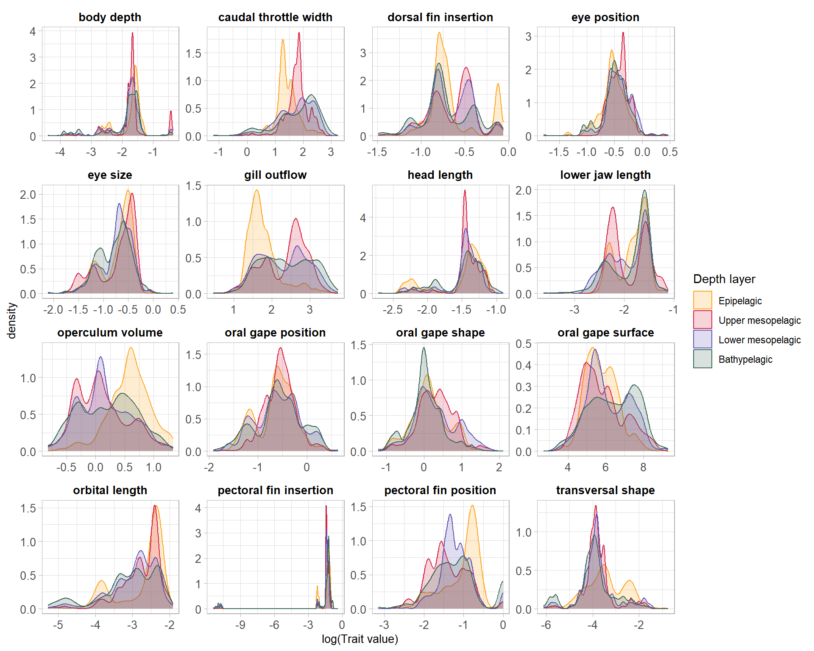{width=960}
:::

```{.r .cell-code}
ggsave("raw_traits_distribution.png", path = "figures", dpi = 700, height = 9, width = 12)
```
:::


## CWM - linear relationships
- selection R² < 0.6

::: {.cell}

```{.r .cell-code}
linear_relation <- np_bootstrapped_moments %>%
    mutate(trait= gsub("_"," ", trait))%>%
  filter(
    trait %in% c(
      "caudal throttle width",
      "large teeth",
      "oral gape surface",
      "gill outflow",
      "internal teeth",
      "oral gape shape",
      "small teeth",
      "orbital length",
      "transversal shape",
      "operculum volume",
      "body depth",
      "eye size"
    )
  )

linear_relation$trait <- factor(
  linear_relation$trait,
  levels = c(
    "caudal throttle width",
    "large teeth",
    "oral gape surface",
    "gill outflow",
    "internal teeth",
    "oral gape shape",
    "small teeth",
    "orbital length",
    "transversal shape",
    "operculum volume",
    "body depth",
    "eye size"
  )
)

ggplot(linear_relation, aes(x=depth, y=mean)) +
  geom_point(alpha=0.1, col="grey", size=0.8) +
  geom_smooth(method = "lm",col="#9565E5", se=T, linewidth=1, fill="#9565E5", alpha=0.5)+
  facet_wrap(~trait, scales = "free", ncol = 4)+
  theme_light()+
  ggpmisc::stat_poly_eq(formula = y ~ x, 
                        aes(label = paste(..rr.label.., ..p.value.label.. 
                                          , ..n.label..,sep = "*`,`~")),
                        parse = TRUE,
                        size=2.5,
                        label.x.npc = "right",
                        label.y.npc = "bottom",
                        vstep = -0.0005)+ 
  xlab("Trawling depth (m)")+
  ylab("Bootstrapped CWM")+
  theme(axis.title =  element_text(size =11), 
        strip.text = element_text(size =11, face="bold"), 
        axis.text= element_text(size=9),
        strip.background=element_rect(fill="white"),
        strip.text.x = element_text(size = 10, color = "black"))
```

::: {.cell-output-display}
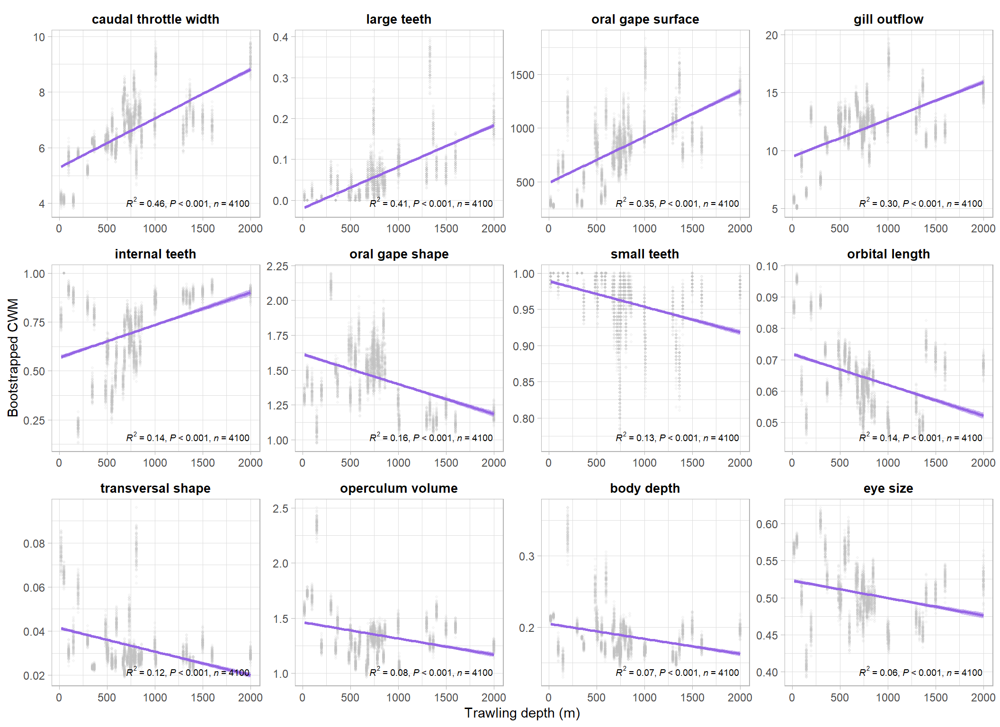{width=1056}
:::

```{.r .cell-code}
ggsave("CWM_boot_linear.png", path = "figures/additional_analyses", dpi = 700, height = 6, width = 10)
```
:::


# 2. Build a functional space using the mFD package

## 2.1 Compute data summaries  


::: {.cell}

```{.r .cell-code}
## Summary of the assemblages * species data.frame ----
asb_sp_fish_summ <- mFD::asb.sp.summary(asb_sp_w = depth_fish_biomass)
asb_sp_fish_occ  <- asb_sp_fish_summ$"asb_sp_occ"

htmltools::tagList(DT::datatable(asb_sp_fish_occ))
```

::: {.cell-output-display}

```{=html}
<div class="datatables html-widget html-fill-item" id="htmlwidget-27daac2d81b319bdcf96" style="width:100%;height:auto;"></div>
<script type="application/json" data-for="htmlwidget-27daac2d81b319bdcf96">{"x":{"filter":"none","vertical":false,"data":[["Upper mesopelagic","Bathypelagic","Epipelagic","Lower mesopelagic"],[0,1,0,0],[1,1,1,1],[1,1,1,1],[1,1,1,1],[0,1,0,0],[1,1,1,1],[0,1,0,1],[1,1,1,1],[1,1,1,1],[1,1,1,1],[1,1,1,1],[1,1,0,1],[0,1,0,1],[1,1,0,1],[0,1,0,1],[0,1,0,0],[1,1,0,1],[1,1,1,1],[0,1,0,0],[1,1,1,1],[1,1,1,1],[1,1,0,0],[0,1,0,1],[1,1,0,1],[0,1,0,0],[1,1,1,1],[1,1,1,1],[1,1,1,1],[1,1,1,1],[1,1,1,1],[0,1,0,0],[1,1,1,1],[1,1,1,1],[0,1,0,0],[1,1,0,1],[1,1,1,1],[1,1,1,1],[0,1,1,0],[1,1,1,1],[1,1,1,1],[0,1,1,1]],"container":"<table class=\"display\">\n  <thead>\n    <tr>\n      <th> <\/th>\n      <th>Anoplogaster_cornuta<\/th>\n      <th>Arctozenus_risso<\/th>\n      <th>Argyropelecus_hemigymnus<\/th>\n      <th>Argyropelecus_olfersii<\/th>\n      <th>Bathylagus_euryops<\/th>\n      <th>Benthosema_glaciale<\/th>\n      <th>Bolinichthys_supralateralis<\/th>\n      <th>Borostomias_antarcticus<\/th>\n      <th>Ceratoscopelus_maderensis<\/th>\n      <th>Chauliodus_sloani<\/th>\n      <th>Cyclothone_sp<\/th>\n      <th>Derichthys_serpentinus<\/th>\n      <th>Diaphus_metopoclampus<\/th>\n      <th>Evermannella_balbo<\/th>\n      <th>Gonostoma_elongatum<\/th>\n      <th>Holtbyrnia_anomala<\/th>\n      <th>Holtbyrnia_macrops<\/th>\n      <th>Lampanyctus_crocodilus<\/th>\n      <th>Lampanyctus_macdonaldi<\/th>\n      <th>Lestidiops_sphyrenoides<\/th>\n      <th>Lobianchia_gemellarii<\/th>\n      <th>Malacosteus_niger<\/th>\n      <th>Maulisia_argipalla<\/th>\n      <th>Maulisia_mauli<\/th>\n      <th>Maulisia_microlepis<\/th>\n      <th>Maurolicus_muelleri<\/th>\n      <th>Melanostigma_atlanticum<\/th>\n      <th>Melanostomias_bartonbeani<\/th>\n      <th>Myctophum_punctatum<\/th>\n      <th>Lampanyctus_ater<\/th>\n      <th>Normichthys_operosus<\/th>\n      <th>Notoscopelus_kroyeri<\/th>\n      <th>Paralepis_coregonoides<\/th>\n      <th>Photostylus_pycnopterus<\/th>\n      <th>Sagamichthys_schnakenbecki<\/th>\n      <th>Searsia_koefoedi<\/th>\n      <th>Serrivomer_beanii<\/th>\n      <th>Sigmops_bathyphilus<\/th>\n      <th>Stomias_boa<\/th>\n      <th>Xenodermichthys_copei<\/th>\n      <th>Notoscopelus_bolini<\/th>\n    <\/tr>\n  <\/thead>\n<\/table>","options":{"columnDefs":[{"className":"dt-right","targets":[1,2,3,4,5,6,7,8,9,10,11,12,13,14,15,16,17,18,19,20,21,22,23,24,25,26,27,28,29,30,31,32,33,34,35,36,37,38,39,40,41]},{"orderable":false,"targets":0},{"name":" ","targets":0},{"name":"Anoplogaster_cornuta","targets":1},{"name":"Arctozenus_risso","targets":2},{"name":"Argyropelecus_hemigymnus","targets":3},{"name":"Argyropelecus_olfersii","targets":4},{"name":"Bathylagus_euryops","targets":5},{"name":"Benthosema_glaciale","targets":6},{"name":"Bolinichthys_supralateralis","targets":7},{"name":"Borostomias_antarcticus","targets":8},{"name":"Ceratoscopelus_maderensis","targets":9},{"name":"Chauliodus_sloani","targets":10},{"name":"Cyclothone_sp","targets":11},{"name":"Derichthys_serpentinus","targets":12},{"name":"Diaphus_metopoclampus","targets":13},{"name":"Evermannella_balbo","targets":14},{"name":"Gonostoma_elongatum","targets":15},{"name":"Holtbyrnia_anomala","targets":16},{"name":"Holtbyrnia_macrops","targets":17},{"name":"Lampanyctus_crocodilus","targets":18},{"name":"Lampanyctus_macdonaldi","targets":19},{"name":"Lestidiops_sphyrenoides","targets":20},{"name":"Lobianchia_gemellarii","targets":21},{"name":"Malacosteus_niger","targets":22},{"name":"Maulisia_argipalla","targets":23},{"name":"Maulisia_mauli","targets":24},{"name":"Maulisia_microlepis","targets":25},{"name":"Maurolicus_muelleri","targets":26},{"name":"Melanostigma_atlanticum","targets":27},{"name":"Melanostomias_bartonbeani","targets":28},{"name":"Myctophum_punctatum","targets":29},{"name":"Lampanyctus_ater","targets":30},{"name":"Normichthys_operosus","targets":31},{"name":"Notoscopelus_kroyeri","targets":32},{"name":"Paralepis_coregonoides","targets":33},{"name":"Photostylus_pycnopterus","targets":34},{"name":"Sagamichthys_schnakenbecki","targets":35},{"name":"Searsia_koefoedi","targets":36},{"name":"Serrivomer_beanii","targets":37},{"name":"Sigmops_bathyphilus","targets":38},{"name":"Stomias_boa","targets":39},{"name":"Xenodermichthys_copei","targets":40},{"name":"Notoscopelus_bolini","targets":41}],"order":[],"autoWidth":false,"orderClasses":false}},"evals":[],"jsHooks":[]}</script>
```

:::
:::


## 2.2 Computing distances between species based on functional traits
- We have non-continuous traits so we use the __Gower distance__ _(metric = "gower")_ as this method allows traits weighting.
- __scale_euclid__ = TRUE

::: {.cell}

```{.r .cell-code}
sp_dist_fish <- mFD::funct.dist(
  sp_tr         = fish_traits,
  tr_cat        = fish_traits_cat,
  metric        = "gower",
  scale_euclid  = "scale_center",
  ordinal_var   = "classic",
  weight_type   = "equal",
  stop_if_NA    = TRUE)

## Output of the function mFD::funct.dist() ----
#round(sp_dist_fish, 3)
```
:::


## 2.3 Building functional spaces and chosing the best one
### 2.3.1 Computing several multimensional functional spaces and assessing their quality

- mFD evaluates the quality of PCoA-based multidimensional spaces according to the deviation between trait-based distances and distances in the functional space (extension of Maire et al. (2015) framework). 


::: {.cell}

```{.r .cell-code}
fspaces_quality_fish <- mFD::quality.fspaces(
  sp_dist             = sp_dist_fish,
  maxdim_pcoa         = 10,
  deviation_weighting = "absolute",
  fdist_scaling       = FALSE,
  fdendro             = "average")

## Quality metrics of functional spaces ----
round(fspaces_quality_fish$"quality_fspaces", 3)
```

::: {.cell-output .cell-output-stdout}
```
               mad
pcoa_1d      0.143
pcoa_2d      0.079
pcoa_3d      0.050
pcoa_4d      0.030
pcoa_5d      0.023
pcoa_6d      0.017
pcoa_7d      0.014
pcoa_8d      0.015
pcoa_9d      0.017
pcoa_10d     0.019
tree_average 0.041
```
:::
:::

The space with the best quality has the lowest quality metric. 5-D space good ?

__Variance explained by each axis__

::: {.cell}

```{.r .cell-code}
# Extract eigenvalues information
eigenvalues_info <- fspaces_quality_fish$"details_fspaces"$"pc_eigenvalues"

# Create a dataframe to store the results
variance_df <- data.frame(
  PC = c("PC1", "PC2", "PC3", "PC4"),
  VarianceExplained = c(
    eigenvalues_info[1, "Cum_corr_eig"] * 100,
    (eigenvalues_info[2, "Cum_corr_eig"] - eigenvalues_info[1, "Cum_corr_eig"]) * 100,
    (eigenvalues_info[3, "Cum_corr_eig"] - eigenvalues_info[2, "Cum_corr_eig"]) * 100,
    (eigenvalues_info[4, "Cum_corr_eig"] - eigenvalues_info[3, "Cum_corr_eig"]) * 100
  )
)

htmltools::tagList(DT::datatable(variance_df))
```

::: {.cell-output-display}

```{=html}
<div class="datatables html-widget html-fill-item" id="htmlwidget-e7d53d8dbe92a1c51dad" style="width:100%;height:auto;"></div>
<script type="application/json" data-for="htmlwidget-e7d53d8dbe92a1c51dad">{"x":{"filter":"none","vertical":false,"data":[["1","2","3","4"],["PC1","PC2","PC3","PC4"],[15.82521695348401,12.31326765670068,7.915069706422228,7.133223605972583]],"container":"<table class=\"display\">\n  <thead>\n    <tr>\n      <th> <\/th>\n      <th>PC<\/th>\n      <th>VarianceExplained<\/th>\n    <\/tr>\n  <\/thead>\n<\/table>","options":{"columnDefs":[{"className":"dt-right","targets":2},{"orderable":false,"targets":0},{"name":" ","targets":0},{"name":"PC","targets":1},{"name":"VarianceExplained","targets":2}],"order":[],"autoWidth":false,"orderClasses":false}},"evals":[],"jsHooks":[]}</script>
```

:::
:::


### 2.3.2 Illustrating the quality of the functional spaces


::: {.cell}

```{.r .cell-code}
mFD::quality.fspaces.plot(
  fspaces_quality            = fspaces_quality_fish,
  quality_metric             = "mad",
  fspaces_plot               = c("tree_average", "pcoa_2d", "pcoa_3d", 
                                 "pcoa_4d", "pcoa_5d", "pcoa_6d"),
  name_file                  = NULL,
  range_dist                 = NULL,
  range_dev                  = NULL,
  range_qdev                 = NULL,
  gradient_deviation         = c(neg = "darkblue", nul = "grey80", pos = "darkred"),
  gradient_deviation_quality = c(low = "yellow", high = "red"),
  x_lab                      = "Trait-based distance")
```

::: {.cell-output-display}
{width=1248}
:::
:::


This function generates a figure with three panels (in rows) for each selected functional space (in columns). Each column represents a functional space, the value of the quality metric is written on the top of each column. The x-axis of all panels represents trait-based distances. The y-axis is different for each row:

+ on the first (top) row, the y-axis represents species functional distances in the multidimensional space. Thus, the closer species are to the 1:1 line, the better distances in the functional space fit trait-based ones.
+ on the second row, the y-axis shows the raw deviation of species distances in the functional space compared to trait-based distances. Thus, the raw deviation reflects the distance to the horizontal line.
+ on the third row (bottom), the y-axis shows the absolute or squared deviation of the (“scaled”) distance in the functional space. It is the deviation that is taken into account for computing the quality metric.

### 2.3.3 Testing the correlation between functional axes and traits

::: {.cell}

```{.r .cell-code}
sp_faxes_coord_fish <- fspaces_quality_fish$"details_fspaces"$"sp_pc_coord"

# As we have 26 traits we have to split the df to see correlation between functional axes and traits 
# first set ----
fish_traits_1 <- fish_traits%>%
  select(1:9)

fish_tr_faxes <- mFD::traits.faxes.cor(
  sp_tr          = fish_traits_1, 
  sp_faxes_coord = sp_faxes_coord_fish[ , c("PC1", "PC2", "PC3", "PC4")], 
  plot           = T)

## Print traits with significant effect ----
fish_tr_faxes$"tr_faxes_stat"[which(fish_tr_faxes$"tr_faxes_stat"$"p.value" < 0.05), ]
```

::: {.cell-output .cell-output-stdout}
```
                trait axis         test stat value p.value
1            eye_size  PC1 Linear Model   r2 0.166  0.0081
2            eye_size  PC2 Linear Model   r2 0.160  0.0096
3            eye_size  PC3 Linear Model   r2 0.140  0.0158
4            eye_size  PC4 Linear Model   r2 0.139  0.0164
5      orbital_length  PC1 Linear Model   r2 0.398  0.0000
6      orbital_length  PC2 Linear Model   r2 0.114  0.0306
10       gill_outflow  PC2 Linear Model   r2 0.520  0.0000
13  oral_gape_surface  PC1 Linear Model   r2 0.136  0.0176
14  oral_gape_surface  PC2 Linear Model   r2 0.499  0.0000
18    oral_gape_shape  PC2 Linear Model   r2 0.141  0.0157
24 oral_gape_position  PC4 Linear Model   r2 0.200  0.0034
26   lower_jaw_length  PC2 Linear Model   r2 0.694  0.0000
29        head_length  PC1 Linear Model   r2 0.315  0.0001
30        head_length  PC2 Linear Model   r2 0.400  0.0000
34         body_depth  PC2 Linear Model   r2 0.360  0.0000
35         body_depth  PC3 Linear Model   r2 0.196  0.0038
```
:::

```{.r .cell-code}
## Plot ----
fish_tr_faxes$"tr_faxes_plot"
```

::: {.cell-output-display}
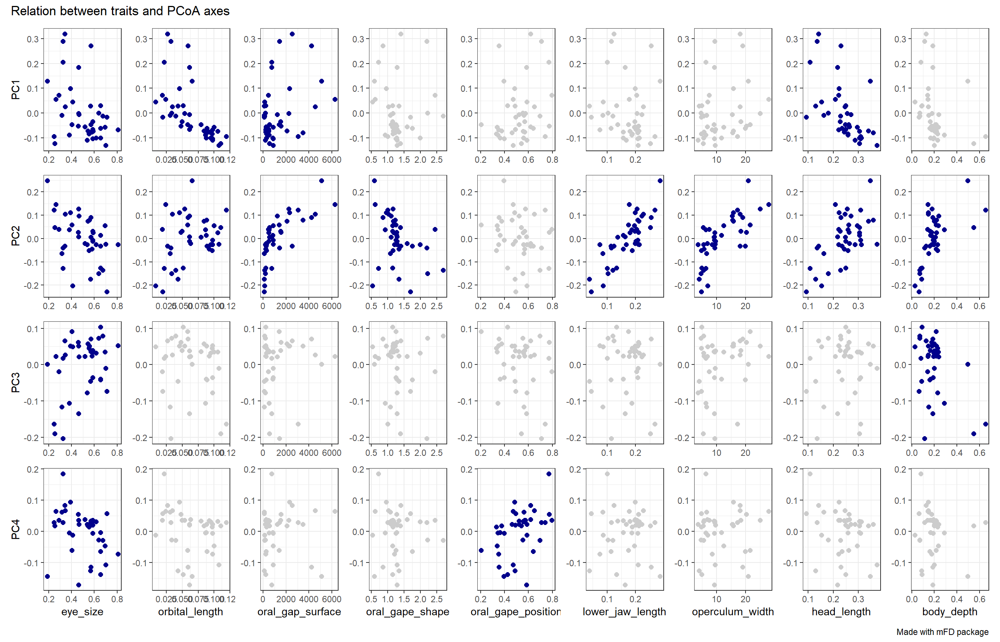{width=1344}
:::
:::

::: {.cell}

```{.r .cell-code}
# second set ----
fish_traits_2 <- fish_traits%>%
  select(10:18)

fish_tr_faxes_2 <- mFD::traits.faxes.cor(
  sp_tr          = fish_traits_2, 
  sp_faxes_coord = sp_faxes_coord_fish[ , c("PC1", "PC2", "PC3", "PC4")], 
  plot           = T)

## Print traits with significant effect ----
fish_tr_faxes_2$"tr_faxes_stat"[which(fish_tr_faxes_2$"tr_faxes_stat"$"p.value" < 0.05), ]
```

::: {.cell-output .cell-output-stdout}
```
                    trait axis           test stat value p.value
2   pectoral_fin_position  PC2   Linear Model   r2 0.268  0.0005
5  pectoral_fin_insertion  PC1   Linear Model   r2 0.272  0.0005
6  pectoral_fin_insertion  PC2   Linear Model   r2 0.412  0.0000
9       transversal_shape  PC1   Linear Model   r2 0.114  0.0309
11      transversal_shape  PC3   Linear Model   r2 0.228  0.0016
14  caudal_throttle_width  PC2   Linear Model   r2 0.402  0.0000
19   dorsal_fin_insertion  PC3   Linear Model   r2 0.170  0.0073
23           eye_position  PC3   Linear Model   r2 0.200  0.0034
26       operculum_volume  PC2   Linear Model   r2 0.126  0.0227
32    ventral_photophores  PC4 Kruskal-Wallis eta2 0.590  0.0000
33             gland_head  PC1 Kruskal-Wallis eta2 0.245  0.0011
```
:::

```{.r .cell-code}
## Plot ----
fish_tr_faxes_2$"tr_faxes_plot"
```

::: {.cell-output-display}
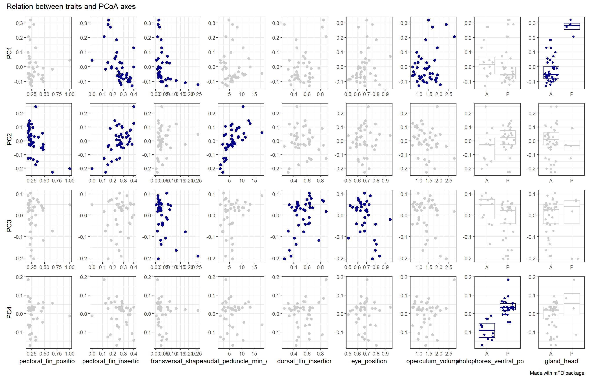{width=1344}
:::
:::

::: {.cell}

```{.r .cell-code}
# third set ----
fish_traits_3 <- fish_traits%>%
  select(19:25)

fish_tr_faxes_3 <- mFD::traits.faxes.cor(
  sp_tr          = fish_traits_3, 
  sp_faxes_coord = sp_faxes_coord_fish[ , c("PC1", "PC2", "PC3", "PC4")], 
  plot           = T)

## Print traits with significant effect ----
fish_tr_faxes_3$"tr_faxes_stat"[which(fish_tr_faxes_3$"tr_faxes_stat"$"p.value" < 0.05), ]
```

::: {.cell-output .cell-output-stdout}
```
              trait axis           test stat value p.value
1       chin_barbel  PC1 Kruskal-Wallis eta2 0.142  0.0107
4       chin_barbel  PC4 Kruskal-Wallis eta2 0.183  0.0043
5       small_teeth  PC1 Kruskal-Wallis eta2 0.323  0.0002
9       large_teeth  PC1 Kruskal-Wallis eta2 0.467  0.0000
10      large_teeth  PC2 Kruskal-Wallis eta2 0.205  0.0027
13       fang_teeth  PC1 Kruskal-Wallis eta2 0.410  0.0000
21   internal_teeth  PC1 Kruskal-Wallis eta2 0.073  0.0499
23   internal_teeth  PC3 Kruskal-Wallis eta2 0.626  0.0000
25 gill_raker_types  PC1 Kruskal-Wallis eta2 0.327  0.0007
26 gill_raker_types  PC2 Kruskal-Wallis eta2 0.364  0.0004
```
:::

```{.r .cell-code}
## Plot ----
fish_tr_faxes_3$"tr_faxes_plot"
```

::: {.cell-output-display}
{width=1344}
:::
:::


__Summary of traits with a significant effect__


::: {.cell}

```{.r .cell-code}
sp_faxes_coord_fish <- fspaces_quality_fish$"details_fspaces"$"sp_pc_coord"

fish_tr_faxes <- mFD::traits.faxes.cor(
  sp_tr          = fish_traits, 
  sp_faxes_coord = sp_faxes_coord_fish[ , c("PC1", "PC2", "PC3", "PC4")], 
  plot           = F)

## Print traits with significant effect ----
traits_effect <- fish_tr_faxes[which(fish_tr_faxes$p.value< 0.05),] %>% 
  as.data.frame() %>% 
  arrange(axis, desc(value))

htmltools::tagList(DT::datatable(traits_effect))
```

::: {.cell-output-display}

```{=html}
<div class="datatables html-widget html-fill-item" id="htmlwidget-da34f9eb0f30cdc87ff5" style="width:100%;height:auto;"></div>
<script type="application/json" data-for="htmlwidget-da34f9eb0f30cdc87ff5">{"x":{"filter":"none","vertical":false,"data":[["1","2","3","4","5","6","7","8","9","10","11","12","13","14","15","16","17","18","19","20","21","22","23","24","25","26","27","28","29","30","31","32","33","34","35","36","37","38","39"],["large_teeth","fang_teeth","orbital_length","gill_raker_types","small_teeth","head_length","pectoral_fin_insertion","gland_head","eye_size","chin_barbel","oral_gape_surface","transversal_shape","internal_teeth","lower_jaw_length","gill_outflow","oral_gape_surface","pectoral_fin_insertion","caudal_throttle_width","head_length","oral_gape_axis","gill_raker_types","body_depth","pectoral_fin_position","large_teeth","eye_size","oral_gape_shape","operculum_volume","orbital_length","internal_teeth","transversal_shape","oral_gape_axis","eye_position","body_depth","dorsal_fin_insertion","eye_size","ventral_photophores","oral_gape_position","chin_barbel","eye_size"],["PC1","PC1","PC1","PC1","PC1","PC1","PC1","PC1","PC1","PC1","PC1","PC1","PC1","PC2","PC2","PC2","PC2","PC2","PC2","PC2","PC2","PC2","PC2","PC2","PC2","PC2","PC2","PC2","PC3","PC3","PC3","PC3","PC3","PC3","PC3","PC4","PC4","PC4","PC4"],["Kruskal-Wallis","Kruskal-Wallis","Linear Model","Kruskal-Wallis","Kruskal-Wallis","Linear Model","Linear Model","Kruskal-Wallis","Linear Model","Kruskal-Wallis","Linear Model","Linear Model","Kruskal-Wallis","Linear Model","Linear Model","Linear Model","Linear Model","Linear Model","Linear Model","Kruskal-Wallis","Kruskal-Wallis","Linear Model","Linear Model","Kruskal-Wallis","Linear Model","Linear Model","Linear Model","Linear Model","Kruskal-Wallis","Linear Model","Kruskal-Wallis","Linear Model","Linear Model","Linear Model","Linear Model","Kruskal-Wallis","Linear Model","Kruskal-Wallis","Linear Model"],["eta2","eta2","r2","eta2","eta2","r2","r2","eta2","r2","eta2","r2","r2","eta2","r2","r2","r2","r2","r2","r2","eta2","eta2","r2","r2","eta2","r2","r2","r2","r2","eta2","r2","eta2","r2","r2","r2","r2","eta2","r2","eta2","r2"],[0.467,0.41,0.398,0.327,0.323,0.315,0.272,0.245,0.166,0.142,0.136,0.114,0.073,0.694,0.52,0.499,0.412,0.402,0.4,0.367,0.364,0.36,0.268,0.205,0.16,0.141,0.126,0.114,0.626,0.228,0.209,0.2,0.196,0.17,0.14,0.59,0.2,0.183,0.139],[0,0,0,0.0007,0.0002,0.0001,0.0005,0.0011,0.0081,0.0107,0.0176,0.0309,0.0499,0,0,0,0,0,0,0.0003,0.0004,0,0.0005,0.0027,0.009599999999999999,0.0157,0.0227,0.0306,0,0.0016,0.007,0.0034,0.0038,0.0073,0.0158,0,0.0034,0.0043,0.0164]],"container":"<table class=\"display\">\n  <thead>\n    <tr>\n      <th> <\/th>\n      <th>trait<\/th>\n      <th>axis<\/th>\n      <th>test<\/th>\n      <th>stat<\/th>\n      <th>value<\/th>\n      <th>p.value<\/th>\n    <\/tr>\n  <\/thead>\n<\/table>","options":{"columnDefs":[{"className":"dt-right","targets":[5,6]},{"orderable":false,"targets":0},{"name":" ","targets":0},{"name":"trait","targets":1},{"name":"axis","targets":2},{"name":"test","targets":3},{"name":"stat","targets":4},{"name":"value","targets":5},{"name":"p.value","targets":6}],"order":[],"autoWidth":false,"orderClasses":false}},"evals":[],"jsHooks":[]}</script>
```

:::
:::


## 2.4 Plotting the selected functional space and position of species

::: {.cell}

```{.r .cell-code}
sp_faxes_coord_fish <- fspaces_quality_fish$"details_fspaces"$"sp_pc_coord"

big_plot <- mFD::funct.space.plot(
  sp_faxes_coord  = sp_faxes_coord_fish[ , c("PC1", "PC2", "PC3", "PC4")],
  faxes           = c("PC1", "PC2", "PC3", "PC4"),
  name_file       = NULL,
  faxes_nm        = NULL,
  range_faxes     = c(NA, NA),
  plot_ch         = TRUE,
  shape_pool      = 20,
  size_pool = 2.5,
  size_vert = 1.5,
  color_ch = "darkgrey",
  color_vert      = "black",
  fill_vert       = "black",
  color_pool = "grey",
  plot_vertices   = TRUE,
  check_input     = TRUE)

big_plot$"patchwork"
```

::: {.cell-output-display}
{width=768}
:::

```{.r .cell-code}
ggsave("functional_space.png", path = "figures", dpi = 700, height = 9, width = 9)
```
:::

::: {.cell}

```{.r .cell-code}
big_plot$PC1_PC2
```

::: {.cell-output-display}
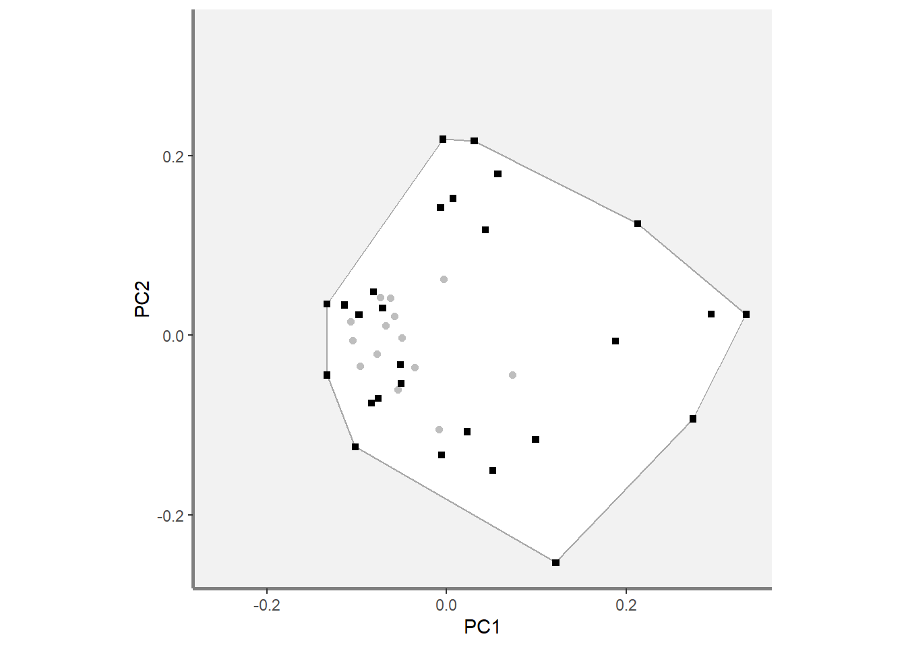{width=672}
:::

```{.r .cell-code}
ggsave("functional_space_PC1_PC2.png", path = "figures", dpi = 700, height = 4, width = 4)
```
:::

::: {.cell}

```{.r .cell-code}
big_plot$PC3_PC4
```

::: {.cell-output-display}
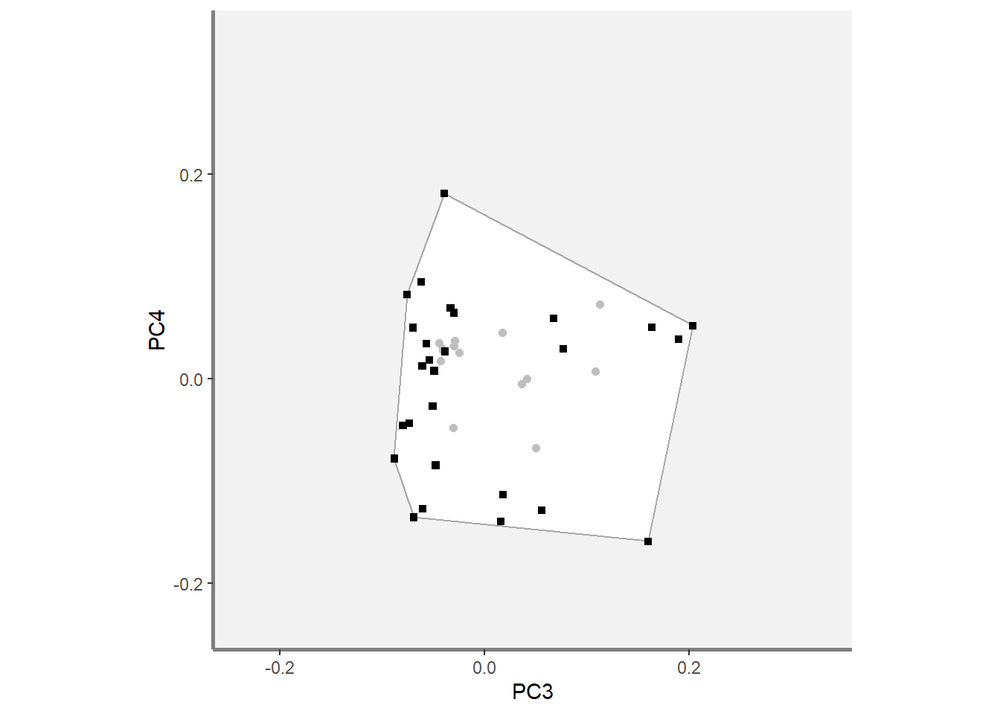{width=672}
:::

```{.r .cell-code}
ggsave("functional_space_PC3_PC4.png", path = "figures", dpi = 700, height = 4, width = 4)
```
:::


# 3. Computing and plotting FD indices using the mFD package

## 3.1 Computing and plotting alpha FD indices


::: {.cell}

```{.r .cell-code}
alpha_fd_indices_fish <- mFD::alpha.fd.multidim(
  sp_faxes_coord   = sp_faxes_coord_fish[ , c("PC1", "PC2", "PC3", "PC4")],
  asb_sp_w         = depth_fish_biomass,
  scaling          = TRUE,
  check_input      = TRUE,
  details_returned = TRUE)
```
:::


The function has two main outputs:

+ a data.frame gathering indices values in each assemblage (for FIde values, there are as many columns as there are axes to the studied functional space).


::: {.cell}

```{.r .cell-code}
fd_ind_values_fish <- alpha_fd_indices_fish$"functional_diversity_indices"
htmltools::tagList(DT::datatable(round(fd_ind_values_fish, 3)))
```

::: {.cell-output-display}

```{=html}
<div class="datatables html-widget html-fill-item" id="htmlwidget-c62df53bd70497b09e5a" style="width:100%;height:auto;"></div>
<script type="application/json" data-for="htmlwidget-c62df53bd70497b09e5a">{"x":{"filter":"none","vertical":false,"data":[["Upper mesopelagic","Bathypelagic","Epipelagic","Lower mesopelagic"],[28,41,24,32],[0.456,0.47,0.416,0.469],[0.5610000000000001,0.54,0.521,0.525],[0.283,0.26,0.25,0.274],[0.324,0.346,0.008999999999999999,0.353],[0.74,1,0.358,0.642],[0.608,0.667,0.629,0.623],[0.281,0.26,0.243,0.272],[0.385,0.398,0.399,0.382],[-0.042,-0.021,-0.031,-0.026],[0.022,0.021,0.055,0.029],[0.007,-0.035,-0.033,-0.011],[0.002,0.022,0.041,0.015]],"container":"<table class=\"display\">\n  <thead>\n    <tr>\n      <th> <\/th>\n      <th>sp_richn<\/th>\n      <th>fdis<\/th>\n      <th>fmpd<\/th>\n      <th>fnnd<\/th>\n      <th>feve<\/th>\n      <th>fric<\/th>\n      <th>fdiv<\/th>\n      <th>fori<\/th>\n      <th>fspe<\/th>\n      <th>fide_PC1<\/th>\n      <th>fide_PC2<\/th>\n      <th>fide_PC3<\/th>\n      <th>fide_PC4<\/th>\n    <\/tr>\n  <\/thead>\n<\/table>","options":{"columnDefs":[{"className":"dt-right","targets":[1,2,3,4,5,6,7,8,9,10,11,12,13]},{"orderable":false,"targets":0},{"name":" ","targets":0},{"name":"sp_richn","targets":1},{"name":"fdis","targets":2},{"name":"fmpd","targets":3},{"name":"fnnd","targets":4},{"name":"feve","targets":5},{"name":"fric","targets":6},{"name":"fdiv","targets":7},{"name":"fori","targets":8},{"name":"fspe","targets":9},{"name":"fide_PC1","targets":10},{"name":"fide_PC2","targets":11},{"name":"fide_PC3","targets":12},{"name":"fide_PC4","targets":13}],"order":[],"autoWidth":false,"orderClasses":false}},"evals":[],"jsHooks":[]}</script>
```

:::
:::

::: {.cell}

```{.r .cell-code}
fd_ind_values_fish_df <- as.data.frame(fd_ind_values_fish) %>% 
  tibble::rownames_to_column(var = "depth_layer") %>% 
  tidyr::pivot_longer(!depth_layer, names_to = "indices", values_to = "values" )

fd_ind_values_fish_df$depth_layer <- factor(fd_ind_values_fish_df$depth_layer, 
                                            levels = c("Epipelagic", "Upper mesopelagic",
                                                       "Lower mesopelagic", "Bathypelagic"))

fd_ind_values_fish_df$indices <- factor(fd_ind_values_fish_df$indices,
                                        levels = c("sp_richn", "fric", "fdis", "fdiv", 
                                        "feve", "fspe", "fide_PC1", "fide_PC2", "fide_PC3",
                                        "fide_PC4"),
                                        labels = c("Species richness", "Functional richness", "Functional dispersion", 
                                                   "Functional divergence", 
                                                   "Functional evenness", "Functional specialization",
                                                   "Functional identity PC1", "Functional identity PC2", 
                                                   "Functional identity PC3", "Functional identity PC4"))

fd_ind_values_fish_df2 <- fd_ind_values_fish_df %>% 
  filter(indices%in%c("Functional dispersion", "Functional richness",
                      "Functional divergence", "Functional specialization",
                      "Functional evenness"))

ggplot(fd_ind_values_fish_df2 , aes(x=depth_layer, y=values, fill=depth_layer)) +
  scale_fill_manual(values = c("#FEA520","#D62246","#6255B4","#3C685A"))+
  geom_bar(stat="identity", position=position_dodge(), alpha=0.8)+
  facet_wrap(~indices, ncol=3)+
  theme_minimal()+
  labs(fill="Depth layer")+
  theme(axis.text.x = element_blank(),
        legend.text = element_text(size =10),
        axis.title.x = element_blank(), 
        strip.text = element_text(face="bold", size=11), 
        panel.border = element_blank())
```

::: {.cell-output-display}
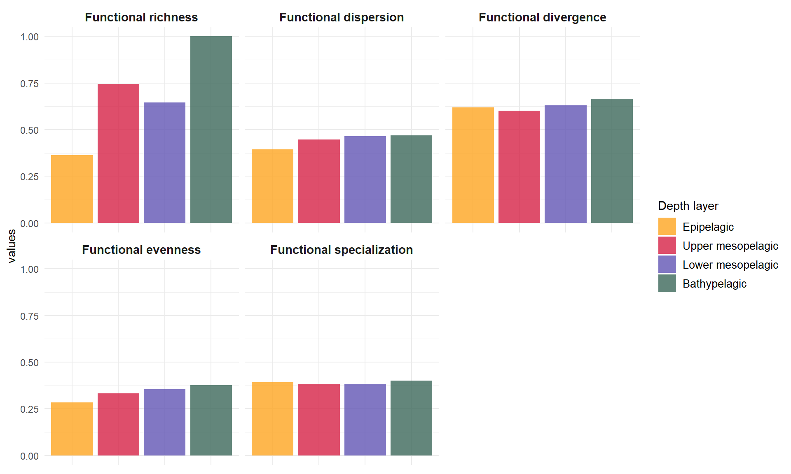{width=960}
:::

```{.r .cell-code}
ggsave("indices.png", path = "figures", dpi = 700, width = 8)
```
:::

::: {.cell}

```{.r .cell-code}
sp_richness <- fd_ind_values_fish_df %>% 
  filter(indices%in%c("Species richness"))

ggplot(sp_richness , aes(x=depth_layer, y=values, fill=depth_layer)) +
  scale_fill_manual(values = c("#FEA520","#D62246","#6255B4","#3C685A"))+
  geom_bar(stat="identity", position=position_dodge(), alpha=0.8)+
  facet_wrap(~indices, ncol=3)+
  theme_minimal()+
 guides(fill="none")+
  theme(axis.text.x = element_blank(),
        legend.text = element_text(size =10),
        axis.title.x = element_blank(), 
        strip.text = element_text(face="bold", size=13), 
        panel.border = element_blank())
```

::: {.cell-output-display}
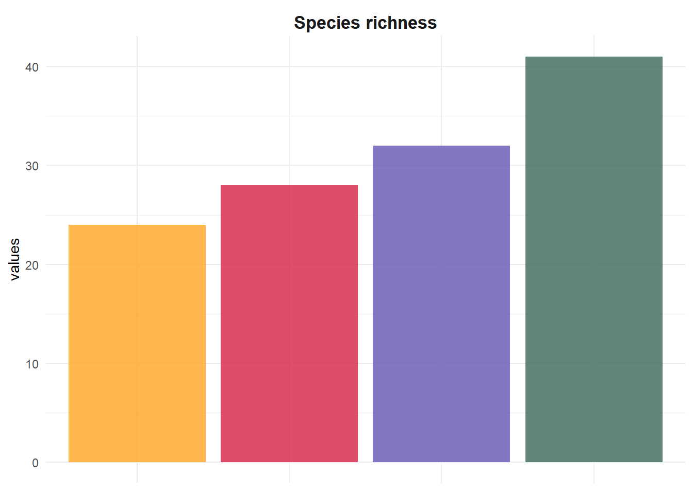{width=672}
:::

```{.r .cell-code}
ggsave("species_richness.png", path = "figures", dpi = 700, width = 3, height = 3)
```
:::


__functional identity__

::: {.cell}

```{.r .cell-code}
fd_identity <- fd_ind_values_fish_df %>% 
  filter(indices%in%c("Functional identity PC1",
                      "Functional identity PC2", "Functional identity PC3",
                      "Functional identity PC4"))

ggplot(fd_identity, aes(x=depth_layer, y=values, fill=depth_layer)) +
  # paletteer::scale_fill_paletteer_d("ggsci::category20c_d3")+
  scale_fill_manual(values = c("#FEA520","#D62246","#6255B4","#3C685A"))+
  geom_bar(stat="identity", position=position_dodge(), alpha=0.8)+
  facet_wrap(~indices, ncol=2)+
  theme_minimal()+
  guides(fill="none")+
  theme(axis.text.x = element_blank(),
        legend.text = element_text(size =10),
        axis.title.x = element_blank(), 
        strip.text = element_text(face="bold"))
```

::: {.cell-output-display}
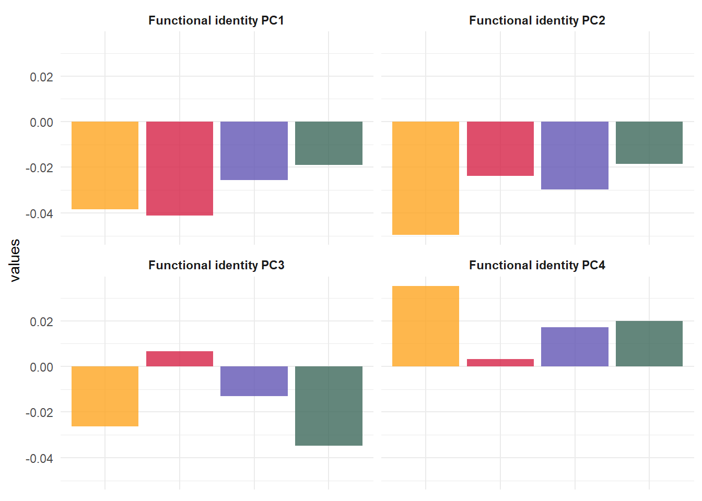{width=672}
:::

```{.r .cell-code}
ggsave("fd_identity.png", path = "figures", dpi = 700, width = 6, height = 5)
```
:::


+ a details list of data.frames and lists gathering information such as coordinates of centroids, distances and identity of the nearest neighbour, distances to the centroid, etc. The user does not have to directly use it but it will be useful if FD indices are then plotted. It can be retrieved through:


::: {.cell}

```{.r .cell-code}
details_list_fish <- alpha_fd_indices_fish$"details"
```
:::

::: {.cell}

```{.r .cell-code}
plots_alpha <- mFD::alpha.multidim.plot(
  output_alpha_fd_multidim = alpha_fd_indices_fish,
  plot_asb_nm              = c("Epipelagic", "Bathypelagic"),
  ind_nm                   = c("fdis", "fric", "fdiv", 
                              "fspe", "fide", "feve"),
  faxes                    = NULL,
  faxes_nm                 = NULL,
  range_faxes              = c(NA, NA),
  plot_sp_nm               = NULL,
  save_file                = FALSE,
  check_input              = TRUE) 
```
:::


### __FRic Functional Richness__

- the proportion of functional space filled by species of the studied assemblage, i.e. the volume inside the convex-hull shaping species. To compute FRic the number of species must be at least higher than the number of functional axis + 1.


- Only between epipelagic and bathypelagic layers 

::: {.cell}

```{.r .cell-code}
plots_alpha$"fric"$"patchwork"
```

::: {.cell-output-display}
{width=1152}
:::
:::


### __FDiv Functional Divergence__

- the proportion of the biomass supported by the species with the most extreme functional traits i.e. the ones located close to the edge of the convex-hull filled by the assemblage

::: {.cell}

```{.r .cell-code}
plots_alpha$"fdiv"$"patchwork"
```

::: {.cell-output-display}
{width=1152}
:::
:::


### __FEve Functional Evenness__

- the regularity of biomass distribution in the functional space using the Minimum Spanning Tree linking all species present in the assemblage.

::: {.cell}

```{.r .cell-code}
plots_alpha$"feve"$"patchwork"
```

::: {.cell-output-display}
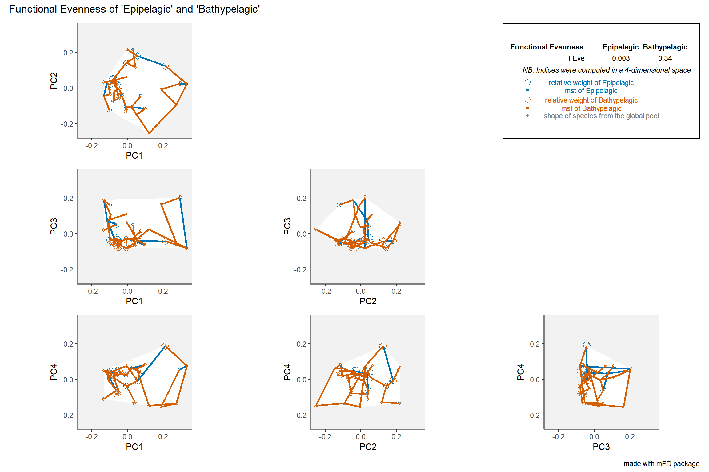{width=1152}
:::
:::


### __FSpe Functional Specialization__

- the biomass weighted mean distance to the mean position of species from the global pool (present in all assemblages).

::: {.cell}

```{.r .cell-code}
plots_alpha$"fspe"$"patchwork"
```

::: {.cell-output-display}
{width=1152}
:::
:::


### __FDis Functional Dispersion__

- the biomass weighted deviation of species traits values from the center of the functional space filled by the assemblage i.e. the biomass-weighted mean distance to the biomass-weighted mean trait values of the assemblage.


::: {.cell}

```{.r .cell-code}
plots_alpha$"fdis"$"patchwork"
```

::: {.cell-output-display}
{width=1152}
:::
:::


### __FIde Functional Identity__
- the mean traits values for the assemblage. FIde is always computed when FDis is computed.


::: {.cell}

```{.r .cell-code}
plots_alpha$"fide"$"patchwork"
```

::: {.cell-output-display}
{width=1152}
:::
:::


## 3.2.Computing and plotting beta FD indices

- The function returns a list containing:
+ a dist object with beta indices values for each pair of assemblages:

::: {.cell}

```{.r .cell-code}
beta_fd_indices_fish <- mFD::beta.fd.multidim(
      sp_faxes_coord   = sp_faxes_coord_fish[ , c("PC1", "PC2", "PC3", "PC4")],
      asb_sp_occ       = asb_sp_fish_occ,
      check_input      = TRUE,
      beta_family      = c("Jaccard"),
      details_returned = TRUE)
```

::: {.cell-output .cell-output-stdout}
```
Serial computing of convex hulls shaping assemblages with conv1

  |                                                                            
  |                                                                      |   0%
  |                                                                            
  |==================                                                    |  25%
  |                                                                            
  |===================================                                   |  50%
  |                                                                            
  |====================================================                  |  75%
  |                                                                            
  |======================================================================| 100%
Serial computing of intersections between pairs of assemblages with inter_geom_coord

  |                                                                            
  |                                                                      |   0%
  |                                                                            
  |============                                                          |  17%
  |                                                                            
  |=======================                                               |  33%
  |                                                                            
  |===================================                                   |  50%
  |                                                                            
  |===============================================                       |  67%
  |                                                                            
  |==========================================================            |  83%
  |                                                                            
  |======================================================================| 100%
```
:::

```{.r .cell-code}
head(beta_fd_indices_fish$"pairasb_fbd_indices", 10)
```

::: {.cell-output .cell-output-stdout}
```
$jac_diss
                  Upper mesopelagic Bathypelagic Epipelagic
Bathypelagic              0.2597064                        
Epipelagic                0.5162017    0.6417795           
Lower mesopelagic         0.1632621    0.3583710  0.4417311

$jac_turn
                  Upper mesopelagic Bathypelagic   Epipelagic
Bathypelagic           0.000000e+00                          
Epipelagic             2.545169e-04 0.000000e+00             
Lower mesopelagic      3.697387e-02 6.636871e-16 6.778430e-05

$jac_nest
                  Upper mesopelagic Bathypelagic Epipelagic
Bathypelagic              0.2597064                        
Epipelagic                0.5159472    0.6417795           
Lower mesopelagic         0.1262882    0.3583710  0.4416633
```
:::
:::

+ a vector containing the FRic value for each assemblage retrieved through the details_beta list:


::: {.cell}

```{.r .cell-code}
beta_fd_indices_fish$"details"$"asb_FRic"
```

::: {.cell-output .cell-output-stdout}
```
Upper mesopelagic      Bathypelagic        Epipelagic Lower mesopelagic 
        0.7402936         1.0000000         0.3582205         0.6416290 
```
:::
:::

+ a list of vectors containing names of species being vertices of the convex hull for each assemblage retrieved through the details_beta list:

::: {.cell}

```{.r .cell-code}
beta_fd_indices_fish$"details"$"asb_vertices"
```

::: {.cell-output .cell-output-stdout}
```
$`Upper mesopelagic`
 [1] "Stomias_boa"                "Malacosteus_niger"         
 [3] "Melanostigma_atlanticum"    "Argyropelecus_olfersii"    
 [5] "Xenodermichthys_copei"      "Serrivomer_beanii"         
 [7] "Arctozenus_risso"           "Borostomias_antarcticus"   
 [9] "Maurolicus_muelleri"        "Sagamichthys_schnakenbecki"
[11] "Benthosema_glaciale"        "Lestidiops_sphyrenoides"   
[13] "Lobianchia_gemellarii"      "Lampanyctus_crocodilus"    
[15] "Holtbyrnia_macrops"         "Ceratoscopelus_maderensis" 
[17] "Chauliodus_sloani"          "Evermannella_balbo"        
[19] "Maulisia_mauli"             "Derichthys_serpentinus"    
[21] "Paralepis_coregonoides"     "Argyropelecus_hemigymnus"  
[23] "Melanostomias_bartonbeani" 

$Bathypelagic
 [1] "Argyropelecus_olfersii"    "Paralepis_coregonoides"   
 [3] "Borostomias_antarcticus"   "Malacosteus_niger"        
 [5] "Melanostigma_atlanticum"   "Argyropelecus_hemigymnus" 
 [7] "Gonostoma_elongatum"       "Arctozenus_risso"         
 [9] "Serrivomer_beanii"         "Maulisia_microlepis"      
[11] "Stomias_boa"               "Lestidiops_sphyrenoides"  
[13] "Bathylagus_euryops"        "Sigmops_bathyphilus"      
[15] "Lampanyctus_crocodilus"    "Maulisia_argipalla"       
[17] "Ceratoscopelus_maderensis" "Maulisia_mauli"           
[19] "Benthosema_glaciale"       "Evermannella_balbo"       
[21] "Chauliodus_sloani"         "Maurolicus_muelleri"      
[23] "Lampanyctus_macdonaldi"    "Anoplogaster_cornuta"     
[25] "Derichthys_serpentinus"    "Holtbyrnia_anomala"       
[27] "Melanostomias_bartonbeani"

$Epipelagic
 [1] "Stomias_boa"               "Melanostigma_atlanticum"  
 [3] "Argyropelecus_olfersii"    "Arctozenus_risso"         
 [5] "Borostomias_antarcticus"   "Ceratoscopelus_maderensis"
 [7] "Xenodermichthys_copei"     "Lestidiops_sphyrenoides"  
 [9] "Lobianchia_gemellarii"     "Myctophum_punctatum"      
[11] "Maurolicus_muelleri"       "Benthosema_glaciale"      
[13] "Chauliodus_sloani"         "Paralepis_coregonoides"   
[15] "Lampanyctus_crocodilus"    "Serrivomer_beanii"        
[17] "Argyropelecus_hemigymnus"  "Melanostomias_bartonbeani"
[19] "Sigmops_bathyphilus"      

$`Lower mesopelagic`
 [1] "Stomias_boa"                 "Melanostigma_atlanticum"    
 [3] "Argyropelecus_olfersii"      "Xenodermichthys_copei"      
 [5] "Serrivomer_beanii"           "Borostomias_antarcticus"    
 [7] "Lestidiops_sphyrenoides"     "Gonostoma_elongatum"        
 [9] "Lampanyctus_crocodilus"      "Arctozenus_risso"           
[11] "Bolinichthys_supralateralis" "Maulisia_mauli"             
[13] "Benthosema_glaciale"         "Ceratoscopelus_maderensis"  
[15] "Holtbyrnia_macrops"          "Maurolicus_muelleri"        
[17] "Sagamichthys_schnakenbecki"  "Chauliodus_sloani"          
[19] "Evermannella_balbo"          "Paralepis_coregonoides"     
[21] "Maulisia_argipalla"          "Derichthys_serpentinus"     
[23] "Argyropelecus_hemigymnus"    "Melanostomias_bartonbeani"  
```
:::
:::


+ overlap between convex hulls shaping each of the two species assemblages.

::: {.cell}

```{.r .cell-code}
beta_plot_fish <- mFD::beta.multidim.plot(
  output_beta_fd_multidim = beta_fd_indices_fish,
  plot_asb_nm             = c("Epipelagic", "Upper mesopelagic"),
  beta_family             = c("Jaccard"),
  plot_sp_nm              = c("Maurolicus_muelleri", "Lampanyctus_crocodilus", "Argyropelecus_olfersii"),
  faxes                   = paste0("PC", 1:4),
  name_file               = NULL,
  faxes_nm                = NULL,
  range_faxes             = c(NA, NA),
  check_input             = TRUE)

beta_plot_fish$"patchwork"
```

::: {.cell-output-display}
{width=1152}
:::
:::

::: {.cell}

```{.r .cell-code}
beta_plot_fish <- mFD::beta.multidim.plot(
  output_beta_fd_multidim = beta_fd_indices_fish,
  plot_asb_nm             = c("Upper mesopelagic", "Lower mesopelagic"),
  beta_family             = c("Jaccard"),
  plot_sp_nm              = c("Maulisia_mauli", "Evermannella_balbo", "Borostomias_antarcticus"),
  faxes                   = paste0("PC", 1:4),
  name_file               = NULL,
  faxes_nm                = NULL,
  range_faxes             = c(NA, NA),
  check_input             = TRUE)

beta_plot_fish$"patchwork"
```

::: {.cell-output-display}
{width=1152}
:::
:::

::: {.cell}

```{.r .cell-code}
beta_plot_fish <- mFD::beta.multidim.plot(
  output_beta_fd_multidim = beta_fd_indices_fish,
  plot_asb_nm             = c("Lower mesopelagic", "Bathypelagic"),
  beta_family             = c("Jaccard"),
  plot_sp_nm              = c("Anoplogaster_cornuta", "Holtbyrnia_anomala", "Photostylus_pycnopterus"),
  faxes                   = paste0("PC", 1:4),
  name_file               = NULL,
  faxes_nm                = NULL,
  range_faxes             = c(NA, NA),
  check_input             = TRUE)

beta_plot_fish$"patchwork"
```

::: {.cell-output-display}
{width=1152}
:::
:::

::: {.cell}

```{.r .cell-code}
## Compute the range of functional axes:
range_sp_coord  <- range(sp_faxes_coord_fish)

## Based on the range of species coordinates values, compute a nice range ...
## ... for functional axes:
range_faxes <- range_sp_coord +
  c(-1, 1) * (range_sp_coord[2] - range_sp_coord[1]) * 0.05


####### Create a list that will contains plots for each combination of axis:
plot_FRic <- list()

####### Compute all the combiantion we can get and the number of plots
axes_plot <- utils::combn(c("PC1", "PC2", "PC3", "PC4"), 2)
plot_nb   <- ncol(axes_plot)


######## Loop on all pairs of axes:
# for each combinaison of two axis:
for (k in (1:plot_nb)) {
  
  # get names of axes to plot:
  xy_k <- axes_plot[1:2, k]
  
  
  ####### Steps previously showed
  
  # a - Background:
  # get species coordinates along the two studied axes:
  sp_faxes_coord_xy <- sp_faxes_coord_fish[, xy_k]
  
  # Plot background with grey backrgound:
  plot_k <- mFD::background.plot(range_faxes = range_faxes, 
                                 faxes_nm = c(xy_k[1], xy_k[2]),
                                 color_bg = "grey95")
  
  
  # b - Global convex-hull:
  # Retrieve vertices coordinates along the two studied functional axes:
  vert <- mFD::vertices(sp_faxes_coord = sp_faxes_coord_xy,  
                        order_2D = FALSE, 
                        check_input = TRUE)
  
  plot_k <- mFD::pool.plot(ggplot_bg = plot_k,
                           sp_coord2D = sp_faxes_coord_xy,
                           vertices_nD = vert,
                           plot_pool = FALSE,
                           color_pool = NA,
                           fill_pool = NA,
                           alpha_ch =  0.8,
                           color_ch = "white",
                           fill_ch = "white",
                           shape_pool = NA,
                           size_pool = NA,
                           shape_vert = NA,
                           size_vert = NA,
                           color_vert = NA,
                           fill_vert = NA)
  
  
  # c - Assemblages convex-hulls and species:
  
  # Step 1: Species coordinates:
  # Bathypelagic:
  ## filter species from Bathypelagic:
  sp_filter_Bathypelagic <- mFD::sp.filter(asb_nm = c("Bathypelagic"),
                                           sp_faxes_coord = sp_faxes_coord_xy,
                                           asb_sp_w = depth_fish_biomass)
  ## get species coordinates (Bathypelagic):
  sp_faxes_coord_Bathypelagic <- sp_filter_Bathypelagic$`species coordinates`
  
  # Lower mesopelagic:
  ## filter species from Lower mesopelagic:
  sp_filter_Lower_mesopelagic <- mFD::sp.filter(asb_nm = c("Lower mesopelagic"),
                                                sp_faxes_coord = sp_faxes_coord_xy,
                                                asb_sp_w = depth_fish_biomass)
  ## get species coordinates (Lower mesopelagic):
  sp_faxes_coord_Lower_mesopelagic <- sp_filter_Lower_mesopelagic$`species coordinates`
  
  # Upper mesopelagic:
  ## filter species from Upper mesopelagic:
  sp_filter_Upper_mesopelagic <- mFD::sp.filter(asb_nm = c("Upper mesopelagic"),
                                                sp_faxes_coord = sp_faxes_coord_xy,
                                                asb_sp_w = depth_fish_biomass)
  ## get species coordinates (Upper mesopelagic):
  sp_faxes_coord_Upper_mesopelagic <- sp_filter_Upper_mesopelagic$`species coordinates`
  
  # Epipelagic:
  ## filter species from Epipelagic:
  sp_filter_Epipelagic <- mFD::sp.filter(asb_nm = c("Epipelagic"),
                                         sp_faxes_coord = sp_faxes_coord_xy,
                                         asb_sp_w = depth_fish_biomass)
  ## get species coordinates (Epipelagic):
  sp_faxes_coord_Epipelagic <- sp_filter_Epipelagic$`species coordinates`
  
  # Step 1 follow-up Vertices names:
  # Bathypelagic:
  vert_nm_Bathypelagic <- mFD::vertices(sp_faxes_coord = sp_faxes_coord_Bathypelagic,
                                        order_2D = TRUE, 
                                        check_input = TRUE)
  
  # Lower mesopelagic:
  vert_nm_Lower_mesopelagic <- mFD::vertices(sp_faxes_coord = sp_faxes_coord_Lower_mesopelagic,
                                             order_2D = TRUE, 
                                             check_input = TRUE)
  
  # Upper mesopelagic:
  vert_nm_Upper_mesopelagic <- mFD::vertices(sp_faxes_coord = sp_faxes_coord_Upper_mesopelagic,
                                             order_2D = TRUE, 
                                             check_input = TRUE)
  
  # Epipelagic:
  vert_nm_Epipelagic <- mFD::vertices(sp_faxes_coord = sp_faxes_coord_Epipelagic,
                                      order_2D = TRUE, 
                                      check_input = TRUE)
  
  # Step 2: plot convex-hulls and species of studied assemblages:
  plot_k <- mFD::fric.plot(ggplot_bg = plot_k,
                           asb_sp_coord2D = list("Bathypelagic" = sp_faxes_coord_Bathypelagic,
                                                 "Lower mesopelagic" = sp_faxes_coord_Lower_mesopelagic,
                                                 "Upper mesopelagic" = sp_faxes_coord_Upper_mesopelagic,
                                                 "Epipelagic"= sp_faxes_coord_Epipelagic),
                           asb_vertices_nD = list("Bathypelagic" = vert_nm_Bathypelagic,
                                                  "Lower mesopelagic" = vert_nm_Lower_mesopelagic,
                                                  "Upper mesopelagic" = vert_nm_Upper_mesopelagic,
                                                  "Epipelagic"= vert_nm_Epipelagic),
                           
                           plot_sp = T,
                           
                           color_ch =  c("Bathypelagic" = "#3C685A",
                                         "Lower mesopelagic" = "#6255B4",
                                         "Upper mesopelagic" = "#D62246",
                                         "Epipelagic" = "#FEA520"),
                           fill_ch = c("Bathypelagic" = "#3C685A",
                                       "Lower mesopelagic" = "#6255B4",
                                       "Upper mesopelagic" = "#D62246",
                                       "Epipelagic" = "#FEA520"),
                           alpha_ch = c("Bathypelagic" = 0.2,
                                        "Lower mesopelagic" = 0.2,
                                        "Upper mesopelagic" = 0.2,
                                        "Epipelagic" = 0.2),
                           
                           shape_sp = c("Bathypelagic" = 20,
                                        "Lower mesopelagic" = 20,
                                        "Upper mesopelagic" = 20,
                                        "Epipelagic" = 20),
                           size_sp = c("Bathypelagic" = 0.4,
                                       "Lower mesopelagic" = 0.4,
                                       "Upper mesopelagic" = 0.4,
                                       "Epipelagic" = 0.4),
                           color_sp = c("Bathypelagic" = "#3C685A",
                                        "Lower mesopelagic" = "#6255B4",
                                        "Upper mesopelagic" = "#D62246",
                                        "Epipelagic" = "#FEA520"),
                           fill_sp = c("Bathypelagic" = "white",
                                       "Lower mesopelagic" = "#6255B4",
                                       "Upper mesopelagic" = "#D62246",
                                       "Epipelagic" = "#FEA520"),
                           
                           shape_vert = c("Bathypelagic" = 17,
                                          "Lower mesopelagic" = 17,
                                          "Upper mesopelagic" = 17,
                                          "Epipelagic" = 17),
                           size_vert = c("Bathypelagic" = 4,
                                         "Lower mesopelagic" = 4,
                                         "Upper mesopelagic" = 4,
                                         "Epipelagic" = 4),
                           color_vert = c("Bathypelagic" = "#3C685A",
                                          "Lower mesopelagic" = "#6255B4",
                                          "Upper mesopelagic" = "#D62246",
                                          "Epipelagic" = "#FEA520"),
                           fill_vert = c("Bathypelagic" = "white",
                                         "Lower mesopelagic" = "#6255B4",
                                         "Upper mesopelagic" = "#D62246",
                                         "Epipelagic" = "#FEA520"))
  ####### Save the plot on the plot list:
  plot_FRic[[k]] <- plot_k
  
}

#plot_FRic

patchwork_FRic <- (plot_FRic[[1]] + patchwork::plot_spacer() + patchwork::plot_spacer() +
                     plot_FRic[[2]] + plot_FRic[[4]] + patchwork::plot_spacer() +
                     plot_FRic[[3]] + plot_FRic[[5]] + plot_FRic[[6]]) +
  patchwork::plot_layout(byrow = TRUE, heights = rep(1, 3),
                         widths = rep(1, 3), ncol = 3, nrow = 3,
                         guides = "collect")
patchwork_FRic
```

::: {.cell-output-display}
{width=1152}
:::

```{.r .cell-code}
ggsave("beta_diversity.png", path = "figures/additional_analyses", height = 9, width = 10)
```
:::


__$\alpha$ & $\beta$ diversity__

-  Moderate species turnover (29 %) and very low functional turnover (1% ).
-  Most of the trait dissimilarity between species is found within a depth layer and not across depths


::: {.cell}

```{.r .cell-code}
#  Alpha, Beta and Gamma FD----
source(here::here("R", "Rao.r"))

partRao <-
  Rao(
    spxcom.matrix,
    dfunc = FD::gowdis(as.data.frame(spxtraits.matrix)),
    dphyl = NULL,
    weight = F,
    Jost = T,
    structure = NULL
  )

# Calculate proportions
result_df <- data.frame(
  Category = rep(c("Functional diversity", "Taxonomic diversity"), each = 2),
  Metric = c("Alpha", "Beta"),
  Value = c(
    100 * partRao$FD$Mean_Alpha / partRao$FD$Gamma,
    partRao$FD$Beta_prop,
    100 * partRao$TD$Mean_Alpha / partRao$TD$Gamma,
    partRao$TD$Beta_prop
  )
)

result_df$Category <- factor(result_df$Category, levels = c("Taxonomic diversity", "Functional diversity"))

ggplot(result_df, aes(x = Category, y = Value, fill = Metric)) +
  geom_bar(position = "stack", stat = "identity", alpha = 0.6) +
  scale_fill_manual(values = c("#338BA7", "#F59432")) +
  labs(x = "", y = "Proportion of Alpha and Beta in Equivalent numbers", fill = "") +
  geom_text(aes(label = sprintf("%.2f", Value)), vjust = -0.5, position = position_stack(vjust = 0.5)) +
  theme_minimal()
```

::: {.cell-output-display}
{width=672}
:::
:::

::: {.cell}

```{.r .cell-code}
round(partRao$TD$Pairwise_samples$Beta_prop / (1 - 1 / 3))
```

::: {.cell-output .cell-output-stdout}
```
                  Epipelagic Upper mesopelagic Lower mesopelagic
Upper mesopelagic         41                                    
Lower mesopelagic         33                11                  
Bathypelagic              31                39                25
```
:::
:::


## 3.3. Functional redundancy 
- Species Richness (N)
- Simpson diversity (D)
- Rao diversity (Q) : Sum of distances between pairs of randomly chosen species in trait space weighted by a relative abundance
- Functional redundancy : difference between species diversity and Rao’s quadratic entropy based on their functional dissimilarity (de Bello et al. 2007)
- Functionnal redundancy Ricotta = 1-Q/D
- Comparison with null models taking species diversity into account ? (SESRoa, SESRedon...) 


::: {.cell}

```{.r .cell-code}
#Depth biomass data 
depth_fish_biomass_indices <- rbind(data_biomass_2002_2019, data_biomass_2021, data_biomass_2022)%>%
  as.data.frame()%>%
  rename("species"="Nom_Scientifique",
         "station"="Code_Station") %>%
  left_join(metadata) %>%
  select(species, Tot_V_HV, depth, volume_filtered, depth)%>%
  # divise biomass by the volume filtered at each trawl (g.m3)
  mutate(biomass_cpu=(Tot_V_HV/volume_filtered)*1000)%>%
  select(species, depth, biomass_cpu)%>%
  replace(is.na(.), 0)%>%
  group_by(species, depth)%>%
  mutate(biomass=sum(biomass_cpu))%>%
  select(-c(biomass_cpu))%>%
  distinct()%>%
  arrange(depth) %>% 
  tidyr::pivot_wider(names_from = species, values_from = biomass)%>%
  replace(is.na(.), 0)%>%
  tibble::column_to_rownames(var = "depth")%>%
  #change species name
  rename("Lampanyctus_ater"="Nannobrachium_atrum")%>%
  rename("Cyclothone_sp"="Cyclothone")%>%
  rename("Stomias_boa"="Stomias_boa_boa") %>%
  as.matrix()

# Species richness ----
nsp <- as.data.frame(vegan::specnumber(depth_fish_biomass_indices)) %>%
  tibble::rownames_to_column(var = "depth") %>% 
  mutate(depth=as.numeric(depth))
colnames(nsp) <- c("depth", "species_richness")

# Diversity indices
diversity_indices_list <- SYNCSA::rao.diversity(depth_fish_biomass_indices, traits = fish_traits) 

diversity_indices <- data.frame(diversity_indices_list[c(2:4)]) %>% 
  tibble::rownames_to_column(var = "depth") %>% 
  mutate(depth=as.numeric(depth)) %>% 
  inner_join(nsp) %>% 
  mutate(functionnal_redundancy_ricotta= 1-(FunRao/Simpson)) %>% 
  tidyr::pivot_longer(! depth, names_to = "indices") %>% 
  # add column with depth layer
  mutate(
    depth_layer = case_when(
      between(depth, 0, 174) ~ "Epipelagic",
      between(depth, 175, 699) ~ "Upper mesopelagic",
      between(depth, 700, 999) ~ "Lower mesopelagic",
      between(depth, 1000, 2000) ~ "Bathypelagic"))

diversity_indices$depth_layer <-
  factor(
    diversity_indices$depth_layer,
    levels = c(
      "Epipelagic",
      "Upper mesopelagic",
      "Lower mesopelagic",
      "Bathypelagic"
    )
  )

diversity_indices$indices <- factor(
  diversity_indices$indices,
  levels = c(
    "species_richness",
    "Simpson",
    "FunRao",
    "FunRedundancy",
    "functionnal_redundancy_ricotta"
  ),
  labels = c(
    "Species richness (N)",
    "Simpson diversity (D)",
    "Rao diversity (Q)",
    "Functional Redundancy (R)",
    "Functional Redundancy (R=1-(Q/D))"
  )
)

ggplot(diversity_indices, aes(x = depth, y=value))+
  geom_point(alpha=0.5, size=1.5)+
  geom_smooth(method = "lm", col="#008E9B", alpha=0.1)+
  facet_wrap(~indices, scales = "free")+
  ggpmisc::stat_poly_eq(formula = y ~ x, 
                        aes(label = paste(..rr.label.., ..p.value.label.. 
                                          , ..n.label..,sep = "*`,`~")),
                        parse = TRUE,
                        size=3.7,
                        label.x.npc = "right",
                        label.y.npc = "bottom",
                        vstep = -0.0005)+
  theme_light()+
  theme(axis.text.x = element_blank(), 
        axis.title.x = element_blank(), 
        axis.title.y.left =  element_text(size =14), 
        strip.text = element_text(size =14, face="bold"),  
        legend.title = element_text(size =11),  
        legend.text = element_text(size =11), 
        axis.title.y = element_text(size=11),
        axis.text.y = element_text(size=12),
        strip.background=element_rect(fill="white"),
        strip.text.x = element_text(size = 11, face = "bold", color = "black"))
```

::: {.cell-output-display}
{width=864}
:::

```{.r .cell-code}
ggsave("diversity_indices_lm.png", path = "figures/additional_analyses", height = 7, width = 10)
```
:::

::: {.cell}

```{.r .cell-code}
ggplot(diversity_indices, aes(x =depth_layer, y=value))+
  geom_boxplot(aes(col=depth_layer, fill=depth_layer), alpha=0.1) +
  scale_fill_manual(values = c("#FEA520","#D62246","#6255B4","#3C685A"))+
  scale_color_manual(values = c("#FEA520","#D62246","#6255B4","#3C685A"))+
  facet_wrap(~indices, scales = "free")+
  theme_light()+
  guides(col="none", fill="none")+
  theme(axis.text.x = element_blank(), 
        axis.title.x = element_blank(), 
        axis.title.y.left =  element_text(size =14), 
        strip.text = element_text(size =14, face="bold"),  
        legend.title = element_text(size =11),  
        legend.text = element_text(size =11), 
        axis.title.y = element_text(size=11),
        axis.text.y = element_text(size=12),
        strip.background=element_rect(fill="white"),
        strip.text.x = element_text(size = 11, face = "bold", color = "black"))
```

::: {.cell-output-display}
{width=864}
:::

```{.r .cell-code}
ggsave("diversity_indices.png", path = "figures/additional_analyses", height = 7, width = 12)
```
:::


# 4. Functional rarity

## 4.1 Different indices of functional rarity

<span style="color:#2596be;">__Functional originality indices__</span>: 

+ __Functional distinctiveness__ is the mean of dissimilarity of the focal species to all the other species of the set of interest. It can be abundance-weighted if needed.

+ __Functional uniqueness__ is the smallest dissimilarity that exists between the focal species and the all other species in the set. It does not consider the abundance of any species.

<span style="color:#2596be;">__Rarity indices__</span>: 

+ __Scarcity__ is proportional to the relative abundance of the species. It gets close to one when the species is (relatively) rare and close to 0 when its dominant

+ __Restrictedness__ is 1 minus the ratio of sites a species occupy over the total number of sites.

## 4.2.Computing functional rarity
### 4.2.1 Functional originality at regional scale

 - For the choice or dissimilarity matrix we can use the raw dissimilarity matrix computed directly on raw traits values among species: 

::: {.cell}

```{.r .cell-code}
sp_di <- funrar::distinctiveness_global(sp_dist_fish, di_name = "distinctiveness")

htmltools::tagList(DT::datatable(sp_di))
```

::: {.cell-output-display}

```{=html}
<div class="datatables html-widget html-fill-item" id="htmlwidget-ac416c73c06945e0857b" style="width:100%;height:auto;"></div>
<script type="application/json" data-for="htmlwidget-ac416c73c06945e0857b">{"x":{"filter":"none","vertical":false,"data":[["1","2","3","4","5","6","7","8","9","10","11","12","13","14","15","16","17","18","19","20","21","22","23","24","25","26","27","28","29","30","31","32","33","34","35","36","37","38","39","40","41"],["Anoplogaster_cornuta","Arctozenus_risso","Argyropelecus_hemigymnus","Argyropelecus_olfersii","Bathylagus_euryops","Benthosema_glaciale","Bolinichthys_supralateralis","Borostomias_antarcticus","Ceratoscopelus_maderensis","Chauliodus_sloani","Cyclothone_sp","Derichthys_serpentinus","Diaphus_metopoclampus","Evermannella_balbo","Gonostoma_elongatum","Holtbyrnia_anomala","Holtbyrnia_macrops","Lampanyctus_ater","Lampanyctus_crocodilus","Lampanyctus_macdonaldi","Lestidiops_sphyrenoides","Lobianchia_gemellarii","Malacosteus_niger","Maulisia_argipalla","Maulisia_mauli","Maulisia_microlepis","Maurolicus_muelleri","Melanostigma_atlanticum","Melanostomias_bartonbeani","Myctophum_punctatum","Normichthys_operosus","Notoscopelus_bolini","Notoscopelus_kroyeri","Paralepis_coregonoides","Photostylus_pycnopterus","Sagamichthys_schnakenbecki","Searsia_koefoedi","Serrivomer_beanii","Sigmops_bathyphilus","Stomias_boa","Xenodermichthys_copei"],[0.3779685746841804,0.2619483427735322,0.3037833962008541,0.3040688916420836,0.2320741852854027,0.2326182930650874,0.2412752944110878,0.2802540472745118,0.223452656994524,0.3966835682119267,0.2932900471989726,0.3107303840883064,0.245624254798077,0.361372146215199,0.2920643169807212,0.2565808630073353,0.2199018412121304,0.2009447383782834,0.2242457761814424,0.245872586742525,0.256565917166181,0.2179308205292641,0.3861007716131521,0.2192937027611631,0.2103721196221028,0.2570152901988572,0.2325416578276973,0.2973992460034184,0.3926154445825217,0.2106763669763038,0.2052192277579303,0.2013126735070843,0.2062376867423629,0.2699975501518798,0.2589201313590425,0.2213589694645345,0.1986292566105072,0.3363127461776346,0.2466519242090706,0.3889284469507341,0.2512670511234966]],"container":"<table class=\"display\">\n  <thead>\n    <tr>\n      <th> <\/th>\n      <th>species<\/th>\n      <th>distinctiveness<\/th>\n    <\/tr>\n  <\/thead>\n<\/table>","options":{"columnDefs":[{"className":"dt-right","targets":2},{"orderable":false,"targets":0},{"name":" ","targets":0},{"name":"species","targets":1},{"name":"distinctiveness","targets":2}],"order":[],"autoWidth":false,"orderClasses":false}},"evals":[],"jsHooks":[]}</script>
```

:::
:::


To compute uniqueness at regional scale we also need the regional level functional dissimilarity matrix with the uniqueness() function, and the site-species matrix:

::: {.cell}

```{.r .cell-code}
sp_ui <- funrar::uniqueness(
  pres_matrix = depth_fish_biomass,
  as.matrix(sp_dist_fish)
)

quantile(sp_ui$Ui, probs = seq(0, 1, by = 0.1))
```

::: {.cell-output .cell-output-stdout}
```
        0%        10%        20%        30%        40%        50%        60% 
0.04008996 0.04907885 0.05443862 0.07016673 0.07846449 0.11224542 0.12990864 
       70%        80%        90%       100% 
0.14476124 0.17153014 0.19813792 0.23846021 
```
:::

```{.r .cell-code}
htmltools::tagList(DT::datatable(sp_ui))
```

::: {.cell-output-display}

```{=html}
<div class="datatables html-widget html-fill-item" id="htmlwidget-dbdb5175d74ce4ae6c05" style="width:100%;height:auto;"></div>
<script type="application/json" data-for="htmlwidget-dbdb5175d74ce4ae6c05">{"x":{"filter":"none","vertical":false,"data":[["1","2","3","4","5","6","7","8","9","10","11","12","13","14","15","16","17","18","19","20","21","22","23","24","25","26","27","28","29","30","31","32","33","34","35","36","37","38","39","40","41"],["Anoplogaster_cornuta","Arctozenus_risso","Argyropelecus_hemigymnus","Argyropelecus_olfersii","Bathylagus_euryops","Benthosema_glaciale","Bolinichthys_supralateralis","Borostomias_antarcticus","Ceratoscopelus_maderensis","Chauliodus_sloani","Cyclothone_sp","Derichthys_serpentinus","Diaphus_metopoclampus","Evermannella_balbo","Gonostoma_elongatum","Holtbyrnia_anomala","Holtbyrnia_macrops","Lampanyctus_crocodilus","Lampanyctus_macdonaldi","Lestidiops_sphyrenoides","Lobianchia_gemellarii","Malacosteus_niger","Maulisia_argipalla","Maulisia_mauli","Maulisia_microlepis","Maurolicus_muelleri","Melanostigma_atlanticum","Melanostomias_bartonbeani","Myctophum_punctatum","Lampanyctus_ater","Normichthys_operosus","Notoscopelus_kroyeri","Paralepis_coregonoides","Photostylus_pycnopterus","Sagamichthys_schnakenbecki","Searsia_koefoedi","Serrivomer_beanii","Sigmops_bathyphilus","Stomias_boa","Xenodermichthys_copei","Notoscopelus_bolini"],[0.2384602086015101,0.05200127724929745,0.1153481026061936,0.1153481026061936,0.1299086422933075,0.07846449352256327,0.1122454193184865,0.1447612378349308,0.04907885105472505,0.2200214373953043,0.1630639849866464,0.1736266173273327,0.1153176704429954,0.23064258793567,0.1329037823300246,0.0849433083407044,0.06075521439327349,0.07016673463535361,0.0736109970570301,0.05200127724929745,0.0736109970570301,0.2384602086015101,0.04008995925754042,0.04008995925754042,0.1467676630212547,0.1055462965456286,0.1452425813484912,0.1981379227261115,0.04907885105472505,0.07016673463535361,0.04529750913442348,0.05443862367688729,0.1445048985999793,0.1715301377199784,0.06075521439327349,0.04529750913442348,0.1725839305642198,0.1023203689611103,0.1981379227261115,0.1395570124171576,0.05443862367688729]],"container":"<table class=\"display\">\n  <thead>\n    <tr>\n      <th> <\/th>\n      <th>species<\/th>\n      <th>Ui<\/th>\n    <\/tr>\n  <\/thead>\n<\/table>","options":{"columnDefs":[{"className":"dt-right","targets":2},{"orderable":false,"targets":0},{"name":" ","targets":0},{"name":"species","targets":1},{"name":"Ui","targets":2}],"order":[],"autoWidth":false,"orderClasses":false}},"evals":[],"jsHooks":[]}</script>
```

:::
:::

Based on these results we see that _Anoplogaster cornuta_, and _Malacosteus niger_ are the most isolated fish in the functional space. Meaning that they have the most distant nearest neighbors.

### 4.2.2 Functional originality at local scale


::: {.cell}

```{.r .cell-code}
sp_local_di <- funrar::distinctiveness(
  depth_fish_biomass, as.matrix(sp_dist_fish)
)
sp_local_di[1:4, 1:10]
```

::: {.cell-output .cell-output-stdout}
```
                  Anoplogaster_cornuta Arctozenus_risso
Upper mesopelagic                   NA        0.2270179
Bathypelagic                 0.3910062        0.2310470
Epipelagic                          NA        0.2170128
Lower mesopelagic                   NA        0.2281795
                  Argyropelecus_hemigymnus Argyropelecus_olfersii
Upper mesopelagic                0.2747268              0.2865240
Bathypelagic                     0.3025969              0.3054772
Epipelagic                       0.2907278              0.3170156
Lower mesopelagic                0.2919239              0.2906981
                  Bathylagus_euryops Benthosema_glaciale
Upper mesopelagic                 NA           0.2278397
Bathypelagic                0.215882           0.2107674
Epipelagic                        NA           0.1825419
Lower mesopelagic                 NA           0.2201022
                  Bolinichthys_supralateralis Borostomias_antarcticus
Upper mesopelagic                          NA               0.2907042
Bathypelagic                        0.2192975               0.2721636
Epipelagic                                 NA               0.2832503
Lower mesopelagic                   0.2383869               0.2791292
                  Ceratoscopelus_maderensis Chauliodus_sloani
Upper mesopelagic                 0.2069991         0.4064847
Bathypelagic                      0.1875186         0.4211923
Epipelagic                        0.1641562         0.4131897
Lower mesopelagic                 0.1976540         0.4039099
```
:::

```{.r .cell-code}
identical(dim(sp_local_di), dim(depth_fish_biomass))
```

::: {.cell-output .cell-output-stdout}
```
[1] TRUE
```
:::
:::


To compute uniqueness at the site scale, we must use a more complex expression as it was not envisioned for local computation:

::: {.cell}

```{.r .cell-code}
depth_ui <- apply(
  depth_fish_biomass, 1,
  function(single_site, dist_m) {
    single_site = single_site[single_site > 0 & !is.na(single_site)]
    funrar::uniqueness(t(as.matrix(single_site)), dist_m)
  }, dist_m = as.matrix(sp_dist_fish)
)

head(depth_ui[1])
```

::: {.cell-output .cell-output-stdout}
```
$`Upper mesopelagic`
                      species         Ui
1            Arctozenus_risso 0.05200128
2    Argyropelecus_hemigymnus 0.11534810
3      Argyropelecus_olfersii 0.11534810
4         Benthosema_glaciale 0.07846449
5     Borostomias_antarcticus 0.14476124
6   Ceratoscopelus_maderensis 0.04907885
7           Chauliodus_sloani 0.22002144
8               Cyclothone_sp 0.20261783
9      Derichthys_serpentinus 0.17362662
10         Evermannella_balbo 0.23064259
11         Holtbyrnia_macrops 0.06075521
12     Lampanyctus_crocodilus 0.07016673
13    Lestidiops_sphyrenoides 0.05200128
14      Lobianchia_gemellarii 0.08729535
15          Malacosteus_niger 0.24719878
16             Maulisia_mauli 0.09014050
17        Maurolicus_muelleri 0.10554630
18    Melanostigma_atlanticum 0.14524258
19  Melanostomias_bartonbeani 0.19813792
20        Myctophum_punctatum 0.04907885
21           Lampanyctus_ater 0.07016673
22       Notoscopelus_kroyeri 0.05450362
23     Paralepis_coregonoides 0.14450490
24 Sagamichthys_schnakenbecki 0.06075521
25           Searsia_koefoedi 0.09014050
26          Serrivomer_beanii 0.17258393
27                Stomias_boa 0.19813792
28      Xenodermichthys_copei 0.14137149
```
:::
:::


As we had to manually build the function to compute the local uniqueness the results are strangely formatted.

We provide here a function that can help them to be more easily read:


::: {.cell}

```{.r .cell-code}
depth_ui <- lapply(names(depth_ui), function(x) {
  single_depth = depth_ui[[x]]
  single_depth$site = x
  
  return(single_depth)
})

depth_ui <- do.call(rbind, depth_ui)

#Then we can again look at the apple to see how its uniqueness varies across depths.

subset(depth_ui, species == "Melanostomias_bartonbeani")
```

::: {.cell-output .cell-output-stdout}
```
                      species        Ui              site
19  Melanostomias_bartonbeani 0.1981379 Upper mesopelagic
56  Melanostomias_bartonbeani 0.1981379      Bathypelagic
83  Melanostomias_bartonbeani 0.1981379        Epipelagic
115 Melanostomias_bartonbeani 0.1981379 Lower mesopelagic
```
:::
:::


4.3.3.Rarity indices

__scarcity__:

::: {.cell}

```{.r .cell-code}
rel_weights = funrar::make_relative(depth_fish_biomass)

si =  funrar::scarcity(rel_weights)
summary(si)
```

::: {.cell-output .cell-output-stdout}
```
 Anoplogaster_cornuta Arctozenus_risso Argyropelecus_hemigymnus
 Min.   :0.9307       Min.   :0.2023   Min.   :0.9565          
 1st Qu.:0.9307       1st Qu.:0.2305   1st Qu.:0.9806          
 Median :0.9307       Median :0.3366   Median :0.9901          
 Mean   :0.9307       Mean   :0.3458   Mean   :0.9826          
 3rd Qu.:0.9307       3rd Qu.:0.4520   3rd Qu.:0.9920          
 Max.   :0.9307       Max.   :0.5078   Max.   :0.9936          
 NA's   :3                                                     
 Argyropelecus_olfersii Bathylagus_euryops Benthosema_glaciale
 Min.   :0.1341         Min.   :0.1674     Min.   :0.09242    
 1st Qu.:0.4303         1st Qu.:0.1674     1st Qu.:0.10461    
 Median :0.5531         Median :0.1674     Median :0.34726    
 Mean   :0.4937         Mean   :0.1674     Mean   :0.42017    
 3rd Qu.:0.6166         3rd Qu.:0.1674     3rd Qu.:0.66282    
 Max.   :0.7345         Max.   :0.1674     Max.   :0.89375    
                        NA's   :3                             
 Bolinichthys_supralateralis Borostomias_antarcticus Ceratoscopelus_maderensis
 Min.   :0.9085              Min.   :0.7711          Min.   :0.1811           
 1st Qu.:0.9279              1st Qu.:0.9244          1st Qu.:0.2566           
 Median :0.9472              Median :0.9827          Median :0.4640           
 Mean   :0.9472              Mean   :0.9321          Mean   :0.4547           
 3rd Qu.:0.9666              3rd Qu.:0.9903          3rd Qu.:0.6622           
 Max.   :0.9859              Max.   :0.9919          Max.   :0.7098           
 NA's   :2                                                                    
 Chauliodus_sloani Cyclothone_sp    Derichthys_serpentinus
 Min.   :0.6243    Min.   :0.4460   Min.   :0.9488        
 1st Qu.:0.8282    1st Qu.:0.7333   1st Qu.:0.9633        
 Median :0.9415    Median :0.8690   Median :0.9779        
 Mean   :0.8768    Mean   :0.7822   Mean   :0.9710        
 3rd Qu.:0.9901    3rd Qu.:0.9179   3rd Qu.:0.9821        
 Max.   :1.0000    Max.   :0.9448   Max.   :0.9864        
                                    NA's   :1             
 Diaphus_metopoclampus Evermannella_balbo Gonostoma_elongatum
 Min.   :0.9889        Min.   :0.8112     Min.   :0.8448     
 1st Qu.:0.9904        1st Qu.:0.9025     1st Qu.:0.8754     
 Median :0.9920        Median :0.9939     Median :0.9060     
 Mean   :0.9920        Mean   :0.9340     Mean   :0.9060     
 3rd Qu.:0.9936        3rd Qu.:0.9954     3rd Qu.:0.9365     
 Max.   :0.9951        Max.   :0.9970     Max.   :0.9671     
 NA's   :2             NA's   :1          NA's   :2          
 Holtbyrnia_anomala Holtbyrnia_macrops Lampanyctus_crocodilus
 Min.   :0.8722     Min.   :0.9714     Min.   :0.003698      
 1st Qu.:0.8722     1st Qu.:0.9745     1st Qu.:0.006287      
 Median :0.8722     Median :0.9776     Median :0.022811      
 Mean   :0.8722     Mean   :0.9784     Mean   :0.048458      
 3rd Qu.:0.8722     3rd Qu.:0.9819     3rd Qu.:0.064982      
 Max.   :0.8722     Max.   :0.9862     Max.   :0.144510      
 NA's   :3          NA's   :1                                
 Lampanyctus_macdonaldi Lestidiops_sphyrenoides Lobianchia_gemellarii
 Min.   :0.3621         Min.   :0.9384          Min.   :0.7177       
 1st Qu.:0.3621         1st Qu.:0.9809          1st Qu.:0.8512       
 Median :0.3621         Median :0.9974          Median :0.9049       
 Mean   :0.3621         Mean   :0.9833          Mean   :0.8692       
 3rd Qu.:0.3621         3rd Qu.:0.9999          3rd Qu.:0.9229       
 Max.   :0.3621         Max.   :1.0000          Max.   :0.9493       
 NA's   :3                                                           
 Malacosteus_niger Maulisia_argipalla Maulisia_mauli   Maulisia_microlepis
 Min.   :0.8589    Min.   :0.9275     Min.   :0.4351   Min.   :0.5511     
 1st Qu.:0.8847    1st Qu.:0.9368     1st Qu.:0.7010   1st Qu.:0.5511     
 Median :0.9106    Median :0.9461     Median :0.9669   Median :0.5511     
 Mean   :0.9106    Mean   :0.9461     Mean   :0.7991   Mean   :0.5511     
 3rd Qu.:0.9364    3rd Qu.:0.9554     3rd Qu.:0.9812   3rd Qu.:0.5511     
 Max.   :0.9623    Max.   :0.9647     Max.   :0.9954   Max.   :0.5511     
 NA's   :2         NA's   :2          NA's   :1        NA's   :3          
 Maurolicus_muelleri Melanostigma_atlanticum Melanostomias_bartonbeani
 Min.   :0.1681      Min.   :0.9270          Min.   :0.9145           
 1st Qu.:0.7054      1st Qu.:0.9636          1st Qu.:0.9152           
 Median :0.9235      Median :0.9793          Median :0.9265           
 Mean   :0.7501      Mean   :0.9678          Mean   :0.9419           
 3rd Qu.:0.9681      3rd Qu.:0.9835          3rd Qu.:0.9532           
 Max.   :0.9853      Max.   :0.9855          Max.   :1.0000           
                                                                      
 Myctophum_punctatum Lampanyctus_ater Normichthys_operosus Notoscopelus_kroyeri
 Min.   :0.02587     Min.   :0.4081   Min.   :0.02368      Min.   :0.1825      
 1st Qu.:0.37286     1st Qu.:0.6404   1st Qu.:0.02368      1st Qu.:0.2149      
 Median :0.49108     Median :0.8437   Median :0.02368      Median :0.2863      
 Mean   :0.40536     Mean   :0.7678   Mean   :0.02368      Mean   :0.2769      
 3rd Qu.:0.52358     3rd Qu.:0.9711   3rd Qu.:0.02368      3rd Qu.:0.3483      
 Max.   :0.61339     Max.   :0.9758   Max.   :0.02368      Max.   :0.3523      
                                      NA's   :3                                
 Paralepis_coregonoides Photostylus_pycnopterus Sagamichthys_schnakenbecki
 Min.   :0.9793         Min.   :0.975           Min.   :0.9664            
 1st Qu.:0.9827         1st Qu.:0.975           1st Qu.:0.9721            
 Median :0.9859         Median :0.975           Median :0.9778            
 Mean   :0.9874         Mean   :0.975           Mean   :0.9751            
 3rd Qu.:0.9906         3rd Qu.:0.975           3rd Qu.:0.9795            
 Max.   :0.9983         Max.   :0.975           Max.   :0.9811            
                        NA's   :3               NA's   :1                 
 Searsia_koefoedi Serrivomer_beanii Sigmops_bathyphilus  Stomias_boa    
 Min.   :0.5166   Min.   :0.05462   Min.   :0.8561      Min.   :0.1152  
 1st Qu.:0.5425   1st Qu.:0.30778   1st Qu.:0.8880      1st Qu.:0.1431  
 Median :0.7013   Median :0.40401   Median :0.9199      Median :0.1813  
 Mean   :0.6953   Mean   :0.37437   Mean   :0.9199      Mean   :0.1968  
 3rd Qu.:0.8541   3rd Qu.:0.47060   3rd Qu.:0.9519      3rd Qu.:0.2350  
 Max.   :0.8618   Max.   :0.63484   Max.   :0.9838      Max.   :0.3093  
                                    NA's   :2                           
 Xenodermichthys_copei Notoscopelus_bolini
 Min.   :0.001126      Min.   :0.9986     
 1st Qu.:0.007770      1st Qu.:0.9993     
 Median :0.129474      Median :1.0000     
 Mean   :0.180620      Mean   :0.9995     
 3rd Qu.:0.302324      3rd Qu.:1.0000     
 Max.   :0.462404      Max.   :1.0000     
                       NA's   :1          
```
:::
:::


__restrictiveness__: 

::: {.cell}

```{.r .cell-code}
ri = funrar::restrictedness(depth_fish_biomass)
summary(ri)
```

::: {.cell-output .cell-output-stdout}
```
   species                Ri        
 Length:41          Min.   :0.0000  
 Class :character   1st Qu.:0.0000  
 Mode  :character   Median :0.0000  
                    Mean   :0.2378  
                    3rd Qu.:0.5000  
                    Max.   :0.7500  
```
:::
:::


## 4.3 Plotting functional rarity
### 4.3.1 Plotting functional originality

option to be able to colour species according to their functional originality (and not use the ready-made functions in the mfd package)

::: {.cell}

```{.r .cell-code}
# Make a summary data.frame
sp_coord_di_ui <- as.data.frame(sp_faxes_coord_fish[, 1:2])
sp_coord_di_ui$species <- rownames(sp_coord_di_ui)
rownames(sp_coord_di_ui) <- NULL
sp_coord_di_ui <- sp_coord_di_ui[, c(3, 1, 2)]
sp_coord_di_ui <- merge(sp_coord_di_ui, sp_di, by = "species")
sp_coord_di_ui <- merge(sp_coord_di_ui, sp_ui, by = "species")


plot_reg_distinctiveness <- ggplot(sp_coord_di_ui, aes(PC1, PC2)) +
  geom_hline(yintercept = 0, linetype = 2) +
  geom_vline(xintercept = 0, linetype = 2) +
  geom_point(aes(color = distinctiveness), size=3) +
  ggrepel::geom_text_repel(aes(label = species), size=4) +
  scale_color_gradient(high = "#914568", low = "#6BA1B9", "Functional\nDistinctiveness")+
  theme_bw() +
  theme(aspect.ratio = 1,
        legend.title = element_text(size=12),
        legend.text = element_text(size=12))

plot_reg_uniqueness <- ggplot(sp_coord_di_ui, aes(PC1, PC2)) +
  geom_hline(yintercept = 0, linetype = 2) +
  geom_vline(xintercept = 0, linetype = 2) +
  geom_point(aes(color = Ui), size=3) +
  ggrepel::geom_text_repel(aes(label = species), size=4) +
  scale_color_gradient(high = "#914568", low = "#6BA1B9","Functional\nUniqueness") +
  theme_bw() +
  theme(aspect.ratio = 1,
        legend.title = element_text(size=12),
        legend.text = element_text(size=12))

patchwork::wrap_plots(plot_reg_distinctiveness, plot_reg_uniqueness)
```

::: {.cell-output-display}
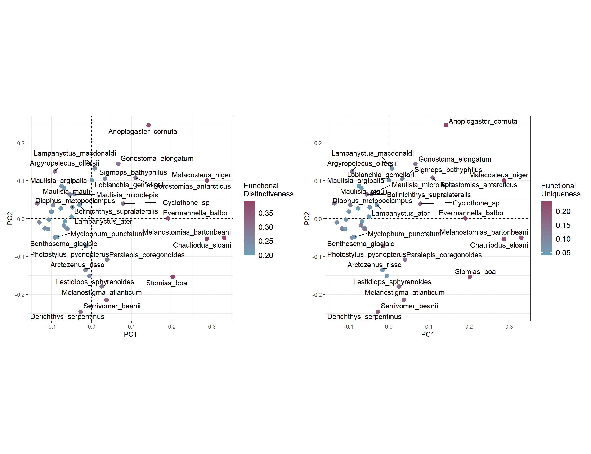{width=1248}
:::

```{.r .cell-code}
ggsave("plot_reg_uniqueness.png", path = "figures", height = 12, width = 13)
```
:::

::: {.cell}

```{.r .cell-code}
# Make a summary data.frame
sp_coord_di_ui <- as.data.frame(sp_faxes_coord_fish[, 1:2])
sp_coord_di_ui$species <- rownames(sp_coord_di_ui)
rownames(sp_coord_di_ui) <- NULL
sp_coord_di_ui <- sp_coord_di_ui[, c(3, 1, 2)]
sp_coord_di_ui <- merge(sp_coord_di_ui, sp_di, by = "species")
sp_coord_di_ui <- merge(sp_coord_di_ui, sp_ui, by = "species")
sp_coord_di_ui <- sp_coord_di_ui %>%
  merge(taxonomic_families, by = "species") %>%
  mutate(shape = case_when(
    family == "Myctophidae" ~ "A",
    family == "Platytroctidae" ~ "B",
    TRUE ~ "C"
  ))
  
plot_reg_uniqueness <- ggplot(sp_coord_di_ui, aes(PC1, PC2)) +
  geom_hline(yintercept = 0, linetype = 2) +
  geom_vline(xintercept = 0, linetype = 2) +
  geom_point(aes(color = Ui, shape = shape), size = 3) +
  ggrepel::geom_text_repel(aes(label = species), size = 3.5, max.overlaps = 5) +
  scale_color_viridis_c( name = "Functional Uniqueness", option="C") +
  theme_bw() +
  scale_shape_manual(values = c(15,17,19), name = "Taxonomic family",
                     labels = c("Myctophidae", "Platytroctidae", "Other"))+
  theme(aspect.ratio = 1, legend.title = element_text(size = 12), legend.text = element_text(size = 12))
plot_reg_uniqueness 
```

::: {.cell-output-display}
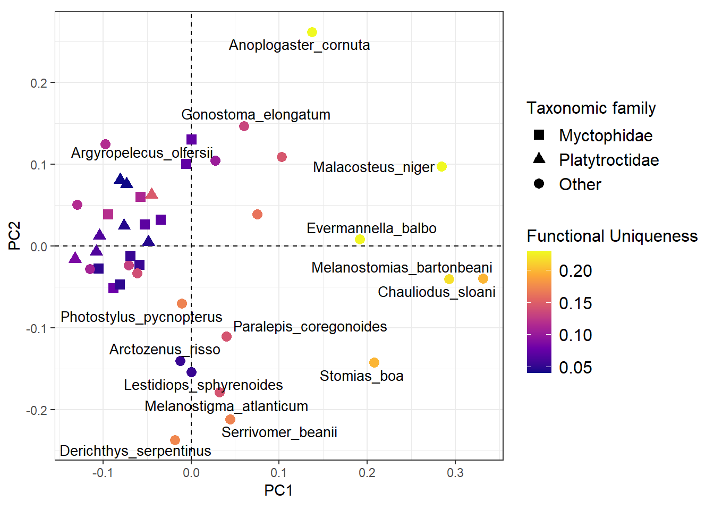{width=672}
:::

```{.r .cell-code}
ggsave("plot_reg_uniqueness.png", path = "figures", height = 8, width = 8)
```
:::


- As was done with mFD to correlate the functional axes with species’ traits we can correlate functional distinctiveness to specific traits in order to see which traits are mainly driving distinctiveness.

- Regarding local level functional originality indices, the visualization can be more difficult to grasp and depends highly on the question. Would you rather focus on visualizing the functional distinctiveness of one species across communities? Compare the distribution of functional distinctiveness values across communities?

- One idea to keep in mind is that averaging functional distinctiveness per community is exactly equal to computing functional dispersion. Functional originality is computed on a species basis, so we should be aware that if we are rather interested by community properties than we can compute functional diversity metrics which are much more appropriate.


::: {.cell}

```{.r .cell-code}
local_di_ap <- as.data.frame(sp_local_di[, c(1: 11)])
local_di_ap$depth <- rownames(local_di_ap)
```
:::


### 4.3.2. Plotting rarity

- __Functional Distinctiveness__

::: {.cell}

```{.r .cell-code}
depth_fish_biomass_2 <- rbind(data_biomass_2002_2019, data_biomass_2021, data_biomass_2022)%>%
  as.data.frame()%>%
  rename("species"="Nom_Scientifique",
         "station"="Code_Station") %>%
  left_join(metadata) %>%
  select(species, Tot_V_HV, depth, volume_filtered)%>%
  # divise biomass by the volume filtered at each trawl (g.m3)
  mutate(biomass_cpu=(Tot_V_HV/volume_filtered)*1000)%>%
  select(species, depth, biomass_cpu)%>%
  replace(is.na(.), 0)%>%
  group_by(species, depth)%>%
  mutate(biomass=sum(biomass_cpu))%>%
  select(-c(biomass_cpu))%>%
  distinct()%>%
  tidyr::pivot_wider(names_from = species, values_from = biomass)%>%
  replace(is.na(.), 0)%>%
  tibble::column_to_rownames(var = "depth")%>%
  #change species name
  rename("Lampanyctus_ater"="Nannobrachium_atrum")%>%
  rename("Cyclothone_sp"="Cyclothone")%>%
  rename("Stomias_boa"="Stomias_boa_boa") %>%
  as.matrix()

ri = funrar::restrictedness(depth_fish_biomass_2)

median_depth_fish <- depth_distribution%>%
  mutate(species = case_when(
    species == "Nannobrachium_atrum"~"Lampanyctus_ater",
    species == "Cyclothone"~"Cyclothone_sp",
    species == "Stomias_boa_boa"~"Stomias_boa",
    TRUE ~ species
  )) %>% 
  group_by(species)%>%
  summarise(median_depth= median(depth))

sp_di_ri <- merge(sp_di, ri, by = "species")
sp_di_ri_ui <- merge(sp_di_ri, sp_ui, by = "species")%>%
  left_join(median_depth_fish)

ggplot(sp_di_ri, aes(distinctiveness, Ri)) +
  geom_point(aes(col=distinctiveness), size=3) +
  ggrepel::geom_text_repel(aes(label = species), max.overlaps=22, size=3) +
  labs(x = "Functional Distinctiveness", y = "Geographical Restrictedness") +
  theme_bw() +
  scale_color_viridis_c( name = "Functional Distinctiveness", option="C") +
  theme(aspect.ratio = 1,legend.title = element_text(size = 12), legend.text = element_text(size = 12))
```

::: {.cell-output-display}
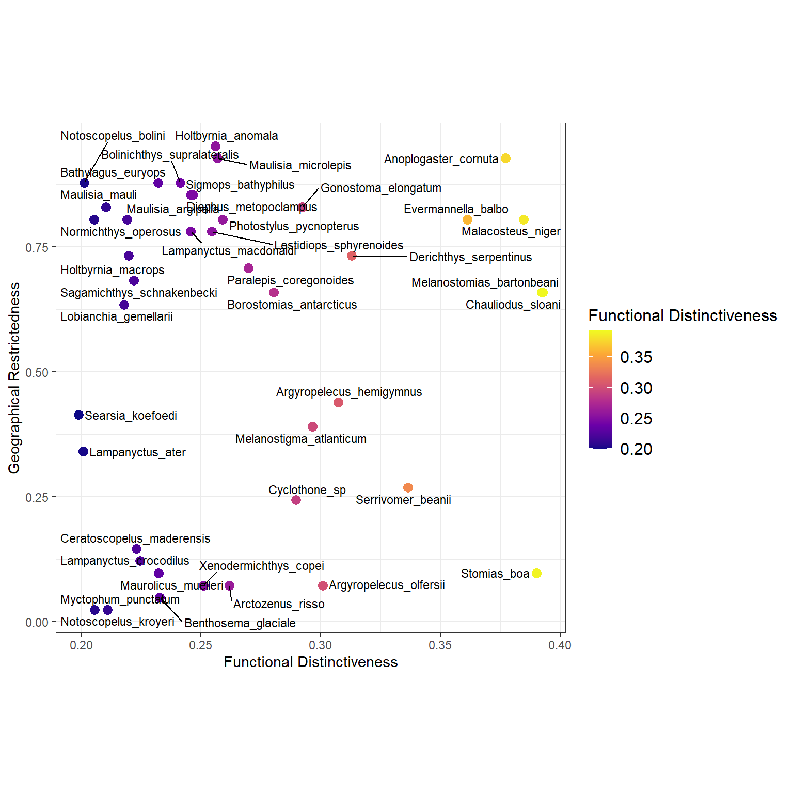{width=768}
:::

```{.r .cell-code}
ggsave("sp_di_ri.png", path = "figures", height = 8, width = 8)
```
:::

::: {.cell}

```{.r .cell-code}
ggplot(sp_di_ri_ui, aes(distinctiveness, Ri)) +
  geom_point(aes(col=median_depth), size=3) +
  ggrepel::geom_text_repel(aes(label = species), max.overlaps=22, size=3) +
  labs(x = "Functional Distinctiveness", y = "Geographical Restrictedness") +
  theme_bw() +
  scale_color_gradient(high = "#00263A", low = "#C5F8FF","Median depth (m)") +
  theme(aspect.ratio = 1,legend.title = element_text(size = 12), legend.text = element_text(size = 12))
```

::: {.cell-output-display}
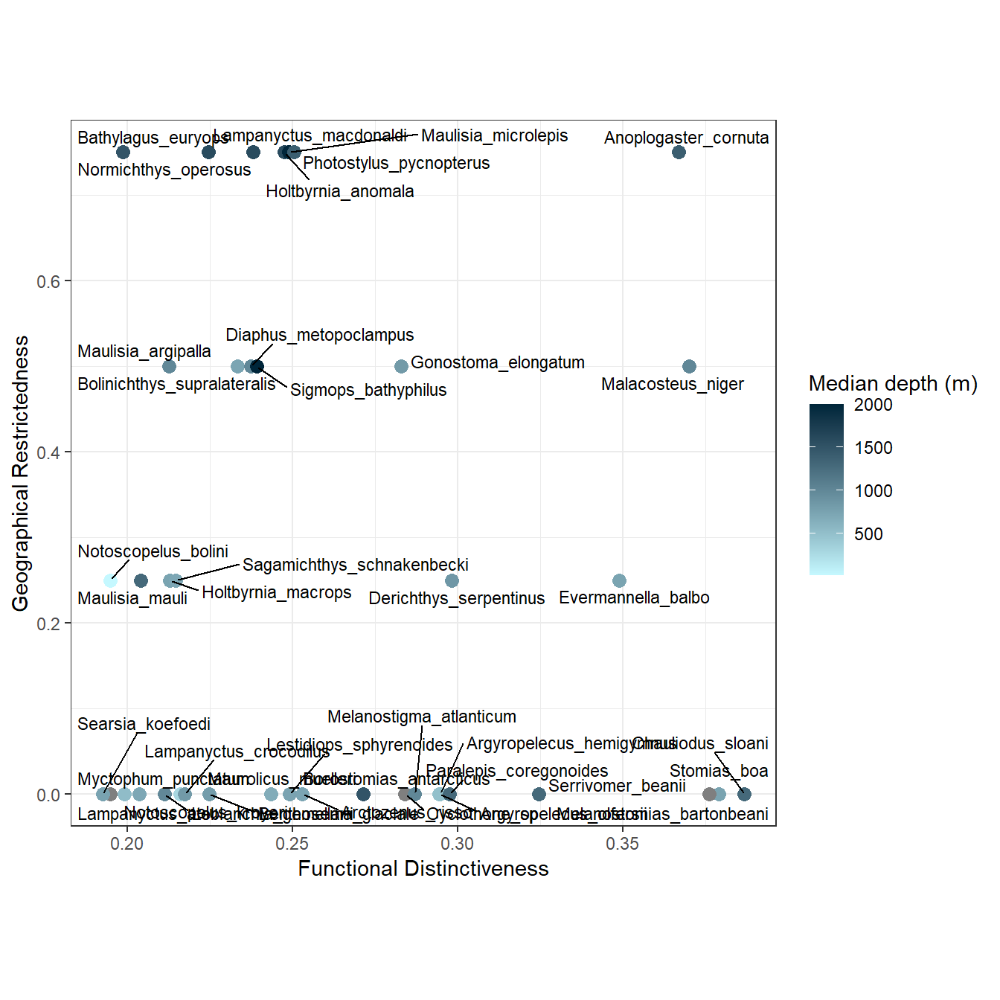{width=768}
:::

```{.r .cell-code}
ggsave("sp_di_ri_depth.png", path = "figures", height = 8, width = 8)
```
:::


- __Functional uniqueness__

::: {.cell}

```{.r .cell-code}
sp_di_ri <- merge(sp_di, ri, by = "species")
sp_di_ri_ui <- merge(sp_di_ri, sp_ui, by = "species")%>%
  left_join(median_depth_fish)

ggplot(sp_di_ri_ui, aes(Ui, Ri)) +
  geom_point(aes(col=median_depth), size=3) +
  ggrepel::geom_text_repel(aes(label = species), max.overlaps=22, size=3) +
  labs(x = "Functional Uniqueness", y = "Geographical Restrictedness") +
  theme_bw() +
  scale_color_gradient(high = "#00263A", low = "#C5F8FF","Median depth (m)") +
  theme(aspect.ratio = 1,legend.title = element_text(size = 12), legend.text = element_text(size = 12))
```

::: {.cell-output-display}
{width=768}
:::

```{.r .cell-code}
ggsave("sp_ui_ri_depth.png", path = "figures", height = 8, width = 8)
```
:::


- plot local scale measurements:

__bathypelagic layer__

::: {.cell}

```{.r .cell-code}
sp_local_di_df <- funrar::matrix_to_stack(
  sp_local_di, value_col = "local_di", row_to_col = "depth",
  col_to_col = "species"
)
sp_local_si_df <- funrar::matrix_to_stack(
  si, value_col = "local_si", row_to_col = "depth", col_to_col = "species"
)

sp_local_di_si <- merge(
  sp_local_di_df, sp_local_si_df, by = c("depth", "species")
)

head(sp_local_di_si)
```

::: {.cell-output .cell-output-stdout}
```
         depth                  species  local_di  local_si
1 Bathypelagic     Anoplogaster_cornuta 0.3910062 0.9307396
2 Bathypelagic         Arctozenus_risso 0.2310470 0.5077535
3 Bathypelagic Argyropelecus_hemigymnus 0.3025969 0.9915088
4 Bathypelagic   Argyropelecus_olfersii 0.3054772 0.5289927
5 Bathypelagic       Bathylagus_euryops 0.2158820 0.1673770
6 Bathypelagic      Benthosema_glaciale 0.2107674 0.1086787
```
:::
:::

- _At the local scale:_ Scarcity (relative abundance of the species) as a function of the local distinctiveness (one value per depth layer for each species)

::: {.cell}

```{.r .cell-code}
ggplot(sp_local_di_si, aes( local_si, local_di)) +
  geom_point(alpha = 0.4, size=1) +
  labs(x = "Functional Distinctiveness", y = "Scarcity") +
  theme_bw() +
  # geom_smooth(method = "lm",col="#9565E5", se=T, linewidth=1, fill="#9565E5", alpha=0.5)+
  # ggpmisc::stat_poly_eq(formula = y ~ x, 
  #                       aes(label = paste(..rr.label.., ..p.value.label.. 
  #                                         , ..n.label..,sep = "*`,`~")),
  #                       parse = TRUE,
  #                       size=2.5,
  #                       label.x.npc = "right",
  #                       label.y.npc = "bottom",
  #                       vstep = -0.0005)+
  # geom_text(aes(label = species), hjust = 0.7, vjust = -1, size = 3.5) +
  theme(aspect.ratio = 1)
```

::: {.cell-output-display}
{width=672}
:::

```{.r .cell-code}
ggsave("local_di_si.png", path = "figures/additional_analyses", height = 5.5, width=5.5)
```
:::

::: {.cell}

```{.r .cell-code}
ggplot(sp_di_ri_ui, aes(Ri,Ui)) +
  geom_point(alpha=0.6) +
  #ggrepel::geom_text_repel(aes(label = species), max.overlaps=22, size=3) +
  labs(x = "Functional Uniqueness", y = "Geographical Restrictedness") +
  theme_bw() +
  theme(aspect.ratio = 1)
```

::: {.cell-output-display}
{width=672}
:::

```{.r .cell-code}
ggsave("global_ri_ui.png", path = "figures/additional_analyses", height = 5.5, width=5.5)
```
:::


__number families by depth layer__

::: {.cell}

```{.r .cell-code}
 depth_fish_biomass %>% 
  as.data.frame() %>% 
  tibble::rownames_to_column(var="assemblage") %>% 
  tidyr::pivot_longer(!assemblage, names_to = "species", values_to = "biomass") %>% 
  left_join(taxonomic_families) %>% 
  filter(biomass>0) %>% 
  select(assemblage, family) %>% 
   distinct() %>% 
  group_by(assemblage) %>% 
  summarize(n=n())
```

::: {.cell-output .cell-output-stdout}
```
# A tibble: 4 × 2
  assemblage            n
  <chr>             <int>
1 Bathypelagic         14
2 Epipelagic           10
3 Lower mesopelagic    12
4 Upper mesopelagic    12
```
:::
:::


__which traits are mainly driving distinctiveness?__


::: {.cell}

```{.r .cell-code}
df <- fish_traits %>%
  as.data.frame() %>%
  tibble::rownames_to_column(var = "species") %>%
  left_join(sp_di) %>%
  tibble::column_to_rownames(var = "species")

# Identify numerical and categorical traits
numeric_traits <-
  colnames(df)[sapply(df, is.numeric) &
                 colnames(df) != "distinctiveness"]
categorical_traits <-
  colnames(df)[!sapply(df, is.numeric) &
                 colnames(df) != "distinctiveness"]

# Initialize a data frame to store all results
combined_results_df <- data.frame(
  Trait = character(0),
  Type = character(0),
  Eta_R_squared = numeric(0),
  P_value = numeric(0),
  stringsAsFactors = FALSE
)

# Step 1: Perform Kruskal-Wallis test for categorical traits
for (categorical_trait in categorical_traits) {
  kruskal_result <-
    kruskal.test(df$distinctiveness ~ df[[categorical_trait]])
  
  # Calculate eta-squared for Kruskal-Wallis
  n_groups <- length(unique(df[[categorical_trait]]))
  n_total <- length(df$distinctiveness)
  h_value <- kruskal_result$statistic
  eta_squared <- (h_value - (n_groups - 1)) / (n_total - n_groups)
  
  combined_results_df <- rbind(
    combined_results_df,
    data.frame(
      Trait = categorical_trait,
      Type = "Categorical",
      Eta_R_squared = as.numeric(format(eta_squared, scientific = FALSE)),
      P_value = as.numeric(format(kruskal_result$p.value, scientific = FALSE)),
      stringsAsFactors = FALSE
    )
  )
}

# Step 2: Fit linear models for numerical traits
for (numeric_trait in numeric_traits) {
  lm_result <- lm(distinctiveness ~ df[[numeric_trait]], data = df)
  summary_stats <- summary(lm_result)
  
  combined_results_df <- rbind(
    combined_results_df,
    data.frame(
      Trait = numeric_trait,
      Type = "Numeric",
      Eta_R_squared = as.numeric(format(summary_stats$r.squared, scientific = FALSE)),
      P_value = as.numeric(format(
        summary_stats$coefficients[2, 4], scientific = FALSE
      )),
      stringsAsFactors = FALSE
    )
  )
}

# Round the numeric columns to three decimal places
combined_results_df[, c("Eta_R_squared", "P_value")] <-
  round(combined_results_df[, c("Eta_R_squared", "P_value")], 3)

htmltools::tagList(DT::datatable(combined_results_df))
```

::: {.cell-output-display}

```{=html}
<div class="datatables html-widget html-fill-item" id="htmlwidget-6990dbca00565e1b82de" style="width:100%;height:auto;"></div>
<script type="application/json" data-for="htmlwidget-6990dbca00565e1b82de">{"x":{"filter":"none","vertical":false,"data":[["1","2","3","4","5","6","7","8","9","10","11","12","13","14","15","16","17","18","19","20","21","22","23","24","25","26"],["ventral_photophores","gland_head","chin_barbel","small_teeth","large_teeth","fang_teeth","retractable_teeth","internal_teeth","gill_raker_types","oral_gape_axis","eye_size","orbital_length","gill_outflow","oral_gape_surface","oral_gape_shape","oral_gape_position","lower_jaw_length","head_length","body_depth","pectoral_fin_position","pectoral_fin_insertion","transversal_shape","caudal_throttle_width","dorsal_fin_insertion","eye_position","operculum_volume"],["Categorical","Categorical","Categorical","Categorical","Categorical","Categorical","Categorical","Categorical","Categorical","Categorical","Numeric","Numeric","Numeric","Numeric","Numeric","Numeric","Numeric","Numeric","Numeric","Numeric","Numeric","Numeric","Numeric","Numeric","Numeric","Numeric"],[0.116,0.245,0.099,0.271,0.175,0.36,0.016,0.04,0.406,0.238,0.255,0.213,0.015,0.08599999999999999,0.008,0.045,0.019,0.245,0,0.007,0.308,0.002,0.028,0.011,0.23,0.15],[0.019,0.001,0.028,0.001,0.005,0,0.205,0.11,0,0.004,0.001,0.002,0.445,0.063,0.586,0.185,0.391,0.001,0.985,0.595,0,0.8100000000000001,0.294,0.522,0.002,0.012]],"container":"<table class=\"display\">\n  <thead>\n    <tr>\n      <th> <\/th>\n      <th>Trait<\/th>\n      <th>Type<\/th>\n      <th>Eta_R_squared<\/th>\n      <th>P_value<\/th>\n    <\/tr>\n  <\/thead>\n<\/table>","options":{"columnDefs":[{"className":"dt-right","targets":[3,4]},{"orderable":false,"targets":0},{"name":" ","targets":0},{"name":"Trait","targets":1},{"name":"Type","targets":2},{"name":"Eta_R_squared","targets":3},{"name":"P_value","targets":4}],"order":[],"autoWidth":false,"orderClasses":false}},"evals":[],"jsHooks":[]}</script>
```

:::
:::


__which traits are mainly driving uniqueness ?__


::: {.cell}

```{.r .cell-code}
df <- fish_traits %>%
  as.data.frame() %>%
  tibble::rownames_to_column(var = "species") %>%
  left_join(sp_ui) %>%
  tibble::column_to_rownames(var = "species")

# Identify numerical and categorical traits
numeric_traits <-
  colnames(df)[sapply(df, is.numeric) &
                 colnames(df) != "Ui"]
categorical_traits <-
  colnames(df)[!sapply(df, is.numeric) &
                 colnames(df) != "Ui"]

# Initialize a data frame to store all results
combined_results_df <- data.frame(
  Trait = character(0),
  Type = character(0),
  Eta_R_squared = numeric(0),
  P_value = numeric(0),
  stringsAsFactors = FALSE
)

# Step 1: Perform Kruskal-Wallis test for categorical traits
for (categorical_trait in categorical_traits) {
  kruskal_result <-
    kruskal.test(df$Ui ~ df[[categorical_trait]])
  
  # Calculate eta-squared for Kruskal-Wallis
  n_groups <- length(unique(df[[categorical_trait]]))
  n_total <- length(df$Ui)
  h_value <- kruskal_result$statistic
  eta_squared <- (h_value - (n_groups - 1)) / (n_total - n_groups)
  
  combined_results_df <- rbind(
    combined_results_df,
    data.frame(
      Trait = categorical_trait,
      Type = "Categorical",
      Eta_R_squared = as.numeric(format(eta_squared, scientific = FALSE)),
      P_value = as.numeric(format(kruskal_result$p.value, scientific = FALSE)),
      stringsAsFactors = FALSE
    )
  )
}

# Step 2: Fit linear models for numerical traits
for (numeric_trait in numeric_traits) {
  lm_result <- lm(Ui ~ df[[numeric_trait]], data = df)
  summary_stats <- summary(lm_result)
  
  combined_results_df <- rbind(
    combined_results_df,
    data.frame(
      Trait = numeric_trait,
      Type = "Numeric",
      Eta_R_squared = as.numeric(format(summary_stats$r.squared, scientific = FALSE)),
      P_value = as.numeric(format(
        summary_stats$coefficients[2, 4], scientific = FALSE
      )),
      stringsAsFactors = FALSE
    )
  )
}

# Round the numeric columns to three decimal places
combined_results_df[, c("Eta_R_squared", "P_value")] <-
  round(combined_results_df[, c("Eta_R_squared", "P_value")], 3)

htmltools::tagList(DT::datatable(combined_results_df))
```

::: {.cell-output-display}

```{=html}
<div class="datatables html-widget html-fill-item" id="htmlwidget-5a952e100aac5d2d6b7b" style="width:100%;height:auto;"></div>
<script type="application/json" data-for="htmlwidget-5a952e100aac5d2d6b7b">{"x":{"filter":"none","vertical":false,"data":[["1","2","3","4","5","6","7","8","9","10","11","12","13","14","15","16","17","18","19","20","21","22","23","24","25","26"],["ventral_photophores","gland_head","chin_barbel","small_teeth","large_teeth","fang_teeth","retractable_teeth","internal_teeth","gill_raker_types","oral_gape_axis","eye_size","orbital_length","gill_outflow","oral_gape_surface","oral_gape_shape","oral_gape_position","lower_jaw_length","head_length","body_depth","pectoral_fin_position","pectoral_fin_insertion","transversal_shape","caudal_throttle_width","dorsal_fin_insertion","eye_position","operculum_volume"],["Categorical","Categorical","Categorical","Categorical","Categorical","Categorical","Categorical","Categorical","Categorical","Categorical","Numeric","Numeric","Numeric","Numeric","Numeric","Numeric","Numeric","Numeric","Numeric","Numeric","Numeric","Numeric","Numeric","Numeric","Numeric","Numeric"],[0.096,0.2,0.07199999999999999,0.32,0.199,0.368,0.034,0.044,0.357,0.193,0.204,0.201,0.022,0.053,0.038,0.003,0.035,0.256,0.001,0.008,0.268,0.006,0.008,0.004,0.276,0.066],[0.029,0.003,0.051,0,0.003,0,0.128,0.098,0,0.008999999999999999,0.003,0.003,0.357,0.149,0.22,0.754,0.245,0.001,0.852,0.582,0.001,0.636,0.584,0.6919999999999999,0,0.105]],"container":"<table class=\"display\">\n  <thead>\n    <tr>\n      <th> <\/th>\n      <th>Trait<\/th>\n      <th>Type<\/th>\n      <th>Eta_R_squared<\/th>\n      <th>P_value<\/th>\n    <\/tr>\n  <\/thead>\n<\/table>","options":{"columnDefs":[{"className":"dt-right","targets":[3,4]},{"orderable":false,"targets":0},{"name":" ","targets":0},{"name":"Trait","targets":1},{"name":"Type","targets":2},{"name":"Eta_R_squared","targets":3},{"name":"P_value","targets":4}],"order":[],"autoWidth":false,"orderClasses":false}},"evals":[],"jsHooks":[]}</script>
```

:::
:::

::: {.cell}

```{.r .cell-code}
df_long <- tidyr::gather(df, key = "Trait", value = "TraitValue", -Ui)

# Filter only significant traits
significant_traits <- combined_results_df[combined_results_df$P_value < 0.05, "Trait"]

df_long_filtered <- df_long[df_long$Trait %in% significant_traits, ]

# numeric traits 
numeric_traits <- df_long_filtered %>% 
  filter(Trait%in% c("head_length","eye_size", 
                     "pectoral_fin_insertion",
                     "eye_position", "orbital_length"))

numeric_traits$TraitValue <- as.numeric(numeric_traits$TraitValue)

ggplot(numeric_traits, aes(x = TraitValue, y = Ui)) +
  labs(x = "Trait Value", y = "Uniqueness") +
  theme_minimal() +
  facet_wrap(~ Trait, scales = "free") +
  geom_point() +
  geom_smooth(method = "lm") 
```

::: {.cell-output-display}
{width=672}
:::
:::

::: {.cell}

```{.r .cell-code}
categorical_traits <- df_long_filtered %>% 
  filter(!Trait%in% c("head_length","eye_size", 
                     "pectoral_fin_insertion",
                     "eye_position", "orbital_length"))

ggplot(categorical_traits, aes(x = TraitValue, y = Ui)) +
  labs(x = "Trait Value", y = "Uniqueness") +
  theme_minimal() +
  facet_wrap(~ Trait, scales = "free") +
  geom_point() +
  geom_boxplot()
```

::: {.cell-output-display}
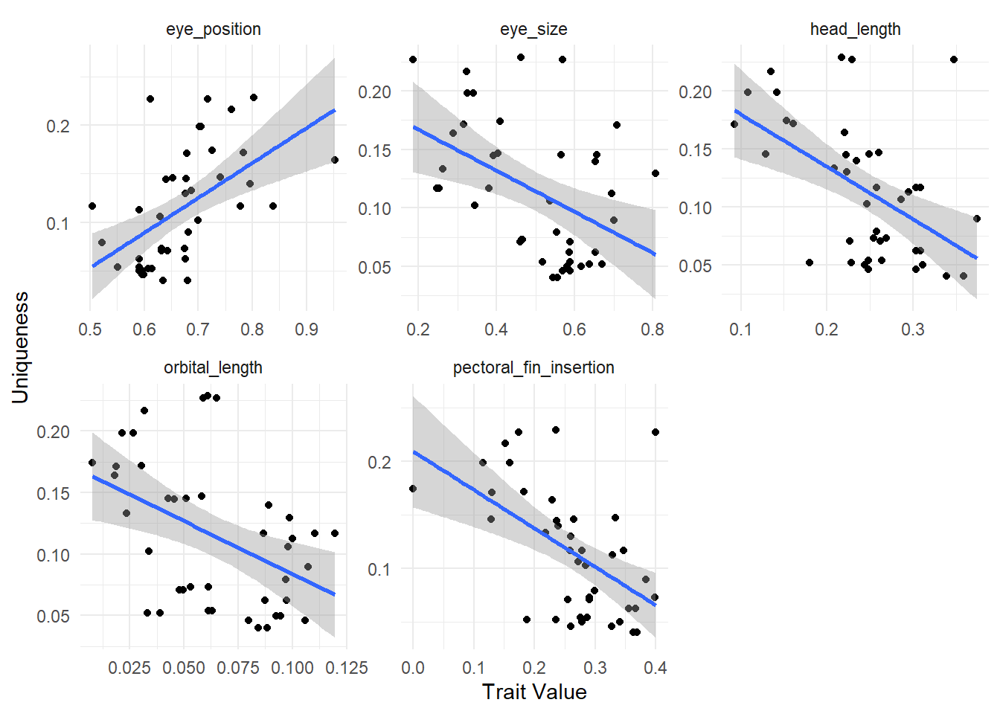{width=672}
:::
:::


__Relation between biomass and distinctiveness__

::: {.cell}

```{.r .cell-code}
depth_biomass <- rbind(data_biomass_2002_2019, data_biomass_2021, data_biomass_2022)%>%
  as.data.frame()%>%
  rename("species"="Nom_Scientifique",
         "station"="Code_Station") %>%
  left_join(metadata) %>%
  select(species, Tot_V_HV, depth, volume_filtered)%>%
  # divise biomass by the volume filtered at each trawl (g.m3)
  mutate(biomass_cpu=(Tot_V_HV/volume_filtered)*1000)%>%
  select(species, depth, biomass_cpu)%>%
  group_by(species, depth)%>%
  mutate(biomass=sum(biomass_cpu))%>%
  select(-c(biomass_cpu))%>%
  distinct()  %>%
  mutate(species = case_when(
    species == "Nannobrachium_atrum" ~ "Lampanyctus_ater",
    species == "Cyclothone" ~ "Cyclothone_sp",
    species == "Stomias_boa_boa" ~ "Stomias_boa",
    TRUE ~ species
  ))
```
:::


__Uniqueness - biomass__
__log__

::: {.cell}

```{.r .cell-code}
Ui_biomass <- depth_biomass %>% 
  group_by(species) %>% 
  replace(is.na(.), 0) %>% 
  mutate(biomass_sp = sum(biomass)) %>% 
  select(species, biomass_sp) %>% 
  distinct() %>% 
  inner_join(sp_ui)

ggplot(Ui_biomass , aes(x = Ui, y = log(biomass_sp))) +
  geom_point(size = 2, aes(col=Ui)) +
  scale_color_viridis_c( name = "Functional Uniqueness", option="C") +
  labs(x="Uniqueness", y= "Log biomass")+
  geom_text(aes(label = species), hjust = 0.7, vjust = -1, size = 3.5) +
  theme_bw()+
  theme(aspect.ratio = 1, legend.title = element_text(size = 12), legend.text = element_text(size = 12))
```

::: {.cell-output-display}
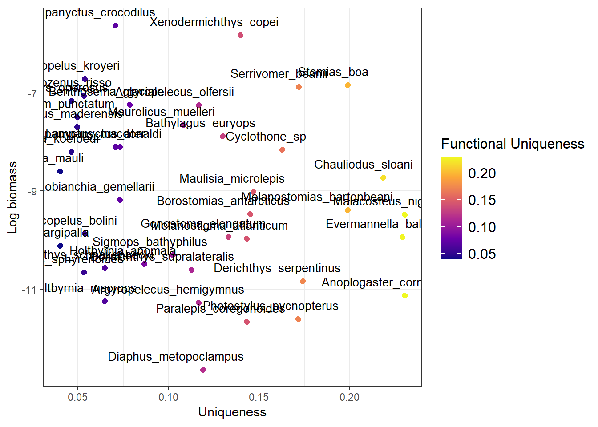{width=672}
:::

```{.r .cell-code}
ggsave("Ui_biomass_log.png", path = "figures", height = 8, width=8)
```
:::


__Uniqueness - abundance__

::: {.cell}

```{.r .cell-code}
# list of species 
sp_names <- c(rownames(fish_traits), "Nannobrachium_atrum", "Cyclothone", "Stomias_boa_boa")

# Metadata
metadata <-  utils::read.csv(here::here("data", "metadata.csv"), sep = ";", header = T, dec = ".")%>%
  # calculation of standardized abundance values (vertical  trawl opening * horizontal trawl opening * distance traveled)  
  mutate(volume_filtered = 24*58*distance)

# species abundance x depth  matrix 2002-2019 ----
data_abundance_2002_2019 <- utils::read.csv(here::here("data", "data_evhoe_catch_2002_2019_abundance.csv"), sep = ";", header = T, dec = ".")%>%
  replace(is.na(.), 0)%>%
  as.data.frame()%>%
  rename("species"="Code_Station")%>%
  mutate(species= gsub(" ","_", species))%>%
  filter(species%in%sp_names)%>%
  t()%>%
  as.data.frame()%>%
  janitor::row_to_names(row_number = 1)%>%
  mutate_if(is.character, as.numeric)%>%
  tibble::rownames_to_column("Code_Station")%>%
  filter(!Code_Station=="H0472")%>%
  tidyr::pivot_longer(!Code_Station, names_to = "species", values_to = "Tot_V_HV")%>%
  rename("Nom_Scientifique"="species") %>% 
  rename("abundance"="Tot_V_HV")

# species abundance x depth  matrix 2021 ----
data_abundance_2021 <- utils::read.csv(here::here("data", "data_evhoe_catch_2021.csv"), sep = ";", header = T, dec = ".")%>%
  select(Nom_Scientifique, Nbr, Code_Station)%>%
  filter(Nbr>0) %>% 
  group_by(Nom_Scientifique, Code_Station) %>% 
  mutate(abundance=sum(Nbr)) %>% 
  select(Nom_Scientifique, abundance, Code_Station) %>% 
  distinct() %>% 
  mutate(Nom_Scientifique= gsub(" ","_",Nom_Scientifique))%>%
  filter(Nom_Scientifique%in%sp_names)

# species abundance x depth  matrix 2022 ----
data_abundance_2022 <- utils::read.csv(here::here("data", "data_evhoe_catch_2022.csv"), sep = ";", header = T, dec = ".")%>%
  select(Nom_Scientifique, Nbr, Code_Station)%>%
  filter(Nbr>0) %>% 
  group_by(Nom_Scientifique, Code_Station) %>% 
  mutate(abundance=sum(Nbr)) %>% 
  select(Nom_Scientifique, abundance, Code_Station) %>% 
  distinct() %>% 
  mutate(Nom_Scientifique= gsub(" ","_",Nom_Scientifique))%>%
  filter(Nom_Scientifique%in%sp_names)

# merge all matrix ----
depth_fish_abundance <- rbind(data_abundance_2002_2019, data_abundance_2021, data_abundance_2022)%>%
  as.data.frame()%>%
  rename("species"="Nom_Scientifique",
         "station"="Code_Station") %>%  
  left_join(metadata) %>% 
  select(species, abundance, depth, volume_filtered)%>%
  # divise abundance by the volume filtered at each trawl (g.m3)
  mutate(abundance_cpu=(abundance/volume_filtered)*1000)%>%
  select(species, depth, abundance_cpu)%>%  
  # add column with depth layer
  mutate(
    depth_layer = case_when(
      between(depth, 0, 174) ~ "Epipelagic",
      between(depth, 175, 699) ~ "Upper mesopelagic",
      between(depth, 700, 999) ~ "Lower mesopelagic",
      between(depth, 1000, 2000) ~ "Bathypelagic"))%>%
  replace(is.na(.), 0)%>%
  select(-depth)%>%
  group_by(species, depth_layer)%>%
  mutate(abundance=sum(abundance_cpu))%>%
  select(-c(abundance_cpu))%>%
  distinct()%>%
  tidyr::pivot_wider(names_from = species, values_from = abundance)%>%
  replace(is.na(.), 0)%>%
  tibble::column_to_rownames(var = "depth_layer")%>% 
  #change species name
  rename("Lampanyctus_ater"="Nannobrachium_atrum")%>%
  rename("Cyclothone_sp"="Cyclothone")%>%
  rename("Stomias_boa"="Stomias_boa_boa") %>% 
  as.matrix()

depth_abundance <- depth_fish_abundance %>%
  as.data.frame() %>%
  tibble::rownames_to_column(var = "assemblage") %>%
  tidyr::pivot_longer(!assemblage, names_to = "species", values_to = "abundance") %>%
  filter(abundance > 0)

Ui_abundance <- depth_abundance %>% 
  group_by(species) %>% 
  mutate(abundance_sp = sum(abundance)) %>% 
  select(species, abundance_sp) %>% 
  distinct() %>% 
  inner_join(sp_ui)

ggplot(Ui_abundance , aes(x = Ui, y = log(abundance_sp))) +
  geom_point(size = 2, aes(col=Ui)) +
  scale_color_viridis_c( name = "Functional Uniqueness", option="C") +
  labs(x="Uniqueness")+
  geom_text(aes(label = species), hjust = 1, vjust = -1, size = 3.5) +
  theme_bw()+
  theme(aspect.ratio = 1, legend.title = element_text(size = 12), legend.text = element_text(size = 12))
```

::: {.cell-output-display}
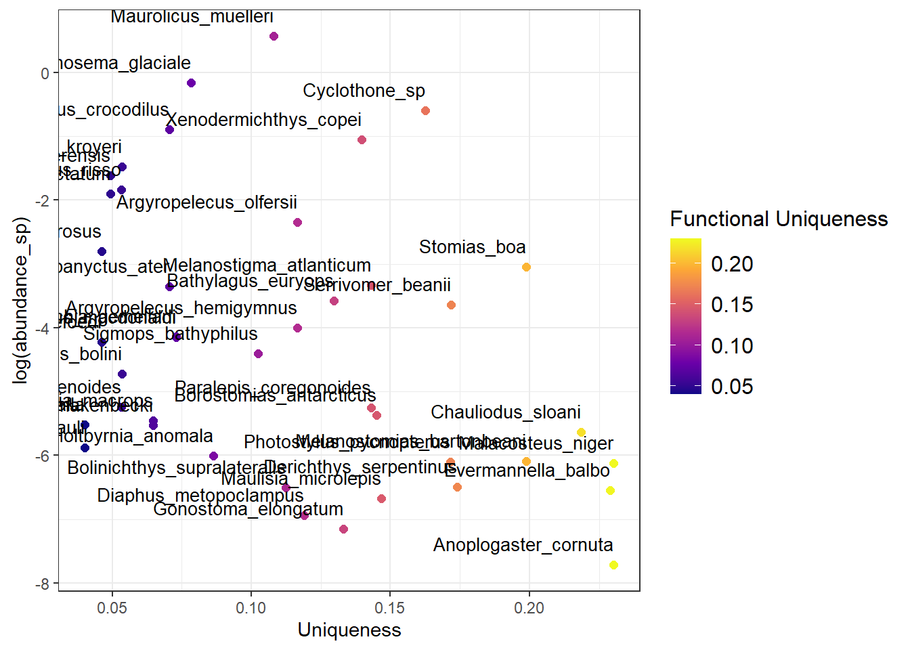{width=672}
:::

```{.r .cell-code}
ggsave("Ui_abundance_log.png", path = "figures", height = 8, width=8)
```
:::


__Distinctiveness vs abundance__

::: {.cell}

```{.r .cell-code}
Di_abundance <- depth_abundance %>% 
  group_by(species) %>% 
  mutate(abundance_sp = sum(abundance)) %>% 
  select(species, abundance_sp) %>% 
  distinct() %>% 
  inner_join(sp_di)

ggplot(Di_abundance , aes(x = distinctiveness, y = log(abundance_sp))) +
  geom_point(size = 2, aes(col=distinctiveness)) +
  scale_color_viridis_c( name = "Functional distinctiveness", option="C") +
  labs(x="Distinctiveness")+
  geom_text(aes(label = species), hjust = 1, vjust = -1, size = 3.5) +
  theme_bw()+
  theme(aspect.ratio = 1, legend.title = element_text(size = 12), legend.text = element_text(size = 12))
```

::: {.cell-output-display}
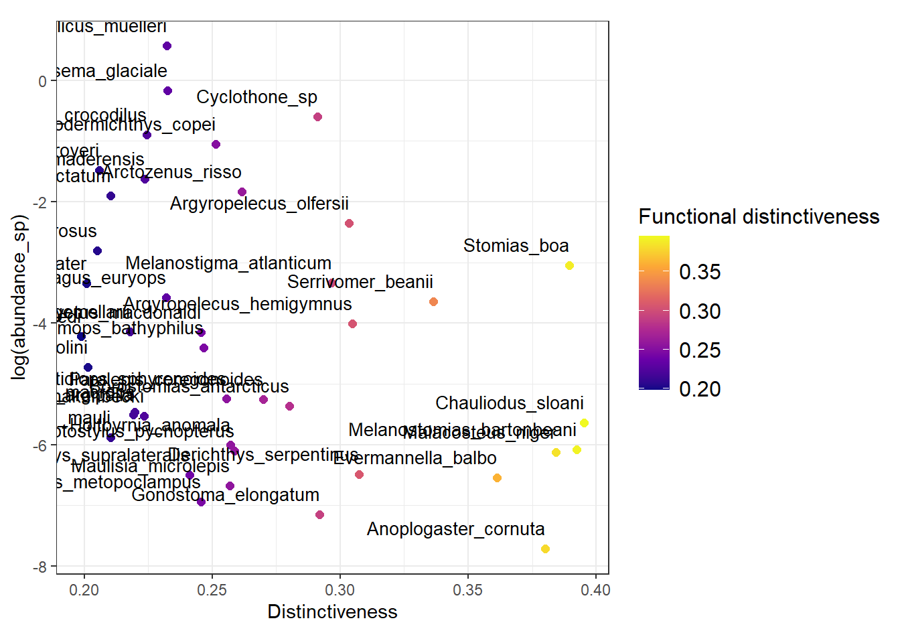{width=672}
:::

```{.r .cell-code}
ggsave("Di_abundance_log.png", path = "figures", height = 8, width=8)
```
:::

::: {.cell}

```{.r .cell-code}
Di_biomass <- depth_biomass %>% 
  group_by(species) %>% 
  mutate(biomass_sp = sum(biomass)) %>% 
  select(species, biomass_sp) %>% 
  distinct() %>% 
  inner_join(sp_di)

ggplot(Di_biomass , aes(x = distinctiveness, y = log(biomass_sp))) +
  geom_point(size = 2, aes(col=distinctiveness)) +
  scale_color_viridis_c( name = "Functional distinctiveness", option="C") +
  labs(x="Distinctiveness")+
  geom_text(aes(label = species), hjust = 1, vjust = -1, size = 3.5) +
  theme_bw()+
  theme(aspect.ratio = 1, legend.title = element_text(size = 12), legend.text = element_text(size = 12))
```

::: {.cell-output-display}
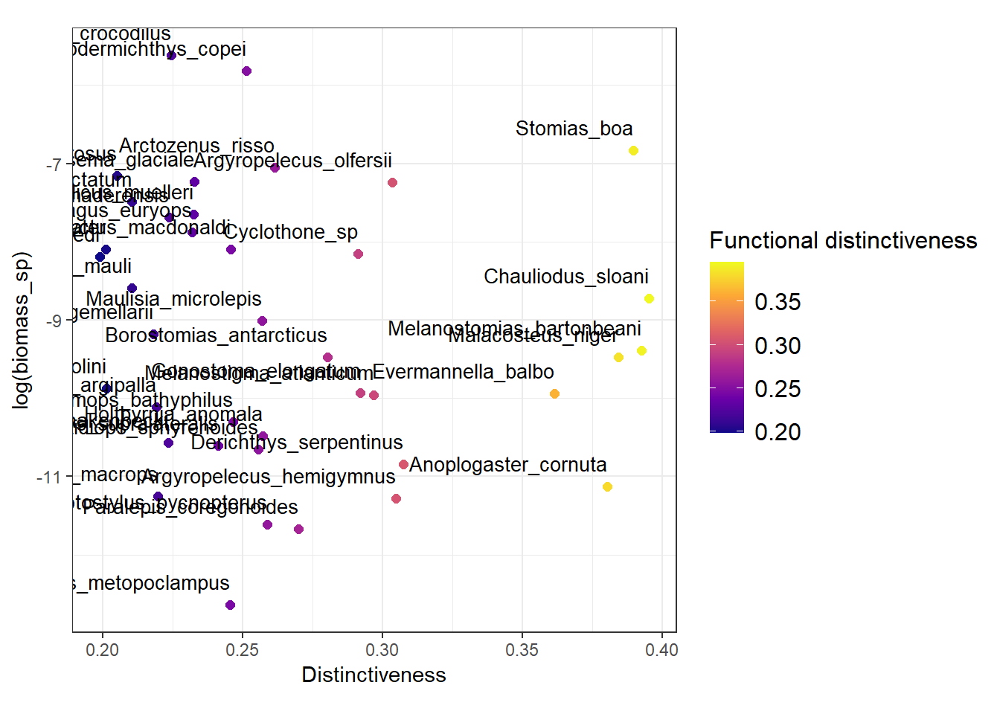{width=672}
:::

```{.r .cell-code}
ggsave("Di_biomass_log.png", path = "figures", height = 8, width=8)
```
:::
