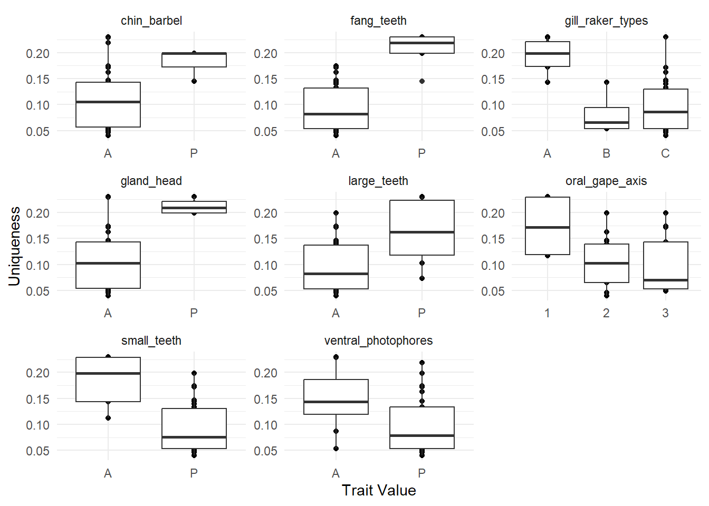

# Data preparation

::: {.cell}

```{.r .cell-code}
library(dplyr)
library(ggplot2)

morphometric_data <- utils::read.csv(here::here("data", "morphometric_data.csv"), sep = ";", header = T, dec = ".")

morpho_data <- morphometric_data %>%
  select(-c(variable_abbreviation, variable_unit)) %>%
  t() %>%
  as.data.frame() %>%
  janitor::row_to_names(row_number = 1) %>%
  `rownames<-`(NULL)%>%
  # delete for now (n=1)
  filter(species!= "Diaphus_sp")

# replace empty value by NA 
morpho_data[morpho_data ==""] <- NA

# Numeric variables
morpho_data[, 4:23] <- sapply(morpho_data[, 4:23], as.numeric)
```
:::


__Data summary__

::: {.cell}

```{.r .cell-code}
morpho_data_summary <-morpho_data %>%
  group_by(species) %>%
  count(species)

#htmltools::tagList(DT::datatable(morpho_data_summary))
```
:::


## Missing data 
The operculum width was the variable with the highest number of missing data (n = 30). This represents 4% of the data 

__2 species with only NAs for an entire trait:__

+ _Eurpharynx pelecanoides_ : 7 traits
+ _Melanostigma atlanticum_ : 2 traits


::: {.cell}

:::


### data imputation  
- mice algorithm: n imputation = 5, n iterations = 50
- plot comparison for Operculum Width

::: {.cell}

```{.r .cell-code}
#select numeric variables for imputation 
original_data <- morpho_data %>%
  select(1:23)

imputation <-
  mice::mice(
    original_data,
    m = 5,
    maxit = 50,
    printFlag = F
  )

imputed_data <- mice::complete(imputation)

comparison <- tibble::tibble(species = original_data$species,
                             standard_length = original_data$standard_length,
                             Original = original_data$operculum_width,
                             Imputed = imputed_data$operculum_width) %>%
  arrange(species, standard_length)

ggplot(comparison, aes(standard_length, Imputed, col = is.na(Original))) +
  geom_point(size = 2, alpha=0.8) +
  facet_wrap(~species, scales = "free") +
  labs(col = "Imputed?") +
  scale_color_manual(values = c("grey60", "firebrick2")) +
  theme_bw()
```

::: {.cell-output-display}
{width=1248}
:::
:::

## Species * traits
### calctulate functional traits 

::: {.cell}

```{.r .cell-code}
# calculate functional numeric traits
numeric_traits <- imputed_data %>%
  na.omit() %>%
  select(-individual_code) %>%
  mutate(
    eye_size = eye_diameter / head_depth,
    orbital_length = eye_diameter / standard_length,
    oral_gape_surface = mouth_width * mouth_depth / body_width * body_depth,
    oral_gape_shape = mouth_depth / mouth_width,
    oral_gape_position = distance_upper_jaws_bottom_head / head_depth,
    lower_jaw_length = lower_jaw_length / standard_length,
    head_length = head_length / standard_length,
    body_depth = body_depth / standard_length,
    pectoral_fin_position = distance_pectoral_bottom_body / body_depth_pectoral_insertion,
    pectoral_fin_insertion = prepectoral_length / standard_length,
    transversal_shape = body_depth / body_width,
    dorsal_fin_insertion = predorsal_length / standard_length,
    eye_position = eye_height / head_depth,
    operculum_volume = operculum_depth / operculum_width,
    gill_outflow = operculum_width,
    caudal_throttle_width = caudal_peduncle_min_depth
  ) %>%
  select(
    species,
    eye_size,
    orbital_length,
    gill_outflow,
    oral_gape_surface,
    oral_gape_shape,
    oral_gape_position,
    lower_jaw_length,
    head_length,
    body_depth,
    pectoral_fin_position,
    pectoral_fin_insertion,
    transversal_shape,
    caudal_throttle_width,
    dorsal_fin_insertion,
    eye_position,
    operculum_volume
  ) %>%
  group_by(species) %>%
  summarise(across(everything(), mean, na.rm = TRUE)) %>%
  arrange(species)

# categorical traits for species without NA
cat_morpho <- morpho_data %>%
  select(
    species,
    ventral_photophores,
    gland_head,
    chin_barbel,
    small_teeth,
    large_teeth,
    fang_teeth,
    retractable_teeth,
    internal_teeth,
    gill_raker_types,
    oral_gape_axis
  ) %>%
    na.omit() %>%
  distinct() %>%
  arrange(species)

# combined the two data frames
fish_traits <- numeric_traits %>%
  inner_join(cat_morpho, by = "species") %>%
  arrange(species) %>% 
  tibble::column_to_rownames("species")%>%
  # assign trait type 
  # as.factor for qualitative traits
  mutate_if(is.character, as.factor)%>%
  # as.ordered for ordered variables
  mutate_at(c("gill_raker_types", "oral_gape_axis"), as.ordered)
```
:::


__Traits density distribution__

::: {.cell}

```{.r .cell-code}
density_plot_traits <- fish_traits[,1:16] %>% 
    tibble::rownames_to_column(var="species") %>% 
    tidyr::pivot_longer(!species, names_to = "traits", values_to = "values")

ggplot(density_plot_traits , aes(values)) +
  geom_histogram(bins = 10,
                 color = "darkgrey",
                 fill = "lightgray") +
  facet_wrap(~ traits, scales = "free") +
  theme_minimal()+
  theme(strip.text.x = element_text(size = 11, face = "bold"))
```

::: {.cell-output-display}
{width=1152}
:::
:::

::: {.cell}

```{.r .cell-code}
## Display the table ----
htmltools::tagList(DT::datatable(fish_traits))
```

::: {.cell-output-display}

```{=html}
<div class="datatables html-widget html-fill-item" id="htmlwidget-c69b7760f6fc3d42e9c4" style="width:100%;height:auto;"></div>
<script type="application/json" data-for="htmlwidget-c69b7760f6fc3d42e9c4">{"x":{"filter":"none","vertical":false,"data":[["Anoplogaster_cornuta","Arctozenus_risso","Argyropelecus_hemigymnus","Argyropelecus_olfersii","Bathylagus_euryops","Benthosema_glaciale","Bolinichthys_supralateralis","Borostomias_antarcticus","Ceratoscopelus_maderensis","Chauliodus_sloani","Cyclothone_sp","Derichthys_serpentinus","Diaphus_metopoclampus","Evermannella_balbo","Gonostoma_elongatum","Holtbyrnia_anomala","Holtbyrnia_macrops","Lampanyctus_ater","Lampanyctus_crocodilus","Lampanyctus_macdonaldi","Lestidiops_sphyrenoides","Lobianchia_gemellarii","Malacosteus_niger","Maulisia_argipalla","Maulisia_mauli","Maulisia_microlepis","Maurolicus_muelleri","Melanostigma_atlanticum","Melanostomias_bartonbeani","Myctophum_punctatum","Normichthys_operosus","Notoscopelus_bolini","Notoscopelus_kroyeri","Paralepis_coregonoides","Photostylus_pycnopterus","Sagamichthys_schnakenbecki","Searsia_koefoedi","Serrivomer_beanii","Sigmops_bathyphilus","Stomias_boa","Xenodermichthys_copei"],[0.1870635427569378,0.6713495899777125,0.2528378924337218,0.2466185816292626,0.8073379156515913,0.553876225297698,0.6943542959568116,0.3918502902611463,0.61660846298933,0.3236216278441371,0.2896732995527421,0.7087200272405964,0.3806762185788406,0.4619095739058715,0.2627730950311468,0.7001620679316158,0.5861245029650884,0.5876906171451259,0.4605188017400862,0.4635401519874494,0.6379293967644859,0.4655204987772433,0.5686707446196964,0.5560047681071145,0.5436602586272192,0.4040027222573614,0.5366700102175092,0.5653194882201393,0.3404604909527202,0.5810276131287075,0.5877979401415817,0.58721677071155,0.5177971164068327,0.6557709453691855,0.3160340663331095,0.6531117613886723,0.5695641783784532,0.4097905992320632,0.3439623137409401,0.3246954087960091,0.653061224489796],[0.06513101563336203,0.03929014111858611,0.1103521526110715,0.1195337463229555,0.09855407877756299,0.09708002840620254,0.1002020784107539,0.0454502028499367,0.09456299480839496,0.03195944404217845,0.01820101324427989,0.01870641840179216,0.08672361809853502,0.06111392066224541,0.02365859567134613,0.107319044568802,0.09736638359612411,0.04953860514578357,0.04783772722762789,0.05324648475404745,0.03316666671153076,0.06137020103787766,0.0589832944995062,0.08848446584142593,0.0843550572708857,0.05808421042835739,0.0978961923388425,0.04280718124696028,0.02667037338846572,0.09235056814949912,0.105830132758109,0.06117253100231441,0.06286434018346203,0.05113309818745389,0.03048020374468671,0.08748603143506498,0.07967153949171366,0.007796575563762054,0.03401701434877021,0.02147373395945686,0.08897126969416125],[20.92,5.618,5.298235294117647,17.14486486486486,8.536315789473685,4.7555,12.47272727272727,15.79642857142857,5.523,10.72916666666667,7.66,6.042857142857143,6.3725,9.282500000000001,27.92,9.563333333333333,9.283333333333333,18.38136363636364,20.06102564102564,25.00333333333333,4.788571428571428,15.45818181818182,21.156,15.524,15.73,21.49,3.591818181818182,4.033,18.11777777777778,5.6848,9.430263157894737,9.629,6.779722222222222,4.898421052631579,6.5525,11.76,9.186666666666667,6.952666666666667,18.1015,6.292692307692308,19.9],[5171.543398012285,135.7615824685584,581.0179449411389,3042.322434320248,215.6744532820656,288.0952119082589,857.141772877457,2308.803855788343,287.2482954349838,1427.556961259949,417.8627269219871,102.2063575036608,496.3447641966349,746.3340129817943,6250.383835528853,1109.075324646597,870.8481183231795,1516.361659863597,1550.595807548067,2223.938773657847,202.2113720215685,1226.901459954854,4216.396258458542,3465.852896151474,2055.911596674011,1384.771960858673,186.8514118522354,78.39976364627458,2537.245636289088,234.4223020823153,489.8843037148753,486.4451319733718,258.4685234823311,205.3842965423465,80.09634693327251,800.4060722102477,555.7612019798029,121.0450061746473,4544.83974684605,722.2873030292239,250.3885057471265],[0.5977417204734031,2.684222621778278,1.252829165659565,0.9925153727538065,1.208429987743106,1.157723276407389,1.145308631944953,0.9549389452177165,2.00614082576391,2.198671222745045,2.265803818350481,1.689339435970036,0.9219855888959767,1.283292920158411,0.6068674018540213,1.014086163834506,1.246595443731965,1.144873224338048,1.276737860165135,1.162473804130551,2.116029306736757,1.100038150697565,0.8484726822993502,1.230101510957001,1.163701414828532,1.248535562855231,1.285170782096033,1.345688706965169,1.398821013856888,1.335620964108464,1.179405081271276,1.278747111079255,1.573930111703403,1.210806416506442,1.080061200669548,1.400829541017746,1.08057965490965,0.5320584499681953,1.023028473395861,0.697940624080009,1.752941176470588],[0.3951426840833095,0.6956161275567915,0.5404276289037069,0.7446854436056367,0.3502518371432042,0.3324025605583356,0.3380289556040331,0.4826993703447641,0.5595395778352831,0.7068627312794583,0.7937932689673789,0.492756633741221,0.3452486634420606,0.5829657156202231,0.4721898773185077,0.4712003973315194,0.3956514300993943,0.5710409100532963,0.7716613657494861,0.5744746730161431,0.5520998821851169,0.5212153959103951,0.3530711561087431,0.4631356481458706,0.3738738564459647,0.2036324254692755,0.5855853143839959,0.4857260963559027,0.6176663797525285,0.5678597742789305,0.556466751857582,0.4896021576606608,0.623651814987943,0.4245107644843942,0.5624538104272562,0.361697362365493,0.5212244711908143,0.586629915236263,0.6490690083932986,0.7633662074470571,0.6394557823129252],[0.2861375317012913,0.1199066289068907,0.2514373364077059,0.266959472951216,0.07584776921077842,0.1884618356794901,0.19638076001865,0.198414842989372,0.2124063307567828,0.1144114643871464,0.2040581908463124,0.04491240788019163,0.1867292921905659,0.1634947940484265,0.1777783246347302,0.2092942077891755,0.2069838979262741,0.1973450981018806,0.210637486787245,0.2048825282290511,0.1027761390567869,0.2223712374577787,0.2544654948963843,0.2078438651875588,0.2120154019923103,0.1744403226406842,0.166670163223075,0.03814429068386168,0.1234687560304594,0.1566457249526299,0.1804848574435944,0.2008815666871479,0.1983072692739815,0.1330213734139315,0.08475918421735412,0.1571232489521016,0.1366886549021795,0.08568386712504511,0.2267422887328622,0.09993380308826154,0.1139944392956441],[0.3471179569492232,0.2282622445820382,0.3034423890185704,0.308301242626706,0.2233313466691536,0.2577329098405489,0.2949444282485461,0.2219516612342632,0.3106831287972612,0.1353122370036637,0.2203047019193976,0.09229259278317947,0.2573417157046858,0.2169720130174164,0.208131053502031,0.3736914296278676,0.3084118074275706,0.2268293066821225,0.2617421786031248,0.2544000525765622,0.179483203158696,0.2690716828129346,0.2291135730880142,0.3581617707887102,0.3386367195769682,0.2602094930995654,0.2861583530888247,0.1289222320266107,0.1414616221329245,0.2434873975369473,0.3036775056329284,0.2484099358389354,0.2638957745998514,0.2491930232735534,0.1610794295053864,0.3035521067765809,0.2480447612095185,0.153233449096655,0.2463809400095261,0.1075504825074846,0.2344763670064875],[0.496765317595603,0.07231486748096279,0.5465676366743593,0.6527711514828205,0.1789589697446137,0.227186906305348,0.23575289155312,0.1471579276088384,0.1957057378562352,0.1139788839951372,0.1385564389886054,0.06475552609724118,0.2868922794103201,0.1854842390181648,0.1439966534398835,0.1995718556257012,0.1884279714218087,0.1634270563148341,0.174943368578538,0.1791292477891186,0.07016698379208147,0.2389029851391781,0.1846729123532705,0.2190923414047283,0.2006259493110997,0.2145214178694734,0.2284769602774343,0.08730489814688717,0.1281404978381019,0.2159343939861771,0.2184135875848383,0.1977431521215698,0.1921466687105275,0.09127720302297426,0.148949033138653,0.1648207240422557,0.2093720644298593,0.02676997296275347,0.1460846094753337,0.08181017986974991,0.1594068582020389],[0.327552178795381,0.2814910196633911,0.2307451284370966,0.2471710436456569,0.1987584730572414,0.4427266302964014,0.4605590043104663,0.1754328409583324,0.4771988618173915,0.289631998528789,0.1992742880547905,0.6600484532653362,0.2369353691925481,0.215888746321026,0.2073022595505449,0.2511962839831692,0.2467697101111054,0.2931722662399044,0.3804525662798752,0.198971991296465,0.3583607039010895,0.2710821884027898,0.2070338218789051,0.1986434877697646,0.1907795219830297,0.1746990027397655,0.2251067492779084,0.3070076112528276,0.2233648323381441,0.4727531669301591,0.1841559512741846,0.2851868407331372,0.254490059280657,0.2229812001799436,0.4749769701497314,0.2132978782905393,0.2012247420149917,1,0.1973392223033529,0.1824120299750198,0.2203389830508475],[0.4003208996368177,0.2358202027404649,0.2779352032788916,0.2589592489665474,0.2607400479491823,0.2999602281286219,0.3283279074114032,0.2369008386437003,0.3413655289922946,0.1525109091904405,0.2296622405613443,0.1305046806357046,0.3475487347397182,0.234931461549684,0.2185105436064756,0.3836208813775061,0.3557612665211258,0.2537935368409463,0.2912274335906986,0.3991766831105948,0.1873220233715019,0.2905759860794116,0.1740874348298388,0.3692829665519732,0.3636636301971131,0.3343165173045963,0.2720666504252247,0.1496516020515352,0.1596798610655336,0.278532769448776,0.3277484293204377,0.2755915950773311,0.2868597770959138,0.2654937591570808,0.1830307523791412,0.3739345337661823,0.2602312413080092,1.912272743928823e-05,0.2852113862556448,0.1154570911731925,0.2391102873030584],[0.0371234059465991,0.01435870746028057,0.2549015223177563,0.1236266109740932,0.03263258965365425,0.09109791643347125,0.01988857958867888,0.03631916674726406,0.0314179790498654,0.01525793056447875,0.07135857193615111,0.01046142821823197,0.06090709882905589,0.0330170205426,0.01553375842430409,0.06429066383512382,0.04055065658457224,0.02463758734428551,0.01985425410804219,0.01871587454424042,0.01805418174713717,0.03025781637891173,0.02411855326084547,0.07493646258320825,0.03196526524002068,0.01480309413827949,0.1787182752269798,0.04130241912511247,0.01959986641736065,0.03254080223555961,0.01754916162030041,0.02763011114739326,0.02667208329968006,0.06703510034705321,0.02971955680387246,0.04254465702825964,0.01793523328064347,0.003317401467047132,0.08468757530738309,0.01107452305916778,0.0183226273795447],[10.45666666666667,3.639666666666667,3.425882352941176,5.975405405405406,6.301578947368421,3.3485,10.79727272727273,5.527142857142857,5.455333333333334,6.194166666666667,2.8375,2.242857142857143,5.945,6.265,12.76,4.013333333333334,6.078888888888889,8.561818181818182,11.33205128205128,13.30904761904762,2.92,8.897727272727273,8.033999999999999,5.81,7.612727272727272,18.175,2.204545454545455,1.3475,4.792222222222223,4.2856,8.535,6.7935,7.086944444444445,2.601052631578948,3.58375,5.828888888888889,10.18444444444444,1.211666666666667,3.299,3.472692307692308,5],[0.4441498752678317,0.6622181021149207,0.3558469543404688,0.3324631228346186,0.468034220377091,0.4676150398984861,0.4469769590756064,0.5811754183831104,0.4979362376932329,0.2551650456937953,0.5434318108133503,0.3116459625644058,0.4041028771788586,0.4314272231538535,0.5671939001428983,0.6326973503856025,0.6361420651390463,0.4410062335674381,0.4528052962800324,0.4509057936924641,0.5980112926718268,0.4076621012576387,0.8268335886150313,0.6409601116629159,0.6344647156330613,0.6389295252984915,0.5480099853470315,0.5486404576026125,0.8479658564847968,0.4275739736694765,0.6823773209990294,0.3681530667791175,0.4118070492790029,0.6313155638870939,0.7766759118958205,0.6195601138458109,0.6397333531929763,0.3299632556271487,0.5465635247269044,0.8863608137478909,0.5708989805375347],[0.7176935425650939,0.6073283805170969,0.8378677998173621,0.7767212713360639,0.6759418666886342,0.52169659214019,0.5912844468134186,0.6406218602628342,0.5968153143538497,0.7608914348764781,0.9524117126142014,0.6792564664135844,0.5041147244442608,0.8025189634953906,0.6875363082898668,0.6816922245429579,0.6757727860416617,0.6434772867086079,0.6323528989520742,0.6741368657991837,0.6136384769387926,0.6326776614466724,0.6113076825121152,0.6801791224383178,0.6352660702821236,0.7404149553188488,0.6295496228498633,0.6523412642442598,0.7023241150122855,0.5915476455975354,0.5986729794261195,0.5509132572485328,0.5914664043406563,0.6770228372535668,0.7832793790368987,0.5912461332246149,0.5965030393450671,0.7257564943563971,0.6995258484505198,0.7053026635160292,0.7959183673469388],[1.91753487412749,1.27013576639189,2.083028532968389,1.200654781647563,1.124312726235241,1.615591789989959,1.266547465086961,0.9001426533263226,1.863584481393095,2.013547485903215,0.9968017685089303,1.315699997001978,1.828253739251144,1.342729773708559,1.125109185048073,1.005414520892331,1.256182599309575,0.745538622186577,0.7788938559833376,0.6972474697559381,1.454570003328995,0.9216188402082974,1.564413014293898,1.051571563080083,1.1351500186845,1.563131800106226,1.403601622773818,1.394534509216571,1.484009375370477,1.883521409429697,1.558071293993435,1.031327676466461,1.925545070392015,0.957153868401671,1.436677037589144,0.9152335515764092,1.685007419668435,1.7975179826019,0.8037016931661495,2.769898395886286,0.6834170854271358],["A","A","P","P","A","P","P","P","P","P","P","P","P","A","P","A","P","P","P","P","A","P","A","P","P","A","P","A","P","P","P","P","P","A","P","P","P","A","P","P","A"],["A","A","A","A","A","A","A","A","A","P","A","A","A","A","A","A","A","A","A","A","A","A","P","A","A","A","A","A","P","A","A","A","A","A","A","A","A","A","A","P","A"],["A","A","A","A","A","A","A","P","A","A","A","A","A","A","A","A","A","A","A","A","A","A","A","A","A","A","A","A","P","A","A","A","A","A","A","A","A","A","A","P","A"],["A","P","P","P","P","P","A","P","P","A","A","P","P","A","P","P","P","P","P","P","P","P","A","P","P","P","P","A","A","P","P","P","P","A","P","P","P","P","P","P","P"],["P","A","A","A","A","A","A","P","A","P","P","A","A","P","P","A","A","A","A","P","A","P","P","A","A","A","A","A","P","A","A","A","A","A","A","A","A","A","P","A","A"],["P","A","A","A","A","A","A","P","A","P","A","A","A","P","A","A","A","A","A","A","A","A","P","A","A","A","A","A","P","A","A","A","A","A","A","A","A","A","A","P","A"],["A","A","A","A","A","A","A","A","A","A","A","A","A","P","A","A","A","A","A","A","A","A","A","A","A","A","A","A","A","A","A","A","A","A","A","A","A","A","A","A","A"],["P","P","A","A","P","P","P","P","P","A","P","A","A","A","P","A","A","P","P","P","P","P","P","P","P","P","A","A","P","P","P","P","P","P","A","A","P","P","P","P","A"],["C","B","C","C","C","B","C","C","C","A","C","A","C","A","C","C","C","C","C","C","B","C","A","C","C","C","C","B","A","C","C","C","C","A","C","C","C","A","C","A","C"],["1","3","1","1","2","3","2","2","3","1","2","3","1","1","1","3","3","2","3","2","3","2","1","2","2","2","2","3","3","3","2","3","3","3","1","2","2","3","2","2","2"]],"container":"<table class=\"display\">\n  <thead>\n    <tr>\n      <th> <\/th>\n      <th>eye_size<\/th>\n      <th>orbital_length<\/th>\n      <th>gill_outflow<\/th>\n      <th>oral_gape_surface<\/th>\n      <th>oral_gape_shape<\/th>\n      <th>oral_gape_position<\/th>\n      <th>lower_jaw_length<\/th>\n      <th>head_length<\/th>\n      <th>body_depth<\/th>\n      <th>pectoral_fin_position<\/th>\n      <th>pectoral_fin_insertion<\/th>\n      <th>transversal_shape<\/th>\n      <th>caudal_throttle_width<\/th>\n      <th>dorsal_fin_insertion<\/th>\n      <th>eye_position<\/th>\n      <th>operculum_volume<\/th>\n      <th>ventral_photophores<\/th>\n      <th>gland_head<\/th>\n      <th>chin_barbel<\/th>\n      <th>small_teeth<\/th>\n      <th>large_teeth<\/th>\n      <th>fang_teeth<\/th>\n      <th>retractable_teeth<\/th>\n      <th>internal_teeth<\/th>\n      <th>gill_raker_types<\/th>\n      <th>oral_gape_axis<\/th>\n    <\/tr>\n  <\/thead>\n<\/table>","options":{"columnDefs":[{"className":"dt-right","targets":[1,2,3,4,5,6,7,8,9,10,11,12,13,14,15,16]},{"orderable":false,"targets":0},{"name":" ","targets":0},{"name":"eye_size","targets":1},{"name":"orbital_length","targets":2},{"name":"gill_outflow","targets":3},{"name":"oral_gape_surface","targets":4},{"name":"oral_gape_shape","targets":5},{"name":"oral_gape_position","targets":6},{"name":"lower_jaw_length","targets":7},{"name":"head_length","targets":8},{"name":"body_depth","targets":9},{"name":"pectoral_fin_position","targets":10},{"name":"pectoral_fin_insertion","targets":11},{"name":"transversal_shape","targets":12},{"name":"caudal_throttle_width","targets":13},{"name":"dorsal_fin_insertion","targets":14},{"name":"eye_position","targets":15},{"name":"operculum_volume","targets":16},{"name":"ventral_photophores","targets":17},{"name":"gland_head","targets":18},{"name":"chin_barbel","targets":19},{"name":"small_teeth","targets":20},{"name":"large_teeth","targets":21},{"name":"fang_teeth","targets":22},{"name":"retractable_teeth","targets":23},{"name":"internal_teeth","targets":24},{"name":"gill_raker_types","targets":25},{"name":"oral_gape_axis","targets":26}],"order":[],"autoWidth":false,"orderClasses":false}},"evals":[],"jsHooks":[]}</script>
```

:::
:::


__traits correlation__

::: {.cell}

```{.r .cell-code}
M <-cor(numeric_traits[, c(-1)])

ggcorrplot::ggcorrplot(M, hc.order = TRUE, type = "lower",
                       lab = TRUE, tl.cex = 9, lab_size = 3)
```

::: {.cell-output-display}
{width=768}
:::

```{.r .cell-code}
ggsave("corrplot.png", path = "figures")
```
:::

::: {.cell}

```{.r .cell-code}
# list of species 
sp_names <- c(rownames(fish_traits), "Nannobrachium_atrum", "Cyclothone", "Stomias_boa_boa")

# taxonomic_families
taxonomic_families <- sp_names %>%
  as.data.frame() %>%
  `colnames<-`("species") %>% 
  mutate(
    family = case_when(
      species %in%
        c(
          "Benthosema_glaciale",
          "Ceratoscopelus_maderensis",
          "Diaphus_metopoclampus",
          "Lampanyctus_ater",
          "Lampanyctus_crocodilus",
          "Lampanyctus_macdonaldi",
          "Lobianchia_gemellarii",
          "Myctophum_punctatum",
          "Notoscopelus_bolini",
          "Notoscopelus_kroyeri",
          "Bolinichthys_supralateralis"
        ) ~ "Myctophidae",
      species %in% c(
        "Borostomias_antarcticus",
        "Chauliodus_sloani",
        "Malacosteus_niger",
        "Melanostomias_bartonbeani",
        "Stomias_boa"
      ) ~ "Stomiidae",
      species %in% c(
        "Holtbyrnia_anomala",
        "Holtbyrnia_macrops",
        "Maulisia_argipalla",
        "Maulisia_mauli",
        "Maulisia_microlepis",
        "Normichthys_operosus",
        "Searsia_koefoedi",
        "Sagamichthys_schnakenbecki"
      ) ~ "Platytroctidae",
      species %in% c("Sigmops_bathyphilus",
                     "Gonostoma_elongatum") ~ "Gonostomatidae",
      species %in% c(
        "Argyropelecus_hemigymnus",
        "Maurolicus_muelleri",
        "Argyropelecus_olfersii"
      ) ~ "Sternoptychidae",
      species == "Anoplogaster_cornuta" ~ "Anoplogastridae",
      species %in% c("Arctozenus_risso", "Paralepis_coregonoides") ~ "Paralepididae",
      species == "Bathylagus_euryops" ~ "Bathylagidae",
      species == "Cyclothone_sp" ~ "Gonostomatidae",
      species == "Derichthys_serpentinus" ~ "Derichthyidae",
      species == "Eurypharynx_pelecanoides" ~ "Eurypharyngidae",
      species == "Evermannella_balbo" ~ "Evermannellidae",
      species == "Lestidiops_sphyrenoides" ~ "Lestidiidae",
      species == "Melanostigma_atlanticum" ~ "Zoarcidae",
      species %in% c("Photostylus_pycnopterus",
                     "Xenodermichthys_copei") ~ "Alepocephalidae",
      species == "Serrivomer_beanii" ~ "Serrivomeridae"
    )
  )
```
:::


## Species * assemblages matrix

__Number of trawl hauls per depth__

+ Epipelagic = 8 
+ Upper mesopelagic = 26 
+ Lower mesopelagic = 16 
+ Bathypelagic = 16 

::: {.cell}

```{.r .cell-code}
# Metadata
metadata <-  utils::read.csv(here::here("data", "metadata.csv"), sep = ";", header = T, dec = ".")%>%
  # calculation of standardized biomass values (vertical  trawl opening * horizontal trawl opening * distance traveled)  
  mutate(volume_filtered = 24*58*distance)

ggplot(metadata, aes(x=depth))  +
  ylab ("Number of trawls")+
  xlab("Immersion depth (m)")+
  geom_histogram(binwidth=100, col="white", fill=alpha("black",0.55))+
  theme_light()+
  coord_flip()+ 
  scale_x_reverse()+
  labs(fill= "")+
  guides(fill="none")+
  scale_y_continuous(breaks = c(2,4,6,8,10,12))+
  theme(axis.text.x= element_text(size=12),
        axis.text.y= element_text(size=12),
        axis.title.y = element_text( size=12),
        axis.ticks = element_blank())
```

::: {.cell-output-display}
{width=672}
:::
:::

::: {.cell}

```{.r .cell-code}
# species biomass x depth  matrix 2002-2019 ----
data_biomass_2002_2019 <- utils::read.csv(here::here("data", "data_evhoe_catch_2002_2019.csv"), sep = ";", header = T, dec = ".")%>%
  replace(is.na(.), 0)%>%
  as.data.frame()%>%
  rename("species"="Code_Station")%>%
  mutate(species= gsub(" ","_", species))%>%
  filter(species%in%sp_names)%>%
  t()%>%
  as.data.frame()%>%
  janitor::row_to_names(row_number = 1)%>%
  mutate_if(is.character, as.numeric)%>%
  tibble::rownames_to_column("Code_Station")%>%
  filter(!Code_Station=="H0472")%>%
  tidyr::pivot_longer(!Code_Station, names_to = "species", values_to = "Tot_V_HV")%>%
  rename("Nom_Scientifique"="species")

# species biomass x depth  matrix 2021 ----
data_biomass_2021 <- utils::read.csv(here::here("data", "data_evhoe_catch_2021.csv"), sep = ";", header = T, dec = ".")%>%
  select(Nom_Scientifique, Tot_V_HV, Code_Station)%>%
  distinct()%>%
  mutate(Nom_Scientifique= gsub(" ","_",Nom_Scientifique))%>%
  filter(Nom_Scientifique%in%sp_names)

# species biomass x depth  matrix 2022 ----
data_biomass_2022 <- utils::read.csv(here::here("data", "data_evhoe_catch_2022.csv"), sep = ";", header = T, dec = ".")%>%
  select(Nom_Scientifique, Tot_V_HV, Code_Station)%>%
  distinct()%>%
  mutate(Nom_Scientifique= gsub(" ","_",Nom_Scientifique))%>%
  filter(Nom_Scientifique%in%sp_names)

#merge all matrix ----
depth_fish_biomass <- rbind(data_biomass_2002_2019, data_biomass_2021, data_biomass_2022)%>%
  as.data.frame()%>%
   rename("species"="Nom_Scientifique",
         "station"="Code_Station") %>%
  left_join(metadata) %>%
  select(species, Tot_V_HV, depth, volume_filtered)%>%
  # divise biomass by the volume filtered at each trawl (g.m3)
  mutate(biomass_cpu=(Tot_V_HV/volume_filtered)*1000)%>%
  select(species, depth, biomass_cpu)%>%
  # add column with depth layer
  mutate(
    depth_layer = case_when(
      between(depth, 0, 174) ~ "Epipelagic",
      between(depth, 175, 699) ~ "Upper mesopelagic",
      between(depth, 700, 999) ~ "Lower mesopelagic",
      between(depth, 1000, 2000) ~ "Bathypelagic"))%>%
  replace(is.na(.), 0)%>%
  select(-depth)%>%
  group_by(species, depth_layer)%>%
  mutate(biomass=sum(biomass_cpu))%>%
  select(-c(biomass_cpu))%>%
  distinct()%>%
  tidyr::pivot_wider(names_from = species, values_from = biomass)%>%
  replace(is.na(.), 0)%>%
  tibble::column_to_rownames(var = "depth_layer")%>%
  #change species name
  rename("Lampanyctus_ater"="Nannobrachium_atrum")%>%
  rename("Cyclothone_sp"="Cyclothone")%>%
  rename("Stomias_boa"="Stomias_boa_boa") %>%
  as.matrix()
```
:::


- __assemblages__ = depth layers 
- __biomass data__ = all EVHOE data 2002-2022 (in m^3)

::: {.cell}

```{.r .cell-code}
htmltools::tagList(DT::datatable(depth_fish_biomass))
```

::: {.cell-output-display}

```{=html}
<div class="datatables html-widget html-fill-item" id="htmlwidget-32677a854ea01dd2f548" style="width:100%;height:auto;"></div>
<script type="application/json" data-for="htmlwidget-32677a854ea01dd2f548">{"x":{"filter":"none","vertical":false,"data":[["Upper mesopelagic","Bathypelagic","Epipelagic","Lower mesopelagic"],[0,1.46979030819833e-05,0,0],[0.0003406467398861954,0.0001662136836344161,2.247997235116746e-05,0.0003368431758956825],[9.227241317699017e-06,1.74621026731269e-06,3.073702565095805e-07,1.350435600850066e-06],[0.0004384521811043648,0.0001575347825175702,8.294544471760621e-06,0.0001114952366646062],[0,0.0003787778721707042,0,0],[2.358034623529346e-05,0.0005277701914135484,6.563685598332661e-05,0.0001064750990397179],[0,6.387171618704474e-06,0,1.843488085160593e-05],[2.013956910292874e-06,6.994079564419096e-05,2.19422970249756e-07,4.761470024474112e-06],[0.0002505891214706563,9.203276525954767e-05,4.602250525025226e-05,6.917398516323557e-05],[3.397291188001234e-06,0.0001325848282254463,2.556247673814617e-07,2.563671675378479e-05],[1.126342196284479e-05,9.960012576538391e-05,2.567248751922145e-06,0.0001747199582490278],[2.691171361888271e-06,6.266592953898372e-06,0,1.058379742894832e-05],[0,2.28785367484745e-06,0,9.384757187990091e-07],[1.870062508390188e-06,4.813791340027728e-06,0,4.12880374475559e-05],[0,1.60261481517401e-05,0,3.242315186476398e-05],[0,2.798938102147332e-05,0,0],[5.69846685013904e-06,4.644978163458014e-06,0,2.661892487971513e-06],[0.0007297286548823404,0.001596682287971848,5.200324394919217e-05,0.001250384755450965],[0,0.0003042711061727375,0,0],[1.4638098214541e-06,2.435221531643675e-06,4.771662324453952e-06,1.491095976565264e-05],[1.764407093688444e-05,7.249054994238721e-05,2.962210098371706e-06,1.000613525491782e-05],[7.55181708337206e-06,6.886475881291627e-05,0,0],[0,2.576415284237409e-05,0,1.465150268142431e-05],[8.998632207904398e-07,0.0001779188482664291,0,6.469723997890821e-06],[0,0.0001220139226306193,0,0],[2.459678973321686e-05,5.72579566626607e-05,4.784878324444082e-05,0.0003457063845522518],[3.516796308811765e-06,2.786141503038471e-05,6.58268910749268e-07,1.498218977528835e-05],[2.839296619579706e-05,3.343758464157721e-05,1.192915581113488e-06,2.048984646223213e-05],[0.0001159430378285174,0.0001823863875099718,0.0001062516187806056,0.0001535919988875278],[8.308549484029906e-06,0.0002305929776925298,6.58268910749268e-07,6.535169853553895e-05],[0,0.0007834072022762728,0,0],[0.0005374538886043501,0.0003972935861417775,2.846278619695132e-05,0.000256569947584465],[3.294686463826039e-07,5.387948649630057e-06,4.38845940499512e-07,2.405319446949731e-06],[0,9.052632253719798e-06,0,0],[3.737319094047666e-06,5.963964403942441e-06,0,1.606357653595781e-05],[3.165241984961546e-05,7.562969446033923e-05,1.601787682823219e-05,0.0001531176741582788],[9.009649424629528e-05,0.0007415390905688788,2.358796930184877e-05,0.0001955665485722926],[0,3.314879065408746e-05,4.38845940499512e-07,0],[0.0002606241551788656,0.000420133076877557,5.810413668274208e-05,0.0003366848079514813],[0.001597834021419992,0.0003984703292191134,2.073547068860194e-05,0.0009670505380047367],[0,7.408834360091849e-06,3.655434173554902e-05,7.597272180862767e-06]],"container":"<table class=\"display\">\n  <thead>\n    <tr>\n      <th> <\/th>\n      <th>Anoplogaster_cornuta<\/th>\n      <th>Arctozenus_risso<\/th>\n      <th>Argyropelecus_hemigymnus<\/th>\n      <th>Argyropelecus_olfersii<\/th>\n      <th>Bathylagus_euryops<\/th>\n      <th>Benthosema_glaciale<\/th>\n      <th>Bolinichthys_supralateralis<\/th>\n      <th>Borostomias_antarcticus<\/th>\n      <th>Ceratoscopelus_maderensis<\/th>\n      <th>Chauliodus_sloani<\/th>\n      <th>Cyclothone_sp<\/th>\n      <th>Derichthys_serpentinus<\/th>\n      <th>Diaphus_metopoclampus<\/th>\n      <th>Evermannella_balbo<\/th>\n      <th>Gonostoma_elongatum<\/th>\n      <th>Holtbyrnia_anomala<\/th>\n      <th>Holtbyrnia_macrops<\/th>\n      <th>Lampanyctus_crocodilus<\/th>\n      <th>Lampanyctus_macdonaldi<\/th>\n      <th>Lestidiops_sphyrenoides<\/th>\n      <th>Lobianchia_gemellarii<\/th>\n      <th>Malacosteus_niger<\/th>\n      <th>Maulisia_argipalla<\/th>\n      <th>Maulisia_mauli<\/th>\n      <th>Maulisia_microlepis<\/th>\n      <th>Maurolicus_muelleri<\/th>\n      <th>Melanostigma_atlanticum<\/th>\n      <th>Melanostomias_bartonbeani<\/th>\n      <th>Myctophum_punctatum<\/th>\n      <th>Lampanyctus_ater<\/th>\n      <th>Normichthys_operosus<\/th>\n      <th>Notoscopelus_kroyeri<\/th>\n      <th>Paralepis_coregonoides<\/th>\n      <th>Photostylus_pycnopterus<\/th>\n      <th>Sagamichthys_schnakenbecki<\/th>\n      <th>Searsia_koefoedi<\/th>\n      <th>Serrivomer_beanii<\/th>\n      <th>Sigmops_bathyphilus<\/th>\n      <th>Stomias_boa<\/th>\n      <th>Xenodermichthys_copei<\/th>\n      <th>Notoscopelus_bolini<\/th>\n    <\/tr>\n  <\/thead>\n<\/table>","options":{"columnDefs":[{"className":"dt-right","targets":[1,2,3,4,5,6,7,8,9,10,11,12,13,14,15,16,17,18,19,20,21,22,23,24,25,26,27,28,29,30,31,32,33,34,35,36,37,38,39,40,41]},{"orderable":false,"targets":0},{"name":" ","targets":0},{"name":"Anoplogaster_cornuta","targets":1},{"name":"Arctozenus_risso","targets":2},{"name":"Argyropelecus_hemigymnus","targets":3},{"name":"Argyropelecus_olfersii","targets":4},{"name":"Bathylagus_euryops","targets":5},{"name":"Benthosema_glaciale","targets":6},{"name":"Bolinichthys_supralateralis","targets":7},{"name":"Borostomias_antarcticus","targets":8},{"name":"Ceratoscopelus_maderensis","targets":9},{"name":"Chauliodus_sloani","targets":10},{"name":"Cyclothone_sp","targets":11},{"name":"Derichthys_serpentinus","targets":12},{"name":"Diaphus_metopoclampus","targets":13},{"name":"Evermannella_balbo","targets":14},{"name":"Gonostoma_elongatum","targets":15},{"name":"Holtbyrnia_anomala","targets":16},{"name":"Holtbyrnia_macrops","targets":17},{"name":"Lampanyctus_crocodilus","targets":18},{"name":"Lampanyctus_macdonaldi","targets":19},{"name":"Lestidiops_sphyrenoides","targets":20},{"name":"Lobianchia_gemellarii","targets":21},{"name":"Malacosteus_niger","targets":22},{"name":"Maulisia_argipalla","targets":23},{"name":"Maulisia_mauli","targets":24},{"name":"Maulisia_microlepis","targets":25},{"name":"Maurolicus_muelleri","targets":26},{"name":"Melanostigma_atlanticum","targets":27},{"name":"Melanostomias_bartonbeani","targets":28},{"name":"Myctophum_punctatum","targets":29},{"name":"Lampanyctus_ater","targets":30},{"name":"Normichthys_operosus","targets":31},{"name":"Notoscopelus_kroyeri","targets":32},{"name":"Paralepis_coregonoides","targets":33},{"name":"Photostylus_pycnopterus","targets":34},{"name":"Sagamichthys_schnakenbecki","targets":35},{"name":"Searsia_koefoedi","targets":36},{"name":"Serrivomer_beanii","targets":37},{"name":"Sigmops_bathyphilus","targets":38},{"name":"Stomias_boa","targets":39},{"name":"Xenodermichthys_copei","targets":40},{"name":"Notoscopelus_bolini","targets":41}],"order":[],"autoWidth":false,"orderClasses":false}},"evals":[],"jsHooks":[]}</script>
```

:::
:::


### Species depth distribution 

::: {.cell}

```{.r .cell-code}
depth_distribution <- rbind(data_biomass_2002_2019, data_biomass_2021, data_biomass_2022)%>%
  as.data.frame()%>%  
  rename("station"="Code_Station")%>%
  left_join(metadata)%>%
  rename("species"="Nom_Scientifique")%>% 
  select(-c(station))%>%
  distinct()%>%
  filter(Tot_V_HV>0)%>%
  group_by(species)%>%
  mutate(biomass_tot = sum(Tot_V_HV))%>%
  ungroup()%>%
  group_by(species, depth)%>%
  mutate(biomass_depth = sum(Tot_V_HV))%>%
  select(species, biomass_depth, biomass_tot, depth)%>%
  distinct()%>%
  group_by(species, depth)%>%
  mutate(biomass_rel=biomass_depth/biomass_tot*100)%>%
  select(species, depth, biomass_rel)%>%
  mutate(biomass = as.integer(biomass_rel))%>%
  select(-biomass_rel)%>%
  tidyr::uncount(biomass)

# Order in function of median depth
depth_distribution$species = with(depth_distribution, reorder(species, depth, median))  

ggplot(depth_distribution,
       aes(x = depth, y = species, group = species)) + 
  ggridges::stat_density_ridges(geom="density_ridges", scale=1.5, alpha=0.6, rel_min_height = 0.005,
                                quantile_lines = TRUE, quantiles = 2, size = 0.4, col= "gray30")+
  theme_bw()+
  ylab(label = "")+ xlab("Immersion depth (m)")+
  theme(axis.text.y = element_text(size=13),
        axis.text.x = element_text(face="italic", size=10, angle=80,vjust = 0.5, hjust=0),
        axis.title.x = element_text(size=13),
        axis.title.y = element_text(size=13))+
  xlim(0, 2000)+
  scale_y_discrete(position = "right")+
  scale_x_reverse()+
  coord_flip()+
  guides(fill="none", col="none" ,alpha="none")
```

::: {.cell-output-display}
{width=1056}
:::

```{.r .cell-code}
ggsave("depth_distribution.png", path = "figures", height = 8, width = 12)
```
:::


## Traits types

The **first column** contains **traits name**. The **second column** contains
**traits type** following this code:

* **N**: nominal trait (factor variable)
* **O**: ordinal traits (ordered variable)
* **Q**: quantitative traits (numeric values)

* 1/3 of the traits are nominal (traits related to teeth and photophores), need to give them different weights so as not to overestimate functional diversity? 

::: {.cell}

```{.r .cell-code}
fish_traits_cat <- utils::read.csv(here::here("data", "fish_traits_cat.csv"), sep = ";", header = T, dec = ".")
htmltools::tagList(DT::datatable(fish_traits_cat))
```

::: {.cell-output-display}

```{=html}
<div class="datatables html-widget html-fill-item" id="htmlwidget-2f9851e0b6321241a0c0" style="width:100%;height:auto;"></div>
<script type="application/json" data-for="htmlwidget-2f9851e0b6321241a0c0">{"x":{"filter":"none","vertical":false,"data":[["1","2","3","4","5","6","7","8","9","10","11","12","13","14","15","16","17","18","19","20","21","22","23","24","25","26"],["eye_size","orbital_length","gill_outflow","oral_gape_surface","oral_gape_shape","oral_gape_position","lower_jaw_length","head_length","body_depth","pectoral_fin_position","pectoral_fin_insertion","transversal_shape","caudal_throttle_width","dorsal_fin_insertion","eye_position","operculum_volume","ventral_photophores","gland_head","chin_barbel","small_teeth","large_teeth","fang_teeth","retractable_teeth","internal_teeth","gill_raker_types","oral_gape_axis"],["Q","Q","Q","Q","Q","Q","Q","Q","Q","Q","Q","Q","Q","Q","Q","Q","N","N","N","N","N","N","N","N","O","O"]],"container":"<table class=\"display\">\n  <thead>\n    <tr>\n      <th> <\/th>\n      <th>trait_name<\/th>\n      <th>trait_type<\/th>\n    <\/tr>\n  <\/thead>\n<\/table>","options":{"columnDefs":[{"orderable":false,"targets":0},{"name":" ","targets":0},{"name":"trait_name","targets":1},{"name":"trait_type","targets":2}],"order":[],"autoWidth":false,"orderClasses":false}},"evals":[],"jsHooks":[]}</script>
```

:::
:::

# 1. CWM 
__Community Weighted Mean__ : somme de l'abondance relative d'une espèce x valeur du trait

+ trait quantittatif : valeur moyenne du trait si on prend un individu au hasard dans l'assemblage 

+ trait catégoriel : proportion des espèces possédant ce trait, une valeur élevée peut indiquer soit qu'un grand nombre possèdent se trait ou que l'espèce avec la plus forte abondance relative possède ce trait 

+ données centrées-réduites 


::: {.cell}

```{.r .cell-code}
# spxtraits.matrix ----
spxcom.matrix <-  depth_fish_biomass %>% 
  t() %>% 
  as.data.frame() %>% 
  relocate("Epipelagic", "Upper mesopelagic", "Lower mesopelagic","Bathypelagic" ) %>% 
  tibble::rownames_to_column("species") %>% 
  arrange(species) %>% 
  tibble::column_to_rownames("species") %>% 
  as.matrix()

library(dplyr)

spxtraits.matrix <- fish_traits %>%
  mutate(across(16:23, ~ case_when(. == "P" ~ 1, 
                                   . == "A" ~ 0, 
                                   TRUE ~ as.numeric(.))),
         across(24, ~ case_when(. == "A" ~ 1, 
                                . == "B" ~ 2, 
                                . == "C" ~ 3, 
                                TRUE ~ as.numeric(.)))) %>% 
  select(-c(gill_raker_types, oral_gape_axis)) %>% 
  as.matrix()

# Remove the "[,1]" suffix from column names
names(spxtraits.matrix) <- gsub("[,1]", "", names(spxtraits.matrix))

#check rownames
#rownames(spxtraits.matrix) == rownames(spxcom.matrix)

result_CWM <- FD::functcomp(spxtraits.matrix, t(spxcom.matrix)) 
#FD::functcomp(spxtraits.matrix, t(spxcom.matrix), CWM.type = "all")

#  Calculate Total biomass
total_biomass <- colSums(spxcom.matrix)

#  Calculate Relative biomass
sp_rel_biomass <- t(spxcom.matrix) / total_biomass

# Transpose the Relative biomass Matrix for Display
t_sp_rel_biomass <- t(sp_rel_biomass)

total_sum <- colSums(t(sp_rel_biomass))

# Initialize an empty data frame to store results
CWM_df <- data.frame(
  depth_layer = character(),
  trait = character(),
  total_sum = numeric(),
  weighted_mean = numeric(),
  stringsAsFactors = FALSE
)

# Loop through each trait
for (trait in colnames(spxtraits.matrix)) {
  # Calculate the weighted sum for the current trait
  weighted_sum <- colSums(t_sp_rel_biomass * spxtraits.matrix[, trait])
  
  # Create a data frame for the current trait
  trait_df <- data.frame(
    depth_layer = colnames(t_sp_rel_biomass),
    trait = trait,
    total_sum = total_sum,
    weighted_mean = weighted_sum
  )
  
  # Append results to the main data frame
  CWM_df <- rbind(CWM_df, trait_df)
}

CWM_df <- CWM_df %>% 
  mutate(traits_names= gsub("_"," ", trait)) 

biomass <- t_sp_rel_biomass %>% 
  as.data.frame() %>% 
  tibble::rownames_to_column(var = "species") %>% 
  tidyr::pivot_longer(!species, names_to = "depth_layer", values_to = "biomass") 

CWM_df <- CWM_df %>% 
  filter(!trait%in% c("chin_barbel",
                      "dorsal_fin_insertion", "eye_position",
                      "gland_head", "oral_gape_position", "oral_gape_shape",
                      "pectoral_fin_position", "retractable_teeth",
                      "transversal_shape")) %>% 
  mutate(traits_names= gsub("_"," ", trait)) 

CWM_df$depth_layer <- factor(CWM_df$depth_layer, 
                             levels = c("Epipelagic", "Upper mesopelagic",
                                        "Lower mesopelagic", "Bathypelagic"))

CWM_df$traits_names <- factor(CWM_df$traits_names, 
                              levels = c( "caudal throttle width", "oral gape surface",
                                         "large teeth", "eye size",
                                         "orbital length","small teeth",
                                         "internal teeth", "lower jaw length",
                                         "pectoral fin insertion", "fang teeth",
                                         "operculum volume", "ventral photophores",
                                         "gill outflow", "head length","body depth"))


ggplot(CWM_df, aes(x = depth_layer, y = weighted_mean, group = depth_layer, color = depth_layer)) +
  geom_point(position = position_dodge(width = 0.75), size = 3) +
  facet_wrap(~traits_names, scales = "free", ncol = 3) + 
  scale_color_manual(values = c("#FEA520","#D62246","#6255B4","#3C685A"))+
  labs(x = "",
       y = "Community Weighted Mean ") +
  guides(col="none")+
  theme_light()+
  theme(axis.text.x = element_blank(), 
        axis.title.x = element_blank(), 
        axis.title.y.left =  element_text(size =14), 
        strip.text = element_text(size =14, face="bold"),  
        legend.title = element_text(size =11),  
        legend.text = element_text(size =11), 
        axis.title.y = element_text(size=11),
        axis.text.y = element_text(size=12),
        strip.background=element_rect(fill="white"),
        strip.text.x = element_text(size = 15, face = "bold", color = "black"))
```

::: {.cell-output-display}
{width=768}
:::

```{.r .cell-code}
ggsave("CWM.png", path = "figures", dpi = 700, height = 10, width = 10)
```
:::

## CWM bootstrap
- non parametric

::: {.cell}

```{.r .cell-code}
library(traitstrap)

# Trait 
trait_boot <- morpho_data%>% 
  inner_join(metadata) %>% 
  select(-c(individual_code, years, longitude_start,
            latitude_start, longitude_end, longitude_end,
            volume_filtered, distance)) %>% 
  mutate(
    eye_size = eye_diameter / head_depth,
    orbital_length = eye_diameter / standard_length,
    oral_gape_surface = mouth_width * mouth_depth / body_width * body_depth,
    oral_gape_shape = mouth_depth / mouth_width,
    oral_gape_position = distance_upper_jaws_bottom_head / head_depth,
    lower_jaw_length = lower_jaw_length / standard_length,
    head_length = head_length / standard_length,
    body_depth = body_depth / standard_length,
    pectoral_fin_position = distance_pectoral_bottom_body / body_depth_pectoral_insertion,
    pectoral_fin_insertion = prepectoral_length / standard_length,
    transversal_shape = body_depth / body_width,
    dorsal_fin_insertion = predorsal_length / standard_length,
    eye_position = eye_height / head_depth,
    operculum_volume = operculum_depth / operculum_width,
    gill_outflow = operculum_width,
    caudal_throttle_width = caudal_peduncle_min_depth
  ) %>%
  select(
    depth,
    species,
    eye_size,
    orbital_length,
    gill_outflow,
    oral_gape_surface,
    oral_gape_shape,
    oral_gape_position,
    lower_jaw_length,
    head_length,
    body_depth,
    pectoral_fin_position,
    pectoral_fin_insertion,
    transversal_shape,
    caudal_throttle_width,
    dorsal_fin_insertion,
    eye_position,
    operculum_volume,
    ventral_photophores, 
    gland_head,
    chin_barbel, 
    small_teeth, 
    large_teeth, 
    fang_teeth, 
    retractable_teeth, 
    internal_teeth
  ) %>%
  mutate_at(vars(ventral_photophores, 
                 gland_head,
                 chin_barbel, 
                 small_teeth, 
                 large_teeth, 
                 fang_teeth, 
                 retractable_teeth, 
                 internal_teeth), 
            funs(ifelse(. == "P", 1, ifelse(. == "A", 0, .)))) %>% 
  mutate(across(all_of(c("ventral_photophores", 
                         "gland_head",
                         "chin_barbel", 
                         "small_teeth", 
                         "large_teeth", 
                         "fang_teeth", 
                         "retractable_teeth", 
                         "internal_teeth")), as.numeric)) %>% 
  tidyr::pivot_longer(!c(species,depth), names_to = "trait", values_to = "values")%>%
  # add column with depth layer
  mutate(
    depth_layer = case_when(
      between(depth, 0, 174) ~ "Epipelagic",
      between(depth, 175, 699) ~ "Upper mesopelagic",
      between(depth, 700, 999) ~ "Lower mesopelagic",
      between(depth, 1000, 2000) ~ "Bathypelagic"))

# Community 
community <-  rbind(data_biomass_2002_2019, data_biomass_2021, data_biomass_2022)%>%
  as.data.frame()%>%
  rename("species"="Nom_Scientifique",
         "station"="Code_Station") %>%
  left_join(metadata) %>%
  select(species, Tot_V_HV, depth, volume_filtered)%>%
  # add column with depth layer
  mutate(
    depth_layer = case_when(
      between(depth, 0, 174) ~ "Epipelagic",
      between(depth, 175, 699) ~ "Upper mesopelagic",
      between(depth, 700, 999) ~ "Lower mesopelagic",
      between(depth, 1000, 2000) ~ "Bathypelagic"))%>%
  replace(is.na(.), 0)%>%
  group_by(species, depth)%>%
  mutate(biomass=sum(Tot_V_HV))%>%
  select(-c(Tot_V_HV))%>%
  distinct()%>%
  select(-c(volume_filtered)) %>% 
  filter(biomass>0) %>% 
  mutate(species = case_when(
    species == "Nannobrachium_atrum"~"Lampanyctus_ater",
    species == "Cyclothone"~"Cyclothone_sp",
    species == "Stomias_boa_boa"~"Stomias_boa",
    TRUE ~ species
  )) 

trait_filling <- trait_fill(
  # input data (mandatory)
  comm = community,
  traits = trait_boot,
  
  # specifies columns in your data (mandatory)
  abundance_col = "biomass",
  taxon_col = "species",
  trait_col = "trait",
  value_col = "values",
  
  # specifies sampling hierarchy
  scale_hierarchy = c("depth_layer", "depth"),
  
  # min number of samples
  min_n_in_sample = 9
)

# run nonparametric bootstrapping
np_bootstrapped_moments <- trait_np_bootstrap(
  trait_filling, 
  nrep = 100
)

np_bootstrapped_moments_plot <- np_bootstrapped_moments %>% 
  mutate(trait= gsub("_"," ", trait))%>%
  filter(
    trait %in% c(
      "caudal throttle width",
      "large teeth",
      "oral gape surface",
      "gill outflow",
      "internal teeth",
      "oral gape shape",
      "small teeth",
      "orbital length",
      "transversal shape",
      "operculum volume",
      "body depth",
      "eye size"
    )
  )

np_bootstrapped_moments_plot$trait <- factor(
  np_bootstrapped_moments_plot$trait,
  levels = c(
    "caudal throttle width",
    "large teeth",
    "oral gape surface",
    "gill outflow",
    "internal teeth",
    "oral gape shape",
    "small teeth",
    "orbital length",
    "transversal shape",
    "operculum volume",
    "body depth",
    "eye size"
  )
)


np_bootstrapped_moments_plot$depth_layer <- factor(np_bootstrapped_moments_plot$depth_layer, 
                                              levels = c("Epipelagic", "Upper mesopelagic", "Lower mesopelagic", "Bathypelagic"))

# Mean
ggplot(np_bootstrapped_moments_plot, aes(x=depth_layer, y=mean)) +
  geom_boxplot(aes(col=depth_layer, fill=depth_layer), alpha=0.1) +
  scale_fill_manual(values = c("#FEA520","#D62246","#6255B4","#3C685A"))+
  scale_color_manual(values = c("#FEA520","#D62246","#6255B4","#3C685A"))+
  labs(col="Depth layer", fill="Depth layer", y="Bootstrapped CWM")+
  facet_wrap(~trait, scales = "free")+
  theme_light()+
  theme(axis.text.x = element_blank(), 
        axis.title.x = element_blank(), 
        axis.title.y.left =  element_text(size =14), 
        strip.text = element_text(size =14, face="bold"),  
        legend.title = element_text(size =11),  
        legend.text = element_text(size =11), 
        axis.title.y = element_text(size=11),
        axis.text.y = element_text(size=12),
        strip.background=element_rect(fill="white"),
        strip.text.x = element_text(size = 10, color = "black"))
```

::: {.cell-output-display}
{width=1056}
:::

```{.r .cell-code}
ggsave("CWM_boot.png", path = "figures", dpi = 700, height = 8, width = 12)
```
:::


### Summarizes bootstrapping output

::: {.cell}

```{.r .cell-code}
# summarizes bootstrapping output
sum_boot_moment <- trait_summarise_boot_moments(
  np_bootstrapped_moments
)

htmltools::tagList(DT::datatable(sum_boot_moment))
```

::: {.cell-output-display}

```{=html}
<div class="datatables html-widget html-fill-item" id="htmlwidget-2121a07e697f53e271f0" style="width:100%;height:auto;"></div>
<script type="application/json" data-for="htmlwidget-2121a07e697f53e271f0">{"x":{"filter":"none","vertical":false,"data":[["1","2","3","4","5","6","7","8","9","10","11","12","13","14","15","16","17","18","19","20","21","22","23","24","25","26","27","28","29","30","31","32","33","34","35","36","37","38","39","40","41","42","43","44","45","46","47","48","49","50","51","52","53","54","55","56","57","58","59","60","61","62","63","64","65","66","67","68","69","70","71","72","73","74","75","76","77","78","79","80","81","82","83","84","85","86","87","88","89","90","91","92","93","94","95","96","97","98","99","100","101","102","103","104","105","106","107","108","109","110","111","112","113","114","115","116","117","118","119","120","121","122","123","124","125","126","127","128","129","130","131","132","133","134","135","136","137","138","139","140","141","142","143","144","145","146","147","148","149","150","151","152","153","154","155","156","157","158","159","160","161","162","163","164","165","166","167","168","169","170","171","172","173","174","175","176","177","178","179","180","181","182","183","184","185","186","187","188","189","190","191","192","193","194","195","196","197","198","199","200","201","202","203","204","205","206","207","208","209","210","211","212","213","214","215","216","217","218","219","220","221","222","223","224","225","226","227","228","229","230","231","232","233","234","235","236","237","238","239","240","241","242","243","244","245","246","247","248","249","250","251","252","253","254","255","256","257","258","259","260","261","262","263","264","265","266","267","268","269","270","271","272","273","274","275","276","277","278","279","280","281","282","283","284","285","286","287","288","289","290","291","292","293","294","295","296","297","298","299","300","301","302","303","304","305","306","307","308","309","310","311","312","313","314","315","316","317","318","319","320","321","322","323","324","325","326","327","328","329","330","331","332","333","334","335","336","337","338","339","340","341","342","343","344","345","346","347","348","349","350","351","352","353","354","355","356","357","358","359","360","361","362","363","364","365","366","367","368","369","370","371","372","373","374","375","376","377","378","379","380","381","382","383","384","385","386","387","388","389","390","391","392","393","394","395","396","397","398","399","400","401","402","403","404","405","406","407","408","409","410","411","412","413","414","415","416","417","418","419","420","421","422","423","424","425","426","427","428","429","430","431","432","433","434","435","436","437","438","439","440","441","442","443","444","445","446","447","448","449","450","451","452","453","454","455","456","457","458","459","460","461","462","463","464","465","466","467","468","469","470","471","472","473","474","475","476","477","478","479","480","481","482","483","484","485","486","487","488","489","490","491","492","493","494","495","496","497","498","499","500","501","502","503","504","505","506","507","508","509","510","511","512","513","514","515","516","517","518","519","520","521","522","523","524","525","526","527","528","529","530","531","532","533","534","535","536","537","538","539","540","541","542","543","544","545","546","547","548","549","550","551","552","553","554","555","556","557","558","559","560","561","562","563","564","565","566","567","568","569","570","571","572","573","574","575","576","577","578","579","580","581","582","583","584","585","586","587","588","589","590","591","592","593","594","595","596","597","598","599","600","601","602","603","604","605","606","607","608","609","610","611","612","613","614","615","616","617","618","619","620","621","622","623","624","625","626","627","628","629","630","631","632","633","634","635","636","637","638","639","640","641","642","643","644","645","646","647","648","649","650","651","652","653","654","655","656","657","658","659","660","661","662","663","664","665","666","667","668","669","670","671","672","673","674","675","676","677","678","679","680","681","682","683","684","685","686","687","688","689","690","691","692","693","694","695","696","697","698","699","700","701","702","703","704","705","706","707","708","709","710","711","712","713","714","715","716","717","718","719","720","721","722","723","724","725","726","727","728","729","730","731","732","733","734","735","736","737","738","739","740","741","742","743","744","745","746","747","748","749","750","751","752","753","754","755","756","757","758","759","760","761","762","763","764","765","766","767","768","769","770","771","772","773","774","775","776","777","778","779","780","781","782","783","784","785","786","787","788","789","790","791","792","793","794","795","796","797","798","799","800","801","802","803","804","805","806","807","808","809","810","811","812","813","814","815","816","817","818","819","820","821","822","823","824","825","826","827","828","829","830","831","832","833","834","835","836","837","838","839","840","841","842","843","844","845","846","847","848","849","850","851","852","853","854","855","856","857","858","859","860","861","862","863","864","865","866","867","868","869","870","871","872","873","874","875","876","877","878","879","880","881","882","883","884","885","886","887","888","889","890","891","892","893","894","895","896","897","898","899","900","901","902","903","904","905","906","907","908","909","910","911","912","913","914","915","916","917","918","919","920","921","922","923","924","925","926","927","928","929","930","931","932","933","934","935","936","937","938","939","940","941","942","943","944","945","946","947","948","949","950","951","952","953","954","955","956","957","958","959","960","961","962","963","964","965","966","967","968","969","970","971","972","973","974","975","976","977","978","979","980","981","982","983","984"],["global","global","global","global","global","global","global","global","global","global","global","global","global","global","global","global","global","global","global","global","global","global","global","global","global","global","global","global","global","global","global","global","global","global","global","global","global","global","global","global","global","global","global","global","global","global","global","global","global","global","global","global","global","global","global","global","global","global","global","global","global","global","global","global","global","global","global","global","global","global","global","global","global","global","global","global","global","global","global","global","global","global","global","global","global","global","global","global","global","global","global","global","global","global","global","global","global","global","global","global","global","global","global","global","global","global","global","global","global","global","global","global","global","global","global","global","global","global","global","global","global","global","global","global","global","global","global","global","global","global","global","global","global","global","global","global","global","global","global","global","global","global","global","global","global","global","global","global","global","global","global","global","global","global","global","global","global","global","global","global","global","global","global","global","global","global","global","global","global","global","global","global","global","global","global","global","global","global","global","global","global","global","global","global","global","global","global","global","global","global","global","global","global","global","global","global","global","global","global","global","global","global","global","global","global","global","global","global","global","global","global","global","global","global","global","global","global","global","global","global","global","global","global","global","global","global","global","global","global","global","global","global","global","global","global","global","global","global","global","global","global","global","global","global","global","global","global","global","global","global","global","global","global","global","global","global","global","global","global","global","global","global","global","global","global","global","global","global","global","global","global","global","global","global","global","global","global","global","global","global","global","global","global","global","global","global","global","global","global","global","global","global","global","global","global","global","global","global","global","global","global","global","global","global","global","global","global","global","global","global","global","global","global","global","global","global","global","global","global","global","global","global","global","global","global","global","global","global","global","global","global","global","global","global","global","global","global","global","global","global","global","global","global","global","global","global","global","global","global","global","global","global","global","global","global","global","global","global","global","global","global","global","global","global","global","global","global","global","global","global","global","global","global","global","global","global","global","global","global","global","global","global","global","global","global","global","global","global","global","global","global","global","global","global","global","global","global","global","global","global","global","global","global","global","global","global","global","global","global","global","global","global","global","global","global","global","global","global","global","global","global","global","global","global","global","global","global","global","global","global","global","global","global","global","global","global","global","global","global","global","global","global","global","global","global","global","global","global","global","global","global","global","global","global","global","global","global","global","global","global","global","global","global","global","global","global","global","global","global","global","global","global","global","global","global","global","global","global","global","global","global","global","global","global","global","global","global","global","global","global","global","global","global","global","global","global","global","global","global","global","global","global","global","global","global","global","global","global","global","global","global","global","global","global","global","global","global","global","global","global","global","global","global","global","global","global","global","global","global","global","global","global","global","global","global","global","global","global","global","global","global","global","global","global","global","global","global","global","global","global","global","global","global","global","global","global","global","global","global","global","global","global","global","global","global","global","global","global","global","global","global","global","global","global","global","global","global","global","global","global","global","global","global","global","global","global","global","global","global","global","global","global","global","global","global","global","global","global","global","global","global","global","global","global","global","global","global","global","global","global","global","global","global","global","global","global","global","global","global","global","global","global","global","global","global","global","global","global","global","global","global","global","global","global","global","global","global","global","global","global","global","global","global","global","global","global","global","global","global","global","global","global","global","global","global","global","global","global","global","global","global","global","global","global","global","global","global","global","global","global","global","global","global","global","global","global","global","global","global","global","global","global","global","global","global","global","global","global","global","global","global","global","global","global","global","global","global","global","global","global","global","global","global","global","global","global","global","global","global","global","global","global","global","global","global","global","global","global","global","global","global","global","global","global","global","global","global","global","global","global","global","global","global","global","global","global","global","global","global","global","global","global","global","global","global","global","global","global","global","global","global","global","global","global","global","global","global","global","global","global","global","global","global","global","global","global","global","global","global","global","global","global","global","global","global","global","global","global","global","global","global","global","global","global","global","global","global","global","global","global","global","global","global","global","global","global","global","global","global","global","global","global","global","global","global","global","global","global","global","global","global","global","global","global","global","global","global","global","global","global","global","global","global","global","global","global","global","global","global","global","global","global","global","global","global","global","global","global","global","global","global","global","global","global","global","global","global","global","global","global","global","global","global","global","global","global","global","global","global","global","global","global","global","global","global","global","global","global","global","global","global","global","global","global","global","global","global","global","global","global","global","global","global","global","global","global","global","global","global","global","global","global","global","global","global","global","global","global","global","global","global","global","global","global","global","global","global","global","global","global","global","global","global","global","global","global","global","global","global","global","global","global","global","global","global","global","global","global","global","global","global","global","global","global","global","global","global","global","global","global","global","global","global","global","global","global","global","global","global","global","global","global","global","global","global","global","global","global","global","global","global","global","global","global","global","global","global","global","global","global","global","global","global","global","global","global","global","global","global","global","global","global","global","global"],["Bathypelagic","Bathypelagic","Bathypelagic","Bathypelagic","Bathypelagic","Bathypelagic","Bathypelagic","Bathypelagic","Bathypelagic","Bathypelagic","Bathypelagic","Bathypelagic","Bathypelagic","Bathypelagic","Bathypelagic","Bathypelagic","Bathypelagic","Bathypelagic","Bathypelagic","Bathypelagic","Bathypelagic","Bathypelagic","Bathypelagic","Bathypelagic","Bathypelagic","Bathypelagic","Bathypelagic","Bathypelagic","Bathypelagic","Bathypelagic","Bathypelagic","Bathypelagic","Bathypelagic","Bathypelagic","Bathypelagic","Bathypelagic","Bathypelagic","Bathypelagic","Bathypelagic","Bathypelagic","Bathypelagic","Bathypelagic","Bathypelagic","Bathypelagic","Bathypelagic","Bathypelagic","Bathypelagic","Bathypelagic","Bathypelagic","Bathypelagic","Bathypelagic","Bathypelagic","Bathypelagic","Bathypelagic","Bathypelagic","Bathypelagic","Bathypelagic","Bathypelagic","Bathypelagic","Bathypelagic","Bathypelagic","Bathypelagic","Bathypelagic","Bathypelagic","Bathypelagic","Bathypelagic","Bathypelagic","Bathypelagic","Bathypelagic","Bathypelagic","Bathypelagic","Bathypelagic","Bathypelagic","Bathypelagic","Bathypelagic","Bathypelagic","Bathypelagic","Bathypelagic","Bathypelagic","Bathypelagic","Bathypelagic","Bathypelagic","Bathypelagic","Bathypelagic","Bathypelagic","Bathypelagic","Bathypelagic","Bathypelagic","Bathypelagic","Bathypelagic","Bathypelagic","Bathypelagic","Bathypelagic","Bathypelagic","Bathypelagic","Bathypelagic","Bathypelagic","Bathypelagic","Bathypelagic","Bathypelagic","Bathypelagic","Bathypelagic","Bathypelagic","Bathypelagic","Bathypelagic","Bathypelagic","Bathypelagic","Bathypelagic","Bathypelagic","Bathypelagic","Bathypelagic","Bathypelagic","Bathypelagic","Bathypelagic","Bathypelagic","Bathypelagic","Bathypelagic","Bathypelagic","Bathypelagic","Bathypelagic","Bathypelagic","Bathypelagic","Bathypelagic","Bathypelagic","Bathypelagic","Bathypelagic","Bathypelagic","Bathypelagic","Bathypelagic","Bathypelagic","Bathypelagic","Bathypelagic","Bathypelagic","Bathypelagic","Bathypelagic","Bathypelagic","Bathypelagic","Bathypelagic","Bathypelagic","Bathypelagic","Bathypelagic","Bathypelagic","Bathypelagic","Bathypelagic","Bathypelagic","Bathypelagic","Bathypelagic","Bathypelagic","Bathypelagic","Bathypelagic","Bathypelagic","Bathypelagic","Bathypelagic","Bathypelagic","Bathypelagic","Bathypelagic","Bathypelagic","Bathypelagic","Bathypelagic","Bathypelagic","Bathypelagic","Bathypelagic","Bathypelagic","Bathypelagic","Bathypelagic","Bathypelagic","Bathypelagic","Bathypelagic","Bathypelagic","Bathypelagic","Bathypelagic","Bathypelagic","Bathypelagic","Bathypelagic","Bathypelagic","Bathypelagic","Bathypelagic","Bathypelagic","Bathypelagic","Bathypelagic","Bathypelagic","Bathypelagic","Bathypelagic","Bathypelagic","Bathypelagic","Bathypelagic","Bathypelagic","Bathypelagic","Bathypelagic","Bathypelagic","Bathypelagic","Bathypelagic","Bathypelagic","Bathypelagic","Bathypelagic","Bathypelagic","Bathypelagic","Bathypelagic","Bathypelagic","Bathypelagic","Bathypelagic","Bathypelagic","Bathypelagic","Bathypelagic","Bathypelagic","Bathypelagic","Bathypelagic","Bathypelagic","Bathypelagic","Bathypelagic","Bathypelagic","Bathypelagic","Bathypelagic","Bathypelagic","Bathypelagic","Bathypelagic","Epipelagic","Epipelagic","Epipelagic","Epipelagic","Epipelagic","Epipelagic","Epipelagic","Epipelagic","Epipelagic","Epipelagic","Epipelagic","Epipelagic","Epipelagic","Epipelagic","Epipelagic","Epipelagic","Epipelagic","Epipelagic","Epipelagic","Epipelagic","Epipelagic","Epipelagic","Epipelagic","Epipelagic","Epipelagic","Epipelagic","Epipelagic","Epipelagic","Epipelagic","Epipelagic","Epipelagic","Epipelagic","Epipelagic","Epipelagic","Epipelagic","Epipelagic","Epipelagic","Epipelagic","Epipelagic","Epipelagic","Epipelagic","Epipelagic","Epipelagic","Epipelagic","Epipelagic","Epipelagic","Epipelagic","Epipelagic","Epipelagic","Epipelagic","Epipelagic","Epipelagic","Epipelagic","Epipelagic","Epipelagic","Epipelagic","Epipelagic","Epipelagic","Epipelagic","Epipelagic","Epipelagic","Epipelagic","Epipelagic","Epipelagic","Epipelagic","Epipelagic","Epipelagic","Epipelagic","Epipelagic","Epipelagic","Epipelagic","Epipelagic","Epipelagic","Epipelagic","Epipelagic","Epipelagic","Epipelagic","Epipelagic","Epipelagic","Epipelagic","Epipelagic","Epipelagic","Epipelagic","Epipelagic","Epipelagic","Epipelagic","Epipelagic","Epipelagic","Epipelagic","Epipelagic","Epipelagic","Epipelagic","Epipelagic","Epipelagic","Epipelagic","Epipelagic","Lower mesopelagic","Lower mesopelagic","Lower mesopelagic","Lower mesopelagic","Lower mesopelagic","Lower mesopelagic","Lower mesopelagic","Lower mesopelagic","Lower mesopelagic","Lower mesopelagic","Lower mesopelagic","Lower mesopelagic","Lower mesopelagic","Lower mesopelagic","Lower mesopelagic","Lower mesopelagic","Lower mesopelagic","Lower mesopelagic","Lower mesopelagic","Lower mesopelagic","Lower mesopelagic","Lower mesopelagic","Lower mesopelagic","Lower mesopelagic","Lower mesopelagic","Lower mesopelagic","Lower mesopelagic","Lower mesopelagic","Lower mesopelagic","Lower mesopelagic","Lower mesopelagic","Lower mesopelagic","Lower mesopelagic","Lower mesopelagic","Lower mesopelagic","Lower mesopelagic","Lower mesopelagic","Lower mesopelagic","Lower mesopelagic","Lower mesopelagic","Lower mesopelagic","Lower mesopelagic","Lower mesopelagic","Lower mesopelagic","Lower mesopelagic","Lower mesopelagic","Lower mesopelagic","Lower mesopelagic","Lower mesopelagic","Lower mesopelagic","Lower mesopelagic","Lower mesopelagic","Lower mesopelagic","Lower mesopelagic","Lower mesopelagic","Lower mesopelagic","Lower mesopelagic","Lower mesopelagic","Lower mesopelagic","Lower mesopelagic","Lower mesopelagic","Lower mesopelagic","Lower mesopelagic","Lower mesopelagic","Lower mesopelagic","Lower mesopelagic","Lower mesopelagic","Lower mesopelagic","Lower mesopelagic","Lower mesopelagic","Lower mesopelagic","Lower mesopelagic","Lower mesopelagic","Lower mesopelagic","Lower mesopelagic","Lower mesopelagic","Lower mesopelagic","Lower mesopelagic","Lower mesopelagic","Lower mesopelagic","Lower mesopelagic","Lower mesopelagic","Lower mesopelagic","Lower mesopelagic","Lower mesopelagic","Lower mesopelagic","Lower mesopelagic","Lower mesopelagic","Lower mesopelagic","Lower mesopelagic","Lower mesopelagic","Lower mesopelagic","Lower mesopelagic","Lower mesopelagic","Lower mesopelagic","Lower mesopelagic","Lower mesopelagic","Lower mesopelagic","Lower mesopelagic","Lower mesopelagic","Lower mesopelagic","Lower mesopelagic","Lower mesopelagic","Lower mesopelagic","Lower mesopelagic","Lower mesopelagic","Lower mesopelagic","Lower mesopelagic","Lower mesopelagic","Lower mesopelagic","Lower mesopelagic","Lower mesopelagic","Lower mesopelagic","Lower mesopelagic","Lower mesopelagic","Lower mesopelagic","Lower mesopelagic","Lower mesopelagic","Lower mesopelagic","Lower mesopelagic","Lower mesopelagic","Lower mesopelagic","Lower mesopelagic","Lower mesopelagic","Lower mesopelagic","Lower mesopelagic","Lower mesopelagic","Lower mesopelagic","Lower mesopelagic","Lower mesopelagic","Lower mesopelagic","Lower mesopelagic","Lower mesopelagic","Lower mesopelagic","Lower mesopelagic","Lower mesopelagic","Lower mesopelagic","Lower mesopelagic","Lower mesopelagic","Lower mesopelagic","Lower mesopelagic","Lower mesopelagic","Lower mesopelagic","Lower mesopelagic","Lower mesopelagic","Lower mesopelagic","Lower mesopelagic","Lower mesopelagic","Lower mesopelagic","Lower mesopelagic","Lower mesopelagic","Lower mesopelagic","Lower mesopelagic","Lower mesopelagic","Lower mesopelagic","Lower mesopelagic","Lower mesopelagic","Lower mesopelagic","Lower mesopelagic","Lower mesopelagic","Lower mesopelagic","Lower mesopelagic","Lower mesopelagic","Lower mesopelagic","Lower mesopelagic","Lower mesopelagic","Lower mesopelagic","Lower mesopelagic","Lower mesopelagic","Lower mesopelagic","Lower mesopelagic","Lower mesopelagic","Lower mesopelagic","Lower mesopelagic","Lower mesopelagic","Lower mesopelagic","Lower mesopelagic","Lower mesopelagic","Lower mesopelagic","Lower mesopelagic","Lower mesopelagic","Lower mesopelagic","Lower mesopelagic","Lower mesopelagic","Lower mesopelagic","Lower mesopelagic","Lower mesopelagic","Lower mesopelagic","Lower mesopelagic","Lower mesopelagic","Lower mesopelagic","Lower mesopelagic","Lower mesopelagic","Lower mesopelagic","Lower mesopelagic","Lower mesopelagic","Lower mesopelagic","Lower mesopelagic","Lower mesopelagic","Lower mesopelagic","Lower mesopelagic","Lower mesopelagic","Lower mesopelagic","Lower mesopelagic","Lower mesopelagic","Lower mesopelagic","Lower mesopelagic","Lower mesopelagic","Lower mesopelagic","Lower mesopelagic","Lower mesopelagic","Lower mesopelagic","Lower mesopelagic","Lower mesopelagic","Lower mesopelagic","Lower mesopelagic","Lower mesopelagic","Lower mesopelagic","Lower mesopelagic","Lower mesopelagic","Lower mesopelagic","Lower mesopelagic","Lower mesopelagic","Lower mesopelagic","Lower mesopelagic","Lower mesopelagic","Lower mesopelagic","Lower mesopelagic","Lower mesopelagic","Lower mesopelagic","Lower mesopelagic","Lower mesopelagic","Lower mesopelagic","Lower mesopelagic","Lower mesopelagic","Lower mesopelagic","Lower mesopelagic","Lower mesopelagic","Lower mesopelagic","Lower mesopelagic","Lower mesopelagic","Lower mesopelagic","Lower mesopelagic","Lower mesopelagic","Lower mesopelagic","Lower mesopelagic","Lower mesopelagic","Lower mesopelagic","Lower mesopelagic","Lower mesopelagic","Lower mesopelagic","Lower mesopelagic","Lower mesopelagic","Lower mesopelagic","Lower mesopelagic","Lower mesopelagic","Lower mesopelagic","Lower mesopelagic","Lower mesopelagic","Lower mesopelagic","Lower mesopelagic","Lower mesopelagic","Lower mesopelagic","Lower mesopelagic","Lower mesopelagic","Lower mesopelagic","Lower mesopelagic","Lower mesopelagic","Lower mesopelagic","Lower mesopelagic","Lower mesopelagic","Lower mesopelagic","Lower mesopelagic","Lower mesopelagic","Lower mesopelagic","Lower mesopelagic","Lower mesopelagic","Lower mesopelagic","Lower mesopelagic","Lower mesopelagic","Lower mesopelagic","Lower mesopelagic","Lower mesopelagic","Lower mesopelagic","Lower mesopelagic","Lower mesopelagic","Lower mesopelagic","Lower mesopelagic","Lower mesopelagic","Lower mesopelagic","Lower mesopelagic","Lower mesopelagic","Lower mesopelagic","Lower mesopelagic","Lower mesopelagic","Lower mesopelagic","Lower mesopelagic","Lower mesopelagic","Lower mesopelagic","Lower mesopelagic","Lower mesopelagic","Lower mesopelagic","Lower mesopelagic","Lower mesopelagic","Lower mesopelagic","Lower mesopelagic","Lower mesopelagic","Lower mesopelagic","Lower mesopelagic","Lower mesopelagic","Lower mesopelagic","Lower mesopelagic","Lower mesopelagic","Lower mesopelagic","Lower mesopelagic","Lower mesopelagic","Lower mesopelagic","Lower mesopelagic","Lower mesopelagic","Lower mesopelagic","Lower mesopelagic","Lower mesopelagic","Lower mesopelagic","Lower mesopelagic","Lower mesopelagic","Lower mesopelagic","Lower mesopelagic","Lower mesopelagic","Lower mesopelagic","Lower mesopelagic","Lower mesopelagic","Lower mesopelagic","Lower mesopelagic","Lower mesopelagic","Lower mesopelagic","Lower mesopelagic","Upper mesopelagic","Upper mesopelagic","Upper mesopelagic","Upper mesopelagic","Upper mesopelagic","Upper mesopelagic","Upper mesopelagic","Upper mesopelagic","Upper mesopelagic","Upper mesopelagic","Upper mesopelagic","Upper mesopelagic","Upper mesopelagic","Upper mesopelagic","Upper mesopelagic","Upper mesopelagic","Upper mesopelagic","Upper mesopelagic","Upper mesopelagic","Upper mesopelagic","Upper mesopelagic","Upper mesopelagic","Upper mesopelagic","Upper mesopelagic","Upper mesopelagic","Upper mesopelagic","Upper mesopelagic","Upper mesopelagic","Upper mesopelagic","Upper mesopelagic","Upper mesopelagic","Upper mesopelagic","Upper mesopelagic","Upper mesopelagic","Upper mesopelagic","Upper mesopelagic","Upper mesopelagic","Upper mesopelagic","Upper mesopelagic","Upper mesopelagic","Upper mesopelagic","Upper mesopelagic","Upper mesopelagic","Upper mesopelagic","Upper mesopelagic","Upper mesopelagic","Upper mesopelagic","Upper mesopelagic","Upper mesopelagic","Upper mesopelagic","Upper mesopelagic","Upper mesopelagic","Upper mesopelagic","Upper mesopelagic","Upper mesopelagic","Upper mesopelagic","Upper mesopelagic","Upper mesopelagic","Upper mesopelagic","Upper mesopelagic","Upper mesopelagic","Upper mesopelagic","Upper mesopelagic","Upper mesopelagic","Upper mesopelagic","Upper mesopelagic","Upper mesopelagic","Upper mesopelagic","Upper mesopelagic","Upper mesopelagic","Upper mesopelagic","Upper mesopelagic","Upper mesopelagic","Upper mesopelagic","Upper mesopelagic","Upper mesopelagic","Upper mesopelagic","Upper mesopelagic","Upper mesopelagic","Upper mesopelagic","Upper mesopelagic","Upper mesopelagic","Upper mesopelagic","Upper mesopelagic","Upper mesopelagic","Upper mesopelagic","Upper mesopelagic","Upper mesopelagic","Upper mesopelagic","Upper mesopelagic","Upper mesopelagic","Upper mesopelagic","Upper mesopelagic","Upper mesopelagic","Upper mesopelagic","Upper mesopelagic","Upper mesopelagic","Upper mesopelagic","Upper mesopelagic","Upper mesopelagic","Upper mesopelagic","Upper mesopelagic","Upper mesopelagic","Upper mesopelagic","Upper mesopelagic","Upper mesopelagic","Upper mesopelagic","Upper mesopelagic","Upper mesopelagic","Upper mesopelagic","Upper mesopelagic","Upper mesopelagic","Upper mesopelagic","Upper mesopelagic","Upper mesopelagic","Upper mesopelagic","Upper mesopelagic","Upper mesopelagic","Upper mesopelagic","Upper mesopelagic","Upper mesopelagic","Upper mesopelagic","Upper mesopelagic","Upper mesopelagic","Upper mesopelagic","Upper mesopelagic","Upper mesopelagic","Upper mesopelagic","Upper mesopelagic","Upper mesopelagic","Upper mesopelagic","Upper mesopelagic","Upper mesopelagic","Upper mesopelagic","Upper mesopelagic","Upper mesopelagic","Upper mesopelagic","Upper mesopelagic","Upper mesopelagic","Upper mesopelagic","Upper mesopelagic","Upper mesopelagic","Upper mesopelagic","Upper mesopelagic","Upper mesopelagic","Upper mesopelagic","Upper mesopelagic","Upper mesopelagic","Upper mesopelagic","Upper mesopelagic","Upper mesopelagic","Upper mesopelagic","Upper mesopelagic","Upper mesopelagic","Upper mesopelagic","Upper mesopelagic","Upper mesopelagic","Upper mesopelagic","Upper mesopelagic","Upper mesopelagic","Upper mesopelagic","Upper mesopelagic","Upper mesopelagic","Upper mesopelagic","Upper mesopelagic","Upper mesopelagic","Upper mesopelagic","Upper mesopelagic","Upper mesopelagic","Upper mesopelagic","Upper mesopelagic","Upper mesopelagic","Upper mesopelagic","Upper mesopelagic","Upper mesopelagic","Upper mesopelagic","Upper mesopelagic","Upper mesopelagic","Upper mesopelagic","Upper mesopelagic","Upper mesopelagic","Upper mesopelagic","Upper mesopelagic","Upper mesopelagic","Upper mesopelagic","Upper mesopelagic","Upper mesopelagic","Upper mesopelagic","Upper mesopelagic","Upper mesopelagic","Upper mesopelagic","Upper mesopelagic","Upper mesopelagic","Upper mesopelagic","Upper mesopelagic","Upper mesopelagic","Upper mesopelagic","Upper mesopelagic","Upper mesopelagic","Upper mesopelagic","Upper mesopelagic","Upper mesopelagic","Upper mesopelagic","Upper mesopelagic","Upper mesopelagic","Upper mesopelagic","Upper mesopelagic","Upper mesopelagic","Upper mesopelagic","Upper mesopelagic","Upper mesopelagic","Upper mesopelagic","Upper mesopelagic","Upper mesopelagic","Upper mesopelagic","Upper mesopelagic","Upper mesopelagic","Upper mesopelagic","Upper mesopelagic","Upper mesopelagic","Upper mesopelagic","Upper mesopelagic","Upper mesopelagic","Upper mesopelagic","Upper mesopelagic","Upper mesopelagic","Upper mesopelagic","Upper mesopelagic","Upper mesopelagic","Upper mesopelagic","Upper mesopelagic","Upper mesopelagic","Upper mesopelagic","Upper mesopelagic","Upper mesopelagic","Upper mesopelagic","Upper mesopelagic","Upper mesopelagic","Upper mesopelagic","Upper mesopelagic","Upper mesopelagic","Upper mesopelagic","Upper mesopelagic","Upper mesopelagic","Upper mesopelagic","Upper mesopelagic","Upper mesopelagic","Upper mesopelagic","Upper mesopelagic","Upper mesopelagic","Upper mesopelagic","Upper mesopelagic","Upper mesopelagic","Upper mesopelagic","Upper mesopelagic","Upper mesopelagic","Upper mesopelagic","Upper mesopelagic","Upper mesopelagic","Upper mesopelagic","Upper mesopelagic","Upper mesopelagic","Upper mesopelagic","Upper mesopelagic","Upper mesopelagic","Upper mesopelagic","Upper mesopelagic","Upper mesopelagic","Upper mesopelagic","Upper mesopelagic","Upper mesopelagic","Upper mesopelagic","Upper mesopelagic","Upper mesopelagic","Upper mesopelagic","Upper mesopelagic","Upper mesopelagic","Upper mesopelagic","Upper mesopelagic","Upper mesopelagic","Upper mesopelagic","Upper mesopelagic","Upper mesopelagic","Upper mesopelagic","Upper mesopelagic","Upper mesopelagic","Upper mesopelagic","Upper mesopelagic","Upper mesopelagic","Upper mesopelagic","Upper mesopelagic","Upper mesopelagic","Upper mesopelagic","Upper mesopelagic","Upper mesopelagic","Upper mesopelagic","Upper mesopelagic","Upper mesopelagic","Upper mesopelagic","Upper mesopelagic","Upper mesopelagic","Upper mesopelagic","Upper mesopelagic","Upper mesopelagic","Upper mesopelagic","Upper mesopelagic","Upper mesopelagic","Upper mesopelagic","Upper mesopelagic","Upper mesopelagic","Upper mesopelagic","Upper mesopelagic","Upper mesopelagic","Upper mesopelagic","Upper mesopelagic","Upper mesopelagic","Upper mesopelagic","Upper mesopelagic","Upper mesopelagic","Upper mesopelagic","Upper mesopelagic","Upper mesopelagic","Upper mesopelagic","Upper mesopelagic","Upper mesopelagic","Upper mesopelagic","Upper mesopelagic","Upper mesopelagic","Upper mesopelagic","Upper mesopelagic","Upper mesopelagic","Upper mesopelagic","Upper mesopelagic","Upper mesopelagic","Upper mesopelagic","Upper mesopelagic"],[1000,1000,1000,1000,1000,1000,1000,1000,1000,1000,1000,1000,1000,1000,1000,1000,1000,1000,1000,1000,1000,1000,1000,1000,1010,1010,1010,1010,1010,1010,1010,1010,1010,1010,1010,1010,1010,1010,1010,1010,1010,1010,1010,1010,1010,1010,1010,1010,1300,1300,1300,1300,1300,1300,1300,1300,1300,1300,1300,1300,1300,1300,1300,1300,1300,1300,1300,1300,1300,1300,1300,1300,1335,1335,1335,1335,1335,1335,1335,1335,1335,1335,1335,1335,1335,1335,1335,1335,1335,1335,1335,1335,1335,1335,1335,1335,1368,1368,1368,1368,1368,1368,1368,1368,1368,1368,1368,1368,1368,1368,1368,1368,1368,1368,1368,1368,1368,1368,1368,1368,1400,1400,1400,1400,1400,1400,1400,1400,1400,1400,1400,1400,1400,1400,1400,1400,1400,1400,1400,1400,1400,1400,1400,1400,1500,1500,1500,1500,1500,1500,1500,1500,1500,1500,1500,1500,1500,1500,1500,1500,1500,1500,1500,1500,1500,1500,1500,1500,1600,1600,1600,1600,1600,1600,1600,1600,1600,1600,1600,1600,1600,1600,1600,1600,1600,1600,1600,1600,1600,1600,1600,1600,2000,2000,2000,2000,2000,2000,2000,2000,2000,2000,2000,2000,2000,2000,2000,2000,2000,2000,2000,2000,2000,2000,2000,2000,20,20,20,20,20,20,20,20,20,20,20,20,20,20,20,20,20,20,20,20,20,20,20,20,50,50,50,50,50,50,50,50,50,50,50,50,50,50,50,50,50,50,50,50,50,50,50,50,100,100,100,100,100,100,100,100,100,100,100,100,100,100,100,100,100,100,100,100,100,100,100,100,150,150,150,150,150,150,150,150,150,150,150,150,150,150,150,150,150,150,150,150,150,150,150,150,715,715,715,715,715,715,715,715,715,715,715,715,715,715,715,715,715,715,715,715,715,715,715,715,735,735,735,735,735,735,735,735,735,735,735,735,735,735,735,735,735,735,735,735,735,735,735,735,736,736,736,736,736,736,736,736,736,736,736,736,736,736,736,736,736,736,736,736,736,736,736,736,746,746,746,746,746,746,746,746,746,746,746,746,746,746,746,746,746,746,746,746,746,746,746,746,750,750,750,750,750,750,750,750,750,750,750,750,750,750,750,750,750,750,750,750,750,750,750,750,754,754,754,754,754,754,754,754,754,754,754,754,754,754,754,754,754,754,754,754,754,754,754,754,756,756,756,756,756,756,756,756,756,756,756,756,756,756,756,756,756,756,756,756,756,756,756,756,785,785,785,785,785,785,785,785,785,785,785,785,785,785,785,785,785,785,785,785,785,785,785,785,786,786,786,786,786,786,786,786,786,786,786,786,786,786,786,786,786,786,786,786,786,786,786,786,800,800,800,800,800,800,800,800,800,800,800,800,800,800,800,800,800,800,800,800,800,800,800,800,809,809,809,809,809,809,809,809,809,809,809,809,809,809,809,809,809,809,809,809,809,809,809,809,833,833,833,833,833,833,833,833,833,833,833,833,833,833,833,833,833,833,833,833,833,833,833,833,847,847,847,847,847,847,847,847,847,847,847,847,847,847,847,847,847,847,847,847,847,847,847,847,861,861,861,861,861,861,861,861,861,861,861,861,861,861,861,861,861,861,861,861,861,861,861,861,200,200,200,200,200,200,200,200,200,200,200,200,200,200,200,200,200,200,200,200,200,200,200,200,300,300,300,300,300,300,300,300,300,300,300,300,300,300,300,300,300,300,300,300,300,300,300,300,350,350,350,350,350,350,350,350,350,350,350,350,350,350,350,350,350,350,350,350,350,350,350,350,370,370,370,370,370,370,370,370,370,370,370,370,370,370,370,370,370,370,370,370,370,370,370,370,486,486,486,486,486,486,486,486,486,486,486,486,486,486,486,486,486,486,486,486,486,486,486,486,500,500,500,500,500,500,500,500,500,500,500,500,500,500,500,500,500,500,500,500,500,500,500,500,513,513,513,513,513,513,513,513,513,513,513,513,513,513,513,513,513,513,513,513,513,513,513,513,551,551,551,551,551,551,551,551,551,551,551,551,551,551,551,551,551,551,551,551,551,551,551,551,555,555,555,555,555,555,555,555,555,555,555,555,555,555,555,555,555,555,555,555,555,555,555,555,593,593,593,593,593,593,593,593,593,593,593,593,593,593,593,593,593,593,593,593,593,593,593,593,600,600,600,600,600,600,600,600,600,600,600,600,600,600,600,600,600,600,600,600,600,600,600,600,670,670,670,670,670,670,670,670,670,670,670,670,670,670,670,670,670,670,670,670,670,670,670,670,683,683,683,683,683,683,683,683,683,683,683,683,683,683,683,683,683,683,683,683,683,683,683,683,685,685,685,685,685,685,685,685,685,685,685,685,685,685,685,685,685,685,685,685,685,685,685,685],["body_depth","caudal_throttle_width","chin_barbel","dorsal_fin_insertion","eye_position","eye_size","fang_teeth","gill_outflow","gland_head","head_length","internal_teeth","large_teeth","lower_jaw_length","operculum_volume","oral_gape_position","oral_gape_shape","oral_gape_surface","orbital_length","pectoral_fin_insertion","pectoral_fin_position","retractable_teeth","small_teeth","transversal_shape","ventral_photophores","body_depth","caudal_throttle_width","chin_barbel","dorsal_fin_insertion","eye_position","eye_size","fang_teeth","gill_outflow","gland_head","head_length","internal_teeth","large_teeth","lower_jaw_length","operculum_volume","oral_gape_position","oral_gape_shape","oral_gape_surface","orbital_length","pectoral_fin_insertion","pectoral_fin_position","retractable_teeth","small_teeth","transversal_shape","ventral_photophores","body_depth","caudal_throttle_width","chin_barbel","dorsal_fin_insertion","eye_position","eye_size","fang_teeth","gill_outflow","gland_head","head_length","internal_teeth","large_teeth","lower_jaw_length","operculum_volume","oral_gape_position","oral_gape_shape","oral_gape_surface","orbital_length","pectoral_fin_insertion","pectoral_fin_position","retractable_teeth","small_teeth","transversal_shape","ventral_photophores","body_depth","caudal_throttle_width","chin_barbel","dorsal_fin_insertion","eye_position","eye_size","fang_teeth","gill_outflow","gland_head","head_length","internal_teeth","large_teeth","lower_jaw_length","operculum_volume","oral_gape_position","oral_gape_shape","oral_gape_surface","orbital_length","pectoral_fin_insertion","pectoral_fin_position","retractable_teeth","small_teeth","transversal_shape","ventral_photophores","body_depth","caudal_throttle_width","chin_barbel","dorsal_fin_insertion","eye_position","eye_size","fang_teeth","gill_outflow","gland_head","head_length","internal_teeth","large_teeth","lower_jaw_length","operculum_volume","oral_gape_position","oral_gape_shape","oral_gape_surface","orbital_length","pectoral_fin_insertion","pectoral_fin_position","retractable_teeth","small_teeth","transversal_shape","ventral_photophores","body_depth","caudal_throttle_width","chin_barbel","dorsal_fin_insertion","eye_position","eye_size","fang_teeth","gill_outflow","gland_head","head_length","internal_teeth","large_teeth","lower_jaw_length","operculum_volume","oral_gape_position","oral_gape_shape","oral_gape_surface","orbital_length","pectoral_fin_insertion","pectoral_fin_position","retractable_teeth","small_teeth","transversal_shape","ventral_photophores","body_depth","caudal_throttle_width","chin_barbel","dorsal_fin_insertion","eye_position","eye_size","fang_teeth","gill_outflow","gland_head","head_length","internal_teeth","large_teeth","lower_jaw_length","operculum_volume","oral_gape_position","oral_gape_shape","oral_gape_surface","orbital_length","pectoral_fin_insertion","pectoral_fin_position","retractable_teeth","small_teeth","transversal_shape","ventral_photophores","body_depth","caudal_throttle_width","chin_barbel","dorsal_fin_insertion","eye_position","eye_size","fang_teeth","gill_outflow","gland_head","head_length","internal_teeth","large_teeth","lower_jaw_length","operculum_volume","oral_gape_position","oral_gape_shape","oral_gape_surface","orbital_length","pectoral_fin_insertion","pectoral_fin_position","retractable_teeth","small_teeth","transversal_shape","ventral_photophores","body_depth","caudal_throttle_width","chin_barbel","dorsal_fin_insertion","eye_position","eye_size","fang_teeth","gill_outflow","gland_head","head_length","internal_teeth","large_teeth","lower_jaw_length","operculum_volume","oral_gape_position","oral_gape_shape","oral_gape_surface","orbital_length","pectoral_fin_insertion","pectoral_fin_position","retractable_teeth","small_teeth","transversal_shape","ventral_photophores","body_depth","caudal_throttle_width","chin_barbel","dorsal_fin_insertion","eye_position","eye_size","fang_teeth","gill_outflow","gland_head","head_length","internal_teeth","large_teeth","lower_jaw_length","operculum_volume","oral_gape_position","oral_gape_shape","oral_gape_surface","orbital_length","pectoral_fin_insertion","pectoral_fin_position","retractable_teeth","small_teeth","transversal_shape","ventral_photophores","body_depth","caudal_throttle_width","chin_barbel","dorsal_fin_insertion","eye_position","eye_size","fang_teeth","gill_outflow","gland_head","head_length","internal_teeth","large_teeth","lower_jaw_length","operculum_volume","oral_gape_position","oral_gape_shape","oral_gape_surface","orbital_length","pectoral_fin_insertion","pectoral_fin_position","retractable_teeth","small_teeth","transversal_shape","ventral_photophores","body_depth","caudal_throttle_width","chin_barbel","dorsal_fin_insertion","eye_position","eye_size","fang_teeth","gill_outflow","gland_head","head_length","internal_teeth","large_teeth","lower_jaw_length","operculum_volume","oral_gape_position","oral_gape_shape","oral_gape_surface","orbital_length","pectoral_fin_insertion","pectoral_fin_position","retractable_teeth","small_teeth","transversal_shape","ventral_photophores","body_depth","caudal_throttle_width","chin_barbel","dorsal_fin_insertion","eye_position","eye_size","fang_teeth","gill_outflow","gland_head","head_length","internal_teeth","large_teeth","lower_jaw_length","operculum_volume","oral_gape_position","oral_gape_shape","oral_gape_surface","orbital_length","pectoral_fin_insertion","pectoral_fin_position","retractable_teeth","small_teeth","transversal_shape","ventral_photophores","body_depth","caudal_throttle_width","chin_barbel","dorsal_fin_insertion","eye_position","eye_size","fang_teeth","gill_outflow","gland_head","head_length","internal_teeth","large_teeth","lower_jaw_length","operculum_volume","oral_gape_position","oral_gape_shape","oral_gape_surface","orbital_length","pectoral_fin_insertion","pectoral_fin_position","retractable_teeth","small_teeth","transversal_shape","ventral_photophores","body_depth","caudal_throttle_width","chin_barbel","dorsal_fin_insertion","eye_position","eye_size","fang_teeth","gill_outflow","gland_head","head_length","internal_teeth","large_teeth","lower_jaw_length","operculum_volume","oral_gape_position","oral_gape_shape","oral_gape_surface","orbital_length","pectoral_fin_insertion","pectoral_fin_position","retractable_teeth","small_teeth","transversal_shape","ventral_photophores","body_depth","caudal_throttle_width","chin_barbel","dorsal_fin_insertion","eye_position","eye_size","fang_teeth","gill_outflow","gland_head","head_length","internal_teeth","large_teeth","lower_jaw_length","operculum_volume","oral_gape_position","oral_gape_shape","oral_gape_surface","orbital_length","pectoral_fin_insertion","pectoral_fin_position","retractable_teeth","small_teeth","transversal_shape","ventral_photophores","body_depth","caudal_throttle_width","chin_barbel","dorsal_fin_insertion","eye_position","eye_size","fang_teeth","gill_outflow","gland_head","head_length","internal_teeth","large_teeth","lower_jaw_length","operculum_volume","oral_gape_position","oral_gape_shape","oral_gape_surface","orbital_length","pectoral_fin_insertion","pectoral_fin_position","retractable_teeth","small_teeth","transversal_shape","ventral_photophores","body_depth","caudal_throttle_width","chin_barbel","dorsal_fin_insertion","eye_position","eye_size","fang_teeth","gill_outflow","gland_head","head_length","internal_teeth","large_teeth","lower_jaw_length","operculum_volume","oral_gape_position","oral_gape_shape","oral_gape_surface","orbital_length","pectoral_fin_insertion","pectoral_fin_position","retractable_teeth","small_teeth","transversal_shape","ventral_photophores","body_depth","caudal_throttle_width","chin_barbel","dorsal_fin_insertion","eye_position","eye_size","fang_teeth","gill_outflow","gland_head","head_length","internal_teeth","large_teeth","lower_jaw_length","operculum_volume","oral_gape_position","oral_gape_shape","oral_gape_surface","orbital_length","pectoral_fin_insertion","pectoral_fin_position","retractable_teeth","small_teeth","transversal_shape","ventral_photophores","body_depth","caudal_throttle_width","chin_barbel","dorsal_fin_insertion","eye_position","eye_size","fang_teeth","gill_outflow","gland_head","head_length","internal_teeth","large_teeth","lower_jaw_length","operculum_volume","oral_gape_position","oral_gape_shape","oral_gape_surface","orbital_length","pectoral_fin_insertion","pectoral_fin_position","retractable_teeth","small_teeth","transversal_shape","ventral_photophores","body_depth","caudal_throttle_width","chin_barbel","dorsal_fin_insertion","eye_position","eye_size","fang_teeth","gill_outflow","gland_head","head_length","internal_teeth","large_teeth","lower_jaw_length","operculum_volume","oral_gape_position","oral_gape_shape","oral_gape_surface","orbital_length","pectoral_fin_insertion","pectoral_fin_position","retractable_teeth","small_teeth","transversal_shape","ventral_photophores","body_depth","caudal_throttle_width","chin_barbel","dorsal_fin_insertion","eye_position","eye_size","fang_teeth","gill_outflow","gland_head","head_length","internal_teeth","large_teeth","lower_jaw_length","operculum_volume","oral_gape_position","oral_gape_shape","oral_gape_surface","orbital_length","pectoral_fin_insertion","pectoral_fin_position","retractable_teeth","small_teeth","transversal_shape","ventral_photophores","body_depth","caudal_throttle_width","chin_barbel","dorsal_fin_insertion","eye_position","eye_size","fang_teeth","gill_outflow","gland_head","head_length","internal_teeth","large_teeth","lower_jaw_length","operculum_volume","oral_gape_position","oral_gape_shape","oral_gape_surface","orbital_length","pectoral_fin_insertion","pectoral_fin_position","retractable_teeth","small_teeth","transversal_shape","ventral_photophores","body_depth","caudal_throttle_width","chin_barbel","dorsal_fin_insertion","eye_position","eye_size","fang_teeth","gill_outflow","gland_head","head_length","internal_teeth","large_teeth","lower_jaw_length","operculum_volume","oral_gape_position","oral_gape_shape","oral_gape_surface","orbital_length","pectoral_fin_insertion","pectoral_fin_position","retractable_teeth","small_teeth","transversal_shape","ventral_photophores","body_depth","caudal_throttle_width","chin_barbel","dorsal_fin_insertion","eye_position","eye_size","fang_teeth","gill_outflow","gland_head","head_length","internal_teeth","large_teeth","lower_jaw_length","operculum_volume","oral_gape_position","oral_gape_shape","oral_gape_surface","orbital_length","pectoral_fin_insertion","pectoral_fin_position","retractable_teeth","small_teeth","transversal_shape","ventral_photophores","body_depth","caudal_throttle_width","chin_barbel","dorsal_fin_insertion","eye_position","eye_size","fang_teeth","gill_outflow","gland_head","head_length","internal_teeth","large_teeth","lower_jaw_length","operculum_volume","oral_gape_position","oral_gape_shape","oral_gape_surface","orbital_length","pectoral_fin_insertion","pectoral_fin_position","retractable_teeth","small_teeth","transversal_shape","ventral_photophores","body_depth","caudal_throttle_width","chin_barbel","dorsal_fin_insertion","eye_position","eye_size","fang_teeth","gill_outflow","gland_head","head_length","internal_teeth","large_teeth","lower_jaw_length","operculum_volume","oral_gape_position","oral_gape_shape","oral_gape_surface","orbital_length","pectoral_fin_insertion","pectoral_fin_position","retractable_teeth","small_teeth","transversal_shape","ventral_photophores","body_depth","caudal_throttle_width","chin_barbel","dorsal_fin_insertion","eye_position","eye_size","fang_teeth","gill_outflow","gland_head","head_length","internal_teeth","large_teeth","lower_jaw_length","operculum_volume","oral_gape_position","oral_gape_shape","oral_gape_surface","orbital_length","pectoral_fin_insertion","pectoral_fin_position","retractable_teeth","small_teeth","transversal_shape","ventral_photophores","body_depth","caudal_throttle_width","chin_barbel","dorsal_fin_insertion","eye_position","eye_size","fang_teeth","gill_outflow","gland_head","head_length","internal_teeth","large_teeth","lower_jaw_length","operculum_volume","oral_gape_position","oral_gape_shape","oral_gape_surface","orbital_length","pectoral_fin_insertion","pectoral_fin_position","retractable_teeth","small_teeth","transversal_shape","ventral_photophores","body_depth","caudal_throttle_width","chin_barbel","dorsal_fin_insertion","eye_position","eye_size","fang_teeth","gill_outflow","gland_head","head_length","internal_teeth","large_teeth","lower_jaw_length","operculum_volume","oral_gape_position","oral_gape_shape","oral_gape_surface","orbital_length","pectoral_fin_insertion","pectoral_fin_position","retractable_teeth","small_teeth","transversal_shape","ventral_photophores","body_depth","caudal_throttle_width","chin_barbel","dorsal_fin_insertion","eye_position","eye_size","fang_teeth","gill_outflow","gland_head","head_length","internal_teeth","large_teeth","lower_jaw_length","operculum_volume","oral_gape_position","oral_gape_shape","oral_gape_surface","orbital_length","pectoral_fin_insertion","pectoral_fin_position","retractable_teeth","small_teeth","transversal_shape","ventral_photophores","body_depth","caudal_throttle_width","chin_barbel","dorsal_fin_insertion","eye_position","eye_size","fang_teeth","gill_outflow","gland_head","head_length","internal_teeth","large_teeth","lower_jaw_length","operculum_volume","oral_gape_position","oral_gape_shape","oral_gape_surface","orbital_length","pectoral_fin_insertion","pectoral_fin_position","retractable_teeth","small_teeth","transversal_shape","ventral_photophores","body_depth","caudal_throttle_width","chin_barbel","dorsal_fin_insertion","eye_position","eye_size","fang_teeth","gill_outflow","gland_head","head_length","internal_teeth","large_teeth","lower_jaw_length","operculum_volume","oral_gape_position","oral_gape_shape","oral_gape_surface","orbital_length","pectoral_fin_insertion","pectoral_fin_position","retractable_teeth","small_teeth","transversal_shape","ventral_photophores","body_depth","caudal_throttle_width","chin_barbel","dorsal_fin_insertion","eye_position","eye_size","fang_teeth","gill_outflow","gland_head","head_length","internal_teeth","large_teeth","lower_jaw_length","operculum_volume","oral_gape_position","oral_gape_shape","oral_gape_surface","orbital_length","pectoral_fin_insertion","pectoral_fin_position","retractable_teeth","small_teeth","transversal_shape","ventral_photophores","body_depth","caudal_throttle_width","chin_barbel","dorsal_fin_insertion","eye_position","eye_size","fang_teeth","gill_outflow","gland_head","head_length","internal_teeth","large_teeth","lower_jaw_length","operculum_volume","oral_gape_position","oral_gape_shape","oral_gape_surface","orbital_length","pectoral_fin_insertion","pectoral_fin_position","retractable_teeth","small_teeth","transversal_shape","ventral_photophores","body_depth","caudal_throttle_width","chin_barbel","dorsal_fin_insertion","eye_position","eye_size","fang_teeth","gill_outflow","gland_head","head_length","internal_teeth","large_teeth","lower_jaw_length","operculum_volume","oral_gape_position","oral_gape_shape","oral_gape_surface","orbital_length","pectoral_fin_insertion","pectoral_fin_position","retractable_teeth","small_teeth","transversal_shape","ventral_photophores","body_depth","caudal_throttle_width","chin_barbel","dorsal_fin_insertion","eye_position","eye_size","fang_teeth","gill_outflow","gland_head","head_length","internal_teeth","large_teeth","lower_jaw_length","operculum_volume","oral_gape_position","oral_gape_shape","oral_gape_surface","orbital_length","pectoral_fin_insertion","pectoral_fin_position","retractable_teeth","small_teeth","transversal_shape","ventral_photophores","body_depth","caudal_throttle_width","chin_barbel","dorsal_fin_insertion","eye_position","eye_size","fang_teeth","gill_outflow","gland_head","head_length","internal_teeth","large_teeth","lower_jaw_length","operculum_volume","oral_gape_position","oral_gape_shape","oral_gape_surface","orbital_length","pectoral_fin_insertion","pectoral_fin_position","retractable_teeth","small_teeth","transversal_shape","ventral_photophores","body_depth","caudal_throttle_width","chin_barbel","dorsal_fin_insertion","eye_position","eye_size","fang_teeth","gill_outflow","gland_head","head_length","internal_teeth","large_teeth","lower_jaw_length","operculum_volume","oral_gape_position","oral_gape_shape","oral_gape_surface","orbital_length","pectoral_fin_insertion","pectoral_fin_position","retractable_teeth","small_teeth","transversal_shape","ventral_photophores","body_depth","caudal_throttle_width","chin_barbel","dorsal_fin_insertion","eye_position","eye_size","fang_teeth","gill_outflow","gland_head","head_length","internal_teeth","large_teeth","lower_jaw_length","operculum_volume","oral_gape_position","oral_gape_shape","oral_gape_surface","orbital_length","pectoral_fin_insertion","pectoral_fin_position","retractable_teeth","small_teeth","transversal_shape","ventral_photophores","body_depth","caudal_throttle_width","chin_barbel","dorsal_fin_insertion","eye_position","eye_size","fang_teeth","gill_outflow","gland_head","head_length","internal_teeth","large_teeth","lower_jaw_length","operculum_volume","oral_gape_position","oral_gape_shape","oral_gape_surface","orbital_length","pectoral_fin_insertion","pectoral_fin_position","retractable_teeth","small_teeth","transversal_shape","ventral_photophores"],[100,100,100,100,100,100,100,100,100,100,100,100,100,100,100,100,100,100,100,100,100,100,100,100,100,100,100,100,100,100,100,100,100,100,100,100,100,100,100,100,100,100,100,100,100,100,100,100,100,100,100,100,100,100,100,100,100,100,100,100,100,100,100,100,100,100,100,100,100,100,100,100,100,100,100,100,100,100,100,100,100,100,100,100,100,100,100,100,100,100,100,100,100,100,100,100,100,100,100,100,100,100,100,100,100,100,100,100,100,100,100,100,100,100,100,100,100,100,100,100,100,100,100,100,100,100,100,100,100,100,100,100,100,100,100,100,100,100,100,100,100,100,100,100,100,100,100,100,100,100,100,100,100,100,100,100,100,100,100,100,100,100,100,100,100,100,100,100,100,100,100,100,100,100,100,100,100,100,100,100,100,100,100,100,100,100,100,100,100,100,100,100,100,100,100,100,100,100,100,100,100,100,100,100,100,100,100,100,100,100,100,100,100,100,100,100,100,100,100,100,100,100,100,100,100,100,100,100,100,100,100,100,100,100,100,100,100,100,100,100,100,100,100,100,100,100,100,100,100,100,100,100,100,100,100,100,100,100,100,100,100,100,100,100,100,100,100,100,100,100,100,100,100,100,100,100,100,100,100,100,100,100,100,100,100,100,100,100,100,100,100,100,100,100,100,100,100,100,100,100,100,100,100,100,100,100,100,100,100,100,100,100,100,100,100,100,100,100,100,100,100,100,100,100,100,100,100,100,100,100,100,100,100,100,100,100,100,100,100,100,100,100,100,100,100,100,100,100,100,100,100,100,100,100,100,100,100,100,100,100,100,100,100,100,100,100,100,100,100,100,100,100,100,100,100,100,100,100,100,100,100,100,100,100,100,100,100,100,100,100,100,100,100,100,100,100,100,100,100,100,100,100,100,100,100,100,100,100,100,100,100,100,100,100,100,100,100,100,100,100,100,100,100,100,100,100,100,100,100,100,100,100,100,100,100,100,100,100,100,100,100,100,100,100,100,100,100,100,100,100,100,100,100,100,100,100,100,100,100,100,100,100,100,100,100,100,100,100,100,100,100,100,100,100,100,100,100,100,100,100,100,100,100,100,100,100,100,100,100,100,100,100,100,100,100,100,100,100,100,100,100,100,100,100,100,100,100,100,100,100,100,100,100,100,100,100,100,100,100,100,100,100,100,100,100,100,100,100,100,100,100,100,100,100,100,100,100,100,100,100,100,100,100,100,100,100,100,100,100,100,100,100,100,100,100,100,100,100,100,100,100,100,100,100,100,100,100,100,100,100,100,100,100,100,100,100,100,100,100,100,100,100,100,100,100,100,100,100,100,100,100,100,100,100,100,100,100,100,100,100,100,100,100,100,100,100,100,100,100,100,100,100,100,100,100,100,100,100,100,100,100,100,100,100,100,100,100,100,100,100,100,100,100,100,100,100,100,100,100,100,100,100,100,100,100,100,100,100,100,100,100,100,100,100,100,100,100,100,100,100,100,100,100,100,100,100,100,100,100,100,100,100,100,100,100,100,100,100,100,100,100,100,100,100,100,100,100,100,100,100,100,100,100,100,100,100,100,100,100,100,100,100,100,100,100,100,100,100,100,100,100,100,100,100,100,100,100,100,100,100,100,100,100,100,100,100,100,100,100,100,100,100,100,100,100,100,100,100,100,100,100,100,100,100,100,100,100,100,100,100,100,100,100,100,100,100,100,100,100,100,100,100,100,100,100,100,100,100,100,100,100,100,100,100,100,100,100,100,100,100,100,100,100,100,100,100,100,100,100,100,100,100,100,100,100,100,100,100,100,100,100,100,100,100,100,100,100,100,100,100,100,100,100,100,100,100,100,100,100,100,100,100,100,100,100,100,100,100,100,100,100,100,100,100,100,100,100,100,100,100,100,100,100,100,100,100,100,100,100,100,100,100,100,100,100,100,100,100,100,100,100,100,100,100,100,100,100,100,100,100,100,100,100,100,100,100,100,100,100,100,100,100,100,100,100,100,100,100,100,100,100,100,100,100,100,100,100,100,100,100,100,100,100,100,100,100,100,100,100,100,100,100,100,100,100,100,100,100,100,100,100,100,100,100,100,100,100,100,100,100,100,100,100,100,100,100,100,100,100,100,100,100,100,100,100,100,100,100,100,100,100,100,100,100,100,100,100,100,100,100,100,100,100,100,100,100,100,100,100,100,100,100,100,100,100,100,100,100,100,100,100,100,100,100],[0.1670960764469124,6.868461,0.07545,0.5137594963250418,0.6285698292147822,0.4533021987203412,0.0978,12.210833,0.09130000000000001,0.23743096382916,0.8621,0.09085,0.169610459959882,1.443739684504353,0.6559622825788596,1.278221345753688,973.3427604387082,0.05123242794848212,0.2413384397540004,0.3561375907563189,0.00155,0.9460499999999999,0.03326011502974838,0.75295,0.1689180172304516,9.031053500000001,0.00915,0.4756529127826127,0.6065145443935529,0.4442432625476443,0.06950000000000001,17.860227,0.06235,0.2405780156416125,0.8643,0.10075,0.1848915790492295,1.06549246113069,0.7930866893917565,1.121481354321561,1581.845021132926,0.0478818710840315,0.2611378943276726,0.3649860250116024,0.00305,0.8873,0.02713639016581596,0.8187,0.1593714415084936,6.5136215,0.0922,0.5146648972639697,0.6278991477548942,0.4720729103290758,0.1312,12.408346,0.1263,0.2364600391462006,0.8844,0.06375,0.1636682080970696,1.452343138237437,0.6191752144673677,1.143743507752187,1021.115633171865,0.0561208678174106,0.236875668874184,0.3938474157274912,0,0.9505,0.02932283309210879,0.778,0.154286804645676,7.014383,0.08890000000000001,0.4707727580382344,0.6684028651841102,0.463271078280119,0.11675,13.7160615,0.07575,0.225085335849846,0.8825000000000001,0.3345,0.163848890078663,1.273536404874422,0.6274919369244129,1.211341498662079,1130.362150558169,0.04851585673349622,0.2417396958654102,0.3906533814369765,0,0.89295,0.0302559286629252,0.72775,0.1728300259762506,7.6937745,0.08055,0.497399190023032,0.6441451073542421,0.4536584479484142,0.1552,15.6466865,0.16115,0.2316408101697435,0.8627,0.17215,0.1763762604455735,1.269809052468255,0.6883122250430763,1.104618209081884,1465.908019882663,0.04920192464870776,0.2342990327823522,0.3721427042530603,0,0.86895,0.02496207088290139,0.7981,0.1950551077458052,7.0801525,0.1321,0.6124582487839785,0.6323696860592568,0.5027486675825269,0.1564,10.8873525,0.1366,0.2536009588368305,0.89425,0.08450000000000001,0.1663548730297055,1.567315926230703,0.5967262278393222,1.141723036240267,782.3475476496411,0.07493206078789415,0.2661337123693522,0.2741100229006623,0,0.95485,0.02475337800762093,0.81725,0.2001287564444366,6.9926365,0.10935,0.5463142271346338,0.6078764781217975,0.5051628262791515,0.10855,11.6401275,0.06925000000000001,0.2511696780323507,0.9005500000000001,0.06934999999999999,0.1743750962553952,1.409642006904614,0.5947678573182795,1.228725550722051,935.7779843424877,0.07093210378268003,0.2674616162997067,0.315458400139305,0.0008500000000000001,0.98665,0.03521310150462287,0.83095,0.1753938278054199,6.7883525,0.05685,0.5270268505787272,0.6418823743220766,0.5262126753236364,0.0824,11.7654955,0.0745,0.2440610192681814,0.93175,0.103,0.1600293635062211,1.422709667979018,0.5589205611647516,1.116301448949399,857.342469722014,0.06775841827857644,0.2490574659980104,0.3648617055662611,0,0.96755,0.02897161029588019,0.6617500000000001,0.1965449434875772,9.1961765,0.05125,0.5234409127312963,0.655721968043594,0.5236845321388465,0.05895,15.1096695,0.0605,0.2426815400900756,0.90135,0.1927,0.158352714077472,1.245781632690814,0.535254147532407,1.187716072293546,1329.307673800193,0.06822277852144612,0.2871048895122615,0.2499469640555134,0,0.9794499999999999,0.02933480508024567,0.57475,0.2117986496379127,4.1744195,0.00885,0.462752913494882,0.5744181806306198,0.5660348698294674,0.009350000000000001,5.7829945,0.0101,0.2589288249026291,0.76775,0.00665,0.1743934096471216,1.57905590077223,0.509503165501724,1.310609370649509,303.7634637427726,0.0867330840738632,0.2815293853096096,0.3700502164730493,0,0.9924499999999999,0.07507017566476769,0.9759,0.215652621562785,4.120198,0,0.4719072523752569,0.5544539015694819,0.5767272392110239,0,5.1077115,0,0.2722602716821604,1,0,0.1919920921787779,1.726378054093973,0.4313541439499161,1.455591314570353,276.7910728323383,0.09562739185405535,0.3103371910623611,0.4571634518677126,0,1,0.06527961566592937,1,0.1704132686535938,5.621065,0.15235,0.5408373975548669,0.6372917276967394,0.500942533061705,0.15635,8.995856,0.15015,0.2282034467823675,0.91525,0.01865,0.159379557249277,1.692372521086037,0.6219863408118446,1.351298937923077,608.8378259858946,0.06201562593277642,0.239234336951695,0.3813382153130002,0,0.9884999999999999,0.03031149903312547,0.79895,0.1539551636014612,4.1002305,0.5868,0.7187930737093208,0.6751552383608506,0.4130228042702037,0.59845,6.3591155,0.60265,0.1834333351283639,0.87975,0,0.143489974632641,2.347927565408165,0.6963874479624336,1.08291053441454,663.8416539467449,0.05057723984742031,0.1945411830278753,0.2624582788415403,0,1,0.03571738658276354,0.9904499999999999,0.168368089415133,7.2611235,0.0902,0.5178992607256722,0.6761723452251596,0.4828247445276802,0.10115,12.377477,0.10025,0.2344622636205465,0.7875,0.08070000000000001,0.1666304911699637,1.359702576912092,0.6568681416748994,1.528077013414757,834.8364477863031,0.05385513266938109,0.2482149986690662,0.3407216591480076,0,0.9191,0.02704511481531708,0.7565,0.1707101361941648,6.9800255,0.0711,0.5602485282687659,0.669092370376313,0.5112599585000859,0.06985,11.725483,0.06845,0.2354908785728663,0.72505,0.07405,0.1521202245746797,1.315956078765705,0.5844562954300603,1.567834394098433,828.6334059592864,0.06067019118764113,0.2526308879210872,0.3270459904236109,0,0.9056000000000001,0.03175107824632427,0.64895,0.1774578051372081,6.7045635,0.05635,0.5425222240541813,0.6696721841132113,0.5123460748950563,0.0571,10.583484,0.0591,0.2445192237610747,0.6232,0.04615,0.1573408702751413,1.353107295176599,0.6201433806569713,1.666300638145239,603.1753528082605,0.06339570499120346,0.2565947460210118,0.2916016150157576,0.00145,0.95575,0.04716963793350152,0.7101499999999999,0.1580888914089376,6.4222225,0.08484999999999999,0.5112208509988864,0.7124253335372213,0.4663061863488396,0.1972,11.9391135,0.11625,0.2203603914954614,0.6865,0.20085,0.1507177426649544,1.391779205868404,0.623415237953282,1.442620337001116,924.4091458046391,0.04986149817986437,0.2159625616688968,0.3787889915061212,0.08095000000000001,0.82535,0.02539844676237185,0.57595,0.1638241465751192,6.8314455,0.07955,0.5679538191206676,0.6608331160750952,0.5204538719752533,0.07965,11.837411,0.08295,0.2349265560641904,0.7342,0.00465,0.1496543489237734,1.327011193297771,0.6263715342716836,1.737908592114768,750.7548534479514,0.05525231127853436,0.2475199975638535,0.3211801206135778,0,0.98835,0.02352836636071311,0.5249,0.1665167528462385,6.6219025,0.0598,0.53675604290234,0.6870426623133996,0.4993589715764865,0.06855,11.656937,0.06965,0.2290806761905589,0.68855,0.05065,0.1423850871143626,1.343039718806437,0.5858647664490335,1.503625288069212,674.0645362453546,0.0570163285215203,0.2258170250355715,0.373026649834777,0,0.93455,0.02664388929020481,0.57455,0.194458549791264,6.816088,0.04925,0.5117555248775051,0.6761614778688082,0.5023139812536478,0.06615,12.270222,0.07145,0.2365881410296268,0.66135,0.0349,0.1572550642265389,1.328445447398752,0.6097314192679238,1.593090517332741,852.8318489132786,0.06331421844390672,0.251032765042065,0.3491946127462249,0,0.9625,0.02924963100451317,0.6416500000000001,0.1961027873945246,8.2592795,0.02275,0.5231831885876521,0.6801026548566432,0.4891541493225508,0.02275,14.8120645,0.02015,0.2454892481238308,0.6254999999999999,0.05305,0.1610668640847373,1.137520440536266,0.597792195761227,1.566824769758076,1113.346963676262,0.06203718653159856,0.2613133552341116,0.331331302472061,0,0.9856,0.02779951325287165,0.63745,0.1980168199882605,7.027303,0.11035,0.5657076457286561,0.6957238367594774,0.4882894681322456,0.11235,12.707321,0.11005,0.2330399302993932,0.5581,0.0273,0.1503630849648503,1.317158468821154,0.6009502811212073,1.623293576774422,842.9169978861031,0.06343940170579423,0.2516855175469961,0.3058615006648723,0,0.96665,0.02971590428909222,0.5916,0.1835750530147996,7.4309985,0.08585,0.5373773496299045,0.6686173324855449,0.4956392495986793,0.08795,12.95969,0.08895,0.2412809690870101,0.7679,0.0204,0.1645811854846338,1.274522795201508,0.6478435907039574,1.57660584263815,891.6904233674572,0.05987370449000025,0.2566673319823088,0.3494682604847915,0,0.97885,0.02853930319146915,0.69785,0.1923787674888992,5.442019,0.093,0.5561191918664447,0.6702751022957842,0.4948326635839075,0.09285,9.624518,0.09114999999999999,0.2472229546739164,0.54425,0.0725,0.1646431076351283,1.377323665015025,0.6422760566296786,1.469740416667997,665.7301292702891,0.06831586183159542,0.2567456595557581,0.2786253019273911,0,0.9254,0.07742192207917302,0.8515,0.1658674451833151,7.2476645,0.0968,0.5619099089699255,0.6654380157603258,0.4947276089229566,0.09719999999999999,12.832869,0.0975,0.231545941081693,0.74915,0.0613,0.155435811971957,1.322052085205666,0.6274109501195024,1.566763261052295,1044.021162636316,0.05467824998504096,0.2461742510540634,0.3234877230914205,0,0.97975,0.02746786174421486,0.6493,0.1884663976778225,7.2920995,0.019,0.5442942243184217,0.6760745553153774,0.5330918041438892,0.02015,12.920233,0,0.2483611086282525,0.6059,0.0379,0.153692037952184,1.150141166537857,0.5949209598973079,1.820106203280494,817.9234881674685,0.06458334906335002,0.2676144248272611,0.3159094013541186,0,0.97355,0.02698994766584276,0.5136000000000001,0.1751050803218863,6.3880675,0.10265,0.5319198685476852,0.6704186953019571,0.49418058023259,0.10455,11.6779855,0.1018,0.2263210445878281,0.77585,0.04065,0.1568714895712131,1.375576559332291,0.6385426928588245,1.507679440847412,865.432901015658,0.05448947998709857,0.2303123594980971,0.3719976981172101,0.004,0.9627,0.02849637436343934,0.64555,0.3312948411107359,5.784998,0.0317,0.497044306015939,0.6967740933369967,0.4561542349637745,0.03155,13.108599,0.03255,0.2570059826024653,0.21515,0.0029,0.1738147426946346,1.242998851514846,0.6284628427180311,1.348900506679576,1171.794036653499,0.08685046612613238,0.249594212479946,0.2278755856081433,0,0.9974499999999999,0.05859503873546835,0.51675,0.2000410806630779,5.19001,0.02535,0.509694912290683,0.6011803804322171,0.6027259439505065,0.02595,7.455917,0.02535,0.2878612841339315,0.83235,0.05735,0.194890118541818,1.609379294916981,0.5605089609271013,2.099606907495987,351.7366017822836,0.08867258399758546,0.3137048967875089,0.3668014968623033,0,1,0.03556290532611487,0.8472999999999999,0.185099186968974,6.22449,0,0.5291347218644294,0.6398501998224295,0.5664288857218946,0,11.41096,0,0.2472046916742346,0.40245,0,0.1420257707773723,1.226782849881022,0.5846444379092042,1.505080797013466,298.4845751091506,0.07298177010433451,0.2643091923216414,0.1983826724562574,0,1,0.02339453319459535,0.40465,0.1737561162270475,6.1278835,0.1178,0.5217187651485912,0.6336718574332499,0.525675956439916,0.11585,10.5999815,0.11625,0.2399222054909174,0.78615,0.03855,0.1647510207360768,1.454748449900983,0.6422098202307074,1.407295767449956,537.3235624859042,0.06056185271133754,0.25990933973791,0.2348525558545064,0,0.96065,0.02362838851251785,0.7423999999999999,0.2514674497878452,6.152595,0.0247,0.5405653805168232,0.6904551182700465,0.5114513883235328,0.0271,12.936577,0.02995,0.2475081404554579,0.39605,0.0142,0.1605334120858908,1.151879559754289,0.6423979674012196,1.665229657297739,950.2499746956877,0.073554548525591,0.2482761010807613,0.2510191221111399,0,0.98515,0.04020271392986706,0.41355,0.2079275929500671,6.3097535,0.0835,0.5406880477481221,0.6628236157381888,0.4953758907750745,0.08785,12.0100505,0.08690000000000001,0.2385849607332272,0.5965,0.00225,0.1618006547435777,1.360789744067414,0.6222145838103172,1.309391912847823,781.4539219007404,0.06563850257893078,0.2450311614471863,0.2827310727671608,0,0.99795,0.03113209080618977,0.55935,0.195827584017697,6.2458405,0.1141,0.5456848940053431,0.6794181411354143,0.4995690901316224,0.15315,12.7690005,0.1501,0.2268115025270025,0.61435,0.03865,0.1620853290522668,1.293419153976891,0.5851625276402005,1.66374869667829,798.9886793792873,0.06252294364526048,0.2294421387236315,0.3172895653512943,0,0.96315,0.03022092362722387,0.5779,0.1733782672699287,6.013356,0.05455,0.5887201788579156,0.6613180297293169,0.5630495755432461,0.05505,11.4080835,0.05735,0.2342622705242331,0.3286,0,0.1266629498284424,1.230206738905088,0.5853744174346057,1.590453027730734,341.4003649937427,0.07106524745616472,0.2478605098647868,0.2202733820440248,0,1,0.0268576412293139,0.30015,0.1971513765320283,6.8719725,0,0.5460058925308827,0.6663647217676395,0.5556740697143668,0.00285,13.1940645,0,0.2447945381054975,0.37765,0.0035,0.1441599828820057,1.084150922610211,0.5796718156294752,1.587683854714515,552.3197785134207,0.07294809697761578,0.2596382274860352,0.2493938874137441,0.00265,0.9957,0.02560682121108343,0.37825,0.1688267649213627,5.8314675,0.0231,0.5851235585447324,0.667432129429602,0.5753005476030988,0.0238,10.905049,0.02405,0.2372577795044957,0.46845,0.01245,0.1333253714826332,1.206154368369063,0.6123888606580228,1.773307747477636,404.5221122460106,0.06736466172131669,0.2488260827166441,0.2547525083686367,0,0.98815,0.02602809551799235,0.2833,0.2657276658992704,6.207399,0.0668,0.483408110623068,0.6955654210248245,0.453111172761736,0.0665,12.89382,0.0641,0.2486117152059991,0.5925,0.008800000000000001,0.1817211724956138,1.312434726801283,0.6355706130168551,1.312838349537166,1133.376688141599,0.0701698375773164,0.2335637887891541,0.3768483083751779,0,1,0.0435464328450279,0.6735,0.1908040984222592,7.5722915,0.04305,0.5535634748358748,0.6841037742445585,0.5239910891245414,0.04265,14.4425455,0.03985,0.239652937267425,0.44385,0.0204,0.1518082471438721,1.041526543655624,0.5824403460816208,1.528195478791639,715.1955972658589,0.0667795141021888,0.2535794751479412,0.2742427458111213,0,0.9737,0.02588116334995653,0.47625,0.2074694422088818,6.773051,0.17615,0.5696867894093921,0.6832029361087106,0.4835197408681409,0.17005,13.5239015,0.17335,0.2306776256736768,0.5599499999999999,0.0572,0.158912490382213,1.28384256570633,0.6185749155806061,1.410703544409833,940.0067270256936,0.06388793663227836,0.2406633310335984,0.276507776835689,0,0.94165,0.03029500877543171,0.63775,0.1638790045305362,7.9926945,0.02415,0.5369299664921904,0.6686432316444956,0.5294938059066403,0.03015,13.6647895,0.0244,0.2394825149429634,0.7293999999999999,0.0191,0.1563407222288853,1.119351833436271,0.5898617943049672,1.504974965652582,681.4687101748194,0.05902155911972857,0.2490334453996899,0.3338880340371635,0.00505,0.98095,0.02136628831387614,0.6053499999999999],[0.1612931495613492,6.558517975211328,0.05834818073355287,0.5036432230090712,0.6169266579475655,0.4449762165633319,0.07604238203768759,11.63384477706555,0.07166160223779275,0.2329565063401249,0.8320900689838187,0.06909545792230733,0.165729274004001,1.389181392504554,0.6362178275060967,1.226573787939864,885.0191541565974,0.04921219438119818,0.2352289839953176,0.3384824122668485,-0.001079955639676583,0.9292731671280864,0.03021418667286411,0.7249791006200871,0.1647851935727915,8.721072218367748,0.002519225405944512,0.4688730640787279,0.595055096389293,0.4351904368935725,0.05131881314227382,17.13706961190906,0.04203114027298627,0.2373740558138745,0.8388840660811038,0.07973563502378586,0.1817381366119603,1.032346094684265,0.7706066852940689,1.08623038026059,1482.539093329099,0.04616231986066033,0.2562337238903494,0.3525936325007333,-0.0007034495918266754,0.8652988521878856,0.02538146981377363,0.7912069338401718,0.1542518849850676,6.22101766690106,0.06838123988673354,0.5032922451631499,0.6172689754931069,0.4631166810015801,0.1053300845526599,11.83846512933358,0.1016753428983521,0.2319164381697769,0.8647917147999921,0.04741427042933005,0.1593808200433711,1.407507824730254,0.5998433010588141,1.105247504617882,949.7929482256794,0.0537430441942978,0.2287376224750652,0.3745932833380353,0,0.934712586524626,0.02711711646652366,0.7484067984875313,0.1484012533535304,6.703923617076155,0.06895588616238674,0.4609408922053649,0.6554890322465394,0.4545034498749844,0.09269855051723032,13.13404364648444,0.05960083734228135,0.2212755489263654,0.8587005432538022,0.3023977328595697,0.1599457773597614,1.233655122866647,0.6067832306902923,1.154726539843664,1041.990915134114,0.04655171721729731,0.2334304327989886,0.3691221509761642,0,0.8725487844489698,0.02728961727581156,0.6935907251159211,0.1641185969067909,7.412889065169805,0.06221122670240438,0.4851488575081162,0.6327160920255964,0.4440515371131879,0.1311743403163967,15.08981415245765,0.1330192177661035,0.2276143712494567,0.8399650316059426,0.1489767940338961,0.1724150615286254,1.224050454498562,0.6680081331616451,1.063170097262539,1366.151002908147,0.04734846431157475,0.2258733197054381,0.3551373405423712,0,0.8462275308106578,0.02305110631694289,0.772706331816014,0.1878270664374209,6.867869365815149,0.1084316261819296,0.6003258200152983,0.6233856901351545,0.4921223598545323,0.1316478957123507,10.50081150681444,0.1115154963526817,0.2484651032251779,0.8739694550110085,0.06497922629451881,0.1623963284513293,1.522762309960098,0.5817112809666081,1.104818159875973,726.8543224551257,0.07244726173718155,0.2600593103094685,0.2596599767380036,0,0.9384821484104796,0.02300094630464844,0.7875854188679939,0.1908649543267981,6.723768877597236,0.08793945082064414,0.5351875714994661,0.5985315481196336,0.4951704415368515,0.08912265542664884,11.11993270750381,0.05285255316745127,0.2473573189955007,0.8800647872992752,0.05201994494870809,0.171227236951497,1.368067253584529,0.5738884106364235,1.183300589448877,855.0022067375605,0.06864003142494347,0.26159766435188,0.3016425898275358,-0.001166973430212163,0.9787665369348877,0.03277453047283052,0.805988463932917,0.1679098384074549,6.498046976301868,0.04011295163779503,0.5171522141100837,0.6310205368164777,0.5159444109285902,0.06419133295500312,11.26793373534031,0.05655648593586816,0.2393234119661625,0.9138082451901558,0.0816680871685049,0.1557257410775573,1.387253699237489,0.5402869441611673,1.077267061839867,783.0163532495137,0.06509838629249615,0.2413523780972614,0.3440574299422549,0,0.9540942175698297,0.02682746990657607,0.626164174028119,0.190039219019649,8.855689966243606,0.03176969396461331,0.5150093518431896,0.6440673286942414,0.5093976988561362,0.04358746193633436,14.53826966135743,0.04461690435485804,0.2384133723851754,0.8802339785083372,0.165383856107208,0.1543593154817686,1.208924035141435,0.5176779931331504,1.1487661540292,1232.747896356611,0.0662449782525639,0.2808843409792229,0.2393585650123856,0,0.9691540019542748,0.02748642781820721,0.5344019248077784,0.209412115461636,4.047334292980529,0.002303545951733824,0.457803889598608,0.5677000161110212,0.560320340398664,0.002509279676418971,5.611684101980953,0.00278390455739863,0.2561125026804566,0.7394981117105566,0.001006777552146327,0.1725586961926298,1.547376834874645,0.4993725629686848,1.277887771111523,282.6456990587251,0.08551656035276593,0.279349176666054,0.3619082104744191,0,0.9864831301879849,0.07015477660489826,0.9660429407954696,0.213903555503939,4.027645782710231,0,0.4694525678942817,0.5469229916237889,0.5719003548809354,0,5.035724500663419,0,0.2700284852964653,1,0,0.1906078162395352,1.703281595521229,0.420133409076562,1.417823717836667,267.7964788880988,0.09490261915158239,0.3084161371784186,0.4517885321569852,0,1,0.06276566733781136,1,0.1635858269445542,5.381330829827109,0.129972894546326,0.5289736768728311,0.6274683034289095,0.4907115282414648,0.1313767314631396,8.528473691674842,0.1258574334851423,0.2235461750840543,0.896402191135575,0.01009669123034302,0.1557214198353704,1.641087063349332,0.6055463409497439,1.294062366537027,544.4973531587352,0.05967312540468103,0.2326533691359888,0.3659267219691914,0,0.9806665054819935,0.02823460764020105,0.7704939821918992,0.1454878720921489,3.991743097925665,0.5486712971660721,0.7031015091806896,0.6665048684926373,0.4025479213029021,0.5646077112911893,6.136433687584716,0.566249762738036,0.1772418325541274,0.8544600151575108,0,0.1389286999818676,2.291682696699555,0.6841904665468762,1.024831438891661,614.1564574533875,0.04814083416486767,0.1871112939337146,0.2525034267970461,0,1,0.031439185252241,0.982792726439271,0.1631754221254203,6.993269436344211,0.06973914799803135,0.5067649468983701,0.6641311896625991,0.4732233808971414,0.07947919619917763,11.91024051944804,0.08073084339046703,0.2312785234388347,0.7574117459744998,0.05839563162775399,0.1629183167942409,1.307337725895114,0.6368527939801324,1.455491387781243,772.4229001702246,0.05173251879508715,0.2425256167077476,0.3290649583449244,0,0.9009482824921484,0.02538429829436972,0.7304222220070323,0.1665280543073632,6.704887367520709,0.04916598508934102,0.5522018424375167,0.6550495652421785,0.5011059065478386,0.05272811076694248,11.23116882030915,0.05141327496259918,0.2322860906439456,0.6908159939283003,0.05666117565442644,0.1484336301676408,1.274883452833264,0.5631000593096793,1.505099985896466,737.416716911903,0.05885720151314567,0.2481799083033275,0.3162156628418611,0,0.8859274276971694,0.02970624386621387,0.6169202237651188,0.1731848107492249,6.449795160303191,0.04106061964907827,0.5329127320127778,0.6574769761942381,0.5044919088709834,0.03930231543830558,10.08730637164214,0.04267170462619786,0.241152202693606,0.5937134853627196,0.02991537246152129,0.1542391387975671,1.3142569539045,0.5978647503778384,1.598799731872564,552.9033449884993,0.06146670240717618,0.2528929859320964,0.2831822135634406,-0.001141263488078058,0.9405846653931614,0.04312845299001457,0.6765566580069409,0.1510864138956574,6.156461092481885,0.06521372404621148,0.5016516066479588,0.6998524552952791,0.4556020508956306,0.1704074938865663,11.41624372364744,0.09337158840365622,0.2159787909665595,0.6556738337568142,0.171128608526667,0.1468233748415568,1.349039353707938,0.6024805717854507,1.372687993774407,848.5262480811949,0.04780688526715857,0.2088486127936432,0.3616992297606405,0.06108053965137819,0.8013208195072842,0.02368471118391544,0.5415820048459458,0.1561804834600644,6.592715678800279,0.05961202800501697,0.5589014726628665,0.6493722687621051,0.5101667714093635,0.06236955913862044,11.30463419483652,0.06433515038302413,0.2314425763372797,0.7048061230866018,-0.0009120921142020556,0.1454454517623779,1.277189290154526,0.6053793201172252,1.669125973458294,688.5406611289847,0.05330921712177709,0.2428548263686264,0.3117352617223251,0,0.9804986345522616,0.02203730296788161,0.488823621987441,0.1607378288421041,6.359860446125555,0.04378359426946069,0.5270137192422998,0.6737970352090469,0.4903879073112358,0.05153403898414993,11.19942593949342,0.05002916228273439,0.2257437746300738,0.6538267434497491,0.0346851554149042,0.1384943978018617,1.297006752598851,0.5671727349236023,1.435195981024583,627.4152136145661,0.05464260754836883,0.2189976290264336,0.3574405174618724,0,0.9174925362170377,0.02462095064120082,0.5388174426248882,0.1855125620722792,6.579548001661153,0.03291427042933005,0.5012500152432118,0.664966715759496,0.4936026753817887,0.04647004814410094,11.73552113137807,0.05494632731416391,0.2332536442267628,0.6336261179420407,0.02201002268615204,0.1532810211661605,1.286469028282634,0.5897707530616202,1.525154041130261,784.7191132668145,0.06135172110085064,0.2461279581830484,0.3370164705005718,0,0.9491761397288454,0.02742359870781945,0.6080972750207178,0.1890497727764294,8.035196738177024,0.01269020403042413,0.515597676831911,0.668843597666928,0.4804675094955447,0.01074463503766804,14.3235690523875,0.01126081124243181,0.2429028392197734,0.5898707361226133,0.0367371649962802,0.1568159227901002,1.106013954673882,0.5768284615387078,1.499867420203142,1013.055907003733,0.06010032651860477,0.2568667328398256,0.3210296390926352,0,0.9769170316484546,0.02584754329549517,0.6046782534225382,0.190544103705424,6.794655850864211,0.08915757949481262,0.5539151231459359,0.6842391779581132,0.4780384296893102,0.09045199261867128,12.23757856288013,0.08837173969856045,0.2287847448368529,0.5231268501258293,0.01607637772509708,0.1462364975660371,1.264417062067823,0.5813699254129453,1.55110251028761,775.5668799924838,0.06163293643666854,0.2479984427500988,0.2987452265952621,0,0.9536415528609409,0.02735775303978461,0.5559822198526317,0.1759127325626186,7.145288404519733,0.06512994432751912,0.526132063213388,0.6569401174175545,0.4864803852843614,0.06447537368118332,12.48904637106772,0.06743778829303569,0.2370462322088486,0.7365162558967323,0.01147607913323053,0.1602300716687577,1.2319078570135,0.6267091507168218,1.509305712671954,823.051486463482,0.0575772160071101,0.2517210384098142,0.3376810068551079,0,0.9697253026893984,0.02640648346091226,0.667864692149843,0.1865641008230273,5.147627589776924,0.07156181072021334,0.5467424046051378,0.6594329333692454,0.485758540384883,0.07215189341602435,9.116327202968138,0.07022619643670024,0.2436675842525835,0.5089420116630239,0.05552556884218757,0.1613065493243804,1.331269886594159,0.6235045147681127,1.399769667213542,597.5673247319469,0.06619764789733004,0.2535698874696894,0.2705051348284735,0,0.904806777617847,0.07158247975934839,0.8273424782192822,0.1598426370339945,6.97644350152293,0.07374407326573582,0.5515752457789049,0.6530919934268887,0.4841879963265791,0.07580520218049785,12.26411446360872,0.07507729325487715,0.2271721499870316,0.7182620058628246,0.04366709916323488,0.1515268444792816,1.277843109356344,0.6061107361812088,1.491455352489066,932.1565276113888,0.05270811377389413,0.2409847896875076,0.3135568337002359,0,0.9700480008308191,0.02551355030354902,0.6170602102921864,0.1808770131227947,7.03668594799022,0.009982620596141509,0.5364247519747055,0.6644007127440077,0.5237495996707384,0.008747027677935119,12.48265759020926,0,0.2462495166159735,0.5727537065771032,0.02242470199043494,0.1491370430461235,1.121272073065342,0.5740207768770081,1.749302814517655,748.4208651069021,0.06300773646568272,0.2653795562546669,0.3097972488260586,0,0.9619747084815382,0.02538249816073297,0.4748761655625977,0.1662561367425797,6.135549391700933,0.08076352753942115,0.5209437547969595,0.6579733324610183,0.4839416901883447,0.08362330012455935,11.1222282852177,0.08104992393831636,0.2214989702028362,0.7434302856461091,0.02663963226605368,0.152457106463979,1.329121659028954,0.6179423565215473,1.433322855757925,804.9819811201153,0.05222060316035874,0.2240763101812457,0.3577527820903151,-0.0001438770700537403,0.9490038013089084,0.02627308409251833,0.6171864243396142,0.3142097702220299,5.697897385672881,0.01892336412656194,0.4866116889550279,0.6886037666215485,0.4439816957154384,0.01735982342917781,12.71462063822813,0.01901935763430713,0.2540674228754151,0.1871217404512279,-0.0008725751460140897,0.1683756610484296,1.205810245624426,0.6165147866761094,1.30736488688366,1063.827104716446,0.08501243391580211,0.2465032359324418,0.2207355380490995,0,0.9936563982626777,0.0542586616080586,0.4861138574176965,0.1948600813480036,5.08919575262024,0.01368863756941867,0.5033858602766751,0.5954402314161399,0.5948363792243454,0.01536854585998826,7.154883637288063,0.01447293210186651,0.2841744077953359,0.8056506355767397,0.04088983995561195,0.1917996887341109,1.569649825120341,0.5527169457336165,2.054547512353038,315.1771435659436,0.0873924234826018,0.3097421820596996,0.3581471745364669,0,1,0.03398306747380784,0.8248894595506416,0.184085287156268,6.162258381887265,0,0.5218253481913304,0.6335453601145836,0.5572676935961722,0,11.06901502170405,0,0.2457802020848295,0.3657042519466537,0,0.1386903066612369,1.189375339972031,0.5737801866594279,1.47492574622521,280.930383597171,0.07184814596119812,0.2623399702855194,0.1942067191209532,0,1,0.02285001022417409,0.3712088486134134,0.1697621343425957,5.977274063622295,0.09270100408463328,0.5104829299916561,0.6272873542029125,0.5165738432641249,0.09477947148937237,10.18075441665874,0.09234599374264818,0.2362502372116527,0.7575297504051993,0.02472762390874562,0.1613361331333752,1.398354281957471,0.6291356621231025,1.347118146949641,484.0782755459143,0.05916483420077404,0.2556392817922298,0.2286788708181809,0,0.9456642323412101,0.0227884842586951,0.7138360543709558,0.2357255782426698,5.999030264448343,0.01335553131711451,0.5304342746108136,0.6814434332102942,0.4979999950518018,0.01610918657250612,12.45622757040092,0.01841404391355954,0.2445805044148469,0.3605855847718485,0.005475252890701525,0.1556692899114937,1.117363515224613,0.6282769335618055,1.598819800943076,851.0168524434821,0.07145166559357399,0.2458562750928911,0.2434038882801975,0,0.9767275972141634,0.03665804983349451,0.3807566849014694,0.1973760844114718,6.118274549729436,0.06469075018008749,0.5284921656145428,0.654421772110365,0.4844058922879222,0.0666575794948126,11.53559164368248,0.06745336231705551,0.2346060573110574,0.5612698762965326,-0.001185921354681384,0.1569117948790955,1.310426496641167,0.610319978128531,1.266632443901913,703.9445673758612,0.06309312838747258,0.2403070263462783,0.2715368172109341,0,0.9949269404754638,0.0286166005401263,0.5271836473559056,0.1853073694747119,6.042100626273201,0.09083842202040004,0.5342209747103185,0.6719907822024865,0.4879577083826516,0.1280979834074473,12.23602425166652,0.1267993735723867,0.222916525313263,0.5810571837153776,0.02528158025551837,0.1575601705463096,1.24382683769343,0.5682581295373443,1.589599479676822,705.4888557998693,0.06028130532586705,0.2243144545430305,0.3022357769833271,0,0.9505237686869075,0.02735715057711723,0.5398265728022041,0.1695743844325829,5.874915340780056,0.03930627302392187,0.5798878727184689,0.6554783103181334,0.551651800508707,0.03801623970172793,11.03297917497929,0.04233393116583693,0.231718245952327,0.2939584006714412,0,0.1233958216104553,1.190123453715304,0.5727359279911276,1.539816031104455,313.8887750655019,0.06927846508339212,0.2452135353056354,0.2134112715159922,0,1,0.02447899177411889,0.2667980733674798,0.1906777380733785,6.686905154576309,0,0.539647834751855,0.6593540986718092,0.5450271014455851,-0.001123078596674565,12.77741433849084,0,0.2429403603595955,0.342845676862049,-0.000551436956703314,0.1403886030113096,1.051331035512336,0.5676382708750584,1.538019894220399,506.0460850079039,0.07132529529378431,0.2576265299426769,0.2416275220893075,-0.0008644003899684087,0.9907243014804376,0.02410356205066304,0.3396548794103019,0.1623306351808361,5.681768794956613,0.01164565496407498,0.5775793811073688,0.6593761157594038,0.5609302860455981,0.0117789746483484,10.51587498053926,0.01242246823485333,0.2350132269479615,0.4339573203491676,0.004584495463343651,0.1296649768134566,1.171745127430328,0.5968488158501244,1.695810176356795,361.7018974062555,0.06565052445751553,0.2463077021969882,0.2453642415251922,0,0.9803437929385092,0.02406399350777438,0.2510508123976727,0.2502839906643076,5.999469753464918,0.04769740617326822,0.4736410773000787,0.6871455620933586,0.4410607384730653,0.05129932218417198,12.42847346343729,0.0478106343173396,0.244437642983065,0.5563989913121139,0.00224333171573405,0.1758491001448474,1.266776406073325,0.6231849178417037,1.24993505024854,1045.111571105045,0.06778842818759456,0.2269374984447916,0.3585298368868174,0,1,0.04060628091722747,0.6397787720846169,0.1840141985774144,7.364771050836648,0.02780958655350184,0.5463123409624366,0.6748982975806449,0.5126791805581955,0.02930805202537591,14.05764641568593,0.02660302588391133,0.2368541641239102,0.4074261830055602,0.01063819026548206,0.1480192408918737,1.006040667763485,0.5675740867942277,1.479342732598896,652.8354194993525,0.06502650915626132,0.2505217297655675,0.2653340659983278,0,0.9623822745619577,0.02429829176495372,0.442276042356243,0.1966876984770894,6.563492296889165,0.1482807616816598,0.5586969393634337,0.6744224512334538,0.4703637653771026,0.1442154936727694,13.07582845601024,0.1473638440120455,0.2263705367988402,0.5272245195496372,0.03917476516355221,0.1544536539037958,1.23152583375822,0.6038934099394285,1.353566346734772,857.4808129083717,0.0617851072354268,0.2366484764725364,0.2680194472273201,0,0.9234056567504867,0.02807401936698225,0.5985833333333334,0.1597306008574517,7.761470482961754,0.01419923737758373,0.5279965531826002,0.6607729455539614,0.5202282148714742,0.01955042406032156,13.24277794926437,0.01359222128242437,0.236595882199555,0.7014003607526846,0.01007198524009566,0.1525198600090911,1.080406389242859,0.5721071805926139,1.44331692765571,635.5381485614091,0.05723710895507244,0.2436549320133198,0.3182285401932714,0.0002041437049450966,0.9706834759946944,0.02020278803044682,0.570007126788153],[0.1728990033324756,7.178404024788672,0.09255181926644714,0.5238757696410125,0.6402130004819989,0.4616281808773505,0.1195576179623124,12.78782122293445,0.1109383977622073,0.241905421318195,0.8921099310161813,0.1126045420776927,0.1734916459157631,1.498297976504152,0.6757067376516225,1.329868903567512,1061.666366720819,0.05325266151576606,0.2474478955126833,0.3737927692457893,0.004179955639676583,0.9628268328719135,0.03630604338663265,0.7809208993799129,0.1730508408881116,9.341034781632253,0.01578077459405549,0.4824327614864976,0.6179739923978128,0.4532960882017161,0.08768118685772619,18.58338438809093,0.08266885972701374,0.2437819754693504,0.8897159339188961,0.1217643649762142,0.1880450214864986,1.098638827577115,0.8155666934894441,1.156732328382532,1681.150948936753,0.04960142230740267,0.2660420647649958,0.3773784175224714,0.006803449591826676,0.9093011478121144,0.02889131051785829,0.8461930661598281,0.1644909980319195,6.80622533309894,0.1160187601132665,0.5260375493647895,0.6385293200166815,0.4810291396565715,0.1570699154473401,12.97822687066642,0.1509246571016479,0.2410036401226243,0.9040082852000079,0.08008572957066995,0.1679555961507681,1.49717845174462,0.6385071278759212,1.182239510886492,1092.438318118051,0.05849869144052339,0.2450137152733029,0.413101548116947,0,0.9662874134753741,0.03152854971769393,0.8075932015124687,0.1601723559378215,7.324842382923844,0.1088441138376133,0.480604623871104,0.6813166981216809,0.4720387066852536,0.1408014494827697,14.29807935351556,0.09189916265771865,0.2288951227733267,0.9062994567461979,0.3666022671404304,0.1677520027975646,1.313417686882197,0.6482006431585334,1.267956457480495,1218.733385982224,0.05047999624969512,0.2500489589318318,0.4121846118977889,0,0.9133512155510303,0.03322224005003883,0.7619092748840789,0.1815414550457102,7.974659934830195,0.09888877329759561,0.5096495225379477,0.6555741226828878,0.4632653587836405,0.1792256596836033,16.20355884754235,0.1892807822338965,0.2356672490900303,0.8854349683940574,0.1953232059661039,0.1803374593625216,1.315567650437947,0.7086163169245075,1.14606632090123,1565.665036857178,0.05105538498584077,0.2427247458592663,0.3891480679637494,0,0.8916724691893422,0.02687303544885989,0.8234936681839861,0.2022831490541895,7.292435634184851,0.1557683738180704,0.6245906775526586,0.6413536819833591,0.5133749753105215,0.1811521042876493,11.27389349318556,0.1616845036473183,0.2587368144484832,0.9145305449889914,0.1040207737054812,0.1703134176080816,1.611869542501309,0.6117411747120363,1.178627912604561,837.8407728441565,0.07741685983860674,0.2722081144292358,0.2885600690633211,0,0.9712178515895203,0.02650580971059343,0.8469145811320061,0.209392558562075,7.261504122402764,0.1307605491793559,0.5574408827698016,0.6172214081239613,0.5151552110214516,0.1279773445733512,12.16032229249619,0.08564744683254874,0.2549820370692008,0.921035212700725,0.08668005505129189,0.1775229555592933,1.451216760224699,0.6156473040001356,1.274150511995226,1016.553761947415,0.07322417614041658,0.2733255682475335,0.3292742104510742,0.002866973430212163,0.9945334630651124,0.03765167253641521,0.8559115360670829,0.1828778172033849,7.078658023698132,0.07358704836220496,0.5369014870473707,0.6527442118276755,0.5364809397186825,0.1006086670449969,12.26305726465969,0.09244351406413183,0.2487986265702002,0.9496917548098441,0.1243319128314951,0.1643329859348849,1.458165636720546,0.577554178168336,1.15533583605893,931.6685861945143,0.07041845026465673,0.2567625538987593,0.3856659811902672,0,0.9810057824301703,0.03111575068518432,0.6973358259718812,0.2030506679555055,9.536663033756394,0.0707303060353867,0.531872473619403,0.6673766073929465,0.5379713654215568,0.07431253806366564,15.68106933864257,0.07638309564514195,0.2469497077949759,0.9224660214916628,0.220016143892792,0.1623461126731753,1.282639230240192,0.5528303019316635,1.226665990557891,1425.867451243775,0.07020057879032834,0.2933254380453001,0.2605353630986412,0,0.9897459980457251,0.03118318234228413,0.6150980751922216,0.2141851838141895,4.301504707019471,0.01539645404826618,0.4677019373911559,0.5811363451502184,0.5717493992602708,0.01619072032358103,5.954304898019047,0.01741609544260137,0.2617451471248016,0.7960018882894435,0.01229322244785367,0.1762281231016135,1.610734966669814,0.5196337680347632,1.343330970187495,324.88122842682,0.08794960779496046,0.2837095939531653,0.3781922224716794,0,0.9984168698120149,0.07998557472463712,0.9857570592045304,0.217401687621631,4.212750217289769,0,0.4743619368562321,0.561984811515175,0.5815541235411124,0,5.17969849933658,0,0.2744920580678556,1,0,0.1933763681180205,1.749474512666717,0.4425748788232702,1.493358911304038,285.7856667765777,0.0963521645565283,0.3122582449463036,0.4625383715784401,0,1,0.06779356399404737,1,0.1772407103626333,5.860799170172891,0.1747271054536741,0.5527011182369027,0.6471151519645693,0.5111735378819452,0.1813232685368604,9.463238308325158,0.1744425665148578,0.2328607184806807,0.9340978088644251,0.02720330876965698,0.1630376946631837,1.743657978822742,0.6384263406739452,1.408535509309128,673.178298813054,0.06435812646087181,0.2458153047674012,0.396749708656809,0,0.9963334945180063,0.03238839042604989,0.8274060178081009,0.1624224551107734,4.208717902074335,0.6249287028339279,0.734484638237952,0.6838056082290638,0.4234976872375052,0.6322922887088108,6.581797312415284,0.6390502372619641,0.1896248377026004,0.9050399848424893,0,0.1480512492834143,2.404172434116774,0.7085844293779909,1.140989629937419,713.5268504401024,0.05301364552997295,0.201971072122036,0.2724131308860346,0,1,0.03999558791328608,0.9981072735607289,0.1735607567048457,7.528977563655789,0.1106608520019687,0.5290335745529742,0.68821350078772,0.492426108158219,0.1228208038008224,12.84471348055196,0.119769156609533,0.2376460038022584,0.8175882540255002,0.103004368372246,0.1703426655456865,1.412067427929069,0.6768834893696664,1.600662639048272,897.2499954023816,0.05597774654367502,0.2539043806303848,0.3523783599510907,0,0.9372517175078516,0.02870593133626445,0.7825777779929676,0.1748922180809663,7.255163632479291,0.09303401491065896,0.5682952141000152,0.6831351755104474,0.5214140104523332,0.08697188923305751,12.21979717969085,0.08548672503740082,0.238695666501787,0.7592840060716997,0.09143882434557357,0.1558068189817186,1.357028704698146,0.6058125315504412,1.6305688023004,919.8500950066698,0.06248318086213659,0.2570818675388469,0.3378763180053607,0,0.9252725723028308,0.03379591262643467,0.6809797762348813,0.1817307995251912,6.959331839696809,0.07163938035092174,0.5521317160955848,0.6818673920321845,0.5202002409191293,0.07489768456169442,11.07966162835786,0.07552829537380215,0.2478862448285434,0.6526865146372803,0.06238462753847872,0.1604426017527155,1.391957636448697,0.6424220109361042,1.733801544417915,653.4473606280218,0.06532470757523075,0.2602965061099272,0.3000210164680746,0.004041263488078059,0.9709153346068385,0.05121082287698846,0.743743341993059,0.1650913689222178,6.687983907518116,0.1044862759537885,0.5207900953498139,0.7249982117791635,0.4770103218020486,0.2239925061134337,12.46198327635256,0.1391284115963438,0.2247419920243633,0.7173261662431858,0.230571391473333,0.1546121104883519,1.434519058028869,0.6443499041211134,1.512552680227824,1000.292043528083,0.05191611109257017,0.2230765105441504,0.3958787532516018,0.1008194603486218,0.8493791804927159,0.02711218234082827,0.6103179951540542,0.1714678096901739,7.070175321199721,0.09948797199498302,0.5770061655784686,0.6722939633880853,0.5307409725411431,0.09693044086137956,12.37018780516348,0.1015648496169759,0.2384105357911011,0.7635938769133981,0.01021209211420205,0.153863246085169,1.376833096441016,0.647363748426142,1.806691210771241,812.9690457669182,0.05719540543529163,0.2521851687590805,0.3306249795048306,0,0.9962013654477383,0.02501942975354461,0.5609763780125591,0.1722956768503729,6.883944553874445,0.07581640573053931,0.5464983665623803,0.7002882894177523,0.5083300358417371,0.08556596101585007,12.11444806050658,0.08927083771726561,0.232417577751044,0.7232732565502509,0.0666148445850958,0.1462757764268634,1.389072685014024,0.6045567979744647,1.572054595113841,720.713858876143,0.05939004949467178,0.2326364210447094,0.3886127822076816,0,0.9516074637829622,0.0286668279392088,0.6102825573751118,0.2034045375102488,7.052627998338846,0.06558572957066995,0.5222610345117984,0.6873562399781205,0.5110252871255069,0.08582995185589906,12.80492286862193,0.08795367268583609,0.2399226378324908,0.6890738820579593,0.04778997731384797,0.1612291072869173,1.370421866514869,0.6296920854742275,1.661026993535221,920.9445845597427,0.06527671578696281,0.2559375719010817,0.361372754991878,0,0.9758238602711546,0.03107566330120689,0.6752027249792824,0.2031558020126197,8.483362261822975,0.03280979596957587,0.5307687003433932,0.6913617120463584,0.4978407891495569,0.03475536496233196,15.30055994761249,0.0290391887575682,0.2480756570278883,0.6611292638773866,0.0693628350037198,0.1653178053793744,1.169026926398651,0.6187559299837462,1.63378211931301,1213.638020348791,0.06397404654459235,0.2657599776283976,0.3416329658514868,0,0.9942829683515455,0.02975148321024812,0.6702217465774617,0.205489536271097,7.259950149135789,0.1315424205051874,0.5775001683113762,0.7072084955608415,0.4985405065751811,0.1342480073813287,13.17706343711987,0.1317282603014395,0.2372951157619335,0.5930731498741708,0.03852362227490292,0.1544896723636635,1.369899875574484,0.6205306368294693,1.695484643261234,910.2671157797224,0.06524586697491994,0.2553725923438935,0.3129777747344826,0,0.9796584471390591,0.03207405553839984,0.6272177801473683,0.1912373734669806,7.716708595480267,0.1065700556724809,0.5486226360464209,0.6802945475535352,0.5047981139129972,0.1114246263188167,13.43033362893228,0.1104622117069643,0.2455157059651716,0.7992837441032677,0.02932392086676948,0.16893229930051,1.317137733389516,0.668978030691093,1.643905972604345,960.3293602714325,0.06217019297289039,0.2616136255548034,0.3612555141144752,0,0.9879746973106016,0.03067212292202604,0.7278353078501569,0.1981934341547711,5.736410410223076,0.1144381892797867,0.5654959791277515,0.6811172712223231,0.5039067867829319,0.1135481065839757,10.13270879703186,0.1120738035632998,0.2507783250952494,0.5795579883369761,0.08947443115781242,0.1679796659458763,1.423377443435891,0.6610475984912444,1.539711166122453,733.8929338086314,0.0704340757658608,0.2599214316418268,0.2867454690263087,0,0.945993222382153,0.08326136439899764,0.8756575217807179,0.1718922533326357,7.51888549847707,0.1198559267342642,0.5722445721609462,0.6777840380937629,0.5052672215193341,0.1185947978195021,13.40162353639128,0.1199227067451229,0.2359197321763545,0.7800379941371753,0.07893290083676512,0.1593447794646324,1.366261061054987,0.6487111640577961,1.642071169615525,1155.885797661243,0.0566483861961878,0.2513637124206193,0.3334186124826052,0,0.9894519991691809,0.0294221731848807,0.6815397897078136,0.1960557822328504,7.54751305200978,0.02801737940385849,0.5521636966621378,0.6877483978867471,0.5424340086170401,0.03155297232206489,13.35780840979074,0,0.2504727006405315,0.6390462934228968,0.05337529800956507,0.1582470328582446,1.179010260010371,0.6158211429176076,1.890909592043333,887.4261112280349,0.06615896166101731,0.2698492933998554,0.3220215538821786,0,0.9851252915184618,0.02859739717095255,0.5523238344374025,0.1839540239011928,6.640585608299067,0.1245364724605789,0.542895982298411,0.6828640581428959,0.5044194702768353,0.1254766998754407,12.2337427147823,0.1225500760616836,0.2311431189728201,0.8082697143538909,0.05466036773394631,0.1612858726784471,1.422031459635627,0.6591430291961017,1.5820360259369,925.8838209112007,0.0567583568138384,0.2365484088149484,0.386242614144105,0.008143877070053741,0.9763961986910916,0.03071966463436035,0.6739135756603857,0.3483799119994418,5.872098614327119,0.04447663587343806,0.5074769230768501,0.7049444200524448,0.4683267742121106,0.0457401765708222,13.50257736177187,0.04608064236569288,0.2599445423295155,0.2431782595487721,0.00667257514601409,0.1792538243408396,1.280187457405267,0.6404108987599528,1.390436126475492,1279.760968590552,0.08868849833646265,0.2526851890274501,0.2350156331671871,0,1.001243601737322,0.06293141586287809,0.5473861425823036,0.2052220799781523,5.29082424737976,0.03701136243058133,0.5160039643046909,0.6069205294482943,0.6106155086766676,0.03653145414001174,7.756950362711938,0.03622706789813349,0.2915481604725272,0.8590493644232604,0.07381016004438805,0.1979805483495251,1.649108764713621,0.5683009761205862,2.144666302638937,388.2960599986235,0.08995274451256911,0.3176676115153182,0.3754558191881398,0,1,0.0371427431784219,0.8697105404493582,0.18611308678168,6.286721618112735,0,0.5364440955375285,0.6461550395302754,0.5755900778476171,0,11.75290497829595,0,0.2486291812636398,0.4391957480533462,0,0.1453612348935077,1.264190359790013,0.5955086891589805,1.535235847801722,316.0387666211302,0.07411539424747091,0.2662784143577634,0.2025586257915615,0,1,0.0239390561650166,0.4380911513865867,0.1777500981114992,6.278492936377706,0.1428989959153667,0.5329546003055262,0.6400563606635874,0.5347780696157072,0.1369205285106276,11.01920858334126,0.1401540062573518,0.2435941737701821,0.8147702495948007,0.05237237609125438,0.1681659083387785,1.511142617844495,0.6552839783383123,1.467473387950271,590.5688494258941,0.06195887122190105,0.2641793976835901,0.2410262408908319,0,0.9756357676587899,0.0244682927663406,0.7709639456290441,0.2672093213330205,6.306159735551657,0.03604446868288549,0.5506964864228329,0.6994668033297987,0.5249027815952637,0.03809081342749388,13.41692642959908,0.04148595608644047,0.2504357764960688,0.4315144152281515,0.02292474710929848,0.1653975342602878,1.186395604283966,0.6565190012406337,1.731639513652403,1049.483096947893,0.075657431457608,0.2506959270686315,0.2586343559420824,0,0.9935724027858366,0.04374737802623961,0.4463433150985306,0.2184791014886624,6.501232450270565,0.1023092498199125,0.5528839298817013,0.6712254593660126,0.5063458892622269,0.1090424205051874,12.48450935631752,0.1063466376829445,0.2425638641553971,0.6317301237034675,0.005685921354681383,0.1666895146080599,1.411152991493661,0.6341091894921035,1.352151381793732,858.9632764256196,0.06818387677038898,0.2497552965480942,0.2939253283233875,0,1.000973059524536,0.03364758107225323,0.5915163526440944,0.2063477985606821,6.449580373726799,0.1373615779796,0.5571488133003678,0.6868455000683421,0.5111804718805932,0.1782020165925527,13.30197674833348,0.1734006264276133,0.230706479740742,0.6476428162846223,0.05201841974448164,0.1666104875582239,1.343011470260351,0.6020669257430566,1.737897913679758,892.4885029587053,0.06476458196465391,0.2345698229042324,0.3323433537192615,0,0.9757762313130924,0.03308469667733051,0.6159734271977958,0.1771821501072746,6.151796659219944,0.06979372697607814,0.5975524849973624,0.6671577491405003,0.5744473505777852,0.07208376029827207,11.78318782502071,0.07236606883416306,0.2368062950961392,0.3632415993285588,0,0.1299300780464294,1.270290024094872,0.5980129068780838,1.641090024357013,368.9119549219835,0.07285202982893731,0.2505074844239382,0.2271354925720575,0,1,0.0292362906845089,0.3335019266325202,0.2036250149906781,7.057039845423691,0,0.5523639503099105,0.6733753448634698,0.5663210379831486,0.006823078596674565,13.61071466150916,0,0.2466487158513995,0.4124543231379509,0.007551436956703314,0.1479313627527018,1.116970809708086,0.5917053603838921,1.637347815208631,598.5934720189376,0.07457089866144725,0.2616499250293934,0.2571602527381807,0.006164400389968409,1.000675698519562,0.02711008037150382,0.416845120589698,0.1753228946618893,5.981166205043386,0.03455434503592502,0.592667735982096,0.6754881430998001,0.5896708091605994,0.0358210253516516,11.29422301946074,0.03567753176514668,0.2395023320610298,0.5029426796508324,0.02031550453665635,0.1369857661518098,1.240563609307797,0.6279289054659212,1.850805318598478,447.3423270857658,0.06907879898511786,0.2513444632362998,0.2641407752120812,0,0.9959562070614908,0.02799219752821032,0.3155491876023273,0.2811713411342332,6.415328246535081,0.08590259382673177,0.4931751439460574,0.7039852799562905,0.4651616070504066,0.08170067781582802,13.35916653656271,0.0803893656826604,0.2527857874289333,0.6286010086878862,0.01535666828426595,0.1875932448463802,1.358093047529241,0.6479563081920066,1.375741648825793,1221.641805178154,0.07255124696703824,0.2401900791335166,0.3951667798635383,0,1,0.04648658477282834,0.7072212279153831,0.197593998267104,7.779811949163353,0.05829041344649816,0.5608146087093129,0.6933092509084721,0.5353029976908873,0.05599194797462409,14.82744458431407,0.05309697411608867,0.2424517104109397,0.4802738169944399,0.03016180973451794,0.1555972533958705,1.077012419547762,0.5973066053690138,1.577048224984383,777.5557750323652,0.06853251904811627,0.2566372205303148,0.2831514256239148,0,0.9850177254380423,0.02746403493495934,0.5102239576437571,0.2182511859406741,6.982609703110835,0.2040192383183402,0.5806766394553505,0.6919834209839675,0.4966757163591792,0.1958845063272306,13.97197454398976,0.1993361559879545,0.2349847145485135,0.5926754804503627,0.07522523483644779,0.1633713268606301,1.336159297654441,0.6332564212217836,1.467840742084893,1022.532641143016,0.06599076602912991,0.2446781855946605,0.2849961064440579,0,0.9598943432495133,0.03251599818388118,0.6769166666666667,0.1680274082036207,8.223918517038246,0.03410076262241628,0.5458633798017806,0.6765135177350298,0.5387593969418064,0.04074957593967844,14.08680105073563,0.03520777871757563,0.2423691476863717,0.7573996392473152,0.02812801475990433,0.1601615844486796,1.158297277629684,0.6076164080173205,1.566633003649454,727.3992717882297,0.0608060092843847,0.2544119587860599,0.3495475278810556,0.009895856295054902,0.9912165240053056,0.02252978859730546,0.6406928732118469],[0.007429177056180585,18.23564094437186,0.06981683417085427,0.02314792223439627,0.02349803328785484,0.01407170222153206,0.08820753768844221,74.08303938773869,0.08299748743718594,0.003548090709535069,0.1185849246231156,0.08254045226130653,0.002830084345266069,0.4966187806943298,0.08570920605970296,0.5191068349355794,1452753.076819352,0.0008017932677912504,0.009815508687398304,0.05818530555198742,0.001548492462311558,0.05101582914572864,0.001545944320856088,0.1861726130653266,0.00361412846815359,18.67306285841709,0.009068090452261307,0.01103129672789935,0.0251215551448324,0.01682947287236605,0.06466582914572865,92.91220610713567,0.05834547738693467,0.00219969756351629,0.1172321608040201,0.09061532663316584,0.002713402330129643,0.2752045023446801,0.1136969086843491,0.2916831185680692,1930948.793444489,0.0005707576570248965,0.005965596719911597,0.03041822240137361,0.003041959798994975,0.1000195979899497,0.0005931022219383749,0.1484241206030151,0.006101250582545202,15.59421138354271,0.08355527638190954,0.02573802031178329,0.02165515176060263,0.01852847219688754,0.1138934673366834,67.55611938653266,0.1102994974874372,0.004614552085239323,0.1023678391959799,0.05972035175879397,0.002811222477468595,0.450865420511236,0.0910985581262906,0.3828582917957185,1219305.307189194,0.001190960164245609,0.01337485340234052,0.07139487424743622,0,0.04703819095477387,0.0008678227935401206,0.1727125628140704,0.007312005507172757,22.16191999110553,0.08100804020100502,0.01703899702583388,0.0335103389560133,0.02155853729429283,0.1030620603015075,80.71809181831658,0.07010427135678392,0.002781437397311484,0.103651256281407,0.2227030150753769,0.003056066443731811,0.4131647349687491,0.0808647370338138,0.564549311611008,1518686.49500643,0.000905153350979389,0.01633410551852173,0.08646132171000255,0,0.09565653266331658,0.00131756533422928,0.1979645728643216,0.01406428396963528,16.58363042907035,0.07409924623115578,0.02830666226403301,0.0218459365003086,0.01892343194087385,0.1311974874371859,79.48222489685929,0.1350726130653266,0.003952766210887987,0.118529648241206,0.1426962311557789,0.00328057961047451,0.4267454729176246,0.09281618207762356,0.3470615803740518,1981531.259839916,0.0008850589107239881,0.01193024956633377,0.06556276691594777,0,0.1139344221105528,0.0007358041844381336,0.1613045226130653,0.0103444345179636,10.1308861848995,0.1146683417085427,0.02618033135735513,0.01301231455508144,0.02118891362344079,0.1319924623115578,37.47185627711055,0.1179070351758794,0.004972860606366709,0.09463291457286432,0.07736934673366834,0.002504098006822447,0.3972221393335439,0.04458442137260035,0.2839061360485419,749499.6476087128,0.001336989513623912,0.009131967788914945,0.03822143900184961,0,0.04306155778894472,0.0006073550103330729,0.1492273869346734,0.0134958880941186,12.9039663251005,0.09742587939698492,0.02190526818917593,0.01902319274078416,0.02154794688679975,0.09687763819095477,55.59369526917085,0.0645108040201005,0.003156405867913181,0.08959221105527639,0.06456608040201005,0.002491933021744319,0.3677718508784187,0.06963893689410489,0.3712211636165286,1158506.385284191,0.001163503584005035,0.006498978658964152,0.03646973958536371,0.0008494974874371859,0.01317613065326633,0.001261308129577688,0.140558040201005,0.009838729581533553,17.2671136548995,0.05360879396984924,0.02409292334247505,0.01978452453465378,0.02929880694728499,0.07566030150753769,57.87883545922111,0.06897587939698492,0.004483033564734055,0.06359120603015075,0.09240251256281407,0.003386679435213492,0.3632825158862765,0.06491502113603267,0.2823954254730002,1147078.507878752,0.001456154212183758,0.01449747632699892,0.08001946261574223,0,0.03137462311557789,0.0008702348230241514,0.2237017587939699,0.0109230309168745,24.40229167535176,0.04849020100502512,0.01771819389541167,0.02154599027220287,0.0434984534610045,0.05551884422110553,66.61942968635678,0.05687437185929648,0.00370819011737573,0.0889213567839196,0.1556060301507538,0.003740673943446107,0.3248575416958151,0.0823172291699569,0.2504454138454265,2337398.298106289,0.001034601243744962,0.00708319666264087,0.02592295677133884,0,0.02012336683417085,0.0008101505663184552,0.2440208542713568,0.001127548649336173,2.993509647914573,0.008773115577889448,0.006159049263769231,0.01013333551135554,0.006973407547550579,0.009262562814070351,6.658610802035176,0.00999497487437186,0.001598977726708005,0.1784118090452261,0.006607286432160804,0.0006448032484120428,0.2244382594338252,0.02161405424632742,0.2050868575137912,92779.32929293269,0.0003655430328644392,0.0009613604089543425,0.01483446105765393,0,0.007495226130653267,0.004056485736379126,0.02354070351758794,0.0005272049590326217,1.36203308241206,0,0.001029180286337199,0.01089701562281684,0.005724007446964331,0,1.27780424218593,0,0.001249424820954954,0,0,0.0004635805573950642,0.1104140498282778,0.02166463003601077,0.3515743102449665,20082.49670600554,9.003851025441018e-05,0.0008286275410781559,0.005162555309843096,0,0,0.001112580350100654,0,0.009331640776410162,10.51160141522613,0.1292902010050251,0.029906511588182,0.01798583924645225,0.01908926709474138,0.1319469849246231,39.31518641944724,0.1276590452261306,0.004425926439638445,0.0776037688442211,0.0183213567839196,0.002646949431482994,0.5441682140075738,0.05544953361147052,0.714405756502436,602176.560168586,0.001035193930599077,0.008777055508947782,0.04493258207221341,0,0.01136381909547739,0.0008423470921365714,0.1606304020100502,0.01704145554844227,2.399617297110553,0.2422376884422111,0.04322439502676081,0.01514741045620742,0.02077486267029864,0.2403756281407035,9.450853552738694,0.2393479899497487,0.00916123622470362,0.105685175879397,0,0.003319261092754087,0.5615658466367306,0.03206595626723777,0.5119359860122364,457795.8338261958,0.001395276270305947,0.009898188045341195,0.01967208238169771,0,0,0.003111971582272166,0.009447989949748744,0.006057050213576645,13.61356237319096,0.08205979899497487,0.02181175715586081,0.03504689907966772,0.0180922222681589,0.09090829145728643,55.88107611557789,0.09027412060301508,0.002894168431180044,0.1672839195979899,0.07406532663316583,0.002859977686858509,0.4797565079807841,0.08879000748576947,0.925860857088456,797581.4022728179,0.0006946198689359036,0.006591243612230729,0.03216613056249929,0,0.07440100502512563,0.0006503499706168231,0.184456783919598,0.003639179819514679,14.98258220334171,0.06589798994974874,0.01669707807378645,0.03303988709904602,0.02031810000842521,0.06500577889447236,52.64188426487437,0.0637962311557789,0.002284025580220929,0.1991881909547739,0.06861030150753769,0.002787575383041865,0.355751528254602,0.08832697044882661,0.9545155050070373,1610556.858349665,0.0008491108247100462,0.004469626638877587,0.02427530250620315,0,0.08553316582914573,0.001064634285689219,0.2279379396984925,0.003112767009787158,13.02548257449749,0.05320929648241206,0.01579883203519132,0.03003547439489953,0.01444863867151313,0.05379497487437186,48.84894958316583,0.05561809045226131,0.002172331541035321,0.2351366834170854,0.04397914572864321,0.002459468880700939,0.3314336452145787,0.07607376776439823,0.8306321614194092,494539.0196417498,0.0007323593719471948,0.002901802003249754,0.01509251886252298,0.001448492462311558,0.04227562814070351,0.003434847929996144,0.2057484924623116,0.009668139717431894,13.51236051359296,0.07765703517587939,0.02500596072804185,0.03219004708612361,0.01890474219483795,0.1583934673366834,45.13481519007538,0.1027314070351759,0.003584332407061162,0.2153537688442211,0.1604369346733668,0.003255949951789896,0.4236288404626483,0.07841205838525021,1.07707706834315,1378402.225528601,0.0008875810526334049,0.01032979385265787,0.07021866851294699,0.07437814070351759,0.1442972361809045,0.0006220016510486281,0.2442836683417085,0.01075459636805046,12.7324819168593,0.07319422110552763,0.02013392911520465,0.02103544703352001,0.02152671203597318,0.07337713567839196,53.40833521025126,0.07610678391959799,0.002642291963941883,0.1952713567839196,0.004620854271356784,0.003200296340849668,0.436531703487771,0.07887193267110272,1.179009638764204,811604.372419381,0.0006684418394685889,0.004397608038252769,0.02079326399574409,0,0.0115108040201005,0.0004609441307822313,0.2493381909547739,0.007750556426750328,14.30077555565327,0.05625125628140704,0.02000052951251827,0.03009826547661586,0.01890958466465288,0.06388366834170854,42.94815854396985,0.06474145728643216,0.00271647878496032,0.2143268844221106,0.04807261306532663,0.003019673938083373,0.376283628953411,0.0806155833222689,0.9443308541938813,605096.3044501924,0.000963618268767723,0.008937167121425702,0.06264226925251191,0,0.06118417085427136,0.0009600998373416825,0.2444002512562814,0.0146684644015941,11.16428148457286,0.04679422110552764,0.01913490230248916,0.02468924112579041,0.02033314805756537,0.06169924623115578,49.90433342914573,0.0664072864321608,0.002596820787203662,0.2243268844221105,0.03368592964824121,0.003462802910407141,0.3884932177245988,0.07416053646815823,0.9846938967482615,989634.1330020805,0.0008317179997576528,0.004323193459380133,0.02802502223880881,0,0.03609849246231156,0.0008388970198957658,0.2299706030150754,0.01014647019959551,11.80274504781407,0.02224346733668342,0.01222305467267605,0.02345731004951906,0.01781038923712488,0.02220075376884422,57.1066981191206,0.01976457286432161,0.00153887491632302,0.2341638190954774,0.05022336683417086,0.003509743374507717,0.2384266183560816,0.08137033721222897,0.7635078892435465,2117329.811912493,0.0007121304243500505,0.003162248619363473,0.02050518978639858,0,0.01418894472361809,0.0007709054964925519,0.2312002512562814,0.01358254041948659,10.83989806748744,0.09821934673366835,0.02267747723183341,0.02871220965224822,0.01993374916103064,0.09975150753768844,46.98022334201005,0.09796356783919598,0.003033116430370189,0.2466467336683417,0.02656281407035176,0.003789593275245017,0.4576059373910107,0.08001658787773575,0.8636738726308475,873423.8489054894,0.0008182783569451149,0.00307051728341329,0.01006425389332557,0,0.03223140703517588,0.000845779274280073,0.2415613065326633,0.01205665550170688,13.28155389138191,0.07844698492462311,0.02095143179209298,0.02750775054449158,0.01783353762073187,0.08006959798994975,58.2322306157789,0.08098467336683417,0.003260971663017578,0.1781452261306533,0.02000502512562814,0.003369300040884614,0.3837327964595822,0.08638371041968272,0.9681070215722123,1001208.631556532,0.0008801773552752529,0.005347012187706015,0.0234605168627412,0,0.02072386934673367,0.0008825793545955747,0.211020351758794,0.007210227520982087,14.21728451683417,0.0843175879396985,0.01653823297171858,0.03061874934359667,0.01633490664464805,0.08422587939698492,55.77164933703518,0.08282236180904523,0.003022745458618717,0.2480479899497487,0.06729497487437186,0.002085032165725506,0.3991180007639514,0.06938236816852177,0.7196282160727523,709600.417795903,0.0009964610899366219,0.002525372033801751,0.01011032622801208,0,0.06895979899497487,0.005686708276835843,0.1265025125628141,0.007158098597086166,14.57023338565327,0.08734020100502513,0.02126169758511141,0.02449160357169101,0.02160377696261014,0.08773768844221105,65.21027593306533,0.0879356783919598,0.002814658984236429,0.1879193467336683,0.05752211055276382,0.003017645079107324,0.4719309723238514,0.08289075055551492,1.065716067783844,2441960.683755431,0.0007399383218448175,0.004457781552007998,0.02196739985255189,0,0.01984597989949749,0.0009642851386816502,0.2278195979899497,0.00985964707690308,10.81272430690955,0.01865175879396985,0.01019271946039374,0.0256208467268521,0.01905669121619871,0.01971381909547739,48.98390679281407,0,0.001027753252628249,0.238891959798995,0.03640854271356784,0.003346016567523284,0.1859113922820297,0.08365351062529019,1.029571086678762,944676.6004310427,0.0006110982114431849,0.001016483022409642,0.009295196736494199,0,0.0257464824120603,0.0005410684184979736,0.249578391959799,0.01826230247720925,13.35956896419598,0.09209924623115578,0.02712620711598897,0.02557055599258012,0.0232684066110627,0.09365402010050251,54.66330813650754,0.09146783919597989,0.003596286388632987,0.1737349246231156,0.03899824120603015,0.003663253431402459,0.4717980183200631,0.07769825088694347,1.023972311851425,1065814.643711819,0.0009745175653667719,0.007915511888542271,0.04945381356382327,0.003986934673366834,0.03590251256281407,0.001028715954682804,0.2291645728643216,0.05063185055661845,1.628686832311558,0.03068693467336683,0.02246310238960946,0.0137849194448755,0.0381759508849509,0.03050778894472362,30.75142220819096,0.03146658291457286,0.002069418057950551,0.1689273869346734,0.002891959798994975,0.006007531183882049,0.3001003807741771,0.03136704166355674,0.3258649505535094,2184098.485899586,0.0008659567809949105,0.00188158895672632,0.01069605813287224,0,0.002541959798994975,0.003208083023333069,0.2500404522613066,0.005095200914614992,2.382736344271357,0.0246962311557789,0.008221525255744905,0.00688630573069058,0.01372449908436985,0.02529221105527638,21.10925859748744,0.02471381909547739,0.002268622667914647,0.1395354271356784,0.05406306532663317,0.002114401486326703,0.2741465519458879,0.01380626135513929,0.4386892177147262,278827.5864782525,0.0003964019928941156,0.003048525517134283,0.01187058655363422,0,0,0.0003817678756854279,0.1295331658291457,0.0002156700282067143,0.7200035812562814,0,0.01093418677550475,0.007771105068159821,0.01578194679166274,0,22.750757260201,0,0.0003545515306068851,0.2403489949748744,0,0.002198204978653094,0.3502633032323464,0.02074925873778792,0.2190446588268687,53888.89939888963,0.0002958026528653139,0.0006258027520269379,0.003649369705631229,0,0,5.246370377259266e-05,0.2410062814070352,0.003498526120060126,4.018428316708543,0.1038185929648241,0.02551081019338079,0.01071948680264715,0.01555605589141639,0.1025017587939698,36.12451294545226,0.1026836683417085,0.002432157112599451,0.1681479899497487,0.03706005025125628,0.002227390513593431,0.6199747867099751,0.03693415847969994,0.5312515770440664,600426.9439255067,0.0004365201145382869,0.002826114765525534,0.009145064762610318,0,0.03776809045226131,0.0001553055951424527,0.1913914572864322,0.04252271767842554,5.198870602261307,0.02408291457286432,0.01973833869071196,0.0126826595267934,0.03857232038572492,0.02637788944723618,36.02006099929648,0.02906658291457286,0.001609780942419737,0.2391449748743719,0.0139929648241206,0.004922965541182563,0.2250240142034929,0.04447243866129132,1.054069918742999,1745843.914321323,0.0009642943416768849,0.001422455854887662,0.01291104625478979,0,0.01463241206030151,0.002144588199964579,0.2426751256281407,0.02599168523137454,7.233094600728643,0.07656030150753769,0.02433040161926974,0.01393744621844342,0.0252109097142182,0.08008819095477387,38.90841053082914,0.07937085427135679,0.002867930273190316,0.2406623115577889,0.002244472361809045,0.003766670166639868,0.5321737721867065,0.03468624947211828,0.3766143137777576,1087134.434709719,0.0009393530659319281,0.004260258349805674,0.02590969963242759,0,0.002046984924623115,0.001347976354835112,0.2466866834170854,0.02517081222402258,8.056323072135678,0.1010507537688442,0.03032595998868316,0.01281988098581335,0.02962124086340704,0.1297223618090452,46.94887246384422,0.1276708542713568,0.003244749555166719,0.2370118090452261,0.03716507537688442,0.004585903787297844,0.5234774752139395,0.04954946339507525,1.149449767283964,1533455.635296823,0.00098424449769987,0.006360272518856093,0.04004087103228971,0,0.03551180904522613,0.001458005884842781,0.2437150753768844,0.002461964853798795,3.54894670281407,0.05160226130653266,0.0126946939411985,0.008510378004673132,0.02329459621106092,0.05199221105527638,25.77047776876884,0.05410829145728643,0.001440274865337666,0.2205366834170854,0,0.001640878290838773,0.3676677010191607,0.02752482130387703,0.5122289777133111,141529.4198363952,0.0005806986650765171,0.001578029390234151,0.009160257179856222,0,0,0.0009442416412521457,0.2100087939698493,0.009828764005328259,5.209679699623115,0,0.009890922346027675,0.01076791435788174,0.02362181647131723,0.002840452261306533,28.77055604153266,0,0.0006733965348718788,0.2350062814070352,0.003488944723618091,0.002881249812988465,0.205242284598413,0.03236003923720698,0.4702549916837591,599503.6126012523,0.0005215203944341996,0.0007023833433561204,0.0131617043366545,0.002643969849246231,0.004278391959798995,0.000433182882344503,0.2348766331658292,0.009710569410067716,4.837703865502513,0.02254924623115578,0.01109557598653103,0.01222631886106405,0.02637969276339516,0.02320653266331658,29.705065170201,0.02345502512562814,0.001101333617456991,0.2490721105527638,0.01229522613065327,0.002213746828633904,0.2667732747410037,0.04289375240065116,1.038220746601393,395140.3219365657,0.0007138938311375253,0.001382109307772663,0.01579648930759553,0,0.01170778894472362,0.0007750312631083107,0.2030266331658291,0.04953901704234318,9.653581235125628,0.06228793969849246,0.02448610766511333,0.01535468008814748,0.03005700862709975,0.06215979899497488,40.63657600251256,0.0600286432160804,0.003763537860540696,0.2413603015075377,0.008723618090452261,0.005194784445079743,0.4002578600703395,0.04330931005286166,0.682201444725611,1745339.065235631,0.001462130326811539,0.009207070645651062,0.06110428694104376,0,0,0.00242050152789577,0.2198713567839196,0.009938248725402681,8.348065703090452,0.04117261306532663,0.01374917506741162,0.01527120983737789,0.02484789476108378,0.04085904522613065,29.74813992298995,0.03827964824120603,0.001651662795666791,0.2467675879396985,0.01998944723618091,0.003463923387693814,0.2578867912287967,0.04310745699201838,0.5306870558662735,697957.0514713593,0.000658732109354939,0.002255769958833965,0.0181365138988973,0,0.02560954773869347,0.0005557221107179963,0.2495409547738693,0.0229575939471475,8.091938622964824,0.1450776381909548,0.0292322421728734,0.01372872181118591,0.02843534350228896,0.1411781407035176,41.47656744228643,0.1433479899497487,0.003796869812540107,0.2465786432160804,0.05387587939698493,0.004003421467714471,0.5418537469181554,0.04308559840082551,0.5659326232269307,1336340.940580857,0.000964351896438429,0.004155841359747442,0.01895581187127948,0,0.05489020100502513,0.001113305571499497,0.2306595477386935,0.002827204538176217,11.70587479806533,0.02358668341708543,0.0134661152321994,0.01671099224512359,0.01933558607412022,0.02927613065326633,37.49662382334171,0.02380804020100502,0.001537093656972772,0.1975874371859296,0.01874824120603015,0.002687034290662847,0.2929121008465199,0.05142605526690221,0.8323041067773234,421376.9391028082,0.0006139330740721154,0.005045807411828774,0.03992776493227295,0.005026381909547739,0.01867613065326633,0.0002970706671577958,0.2388590452261307],[0.005513556933333705,16.67093151651443,0.05520935697477336,0.02064565743106393,0.01814282722278478,0.01280316028987652,0.07073405190713636,67.15397477134472,0.06689527767866048,0.003168173850633449,0.09701197048348721,0.06458292278207298,0.00259924080845808,0.4494933002825592,0.0756932025577482,0.4392767637299282,1063573.117374471,0.0007339245746570819,0.008557565893538698,0.04974990751088299,-0.001076580138138671,0.03609145587214652,0.001107464699360397,0.17196781305062,0.002238177384334338,17.47813160287913,0.002549873169473505,0.009300719298380953,0.02062882772992436,0.01562039457419483,0.04898456823151331,86.9623675512689,0.04063633300438925,0.001935003409034245,0.09853249061945481,0.07370517854980248,0.002399661814405238,0.2410230324380355,0.1051526861220183,0.2098818214991629,1569004.987242521,0.0005102296995454723,0.004916730715757532,0.02430546594523114,-0.0006884146562375544,0.08308318784843605,0.0004569104085209998,0.1310530927245901,0.004825714735562396,14.37091199254603,0.06407619886213423,0.02327156656412372,0.01897721335090747,0.01712458100983962,0.09496614101373405,61.07516212018217,0.09211645563522321,0.004201479127340789,0.0872451973866758,0.04545552869817772,0.002636987838518261,0.4103760895657577,0.08071732094400468,0.3177761046576612,1060983.903487952,0.00110901840058488,0.01205778496252846,0.06327790086093604,0,0.03279438345800129,0.0007070909940942679,0.1566549272247721,0.005406652088434698,20.814153824967,0.06463682102688766,0.01451817670693995,0.0266640389770069,0.01799734643892369,0.08469466016957469,74.88450024328147,0.0564620023052382,0.002547768479167739,0.08568398405459826,0.2116494922160725,0.002860312174125601,0.3725923490375672,0.07026042000715586,0.438973931963483,1252232.567928807,0.0008220709491411878,0.01482402129737252,0.07672235746145729,0,0.07983716479685211,0.000940297066181955,0.1825022612756023,0.01089914654560446,15.26736908926022,0.0586085752543043,0.02510251744293472,0.01860666172370614,0.01711560720399338,0.1148680153505522,73.01220841655852,0.1156980200301194,0.003645641766940939,0.1020058135816167,0.1274721868276858,0.003014266519151364,0.3815156325084925,0.084556070349523,0.2540836571788292,1619028.317795497,0.0007974707163053339,0.01056386340534777,0.05721806763901355,0,0.09717600042900261,0.0005126355846650275,0.1463584109569318,0.007766985619493918,9.334338778039021,0.09732740757541092,0.02421518679951537,0.01103108810488572,0.01903792205537253,0.1150341376431108,32.18683906644825,0.09955685377524097,0.004532261603812303,0.07849233203663909,0.06119716085458766,0.002251767610721415,0.3447270274810565,0.03829677383949049,0.1959593391253407,537512.1982853529,0.001258668873795334,0.00806322227372885,0.02939149883563883,0,0.02819233113628101,0.0004455449093468912,0.1304135877003441,0.009981392763956015,11.91589027379101,0.08070036556236033,0.01992704629102934,0.01525445724641583,0.01785334285600703,0.08161930308863012,48.41022466112996,0.05040477574846022,0.002773637762696068,0.07337077431894365,0.04961436185222922,0.002234338560578537,0.3224347684201348,0.06094761550197321,0.2980756061577058,880275.2162370274,0.001083588795950022,0.005473451033836617,0.02987343563939588,-0.001165178218845105,0.005492760114903123,0.001053294664637729,0.1238231435955873,0.007687146318258127,15.50619886570399,0.0387504456476759,0.02219361337976538,0.01607407747795336,0.02483663625104655,0.06038786807778351,51.93273783982095,0.05370652806986399,0.004117034698580099,0.04809831728966036,0.07554510346192445,0.003149045830915608,0.3165255759269814,0.05607383969983602,0.2250985661712508,879430.2675834014,0.00137105028014429,0.01318759991159222,0.07057052848690046,0,0.01876376564055841,0.0006177096913144605,0.2120874374817255,0.008161682551065917,22.35473781641808,0.03121475332597964,0.0158123086860432,0.01805726588599845,0.03551370916756251,0.04194886891565097,61.48967698476604,0.04288417181917806,0.00328607670271761,0.07218038820903086,0.1391669278411587,0.003463751136570886,0.2860632573914418,0.07359767835220182,0.1884036609790186,1803866.362480939,0.0009559072511033118,0.006099119580553579,0.01952475203709718,0,0.01026237208495798,0.0005969398894143337,0.2374247725628002,0.0008718340753870909,2.719379675832101,0.002333156265900122,0.005152390013288855,0.00895415020933191,0.005895235336117652,0.002562318815154191,4.459756642600212,0.002818710104405443,0.00134080341413902,0.1630940207491954,0.001034049012350107,0.0005713069654800625,0.2049107715397785,0.01908766538975456,0.1527662072137365,-1312.481217381093,0.0003244182899095465,0.000777404787837047,0.01388272274268314,0,0.001607079002519942,0.003632517579191402,0.01412648881337669,0.0004669295484221067,1.180793081383373,0,0.0008911733726974409,0.009313942921460977,0.004993723015646082,0,1.077334900095211,0,0.001050307765895473,0,0,0.0004261789200876671,0.1017956742653467,0.01982229687562546,0.3210635199905826,18090.09008495876,8.277528416164783e-05,0.0007546408205470025,0.004571733394298969,0,0,0.001030038783753639,0,0.00695777254729566,9.35202468704288,0.1136490009148149,0.02678672674032739,0.01459778850952993,0.01754594240007974,0.1145189656084471,33.26983719442838,0.1105176332143108,0.004043877114695464,0.06189538356545496,0.01008328842177068,0.002438014154214687,0.4923936765189634,0.04774879304444821,0.5736616552086717,402524.7741882882,0.0009712568050614208,0.007835341244618538,0.03830907334327743,0,0.003709632410993067,0.0006548210536135484,0.1436035187247837,0.01370808455091801,1.872163249571469,0.2354998065217824,0.04089525187828546,0.0126813492414984,0.01934426880579992,0.2336066788275607,6.869177502334223,0.231718191024161,0.008771356388414517,0.08649443440450955,0,0.003000375712433874,0.5195971096158588,0.02639730750404838,0.4316063832544502,270227.3520417287,0.001316696967327385,0.009359625097767731,0.01819519078602454,0,0,0.002142350628919059,0.001954460386935377,0.004031597442805585,12.53125528844748,0.06538855051336434,0.01904452283033524,0.02831015383218415,0.01607177438175687,0.07361496271674291,49.62308082752214,0.07465725165467356,0.002605240761011674,0.1498165223063394,0.05532955627431217,0.002660758971234106,0.4272702122485178,0.07712222499904289,0.7569306430768109,597584.3710566423,0.0006269296811239523,0.005372337716122623,0.0256433409560526,0,0.05930444075539959,0.0004284204969271457,0.1707894332667747,0.002869841066568365,13.27620684109006,0.04723477807603713,0.01484326493294233,0.0263872346719745,0.01840905523708912,0.05021414907898303,45.83052056248132,0.0491018847595731,0.001993401878444555,0.1834607353884658,0.05380636668808422,0.002608094729645922,0.3086629178296508,0.07556038294411782,0.8323647525641317,1022490.923087706,0.0007962361815388983,0.003596538608611331,0.0192599261437626,0,0.06934904010358335,0.000774128941026162,0.2183358253127914,0.002274496023238592,11.86134069303778,0.03961664580615985,0.01402580267654015,0.02392361242032168,0.01276749874655466,0.03806712147277222,43.04169100551691,0.04110001126345719,0.001821967935557183,0.2278117236042663,0.02917782794115739,0.002279290914686934,0.2913427197563755,0.06369862006391801,0.6917504323011058,388387.3496320177,0.0006645009370605967,0.002281747637167251,0.01069294419078683,-0.001137756056788251,0.02840580451427855,0.002919205969984699,0.1916246188181249,0.007026572199746877,12.25906948823864,0.06150096543702881,0.0225323385873058,0.0254641235671732,0.01706796089280352,0.1421543756238529,39.65186516560245,0.08503661559415522,0.003228200447853402,0.2033120796970871,0.1430014361930864,0.003060309757162706,0.3732723684819538,0.06520258340755797,0.84316855364848,1004655.181537601,0.0008076588781063801,0.009232037563689352,0.0617568569911605,0.05769460192917288,0.1285811322131751,0.0004226426462531982,0.2385564506748077,0.007787005492867583,11.6835209816299,0.05660088822429769,0.01813576589008801,0.01793394972231431,0.0194837690808273,0.05871117546638111,47.7649161252633,0.06050926301585415,0.002290771430227012,0.1812939012592787,-0.0008721131383020216,0.002960404786540501,0.3754536680617163,0.06980326054176618,1.024740609720065,635558.1357407576,0.000597938748228946,0.003708784166296733,0.01615438042861561,0,0.003857168391762126,0.0002643455479206991,0.2471622089874833,0.005698043444475059,13.18332859653011,0.04209370995609514,0.01765578174459195,0.02415678216361678,0.01721557622287491,0.04916492717575438,37.93972756864991,0.04782681791435663,0.002477065218364395,0.2014062903874569,0.03388675404676425,0.002823389721202202,0.3277807097479546,0.07081160737305933,0.8109115991220281,468744.2182019405,0.0008938033035949133,0.007823547639332885,0.05473539073757336,0,0.04634922980997838,0.0006666005764751161,0.2387626401504671,0.01135997562709877,10.13599068515021,0.03211858286065947,0.01719858290160871,0.02079113982022837,0.01849168083100294,0.04469491531327285,44.18465948101639,0.05223566247647506,0.002280895919104473,0.2152391676891746,0.02170158126359946,0.003221206044104178,0.3442483767980898,0.0659329569684351,0.8031433273901738,784853.5563101337,0.0007587068026413004,0.003500387413498193,0.02274594108799814,0,0.02374642424563909,0.0006294710650165546,0.2203178804373321,0.007321973029873304,10.78156091136072,0.01259377994572942,0.01068760843728644,0.01961443155843619,0.01618802401702523,0.01077047923265077,51.36843586008657,0.01121396945063641,0.001297475228647353,0.2240400863515576,0.03563494102904922,0.003278467240592098,0.1993676623649165,0.07234885309469827,0.6614121683811208,1520298.49999247,0.0006481777874856984,0.002284075645186983,0.01516555343810264,0,0.005744623451825566,0.0005305224022036328,0.2221846004221908,0.01066604295865229,9.885211084754504,0.08176993710935618,0.02047240910510639,0.02338702274981687,0.01829101711544348,0.0826678384298717,41.93210940534433,0.08088686846210545,0.002659055949140814,0.2423868302681277,0.01595433360381384,0.003504025222232348,0.3913202188284342,0.0693749040659697,0.7579906054061605,681558.3125049293,0.0007498145426722638,0.002663509526481847,0.008868424385803618,0,0.02011261524079429,0.0005745684001456073,0.2351230773377188,0.009108514136489831,12.38995237973272,0.06124556348515935,0.0185674590442958,0.02316281775505705,0.01627680995654145,0.06092789255610241,52.97862115515942,0.06335859143415254,0.002786864222707272,0.1613580282797689,0.01140820527505258,0.003114494548459851,0.3272898642256407,0.07724408217385226,0.8487368882103757,710897.6033050196,0.0007920803088643691,0.004414361816173352,0.01779766710814662,0,0.01194126616898718,0.0005826644697538921,0.1995043661034733,0.005113074868763784,12.8084891470134,0.0667833116091618,0.01438298387637366,0.02461131618936597,0.01465249963213398,0.06719750540218128,49.62095136900594,0.06573976170650553,0.002626386465837787,0.24463290617369,0.05272180371877765,0.001912164551028411,0.3426312168049922,0.05835691646652946,0.580416617324926,527678.3796162999,0.0009335115037817845,0.002118504698120026,0.008959837787614189,0,0.05140655310425862,0.005284328358332509,0.1095445024414694,0.004942038050803055,13.43929670333162,0.06865986257158065,0.0188693553677132,0.01996216699446088,0.01959009936673411,0.07048987839184624,57.3953061842854,0.06958087431997188,0.00242617069895167,0.1725271246600908,0.04216951759182777,0.002810241507938612,0.4096820504673879,0.07379576057574677,0.9267250455484876,1746260.199632462,0.0006772647302733892,0.003695069950167319,0.01740940626622012,0,0.01053180110217357,0.0007031159628050297,0.2176096337248083,0.006851324665773848,9.825852133994301,0.009948908174085074,0.009463327620955652,0.02147896797824387,0.01701484878845479,0.008844201161482884,43.45519864363362,0,0.0008744686490903422,0.2320376992154494,0.0220953511730032,0.003101729662085871,0.1658960514443544,0.07286479633016506,0.893942204337409,726846.0611927247,0.0005585411072110424,0.000688391833808598,0.008299267425916922,0,0.01475557144667484,0.0003315036934078315,0.2475128337755405,0.01468826239808944,12.20337397229262,0.07486877095284854,0.02464709096858517,0.02090536577337533,0.02093900660247542,0.0772095202726626,47.31531854797969,0.07499556725263294,0.003239384278050522,0.1559436592048608,0.02609933573661808,0.003370584686731722,0.4210025979384714,0.06853076204177809,0.8617417723853481,857009.144270615,0.0009000531857284308,0.006865450899884573,0.04241450813018727,-0.0001268704581342886,0.0233436838563502,0.0007513259272865003,0.2208765768422608,0.0478097542714413,1.368827839406562,0.01868331849112701,0.0205719978284358,0.0124576687882463,0.03665385134689664,0.0172816314005788,27.89619284434669,0.01886714861985932,0.001735273173126556,0.1524961347332732,-0.0008633387695516103,0.005725421809003096,0.244608711641062,0.02737688799916485,0.2429195492082801,1921245.822466498,0.0007748966182845568,0.001413472237301339,0.0067214365693471,0,-0.001231711973395096,0.002647066282974661,0.2482856877391998,0.003003273362254606,1.903924273609854,0.01359412676749206,0.006386621084722164,0.005712143380018392,0.01197898393784164,0.01521873232855591,18.55973017494394,0.01434199188298733,0.001819719903178999,0.1216303333077417,0.03946571892105105,0.001907712162396587,0.2387716363675737,0.01108222861340832,0.3939773907615493,174409.9865186314,0.0003417569172651638,0.00255694423560325,0.01075080149627818,0,0,0.0001002055306760833,0.1139458699320228,0.0001949106579483532,0.6331482246472099,0,0.01052172384181415,0.007012556613570508,0.01376273268839187,0,20.77316233292466,0,0.0003279017740532217,0.2333759367343864,0,0.002102705311017975,0.3102150142305647,0.01799079793001519,0.1987799152161861,40348.59760154106,0.0002735302322579493,0.0005856914622350786,0.003290283218565519,0,0,-1.008895468914769e-05,0.2344378807080559,0.002146842942227282,3.303114175752447,0.08486935376814908,0.02299582507904507,0.009441252257928122,0.01391849980056163,0.08622019577988288,30.58801076284233,0.08443905888670834,0.002055842588207982,0.1516951872599756,0.02430865138580102,0.002109326419044545,0.5601990106938823,0.03241166620151761,0.4034843310538119,342793.2962692013,0.0003969663456907064,0.002393505452157558,0.008128480116433167,0,0.02394193066250055,5.609963368435692e-05,0.1776385141281303,0.0379690048195603,4.403435140468615,0.01331521948625486,0.01835487646474272,0.01159227369516215,0.03582147784713874,0.01598316675114434,32.55058142876064,0.01818884018711036,0.001368630535571117,0.2316990249564381,0.005523685233701451,0.004598993120557375,0.1823462894711448,0.03746845187967675,0.8507562241173288,1459891.820554412,0.0009029396103506112,0.001046609635208059,0.009821154379761195,0,0.006468015880495229,0.001697635052502104,0.2368920401549151,0.02204139939080756,6.318235148907042,0.06094484811659791,0.02176307743191716,0.01248828809003681,0.02351982901735372,0.0627283899768894,35.55314433495416,0.06315312688588548,0.002502544349061427,0.2334577110085273,-0.001174462006536188,0.003474800382437255,0.4651440304057701,0.0307844387773577,0.3103163290994595,889425.6347094288,0.0008621921275871051,0.003469119838600755,0.02019340382722139,0,-0.0009680787248304151,0.0009632808884815077,0.2423074664069779,0.02072749104267219,7.201582795999196,0.08335509381764067,0.02776713841714248,0.01145380511635291,0.02760076524517717,0.1122632421879315,42.03297650037285,0.1112913386218086,0.002863258941062485,0.2293559120419802,0.02480734883450974,0.004290260361235547,0.4582101768267955,0.0422393148371917,0.9953804280605449,1171473.029384851,0.0009081483061368622,0.005497937618000296,0.03250953627691201,0,0.02381968533821976,0.0008944011021921544,0.2376148279809336,0.001557086559400193,2.970305191156617,0.03799394831930242,0.0112496511342884,0.00738005402607719,0.02099882013594235,0.03683951258357902,23.60828288664488,0.04082267560258895,0.001192213732254026,0.2082488250985568,0,0.001420771598445371,0.3098607222709988,0.0220520386479604,0.3825061712296882,85092.77365350784,0.0005381408580192662,0.001308326603140558,0.007877139206418086,0,0,0.0005620911514758337,0.1966863126634524,0.007179158117967755,4.435947441830334,0,0.009077507142390556,0.009609532299878723,0.02136414769857365,-0.001111469433634398,26.13100242946249,0,0.000575927615639594,0.2264370610603397,-0.0005333822383891875,0.002630045948960616,0.1759666705928694,0.02690517762617738,0.3616139657382754,477967.9615349874,0.0004800635821268314,0.0006286809089383904,0.01181880078158847,-0.0008533993947748768,-0.0006509733742233624,0.0002487729666274873,0.2253465782026315,0.007151665891250835,4.091312983622153,0.01161944459429681,0.009788131051316235,0.009116321659547965,0.02374606264312428,0.01172880854507964,27.05521886786811,0.01238421332396094,0.0009063400308017858,0.2463868349138093,0.004625483447142986,0.001911789959671199,0.2270972531241128,0.03417365380531662,0.8544021314748877,262579.0734886749,0.000661898920845001,0.001033278012163176,0.01279463048671271,0,0.004086621628667176,0.0005106596093142947,0.1887853145048623,0.04543649510343498,8.70690682087632,0.04573401884469484,0.02175066656191676,0.01416152604941543,0.02808718244790374,0.04900649119093332,37.2799343862977,0.04588529921341786,0.003427466610705826,0.2342226555700893,0.002278384306797617,0.004926249111107571,0.3447229413971624,0.037815651780311,0.545895689509171,1556487.821439251,0.001362005843553299,0.008031268085799004,0.05363451864864922,0,0,0.002020204720124879,0.2080200449898911,0.0072384777280415,7.628466169073642,0.02734336490868362,0.01196138246387681,0.01184774616151487,0.02307115006906499,0.02860343858535704,27.22810032748882,0.02606174011724866,0.001384206399369911,0.2422077562903008,0.01061655602701022,0.003224360114697122,0.1983517823012656,0.03568519683260181,0.4229223099165707,542694.6885440402,0.0005999294873278074,0.001821404042989286,0.0153196851098863,0,0.01491366360714906,0.000372027001619281,0.2467850380032566,0.01882349340636624,7.291992007953605,0.1270967751896552,0.02672621369363425,0.0118016383137302,0.02679928121219131,0.1241247239049907,36.12487443158053,0.1263573546495301,0.003423337319372289,0.2425366253787372,0.03787321862883324,0.003774787218393635,0.4702671150761967,0.03696889506278793,0.4496941781667363,1043728.483282106,0.0008955294537034937,0.003707866420247184,0.01622446543252662,0,0.03876479657690047,0.0008540518151477187,0.2191480141084183,0.002221753952793527,10.75199677149204,0.01409685964572288,0.0120331729485279,0.01368906934185925,0.01752760648662764,0.01926066009168056,34.52660454951797,0.01351074259552354,0.001320487747030352,0.1847808181198387,0.0100546921714629,0.002556329561047882,0.2520975167630591,0.04340656718700889,0.6852745828802647,373550.3658605162,0.0005661250064323277,0.003997582685408998,0.03260101379865533,0.0002220855967505937,0.00879677122440725,5.337379181712416e-05,0.2315682918853392],[0.009344797179027465,19.80035037222929,0.08442431136693518,0.0256501870377286,0.02885323935292489,0.01534024415318759,0.1056810234697481,81.01210400413267,0.09909969719571139,0.003928007568436688,0.140157878762744,0.1004979817405401,0.003060927882074058,0.5437442611061004,0.09572520956165773,0.5989369061412305,1841933.036264233,0.000869661960925419,0.01107345148125791,0.06662070359309186,0.004173565062761786,0.06594020241931077,0.001984423942351779,0.2003774130800333,0.004990079551972842,19.86799411395505,0.01558630773504911,0.01276187415741775,0.02961428255974044,0.01803855117053727,0.08034709005994398,98.86204466300245,0.07605462176948009,0.002464391717998335,0.1359318309885854,0.1075254747165292,0.003027142845854049,0.3093859722513247,0.1222411312466799,0.3734844156369755,2292892.599646457,0.0006312856145043207,0.007014462724065661,0.03653097885751607,0.006772334254227505,0.1169560081314635,0.0007292940353557499,0.1657951484814401,0.007376786429528008,16.81751077453939,0.1030343539016849,0.02820447405944285,0.02433309017029779,0.01993236338393546,0.1328207936596328,74.03707665288314,0.1284825393396511,0.005027625043137856,0.117490481005284,0.07398517481941022,0.002985457116418928,0.4913547514567142,0.1014797953085765,0.4479404789337758,1377626.710890437,0.001272901927906338,0.01469192184215257,0.0795118476339364,0,0.06128199845154645,0.001028554592985973,0.1887701984033686,0.009217358925910815,23.50968615724406,0.09737925937512239,0.01955981734472782,0.04035663893501971,0.02511972814966197,0.1214294604334404,86.55168339335169,0.08374654040832963,0.003015106315455229,0.1216185285082158,0.2337565379346813,0.003251820713338021,0.4537371208999309,0.09146905406047175,0.6901246912585329,1785140.422084053,0.0009882357528175902,0.01784418973967095,0.09620028595854781,0,0.1114759005297811,0.001694833602276604,0.2134268844530409,0.0172294213936661,17.89989176888048,0.08958991720800727,0.0315108070851313,0.02508521127691105,0.02073125667775432,0.1475269595238196,85.95224137716006,0.1544472061005339,0.004259890654835034,0.1350534829007953,0.157920275483872,0.003546892701797656,0.4719753133267567,0.1010762938057241,0.4400395035692745,2344034.201884336,0.0009726471051426422,0.01329663572731977,0.07390746619288199,0,0.1306928437921029,0.0009589727842112396,0.1762506342691989,0.01292188341643329,10.92743359175997,0.1320092758416745,0.02814547591519489,0.01499354100527717,0.02333990519150905,0.1489507869800048,42.75687348777286,0.1362572165765178,0.005413459608921116,0.1107734971090896,0.09354153261274901,0.002756428402923479,0.4497172511860312,0.0508720689057102,0.371852932971743,961487.0969320727,0.00141531015345249,0.01020071330410104,0.04705137916806038,0,0.05793078444160844,0.0007691651113192546,0.1680411861690027,0.01701038342428118,13.89204237640999,0.1141513932316095,0.02388349008732252,0.02279192823515249,0.02524255091759247,0.1121359732932794,62.77716587721174,0.07861683229174077,0.003539173973130294,0.1058136477916091,0.07951779895179087,0.002749527482910102,0.4131089333367026,0.07833025828623656,0.4443667210753514,1436737.554331355,0.001243418372060048,0.007524506284091687,0.04306604353133153,0.002864173193719476,0.02085950119162954,0.001469321594517647,0.1572929368064228,0.01199031284480898,19.02802844409501,0.0684671422920226,0.02599223330518472,0.02349497159135421,0.03376097764352343,0.09093273493729187,63.82493307862126,0.08424523072410585,0.004849032430888011,0.07908409477064114,0.1092599216637037,0.003624313039511375,0.4100394558455717,0.07375620257222933,0.3396922847747495,1414726.748174103,0.001541258144223226,0.01580735274240562,0.08946839674458401,0,0.04398548059059737,0.001122759954733842,0.2353160801062142,0.01368437928268308,26.44984553428544,0.0657656486840706,0.01962407910478013,0.02503471465840728,0.0514831977544465,0.06908881952656008,71.74918238794753,0.0708645718994149,0.00413030353203385,0.1056623253588083,0.1720451324603489,0.004017596750321328,0.3636518260001884,0.09103677998771198,0.3124871667118342,2870930.233731639,0.001113295236386612,0.008067273744728161,0.0323211615055805,0,0.02998436158338373,0.001023361243222577,0.2506169359799133,0.001383263223285256,3.267639619997045,0.01521307488987877,0.007165708514249607,0.01131252081337916,0.008051579758983504,0.01596280681298651,8.857464961470141,0.01717123964433828,0.00185715203927699,0.1937295973412568,0.0121805238519715,0.0007182995313440231,0.2439657473278719,0.02414044310290028,0.2574075078138458,186871.1398032465,0.0004066677758193319,0.001145316030071638,0.01578619937262473,0,0.01338337325878659,0.00448045389356685,0.03295491822179919,0.0005874803696431368,1.543273083440748,0,0.001167187199976957,0.0124800883241727,0.006454291878282579,0,1.478273584276648,0,0.001448541876014436,0,0,0.0005009821947024614,0.1190324253912089,0.02350696319639608,0.3820851004993503,22074.90332705233,9.730173634717254e-05,0.0009026142616093092,0.005753377225387222,0,0,0.00119512191644767,0,0.01170550900552466,11.67117814340938,0.1449314010952353,0.03302629643603661,0.02137388998337457,0.02063259178940303,0.1493750042407991,45.36053564446609,0.1448004572379505,0.004807975764581425,0.09331215412298724,0.02655942514606851,0.002855884708751301,0.595942751496184,0.06315027417849284,0.8551498577962002,801828.3461488837,0.001099131056136734,0.009718769773277026,0.0515560908011494,0,0.01901800577996171,0.001029873130659594,0.1776572852953168,0.02037482654596653,2.927071344649637,0.2489755703626397,0.04555353817523617,0.01761347167091644,0.02220545653479737,0.2471445774538463,12.03252960314317,0.2469777888753365,0.009551116060992723,0.1248759173542844,0,0.003638146473074299,0.6035345836576024,0.03773460503042714,0.5922655887700227,645364.3156106629,0.001473855573284509,0.01043675099291466,0.02114897397737089,0,0,0.004081592535625274,0.01694151951256211,0.008082502984347704,14.69586945793443,0.0987310474765854,0.02457899148138638,0.04178364432715128,0.02011267015456093,0.10820162019783,62.13907140363364,0.1058909895513566,0.003183096101348415,0.1847513168896405,0.09280109699201948,0.003059196402482911,0.5322428037130504,0.100457789972496,1.094791071100101,997578.4334889936,0.000762310056747855,0.007810149508338835,0.03868892016894598,0,0.08949756929485167,0.0008722794443065004,0.1981241345724213,0.004408518572460993,16.68895756559335,0.08456120182346036,0.01855089121463057,0.03969253952611754,0.0222271447797613,0.07979740870996169,59.45324796726742,0.0784905775519847,0.002574649281997303,0.2149156465210819,0.08341423632699116,0.002967056036437808,0.4028401386795533,0.1010935579535354,1.076666257449943,2198622.793611625,0.0009019854678811941,0.005342714669143844,0.02929067886864369,0,0.1017172915547081,0.001355139630352276,0.2375400540841935,0.003951037996335723,14.1896244559572,0.06680194715866426,0.01757186139384249,0.03614733636947739,0.0161297785964716,0.0695228282759715,54.65620816081474,0.07013616964106542,0.002522695146513459,0.2424616432299045,0.05878046351612903,0.002639646846714944,0.3715245706727818,0.08844891546487844,0.9695138905377126,600690.6896514819,0.0008002178068337928,0.003521856369332258,0.01949209353425913,0.004034740981411366,0.05614545176712847,0.00395048989000759,0.2198723661064982,0.01230970723511691,14.76565153894729,0.09381310491472998,0.0274795828687779,0.03891597060507401,0.02074152349687239,0.174632559049514,50.61776521454831,0.1204261984761965,0.003940464366268921,0.2273954579913551,0.1778724331536473,0.003451590146417087,0.4739853124433427,0.09162153336294246,1.310985583037821,1752149.269519601,0.0009675032271604298,0.01142755014162638,0.07868048003473348,0.0910616794778623,0.1600133401486339,0.0008213606558440579,0.2500108860086094,0.01372218724323334,13.78144285208869,0.08978755398675757,0.02213209234032128,0.02413694434472571,0.02356965499111906,0.08804309589040282,59.05175429523922,0.09170430482334184,0.002993812497656755,0.2092488123085605,0.01011382168101559,0.003440187895158836,0.4976097389138258,0.08794060480043926,1.333278667808343,987650.6090980045,0.0007389449307082318,0.005086431910208805,0.02543214756287258,0,0.01916443964843888,0.0006575427136437636,0.2515141729220644,0.009803069409025597,15.41822251477643,0.07040880260671893,0.02234527728044459,0.03603974878961494,0.02060359310643086,0.0786024095076627,47.95658951928979,0.08165609665850769,0.002955892351556245,0.2272474784567642,0.06225847208388902,0.003215958154964544,0.4247865481588673,0.09041955927147846,1.077750109265734,741448.3906984442,0.001033433233940533,0.01005078660351852,0.07054914776745047,0,0.07601911189856433,0.001253599098208249,0.2500378623620956,0.01797695317608943,12.19257228399552,0.06146985935039581,0.02107122170336961,0.02858734243135245,0.02217461528412779,0.07870357714903871,55.62400737727507,0.08057891038784655,0.002912745655302851,0.2334146011550464,0.04567027803288295,0.003704399776710103,0.4327380586511079,0.08238811596788137,1.166244466106349,1194414.709694027,0.0009047291968740052,0.005145999505262074,0.03330410338961948,0,0.04845056067898403,0.001048322974774977,0.2396233255928187,0.01297096736931772,12.82392918426742,0.03189315472763742,0.01375850090806565,0.02730018854060192,0.01943275445722453,0.03363102830503768,62.84496037815463,0.0283151762780068,0.001780274603998686,0.2442875518393972,0.06481179263929249,0.003741019508423335,0.2774855743472467,0.09039182132975968,0.8656036101059722,2714361.123832516,0.0007760830612144026,0.004040421593539962,0.02584482613469453,0,0.02263326599541061,0.001011288590781471,0.2402159020903721,0.01649903788032089,11.79458505022037,0.1146687563579805,0.02488254535856042,0.03403739655467957,0.02157648120661779,0.1168351766455052,52.02833727867576,0.1150402672162865,0.003407176911599564,0.2509066370685558,0.03717129453688968,0.004075161328257687,0.5238916559535873,0.09065827168950179,0.9693571398555345,1065289.38530605,0.0008867421712179661,0.003477525040344733,0.01126008340084752,0,0.04435019882955747,0.001116990148414539,0.2479995357276078,0.01500479686692392,14.17315540303109,0.09564840636408688,0.02333540453989016,0.03185268333392612,0.0193902652849223,0.0992113034237971,63.48584007639838,0.0986107552995158,0.003735079103327883,0.1949324239815376,0.0286018449762037,0.003624105533309377,0.4401757286935237,0.09552333866551319,1.087477154934049,1291519.659808044,0.0009682744016861367,0.006279662559238677,0.02912336661733578,0,0.02950647252448015,0.001182494239437257,0.2225363374141146,0.00930738017320039,15.62607988665494,0.1018518642702352,0.01869348206706349,0.03662618249782738,0.01801731365716211,0.1012542533917886,61.92234730506441,0.09990496191158493,0.003419104451399647,0.2514630737258075,0.08186814602996606,0.002257899780422602,0.4556047847229105,0.08040781987051407,0.8588398148205786,891522.4559755062,0.001059410676091459,0.002932239369483475,0.01126081466840998,0,0.08651304488569111,0.006089088195339177,0.1434605226841588,0.009374159143369278,15.70117006797491,0.1060205394384696,0.02365403980250962,0.02902104014892113,0.02361745455848617,0.1049854984925759,73.02524568184526,0.1062904824639477,0.003203147269521188,0.2033115688072458,0.07287470351369987,0.003225048650276037,0.5341798941803149,0.09198574053528308,1.204707090019201,3137661.1678784,0.0008026119134162458,0.005220493153848677,0.02652539343888365,0,0.0291601586968214,0.001225454314558271,0.2380295622550912,0.01286796948803231,11.79959647982479,0.02735460941385463,0.01092211129983183,0.02976272547546032,0.02109853364394263,0.03058343702947189,54.51261494199451,0,0.001181037856166156,0.2457462203825405,0.05072173425413248,0.003590303472960697,0.2059267331197051,0.09444222492041533,1.165199969020114,1162507.139669361,0.0006636553156753274,0.001344574211010685,0.01029112604707148,0,0.03673739337744576,0.0007506331435881157,0.2516439501440575,0.02183634255632907,14.51576395609934,0.109329721509463,0.02960532326339278,0.03023574621178491,0.02559780661964997,0.1100985199283424,62.01129772503539,0.1079401111393268,0.003953188499215451,0.1915261900413704,0.05189714667544221,0.003955922176073197,0.5225934387016549,0.08686573973210886,1.186202851317503,1274620.143153024,0.001048981945005113,0.008965572877199969,0.05649311899745926,0.008100739804867956,0.04846134126927794,0.001306105982079108,0.2374525688863824,0.05345394684179561,1.888545825216553,0.04269055085560665,0.02435420695078313,0.01511217010150471,0.03969805042300516,0.04373394648886843,33.60665157203522,0.04406601720928641,0.002403562942774547,0.1853586391360736,0.006647258367541559,0.006289640558761003,0.3555920499072922,0.03535719532794863,0.4088103518987387,2446951.149332675,0.0009570169437052643,0.0023497056761513,0.01467067969639738,0,0.006315631571385046,0.003769099763691478,0.2517952167834133,0.007187128466975377,2.861548414932859,0.03579833554406573,0.01005642942676765,0.008060468081362768,0.01547001423089806,0.03536568978199686,23.65878702003093,0.03508564630796744,0.002717525432650295,0.1574405209636151,0.06866041173221528,0.002321090810256819,0.3095214675242022,0.01653029409687027,0.4834010446679031,383245.1864378737,0.0004510470685230674,0.003540106798665315,0.01299037161099026,0,0,0.0006633302206947725,0.1451204617262686,0.0002364293984650755,0.8068589378653529,0,0.01134664970919535,0.008529653522749134,0.01780116089493362,0,24.72835218747735,0,0.0003812012871605485,0.2473220532153623,0,0.002293704646288212,0.3903115922341281,0.02350771954556066,0.2393094024375513,67429.20119623818,0.0003180750734726785,0.0006659140418187971,0.004008456192696939,0,0,0.000115016362234333,0.2475746821060144,0.004850209297892971,4.733742457664639,0.1227678321614992,0.02802579530771651,0.01199772134736618,0.01719361198227116,0.1187833218080568,41.66101512806219,0.1209282777967087,0.00280847163699092,0.1846007926395219,0.04981144911671154,0.002345454608142317,0.6797505627260678,0.04145665075788227,0.659018823034321,858060.591581812,0.0004760738833858674,0.003258724078893511,0.01016164940878747,0,0.05159425024202206,0.0002545115566005485,0.205144400444734,0.04707643053729078,5.994306064053999,0.03485060965947378,0.0211218009166812,0.01377304535842465,0.0413231629243111,0.03677261214332802,39.48954056983233,0.03994432564203537,0.001850931349268358,0.2465909247923056,0.02246224441453976,0.005246937961807751,0.2677017389358411,0.05147642544290588,1.25738361336867,2031796.008088234,0.001025649073003159,0.001798302074567265,0.01600093812981839,0,0.02279680824010779,0.002591541347427053,0.2484582111013663,0.02994197107194152,8.147954052550244,0.09217575489847747,0.02689772580662233,0.01538660434685002,0.02690199041108269,0.09744799193265835,42.26367672670413,0.0955885816568281,0.003233316197319205,0.2478669121070506,0.005663406730154278,0.004058539950842481,0.5992035139676428,0.03858806016687886,0.4429122984560557,1284843.234710009,0.001016514004276751,0.005051396861010593,0.03162599543763379,0,0.005062048574076646,0.001732671821188717,0.251065900427193,0.02961413340537298,8.91106334827216,0.1187464137200478,0.03288478156022384,0.0141859568552738,0.03164171648163691,0.147181481430159,51.8647684273156,0.144050369920905,0.003626240169270953,0.2446677060484721,0.04952280191925909,0.00488154721336014,0.5887447736010836,0.05685961195295879,1.303519106507382,1895438.241208794,0.001060340689262878,0.007222607419711889,0.04757220578766742,0,0.04720393275223251,0.002021610667493408,0.2498153227728352,0.003366843148197398,4.127588214471524,0.0652105742937629,0.01413973674810859,0.009640701983269075,0.02559037228617949,0.06714490952697375,27.9326726508928,0.06739390731198391,0.001688335998421306,0.2328245417356141,0,0.001860984983232175,0.4254746797673227,0.03299760395979365,0.641951784196934,197966.0660192826,0.000623256472133768,0.001847732177327744,0.01044337515329436,0,0,0.001326392131028458,0.2233312752762461,0.01247836989268876,5.983411957415897,0,0.01070433754966479,0.01192629641588475,0.02587948524406082,0.006792373956247464,31.41010965360284,0,0.0007708654541041636,0.2435755017537307,0.007511271685625369,0.003132453677016313,0.2345178986039566,0.03781490084823657,0.5788960176292428,721039.2636675171,0.0005629772067415679,0.0007760857777738505,0.01450460789172053,0.006141339093267339,0.009207757293821353,0.0006175927980615186,0.2444066881290268,0.0122694729288846,5.584094747382872,0.03347904786801475,0.01240302092174582,0.01533631606258014,0.02901332288366603,0.03468425678155353,32.3549114725339,0.03452583692729533,0.001296327204112195,0.2517573861917183,0.01996496881416355,0.00251570369759661,0.3064492963578945,0.0516138509959857,1.222039361727898,527701.5703844564,0.0007658887414300496,0.00173094060338215,0.01879834812847835,0,0.01932895626078006,0.001039402916902327,0.217267951826796,0.05364153898125137,10.60025564937494,0.07884186055229007,0.02722154876830989,0.01654783412687952,0.03202683480629575,0.07531310679901643,43.99321761872742,0.07417198721874295,0.004099609110375567,0.2484979474449861,0.01516885187410691,0.005463319779051915,0.4557927787435167,0.04880296832541233,0.8185071999420509,1934190.309032011,0.001562254810069778,0.01038287320550312,0.06857405523343831,0,0,0.002820798335666661,0.2317226685779481,0.01263801972276386,9.067665237107262,0.05500186122196964,0.01553696767094642,0.01869467351324091,0.02662463945310257,0.05311465186690427,32.26817951849107,0.05049755636516339,0.001919119191963672,0.2513274195890962,0.02936233844535158,0.003703486660690505,0.3174218001563277,0.05052971715143495,0.6384518018159764,853219.4143986785,0.0007175347313820707,0.002690135874678645,0.02095334268790829,0,0.03630543187023787,0.0007394172198167116,0.252296871544482,0.02709169448792876,8.891885237976043,0.1630585011922543,0.03173827065211256,0.01565580530864161,0.0300714057923866,0.1582315575020445,46.82826045299233,0.1603386252499673,0.004170402305707924,0.2506206610534236,0.06987854016513662,0.004232055717035308,0.613440378760114,0.04920230173886309,0.6821710682871251,1628953.397879609,0.001033174339173364,0.004603816299247701,0.02168715831003233,0,0.07101560543314978,0.001372559327851275,0.2421710813689686,0.003432655123558908,12.65975282463861,0.03307650718844798,0.01489905751587089,0.01973291514838793,0.02114356566161281,0.0392916012148521,40.46664309716544,0.0341053378064865,0.001753699566915193,0.2103940562520206,0.0274417902405974,0.002817739020277811,0.3337266849299808,0.05944554334679554,0.9793336306743821,469203.5123451003,0.0006617411417119031,0.006094032138248551,0.04725451606589057,0.009830678222344885,0.02855549008212541,0.0005407675424984674,0.2461497985669221],[1.856284464086927,0.5131247069083715,3.271163365114709,1.002733262939659,1.042346938358682,-0.03292566004464279,2.750517129554556,1.038062781732314,2.879362599229344,-0.5989750709520111,-2.136147515967073,2.913781000019615,-0.2224333530940481,0.6565555696877323,0.8041342892636488,1.650793480894657,2.182222671531119,0.3715899678124214,-1.384144851495702,1.767886469813903,null,-4.091060002020463,2.925711558207417,-1.174141496055637,1.494253185965107,-0.3085177669612591,null,1.430171364341145,0.6788231896983472,0.446237188376457,3.482365524960914,0.1017983732749269,3.782027189907428,-0.9303108320193134,-2.151496957281742,2.691264019873989,-1.288164149736547,1.348441297177976,0.1709804694175002,3.103375872034397,1.76404746329835,0.9823046882972006,-2.093445832287634,2.170651501606925,null,-2.4748552697691,2.612359932987336,-1.662848347053091,0.740186587736184,0.4739345945783,2.893242314284613,0.7475842517729911,0.07735738662942868,0.04695180378008103,2.210023978595656,0.9683783949235115,2.275146340492194,-0.1536974761331252,-2.420254310231522,3.650506418926831,-0.3167450533699802,0.6652064549293251,0.7532528134341687,1.953934005821625,1.440410159524783,0.2313409526991007,-0.9677691650915481,1.397086465311872,null,-4.319598285804038,2.009111804545809,-1.341950199153148,1.721997491243148,0.3764135603069491,2.93420316487889,1.287489610382408,1.352698885237656,0.758717392585301,2.418863362499073,0.6325251297712365,3.246924190246328,-0.6349887315963384,-2.404569468330055,0.7019390196374774,-0.392010235790157,0.9324465713005681,1.088327217498314,2.146094448475434,1.586886627843999,0.4905536030769145,-0.6656668093531567,1.272652503777126,null,-2.56458770345975,3.002375359449782,-1.02696613924948,2.615289447873259,0.08337383121915069,3.141927730539225,0.9168941139248185,0.3299935304901648,0.3823941719731698,1.913045751209252,0.507346037334751,1.862569906053049,-0.2092505947157332,-2.121751142004715,1.741213080102498,-0.3020381032907374,0.9708979924513575,0.5824014041888685,2.55213428024611,1.653940664073787,0.8520716982172768,-0.9588575340687879,1.664833248463583,null,-2.203456823759189,3.577491339973416,-1.487486949196135,1.897881855646834,0.04266486202550874,2.191487226359888,-0.09224963292250427,0.5097818511669413,-0.3142341715176035,1.902516303496288,1.679163007342099,2.138310050288939,-0.825760972610268,-2.592612722770025,3.037616931438317,-0.003052176566942324,0.8086732064019528,1.145181607181844,2.303890023845832,2.969588490750613,-0.4357659686899815,-1.291745132296388,2.583855337148641,null,-4.637449589401974,3.368236622702142,-1.654323135517815,2.532961693602881,0.2250847855932033,2.530845543278503,0.5380535729898498,0.8259929659040669,0.4566566419952417,2.537778162251113,1.21478407951278,3.453280956570318,-0.9623455221831564,-2.707234269038409,3.461552505831673,-0.3922514889088385,0.8727197671012378,0.9584369415460753,2.094317882249096,2.318492225453667,-0.1942124620194861,-1.896573396111029,1.957725256302035,null,null,1.985578714784298,-1.774781656857045,1.809617653155508,0.5320453413239213,3.9567477960823,0.5537264032464231,0.8444867882884122,0.9160053941538012,3.084934821702837,1.210481349383383,3.304125041227309,-0.3598234686101431,-3.509805438030131,2.64525353420534,-0.2331356897266213,0.6722031195324119,1.076687558339793,1.785646739717372,2.391316138234735,-0.2060264421904202,-1.045955005069024,1.468306428339168,null,-5.76055366484777,2.381131686231148,-0.6851306952052,3.230824107468235,0.4414025008393402,4.338538843762972,0.8815096742236769,0.1760416593200446,1.316516695800098,3.836548647416747,0.4638178662724025,3.776356316405413,-0.8607924045929358,-2.726354100391874,1.563714119873382,-0.1446849586556378,1.089192368872306,0.9622399984211828,2.231286621473135,2.465692266103329,0.2506856844103659,-0.9255464046218241,2.837768284344846,null,null,2.997276338160023,-0.3033376461692844,-1.651697047342431,0.6045949791249298,null,0.9700944951433426,-0.06783522838434349,-0.6202196472649747,null,1.616067720454844,null,-1.418880940809984,-1.2709126479859,null,-0.2854609114608145,0.4653623963722585,0.3918044491291272,1.935804219292016,3.73070679014398,-0.8413664035913775,-0.8294005223327924,0.05985991842956314,null,null,1.047074295297508,null,0.5345890722962766,1.064597956698896,null,-0.6205977926094596,0.6887440709511909,-0.4461938848366852,null,1.423046536395029,null,-0.6322209094132445,null,null,-0.6250481163707037,0.2424919766820094,0.5012423101604478,1.109035919881886,0.9813089944110522,-0.03330442993275137,0.063458573593212,-0.3179753686322884,null,null,0.2820519036234533,null,2.106152720385079,0.9425711034897664,1.942612793179869,0.9783199532653771,0.8205096815619017,-0.1735791958320747,1.905433192849575,1.740711800860656,1.971984089415938,-0.7280628472427223,-3.031133783213815,null,0.09627764307676828,0.4986275311897203,0.9651487076312412,1.904957771451185,2.879769248022637,-0.1101520874142948,-1.21652082971279,1.443202391068814,null,null,2.42973634980444,-1.498592283480335,2.656879560505813,1.250876897988876,-0.3530956605296465,-0.5235732530538697,1.349792127717413,0.5797882873333524,-0.4016147484511711,2.769507608696558,-0.4200064368898715,0.4698968942760142,-2.369043453733689,null,0.8384442395605183,0.03376338372082726,1.215203850781966,1.455741743850709,3.669286857910278,0.6371105981690082,0.5497347672731082,0.756921219996891,null,null,3.145384716460113,null,2.68852464675022,0.252413643863953,2.906333430471219,1.062236956503818,1.820375215441876,0.0151384099901268,2.684722822127891,0.9016125687749934,2.69035333287924,-1.046525841280193,-1.412638916532282,3.171358503535055,-0.3518953581038009,1.053408945788885,0.9505103345332591,1.677639699402801,1.80975019799016,0.2801472880699716,-1.11189981589473,2.227400335259097,null,-3.117644090943679,3.873431626237457,-1.195624144856938,0.1507847040931032,0.6365513162210348,3.459793975704093,0.7898585159060511,1.500845950903511,0.01047287291138925,3.447698617883354,1.162483466414254,3.488522770003581,-1.260791157210436,-1.012022177736937,3.310397793488089,-0.07861510647090407,1.389360344813946,1.177255914686296,1.475903145248325,4.219863066584415,0.01659452663737556,-1.740067223736078,2.11085906805771,null,-2.819118820041372,2.773868008715768,-0.6240542513064193,0.2451561282125859,0.360311152476059,3.956487551405628,0.8505854352975657,1.945558481382911,0.1077188014978373,3.959940207818751,1.118072111452858,3.848761691803804,-1.633205127454288,-0.5076376000165235,4.568531950230675,-0.2457321520709713,0.952135298063233,1.277769055270965,1.441355885628231,2.008998785934607,0.03030447145926754,-2.26891388111278,2.757494882184125,null,-4.697628895464265,1.937765852291188,-0.9286652470387409,2.203304084737345,0.3846951998753774,3.027505746431501,0.7102276602015036,1.515902010835533,0.1787103882849004,1.527379092236705,1.090895879689742,2.424544867026236,-0.1873484030714833,-0.8045646449750274,1.500641357193141,0.2104770699213427,1.107275911375118,1.184439287747135,1.992243162681986,2.85001061913708,0.3062442169217336,-1.114335075381274,1.624571424434584,3.139706644544707,-1.719149457281429,3.150648165292871,-0.307440723845324,2.754358409748007,0.5292645926861586,3.167626330380681,0.5037379298553896,0.2595214619655063,0.1787058272445325,3.155059658154068,0.9484991440033164,3.076761116770358,-0.9164870721113212,-1.061573690931035,null,0.3657245030622617,1.354995928146648,0.7776287868870809,1.338794759414238,2.007891016244628,0.5966815185085109,-1.57164093762233,2.301261728672161,null,null,4.486440864491706,-0.09959996348906473,1.619455369797198,0.2501917533513728,3.813715460540109,0.3874843599430126,1.409582623549325,0.0277383871214583,3.488573433099666,0.9960709621061848,3.483252961149007,-0.9418665041974607,-0.8160542153196575,4.241741276498653,0.372630804428194,1.222748818399251,1.236083698022993,1.523447916044259,2.129612607440027,-0.05292881314816765,-1.570081997655972,1.745774429272595,null,-3.599453774343868,3.624543897153631,-0.3017371386205101,2.748222823782763,0.5437984461557702,4.361242989212599,0.7402377282699869,0.8448257435063727,-0.1187029542255496,3.606007828561962,0.8158797890280264,3.383838563402501,-0.9667344097105667,-0.6806977022621813,5.398305038109621,0.223121325011757,1.112487913956347,0.9230015719258532,1.737244090784155,1.98988728351875,0.2227790112283226,-2.307855473347897,2.184704220145361,null,-5.168118494782007,3.466353104308779,-0.5911011094656542,3.488206146228964,0.06436602111353533,null,0.5140629336855461,0.7099189526366508,-0.1007287592003323,null,0.6895180958865278,7.48325669976848,-0.9786237491278715,-0.5197289046043848,4.135607240543335,-0.0754608340178461,1.51365678365377,0.9622058234444356,1.153989623276527,3.090982640591839,0.2522739126233483,-2.901957945641298,2.605348883641561,null,null,4.083274491848978,-0.5717974836229974,3.000212790341622,0.6201737862357968,2.511817331615816,0.7502546168912742,1.075328014789418,-0.03780602623654966,2.484367114834521,0.8129109956665538,2.524743130070524,-1.186391819828058,-0.2339395053988103,null,0.3476087589506086,1.558798883013153,0.957758741069732,1.067546069874063,1.999573519495609,0.2196732627797656,-1.567872978277949,0.5376174267027912,null,-5.527422722646265,3.44840588849102,-0.3728388239327927,2.893607858754665,0.3193039482081032,3.019236145295589,1.047900893667866,1.082257641549609,0.1823440564502131,2.983874925433557,0.7789285091880349,2.944487633119142,-1.198405916628198,-1.274384432930276,null,-0.1213298514446326,1.238709773336818,0.8636634001532207,1.402773378115356,2.352944546905538,0.4877159184592975,-1.774687587689145,2.03606319559489,null,null,3.599652335285477,-0.8615144547433432,2.774160312630501,0.9167780053834849,2.857796234440136,1.211275951362359,2.202688042205379,-0.1708578126638714,2.858719883616481,1.279853164596402,2.890747930848761,-1.322987097114854,-0.1776727361324549,3.358104959794392,-0.1790596331109619,1.304047366315355,1.304010536689446,2.010067462903159,2.473612291047498,-0.09064837125665441,-1.685312060657469,0.9250631470011333,null,-3.336418188688696,0.7550394755959634,-1.989509903075503,2.639491078075362,0.3193977903043426,2.784208231771026,0.7304974627164516,0.9247264059766993,0.1786564718567729,2.761768774609206,0.8854111797543278,2.779055680202835,-1.199688158349911,-1.15252724020669,3.758227318193227,-0.008177967200906347,1.384287912922112,0.8913955360475153,1.502072685905745,3.373542270500116,0.4520213767635121,-1.719308693610247,2.15250759613371,null,null,3.758271626250937,-0.626010058010965,3.338843346051672,0.5410534803284697,null,-0.2528163709704027,0.7304834588274619,-0.05651383783058383,null,0.7951349124247303,null,-0.09717274696960056,-0.4331904302888604,5.223096850550165,0.1725005639027024,1.033071430297603,1.070392330235165,1.225038516985944,2.072176347091644,0.4189924172940051,0.7289933105252348,0.6412519261834864,null,null,4.381232339291993,-0.05436974837705153,2.444296496700538,0.5203977396180581,2.653855141795348,0.7194821882360255,0.903015616602349,0.189562534711666,2.612856797381807,0.9220897894861563,2.664306976515006,-0.7019525251664556,-1.330207950420952,4.933052647440037,0.2083141712105362,1.083142586783333,0.8522338017127549,1.626636601820098,2.162323438742483,0.5382567781575235,-1.450230861739222,1.801233415780987,null,-5.17393360540522,3.064011182099184,-0.6074611368778118,0.6902692923914214,-0.7614438720939849,5.76167324025567,0.3036158850466225,-0.1941421747122621,-0.02679907991566784,5.893435167331478,0.1601722039696519,5.632465278677768,-0.7946218420161497,1.391477550068758,null,0.4076344336513475,1.843808075103886,0.8554329875600359,1.488395736861215,1.339139732762881,-0.4863447313669336,-2.008617885422221,3.164667354444676,null,null,1.51666234494953,-0.06696508816625885,4.790966266959115,2.127935933877837,null,1.991058425299624,1.198567343445522,-1.702523248986707,6.482952706056847,1.612321795379781,null,-1.893329381726861,-1.791686842660965,3.928356995746412,-1.151487945567752,0.350172934526572,0.9918150325703747,-0.6094546131049623,4.277137364504725,-1.690923636245718,-1.470252503062528,-0.6675808128102135,null,null,4.41640614683697,-1.938519148272606,-0.5411218179292463,0.5153902989711233,null,-0.262067218342546,-0.0715439115162618,-1.119895254438315,null,-0.2898663308212542,null,0.2791754613302699,0.3981718189735627,null,0.4166653657246014,1.288716364213825,1.041411969538226,0.5564788808770399,1.694123455000861,-0.4573056220692073,0.3083898742401295,0.4477459376066694,null,null,2.795284057406382,0.3884232394076565,2.47849245556433,1.297213965798012,2.403419827767795,1.122011199605337,0.707607704223564,-0.3739583141887521,2.422595623123185,0.7599254242079398,2.425956080349524,-1.741190294497305,-1.400812518656462,5.059871340914242,-0.2909613262979454,0.8051527737678227,0.9564851346305783,2.226554244227989,4.547501014926635,-0.1236194423987439,-1.63416582126293,1.076603333380167,null,-5.040777268046646,4.45406637640158,-1.109401872997067,1.318199757235313,1.165018814773812,6.733330569377353,-0.2555330279663934,0.09584317806942801,-0.215792563814465,6.281005981439538,0.3756696288182269,5.889575206210258,-0.2617832441021464,0.4253545482731875,null,0.7467270223067206,1.649894900668429,1.263620698786411,2.15715987608621,1.79069070597351,0.1488336860066917,-1.603673591514201,1.788986150051072,null,null,2.157629614530723,0.3508429587963754,2.101650297843917,0.8664218376439273,3.058049311851101,0.5686069890937948,-0.005711388781532938,-0.4466894850304757,2.967792596572376,0.3676559415201454,2.986933956478289,-1.128340303799124,-0.3936911839464044,null,0.4991896775111569,1.34982790667664,0.6499324968345642,1.602225489654368,2.207094253782073,0.1827350410957106,-1.744067743700871,2.28403710487765,null,null,3.143572452687838,-0.2389082976691509,2.175041245742013,0.5951979694686207,2.45504773783819,0.5614251472072185,0.330506264424996,-0.09023297432559806,1.939579106179513,0.7105037866339892,1.969838028679548,-0.7387941552856592,-0.4697604064437082,5.062722120361384,0.4343532151508583,1.486581798833949,1.072806214373983,1.644474256840877,2.701498009423354,0.2507113900068985,-1.33831359050378,2.038323839673921,null,-5.15730036929379,3.690208302477305,-0.3159065398696103,0.9579695903493651,0.8994488981097983,4.040368996161179,0.3468460736088355,-0.06694251335076772,-0.8243848439313567,4.042620300074947,0.1787357990258509,3.899170711638996,-1.925129836701319,0.7313197047913496,null,1.344925562055885,1.730826856761406,1.608737461636892,2.159443093485541,3.169082414653884,-0.6136937266325614,-1.725625841932595,1.369926300514923,null,null,4.977284611188925,0.87376964097126,3.973506681493489,1.28669532486842,null,-0.5513757587950885,0.06696735662298117,-0.856584462137955,null,0.141900778269912,null,0.5605886526559285,0.5050580823653879,null,0.8589631966660822,1.516503037093902,1.446553234329892,2.066437101603503,2.920356037200801,-0.1980986945795473,0.7660284596769497,0.90600927796246,null,null,4.982534511960678,0.5034036476714701,2.998445443414393,1.077757012173701,null,-0.3955803099477072,0.8385921058934437,-0.644796549521015,null,0.5337844076942636,6.954440379339789,-0.9861249176872868,0.126414594371461,null,1.445807742899728,1.504951246175941,1.763690176769294,2.042128922472643,3.863352695919288,-0.09497403649580451,-1.486250874461833,1.551156781938303,null,null,4.327590533442297,0.9639232298692315,1.022111007501235,0.4836109807263934,3.578147992151985,0.953612634174362,0.2549790057207396,0.07494478338013655,3.531653092985497,0.3345270455918217,3.632081186705772,-0.8149901564031973,-0.3769105126754691,null,0.01522445080774331,1.257892347026422,0.8495490061457673,2.055627426683268,1.468315261265985,-0.1037314518798586,-1.399610465865884,1.563377873498963,null,null,1.730344463785056,-0.7410067700563256,3.901507299499044,0.4578617830991647,4.714652496737775,0.511617442560992,1.10718228710489,-0.5564377457163159,4.723843761849303,0.1397368824275957,4.924535926016121,-1.212104426047812,0.2262129419630303,null,0.4473974535784603,2.437146983499271,1.372240397818704,1.738426921089615,2.115534785548785,-0.08417227218976105,-1.849842590285205,1.228702143211509,null,-6.42151761584726,4.398512096483645,0.09522541634174092,2.367144159893036,0.7910588062056865,1.710757242552925,0.5185159791843205,0.5657347103579883,-0.1239704223750032,1.765789570104709,0.5824688404988861,1.734514830327023,-0.80630750959655,-0.2412962464739841,3.97473043703722,0.5092027902299335,1.512230279987475,0.9272910660007622,1.766976925719811,2.340504597427907,0.2020840979329593,-0.9671049520977275,1.287554522008233,null,-3.925266221157234,3.089077156974745,-0.5754064119255911,-0.8050244493308423,-0.1885862507085754,6.690617898421117,0.466505907179628,1.153610707051862,-0.2233976451572496,null,0.2184431613713737,6.74978995766661,-1.049155049279554,-1.032654305601185,null,0.09050589148685483,1.429788795459614,1.22300965267898,2.080366443071318,1.247260599511711,-0.1827733949779464,-2.325041197568121,1.822060436953184,null,null,4.969325694709557,-0.431251271565961],[1.099527519683115,0.383800182572558,2.749469511234383,0.8879459165662259,0.3185628684323056,-0.1942487371834389,2.3217019064796,0.894236729948654,2.441835816538971,-0.7600333736712426,-2.518574829881637,2.362002843756002,-0.3877847772010785,0.5348149221520492,0.642041693386332,1.455225077641533,1.581471691647536,0.2538768897252267,-1.646263530776543,1.592101001172938,null,-4.904210191240249,2.562709467742076,-1.3495762322454,-0.5791214094743538,-0.4152876158731174,null,1.177556436743928,-0.01232316093375985,0.3053056990361944,2.766662254683883,-0.01031372785948209,2.903193030151221,-1.095479086687955,-2.488913079684679,2.269722635757637,-1.454150270323222,1.145737032713166,0.06356720268077749,2.505555471090502,1.319278576558424,0.8286014297752559,-2.362261694913506,2.012871781622108,null,-2.82340783908298,2.254621711471571,-1.901644307627572,-0.2087377898255369,0.3569644251694307,2.336285014027332,0.6331636654546949,-0.236671998826987,-0.06941975646574633,1.871990440993462,0.8261372939402836,1.929633156444786,-0.2479422953114535,-2.729210287267247,3.046607862110929,-0.4724001344862135,0.5593831906090337,0.6391125850092569,1.735639536053298,1.136890611253256,0.1208010846844953,-1.123892299135688,1.243512401688821,null,-5.210132604905225,1.615345716465117,-1.544827289175521,0.9081609948418135,0.2595146264896362,2.485613830139199,1.136934745866146,0.8886101378631596,0.1057127953972772,2.040275666807906,0.4918541297990311,2.797096046208548,-0.7789765127312893,-2.770062228250304,0.547047503988516,-0.5421954490130181,0.7711988145852682,0.8615057704487795,1.848394570121608,1.097613037876539,0.3613288341923159,-0.7657893790256797,1.106981199124287,null,-2.906536238000799,2.586701846636945,-1.22112623876296,2.445509763746724,-0.01072392193706717,2.598942702379419,0.7621781561121074,-0.1429679634119549,0.2199303954861605,1.666248898741523,0.3827628334953491,1.550917292834045,-0.3142156137672028,-2.41014291652628,1.522713772465508,-0.446674079704015,0.8237969968999413,0.4685815306005603,1.930126613750564,1.33596305042471,0.7209728668012522,-1.157336954765323,1.492360974837261,null,-2.50783627556957,3.128072752732316,-1.681147329798282,1.557754951254104,-0.09088167370858818,1.882103033126403,-0.1915239576087259,-0.1340638890508927,-0.7192423541633353,1.642724044748647,1.423937875015669,1.810667847219647,-0.9449003419199814,-2.970113910861577,2.568951910139833,-0.1657415315335504,0.6764311037408346,0.9529706978288566,1.506743469858379,2.185197116957858,-0.5576921482149133,-1.420492114010464,2.337352758930196,null,-5.81980012940862,2.715245060014428,-1.918786669757302,2.32634967374248,0.1102762650184159,2.168623213213428,0.4116684416328603,0.2201288951970171,-0.237394243697328,2.195484522006161,1.054117465227296,2.922334588225417,-1.080905401803247,-3.084974984636298,2.895511777448672,-0.5862959398812313,0.6908617545013775,0.7875729808471011,1.850116815669749,1.751975025768975,-0.3033394540581825,-2.119188204468446,1.83550554932,null,null,1.537994634733888,-2.02348926281076,1.352308070416018,0.3917693145661528,3.17420697130089,0.4440029241860472,0.2597998591636759,0.3807113306637916,2.614193076690902,1.05871513926344,2.76379649859734,-0.4946781621894044,-4.134585014878414,2.254664058761666,-0.3728484987885706,0.4820162628667627,0.8818106472850358,1.445551789582872,1.724216281067741,-0.324998717881499,-1.191998390082023,1.291284009495637,null,-7.645550308515622,1.501740352546388,-0.8538650798071236,2.902962597526357,0.3366826348163339,3.111303208921043,0.7239672225509035,-0.2589890628953513,1.011567336483147,3.163711704892897,0.3370830331257524,3.127590092549064,-0.9797943260852087,-3.120145189384236,1.346243850776902,-0.2876413239652286,0.9144561270791899,0.8287598382220267,1.886671056919862,1.992167647093694,0.1380662088797474,-1.129452374497438,2.616301470284199,null,null,2.476074064055192,-0.4710754743258959,-1.985771478042738,0.473005589332729,null,0.4940980308428612,-0.3145747426151074,-1.002579873903137,null,0.2720751899676226,null,-1.547101788186126,-1.463184124145757,null,-0.4744827471760241,0.2993675237218393,0.182266021861911,1.378592980448199,-0.07372687119073573,-1.004436734869706,-1.358646628497847,-0.08120125466356493,null,null,0.8860178703882247,null,0.3901883583328192,0.9100137498294987,null,-0.8116981185187309,0.4576178776962094,-0.7591287673499652,null,1.12748220830106,null,-0.9524189437648846,null,null,-0.718550030077955,0.1402583748775373,0.3242477505043391,0.9698645964740663,0.8564234545307907,-0.1565896144160246,-0.04230994832232716,-0.4158281991582531,null,null,0.1653465083152615,null,1.63889277742847,0.8015337568286831,1.694578173618297,0.8456469388841169,0.2112545043887445,-0.3395788842707369,1.628104187649717,1.490788028442695,1.691947618021775,-0.8527516088719569,-3.51133693041062,null,-0.03465010534575341,0.3805805713596224,0.7583394457224186,1.645397044844849,1.814217392361918,-0.2200119236665865,-1.377467714539422,1.341770363394139,null,null,1.94606896640274,-1.726068435118021,2.416181017572862,0.5809429230361927,-0.5128941614553209,-0.6738528989613031,1.050458782965309,0.4194263519491495,-0.5450272556634889,2.133936807074954,-0.5754428164119465,0.3419917555548862,-2.751218126835566,null,0.6748103504655644,-0.06997084207353632,0.8463430714920726,1.1941343494422,2.417572079223221,0.4979736167925504,0.4049790605836132,0.6382002509175925,null,null,2.515051786235516,null,1.790318902494798,0.1429180691085823,2.459962579396349,0.9137010557642341,1.485419609031998,-0.1740744715166606,2.265482844981598,0.7433811615834868,2.312861778429356,-1.188890781762004,-1.638985246282057,2.548249190733773,-0.4936347267063908,0.8992436066503671,0.7288839851061495,1.337097443017781,1.119489364167265,0.1303511257400159,-1.857385472961548,2.065311510851467,null,-3.565533130256561,3.01878510510597,-1.365251485555364,-1.063328656928009,0.356291325737894,2.743875110031487,0.6747523299359818,1.024208306354287,-0.1374746088799662,2.861901172260374,1.008826239459456,2.91915005168603,-1.39681576559297,-1.20845786604416,2.797263558515257,-0.2070027059651712,1.212355781729405,0.97678219072032,1.281123013268241,3.743837545546317,-0.0919280949672617,-2.379566665343932,1.831320047098858,null,-3.288978651333205,2.237961157637914,-0.7712764163607392,-1.298798596967931,0.2485964120245842,3.204591503953798,0.723044907979967,1.612325904558859,-0.1573114411672636,3.151840910378085,0.9576014538640976,3.125670492673652,-1.777799493324584,-0.6369861284045696,3.445879058369686,-0.3817506713191177,0.7395877195309174,1.041518305680268,1.199979799185026,1.400893243929026,-0.07960208274274033,-2.969857948113067,2.159363492204999,null,-6.061384966377064,1.668975304846516,-1.108983434750221,1.621152661950025,0.2302500072455581,2.568420572027564,0.583705204558571,1.118668930193635,0.01333804827236915,1.308077800598625,0.8913718615179701,2.048627321268168,-0.3179532376173398,-0.9640118108073082,1.273178160504093,0.08717120172433256,0.9496208993462105,0.9121154151443855,1.476331266866079,2.223636271708235,0.1685710551432521,-1.263342804391008,1.449114714461314,2.590892448949273,-1.943068639620772,2.367746586754221,-0.4503933033955921,2.229275588327137,0.420675733966545,2.667417301929978,0.3980752703128363,-0.1293914335528363,0.01560309613735589,2.659617830422001,0.8083431324042257,2.574478072021043,-1.091535736070241,-1.234996382382557,null,0.2221981740261047,1.166458257629511,0.6405502268507993,1.169826905610127,1.469428085147336,0.4619894503311035,-1.998505638221526,1.855058167588462,null,null,3.778939243201844,-0.244181030883792,0.7920626484458464,0.09079139052082374,3.112199268518812,0.2463492056291308,0.9114181472091876,-0.1101994571793207,2.898989201642548,0.8179353057224383,2.817477089395886,-1.089777920894593,-0.990238189033613,3.406042023389562,0.2330230574025982,1.027657524108429,1.012096000993727,1.14161601815877,1.553489009127399,-0.1605676836061276,-1.762557538022546,1.561668296837094,null,-4.233251533080252,3.121750230444058,-0.4497493191960922,2.489266174704841,0.4285520606432953,3.33416268852412,0.6055704108422504,0.3375802932682901,-0.3014784798002156,2.902686918182146,0.6491887817625085,2.867507716849914,-1.117354709423279,-0.811767691085622,3.881372441230411,0.1093732112163354,0.9393539553132444,0.723285406793754,1.314577493112882,1.347942199457784,0.1049840216750724,-2.566105129809874,1.994974045979737,null,-6.613791419686143,2.955162746601515,-0.7437887725207026,3.056414700717442,-0.03630394041705594,null,0.2776551187925184,0.1839888195623119,-0.235494195672863,null,0.5556616304111324,5.16626706824265,-1.270956153974864,-0.6820520309099898,3.293552380864047,-0.211817601706242,1.225957835717853,0.7411138783091135,0.9414572085053898,2.698414940404712,0.1063396869735089,-3.23245744313461,2.264220326803868,null,null,3.392096389378434,-0.7188417899788296,2.687085797579877,0.5159327897476762,2.162652582253064,0.6436783238798169,0.5838156641470094,-0.1740010444478183,2.108178633860581,0.6447850521218181,2.126300895954262,-1.320925038096273,-0.3765255614886128,null,0.2100456676446547,1.377433472670658,0.7488655531790123,0.8819716280895212,1.368296532741174,0.1127539428698885,-1.724006945149879,0.374855545463772,null,-6.911939627281438,2.953764550616993,-0.5221277913573483,2.672408089735999,0.2071341107849862,2.493458815145695,0.9362158285481749,0.6128692877974333,0.003769297122247522,2.434600141171007,0.6493170952214357,2.456093239150866,-1.30962110938503,-1.484495407960956,null,-0.2740355148406814,1.010875813639292,0.7262566463626849,1.20861118610662,1.385116244843739,0.3569791101154693,-1.957666150859825,1.676067352247711,null,null,2.972068431990595,-1.013885282822242,2.219865056919207,0.7676409466202543,2.360821404569195,1.087552768230051,1.817570146561382,-0.3732158651854178,2.36145230348292,1.095448324659159,2.421601206532388,-1.449014756695199,-0.3203795210723496,2.821261430139363,-0.3835171043460318,1.137842941766086,0.989404661694095,1.765100819916307,1.68013243283364,-0.1993149030778633,-1.99489070200454,0.7715150194424372,null,-3.997287657645146,0.5835424523409078,-2.264246928627806,2.045648933949121,0.209465526334428,2.294198737498418,0.6142604009384847,0.3798438638374885,0.008718252500045875,2.330881805659764,0.7699738830350327,2.213923172156491,-1.347351800951891,-1.343747245905242,3.09971907087883,-0.1406311471271653,1.237400487176944,0.7269610933402317,1.306174741649615,2.96420819817868,0.3283154020476299,-1.91665624243259,1.889957094873984,null,null,3.169470304008714,-0.7773198615549255,3.043697975949921,0.4293943495602275,null,-0.3979586186571088,0.1942582506856232,-0.25143192452726,null,0.6205040874897846,null,-0.4412593288998259,-0.5743078321397127,3.726310481866686,0.04468177525576783,0.9002348323777307,0.894850554790056,1.053113055131974,1.486783197946001,0.2885442185059829,-0.8611208490471359,0.4993597673331456,null,null,3.751322510521294,-0.2094419828443335,2.24635051316398,0.4049984238165084,2.253942999387624,0.6097876029022673,0.3659213567250176,0.03050650648833581,2.24822878418623,0.7309049820315623,2.287055034689884,-0.8313158806150344,-1.555140007885209,3.510104405075623,0.07999027569233519,0.9220079611323222,0.6747707010110578,1.430158637164763,1.577494670990914,0.420576489170608,-1.612019055544254,1.6417582110216,null,-6.606803196077785,2.436991999354582,-0.7368705133999025,0.5315709688206902,-1.403859337839139,4.106292331051685,0.1501968388000502,-0.3897233957004027,-0.1415872964589124,3.89969815179617,0.007255146493001352,4.204891948512494,-1.049938555665667,1.176711914479489,null,0.2829217035725746,1.594397347063699,0.5141523343404044,0.6908723526675173,1.152778464449778,-0.5863364898943209,-2.636535971375894,2.101581182390037,null,null,1.019255764370026,-0.1895309567720337,3.417914636013692,1.816250628159011,null,1.630151965296521,0.7320376218098186,-1.885488312297647,4.439973546280664,1.401103898274872,null,-2.105263091110867,-2.060632736036934,3.166882713380204,-1.311372144070028,0.07610470344408032,0.2731427227858122,-0.9385606945316025,3.361015078966257,-1.865390775584181,-1.890546666909639,-0.790218107537791,null,null,2.940227438728804,-2.183859300740643,-0.7859251033268597,0.1560295227902469,null,-0.3913586934874013,-0.3774061859020199,-1.249193623696209,null,-0.4156953783244834,null,0.1470227955267016,0.2431870841709606,null,0.2840367536099004,1.146178746746339,0.8122131015861441,0.464416219080164,0.7919402900655282,-0.5785477501071844,0.1806725501522219,0.3357079861550862,null,null,-1.564081045870046,0.2469768686910642,0.4631438551826101,1.021963442822826,2.033546234816915,0.9917200350731739,0.3845721900427632,-0.5965167464194492,2.083082564651101,0.3271424204649565,2.049259346830704,-1.940801616503756,-1.613620932046047,3.810718348049522,-0.4294382674844068,0.6718857901412248,0.7370409561324329,1.851218488054299,3.408405153623201,-0.2766499158184948,-1.813986600554925,0.9357717713786994,null,-6.33426911060551,1.840260088772964,-1.279606752450176,1.120534969881099,0.9487794208054494,4.595924111318126,-0.41329603844553,-0.03896405336953919,-0.3503756128647061,4.439798542104541,0.1560224091764052,4.307837876653149,-0.5897704788006426,0.2739173303427705,null,0.6079519271381804,1.346780492073824,1.079870912187634,1.936915928825483,1.568085332552355,0.03946740372162172,-2.481134366897993,1.006204263292325,null,null,1.602686685162849,0.213873979162166,1.87104452331925,0.7210927108221227,2.593758087600779,0.4441118314988343,-0.2588137864057204,-0.5557258759220021,2.480282339494353,0.210995208948246,2.482450417825566,-1.245295358735776,-0.5435364383650758,null,0.3755909913588751,1.19672472268771,0.4543589722556859,1.200446224972093,1.950481817841619,0.06051529960543721,-1.95152128508858,2.052194389639128,null,null,2.382231621089732,-0.3707448703185217,1.932279377429614,0.3299114349876276,2.102453986294054,0.4724021232772766,0.02130274730014819,-0.2164834571641064,1.661689166466702,0.566016802205763,1.70510711711415,-0.8714706121470606,-0.6138813149441639,3.664563376479274,0.3121127013816621,1.311119422643833,0.8626825001243767,1.401163644599233,2.269013438886401,0.1425010202527686,-1.740985145713386,1.893317091396802,null,-6.347157395850232,2.819955150342643,-0.4739565454605631,-1.316267819856031,0.4888512128118529,3.273747305051515,0.181743544507712,-0.4928351153394415,-1.008657735156109,3.241749248620851,0.03485572852442326,3.224747463691796,-2.115657636555895,0.5614909792514515,null,1.134487759023424,1.526511707511435,1.253293094561967,1.692717456096341,2.37196550458623,-0.7492978572403586,-1.907488635344957,1.204046223793626,null,null,4.047711193342098,0.699821749266069,3.446432612470431,1.101653678959931,null,-0.6756536803884752,-0.1789917281953555,-1.012126483046064,null,0.01656152797608723,null,0.1125361608545488,0.3523595509742913,null,0.6982298065795579,1.334013117438076,1.094965622533551,1.704084639796839,2.543205621824658,-0.3489050286624167,0.5485674375879173,0.7724460662253014,null,null,4.150342169212208,0.3339099475008083,2.421968187374518,0.8328729537987822,null,-0.6173143081483775,-0.1501809725222185,-0.7995047114414244,null,0.3920522343992532,4.528213806941897,-1.419704836455839,-0.01226472283655544,null,1.231601945178344,1.250469205176414,1.483549854061642,1.857039198196568,3.239626660800831,-0.2429324052420535,-2.277370486440466,0.9925178171078262,null,null,3.665247791782357,0.7848699563501544,0.8661647916564924,0.3535704857940094,2.887809275981093,0.8398197065723492,0.1011176738301398,-0.05622290950218811,3.030940075910312,0.2167733305883279,3.055277250862172,-0.9356153120027211,-0.5299944034715081,null,-0.1027896523391675,1.086054383513881,0.6446279436272402,1.774254624036432,1.298299802629056,-0.1866350052480113,-1.543153730005616,1.4113812196602,null,null,1.302436217481883,-0.9056702287539988,3.414113038400054,0.317037288602171,3.686128139843327,0.3176363415784539,0.3966511152833683,-0.6979228604127168,3.643715072726415,0.002266399799730395,3.807518902368159,-1.429371634663997,0.07747782646240872,null,0.3135255545941096,2.146657320645572,0.9720906574559125,1.469273644125341,1.76408223782315,-0.2197974830382331,-2.221714235686985,0.7771554967949427,null,-8.354557027889317,3.724029658318971,-0.04153092212860945,2.068771554999318,0.656543915885667,1.458377388640419,0.4301681131804974,0.1209073565417493,-0.2725135101272972,1.516525286065092,0.2684383108754687,1.488827583495326,-0.905156859909768,-0.3746570938260751,3.08633351338968,0.3937669230540247,1.336602713426844,0.6859173612006574,1.450152916220262,1.9837277631909,0.09338740903414043,-1.126419017289784,0.8553374409956185,null,-4.80574288464896,2.710668920880559,-0.7550971905857164,-2.005851512312868,-0.3062164867370205,4.794093278357813,0.2736274077503673,0.4719616105001965,-0.39225198440481,null,0.1045958853754398,4.676577208084246,-1.365240539476957,-1.191893514570164,null,-0.04268272060802429,1.195264733567827,0.9708247293248365,1.843921982481325,1.004514972648788,-0.3002803994045747,-2.558792102605113,1.693493146245549,null,null,3.197148928559529,-0.5817112054446398],[2.613041408490738,0.6424492312441851,3.792857218995034,1.117520609313093,1.766131008285058,0.1283974170941533,3.179332352629511,1.181888833515973,3.316889381919717,-0.4379167682327795,-1.75372020205251,3.465559156283227,-0.05708192898701764,0.7782962172234155,0.9662268851409657,1.846361884147781,2.782973651414701,0.4893030458996162,-1.122026172214861,1.943671938454868,null,-3.277909812800676,3.288713648672758,-0.998706759865873,3.567627781404568,-0.2017479180494009,null,1.682786291938362,1.369969540330454,0.5871686777167195,4.198068795237947,0.2139104744093358,4.660861349663636,-0.7651425773506715,-1.814080834878805,3.112805403990341,-1.122178029149872,1.551145561642786,0.278393736154223,3.701196272978293,2.208816350038277,1.136007946819146,-1.824629969661763,2.328431221591742,null,-2.12630270045522,2.970098154503102,-1.424052386478609,1.689110965297905,0.5909047639871693,3.450199614541893,0.8620048380912874,0.3913867720858444,0.1633233640259084,2.548057516197849,1.110619495906739,2.620659524539602,-0.05945265695479696,-2.111298333195797,4.254404975742734,-0.1610899722537468,0.7710297192496164,0.8673930418590805,2.172228475589952,1.74392970779631,0.3418808207137061,-0.8116460310474081,1.550660528934923,null,-3.429063966702851,2.402877892626502,-1.139073109130775,2.535833987644483,0.4933124941242619,3.382792499618581,1.43804447489867,1.816787632612152,1.411721989773325,2.79745105819024,0.773196129743442,3.696752334284108,-0.4910009504613875,-2.039076708409805,0.8568305352864388,-0.2418250225672959,1.093694328015868,1.315148664547849,2.44379432682926,2.07616021781146,0.6197783719615132,-0.5655442396806337,1.438323808429965,null,-2.222639168918702,3.41804887226262,-0.8328060397360002,2.785069131999795,0.1774715843753686,3.684912758699031,1.071610071737529,0.8029550243922845,0.5448579484601791,2.15984260367698,0.6319292411741529,2.174222519272054,-0.1042855756642637,-1.83335936748315,1.959712387739488,-0.1574021268774599,1.117998988002774,0.6962212777771768,3.174141946741656,1.971918277722865,0.9831705296333014,-0.7603781133722526,1.837305522089906,null,-1.899077371948809,4.026909927214517,-1.293826568593988,2.238008760039563,0.1762113977596056,2.500871419593372,0.007024691763717394,1.153627591384775,0.09077401112812816,2.16230856224393,1.93438813966853,2.465952253358232,-0.7066216033005547,-2.215111534678473,3.506281952736801,0.1596371783996658,0.9409153090630711,1.337392516534831,3.101036577833285,3.753979864543369,-0.3138397891650498,-1.162998150582313,2.830357915367087,null,-3.455099049395329,4.021228185389857,-1.389859601278327,2.739573713463282,0.3398933061679907,2.893067873343579,0.6644387043468393,1.431857036611117,1.150707527687811,2.880071802496065,1.375450693798264,3.98422732491522,-0.8437856425630658,-2.32949355344052,4.027593234214674,-0.1982070379364456,1.054577779701098,1.12930090224505,2.338518948828442,2.885009425138359,-0.08508546998078956,-1.673958587753612,2.07994496328407,null,null,2.433162794834709,-1.526074050903329,2.266927235894998,0.6723213680816899,4.73928862086371,0.6634498823067989,1.429173717413148,1.451299457643811,3.555676566714771,1.362247559503326,3.844453583857279,-0.2249687750308818,-2.885025861181848,3.035843009649014,-0.09342288066467205,0.862389976198061,1.27156446939455,2.125741689851871,3.058415995401729,-0.08705416649934135,-0.8999116200560251,1.6453288471827,null,-3.875557021179919,3.260523019915907,-0.5163963106032764,3.558685617410112,0.5461223668623465,5.565774478604902,1.03905212589645,0.6110723815354405,1.621466055117049,4.509385589940598,0.5905526994190526,4.425122540261762,-0.741790483100663,-2.332563011399512,1.781184388969862,-0.001728593346046942,1.263928610665421,1.095720158620339,2.575902186026407,2.939216885112964,0.3633051599409844,-0.7216404347462106,3.059235098405492,null,null,3.518478612264853,-0.1355998180126728,-1.317622616642124,0.7361843689171306,null,1.446090959443824,0.1789042858464204,-0.2378594206268121,null,2.960060250942066,null,-1.290660093433842,-1.078641171826042,null,-0.0964390757456049,0.6313572690226777,0.6013428763963434,2.493015458135833,7.535140451478696,-0.678296072313049,-0.3001544161677381,0.2009210915226912,null,null,1.208130720206791,null,0.6789897862597341,1.219182163568293,null,-0.4294974667001883,0.9198702642061725,-0.1332590023234053,null,1.718610864488998,null,-0.3120228750616044,null,null,-0.5315462026634523,0.3447255784864816,0.6782368698165566,1.248207243289706,1.106194534291314,0.08998075455052186,0.1692270955087511,-0.2201225381063237,null,null,0.398757298931645,null,2.573412663341688,1.08360845015085,2.190647412741441,1.110992967646637,1.429764858735059,-0.007579507393412538,2.182762198049434,1.990635573278617,2.2520205608101,-0.6033740856134877,-2.550930636017011,null,0.22720539149929,0.6166744910198181,1.171957969540064,2.164518498057521,3.945321103683355,-0.000292251162003071,-1.055573944886157,1.544634418743489,null,null,2.91340373320614,-1.271116131842649,2.897578103438764,1.92081087294156,-0.1932971596039723,-0.3732936071464363,1.649125472469518,0.7401502227175554,-0.2582022412388533,3.405078410318162,-0.2645700573677966,0.5978020329971421,-1.986868780631812,null,1.002078128655472,0.1374976095151909,1.584064630071859,1.717349138259217,4.921001636597336,0.776247579545466,0.6944904739626032,0.8756421890761895,null,null,3.775717646684709,null,3.586730391005642,0.3619092186193237,3.352704281546089,1.210772857243402,2.155330821851754,0.2043512914969142,3.103962799274185,1.0598439759665,3.067844887329124,-0.904160900798382,-1.186292586782508,3.794467816336336,-0.210155989501211,1.207574284927404,1.172136683960369,2.018181955787821,2.500011031813054,0.4299434503999273,-0.3664141588279126,2.389489159666727,null,-2.669755051630796,4.728078147368943,-1.025996804158513,1.364898065114215,0.9168113067041757,4.175712841376699,0.9049647018761203,1.977483595452736,0.1584203547027448,4.033496063506335,1.316140693369052,4.057895488321133,-1.124766548827903,-0.8155864894297147,3.823532028460922,0.04977249302336302,1.566364907898486,1.377729638652271,1.670683277228409,4.695888587622512,0.1251171482420128,-1.100567782128224,2.390398089016562,null,-2.349258988749539,3.309774859793622,-0.4768320862520995,1.789110853393103,0.4720258929275339,4.708383598857458,0.9781259626151644,2.278791058206963,0.3727490441629383,4.768039505259416,1.278542769041618,4.571852890933955,-1.488610761583993,-0.3782890716284774,5.691184842091664,-0.1097136328228248,1.164682876595549,1.514019804861661,1.682731972071437,2.617104327940188,0.1402110256612754,-1.567969814112494,3.355626272163251,null,-3.333872824551467,2.20655639973586,-0.7483470593272604,2.785455507524666,0.5391403925051967,3.486590920835439,0.8367501158444363,1.913135091477432,0.3440827282974316,1.746680383874784,1.290419897861514,2.800462412784304,-0.05674356852562676,-0.6451174791427466,1.728104553882189,0.3337829381183529,1.264930923404026,1.456763160349885,2.508155058497894,3.476384966565925,0.4439173787002152,-0.9653273463715395,1.800028134407854,3.688520840140142,-1.495230274942086,3.933549743831521,-0.1644881442950558,3.279441231168877,0.6378534514057721,3.667835358831383,0.6094005893979428,0.6484343574838489,0.3418085583517092,3.650501485886135,1.088655155602407,3.579044161519673,-0.7414384081524017,-0.8881509994795125,null,0.5092508320984188,1.543533598663785,0.9147073469233625,1.507762613218349,2.546353947341919,0.7313735866859183,-1.144776237023134,2.74746528975586,null,null,5.193942485781568,0.04498110390566255,2.44684809114855,0.4095921161819219,4.515231652561407,0.5286195142568944,1.907747099889461,0.1656762314222373,4.078157664556784,1.174206618489931,4.149028832902128,-0.7939550875003284,-0.6418702416057019,5.077440529607744,0.5122385514537897,1.417840112690073,1.460071395052259,1.905279813929748,2.705736205752654,0.05471005730979225,-1.377606457289398,1.929880561708095,null,-2.965656015607484,4.127337563863205,-0.153724958044928,3.007179472860684,0.6590448316682451,5.388323289901078,0.8749050456977234,1.352071193744455,0.06407257134911641,4.309328738941779,0.9825707962935443,3.900169409955088,-0.8161141099978538,-0.5496277134387406,6.915237634988831,0.3368694388071787,1.285621872599451,1.122717737057952,2.159910688455428,2.631832367579717,0.3405740007815728,-2.04960581688592,2.374434394310985,null,-3.722445569877871,3.977543462016042,-0.4384134464106058,3.919997591740485,0.1650359826441266,null,0.7504707485785738,1.23584908571099,0.03403667727219847,null,0.8233745613619232,9.800246331294309,-0.6862913442808796,-0.3574057782987798,4.977662100222623,0.06089593367054978,1.801355731589687,1.183297768579758,1.366522038047664,3.483550340778967,0.3982081382731876,-2.571458448147987,2.946477440479255,null,null,4.774452594319522,-0.4247531772671652,3.313339783103367,0.7244147827239173,2.860982080978567,0.8568309099027314,1.566840365431826,0.09838899197471895,2.86055559580846,0.9810369392112894,2.923185364186785,-1.051858601559842,-0.09135344930900774,null,0.4851718502565625,1.740164293355647,1.166651928960452,1.253120511658605,2.630850506250043,0.3265925826896426,-1.411739011406018,0.7003793079418105,null,-4.142905818011092,3.943047226365048,-0.223549856508237,3.114807627773331,0.4314737856312202,3.545013475445483,1.159585958787557,1.551645995301785,0.3609188157781786,3.533149709696108,0.9085399231546342,3.432882027087418,-1.087190723871366,-1.064273457899595,null,0.03137581195141623,1.466543733034344,1.001070153943757,1.596935570124093,3.320772848967336,0.6184527268031257,-1.591709024518465,2.396059038942068,null,null,4.227236238580359,-0.7091436266644449,3.328455568341795,1.065915064146715,3.354771064311078,1.334999134494667,2.587805937849375,0.03150023985767497,3.355987463750041,1.464258004533644,3.359894655165135,-1.196959437534509,-0.03496595119256007,3.894948489449422,0.02539783812410792,1.470251790864623,1.618616411684797,2.255034105890011,3.267092149261357,0.01801816056455452,-1.375733419310399,1.07861127455983,null,-2.675548719732246,0.926536498851019,-1.7147728775232,3.233333222201603,0.4293300542742572,3.274217726043635,0.8467345244944184,1.46960894811591,0.3485946912134999,3.192655743558649,1.000848476473623,3.344188188249179,-1.052024515747931,-0.9613072345081389,4.416735565507623,0.1242752127253526,1.53117533866728,1.055829978754799,1.697970630161874,3.782876342821551,0.5757273514793944,-1.521961144787904,2.415058097393437,null,null,4.347072948493161,-0.4747002544670045,3.633988716153422,0.6527126110967119,null,-0.1076741232836965,1.266708666969301,0.1384042488660924,null,0.9697657373596761,null,0.2469138349606248,-0.2920730284380081,6.719883219233645,0.300319352549637,1.165908028217476,1.245934105680274,1.396963978839915,2.657569496237287,0.5494406160820273,2.319107470097606,0.7831440850338272,null,null,5.011142168062693,0.1007024860902304,2.642242480237096,0.6357970554196078,3.053767284203073,0.8291767735697837,1.44010987647968,0.3486185629349963,2.977484810577384,1.11327459694075,3.041558918340127,-0.5725891697178768,-1.105275892956694,6.35600088980445,0.3366380667287373,1.244277212434344,1.029696902414452,1.823114566475432,2.747152206494052,0.655937067144439,-1.28844266793419,1.960708620540373,null,-3.741064014732655,3.691030364843785,-0.4780517603557211,0.8489676159621526,-0.1190284063488308,7.417054149459654,0.4570349312931947,0.001439046275878403,0.08798913662757674,7.887172182866786,0.3130892614463025,7.060038608843041,-0.5393051283666326,1.606243185658028,null,0.5323471637301204,2.093218803144073,1.196713640779667,2.285919121054913,1.525501001075983,-0.3863529728395463,-1.380699799468549,4.227753526499315,null,null,2.014068925529034,0.055600780439516,6.164017897904539,2.439621239596664,null,2.351964885302727,1.665097065081225,-1.519558185675767,8.52593186583303,1.823539692484691,null,-1.681395672342856,-1.522740949284997,4.689831278112621,-0.9916037470654752,0.6242411656090636,1.710487342354937,-0.280348531678322,5.193259650043193,-1.516456496907255,-1.049958339215418,-0.5449435180826361,null,null,5.892584854945135,-1.693178995804569,-0.2963185325316329,0.8747510751519998,null,-0.1327757431976907,0.2343183628694963,-0.9905968851804208,null,-0.1640372833180251,null,0.4113281271338382,0.5531565537761649,null,0.5492939778393024,1.431253981681312,1.270610837490308,0.6485415426739158,2.596306619936193,-0.3360634940312303,0.4361071983280371,0.5597838890582525,null,null,7.154649160682809,0.5298696101242488,4.493841055946049,1.572464488773197,2.773293420718676,1.252302364137501,1.030643218404365,-0.1513998819580551,2.76210868159527,1.192708427950923,2.802652813868344,-1.541578972490853,-1.188004105266877,6.309024333778962,-0.1524843851114839,0.9384197573944205,1.175929313128724,2.601890000401679,5.68659687623007,0.02941103102100708,-1.454345041970935,1.217434895381635,null,-3.747285425487783,7.067872664030196,-0.939196993543958,1.515864544589528,1.381258208742175,8.870737027436579,-0.09777001748725681,0.2306504095083952,-0.08120951476422397,8.122213420774536,0.5953168484600485,7.471312535767366,0.06620399059634968,0.5767917662036045,null,0.8855021174752609,1.953009309263033,1.447370485385188,2.377403823346938,2.013296079394664,0.2581999682917616,-0.7262128161304083,2.571768036809818,null,null,2.712572543898597,0.4878119384305849,2.332256072368585,1.011750964465732,3.522340536101424,0.6931021466887552,0.2473910088426545,-0.3376530941389494,3.455302853650399,0.5243166740920447,3.491417495131012,-1.011385248862473,-0.243845929527733,null,0.6227883636634388,1.50293109066557,0.8455060214134426,2.004004754336642,2.463706689722527,0.304954782585984,-1.536614202313163,2.515879820116172,null,null,3.904913284285944,-0.1070717250197802,2.417803114054412,0.8604845039496138,2.807641489382326,0.6504481711371604,0.6397097815498438,0.03601750851291026,2.217469045892324,0.8549907710622153,2.234568940244947,-0.6061176984242578,-0.3256394979432525,6.460880864243494,0.5565937289200544,1.662044175024065,1.28292992862359,1.887784869082521,3.133982579960308,0.3589217597610284,-0.9356420352941734,2.18333058795104,null,-3.967443342737349,4.560461454611967,-0.1578565342786575,3.232207000554762,1.310046583407744,4.806990687270844,0.5119486027099589,0.3589500886379061,-0.6401119527066039,4.843491351529044,0.3226158695272786,4.573593959586196,-1.734602036846742,0.9011484303312476,null,1.555363365088345,1.935142006011378,1.964181828711817,2.626168730874741,3.966199324721538,-0.4780895960247642,-1.543763048520233,1.53580637723622,null,null,5.906858029035752,1.047717532676451,4.500580750516546,1.471736970776908,null,-0.4270978372017018,0.3129264414413179,-0.7010424412298456,null,0.2672400285637367,null,1.008641144457308,0.6577566137564844,null,1.019696586752607,1.698992956749729,1.798140846126233,2.428789563410167,3.297506452576943,-0.04729236049667787,0.9834894817659821,1.039572489699619,null,null,5.814726854709147,0.6728973478421318,3.574922699454267,1.322641070548621,null,-0.1738463117470368,1.827365184309106,-0.4900883876006055,null,0.675516580989274,9.38066695173768,-0.5525449989187349,0.2650939115794774,null,1.660013540621113,1.759433287175468,2.043830499476946,2.227218646748717,4.487078731037744,0.05298433225044448,-0.6951312624832006,2.10979574676878,null,null,4.989933275102238,1.142976503388309,1.178057223345977,0.6136514756587774,4.268486708322876,1.067405561776375,0.4088403376113394,0.2061124762624612,4.032366110060682,0.4522807605953155,4.208885122549372,-0.6943650008036735,-0.2238266218794301,null,0.1332385539546541,1.429730310538964,1.054470068664294,2.337000229330105,1.638330719902914,-0.02082789851170598,-1.256067201726152,1.715374527337725,null,null,2.15825271008823,-0.5763433113586525,4.388901560598033,0.5986862775961584,5.743176853632222,0.70559854354353,1.817713458926412,-0.4149526310199149,5.803972450972191,0.2772073650554611,6.041552949664084,-0.9948372174316266,0.3749480574636519,null,0.581269352562811,2.72763664635297,1.772390138181496,2.00758019805389,2.46698733327442,0.05145293865871102,-1.477970944883425,1.680248789628075,null,-4.488478203805203,5.07299453464832,0.2319817548120913,2.665516764786754,0.925573696525706,1.96313709646543,0.6068638451881436,1.010562064174227,0.02457266537729066,2.015053854144325,0.8964993701223036,1.980202077158721,-0.7074581592833319,-0.1079353991218931,4.863127360684761,0.6246386574058423,1.687857846548106,1.168664770800867,2.08380093521936,2.697281431664913,0.3107807868317781,-0.807790886905671,1.719771603020848,null,-3.044789557665508,3.467485393068932,-0.3957156332654657,0.395802613651183,-0.07095601468013031,8.58714251848442,0.6593844066088888,1.835259803603527,-0.05454330590968912,null,0.3322904373673076,8.823002707248975,-0.7330695590821503,-0.8734150966322047,null,0.2236945035817339,1.6643128573514,1.475194576033123,2.316810903661311,1.490006226374635,-0.06526639055131803,-2.091290292531128,1.950627727660819,null,null,6.741502460859586,-0.2807913376872821],[10.90690562727516,-0.6171725077120517,9.015102983591282,0.3836142408468414,5.655530880148905,-0.3810742828349517,5.776344749304973,0.09136611570344084,6.512883659855719,0.162158102203615,2.721597214970781,6.825737822580582,-0.8264315656809997,-0.3382469124733934,0.4093782765562366,3.040269182893167,7.161265707673341,-0.4559855055056691,1.359141781837033,2.472636136046183,null,15.46879187241966,9.118238511177275,-0.5938163809496267,17.25644079133694,-0.959249761290808,null,4.298251534571397,3.556708832290461,-0.7999141875003331,10.68749083800069,-1.083312017327891,13.13410103090446,0.8695273890746409,2.755502688897945,5.446127705332465,0.9666155705647074,1.40432041045687,-1.035767947734416,13.7585097190065,6.248984650448345,0.6610441608786787,4.521499848101112,6.485666400957411,null,4.266590438134108,7.169679257801319,0.8257213828904714,6.336000282925989,-0.6745762033918274,6.711583300636947,0.1575928712305165,0.3299449399946784,-0.9420973455793327,3.012467202800187,0.05927067091301381,3.311106846635271,-0.5699075219059183,3.972065385912458,11.74604876570964,-1.311079874523696,-0.271779720504781,-0.102096232778382,4.831935091449357,1.777288615152747,-1.224172651017358,-0.05737994275799427,0.9033051870041308,null,17.53178400551078,4.164507003562401,-0.1591429803753154,10.90777141181872,-1.149916682984067,6.84305844735183,2.376005142760977,5.271510520958842,2.729792507337721,4.012934872699278,-0.8776816720752187,8.786847716365388,-0.5380389339642349,3.933948051259961,-1.490909819001553,-1.190910231330692,0.145814819468692,1.341070420421467,5.629333451112465,3.997759120827232,-0.3535691694188314,-0.2958886398663395,0.3074596592555406,null,4.716527111566813,10.40707087371971,-0.9125070462656926,9.329632886730232,-0.7440536431257704,8.204692615406042,0.06342481660146475,1.657834051905778,-0.2654242257598874,1.728762332405898,-0.6493190296239633,1.573263927384359,-0.6649338424419328,2.597227036235067,1.084585319882908,-0.6879685536468199,0.2243154837240491,-0.2963839753331773,10.18639894311599,4.246167224830831,0.4056686041074127,0.3296329875246776,1.756668476592462,null,2.9618263631643,15.37087946961358,0.2510769835313002,7.499978937945037,-0.5324413926770583,2.912012594503578,-0.8393530013254642,2.277041265059764,0.1491501670831579,1.694934932258625,3.293989812291438,2.692181573132126,-0.2505353515386668,4.887233850059728,7.482052191283976,-0.06245633211667758,0.6570695176603495,2.307827945265038,10.31401229132387,12.70287248064463,-1.21373914144296,1.046591929587677,7.143367525234691,null,20.99496164894875,13.71534746174934,0.8101522241633269,8.898112974479302,-0.8368702198688807,4.557936688609503,-0.4893596930357229,3.553117289828092,2.3592063247736,4.57928257546659,0.9056931928661652,10.25558718151685,0.9507478774939421,5.497943145923747,10.3513755886995,0.08744479680530974,1.041964374320193,0.9380892846796374,5.282982461343565,7.57969942340422,-1.197050525127072,3.693430669640852,4.784733140039197,null,null,4.198498976725708,1.21724796285716,8.866485415410205,-0.251944321178828,14.33384365610775,-0.4504356325362692,3.428178473439396,3.389174516559056,7.775155318338316,0.5770642640451251,9.252615625835363,-0.3981694430523955,10.75905036409661,5.174347409216013,-0.9750040284509537,0.3528407510108924,1.464206527518148,5.308130839464285,8.125322548062696,-1.261474058816213,0.1764081843883091,0.8727013717911059,null,34.87611419473744,7.797606469668748,-1.509883895342834,12.98619298356471,-0.7405877585678533,18.40607075802187,0.5065760793474584,2.247055449064264,3.433230534054691,13.23353050724409,-0.8747580650146396,12.74133722667309,1.040468241157186,5.614675641483092,0.4945699582440928,-0.9904387900608138,1.309075550222125,0.5563424914263364,7.501923033493807,9.223389474972477,-0.7645223628306483,2.274229655680988,10.70591422402084,null,null,10.95677259277514,-1.889504299710279,6.22888245137037,-0.4559104751868741,null,3.231779614680517,0.9170205020672204,2.522138131417498,null,6.134863910846271,null,2.85135916172531,-0.3498568129147981,null,0.1853099193047096,-0.4544139448909564,0.2679200040747901,5.652969992562155,34.45230240667054,0.7566926620526904,4.385380337381608,-1.171435885482512,null,null,-0.2667343842472847,null,0.1083131783931115,0.7816855139082161,null,1.240249151623622,1.675913933100054,0.7114097650726028,null,3.107616763288754,null,1.556320848206612,null,null,-0.439827180556954,-0.4846135904556205,-0.6170555452558495,-0.194583692998734,0.2441089717367597,-0.5389864597038606,-0.5473275886489786,-0.1691878811511895,null,null,-1.121681399368111,null,10.16173504440172,0.2430963313415981,1.843945025127776,-0.1538303825930724,3.481108500105852,-0.3791257626631279,1.715470141474189,2.809526737664191,1.976313914540091,-0.5796990382455958,7.453403013760838,null,-0.9529132531668706,-0.205209670224931,1.505663989749446,4.691568393487942,12.51411412684995,-1.184585976315668,0.6576588038119876,2.377527005095922,null,null,7.015624547448622,0.2985745253015654,7.47268501311977,4.149586088097891,-1.859264697714594,-1.455909419172669,3.267452233581056,-0.9767373144068854,-1.827406274446059,11.36674370722693,-1.808644074947671,-1.641025440779207,3.77591825792097,null,-0.6032168234530235,-0.8239119010946563,3.639316372887346,1.44679830795156,20.76113126104204,-1.29203897051909,-1.452110819824832,-0.6448785756677284,null,null,11.30878204667196,null,18.1628744340263,-0.8753345426484432,6.677490805424132,0.8006503478076764,5.900399915576354,-0.3431300755568224,5.408860345233767,0.2504145092898497,5.406181714249861,0.6246753781118912,0.04657680189224398,8.484394167323407,-1.038513342085242,0.5010739876242285,1.039214645129397,3.2468814378291,4.956471047776453,-0.3503989496620527,4.66459925233888,6.10056692154247,null,7.958168943132951,19.66358878765131,-0.5446455566530845,5.540295605595364,0.3837831972585832,10.53031522946937,0.5719583870677052,4.78749020328712,-0.2763676120593614,10.2778167794776,1.044035233369389,10.54352706660717,1.820742336301549,-0.9422463587178508,9.265811157588898,-1.267389594766458,2.344411353831182,1.390060028853453,1.827554972917735,23.23975487119779,-1.114172061447245,4.953049510777916,6.832184441833925,null,6.197051633128072,9.265474178568896,-1.597008838393905,7.792949380766771,-0.8214314768273461,14.28498774767804,0.7889442846654472,6.724581809284147,0.6498406636514602,14.39969402440047,0.8351810485694929,13.3976620188275,3.531426144188857,-1.734337146403289,20.22040711128271,-1.00902749404091,0.9923034818891648,2.247367172652161,2.129719739016073,4.385339822948369,-0.6384214118032636,7.949175191990529,12.22289672777582,null,22.01912002938976,2.426074578440492,-1.110870835790067,10.71854047833647,-0.4538591303465401,7.411575402070029,0.1419954575727405,5.068088618535421,-0.4266881607518654,0.3824863239706622,1.040866004483613,4.038586480824068,-0.2529311364551667,-1.334102203368021,0.3047451946814001,-1.120516327375449,0.9763694865616922,1.906745082794445,5.671088315646593,11.83541114722862,-0.6607328952034252,0.1984129645191545,1.342264827741739,8.197002753640581,1.010239330340059,14.04559405900247,-1.894647478111948,11.81201218273982,-0.6795474767063897,8.323254698837324,-0.1248664564282657,0.8990293164312787,0.03024516093847529,8.238677688573961,0.3051576841832668,7.755074592102709,1.422792297344256,-0.8474489930772583,null,-0.9982658925417983,1.700478975477167,0.2727016155884995,1.449482070634547,5.093691433011248,-0.05852302214765769,3.837160163370741,8.635069039642433,null,null,25.19212248434571,-1.979206355853737,10.12550696885169,-0.7380698369702849,13.09719015774275,0.2065144223402111,4.860413760586804,-0.5607104479785863,10.5671888878913,0.7464715891703683,10.62507638457072,0.222431101219078,-1.31049646887158,16.76769169948044,-0.991851191004843,1.536352921732383,1.657127667893719,2.714195207466717,5.529503745529879,-1.001903093641977,1.178240033344281,1.937314540891012,null,11.41087934836964,15.25383682644034,-1.896674667974227,8.96597900808033,-0.3438568785093218,18.15563848299272,0.5226189082393178,2.818191323485408,-0.334390400965084,11.55083521065113,0.1301035019529874,9.763185794814669,0.9736032623011664,-1.527204235763328,29.56768423911525,-0.8289458653571583,0.9421154162770679,0.8669454965357065,4.142816193001847,5.486692415327965,-0.4296897863255426,5.95521992447769,6.252350310568371,null,26.91315995462383,13.8328661125159,-1.635622327802767,15.28464603013265,-0.7274122892686141,null,0.5308760817090192,2.194393562137783,-0.5720974581317936,null,0.0885203655278303,59.61202236452468,2.824591415685438,-1.71228309684265,15.88471150339384,-1.093869791807715,3.016889656278212,0.6261499759939672,0.8065920654776148,12.64708975551992,-0.2870669086074674,11.01957578544333,9.88138694453535,null,null,19.28148443446585,-1.659866286403072,10.06444755913143,-0.3684258821813227,4.452259341086607,0.03399655502626518,3.610939489753011,-0.7041164894211428,4.333927067091965,0.316865315375618,4.5543431152026,1.004474652735711,-1.934743675634601,null,-0.9378027722470079,2.10015225255479,0.8690114177297956,0.5522755781851126,5.49253912061056,-0.6256457993753978,1.749037198405554,0.2478709648002231,null,30.60321107382373,13.38555550583403,-1.8480924749062,11.1436551792219,-0.8698025404472584,7.42667252155771,0.5624298055067268,3.202896300467357,-0.2772213846546507,7.238462518966354,-0.08416632987307568,6.940930743528252,1.223758262836099,-0.333833453763739,null,-0.9387978434359862,1.713407654306204,0.4066306817118757,1.73082504142775,10.53641187860888,-0.2668264430785758,3.290328978358157,6.506988036919957,null,null,15.70379299903024,-1.240937958503844,14.89004938803352,-0.4002321540618443,6.443807371145952,1.406304565713701,8.150909485922849,0.03889092410773489,6.4494035615815,1.038344602732236,6.60743330367217,1.400820089421659,-1.95798587902714,9.610314333241048,-0.159310680884868,1.882273543350534,2.624338820736741,4.205234232025154,8.875889388229128,-1.107854076632186,2.916093567170781,0.506563201882791,null,9.612203191217642,-1.050111385265185,2.043165988254002,15.17041163959,-1.060016576278614,6.019697049541777,0.09024436583249791,3.691487405355085,-0.2413201373774083,5.840450837805798,0.1034688861287283,6.069755128444107,1.130565861418378,-0.6385996441286322,12.61672787022826,-1.182138080738748,1.590819818208527,0.5282881136908378,2.022134952745346,13.80681891641114,-0.5353996773789439,3.079147562879125,7.535886281555414,null,null,15.90018121567859,-1.59333750973576,15.0565583922388,-0.5515904960277734,null,-1.186581170620974,2.642521508751504,0.07883930409914672,null,0.2491359509396524,null,1.977559647314849,-1.801564016293536,27.63696615514469,-0.9908161771198843,0.9091510533915185,1.047413488264379,1.119918994931972,6.008186461681161,-0.5187334236303466,6.543333193585132,0.04899484059114911,null,null,23.28885672939624,-1.983077519133434,6.864791652522953,-0.6413053615529961,5.227489862374163,-0.2111927045001581,3.226512106890136,-0.2196273386602592,4.983637759548943,0.2906284107463768,5.265831535116831,-0.07094550583593907,-0.1812898969512944,24.46192681493331,-0.8995895535656805,0.7382400392428222,0.7640352637708691,2.573326831556865,6.818899352404509,-0.3359509040714778,1.294688275818277,2.765887614290004,null,26.93693260238883,11.00477852608528,-1.622449018410652,-1.375232441904753,2.417361516139772,34.08023768591931,-0.6123809312207114,-0.1700493639193005,-1.673211495086213,36.85215111636571,0.09073656990153306,31.90183512299478,2.181662154059377,-0.0181430323687273,null,-1.50002003724901,4.248774270120867,2.046997216433127,5.664846935358113,0.4727899890431147,-0.1935717758872053,8.466661119882591,18.57686312790969,null,null,3.069888837101093,-1.990521239940973,32.41336876938409,5.910901452770617,null,6.876461631993429,3.6390130799846,2.577401068853856,44.38269032439879,1.798820829596613,null,4.012494008859123,1.288266524414653,14.07649066623905,0.1803334724107956,0.9808534764167839,5.553130511296986,0.05822850379555477,23.26214752247319,2.79881649168306,3.016779608442259,-0.2644069073285868,null,null,30.63013239505761,1.82665450826981,0.1467171442945197,0.683098560389825,null,-1.656132286053791,-0.5534886804007947,0.6581963187059982,null,-0.7819832260695788,null,-1.031075317698451,-1.826737951993638,null,-1.610726576686227,0.8382593897329047,1.621159267664799,-0.4817489636054684,6.699885471211606,-0.8508331649041411,-1.30949943197622,-0.3347144399995153,null,null,30.59048708659281,-1.838437695534729,24.40454342786364,3.312997656403676,3.931598144243364,0.1114171724140533,0.9050524758010707,0.5849890501725384,4.003176737567792,1.302867671010342,4.0460494507921,2.31427581769471,0.007221240227094868,25.27351982833401,-1.350689104786847,-0.5390957929882568,1.34640921644834,7.573321816123422,29.27626161098042,-0.08620162289443696,2.069288648527362,0.9849577943358995,null,25.1918595742256,38.02081693855544,-0.7441935730762306,0.1362633901812798,2.106931608667207,48.10114244703045,-0.7084742889371546,-0.4567370440121928,-1.090842597672147,41.01231698512076,-0.08071339042857471,35.34074877841599,1.945937696030603,-1.805321341305078,null,-0.996942842656212,3.753686417088065,2.438017562988866,5.008554224504767,2.389206285544716,-1.022295300963472,8.8707458927313,6.49609332559777,null,null,4.769693443233511,-1.867599444115365,3.547681364062611,0.8715386354554432,7.603166981125325,-0.1299985956391687,0.5322870672963421,-1.167617249165824,7.078550110068866,-0.550644192623754,7.209857225856184,1.427147811140193,-1.831862625541508,null,-0.9395590663741789,1.512526331881287,0.8412946409242238,4.569641897470929,4.858352935606939,-0.7904847206141136,3.539196192880539,7.399491693743776,null,null,11.29668371460226,-1.935317464558568,4.030949719014227,0.6735143123775649,4.171269748900606,-0.5316503279909773,0.421527447964711,-0.8862081296410604,1.84773123068922,-0.1314532411336575,1.959515944939692,0.3994640768137812,-1.767524781541221,25.69500456016032,-1.242954157132608,1.572859856067041,1.875721179770627,3.281389402113178,8.039770143441375,-0.5430955561125477,2.279329025365696,4.64543427161377,null,26.1300744927911,16.57700921258584,-1.884822288284405,16.41798074802238,3.386174795631737,14.98139520527391,1.120151443300408,1.073896676648076,-0.261019582089812,15.05309976102983,-0.5558106787759821,13.72251795346863,5.587237568943866,-1.443762046558364,null,0.5532899117417667,3.096527806139821,4.784625330702349,8.053381729487038,13.86009250192584,-0.8657235698740825,5.002541507126021,1.812516937544522,null,null,26.52120735115385,-1.212559245405589,17.08741389223141,1.754255627987433,null,-0.9372537247545933,0.5058306705829522,-0.2387930477679042,null,-0.3197423006515708,null,2.557211955529047,-1.730409834535969,null,-0.4868338803534527,2.61772966211364,3.749820883137786,7.048726849553076,10.09930300139124,-0.7977558221376001,0.001388813129244704,-0.05175164594475064,null,null,28.73453584303925,-1.726702572118082,13.78945221994069,2.17173832182727,null,0.8223558785132189,5.316119214844116,0.06914127917519154,null,-0.4667265055639712,52.45429697647766,5.539414268803232,-1.974778735516412,null,1.243531026041705,2.87071941092456,4.641136781186511,4.251570031263716,18.4287864459785,-1.156276363968624,8.956790637968508,4.089985221905331,null,null,21.02917378669108,-1.044258952671508,-0.5485627406895723,0.1174326794961889,11.33167818729177,0.4852364535282505,-0.7636244021993799,-1.179581042501028,10.77472847679184,-0.6995849848055041,11.57936118032425,-0.03468357978538711,-1.843882672954446,null,-1.407062232871423,1.470394741386052,1.363773268865873,5.786033212746055,1.309122807766178,-1.127828286800195,1.144443250506864,1.668989643179829,null,null,2.711261390822366,-1.431146912207753,17.11083147863981,-0.1906375355764389,21.38221785848605,0.8783309545665999,4.386051008502489,-0.9941991332525704,21.57767433826959,-0.3735290280606529,23.60440072606192,3.662352580932329,-1.936534589599274,null,-1.136322973541949,7.699753182501425,3.283826091397966,4.549133128094647,5.683135305943607,-0.7917702438591165,6.449551681996399,3.14955130585551,null,43.15099328689397,21.71842491814552,-1.982253238122456,4.702694900255621,0.1963360667964383,0.994797841911132,-0.5769505865135494,1.311351573842306,-1.24565356368884,1.185526670708922,0.8485619373403411,1.073743892108106,0.0133587437881831,-1.933762795966998,14.65317942222818,-1.017026317200515,1.598697962264771,1.538307320384345,4.708152316823969,6.753441894818225,-0.9122966257573721,0.6043851558095988,3.086111239722412,null,14.24650909081606,9.590202864657149,-1.645092158732452,4.833075106499161,-0.7270323401211228,46.55807066918009,0.2077248772781785,3.918102222009351,-0.2364354888108882,null,-0.8396891897826804,48.05524456441967,2.788492277500541,-0.9130117142783912,null,-1.550764977269996,2.213958918011373,2.013840891782563,4.943387130770129,1.068913699607643,-0.7432360722326996,6.012060976782924,3.968333005506643,null,null,35.55950682107029,-1.800538347725621],[7.79283591612656,-0.8837109501591507,5.282113666671746,0.01420025206113412,2.396261502414241,-0.7261182300676061,3.328781235722595,-0.3194749754899677,3.856170980253029,-0.1998549636718863,0.9791605138579282,3.055698189847454,-1.052801960410745,-0.6262018429409715,-0.2737776384287628,2.112445465921341,2.701021146763626,-0.6682776775355345,0.6238253083165208,1.539979559904952,null,8.104803651563916,6.119954942420704,-1.016178764816188,6.2344937142554,-1.099691188599472,null,3.315668123862618,0.1536253051581462,-1.162569888222694,4.131071690456921,-1.179238122463634,5.028187874800841,0.3890952333962011,1.215137779411142,3.01433920197955,0.4741058533728287,0.4413885049688916,-1.262718446466179,8.087286645602624,3.991526215636039,0.1500011835390261,3.19309297079532,4.915639090730403,null,2.507213167653441,4.309813665407253,0.02434589621482663,1.933687003367393,-1.027974372659857,3.108096949518352,-0.1133548430753683,-0.9969642528387223,-1.140906028087163,1.485889869443134,-0.3365266849920831,1.639396421240692,-0.7567419650645364,2.426622324596909,7.054789828357094,-1.490440844677527,-0.4766332615357998,-0.4724017185624887,3.42697140007149,-0.1593357829704654,-1.339993304430947,-0.5275429014596976,0.281153639757188,null,9.093814171640945,0.5947022916476228,-0.7067072125141074,7.729352481085234,-1.448761252543858,4.09815190644519,1.70851646204934,3.542417448782243,-1.248387067180702,2.069852928848027,-1.181492290414404,5.719020204452864,-0.8273534307187558,2.067640817953571,-1.721945979991555,-1.38155431419727,-0.299435308311057,0.282846887035628,3.547687052400387,0.6853530976011708,-0.6772881791611582,-0.6004226756402561,-0.2583908224618069,null,2.917429686746561,6.605957905971976,-1.321588495159294,7.115752632388638,-0.8769862818205821,4.175680976523605,-0.3957168867547772,-0.3765401476193324,-0.6503160394176037,0.786160328967816,-0.8982398818162448,0.2812364141545154,-0.8484216641824909,1.318696318734625,0.3008911165453636,-0.9179989459592419,-0.2257871248332195,-0.5921202207179921,4.948853124543521,2.654901206592918,0.03223105927573378,-0.208438643391453,0.9365735265164237,null,1.562294852729694,10.56750996414144,-0.3277042583747946,5.632089424599366,-0.7269758519215056,1.514774626087969,-0.9535726777134206,-1.737673330836081,-1.838936653947811,0.6859759674220456,1.870574495138885,1.208504713325911,-0.5611612281792735,2.801370671049261,4.526932723743943,-0.426757188783124,0.2730199845335856,1.508218887951422,4.291467888085954,5.292758006435312,-1.365324474755286,0.6289566851216721,5.09614236295933,null,7.57691842683319,7.006578988358132,-0.1087105595050272,6.217034556669751,-0.9900878251242178,2.662715284727923,-0.678858955264934,0.09237640947195969,-1.320893510421686,2.731686179113416,0.3382087381801577,6.387075646583098,0.5369948286873655,3.408417867429013,6.222184557536502,-0.2718629685573937,0.5267921136080792,0.1738159402242871,3.688612519917682,3.203303479516776,-1.29919173637096,2.580634320046012,3.872491239342259,null,null,-0.03108026305579603,0.2837537266826912,7.369028992407487,-0.5542375857207795,7.399061537173038,-0.646381989260578,0.6640582030754452,0.6888148126206008,4.708936019296637,0.06262729331858041,5.366890111930031,-0.643264247118307,5.946900272165594,3.021089685464787,-1.209803227333575,-0.135051401407742,0.5717123463619609,3.305436421597825,1.990929310946698,-1.349773339044123,-0.3158240835243779,0.2140757824590178,null,4.943438314824327,-2.554026965919494,-1.749956215859713,9.360440347377043,-0.906082285741458,4.199309535072091,0.2147821532637275,1.001458871137395,2.161251938529211,7.430977701252924,-1.140933963789195,7.447417376761028,0.6582211350023253,3.421660561885234,-0.184289414001744,-1.152524716086178,0.672906405516286,-0.0786626344051724,5.296813459098247,5.922823340483069,-0.9166299125017748,1.679702966378655,8.631286618217079,null,null,5.572616427688171,-2.003565366242271,4.982770104728127,-0.8592472713834479,null,1.03240715856924,0.3858669444838243,1.442040057241105,null,-8.484097674112238,null,2.012398190128206,-0.8634271324205732,null,-0.1953985016365035,-0.9645852638615566,-0.4355652000611206,0.3299442377550772,-17.94395759352292,0.3093948398848821,2.561144506728394,-1.565241921259661,null,null,-0.6895465401523269,null,-0.183282462986202,0.2485168582493886,null,0.7448075560213768,1.187508726165063,-0.4438311297051618,null,1.52101827200473,null,0.7593197947835777,null,null,-0.6243941293766035,-0.6496994401374137,-1.148064668146831,-0.577878907869679,-0.1562774348789471,-0.6802055341394073,-0.6970169518973549,-0.3994266868187281,null,null,-1.231452777835222,null,8.472261534092535,-0.1858506963605525,0.8433409769866225,-0.540333465425702,-0.07201439300552925,-0.7814803102690026,0.5914087353945734,1.504819798098368,0.8092924183359149,-0.8821028449998818,4.288376873604967,null,-1.225430962511667,-0.4656360200271349,0.5235530948954442,3.174885021500132,0.4922563217705171,-1.3034699489761,0.1024586402965015,1.76532098947976,null,null,2.55420359624329,-0.424138937651521,5.275735438873337,-0.5004549028044423,-1.978320051268643,-1.619947996722041,2.360705815097159,-1.345609248860103,-1.946350845761845,5.827540726616117,-1.945139617043396,-1.770502999562163,1.886790527547165,null,-0.9502912056112705,-0.9602731121810724,2.729762344225365,-0.1364529719567364,6.51259520092125,-1.496520514080148,-1.635068341967216,-0.8839667831262888,null,null,5.290432902682698,null,13.55662560461153,-1.017972585375143,3.968787661801801,0.3195653464739187,4.413292921112496,-0.7118258510315977,3.032326532434226,-0.2755772766409946,3.269631102841036,0.1966617970247201,-0.6253480191368365,4.113785017847766,-1.2422190417583,0.01434698415776542,0.140359163297559,0.9058118346262169,-0.7786278720949777,-0.6610336814252067,2.540288876052431,4.767900279028015,null,5.086948130035161,8.397882556925854,-0.9729420427132232,-1.556371919852889,-0.8882050540980113,5.039300088429338,0.3263353408226239,2.69897799284416,-0.5485250816778269,5.831268192089739,0.479478795812716,6.296591486145491,1.209786036415803,-1.360858535081678,5.673758540368397,-1.408222149806645,1.603098332142886,0.4267978820098562,0.9583149656033093,16.9732209805411,-1.228767283435003,2.913209542162539,5.465729557700577,null,3.142240965325668,4.034538712371872,-1.785346272934625,-1.034438010857732,-1.000323304823019,7.176539739915453,0.5353174623577033,4.953307188528329,0.06304626279727488,7.273010542296842,0.1439845016383885,7.146070310399353,2.672929952350956,-1.869228888309585,8.289155327188924,-1.216640093794009,0.1457357957375655,1.032625795555944,0.9915765059629686,-1.939095016202418,-0.8249046450700239,5.061787976323567,8.493372404439372,null,1.864221434635866,0.9437903596210038,-1.453521741558239,8.349053053291271,-1.080367449009398,4.534738437499298,-0.08392205858123153,3.463408878641485,-0.8319078879013779,-0.3302382401976912,0.2720107644554454,2.083528170817483,-0.4721404186789022,-1.619939395862773,-0.381844352503015,-1.31076053753187,0.3992604547966599,0.7119901113379574,1.947425119141303,6.450862244991812,-0.9415720803687186,-0.2805185736243511,0.6015561890406596,4.363870688175984,0.2160763425184574,5.744387063629445,-1.99357460638767,8.817439245992007,-0.8857572567104934,5.088990234641576,-0.2733878516475449,-0.8468784064994529,-0.2644100816646348,4.82009782375699,-0.1346307631508596,4.268041681088604,0.8547386005996741,-1.232797361270989,null,-1.25247109397264,0.9363131086484899,-0.1502995634446123,0.8139661172468086,0.1071716694034395,-0.4096202958967884,2.053930004051693,6.538529367993671,null,null,15.95634526231096,-2.014472736761494,7.162485441752817,-1.324340929021627,7.040084450162648,0.02159166454405886,2.763521272995344,-0.8641456910989584,6.021699974260001,0.106364520551576,5.542506645154066,-0.1916181750418839,-1.598718978931124,8.665153517575279,-1.263019521155073,0.754175336342591,0.4971489881099802,-0.07341267296716314,0.01010483399943052,-1.149342346244047,0.4436539003813839,1.089759765721809,null,6.316750303713374,10.12904978310967,-1.99349290876031,6.19998629572515,-0.5675284151015262,6.907888696272591,0.2724707698658327,0.4140790134474099,-0.6055572234258464,6.014280906438232,-0.3827605711580039,6.068928070211948,0.5387505728897074,-1.711450144707959,6.829305985881781,-1.006821352476924,0.265116808919309,-0.01284285419795816,1.106563091576581,0.05541657170364367,-0.6091789626996448,4.09787784841257,5.039960611759339,null,5.35157840832867,8.788789304078342,-1.823958285822922,9.410492150871997,-0.8575793692348648,null,0.01705025764240065,-0.2174298326188882,-0.8663794058501308,null,-0.2280099093736132,16.51405548809843,1.993604293099273,-1.914911187698117,8.055299734106089,-1.265335084090707,1.489518452113878,-0.3210571922065687,-0.06891849469230171,9.61990796758824,-0.5321389314314402,8.006249569024558,7.78332079177852,null,null,11.16214569298877,-1.830471069511175,7.130427647480925,-0.5908616696434672,2.64706269450835,-0.2451047081577685,1.672130950561097,-0.9755602363934597,2.326444934624143,-0.1972454895827105,2.322413148512579,0.391197104343984,-2.006208402848245,null,-1.134483992824076,1.277872060601038,-0.08522281188237957,-0.1569953969595355,-0.4552911297052296,-0.8300227190741615,0.9451240285421705,-0.1138285093902489,null,12.71583718698794,8.612248653004466,-1.959765471143026,8.139286277004588,-1.010467297829205,3.930400549348829,0.1743238251766925,1.028248085701449,-0.7043653249096777,3.689019509773014,-0.4466535640534089,3.91021612541173,0.6231906059104936,-0.8839573032065482,null,-1.193607679209021,0.8276661129836168,-0.1546991595526045,0.9184621819524136,2.285506256258389,-0.5393651089978313,2.353530514558813,5.02977384965819,null,null,8.049196038495229,-1.499881161985394,11.67892974843466,-0.7522683044528514,3.283921306364694,0.8183173395806526,6.341524723975057,-0.4359887962998064,3.207131289122193,0.2757781147283626,3.683131025841158,0.7579457602659664,-2.014384623328386,5.725975146866427,-0.5415616936724799,1.199835646945851,1.0356083236448,2.691542490836521,0.8850965355713258,-1.210910218232589,1.302752231907268,0.0447279823804364,null,4.590340042106512,-1.389331398414381,0.9091987010875966,12.10977487971959,-1.197880513128024,3.07263900596132,-0.176785915589339,1.173610211076129,-0.6032911346131961,3.352127764917694,-0.2476313040977071,2.047706857646029,0.4698369174995207,-1.093866384327711,7.421653033401916,-1.390213088366275,1.028223832787845,-0.1465952037178583,1.20003177533243,9.586307599485613,-0.8455913355409683,2.076779493010706,6.380186332820337,null,null,9.902432957366438,-1.802524935613132,10.48883661874575,-0.7972888295676919,null,-1.356493834449819,0.1687956040100667,-0.2444905328088452,null,-0.2505726536467436,null,1.371023157730855,-1.923046987185546,8.731654020325788,-1.174410941641851,0.445080074787074,0.2147122474229123,0.487251836509941,1.192844929820933,-0.7789695738405714,-8.354903214353094,-0.214765659551537,null,null,15.5737648822566,-2.016538325379273,4.902210510804933,-0.8707086562429758,2.996243278519703,-0.4540605859996423,0.7850654541096085,-0.464558972116725,3.045397209422355,-0.363172793986789,3.223463724796594,-0.4264843188239142,-0.7953784044074227,3.17300813759234,-1.074809326182387,0.2004300932384345,0.001315051532741585,1.616856174662668,1.975337181942059,-0.5704318084622992,0.6131423998413493,1.85964568558537,null,5.192691076480234,3.73382778446649,-1.783792883831618,-1.620732371352386,-0.6032455826128755,9.59803588049397,-0.8820622997235599,-0.7654624546314122,-1.746860130109617,3.851986747863243,-0.2129207181506692,13.54697141224658,1.747757844332066,-0.6696156274898272,null,-1.616370572683624,2.875735418890773,0.9204864303008506,0.3981420816522263,-0.1362500223146083,-0.427716494432716,5.300319414205507,9.670477412648163,null,null,-0.8283604798597581,-2.018972236579264,18.39028382167061,3.40412737535634,null,5.114592864417845,1.32348960547029,1.762467150510455,8.693818458732743,0.7784804820330713,null,3.028899497338887,0.2641778784110604,7.332569300467361,-0.3119284850192616,0.1710748028659093,1.630328386682961,-1.015979951680625,12.02688927216583,2.00924463686272,1.632531545462512,-0.5796481836041035,null,null,12.22500038601965,0.8444733077925692,-0.6102023199839608,-1.420147371455017,null,-1.748147871208222,-2.023186855465446,0.1423942740022963,null,-0.9707846068650718,null,-1.226405949915838,-1.949494332117991,null,-1.729412291264896,0.3239287316643297,0.1577967692902196,-0.6854900569210093,-0.8569472159126565,-0.9984534521866487,-1.446383495362187,-0.5744436133662444,null,null,-25.52410251560061,-1.953929494558074,12.44348804429529,2.229748283391764,2.13603349823697,-0.2447920610417448,-0.4560568443658355,0.06507031648344186,2.271149441629796,-0.6923834191369589,2.108377528094947,1.310796319327449,-0.6203157465421741,9.715669527519212,-1.55485001367845,-0.8349967617175291,0.5436007954103858,5.207411754105614,15.12943124074558,-0.4053657032639494,1.152247563678686,0.4582773172850856,null,9.675814769895677,12.20703021493994,-1.127077806321975,-0.5011304413524184,1.236522351962491,11.19105603075833,-0.9541541403809556,-0.8106619446785159,-1.245867129531093,10.81846098838178,-0.8945148245601249,11.5596752325499,1.318525382612688,-1.938365365960777,null,-1.238657642859563,2.105183957276226,1.762397019119216,3.321783174986639,1.226228818995322,-1.110512349655635,4.234314436998114,1.219156696152692,null,null,-0.05533074190689735,-1.966983427459873,2.157182549788068,0.4073236371307641,4.586791787787334,-0.3091748003764875,-0.002596473629582596,-1.318230256844963,4.027730697780584,-1.065903885340404,3.821649582304901,0.8746569124636497,-1.959826240004121,null,-1.089271356218005,0.9260082412623218,0.2528845454087185,2.490711490408128,3.250791947960393,-0.9199413546733043,2.397248587599013,6.1092661438058,null,null,2.28003024590056,-2.009385086072343,2.553995736079725,-0.299263037523837,2.431226687127026,-0.710750149758858,-0.5183691059296971,-1.080729828753421,0.7209324183054826,-0.4613680435423425,0.8701512201171506,-0.008420329951273953,-1.906747704239315,4.676306665797085,-1.353681452316846,0.8649534993711435,1.14089760952224,1.55638178311699,4.507385551262596,-0.6927335948794331,0.8702114259876685,3.541108265163684,null,11.43570085446634,5.838095622616436,-1.990480095254063,2.100267193178453,2.108118008633239,7.960992407527302,0.8166903598638318,-0.4833626813272562,-0.626131976434156,7.996340336518229,-0.8598336351637172,7.871924645273061,4.268800407900929,-1.709210554930926,null,-0.217968819371352,1.994449695999152,2.986191683119886,5.357235576694963,4.988033063653473,-1.084833949620913,3.862228954020442,1.075565349263212,null,null,14.97235195622579,-1.526332413479398,11.27385663126603,0.9929851729305045,null,-1.157835332918001,-0.2825284149289226,-0.590972018568371,null,-0.563702232396467,null,1.562147280997846,-1.889467790161633,null,-0.8572894113322925,1.693148881769146,1.859615879538463,4.761189127180332,7.091928572006662,-1.013350475027078,-0.6349624629344273,-0.4581996077926845,null,null,16.91586878465868,-1.90380403819705,10.31501887883891,1.363914973664059,null,0.3735944090433974,-0.7667503102895319,-0.3251131716740795,null,-0.8406801808243936,8.629889957958554,4.194444179315055,-2.018746905494586,null,0.4005957308403544,1.558742373150506,2.702774897383958,2.997810292574259,11.67523672184744,-1.322272235713298,4.929285339868968,0.5222075419147418,null,null,13.37154594570475,-1.405542853731729,-0.9393665127144681,-0.2152664498775738,5.897457723323009,0.174213138795614,-1.1873678898319,-1.374008680694029,7.133157814838389,-0.8865614666048547,7.172988452324316,-0.3573192327261355,-1.971243622502408,null,-1.469615420433216,0.7565546143315671,0.8182135326460144,4.078838664315497,0.6449998174311772,-1.20360612624847,0.5061402182777753,0.9594024745527997,null,null,-0.765201730561655,-1.686041219744838,11.22139265766447,-0.4322989329977842,10.49133295735188,0.5982546973535274,0.2386636335197494,-1.19506501650544,8.939746366233754,-0.5907813335836232,10.5245477750107,2.860536459692167,-2.013442882805415,null,-1.320117590216695,5.578532505885314,0.5601678795592044,3.265882168603274,3.42232953356017,-0.9845448735069321,4.042069591981877,0.7393944659758023,null,10.40747202139033,13.7739092253258,-2.028027556390582,2.877409783642682,-0.1590742186194102,0.1195683880588879,-0.7887272518843783,-1.157446636323489,-1.424389018964597,0.2705697497147196,-0.3331417363526473,0.1834093936419243,-0.3360851656757051,-2.000841661035559,6.262407102169107,-1.156645798202256,0.8857870090765504,0.4858999299951943,2.9462935435193,4.048077432344755,-1.048949640937195,0.0278397242490479,0.8201112160151331,null,5.940386963392427,6.556471947683989,-1.873640457144513,-2.046461608090238,-0.8557651141247258,15.19648942148076,-0.1468532289694418,-0.2406028362368189,-0.5164088231349176,null,-0.9880312895142292,13.16868688396583,2.134848071830449,-1.246386291886895,null,-1.651465047332579,1.048570222045532,0.5236203324941131,3.457878402230172,-0.2415064302572776,-0.8838130859393911,4.106584262551311,3.061557730418831,null,null,8.906852568705123,-1.929678797037881],[14.02097533842376,-0.3506340652649526,12.74809230051082,0.7530282296325488,8.91480025788357,-0.03603033560229724,8.223908262887351,0.5022072068968494,9.169596339458408,0.5241711680791163,4.464033916083634,10.59577745531371,-0.6000611709512544,-0.05029198200581536,1.092534191541236,3.968092899864993,11.62151026858306,-0.2436933334758037,2.094458255357545,3.405292712187413,null,22.83278009327541,12.11652207993384,-0.1714539970830652,28.27838786841848,-0.8188083339821435,null,5.280834945280176,6.959792359422774,-0.4372584867779715,17.24390998554447,-0.9873859121921474,21.24001418700807,1.349959544753081,4.295867598384747,7.877916208685381,1.459125287756586,2.367252315944849,-0.8088174490026525,19.42973279241038,8.506443085260651,1.172087138218331,5.849906725406905,8.055693711184418,null,6.025967708614775,10.02954485019539,1.627096869566116,10.73831356248458,-0.321178034123798,10.31506965175554,0.4285405855364014,1.656854132828079,-0.7432886630715025,4.539044536157241,0.4550680268181107,4.982817272029849,-0.3830730787473003,5.517508447228007,16.43730770306218,-1.131718904369865,-0.0669261794737622,0.2682092530057247,6.236898782827224,3.71391301327596,-1.108351997603769,0.412783015943709,1.525456734251073,null,25.96975383938062,7.734311715477178,0.3884212517634766,14.08619034255221,-0.8510721134242754,9.58796498825847,3.043493823472613,7.00060359313544,6.707972081856144,5.956016816550529,-0.5738710537360333,11.85467522827791,-0.2487244372097139,5.80025528456635,-1.259873658011551,-1.000266148464113,0.5910649472484411,2.399293953807306,7.710979849824543,7.310165144053292,-0.02985015967650456,0.00864539590757718,0.8733101409728882,null,6.515624536387064,14.20818384146744,-0.5034255973720915,11.54351314107183,-0.6111210044309586,12.23370425428848,0.5225665199577068,3.692208251430889,0.1194675878978288,2.671364335843979,-0.4003981774316817,2.865291440614203,-0.4814460207013747,3.87575775373551,1.868279523220452,-0.4579381613343979,0.6744180922813177,-0.0006477299483624854,15.42394476168845,5.837433243068745,0.7791061489390917,0.8677046184408083,2.5767634266685,null,4.361357873598907,20.17424897508571,0.829858225437395,9.367868451290708,-0.3379069334326109,4.309250562919187,-0.7251333249375078,6.291755860955609,2.137236988114127,2.703893897095205,4.717405129443991,4.175858432938341,0.06009052510193985,6.973097029070194,10.43717165882401,0.3018445245497688,1.041119050787113,3.107437002578654,16.33655669456178,20.11298695485395,-1.062153808130634,1.464227174053682,9.190592687510051,null,34.41300487106432,20.42411593514055,1.729015007831681,11.57919139228885,-0.6836526146135435,6.453158092491084,-0.2998604308065118,7.013858170184225,6.039306159968886,6.426878971819765,1.473177647552173,14.12409871645061,1.364500926300519,7.587468424418482,14.48056661986251,0.4467525621680132,1.557136635032307,1.702362629134988,6.877352402769447,11.95609536729166,-1.094909313883184,4.806227019235693,5.696975040736135,null,null,8.428078216507213,2.150742199031628,10.36394183841292,0.05034894336312351,21.26862577504247,-0.2544892758119605,6.192298743803347,6.089534220497511,10.84137461737999,1.09150123477167,13.13834113974069,-0.153074638986484,15.57120045602763,7.327605132967239,-0.7402048295683319,0.8407329034295268,2.356700708674336,7.310825257330745,14.2597157851787,-1.173174778588302,0.6686404523009961,1.531326961123194,null,64.80879007465055,18.14923990525699,-1.269811574825954,16.61194561975238,-0.5750932313942486,32.61283198097166,0.7983700054311893,3.492652026991133,4.705209129580171,19.03608331323526,-0.6085821662400839,18.03525707658514,1.422715347312046,7.807690721080949,1.17342933048993,-0.8283528640354491,1.945244694927965,1.191347617257845,9.707032607889367,12.52395560946188,-0.6124148131595218,2.868756344983321,12.7805418298246,null,null,16.3409287578621,-1.775443233178288,7.474994798012613,-0.0525736789903003,null,5.431152070791793,1.448174059650617,3.602236205593891,null,20.75382549580478,null,3.690320133322413,0.1637135065909771,null,0.5660183402459228,0.05575737407964382,0.9714052082107009,10.97599574736923,86.848562406864,1.203990484220498,6.20961616803482,-0.7776298497053622,null,null,0.1560777716577574,null,0.399908819772425,1.314854169567043,null,1.735690747225867,2.164319140035046,1.866650659850367,null,4.694215254572777,null,2.353321901629646,null,null,-0.2552602317373044,-0.3195277407738273,-0.0860464223648677,0.1887115218722109,0.6444953783524665,-0.3977673852683138,-0.3976382254006022,0.06105092451634905,null,null,-1.011910020901,null,11.85120855471091,0.6720433590437487,2.84454907326893,0.2326727002395572,7.034231393217233,0.02322878494274672,2.839531547553805,4.114233677230015,3.143335410744267,-0.2772952314913097,10.61842915391671,null,-0.6803955438220741,0.05521667957727289,2.487774884603449,6.208251765475752,24.53597193192937,-1.065702003655237,1.212858967327474,2.989733020712084,null,null,11.47704549865395,1.021287988254652,9.669634587366204,8.799627079000224,-1.740209344160544,-1.291870841623296,4.174198652064953,-0.6078653799536675,-1.708461703130273,16.90594668783775,-1.672148532851947,-1.511547881996251,5.665045988294776,null,-0.2561424412947766,-0.6875506900082402,4.548870401549328,3.030049587859856,35.00966732116284,-1.087557426958032,-1.269153297682448,-0.405790368209168,null,null,17.32713119066123,null,22.76912326344106,-0.7326964999217438,9.386193949046465,1.281735349141434,7.387506910040213,0.02556569991795288,7.785394158033307,0.7764062952206939,7.542732325658687,1.052688959199062,0.7185016229213245,12.85500331679905,-0.8348076424121844,0.9878009910906915,1.938070126961234,5.587951041031983,10.69156996764788,-0.03976421789889867,6.78890962862533,7.433233564056926,null,10.82938975623074,30.92929501837677,-0.1163490705929457,12.63696313104362,1.655771448615178,16.02133037050941,0.8175814333127864,6.876002413730079,-0.004210142440895959,14.72436536686547,1.608591670926062,14.79046264706885,2.431698636187296,-0.5236341823540231,12.8578637748094,-1.126557039726271,3.085724375519478,2.353322175697051,2.696794980232161,29.50628876185447,-0.9995768394594869,6.992889479393293,8.198639325967273,null,9.251862300930476,14.49640964476592,-1.408671403853186,16.62033677239128,-0.6425396488316732,21.39343575544063,1.042571106973191,8.495856430039966,1.236635064505645,21.5263775065041,1.526377595500597,19.64925372725565,4.389922336026759,-1.599445404496993,32.1516588953765,-0.8014148942878113,1.838871168040764,3.462108549748378,3.267862972069178,10.70977466209916,-0.4519381785365033,10.83656240765749,15.95242105111226,null,42.17401862414366,3.90835879725998,-0.7682199300218956,13.08802790338167,0.1726491883163175,10.28841236664076,0.3679129737267124,6.672768358429358,-0.0214684336023529,1.095210888139015,1.809721244511781,5.993644790830653,-0.03372185423143123,-1.048265010873269,0.9913347418658152,-0.9302721172190275,1.553478518326724,3.101500054250933,9.394751512151881,17.21996004946543,-0.3798937100381317,0.67734450266266,2.082973466442819,12.03013481910518,1.80440231816166,22.3468010543755,-1.795720349836226,14.80658511948763,-0.473337696702286,11.55751916303307,0.02365493879101344,2.64493703936201,0.3249004035415854,11.65725755339093,0.7449461315173933,11.24210750311681,1.990845994088838,-0.4621006248835279,null,-0.7440606911109562,2.464644842305843,0.6957027946216113,2.084998024022286,10.08021119661906,0.292574251601473,5.620390322689788,10.73160871129119,null,null,34.42789970638047,-1.94393997494598,13.08852849595056,-0.1517987449189432,19.15429586532286,0.3914371801363632,6.957306248178263,-0.257275204858214,15.1126778015226,1.386578657789161,15.70764612398737,0.6364803774800398,-1.022273958812036,24.87022988138561,-0.7206828608546134,2.318530507122175,2.817106347677459,5.501803087900598,11.04890265706033,-0.8544638410399077,1.912826166307179,2.784869316060216,null,16.5050083930259,20.37862386977101,-1.799856427188144,11.73197172043551,-0.1201853419171174,29.40338826971286,0.7727670466128029,5.222303633523406,-0.06322357850432159,17.08738951486403,0.6429675750639787,13.45744351941739,1.408455951712626,-1.342958326818697,52.30606249234872,-0.6510703782373926,1.619114023634827,1.746733847269371,7.179069294427114,10.91796825895229,-0.2502006099514404,7.812562000542811,7.464740009377403,null,48.47474150091899,18.87694292095345,-1.447286369782611,21.15879990939331,-0.5972452093023635,null,1.044701905775638,4.606216956894455,-0.2778155104134563,null,0.4050506404292739,102.7099892409509,3.655578538271604,-1.509655005987183,23.71412327268159,-0.9224044995247239,4.544260860442545,1.573357144194503,1.682102625647531,15.67427154345159,-0.04199488578349447,14.0329020018621,11.97945309729218,null,null,27.40082317594294,-1.48926150329497,12.99846747078193,-0.1459900947191782,6.257455987664863,0.3130978182102989,5.549748028944926,-0.4326727424488259,6.341409199559787,0.8309761203339465,6.78627308189262,1.617752201127438,-1.863278948420957,null,-0.7411215516699398,2.922432444508543,1.823245647341971,1.261546553329761,11.44036937092635,-0.4212688796766341,2.552950368268937,0.6095704389906952,null,48.49058496065952,18.1588623586636,-1.736419478669374,14.14802408143921,-0.7291377830653113,10.92294449376659,0.9505357858367611,5.377544515233266,0.1499225556003764,10.78790552815969,0.2783209043072575,9.971645361644773,1.824325919761705,0.2162903956790703,null,-0.6839880076629512,2.599149195628791,0.9679605229763559,2.543187900903086,18.78731750095938,0.005712222840679682,4.2271274421575,7.984202224181724,null,null,23.35838995956525,-0.9819947550222952,18.10116902763239,-0.04819600367083721,9.603693435927209,1.994291791846749,9.960294247870642,0.5137706445152762,9.691675834040806,1.80091109073611,9.531735581503181,2.043694418577351,-1.901587134725894,13.49465351961567,0.2229403319027439,2.564711439755217,4.213069317828681,5.718925973213786,16.86668224088693,-1.004797935031784,4.529434902434295,0.9683984213851456,null,14.63406634032877,-0.7108913721159886,3.177133275420408,18.23104839946041,-0.9221526394292048,8.966755093122234,0.3572746472543348,6.209364599634043,0.1206508598583794,8.328773910693901,0.4545690763551637,10.09180339924218,1.791294805337235,-0.1833329039295534,17.81180270705461,-0.9740630731112214,2.15341580362921,1.203171431099534,2.844238130158262,18.02733023333667,-0.2252080192169195,4.081515632747544,8.691586230290492,null,null,21.89792947399074,-1.384150083858388,19.62428016573184,-0.3058921624878551,null,-1.01666850679213,5.116247413492943,0.4021691410071386,null,0.7488445555260483,null,2.584096136898842,-1.680081045401526,46.54227828996359,-0.8072214125979174,1.373222031995963,1.880114729105846,1.752586153354003,10.82352799354139,-0.2584972734201217,21.44156960152336,0.3127553407338352,null,null,31.00394857653587,-1.949616712887595,8.827372794240974,-0.4119020668630165,7.458736446228622,0.03167517699932601,5.667958759670665,0.02530429479620663,6.92187830967553,0.9444296154795426,7.308199345437068,0.2845933071520361,0.4327986105048339,45.75084549227428,-0.7243697809489742,1.27604998524721,1.526755476008997,3.529797488451061,11.66246152286696,-0.1014699996806562,1.976234151795204,3.672129542994637,null,48.68117412829743,18.27572926770407,-1.461105152989685,-1.12973251245712,5.437968614892419,58.56243949134465,-0.3426995627178628,0.4253637267928111,-1.59956286006281,69.85231548486817,0.3943938579537353,50.25669883374297,2.615566463786689,0.6333295627523726,null,-1.383669501814397,5.621813121350961,3.173508002565403,10.931551789064,1.081830000400838,0.04057294265830552,11.63300282555968,27.48324884317122,null,null,6.968138154061943,-1.962070243302681,46.43645371709758,8.417675530184894,null,8.638330399569012,5.95453655449891,3.392334987197256,80.07156219006484,2.819161177160154,null,4.996088520379358,2.312355170418245,20.82041203201075,0.6725954298408527,1.790632149967659,9.475932635911011,1.132436959271735,34.49740577278054,3.588388346503401,4.401027671422006,0.05083436894692983,null,null,49.03526440409557,2.808835708747051,0.9036366085730001,2.786344492234667,null,-1.56411670089936,0.9162094946638565,1.1739983634097,null,-0.5931818452740858,null,-0.8357446854810635,-1.703981571869285,null,-1.492040862107557,1.35259004780148,3.084521766039377,-0.2780078702899276,14.25671815833587,-0.7032128776216334,-1.172615368590253,-0.09498526663278617,null,null,86.70507668878622,-1.722945896511384,36.36559881143199,4.396247029415589,5.727162790249757,0.4676264058698514,2.266161795967977,1.104907783861635,5.735204033505788,3.298118761157642,5.983721373489252,3.317755316061972,0.634758226996364,40.83137012914882,-1.146528195895244,-0.2431948242589845,2.149217637486295,9.93923187814123,43.42309198121525,0.2329624574750755,2.986329733376038,1.511638271386713,null,40.70790437855553,63.83460366217093,-0.3613093398304864,0.7736572217149779,2.977340865371922,85.01122886330258,-0.4627944374933536,-0.1028121433458697,-0.9358180658132009,71.20617298185974,0.7330880437029754,59.12182232428207,2.573350009448518,-1.67227731664938,null,-0.7552280424528606,5.402188876899904,3.113638106858515,6.695325274022895,3.552183752094111,-0.9340782522713097,13.50717734846449,11.77302995504285,null,null,9.594717628373921,-1.768215460770858,4.938180178337154,1.335753633780122,10.61954217446332,0.04917760909815005,1.067170608222267,-1.017004241486686,10.12936952235715,-0.03538449990710435,10.59806486940747,1.979638709816735,-1.703899011078895,null,-0.7898467765303533,2.099044422500253,1.429704736439729,6.648572304533729,6.465913923253486,-0.6610280865549228,4.681143798162065,8.68971724368175,null,null,20.31333718330396,-1.861249843044793,5.50790370194873,1.646291662278967,5.911312810674186,-0.3525505062230967,1.361424001859119,-0.6916864305286999,2.974530043072956,0.1984615612750276,3.048880669762234,0.8073484835788363,-1.628301858843128,46.71370245452356,-1.132226861948371,2.280766212762939,2.610544750019014,5.006397021109366,11.57215473562015,-0.3934575173456623,3.688446624743724,5.749760278063855,null,40.82444813111586,27.31592280255524,-1.779164481314747,30.73569430286631,4.664231582630234,22.00179800302051,1.423612526736984,2.631156034623408,0.1040928122545319,22.10985918554143,-0.251787722388247,19.5731112616642,6.905674729986804,-1.178313538185802,null,1.324548642854885,4.198605916280489,6.583058978284813,10.74952788227911,22.7321519401982,-0.6466131901272522,6.1428540602316,2.549468525825833,null,null,38.07006274608192,-0.8987860773317802,22.90097115319679,2.515526083044361,null,-0.7166721165911853,1.294189756094827,0.1133859230325625,null,-0.0757823689066747,null,3.552276630060248,-1.571351878910305,null,-0.1163783493746129,3.542310442458134,5.640025886737108,9.33626457192582,13.10667743077581,-0.5821611692481227,0.6377400891929166,0.3546963159031832,null,null,40.55320290141983,-1.549601106039114,17.26388556104246,2.97956166999048,null,1.27111734798304,11.39898873997776,0.4633957300244626,null,-0.09277283030354871,96.27870399499677,6.884384358291409,-1.930810565538239,null,2.086466321243055,4.182696448698613,6.579498664989065,5.505329769953173,25.18233617010956,-0.9902804922239501,12.98429593606805,7.65776290189592,null,null,28.6868016276774,-0.6829750516112865,-0.1577589686646766,0.4501318088699517,16.76589865126052,0.796259768260887,-0.3398809145668596,-0.9851534043080263,14.41629913874528,-0.5126085030061536,15.98573390832419,0.2879520731553613,-1.716521723406484,null,-1.344509045309631,2.184234868440536,1.909333005085732,7.493227761176613,1.973245798101179,-1.05205044735192,1.782746282735953,2.378576811806858,null,null,6.187724512206387,-1.176252604670668,23.00027029961516,0.05102386184490632,32.27310275962022,1.158407211779672,8.533438383485228,-0.7933332499997009,34.21560231030543,-0.1562767225376827,36.68425367711314,4.46416870217249,-1.859626296393132,null,-0.9525283568672031,9.820973859117537,6.007484303236728,5.832384087586021,7.943941078327045,-0.598995614211301,8.85703377201092,5.559708145735216,null,75.89451455239762,29.66294061096524,-1.936478919854329,6.527980016868561,0.5517463522122869,1.870027295763376,-0.3651739211427204,3.780149784008102,-1.066918108413083,2.100483591703123,2.03026561103333,1.964078390574287,0.3628026532520712,-1.866683930898438,23.04395174228726,-0.8774068361987737,2.311608915452991,2.590714710773496,6.470011090128638,9.458806357291696,-0.7756436105775497,1.18093058737015,5.352111263429689,null,22.55263121823969,12.62393378163031,-1.416543860320391,11.71261182108856,-0.5982995661175199,77.91965191687942,0.5623029835257987,8.076807280255521,0.04353784551314124,null,-0.6913470900511315,82.94180224487351,3.442136483170634,-0.5796371366698878,null,-1.450064907207413,3.379347613977214,3.504061451071012,6.428895859310087,2.379333829472563,-0.6026590585260081,7.917537691014537,4.875108280594456,null,null,62.21216107343547,-1.671397898413361]],"container":"<table class=\"display\">\n  <thead>\n    <tr>\n      <th> <\/th>\n      <th>global<\/th>\n      <th>depth_layer<\/th>\n      <th>depth<\/th>\n      <th>trait<\/th>\n      <th>n<\/th>\n      <th>mean<\/th>\n      <th>ci_low_mean<\/th>\n      <th>ci_high_mean<\/th>\n      <th>var<\/th>\n      <th>ci_low_var<\/th>\n      <th>ci_high_var<\/th>\n      <th>skew<\/th>\n      <th>ci_low_skew<\/th>\n      <th>ci_high_skew<\/th>\n      <th>kurt<\/th>\n      <th>ci_low_kurt<\/th>\n      <th>ci_high_kurt<\/th>\n    <\/tr>\n  <\/thead>\n<\/table>","options":{"columnDefs":[{"className":"dt-right","targets":[3,5,6,7,8,9,10,11,12,13,14,15,16,17]},{"orderable":false,"targets":0},{"name":" ","targets":0},{"name":"global","targets":1},{"name":"depth_layer","targets":2},{"name":"depth","targets":3},{"name":"trait","targets":4},{"name":"n","targets":5},{"name":"mean","targets":6},{"name":"ci_low_mean","targets":7},{"name":"ci_high_mean","targets":8},{"name":"var","targets":9},{"name":"ci_low_var","targets":10},{"name":"ci_high_var","targets":11},{"name":"skew","targets":12},{"name":"ci_low_skew","targets":13},{"name":"ci_high_skew","targets":14},{"name":"kurt","targets":15},{"name":"ci_low_kurt","targets":16},{"name":"ci_high_kurt","targets":17}],"order":[],"autoWidth":false,"orderClasses":false}},"evals":[],"jsHooks":[]}</script>
```

:::
:::


### kruskal test beetween depth layers 

::: {.cell}

```{.r .cell-code}
# Function to apply Kruskal-Wallis test and effect size calculation to each group
kruskal_with_effsize <- function(data, trait_name) {
  kruskal_res <- rstatix::kruskal_test(data, mean ~ depth_layer)
  effsize_res <- rstatix::kruskal_effsize(data, mean ~ depth_layer)
  combined_res <- cbind(trait = trait_name, kruskal_res, effsize_res)
  return(combined_res)
}

# Perform the Kruskal-Wallis test and calculate the eta² statistic for each trait
res.kruskal <- np_bootstrapped_moments_plot %>%
  group_by(trait) %>%
  group_map(~ kruskal_with_effsize(.x, .y$trait)) %>%
  bind_rows()

# View the results
htmltools::tagList(DT::datatable(res.kruskal))
```

::: {.cell-output-display}

```{=html}
<div class="datatables html-widget html-fill-item" id="htmlwidget-3d7771df55d081bb3a66" style="width:100%;height:auto;"></div>
<script type="application/json" data-for="htmlwidget-3d7771df55d081bb3a66">{"x":{"filter":"none","vertical":false,"data":[["1","2","3","4","5","6","7","8","9","10","11","12"],["caudal throttle width","large teeth","oral gape surface","gill outflow","internal teeth","oral gape shape","small teeth","orbital length","transversal shape","operculum volume","body depth","eye size"],["mean","mean","mean","mean","mean","mean","mean","mean","mean","mean","mean","mean"],[4100,4100,4100,4100,4100,4100,4100,4100,4100,4100,4100,4100],[1777.308393037043,2410.68556263744,1601.688444187941,1180.784153163235,2778.506140296842,2432.10323269195,1681.971881671911,1028.286050509905,515.3490544002034,1337.60677203699,574.4939536184629,591.6656224886356],[3,3,3,3,3,3,3,3,3,3,3,3],[0,0,0,1.079999999999999e-255,0,0,0,1.32e-222,2.25e-111,1.019999999999999e-289,3.409999999999999e-124,6.459999999999998e-128],["Kruskal-Wallis","Kruskal-Wallis","Kruskal-Wallis","Kruskal-Wallis","Kruskal-Wallis","Kruskal-Wallis","Kruskal-Wallis","Kruskal-Wallis","Kruskal-Wallis","Kruskal-Wallis","Kruskal-Wallis","Kruskal-Wallis"],["mean","mean","mean","mean","mean","mean","mean","mean","mean","mean","mean","mean"],[4100,4100,4100,4100,4100,4100,4100,4100,4100,4100,4100,4100],[0.4331807600188093,0.5878138580657813,0.3903047959443215,0.287544959268368,0.6776138037834087,0.5930427814189332,0.4099052445488063,0.2503139771752698,0.1250852183594247,0.3258317314543433,0.1395248910201325,0.1437171929903895],["eta2[H]","eta2[H]","eta2[H]","eta2[H]","eta2[H]","eta2[H]","eta2[H]","eta2[H]","eta2[H]","eta2[H]","eta2[H]","eta2[H]"],["large","large","large","large","large","large","large","large","moderate","large","moderate","large"]],"container":"<table class=\"display\">\n  <thead>\n    <tr>\n      <th> <\/th>\n      <th>trait<\/th>\n      <th>.y....2<\/th>\n      <th>n...3<\/th>\n      <th>statistic<\/th>\n      <th>df<\/th>\n      <th>p<\/th>\n      <th>method...7<\/th>\n      <th>.y....8<\/th>\n      <th>n...9<\/th>\n      <th>effsize<\/th>\n      <th>method...11<\/th>\n      <th>magnitude<\/th>\n    <\/tr>\n  <\/thead>\n<\/table>","options":{"columnDefs":[{"className":"dt-right","targets":[3,4,5,6,9,10]},{"orderable":false,"targets":0},{"name":" ","targets":0},{"name":"trait","targets":1},{"name":".y....2","targets":2},{"name":"n...3","targets":3},{"name":"statistic","targets":4},{"name":"df","targets":5},{"name":"p","targets":6},{"name":"method...7","targets":7},{"name":".y....8","targets":8},{"name":"n...9","targets":9},{"name":"effsize","targets":10},{"name":"method...11","targets":11},{"name":"magnitude","targets":12}],"order":[],"autoWidth":false,"orderClasses":false}},"evals":[],"jsHooks":[]}</script>
```

:::
:::


### Extracting raw distributions

::: {.cell}

```{.r .cell-code}
# run nonparametric bootstrapping
raw_dist_np <- trait_np_bootstrap(
  filled_traits = trait_filling,
  raw = TRUE
)

raw_dist_np$depth_layer <- factor(
  raw_dist_np$depth_layer,
  levels = c(
    "Epipelagic",
    "Upper mesopelagic",
    "Lower mesopelagic",
    "Bathypelagic"
  )
) 

raw_dist_np <- raw_dist_np%>% 
    mutate(trait= gsub("_"," ", trait)) %>% 
  filter(!trait%in% c("chin barbel", "fang teeth", 
                      "gland head", "internal teeth",
                      "large teeth", "rectratable teeth", 
                      "small teeth", "ventral photophores"))

ggplot(raw_dist_np, aes(x = log(values), fill = depth_layer, col= depth_layer)) +
  geom_density(alpha = 0.2) +
  scale_color_manual(values = c("#FEA520","#D62246","#6255B4","#3C685A"))+
  scale_fill_manual(values = c("#FEA520","#D62246","#6255B4","#3C685A"))+
  labs(x = " log(Trait value)", col="Depth layer", fill="Depth layer") +
  facet_wrap(facets = vars(trait), scales = "free")+
  theme_light()+
  theme(strip.text.x = element_text(size = 10, face = "bold", color="black"),
    strip.background = element_rect(fill = "white"),
    axis.title = element_text(size = 10),
    axis.text = element_text(size = 10))
```

::: {.cell-output-display}
{width=960}
:::

```{.r .cell-code}
ggsave("raw_traits_distribution.png", path = "figures", dpi = 700, height = 9, width = 12)
```
:::


## CWM - linear relationships
- selection R² < 0.6

::: {.cell}

```{.r .cell-code}
linear_relation <- np_bootstrapped_moments %>%
    mutate(trait= gsub("_"," ", trait))%>%
  filter(
    trait %in% c(
      "caudal throttle width",
      "large teeth",
      "oral gape surface",
      "gill outflow",
      "internal teeth",
      "oral gape shape",
      "small teeth",
      "orbital length",
      "transversal shape",
      "operculum volume",
      "body depth",
      "eye size"
    )
  )

linear_relation$trait <- factor(
  linear_relation$trait,
  levels = c(
    "caudal throttle width",
    "large teeth",
    "oral gape surface",
    "gill outflow",
    "internal teeth",
    "oral gape shape",
    "small teeth",
    "orbital length",
    "transversal shape",
    "operculum volume",
    "body depth",
    "eye size"
  )
)

ggplot(linear_relation, aes(x=depth, y=mean)) +
  geom_point(alpha=0.1, col="grey", size=0.8) +
  geom_smooth(method = "lm",col="#9565E5", se=T, linewidth=1, fill="#9565E5", alpha=0.5)+
  facet_wrap(~trait, scales = "free", ncol = 4)+
  theme_light()+
  ggpmisc::stat_poly_eq(formula = y ~ x, 
                        aes(label = paste(..rr.label.., ..p.value.label.. 
                                          , ..n.label..,sep = "*`,`~")),
                        parse = TRUE,
                        size=2.5,
                        label.x.npc = "right",
                        label.y.npc = "bottom",
                        vstep = -0.0005)+ 
  xlab("Trawling depth (m)")+
  ylab("Bootstrapped CWM")+
  theme(axis.title =  element_text(size =11), 
        strip.text = element_text(size =11, face="bold"), 
        axis.text= element_text(size=9),
        strip.background=element_rect(fill="white"),
        strip.text.x = element_text(size = 10, color = "black"))
```

::: {.cell-output-display}
{width=1056}
:::

```{.r .cell-code}
ggsave("CWM_boot_linear.png", path = "figures", dpi = 700, height = 6, width = 10)
```
:::


# 2. Build a functional space using the mFD package

## 2.1 Compute data summaries  


::: {.cell}

```{.r .cell-code}
## Summary of the assemblages * species data.frame ----
asb_sp_fish_summ <- mFD::asb.sp.summary(asb_sp_w = depth_fish_biomass)
asb_sp_fish_occ  <- asb_sp_fish_summ$"asb_sp_occ"

htmltools::tagList(DT::datatable(asb_sp_fish_occ))
```

::: {.cell-output-display}

```{=html}
<div class="datatables html-widget html-fill-item" id="htmlwidget-8618d7cfc2d4f4b73820" style="width:100%;height:auto;"></div>
<script type="application/json" data-for="htmlwidget-8618d7cfc2d4f4b73820">{"x":{"filter":"none","vertical":false,"data":[["Upper mesopelagic","Bathypelagic","Epipelagic","Lower mesopelagic"],[0,1,0,0],[1,1,1,1],[1,1,1,1],[1,1,1,1],[0,1,0,0],[1,1,1,1],[0,1,0,1],[1,1,1,1],[1,1,1,1],[1,1,1,1],[1,1,1,1],[1,1,0,1],[0,1,0,1],[1,1,0,1],[0,1,0,1],[0,1,0,0],[1,1,0,1],[1,1,1,1],[0,1,0,0],[1,1,1,1],[1,1,1,1],[1,1,0,0],[0,1,0,1],[1,1,0,1],[0,1,0,0],[1,1,1,1],[1,1,1,1],[1,1,1,1],[1,1,1,1],[1,1,1,1],[0,1,0,0],[1,1,1,1],[1,1,1,1],[0,1,0,0],[1,1,0,1],[1,1,1,1],[1,1,1,1],[0,1,1,0],[1,1,1,1],[1,1,1,1],[0,1,1,1]],"container":"<table class=\"display\">\n  <thead>\n    <tr>\n      <th> <\/th>\n      <th>Anoplogaster_cornuta<\/th>\n      <th>Arctozenus_risso<\/th>\n      <th>Argyropelecus_hemigymnus<\/th>\n      <th>Argyropelecus_olfersii<\/th>\n      <th>Bathylagus_euryops<\/th>\n      <th>Benthosema_glaciale<\/th>\n      <th>Bolinichthys_supralateralis<\/th>\n      <th>Borostomias_antarcticus<\/th>\n      <th>Ceratoscopelus_maderensis<\/th>\n      <th>Chauliodus_sloani<\/th>\n      <th>Cyclothone_sp<\/th>\n      <th>Derichthys_serpentinus<\/th>\n      <th>Diaphus_metopoclampus<\/th>\n      <th>Evermannella_balbo<\/th>\n      <th>Gonostoma_elongatum<\/th>\n      <th>Holtbyrnia_anomala<\/th>\n      <th>Holtbyrnia_macrops<\/th>\n      <th>Lampanyctus_crocodilus<\/th>\n      <th>Lampanyctus_macdonaldi<\/th>\n      <th>Lestidiops_sphyrenoides<\/th>\n      <th>Lobianchia_gemellarii<\/th>\n      <th>Malacosteus_niger<\/th>\n      <th>Maulisia_argipalla<\/th>\n      <th>Maulisia_mauli<\/th>\n      <th>Maulisia_microlepis<\/th>\n      <th>Maurolicus_muelleri<\/th>\n      <th>Melanostigma_atlanticum<\/th>\n      <th>Melanostomias_bartonbeani<\/th>\n      <th>Myctophum_punctatum<\/th>\n      <th>Lampanyctus_ater<\/th>\n      <th>Normichthys_operosus<\/th>\n      <th>Notoscopelus_kroyeri<\/th>\n      <th>Paralepis_coregonoides<\/th>\n      <th>Photostylus_pycnopterus<\/th>\n      <th>Sagamichthys_schnakenbecki<\/th>\n      <th>Searsia_koefoedi<\/th>\n      <th>Serrivomer_beanii<\/th>\n      <th>Sigmops_bathyphilus<\/th>\n      <th>Stomias_boa<\/th>\n      <th>Xenodermichthys_copei<\/th>\n      <th>Notoscopelus_bolini<\/th>\n    <\/tr>\n  <\/thead>\n<\/table>","options":{"columnDefs":[{"className":"dt-right","targets":[1,2,3,4,5,6,7,8,9,10,11,12,13,14,15,16,17,18,19,20,21,22,23,24,25,26,27,28,29,30,31,32,33,34,35,36,37,38,39,40,41]},{"orderable":false,"targets":0},{"name":" ","targets":0},{"name":"Anoplogaster_cornuta","targets":1},{"name":"Arctozenus_risso","targets":2},{"name":"Argyropelecus_hemigymnus","targets":3},{"name":"Argyropelecus_olfersii","targets":4},{"name":"Bathylagus_euryops","targets":5},{"name":"Benthosema_glaciale","targets":6},{"name":"Bolinichthys_supralateralis","targets":7},{"name":"Borostomias_antarcticus","targets":8},{"name":"Ceratoscopelus_maderensis","targets":9},{"name":"Chauliodus_sloani","targets":10},{"name":"Cyclothone_sp","targets":11},{"name":"Derichthys_serpentinus","targets":12},{"name":"Diaphus_metopoclampus","targets":13},{"name":"Evermannella_balbo","targets":14},{"name":"Gonostoma_elongatum","targets":15},{"name":"Holtbyrnia_anomala","targets":16},{"name":"Holtbyrnia_macrops","targets":17},{"name":"Lampanyctus_crocodilus","targets":18},{"name":"Lampanyctus_macdonaldi","targets":19},{"name":"Lestidiops_sphyrenoides","targets":20},{"name":"Lobianchia_gemellarii","targets":21},{"name":"Malacosteus_niger","targets":22},{"name":"Maulisia_argipalla","targets":23},{"name":"Maulisia_mauli","targets":24},{"name":"Maulisia_microlepis","targets":25},{"name":"Maurolicus_muelleri","targets":26},{"name":"Melanostigma_atlanticum","targets":27},{"name":"Melanostomias_bartonbeani","targets":28},{"name":"Myctophum_punctatum","targets":29},{"name":"Lampanyctus_ater","targets":30},{"name":"Normichthys_operosus","targets":31},{"name":"Notoscopelus_kroyeri","targets":32},{"name":"Paralepis_coregonoides","targets":33},{"name":"Photostylus_pycnopterus","targets":34},{"name":"Sagamichthys_schnakenbecki","targets":35},{"name":"Searsia_koefoedi","targets":36},{"name":"Serrivomer_beanii","targets":37},{"name":"Sigmops_bathyphilus","targets":38},{"name":"Stomias_boa","targets":39},{"name":"Xenodermichthys_copei","targets":40},{"name":"Notoscopelus_bolini","targets":41}],"order":[],"autoWidth":false,"orderClasses":false}},"evals":[],"jsHooks":[]}</script>
```

:::
:::


## 2.2 Computing distances between species based on functional traits
- We have non-continuous traits so we use the __Gower distance__ _(metric = "gower")_ as this method allows traits weighting.
- __scale_euclid__ = TRUE

::: {.cell}

```{.r .cell-code}
sp_dist_fish <- mFD::funct.dist(
  sp_tr         = fish_traits,
  tr_cat        = fish_traits_cat,
  metric        = "gower",
  scale_euclid  = "scale_center",
  ordinal_var   = "classic",
  weight_type   = "equal",
  stop_if_NA    = TRUE)

## Output of the function mFD::funct.dist() ----
#round(sp_dist_fish, 3)
```
:::


## 2.3 Building functional spaces and chosing the best one
### 2.3.1 Computing several multimensional functional spaces and assessing their quality

- mFD evaluates the quality of PCoA-based multidimensional spaces according to the deviation between trait-based distances and distances in the functional space (extension of Maire et al. (2015) framework). 


::: {.cell}

```{.r .cell-code}
fspaces_quality_fish <- mFD::quality.fspaces(
  sp_dist             = sp_dist_fish,
  maxdim_pcoa         = 10,
  deviation_weighting = "absolute",
  fdist_scaling       = FALSE,
  fdendro             = "average")

## Quality metrics of functional spaces ----
round(fspaces_quality_fish$"quality_fspaces", 3)
```

::: {.cell-output .cell-output-stdout}
```
               mad
pcoa_1d      0.143
pcoa_2d      0.080
pcoa_3d      0.050
pcoa_4d      0.031
pcoa_5d      0.023
pcoa_6d      0.017
pcoa_7d      0.014
pcoa_8d      0.015
pcoa_9d      0.017
pcoa_10d     0.019
tree_average 0.040
```
:::
:::

The space with the best quality has the lowest quality metric. 5-D space good ?

__Variance explained by each axis__

::: {.cell}

```{.r .cell-code}
# Extract eigenvalues information
eigenvalues_info <- fspaces_quality_fish$"details_fspaces"$"pc_eigenvalues"

# Create a dataframe to store the results
variance_df <- data.frame(
  PC = c("PC1", "PC2", "PC3", "PC4"),
  VarianceExplained = c(
    eigenvalues_info[1, "Cum_corr_eig"] * 100,
    (eigenvalues_info[2, "Cum_corr_eig"] - eigenvalues_info[1, "Cum_corr_eig"]) * 100,
    (eigenvalues_info[3, "Cum_corr_eig"] - eigenvalues_info[2, "Cum_corr_eig"]) * 100,
    (eigenvalues_info[4, "Cum_corr_eig"] - eigenvalues_info[3, "Cum_corr_eig"]) * 100
  )
)

htmltools::tagList(DT::datatable(variance_df))
```

::: {.cell-output-display}

```{=html}
<div class="datatables html-widget html-fill-item" id="htmlwidget-3096ad5332f04a2c23a5" style="width:100%;height:auto;"></div>
<script type="application/json" data-for="htmlwidget-3096ad5332f04a2c23a5">{"x":{"filter":"none","vertical":false,"data":[["1","2","3","4"],["PC1","PC2","PC3","PC4"],[15.87611799105975,12.21137645678205,7.868378736046965,7.112271462178282]],"container":"<table class=\"display\">\n  <thead>\n    <tr>\n      <th> <\/th>\n      <th>PC<\/th>\n      <th>VarianceExplained<\/th>\n    <\/tr>\n  <\/thead>\n<\/table>","options":{"columnDefs":[{"className":"dt-right","targets":2},{"orderable":false,"targets":0},{"name":" ","targets":0},{"name":"PC","targets":1},{"name":"VarianceExplained","targets":2}],"order":[],"autoWidth":false,"orderClasses":false}},"evals":[],"jsHooks":[]}</script>
```

:::
:::


### 2.3.2 Illustrating the quality of the functional spaces


::: {.cell}

```{.r .cell-code}
mFD::quality.fspaces.plot(
  fspaces_quality            = fspaces_quality_fish,
  quality_metric             = "mad",
  fspaces_plot               = c("tree_average", "pcoa_2d", "pcoa_3d", 
                                 "pcoa_4d", "pcoa_5d", "pcoa_6d"),
  name_file                  = NULL,
  range_dist                 = NULL,
  range_dev                  = NULL,
  range_qdev                 = NULL,
  gradient_deviation         = c(neg = "darkblue", nul = "grey80", pos = "darkred"),
  gradient_deviation_quality = c(low = "yellow", high = "red"),
  x_lab                      = "Trait-based distance")
```

::: {.cell-output-display}
{width=1248}
:::
:::


This function generates a figure with three panels (in rows) for each selected functional space (in columns). Each column represents a functional space, the value of the quality metric is written on the top of each column. The x-axis of all panels represents trait-based distances. The y-axis is different for each row:

+ on the first (top) row, the y-axis represents species functional distances in the multidimensional space. Thus, the closer species are to the 1:1 line, the better distances in the functional space fit trait-based ones.
+ on the second row, the y-axis shows the raw deviation of species distances in the functional space compared to trait-based distances. Thus, the raw deviation reflects the distance to the horizontal line.
+ on the third row (bottom), the y-axis shows the absolute or squared deviation of the (“scaled”) distance in the functional space. It is the deviation that is taken into account for computing the quality metric.

### 2.3.3 Testing the correlation between functional axes and traits

::: {.cell}

```{.r .cell-code}
sp_faxes_coord_fish <- fspaces_quality_fish$"details_fspaces"$"sp_pc_coord"

# As we have 26 traits we have to split the df to see correlation between functional axes and traits 
# first set ----
fish_traits_1 <- fish_traits%>%
  select(1:9)

fish_tr_faxes <- mFD::traits.faxes.cor(
  sp_tr          = fish_traits_1, 
  sp_faxes_coord = sp_faxes_coord_fish[ , c("PC1", "PC2", "PC3", "PC4")], 
  plot           = T)

## Print traits with significant effect ----
fish_tr_faxes$"tr_faxes_stat"[which(fish_tr_faxes$"tr_faxes_stat"$"p.value" < 0.05), ]
```

::: {.cell-output .cell-output-stdout}
```
                trait axis         test stat value p.value
1            eye_size  PC1 Linear Model   r2 0.164  0.0086
2            eye_size  PC2 Linear Model   r2 0.181  0.0055
3            eye_size  PC3 Linear Model   r2 0.116  0.0296
4            eye_size  PC4 Linear Model   r2 0.143  0.0149
5      orbital_length  PC1 Linear Model   r2 0.403  0.0000
6      orbital_length  PC2 Linear Model   r2 0.107  0.0370
10       gill_outflow  PC2 Linear Model   r2 0.498  0.0000
13  oral_gape_surface  PC1 Linear Model   r2 0.128  0.0218
14  oral_gape_surface  PC2 Linear Model   r2 0.514  0.0000
18    oral_gape_shape  PC2 Linear Model   r2 0.144  0.0144
24 oral_gape_position  PC4 Linear Model   r2 0.220  0.0020
26   lower_jaw_length  PC2 Linear Model   r2 0.688  0.0000
29        head_length  PC1 Linear Model   r2 0.328  0.0001
30        head_length  PC2 Linear Model   r2 0.383  0.0000
34         body_depth  PC2 Linear Model   r2 0.371  0.0000
35         body_depth  PC3 Linear Model   r2 0.182  0.0054
```
:::

```{.r .cell-code}
## Plot ----
fish_tr_faxes$"tr_faxes_plot"
```

::: {.cell-output-display}
{width=1344}
:::
:::

::: {.cell}

```{.r .cell-code}
# second set ----
fish_traits_2 <- fish_traits%>%
  select(10:18)

fish_tr_faxes_2 <- mFD::traits.faxes.cor(
  sp_tr          = fish_traits_2, 
  sp_faxes_coord = sp_faxes_coord_fish[ , c("PC1", "PC2", "PC3", "PC4")], 
  plot           = T)

## Print traits with significant effect ----
fish_tr_faxes_2$"tr_faxes_stat"[which(fish_tr_faxes_2$"tr_faxes_stat"$"p.value" < 0.05), ]
```

::: {.cell-output .cell-output-stdout}
```
                    trait axis           test stat value p.value
2   pectoral_fin_position  PC2   Linear Model   r2 0.260  0.0007
5  pectoral_fin_insertion  PC1   Linear Model   r2 0.287  0.0003
6  pectoral_fin_insertion  PC2   Linear Model   r2 0.394  0.0000
9       transversal_shape  PC1   Linear Model   r2 0.115  0.0301
11      transversal_shape  PC3   Linear Model   r2 0.223  0.0018
14  caudal_throttle_width  PC2   Linear Model   r2 0.401  0.0000
19   dorsal_fin_insertion  PC3   Linear Model   r2 0.165  0.0084
23           eye_position  PC3   Linear Model   r2 0.196  0.0038
32    ventral_photophores  PC4 Kruskal-Wallis eta2 0.590  0.0000
33             gland_head  PC1 Kruskal-Wallis eta2 0.245  0.0011
```
:::

```{.r .cell-code}
## Plot ----
fish_tr_faxes_2$"tr_faxes_plot"
```

::: {.cell-output-display}
{width=1344}
:::
:::

::: {.cell}

```{.r .cell-code}
# third set ----
fish_traits_3 <- fish_traits%>%
  select(19:25)

fish_tr_faxes_3 <- mFD::traits.faxes.cor(
  sp_tr          = fish_traits_3, 
  sp_faxes_coord = sp_faxes_coord_fish[ , c("PC1", "PC2", "PC3", "PC4")], 
  plot           = T)

## Print traits with significant effect ----
fish_tr_faxes_3$"tr_faxes_stat"[which(fish_tr_faxes_3$"tr_faxes_stat"$"p.value" < 0.05), ]
```

::: {.cell-output .cell-output-stdout}
```
              trait axis           test stat value p.value
1       chin_barbel  PC1 Kruskal-Wallis eta2 0.142  0.0107
4       chin_barbel  PC4 Kruskal-Wallis eta2 0.183  0.0043
5       small_teeth  PC1 Kruskal-Wallis eta2 0.323  0.0002
9       large_teeth  PC1 Kruskal-Wallis eta2 0.454  0.0000
10      large_teeth  PC2 Kruskal-Wallis eta2 0.214  0.0022
13       fang_teeth  PC1 Kruskal-Wallis eta2 0.410  0.0000
21   internal_teeth  PC1 Kruskal-Wallis eta2 0.076  0.0467
23   internal_teeth  PC3 Kruskal-Wallis eta2 0.641  0.0000
25 gill_raker_types  PC1 Kruskal-Wallis eta2 0.331  0.0007
26 gill_raker_types  PC2 Kruskal-Wallis eta2 0.366  0.0004
```
:::

```{.r .cell-code}
## Plot ----
fish_tr_faxes_3$"tr_faxes_plot"
```

::: {.cell-output-display}
{width=1344}
:::
:::


__Summary of traits with a significant effect__


::: {.cell}

```{.r .cell-code}
sp_faxes_coord_fish <- fspaces_quality_fish$"details_fspaces"$"sp_pc_coord"

fish_tr_faxes <- mFD::traits.faxes.cor(
  sp_tr          = fish_traits, 
  sp_faxes_coord = sp_faxes_coord_fish[ , c("PC1", "PC2", "PC3", "PC4")], 
  plot           = F)

## Print traits with significant effect ----
traits_effect <- fish_tr_faxes[which(fish_tr_faxes$p.value< 0.05),] %>% 
  as.data.frame() %>% 
  arrange(axis, desc(value))

htmltools::tagList(DT::datatable(traits_effect))
```

::: {.cell-output-display}

```{=html}
<div class="datatables html-widget html-fill-item" id="htmlwidget-6a83f81e037ccc36f204" style="width:100%;height:auto;"></div>
<script type="application/json" data-for="htmlwidget-6a83f81e037ccc36f204">{"x":{"filter":"none","vertical":false,"data":[["1","2","3","4","5","6","7","8","9","10","11","12","13","14","15","16","17","18","19","20","21","22","23","24","25","26","27","28","29","30","31","32","33","34","35","36","37","38"],["large_teeth","fang_teeth","orbital_length","gill_raker_types","head_length","small_teeth","pectoral_fin_insertion","gland_head","eye_size","chin_barbel","oral_gape_surface","transversal_shape","internal_teeth","lower_jaw_length","oral_gape_surface","gill_outflow","caudal_throttle_width","pectoral_fin_insertion","head_length","oral_gape_axis","body_depth","gill_raker_types","pectoral_fin_position","large_teeth","eye_size","oral_gape_shape","orbital_length","internal_teeth","transversal_shape","oral_gape_axis","eye_position","body_depth","dorsal_fin_insertion","eye_size","ventral_photophores","oral_gape_position","chin_barbel","eye_size"],["PC1","PC1","PC1","PC1","PC1","PC1","PC1","PC1","PC1","PC1","PC1","PC1","PC1","PC2","PC2","PC2","PC2","PC2","PC2","PC2","PC2","PC2","PC2","PC2","PC2","PC2","PC2","PC3","PC3","PC3","PC3","PC3","PC3","PC3","PC4","PC4","PC4","PC4"],["Kruskal-Wallis","Kruskal-Wallis","Linear Model","Kruskal-Wallis","Linear Model","Kruskal-Wallis","Linear Model","Kruskal-Wallis","Linear Model","Kruskal-Wallis","Linear Model","Linear Model","Kruskal-Wallis","Linear Model","Linear Model","Linear Model","Linear Model","Linear Model","Linear Model","Kruskal-Wallis","Linear Model","Kruskal-Wallis","Linear Model","Kruskal-Wallis","Linear Model","Linear Model","Linear Model","Kruskal-Wallis","Linear Model","Kruskal-Wallis","Linear Model","Linear Model","Linear Model","Linear Model","Kruskal-Wallis","Linear Model","Kruskal-Wallis","Linear Model"],["eta2","eta2","r2","eta2","r2","eta2","r2","eta2","r2","eta2","r2","r2","eta2","r2","r2","r2","r2","r2","r2","eta2","r2","eta2","r2","eta2","r2","r2","r2","eta2","r2","eta2","r2","r2","r2","r2","eta2","r2","eta2","r2"],[0.454,0.41,0.403,0.331,0.328,0.323,0.287,0.245,0.164,0.142,0.128,0.115,0.076,0.6879999999999999,0.514,0.498,0.401,0.394,0.383,0.373,0.371,0.366,0.26,0.214,0.181,0.144,0.107,0.641,0.223,0.217,0.196,0.182,0.165,0.116,0.59,0.22,0.183,0.143],[0,0,0,0.0007,0.0001,0.0002,0.0003,0.0011,0.0086,0.0107,0.0218,0.0301,0.0467,0,0,0,0,0,0,0.0003,0,0.0004,0.0007,0.0022,0.0055,0.0144,0.037,0,0.0018,0.006,0.0038,0.0054,0.008399999999999999,0.0296,0,0.002,0.0043,0.0149]],"container":"<table class=\"display\">\n  <thead>\n    <tr>\n      <th> <\/th>\n      <th>trait<\/th>\n      <th>axis<\/th>\n      <th>test<\/th>\n      <th>stat<\/th>\n      <th>value<\/th>\n      <th>p.value<\/th>\n    <\/tr>\n  <\/thead>\n<\/table>","options":{"columnDefs":[{"className":"dt-right","targets":[5,6]},{"orderable":false,"targets":0},{"name":" ","targets":0},{"name":"trait","targets":1},{"name":"axis","targets":2},{"name":"test","targets":3},{"name":"stat","targets":4},{"name":"value","targets":5},{"name":"p.value","targets":6}],"order":[],"autoWidth":false,"orderClasses":false}},"evals":[],"jsHooks":[]}</script>
```

:::
:::


## 2.4 Plotting the selected functional space and position of species

::: {.cell}

```{.r .cell-code}
sp_faxes_coord_fish <- fspaces_quality_fish$"details_fspaces"$"sp_pc_coord"

big_plot <- mFD::funct.space.plot(
  sp_faxes_coord  = sp_faxes_coord_fish[ , c("PC1", "PC2", "PC3", "PC4")],
  faxes           = c("PC1", "PC2", "PC3", "PC4"),
  name_file       = NULL,
  faxes_nm        = NULL,
  range_faxes     = c(NA, NA),
  plot_ch         = TRUE,
  shape_pool      = 20,
  size_pool = 2.5,
  size_vert = 1.5,
  color_ch = "darkgrey",
  color_vert      = "black",
  fill_vert       = "black",
  color_pool = "grey",
  plot_vertices   = TRUE,
  check_input     = TRUE)

big_plot$"patchwork"
```

::: {.cell-output-display}
{width=768}
:::

```{.r .cell-code}
ggsave("functional_space.png", path = "figures", dpi = 700, height = 9, width = 9)
```
:::

::: {.cell}

```{.r .cell-code}
big_plot$PC1_PC2
```

::: {.cell-output-display}
{width=672}
:::

```{.r .cell-code}
ggsave("functional_space_PC1_PC2.png", path = "figures", dpi = 700, height = 4, width = 4)
```
:::

::: {.cell}

```{.r .cell-code}
big_plot$PC3_PC4
```

::: {.cell-output-display}
{width=672}
:::

```{.r .cell-code}
ggsave("functional_space_PC3_PC4.png", path = "figures", dpi = 700, height = 4, width = 4)
```
:::


# 3. Computing and plotting FD indices using the mFD package

## 3.1 Computing and plotting alpha FD indices


::: {.cell}

```{.r .cell-code}
alpha_fd_indices_fish <- mFD::alpha.fd.multidim(
  sp_faxes_coord   = sp_faxes_coord_fish[ , c("PC1", "PC2", "PC3", "PC4")],
  asb_sp_w         = depth_fish_biomass,
  scaling          = TRUE,
  check_input      = TRUE,
  details_returned = TRUE)
```
:::


The function has two main outputs:

+ a data.frame gathering indices values in each assemblage (for FIde values, there are as many columns as there are axes to the studied functional space).


::: {.cell}

```{.r .cell-code}
fd_ind_values_fish <- alpha_fd_indices_fish$"functional_diversity_indices"
htmltools::tagList(DT::datatable(round(fd_ind_values_fish, 3)))
```

::: {.cell-output-display}

```{=html}
<div class="datatables html-widget html-fill-item" id="htmlwidget-57afd4efc56444112383" style="width:100%;height:auto;"></div>
<script type="application/json" data-for="htmlwidget-57afd4efc56444112383">{"x":{"filter":"none","vertical":false,"data":[["Upper mesopelagic","Bathypelagic","Epipelagic","Lower mesopelagic"],[28,41,24,32],[0.439,0.459,0.386,0.456],[0.5570000000000001,0.539,0.514,0.523],[0.277,0.26,0.258,0.272],[0.332,0.38,0.275,0.351],[0.715,1,0.347,0.628],[0.6,0.661,0.624,0.629],[0.274,0.26,0.232,0.269],[0.38,0.396,0.385,0.381],[-0.041,-0.019,-0.038,-0.026],[-0.024,-0.018,-0.05,-0.03],[0.007,-0.035,-0.026,-0.013],[0.003,0.02,0.035,0.017]],"container":"<table class=\"display\">\n  <thead>\n    <tr>\n      <th> <\/th>\n      <th>sp_richn<\/th>\n      <th>fdis<\/th>\n      <th>fmpd<\/th>\n      <th>fnnd<\/th>\n      <th>feve<\/th>\n      <th>fric<\/th>\n      <th>fdiv<\/th>\n      <th>fori<\/th>\n      <th>fspe<\/th>\n      <th>fide_PC1<\/th>\n      <th>fide_PC2<\/th>\n      <th>fide_PC3<\/th>\n      <th>fide_PC4<\/th>\n    <\/tr>\n  <\/thead>\n<\/table>","options":{"columnDefs":[{"className":"dt-right","targets":[1,2,3,4,5,6,7,8,9,10,11,12,13]},{"orderable":false,"targets":0},{"name":" ","targets":0},{"name":"sp_richn","targets":1},{"name":"fdis","targets":2},{"name":"fmpd","targets":3},{"name":"fnnd","targets":4},{"name":"feve","targets":5},{"name":"fric","targets":6},{"name":"fdiv","targets":7},{"name":"fori","targets":8},{"name":"fspe","targets":9},{"name":"fide_PC1","targets":10},{"name":"fide_PC2","targets":11},{"name":"fide_PC3","targets":12},{"name":"fide_PC4","targets":13}],"order":[],"autoWidth":false,"orderClasses":false}},"evals":[],"jsHooks":[]}</script>
```

:::
:::

::: {.cell}

```{.r .cell-code}
fd_ind_values_fish_df <- as.data.frame(fd_ind_values_fish) %>% 
  tibble::rownames_to_column(var = "depth_layer") %>% 
  tidyr::pivot_longer(!depth_layer, names_to = "indices", values_to = "values" )

fd_ind_values_fish_df$depth_layer <- factor(fd_ind_values_fish_df$depth_layer, 
                                            levels = c("Epipelagic", "Upper mesopelagic",
                                                       "Lower mesopelagic", "Bathypelagic"))

fd_ind_values_fish_df$indices <- factor(fd_ind_values_fish_df$indices,
                                        levels = c("sp_richn", "fric", "fdis", "fdiv", 
                                        "feve", "fspe", "fide_PC1", "fide_PC2", "fide_PC3",
                                        "fide_PC4"),
                                        labels = c("Species richness", "Functional richness", "Functional dispersion", 
                                                   "Functional divergence", 
                                                   "Functional evenness", "Functional specialization",
                                                   "Functional identity PC1", "Functional identity PC2", 
                                                   "Functional identity PC3", "Functional identity PC4"))

fd_ind_values_fish_df2 <- fd_ind_values_fish_df %>% 
  filter(indices%in%c("Functional dispersion", "Functional richness",
                      "Functional divergence", "Functional specialization",
                      "Functional evenness"))

ggplot(fd_ind_values_fish_df2 , aes(x=depth_layer, y=values, fill=depth_layer)) +
  scale_fill_manual(values = c("#FEA520","#D62246","#6255B4","#3C685A"))+
  geom_bar(stat="identity", position=position_dodge(), alpha=0.8)+
  facet_wrap(~indices, ncol=3)+
  theme_minimal()+
  labs(fill="Depth layer")+
  theme(axis.text.x = element_blank(),
        legend.text = element_text(size =10),
        axis.title.x = element_blank(), 
        strip.text = element_text(face="bold", size=11), 
        panel.border = element_blank())
```

::: {.cell-output-display}
{width=960}
:::

```{.r .cell-code}
ggsave("indices.png", path = "figures", dpi = 700, width = 8)
```
:::

::: {.cell}

```{.r .cell-code}
sp_richness <- fd_ind_values_fish_df %>% 
  filter(indices%in%c("Species richness"))

ggplot(sp_richness , aes(x=depth_layer, y=values, fill=depth_layer)) +
  scale_fill_manual(values = c("#FEA520","#D62246","#6255B4","#3C685A"))+
  geom_bar(stat="identity", position=position_dodge(), alpha=0.8)+
  facet_wrap(~indices, ncol=3)+
  theme_minimal()+
 guides(fill="none")+
  theme(axis.text.x = element_blank(),
        legend.text = element_text(size =10),
        axis.title.x = element_blank(), 
        strip.text = element_text(face="bold", size=13), 
        panel.border = element_blank())
```

::: {.cell-output-display}
{width=672}
:::

```{.r .cell-code}
ggsave("species_richness.png", path = "figures", dpi = 700, width = 3, height = 3)
```
:::


__functional identity__

::: {.cell}

```{.r .cell-code}
fd_identity <- fd_ind_values_fish_df %>% 
  filter(indices%in%c("Functional identity PC1",
                      "Functional identity PC2", "Functional identity PC3",
                      "Functional identity PC4"))

ggplot(fd_identity, aes(x=depth_layer, y=values, fill=depth_layer)) +
  # paletteer::scale_fill_paletteer_d("ggsci::category20c_d3")+
  scale_fill_manual(values = c("#FEA520","#D62246","#6255B4","#3C685A"))+
  geom_bar(stat="identity", position=position_dodge(), alpha=0.8)+
  facet_wrap(~indices, ncol=2)+
  theme_minimal()+
  guides(fill="none")+
  theme(axis.text.x = element_blank(),
        legend.text = element_text(size =10),
        axis.title.x = element_blank(), 
        strip.text = element_text(face="bold"))
```

::: {.cell-output-display}
{width=672}
:::

```{.r .cell-code}
ggsave("fd_identity.png", path = "figures", dpi = 700, width = 6, height = 5)
```
:::


+ a details list of data.frames and lists gathering information such as coordinates of centroids, distances and identity of the nearest neighbour, distances to the centroid, etc. The user does not have to directly use it but it will be useful if FD indices are then plotted. It can be retrieved through:


::: {.cell}

```{.r .cell-code}
details_list_fish <- alpha_fd_indices_fish$"details"
```
:::

::: {.cell}

```{.r .cell-code}
plots_alpha <- mFD::alpha.multidim.plot(
  output_alpha_fd_multidim = alpha_fd_indices_fish,
  plot_asb_nm              = c("Epipelagic", "Bathypelagic"),
  ind_nm                   = c("fdis", "fric", "fdiv", 
                              "fspe", "fide", "feve"),
  faxes                    = NULL,
  faxes_nm                 = NULL,
  range_faxes              = c(NA, NA),
  plot_sp_nm               = NULL,
  save_file                = FALSE,
  check_input              = TRUE) 
```
:::


### __FRic Functional Richness__

- the proportion of functional space filled by species of the studied assemblage, i.e. the volume inside the convex-hull shaping species. To compute FRic the number of species must be at least higher than the number of functional axis + 1.


::: {.cell}

```{.r .cell-code}
## Compute the range of functional axes:
range_sp_coord  <- range(sp_faxes_coord_fish)

## Based on the range of species coordinates values, compute a nice range ...
## ... for functional axes:
range_faxes <- range_sp_coord +
  c(-1, 1) * (range_sp_coord[2] - range_sp_coord[1]) * 0.05


####### Create a list that will contains plots for each combination of axis:
plot_FRic <- list()

####### Compute all the combiantion we can get and the number of plots
axes_plot <- utils::combn(c("PC1", "PC2", "PC3", "PC4"), 2)
plot_nb   <- ncol(axes_plot)


######## Loop on all pairs of axes:
# for each combinaison of two axis:
for (k in (1:plot_nb)) {
  
  # get names of axes to plot:
  xy_k <- axes_plot[1:2, k]
  
  
  ####### Steps previously showed
  
  # a - Background:
  # get species coordinates along the two studied axes:
  sp_faxes_coord_xy <- sp_faxes_coord_fish[, xy_k]
  
  # Plot background with grey backrgound:
  plot_k <- mFD::background.plot(range_faxes = range_faxes, 
                                 faxes_nm = c(xy_k[1], xy_k[2]),
                                 color_bg = "grey95")
  
  
  # b - Global convex-hull:
  # Retrieve vertices coordinates along the two studied functional axes:
  vert <- mFD::vertices(sp_faxes_coord = sp_faxes_coord_xy,  
                        order_2D = FALSE, 
                        check_input = TRUE)
  
  plot_k <- mFD::pool.plot(ggplot_bg = plot_k,
                           sp_coord2D = sp_faxes_coord_xy,
                           vertices_nD = vert,
                           plot_pool = FALSE,
                           color_pool = NA,
                           fill_pool = NA,
                           alpha_ch =  0.8,
                           color_ch = "white",
                           fill_ch = "white",
                           shape_pool = NA,
                           size_pool = NA,
                           shape_vert = NA,
                           size_vert = NA,
                           color_vert = NA,
                           fill_vert = NA)
  
  
  # c - Assemblages convex-hulls and species:
  
  # Step 1: Species coordinates:
  # Bathypelagic:
  ## filter species from Bathypelagic:
  sp_filter_Bathypelagic <- mFD::sp.filter(asb_nm = c("Bathypelagic"),
                                           sp_faxes_coord = sp_faxes_coord_xy,
                                           asb_sp_w = depth_fish_biomass)
  ## get species coordinates (Bathypelagic):
  sp_faxes_coord_Bathypelagic <- sp_filter_Bathypelagic$`species coordinates`
  
  # Lower mesopelagic:
  ## filter species from Lower mesopelagic:
  sp_filter_Lower_mesopelagic <- mFD::sp.filter(asb_nm = c("Lower mesopelagic"),
                                                sp_faxes_coord = sp_faxes_coord_xy,
                                                asb_sp_w = depth_fish_biomass)
  ## get species coordinates (Lower mesopelagic):
  sp_faxes_coord_Lower_mesopelagic <- sp_filter_Lower_mesopelagic$`species coordinates`
  
  # Upper mesopelagic:
  ## filter species from Upper mesopelagic:
  sp_filter_Upper_mesopelagic <- mFD::sp.filter(asb_nm = c("Upper mesopelagic"),
                                                sp_faxes_coord = sp_faxes_coord_xy,
                                                asb_sp_w = depth_fish_biomass)
  ## get species coordinates (Upper mesopelagic):
  sp_faxes_coord_Upper_mesopelagic <- sp_filter_Upper_mesopelagic$`species coordinates`
  
  # Epipelagic:
  ## filter species from Epipelagic:
  sp_filter_Epipelagic <- mFD::sp.filter(asb_nm = c("Epipelagic"),
                                         sp_faxes_coord = sp_faxes_coord_xy,
                                         asb_sp_w = depth_fish_biomass)
  ## get species coordinates (Epipelagic):
  sp_faxes_coord_Epipelagic <- sp_filter_Epipelagic$`species coordinates`
  
  # Step 1 follow-up Vertices names:
  # Bathypelagic:
  vert_nm_Bathypelagic <- mFD::vertices(sp_faxes_coord = sp_faxes_coord_Bathypelagic,
                                        order_2D = TRUE, 
                                        check_input = TRUE)
  
  # Lower mesopelagic:
  vert_nm_Lower_mesopelagic <- mFD::vertices(sp_faxes_coord = sp_faxes_coord_Lower_mesopelagic,
                                             order_2D = TRUE, 
                                             check_input = TRUE)
  
  # Upper mesopelagic:
  vert_nm_Upper_mesopelagic <- mFD::vertices(sp_faxes_coord = sp_faxes_coord_Upper_mesopelagic,
                                             order_2D = TRUE, 
                                             check_input = TRUE)
  
  # Epipelagic:
  vert_nm_Epipelagic <- mFD::vertices(sp_faxes_coord = sp_faxes_coord_Epipelagic,
                                      order_2D = TRUE, 
                                      check_input = TRUE)
  
  # Step 2: plot convex-hulls and species of studied assemblages:
  plot_k <- mFD::fric.plot(ggplot_bg = plot_k,
                           asb_sp_coord2D = list("Bathypelagic" = sp_faxes_coord_Bathypelagic,
                                                 "Lower mesopelagic" = sp_faxes_coord_Lower_mesopelagic,
                                                 "Upper mesopelagic" = sp_faxes_coord_Upper_mesopelagic,
                                                 "Epipelagic"= sp_faxes_coord_Epipelagic),
                           asb_vertices_nD = list("Bathypelagic" = vert_nm_Bathypelagic,
                                                  "Lower mesopelagic" = vert_nm_Lower_mesopelagic,
                                                  "Upper mesopelagic" = vert_nm_Upper_mesopelagic,
                                                  "Epipelagic"= vert_nm_Epipelagic),
                           
                           plot_sp = T,
                           
                           color_ch =  c("Bathypelagic" = "#3C685A",
                                         "Lower mesopelagic" = "#6255B4",
                                         "Upper mesopelagic" = "#D62246",
                                         "Epipelagic" = "#FEA520"),
                           fill_ch = c("Bathypelagic" = "#3C685A",
                                       "Lower mesopelagic" = "#6255B4",
                                       "Upper mesopelagic" = "#D62246",
                                       "Epipelagic" = "#FEA520"),
                           alpha_ch = c("Bathypelagic" = 0.2,
                                        "Lower mesopelagic" = 0.2,
                                        "Upper mesopelagic" = 0.2,
                                        "Epipelagic" = 0.2),
                           
                           shape_sp = c("Bathypelagic" = 20,
                                        "Lower mesopelagic" = 20,
                                        "Upper mesopelagic" = 20,
                                        "Epipelagic" = 20),
                           size_sp = c("Bathypelagic" = 0.4,
                                       "Lower mesopelagic" = 0.4,
                                       "Upper mesopelagic" = 0.4,
                                       "Epipelagic" = 0.4),
                           color_sp = c("Bathypelagic" = "#3C685A",
                                        "Lower mesopelagic" = "#6255B4",
                                        "Upper mesopelagic" = "#D62246",
                                        "Epipelagic" = "#FEA520"),
                           fill_sp = c("Bathypelagic" = "white",
                                       "Lower mesopelagic" = "#6255B4",
                                       "Upper mesopelagic" = "#D62246",
                                       "Epipelagic" = "#FEA520"),
                           
                           shape_vert = c("Bathypelagic" = 17,
                                          "Lower mesopelagic" = 17,
                                          "Upper mesopelagic" = 17,
                                          "Epipelagic" = 17),
                           size_vert = c("Bathypelagic" = 4,
                                         "Lower mesopelagic" = 4,
                                         "Upper mesopelagic" = 4,
                                         "Epipelagic" = 4),
                           color_vert = c("Bathypelagic" = "#3C685A",
                                          "Lower mesopelagic" = "#6255B4",
                                          "Upper mesopelagic" = "#D62246",
                                          "Epipelagic" = "#FEA520"),
                           fill_vert = c("Bathypelagic" = "white",
                                         "Lower mesopelagic" = "#6255B4",
                                         "Upper mesopelagic" = "#D62246",
                                         "Epipelagic" = "#FEA520"))
  ####### Save the plot on the plot list:
  plot_FRic[[k]] <- plot_k
  
}

#plot_FRic

patchwork_FRic <- (plot_FRic[[1]] + patchwork::plot_spacer() + patchwork::plot_spacer() +
                     plot_FRic[[2]] + plot_FRic[[4]] + patchwork::plot_spacer() +
                     plot_FRic[[3]] + plot_FRic[[5]] + plot_FRic[[6]]) +
  patchwork::plot_layout(byrow = TRUE, heights = rep(1, 3),
                         widths = rep(1, 3), ncol = 3, nrow = 3,
                         guides = "collect")
patchwork_FRic
```

::: {.cell-output-display}
{width=1152}
:::

```{.r .cell-code}
ggsave("beta_diversity.png", path = "figures", height = 9, width = 10)
```
:::


- Only between epipelagic and bathypelagic layers 

::: {.cell}

```{.r .cell-code}
plots_alpha$"fric"$"patchwork"
```

::: {.cell-output-display}
{width=1152}
:::
:::


### __FDiv Functional Divergence__

- the proportion of the biomass supported by the species with the most extreme functional traits i.e. the ones located close to the edge of the convex-hull filled by the assemblage

::: {.cell}

```{.r .cell-code}
plots_alpha$"fdiv"$"patchwork"
```

::: {.cell-output-display}
{width=1152}
:::
:::


### __FEve Functional Evenness__

- the regularity of biomass distribution in the functional space using the Minimum Spanning Tree linking all species present in the assemblage.

::: {.cell}

```{.r .cell-code}
plots_alpha$"feve"$"patchwork"
```

::: {.cell-output-display}
{width=1152}
:::
:::


### __FSpe Functional Specialization__

- the biomass weighted mean distance to the mean position of species from the global pool (present in all assemblages).

::: {.cell}

```{.r .cell-code}
plots_alpha$"fspe"$"patchwork"
```

::: {.cell-output-display}
{width=1152}
:::
:::


### __FDis Functional Dispersion__

- the biomass weighted deviation of species traits values from the center of the functional space filled by the assemblage i.e. the biomass-weighted mean distance to the biomass-weighted mean trait values of the assemblage.


::: {.cell}

```{.r .cell-code}
plots_alpha$"fdis"$"patchwork"
```

::: {.cell-output-display}
{width=1152}
:::
:::


### __FIde Functional Identity__
- the mean traits values for the assemblage. FIde is always computed when FDis is computed.


::: {.cell}

```{.r .cell-code}
plots_alpha$"fide"$"patchwork"
```

::: {.cell-output-display}
{width=1152}
:::
:::


## 3.2.Computing and plotting beta FD indices

- The function returns a list containing:
+ a dist object with beta indices values for each pair of assemblages:

::: {.cell}

```{.r .cell-code}
beta_fd_indices_fish <- mFD::beta.fd.multidim(
      sp_faxes_coord   = sp_faxes_coord_fish[ , c("PC1", "PC2", "PC3", "PC4")],
      asb_sp_occ       = asb_sp_fish_occ,
      check_input      = TRUE,
      beta_family      = c("Jaccard"),
      details_returned = TRUE)
```

::: {.cell-output .cell-output-stdout}
```
Serial computing of convex hulls shaping assemblages with conv1

  |                                                                            
  |                                                                      |   0%
  |                                                                            
  |==================                                                    |  25%
  |                                                                            
  |===================================                                   |  50%
  |                                                                            
  |====================================================                  |  75%
  |                                                                            
  |======================================================================| 100%
Serial computing of intersections between pairs of assemblages with inter_geom_coord

  |                                                                            
  |                                                                      |   0%
  |                                                                            
  |============                                                          |  17%
  |                                                                            
  |=======================                                               |  33%
  |                                                                            
  |===================================                                   |  50%
  |                                                                            
  |===============================================                       |  67%
  |                                                                            
  |==========================================================            |  83%
  |                                                                            
  |======================================================================| 100%
```
:::

```{.r .cell-code}
head(beta_fd_indices_fish$"pairasb_fbd_indices", 10)
```

::: {.cell-output .cell-output-stdout}
```
$jac_diss
                  Upper mesopelagic Bathypelagic Epipelagic
Bathypelagic              0.2845192                        
Epipelagic                0.5154770    0.6532562           
Lower mesopelagic         0.1594389    0.3718608  0.4480193

$jac_turn
                  Upper mesopelagic Bathypelagic   Epipelagic
Bathypelagic           0.000000e+00                          
Epipelagic             2.988749e-04 0.000000e+00             
Lower mesopelagic      4.520191e-02 0.000000e+00 8.602751e-05

$jac_nest
                  Upper mesopelagic Bathypelagic Epipelagic
Bathypelagic              0.2845192                        
Epipelagic                0.5151781    0.6532562           
Lower mesopelagic         0.1142370    0.3718608  0.4479333
```
:::
:::

+ a vector containing the FRic value for each assemblage retrieved through the details_beta list:


::: {.cell}

```{.r .cell-code}
beta_fd_indices_fish$"details"$"asb_FRic"
```

::: {.cell-output .cell-output-stdout}
```
Upper mesopelagic      Bathypelagic        Epipelagic Lower mesopelagic 
        0.7154808         1.0000000         0.3467438         0.6281392 
```
:::
:::

+ a list of vectors containing names of species being vertices of the convex hull for each assemblage retrieved through the details_beta list:

::: {.cell}

```{.r .cell-code}
beta_fd_indices_fish$"details"$"asb_vertices"
```

::: {.cell-output .cell-output-stdout}
```
$`Upper mesopelagic`
 [1] "Stomias_boa"                "Malacosteus_niger"         
 [3] "Melanostigma_atlanticum"    "Argyropelecus_olfersii"    
 [5] "Xenodermichthys_copei"      "Serrivomer_beanii"         
 [7] "Maulisia_mauli"             "Borostomias_antarcticus"   
 [9] "Arctozenus_risso"           "Lobianchia_gemellarii"     
[11] "Lampanyctus_crocodilus"     "Lestidiops_sphyrenoides"   
[13] "Ceratoscopelus_maderensis"  "Holtbyrnia_macrops"        
[15] "Benthosema_glaciale"        "Sagamichthys_schnakenbecki"
[17] "Maurolicus_muelleri"        "Chauliodus_sloani"         
[19] "Evermannella_balbo"         "Derichthys_serpentinus"    
[21] "Paralepis_coregonoides"     "Argyropelecus_hemigymnus"  
[23] "Melanostomias_bartonbeani" 

$Bathypelagic
 [1] "Argyropelecus_olfersii"    "Paralepis_coregonoides"   
 [3] "Borostomias_antarcticus"   "Malacosteus_niger"        
 [5] "Melanostigma_atlanticum"   "Argyropelecus_hemigymnus" 
 [7] "Gonostoma_elongatum"       "Arctozenus_risso"         
 [9] "Maulisia_microlepis"       "Stomias_boa"              
[11] "Bathylagus_euryops"        "Sigmops_bathyphilus"      
[13] "Lampanyctus_crocodilus"    "Serrivomer_beanii"        
[15] "Maulisia_argipalla"        "Ceratoscopelus_maderensis"
[17] "Lestidiops_sphyrenoides"   "Benthosema_glaciale"      
[19] "Maulisia_mauli"            "Evermannella_balbo"       
[21] "Chauliodus_sloani"         "Maurolicus_muelleri"      
[23] "Lampanyctus_macdonaldi"    "Anoplogaster_cornuta"     
[25] "Derichthys_serpentinus"    "Holtbyrnia_anomala"       
[27] "Melanostomias_bartonbeani"

$Epipelagic
 [1] "Stomias_boa"               "Melanostigma_atlanticum"  
 [3] "Lobianchia_gemellarii"     "Argyropelecus_olfersii"   
 [5] "Arctozenus_risso"          "Sigmops_bathyphilus"      
 [7] "Ceratoscopelus_maderensis" "Xenodermichthys_copei"    
 [9] "Lestidiops_sphyrenoides"   "Borostomias_antarcticus"  
[11] "Myctophum_punctatum"       "Benthosema_glaciale"      
[13] "Maurolicus_muelleri"       "Chauliodus_sloani"        
[15] "Paralepis_coregonoides"    "Lampanyctus_crocodilus"   
[17] "Serrivomer_beanii"         "Melanostomias_bartonbeani"
[19] "Argyropelecus_hemigymnus" 

$`Lower mesopelagic`
 [1] "Stomias_boa"                 "Melanostigma_atlanticum"    
 [3] "Argyropelecus_olfersii"      "Xenodermichthys_copei"      
 [5] "Serrivomer_beanii"           "Borostomias_antarcticus"    
 [7] "Lestidiops_sphyrenoides"     "Gonostoma_elongatum"        
 [9] "Lampanyctus_crocodilus"      "Arctozenus_risso"           
[11] "Bolinichthys_supralateralis" "Maulisia_mauli"             
[13] "Benthosema_glaciale"         "Ceratoscopelus_maderensis"  
[15] "Maurolicus_muelleri"         "Holtbyrnia_macrops"         
[17] "Chauliodus_sloani"           "Evermannella_balbo"         
[19] "Paralepis_coregonoides"      "Maulisia_argipalla"         
[21] "Derichthys_serpentinus"      "Argyropelecus_hemigymnus"   
[23] "Melanostomias_bartonbeani"  
```
:::
:::


+ overlap between convex hulls shaping each of the two species assemblages.

::: {.cell}

```{.r .cell-code}
beta_plot_fish <- mFD::beta.multidim.plot(
  output_beta_fd_multidim = beta_fd_indices_fish,
  plot_asb_nm             = c("Epipelagic", "Upper mesopelagic"),
  beta_family             = c("Jaccard"),
  plot_sp_nm              = c("Maurolicus_muelleri", "Lampanyctus_crocodilus", "Argyropelecus_olfersii"),
  faxes                   = paste0("PC", 1:4),
  name_file               = NULL,
  faxes_nm                = NULL,
  range_faxes             = c(NA, NA),
  check_input             = TRUE)

beta_plot_fish$"patchwork"
```

::: {.cell-output-display}
{width=1152}
:::
:::

::: {.cell}

```{.r .cell-code}
beta_plot_fish <- mFD::beta.multidim.plot(
  output_beta_fd_multidim = beta_fd_indices_fish,
  plot_asb_nm             = c("Upper mesopelagic", "Lower mesopelagic"),
  beta_family             = c("Jaccard"),
  plot_sp_nm              = c("Maulisia_mauli", "Evermannella_balbo", "Borostomias_antarcticus"),
  faxes                   = paste0("PC", 1:4),
  name_file               = NULL,
  faxes_nm                = NULL,
  range_faxes             = c(NA, NA),
  check_input             = TRUE)

beta_plot_fish$"patchwork"
```

::: {.cell-output-display}
{width=1152}
:::
:::

::: {.cell}

```{.r .cell-code}
beta_plot_fish <- mFD::beta.multidim.plot(
  output_beta_fd_multidim = beta_fd_indices_fish,
  plot_asb_nm             = c("Lower mesopelagic", "Bathypelagic"),
  beta_family             = c("Jaccard"),
  plot_sp_nm              = c("Anoplogaster_cornuta", "Holtbyrnia_anomala", "Photostylus_pycnopterus"),
  faxes                   = paste0("PC", 1:4),
  name_file               = NULL,
  faxes_nm                = NULL,
  range_faxes             = c(NA, NA),
  check_input             = TRUE)

beta_plot_fish$"patchwork"
```

::: {.cell-output-display}
{width=1152}
:::
:::


# 4. Functional rarity

## 4.1 Different indices of functional rarity

<span style="color:#2596be;">__Functional originality indices__</span>: 

+ __Functional distinctiveness__ is the mean of dissimilarity of the focal species to all the other species of the set of interest. It can be abundance-weighted if needed.

+ __Functional uniqueness__ is the smallest dissimilarity that exists between the focal species and the all other species in the set. It does not consider the abundance of any species.

<span style="color:#2596be;">__Rarity indices__</span>: 

+ __Scarcity__ is proportional to the relative abundance of the species. It gets close to one when the species is (relatively) rare and close to 0 when its dominant

+ __Restrictedness__ is 1 minus the ratio of sites a species occupy over the total number of sites.

## 4.2.Computing functional rarity
### 4.2.1 Functional originality at regional scale

 - For the choice or dissimilarity matrix we can use the raw dissimilarity matrix computed directly on raw traits values among species: 

::: {.cell}

```{.r .cell-code}
sp_di <- funrar::distinctiveness_global(sp_dist_fish, di_name = "distinctiveness")

htmltools::tagList(DT::datatable(sp_di))
```

::: {.cell-output-display}

```{=html}
<div class="datatables html-widget html-fill-item" id="htmlwidget-5fd1315630f0f71e0153" style="width:100%;height:auto;"></div>
<script type="application/json" data-for="htmlwidget-5fd1315630f0f71e0153">{"x":{"filter":"none","vertical":false,"data":[["1","2","3","4","5","6","7","8","9","10","11","12","13","14","15","16","17","18","19","20","21","22","23","24","25","26","27","28","29","30","31","32","33","34","35","36","37","38","39","40","41"],["Anoplogaster_cornuta","Arctozenus_risso","Argyropelecus_hemigymnus","Argyropelecus_olfersii","Bathylagus_euryops","Benthosema_glaciale","Bolinichthys_supralateralis","Borostomias_antarcticus","Ceratoscopelus_maderensis","Chauliodus_sloani","Cyclothone_sp","Derichthys_serpentinus","Diaphus_metopoclampus","Evermannella_balbo","Gonostoma_elongatum","Holtbyrnia_anomala","Holtbyrnia_macrops","Lampanyctus_ater","Lampanyctus_crocodilus","Lampanyctus_macdonaldi","Lestidiops_sphyrenoides","Lobianchia_gemellarii","Malacosteus_niger","Maulisia_argipalla","Maulisia_mauli","Maulisia_microlepis","Maurolicus_muelleri","Melanostigma_atlanticum","Melanostomias_bartonbeani","Myctophum_punctatum","Normichthys_operosus","Notoscopelus_bolini","Notoscopelus_kroyeri","Paralepis_coregonoides","Photostylus_pycnopterus","Sagamichthys_schnakenbecki","Searsia_koefoedi","Serrivomer_beanii","Sigmops_bathyphilus","Stomias_boa","Xenodermichthys_copei"],[0.3801893834675615,0.2614815365113355,0.304808885165144,0.3035151974057758,0.2319365411478629,0.2325624449599973,0.241164881806984,0.2802636794457822,0.2236658264309363,0.3952426249822304,0.2910565237460315,0.307450644883305,0.2455142305241475,0.3612935850413974,0.2919903696995418,0.2571313689088465,0.2196978795151193,0.2009560471846284,0.2243296218167045,0.2456018148398442,0.2556567027541178,0.2179918821334991,0.3842655413434491,0.2191878796158771,0.2103048087956639,0.2568393357969481,0.2323497703368099,0.2966214413591698,0.3924504588833987,0.2103997417744383,0.2050154736853364,0.2013258333375824,0.2059176101562937,0.2700159245388285,0.2587636244364102,0.223325360499191,0.1987979694659984,0.336343924517892,0.246576538155015,0.3895357775587408,0.2514027291607064]],"container":"<table class=\"display\">\n  <thead>\n    <tr>\n      <th> <\/th>\n      <th>species<\/th>\n      <th>distinctiveness<\/th>\n    <\/tr>\n  <\/thead>\n<\/table>","options":{"columnDefs":[{"className":"dt-right","targets":2},{"orderable":false,"targets":0},{"name":" ","targets":0},{"name":"species","targets":1},{"name":"distinctiveness","targets":2}],"order":[],"autoWidth":false,"orderClasses":false}},"evals":[],"jsHooks":[]}</script>
```

:::
:::


To compute uniqueness at regional scale we also need the regional level functional dissimilarity matrix with the uniqueness() function, and the site-species matrix:

::: {.cell}

```{.r .cell-code}
sp_ui <- funrar::uniqueness(
  pres_matrix = depth_fish_biomass,
  as.matrix(sp_dist_fish)
)

quantile(sp_ui$Ui, probs = seq(0, 1, by = 0.1))
```

::: {.cell-output .cell-output-stdout}
```
        0%        10%        20%        30%        40%        50%        60% 
0.04010580 0.04932810 0.05363125 0.07050762 0.07834960 0.11244975 0.12978993 
       70%        80%        90%       100% 
0.14316375 0.17156785 0.19882909 0.23025518 
```
:::

```{.r .cell-code}
htmltools::tagList(DT::datatable(sp_ui))
```

::: {.cell-output-display}

```{=html}
<div class="datatables html-widget html-fill-item" id="htmlwidget-73b772dacbb436138e12" style="width:100%;height:auto;"></div>
<script type="application/json" data-for="htmlwidget-73b772dacbb436138e12">{"x":{"filter":"none","vertical":false,"data":[["1","2","3","4","5","6","7","8","9","10","11","12","13","14","15","16","17","18","19","20","21","22","23","24","25","26","27","28","29","30","31","32","33","34","35","36","37","38","39","40","41"],["Anoplogaster_cornuta","Arctozenus_risso","Argyropelecus_hemigymnus","Argyropelecus_olfersii","Bathylagus_euryops","Benthosema_glaciale","Bolinichthys_supralateralis","Borostomias_antarcticus","Ceratoscopelus_maderensis","Chauliodus_sloani","Cyclothone_sp","Derichthys_serpentinus","Diaphus_metopoclampus","Evermannella_balbo","Gonostoma_elongatum","Holtbyrnia_anomala","Holtbyrnia_macrops","Lampanyctus_crocodilus","Lampanyctus_macdonaldi","Lestidiops_sphyrenoides","Lobianchia_gemellarii","Malacosteus_niger","Maulisia_argipalla","Maulisia_mauli","Maulisia_microlepis","Maurolicus_muelleri","Melanostigma_atlanticum","Melanostomias_bartonbeani","Myctophum_punctatum","Lampanyctus_ater","Normichthys_operosus","Notoscopelus_kroyeri","Paralepis_coregonoides","Photostylus_pycnopterus","Sagamichthys_schnakenbecki","Searsia_koefoedi","Serrivomer_beanii","Sigmops_bathyphilus","Stomias_boa","Xenodermichthys_copei","Notoscopelus_bolini"],[0.2302551777673713,0.05316108562629767,0.116548000501436,0.116548000501436,0.1297899272343518,0.07834959540897339,0.1124497487298214,0.1449776494507388,0.04932809869777782,0.2185956104109326,0.1626417100670164,0.1739495485112119,0.1189772639041059,0.2290361670711105,0.1330030747196459,0.08646600778018729,0.06468160607675723,0.07050761935951198,0.07308906041008781,0.05316108562629767,0.07308906041008781,0.2302551777673713,0.04010580173937384,0.04010580173937384,0.1467879037065448,0.1079894698731226,0.1431637476909264,0.1988290880170521,0.04932809869777782,0.07050761935951198,0.04615112947958778,0.05363124534508115,0.1431637476909264,0.1715678531775432,0.06468160607675723,0.04615112947958778,0.171798783170613,0.1023387427961615,0.1988290880170521,0.1396390589064024,0.05363124534508115]],"container":"<table class=\"display\">\n  <thead>\n    <tr>\n      <th> <\/th>\n      <th>species<\/th>\n      <th>Ui<\/th>\n    <\/tr>\n  <\/thead>\n<\/table>","options":{"columnDefs":[{"className":"dt-right","targets":2},{"orderable":false,"targets":0},{"name":" ","targets":0},{"name":"species","targets":1},{"name":"Ui","targets":2}],"order":[],"autoWidth":false,"orderClasses":false}},"evals":[],"jsHooks":[]}</script>
```

:::
:::

Based on these results we see that _Anoplogaster cornuta_, and _Malacosteus niger_ are the most isolated fish in the functional space. Meaning that they have the most distant nearest neighbors.

### 4.2.2 Functional originality at local scale


::: {.cell}

```{.r .cell-code}
sp_local_di <- funrar::distinctiveness(
  depth_fish_biomass, as.matrix(sp_dist_fish)
)
sp_local_di[1:4, 1:10]
```

::: {.cell-output .cell-output-stdout}
```
                  Anoplogaster_cornuta Arctozenus_risso
Upper mesopelagic                   NA        0.2238722
Bathypelagic                 0.3915052        0.2315036
Epipelagic                          NA        0.2156757
Lower mesopelagic                   NA        0.2267627
                  Argyropelecus_hemigymnus Argyropelecus_olfersii
Upper mesopelagic                0.2776347              0.2859528
Bathypelagic                     0.3044400              0.3026139
Epipelagic                       0.2769223              0.3025021
Lower mesopelagic                0.2946910              0.2905491
                  Bathylagus_euryops Benthosema_glaciale
Upper mesopelagic                 NA           0.2255658
Bathypelagic               0.2176132           0.2119694
Epipelagic                        NA           0.1730302
Lower mesopelagic                 NA           0.2186572
                  Bolinichthys_supralateralis Borostomias_antarcticus
Upper mesopelagic                          NA               0.2893923
Bathypelagic                        0.2201589               0.2708125
Epipelagic                                 NA               0.2801999
Lower mesopelagic                   0.2367777               0.2778101
                  Ceratoscopelus_maderensis Chauliodus_sloani
Upper mesopelagic                 0.2025107         0.4041748
Bathypelagic                      0.1889095         0.4173874
Epipelagic                        0.1576179         0.4132710
Lower mesopelagic                 0.1960966         0.4026862
```
:::

```{.r .cell-code}
identical(dim(sp_local_di), dim(depth_fish_biomass))
```

::: {.cell-output .cell-output-stdout}
```
[1] TRUE
```
:::
:::


To compute uniqueness at the site scale, we must use a more complex expression as it was not envisioned for local computation:

::: {.cell}

```{.r .cell-code}
depth_ui <- apply(
  depth_fish_biomass, 1,
  function(single_site, dist_m) {
    single_site = single_site[single_site > 0 & !is.na(single_site)]
    funrar::uniqueness(t(as.matrix(single_site)), dist_m)
  }, dist_m = as.matrix(sp_dist_fish)
)

head(depth_ui[1])
```

::: {.cell-output .cell-output-stdout}
```
$`Upper mesopelagic`
                      species         Ui
1            Arctozenus_risso 0.05316109
2    Argyropelecus_hemigymnus 0.11654800
3      Argyropelecus_olfersii 0.11654800
4         Benthosema_glaciale 0.07834960
5     Borostomias_antarcticus 0.14497765
6   Ceratoscopelus_maderensis 0.04932810
7           Chauliodus_sloani 0.21859561
8               Cyclothone_sp 0.20217718
9      Derichthys_serpentinus 0.17394955
10         Evermannella_balbo 0.22903617
11         Holtbyrnia_macrops 0.06468161
12     Lampanyctus_crocodilus 0.07050762
13    Lestidiops_sphyrenoides 0.05316109
14      Lobianchia_gemellarii 0.08726404
15          Malacosteus_niger 0.23953930
16             Maulisia_mauli 0.09078500
17        Maurolicus_muelleri 0.10798947
18    Melanostigma_atlanticum 0.14316375
19  Melanostomias_bartonbeani 0.19882909
20        Myctophum_punctatum 0.04932810
21           Lampanyctus_ater 0.07050762
22       Notoscopelus_kroyeri 0.05452129
23     Paralepis_coregonoides 0.14316375
24 Sagamichthys_schnakenbecki 0.06468161
25           Searsia_koefoedi 0.09059532
26          Serrivomer_beanii 0.17179878
27                Stomias_boa 0.19882909
28      Xenodermichthys_copei 0.13979237
```
:::
:::


As we had to manually build the function to compute the local uniqueness the results are strangely formatted.

We provide here a function that can help them to be more easily read:


::: {.cell}

```{.r .cell-code}
depth_ui <- lapply(names(depth_ui), function(x) {
  single_depth = depth_ui[[x]]
  single_depth$site = x
  
  return(single_depth)
})

depth_ui <- do.call(rbind, depth_ui)

#Then we can again look at the apple to see how its uniqueness varies across depths.

subset(depth_ui, species == "Melanostomias_bartonbeani")
```

::: {.cell-output .cell-output-stdout}
```
                      species        Ui              site
19  Melanostomias_bartonbeani 0.1988291 Upper mesopelagic
56  Melanostomias_bartonbeani 0.1988291      Bathypelagic
83  Melanostomias_bartonbeani 0.1988291        Epipelagic
115 Melanostomias_bartonbeani 0.1988291 Lower mesopelagic
```
:::
:::


4.3.3.Rarity indices

__scarcity__:

::: {.cell}

```{.r .cell-code}
rel_weights = funrar::make_relative(depth_fish_biomass)

si =  funrar::scarcity(rel_weights)
summary(si)
```

::: {.cell-output .cell-output-stdout}
```
 Anoplogaster_cornuta Arctozenus_risso Argyropelecus_hemigymnus
 Min.   :0.9457       Min.   :0.2087   Min.   :0.9614          
 1st Qu.:0.9457       1st Qu.:0.2275   1st Qu.:0.9834          
 Median :0.9457       Median :0.3691   Median :0.9920          
 Mean   :0.9457       Mean   :0.3698   Mean   :0.9848          
 3rd Qu.:0.9457       3rd Qu.:0.5114   3rd Qu.:0.9935          
 Max.   :0.9457       Max.   :0.5322   Max.   :0.9937          
 NA's   :3                                                     
 Argyropelecus_olfersii Bathylagus_euryops Benthosema_glaciale
 Min.   :0.1540         Min.   :0.2375     Min.   :0.1350     
 1st Qu.:0.4510         1st Qu.:0.2375     1st Qu.:0.1354     
 Median :0.5727         Median :0.2375     Median :0.3725     
 Mean   :0.5191         Mean   :0.2375     Mean   :0.4461     
 3rd Qu.:0.6407         3rd Qu.:0.2375     3rd Qu.:0.6831     
 Max.   :0.7769         Max.   :0.2375     Max.   :0.9043     
                        NA's   :3                             
 Bolinichthys_supralateralis Borostomias_antarcticus Ceratoscopelus_maderensis
 Min.   :0.9178              Min.   :0.7669          Min.   :0.2463           
 1st Qu.:0.9324              1st Qu.:0.9253          1st Qu.:0.3191           
 Median :0.9469              Median :0.9848          Median :0.5243           
 Mean   :0.9469              Mean   :0.9324          Mean   :0.5049           
 3rd Qu.:0.9615              3rd Qu.:0.9919          3rd Qu.:0.7101           
 Max.   :0.9761              Max.   :0.9933          Max.   :0.7249           
 NA's   :2                                                                    
 Chauliodus_sloani Cyclothone_sp    Derichthys_serpentinus
 Min.   :0.6046    Min.   :0.4436   Min.   :0.9520        
 1st Qu.:0.8168    1st Qu.:0.6248   1st Qu.:0.9642        
 Median :0.9366    Median :0.8050   Median :0.9765        
 Mean   :0.8675    Mean   :0.7517   Mean   :0.9723        
 3rd Qu.:0.9873    3rd Qu.:0.9319   3rd Qu.:0.9825        
 Max.   :0.9922    Max.   :0.9531   Max.   :0.9886        
                                    NA's   :1             
 Diaphus_metopoclampus Evermannella_balbo Gonostoma_elongatum
 Min.   :0.9914        Min.   :0.8253     Min.   :0.8600     
 1st Qu.:0.9924        1st Qu.:0.9036     1st Qu.:0.8803     
 Median :0.9935        Median :0.9819     Median :0.9005     
 Mean   :0.9935        Mean   :0.9331     Mean   :0.9005     
 3rd Qu.:0.9946        3rd Qu.:0.9870     3rd Qu.:0.9207     
 Max.   :0.9956        Max.   :0.9921     Max.   :0.9410     
 NA's   :2             NA's   :1          NA's   :2          
 Holtbyrnia_anomala Holtbyrnia_macrops Lampanyctus_crocodilus
 Min.   :0.8992     Min.   :0.9760     Min.   :0.002336      
 1st Qu.:0.8992     1st Qu.:0.9793     1st Qu.:0.002818      
 Median :0.8992     Median :0.9825     Median :0.023718      
 Mean   :0.8992     Mean   :0.9821     Mean   :0.063779      
 3rd Qu.:0.8992     3rd Qu.:0.9851     3rd Qu.:0.084679      
 Max.   :0.8992     Max.   :0.9877     Max.   :0.205344      
 NA's   :3          NA's   :1                                
 Lampanyctus_macdonaldi Lestidiops_sphyrenoides Lobianchia_gemellarii
 Min.   :0.3152         Min.   :0.8648          Min.   :0.7595       
 1st Qu.:0.3152         1st Qu.:0.9159          1st Qu.:0.8752       
 Median :0.3152         Median :0.9619          Median :0.9206       
 Mean   :0.3152         Mean   :0.9456          Mean   :0.8888       
 3rd Qu.:0.3152         3rd Qu.:0.9915          3rd Qu.:0.9342       
 Max.   :0.3152         Max.   :0.9938          Max.   :0.9545       
 NA's   :3                                                           
 Malacosteus_niger Maulisia_argipalla Maulisia_mauli   Maulisia_microlepis
 Min.   :0.7700    Min.   :0.9069     Min.   :0.5091   Min.   :0.6294     
 1st Qu.:0.8196    1st Qu.:0.9137     1st Qu.:0.7397   1st Qu.:0.6294     
 Median :0.8692    Median :0.9205     Median :0.9704   Median :0.6294     
 Mean   :0.8692    Mean   :0.9205     Mean   :0.8252   Mean   :0.6294     
 3rd Qu.:0.9187    3rd Qu.:0.9273     3rd Qu.:0.9833   3rd Qu.:0.6294     
 Max.   :0.9683    Max.   :0.9341     Max.   :0.9962   Max.   :0.6294     
 NA's   :2         NA's   :2          NA's   :1        NA's   :3          
 Maurolicus_muelleri Melanostigma_atlanticum Melanostomias_bartonbeani
 Min.   :0.2003      Min.   :0.8997          Min.   :0.8808           
 1st Qu.:0.2248      1st Qu.:0.9244          1st Qu.:0.8846           
 Median :0.5189      Median :0.9564          Median :0.8975           
 Mean   :0.5346      Mean   :0.9494          Mean   :0.9100           
 3rd Qu.:0.8286      3rd Qu.:0.9814          3rd Qu.:0.9229           
 Max.   :0.9004      Max.   :0.9851          Max.   :0.9643           
                                                                      
 Myctophum_punctatum Lampanyctus_ater Normichthys_operosus Notoscopelus_kroyeri
 Min.   :0.03938     Min.   :0.4168   Min.   :0.05115      Min.   :0.1010      
 1st Qu.:0.37694     1st Qu.:0.6576   1st Qu.:0.05115      1st Qu.:0.1913      
 Median :0.49498     Median :0.8515   Median :0.05115      Median :0.2623      
 Mean   :0.40978     Mean   :0.7750   Mean   :0.05115      Mean   :0.2615      
 3rd Qu.:0.52782     3rd Qu.:0.9689   3rd Qu.:0.05115      3rd Qu.:0.3325      
 Max.   :0.60979     Max.   :0.9802   Max.   :0.05115      Max.   :0.4204      
                                      NA's   :3                                
 Paralepis_coregonoides Photostylus_pycnopterus Sagamichthys_schnakenbecki
 Min.   :0.9798         Min.   :0.9662          Min.   :0.9280            
 1st Qu.:0.9850         1st Qu.:0.9662          1st Qu.:0.9528            
 Median :0.9878         Median :0.9662          Median :0.9776            
 Mean   :0.9885         Mean   :0.9662          Mean   :0.9633            
 3rd Qu.:0.9913         3rd Qu.:0.9662          3rd Qu.:0.9809            
 Max.   :0.9986         Max.   :0.9662          Max.   :0.9842            
                        NA's   :3               NA's   :1                 
 Searsia_koefoedi Serrivomer_beanii Sigmops_bathyphilus  Stomias_boa    
 Min.   :0.4905   Min.   :0.05996   Min.   :0.8818      Min.   :0.1705  
 1st Qu.:0.5832   1st Qu.:0.31697   1st Qu.:0.9080      1st Qu.:0.1949  
 Median :0.6823   Median :0.44517   Median :0.9343      Median :0.2059  
 Mean   :0.6822   Mean   :0.40779   Mean   :0.9343      Mean   :0.2278  
 3rd Qu.:0.7813   3rd Qu.:0.53599   3rd Qu.:0.9605      3rd Qu.:0.2389  
 Max.   :0.8737   Max.   :0.68088   Max.   :0.9867      Max.   :0.3289  
                                    NA's   :2                           
 Xenodermichthys_copei Notoscopelus_bolini
 Min.   :0.001095      Min.   :0.3286     
 1st Qu.:0.008619      1st Qu.:0.6470     
 Median :0.115780      Median :0.9653     
 Mean   :0.191149      Mean   :0.7554     
 3rd Qu.:0.298310      3rd Qu.:0.9688     
 Max.   :0.531940      Max.   :0.9723     
                       NA's   :1          
```
:::
:::


__restrictiveness__: 

::: {.cell}

```{.r .cell-code}
ri = funrar::restrictedness(depth_fish_biomass)
summary(ri)
```

::: {.cell-output .cell-output-stdout}
```
   species                Ri        
 Length:41          Min.   :0.0000  
 Class :character   1st Qu.:0.0000  
 Mode  :character   Median :0.0000  
                    Mean   :0.2378  
                    3rd Qu.:0.5000  
                    Max.   :0.7500  
```
:::
:::


## 4.3 Plotting functional rarity
### 4.3.1 Plotting functional originality

option to be able to colour species according to their functional originality (and not use the ready-made functions in the mfd package)

::: {.cell}

```{.r .cell-code}
# Make a summary data.frame
sp_coord_di_ui <- as.data.frame(sp_faxes_coord_fish[, 1:2])
sp_coord_di_ui$species <- rownames(sp_coord_di_ui)
rownames(sp_coord_di_ui) <- NULL
sp_coord_di_ui <- sp_coord_di_ui[, c(3, 1, 2)]
sp_coord_di_ui <- merge(sp_coord_di_ui, sp_di, by = "species")
sp_coord_di_ui <- merge(sp_coord_di_ui, sp_ui, by = "species")


plot_reg_distinctiveness <- ggplot(sp_coord_di_ui, aes(PC1, PC2)) +
  geom_hline(yintercept = 0, linetype = 2) +
  geom_vline(xintercept = 0, linetype = 2) +
  geom_point(aes(color = distinctiveness), size=3) +
  ggrepel::geom_text_repel(aes(label = species), size=4) +
  scale_color_gradient(high = "#914568", low = "#6BA1B9", "Functional\nDistinctiveness")+
  theme_bw() +
  theme(aspect.ratio = 1,
        legend.title = element_text(size=12),
        legend.text = element_text(size=12))

plot_reg_uniqueness <- ggplot(sp_coord_di_ui, aes(PC1, PC2)) +
  geom_hline(yintercept = 0, linetype = 2) +
  geom_vline(xintercept = 0, linetype = 2) +
  geom_point(aes(color = Ui), size=3) +
  ggrepel::geom_text_repel(aes(label = species), size=4) +
  scale_color_gradient(high = "#914568", low = "#6BA1B9","Functional\nUniqueness") +
  theme_bw() +
  theme(aspect.ratio = 1,
        legend.title = element_text(size=12),
        legend.text = element_text(size=12))

patchwork::wrap_plots(plot_reg_distinctiveness, plot_reg_uniqueness)
```

::: {.cell-output-display}
{width=1248}
:::

```{.r .cell-code}
ggsave("plot_reg_uniqueness.png", path = "figures", height = 12, width = 13)
```
:::

::: {.cell}

```{.r .cell-code}
# Make a summary data.frame
sp_coord_di_ui <- as.data.frame(sp_faxes_coord_fish[, 1:2])
sp_coord_di_ui$species <- rownames(sp_coord_di_ui)
rownames(sp_coord_di_ui) <- NULL
sp_coord_di_ui <- sp_coord_di_ui[, c(3, 1, 2)]
sp_coord_di_ui <- merge(sp_coord_di_ui, sp_di, by = "species")
sp_coord_di_ui <- merge(sp_coord_di_ui, sp_ui, by = "species")
sp_coord_di_ui <- sp_coord_di_ui %>%
  merge(taxonomic_families, by = "species") %>%
  mutate(shape = case_when(
    family == "Myctophidae" ~ "A",
    family == "Platytroctidae" ~ "B",
    TRUE ~ "C"
  ))
  
plot_reg_uniqueness <- ggplot(sp_coord_di_ui, aes(PC1, PC2)) +
  geom_hline(yintercept = 0, linetype = 2) +
  geom_vline(xintercept = 0, linetype = 2) +
  geom_point(aes(color = Ui, shape = shape), size = 3) +
  ggrepel::geom_text_repel(aes(label = species), size = 3.5, max.overlaps = 5) +
  scale_color_viridis_c( name = "Functional Uniqueness", option="C") +
  theme_bw() +
  scale_shape_manual(values = c(15,17,19), name = "Taxonomic family",
                     labels = c("Myctophidae", "Platytroctidae", "Other"))+
  theme(aspect.ratio = 1, legend.title = element_text(size = 12), legend.text = element_text(size = 12))
plot_reg_uniqueness 
```

::: {.cell-output-display}
{width=672}
:::

```{.r .cell-code}
ggsave("plot_reg_uniqueness.png", path = "figures", height = 8, width = 8)
```
:::


- As was done with mFD to correlate the functional axes with species’ traits we can correlate functional distinctiveness to specific traits in order to see which traits are mainly driving distinctiveness.

- Regarding local level functional originality indices, the visualization can be more difficult to grasp and depends highly on the question. Would you rather focus on visualizing the functional distinctiveness of one species across communities? Compare the distribution of functional distinctiveness values across communities?

- One idea to keep in mind is that averaging functional distinctiveness per community is exactly equal to computing functional dispersion. Functional originality is computed on a species basis, so we should be aware that if we are rather interested by community properties than we can compute functional diversity metrics which are much more appropriate.


::: {.cell}

```{.r .cell-code}
local_di_ap <- as.data.frame(sp_local_di[, c(1: 11)])
local_di_ap$depth <- rownames(local_di_ap)
```
:::


### 4.3.2. Plotting rarity

- __Functional Distinctiveness__

::: {.cell}

```{.r .cell-code}
depth_fish_biomass_2 <- rbind(data_biomass_2002_2019, data_biomass_2021, data_biomass_2022)%>%
  as.data.frame()%>%
  rename("species"="Nom_Scientifique",
         "station"="Code_Station") %>%
  left_join(metadata) %>%
  select(species, Tot_V_HV, depth, volume_filtered)%>%
  # divise biomass by the volume filtered at each trawl (g.m3)
  mutate(biomass_cpu=(Tot_V_HV/volume_filtered)*1000)%>%
  select(species, depth, biomass_cpu)%>%
  replace(is.na(.), 0)%>%
  group_by(species, depth)%>%
  mutate(biomass=sum(biomass_cpu))%>%
  select(-c(biomass_cpu))%>%
  distinct()%>%
  tidyr::pivot_wider(names_from = species, values_from = biomass)%>%
  replace(is.na(.), 0)%>%
  tibble::column_to_rownames(var = "depth")%>%
  #change species name
  rename("Lampanyctus_ater"="Nannobrachium_atrum")%>%
  rename("Cyclothone_sp"="Cyclothone")%>%
  rename("Stomias_boa"="Stomias_boa_boa") %>%
  as.matrix()

ri = funrar::restrictedness(depth_fish_biomass_2)

median_depth_fish <- depth_distribution%>%
  mutate(species = case_when(
    species == "Nannobrachium_atrum"~"Lampanyctus_ater",
    species == "Cyclothone"~"Cyclothone_sp",
    species == "Stomias_boa_boa"~"Stomias_boa",
    TRUE ~ species
  )) %>% 
  group_by(species)%>%
  summarise(median_depth= median(depth))

sp_di_ri <- merge(sp_di, ri, by = "species")
sp_di_ri_ui <- merge(sp_di_ri, sp_ui, by = "species")%>%
  left_join(median_depth_fish)

ggplot(sp_di_ri, aes(distinctiveness, Ri)) +
  geom_point(aes(col=distinctiveness), size=3) +
  ggrepel::geom_text_repel(aes(label = species), max.overlaps=22, size=3) +
  labs(x = "Functional Distinctiveness", y = "Geographical Restrictedness") +
  theme_bw() +
  scale_color_viridis_c( name = "Functional Distinctiveness", option="C") +
  theme(aspect.ratio = 1,legend.title = element_text(size = 12), legend.text = element_text(size = 12))
```

::: {.cell-output-display}
{width=768}
:::

```{.r .cell-code}
ggsave("sp_di_ri.png", path = "figures", height = 8, width = 8)
```
:::

::: {.cell}

```{.r .cell-code}
ggplot(sp_di_ri_ui, aes(distinctiveness, Ri)) +
  geom_point(aes(col=median_depth), size=3) +
  ggrepel::geom_text_repel(aes(label = species), max.overlaps=22, size=3) +
  labs(x = "Functional Distinctiveness", y = "Geographical Restrictedness") +
  theme_bw() +
  scale_color_gradient(high = "#00263A", low = "#C5F8FF","Median depth (m)") +
  theme(aspect.ratio = 1,legend.title = element_text(size = 12), legend.text = element_text(size = 12))
```

::: {.cell-output-display}
{width=768}
:::

```{.r .cell-code}
ggsave("sp_di_ri_depth.png", path = "figures", height = 8, width = 8)
```
:::


- __Functional uniqueness__

::: {.cell}

```{.r .cell-code}
sp_di_ri <- merge(sp_di, ri, by = "species")
sp_di_ri_ui <- merge(sp_di_ri, sp_ui, by = "species")%>%
  left_join(median_depth_fish)

ggplot(sp_di_ri_ui, aes(Ui, Ri)) +
  geom_point(aes(col=median_depth), size=3) +
  ggrepel::geom_text_repel(aes(label = species), max.overlaps=22, size=3) +
  labs(x = "Functional Uniqueness", y = "Geographical Restrictedness") +
  theme_bw() +
  scale_color_gradient(high = "#00263A", low = "#C5F8FF","Median depth (m)") +
  theme(aspect.ratio = 1,legend.title = element_text(size = 12), legend.text = element_text(size = 12))
```

::: {.cell-output-display}
{width=768}
:::

```{.r .cell-code}
ggsave("sp_ui_ri_depth.png", path = "figures", height = 8, width = 8)
```
:::


- plot local scale measurements:

__bathypelagic layer__

::: {.cell}

```{.r .cell-code}
sp_local_di_df <- funrar::matrix_to_stack(
  sp_local_di, value_col = "local_di", row_to_col = "depth",
  col_to_col = "species"
)
sp_local_si_df <- funrar::matrix_to_stack(
  si, value_col = "local_si", row_to_col = "depth", col_to_col = "species"
)

sp_local_di_si <- merge(
  sp_local_di_df, sp_local_si_df, by = c("depth", "species")
)

head(sp_local_di_si)
```

::: {.cell-output .cell-output-stdout}
```
         depth                  species  local_di  local_si
1 Bathypelagic     Anoplogaster_cornuta 0.3915052 0.9457498
2 Bathypelagic         Arctozenus_risso 0.2315036 0.5321842
3 Bathypelagic Argyropelecus_hemigymnus 0.3044400 0.9933952
4 Bathypelagic   Argyropelecus_olfersii 0.3026139 0.5500038
5 Bathypelagic       Bathylagus_euryops 0.2176132 0.2375381
6 Bathypelagic      Benthosema_glaciale 0.2119694 0.1349515
```
:::
:::

::: {.cell}

```{.r .cell-code}
plot_local_di_si <- ggplot(sp_local_di_si, aes(local_di, local_si)) +
  geom_point(alpha = 1/3) +
  labs(x = "Functional Distinctiveness", y = "Scarcity") +
  theme_bw() +
  theme(aspect.ratio = 1)

plot_local_di_si
```

::: {.cell-output-display}
{width=672}
:::
:::


__number families by depth layer__

::: {.cell}

```{.r .cell-code}
 depth_fish_biomass %>% 
  as.data.frame() %>% 
  tibble::rownames_to_column(var="assemblage") %>% 
  tidyr::pivot_longer(!assemblage, names_to = "species", values_to = "biomass") %>% 
  left_join(taxonomic_families) %>% 
  filter(biomass>0) %>% 
  select(assemblage, family) %>% 
   distinct() %>% 
  group_by(assemblage) %>% 
  summarize(n=n())
```

::: {.cell-output .cell-output-stdout}
```
# A tibble: 4 × 2
  assemblage            n
  <chr>             <int>
1 Bathypelagic         14
2 Epipelagic           10
3 Lower mesopelagic    12
4 Upper mesopelagic    12
```
:::
:::


__which traits are mainly driving distinctiveness?__


::: {.cell}

```{.r .cell-code}
df <- fish_traits %>%
  as.data.frame() %>%
  tibble::rownames_to_column(var = "species") %>%
  left_join(sp_di) %>%
  tibble::column_to_rownames(var = "species")

# Identify numerical and categorical traits
numeric_traits <-
  colnames(df)[sapply(df, is.numeric) &
                 colnames(df) != "distinctiveness"]
categorical_traits <-
  colnames(df)[!sapply(df, is.numeric) &
                 colnames(df) != "distinctiveness"]

# Initialize a data frame to store all results
combined_results_df <- data.frame(
  Trait = character(0),
  Type = character(0),
  Eta_R_squared = numeric(0),
  P_value = numeric(0),
  stringsAsFactors = FALSE
)

# Step 1: Perform Kruskal-Wallis test for categorical traits
for (categorical_trait in categorical_traits) {
  kruskal_result <-
    kruskal.test(df$distinctiveness ~ df[[categorical_trait]])
  
  # Calculate eta-squared for Kruskal-Wallis
  n_groups <- length(unique(df[[categorical_trait]]))
  n_total <- length(df$distinctiveness)
  h_value <- kruskal_result$statistic
  eta_squared <- (h_value - (n_groups - 1)) / (n_total - n_groups)
  
  combined_results_df <- rbind(
    combined_results_df,
    data.frame(
      Trait = categorical_trait,
      Type = "Categorical",
      Eta_R_squared = as.numeric(format(eta_squared, scientific = FALSE)),
      P_value = as.numeric(format(kruskal_result$p.value, scientific = FALSE)),
      stringsAsFactors = FALSE
    )
  )
}

# Step 2: Fit linear models for numerical traits
for (numeric_trait in numeric_traits) {
  lm_result <- lm(distinctiveness ~ df[[numeric_trait]], data = df)
  summary_stats <- summary(lm_result)
  
  combined_results_df <- rbind(
    combined_results_df,
    data.frame(
      Trait = numeric_trait,
      Type = "Numeric",
      Eta_R_squared = as.numeric(format(summary_stats$r.squared, scientific = FALSE)),
      P_value = as.numeric(format(
        summary_stats$coefficients[2, 4], scientific = FALSE
      )),
      stringsAsFactors = FALSE
    )
  )
}

# Round the numeric columns to three decimal places
combined_results_df[, c("Eta_R_squared", "P_value")] <-
  round(combined_results_df[, c("Eta_R_squared", "P_value")], 3)

htmltools::tagList(DT::datatable(combined_results_df))
```

::: {.cell-output-display}

```{=html}
<div class="datatables html-widget html-fill-item" id="htmlwidget-4371016e813b0212c1f2" style="width:100%;height:auto;"></div>
<script type="application/json" data-for="htmlwidget-4371016e813b0212c1f2">{"x":{"filter":"none","vertical":false,"data":[["1","2","3","4","5","6","7","8","9","10","11","12","13","14","15","16","17","18","19","20","21","22","23","24","25","26"],["ventral_photophores","gland_head","chin_barbel","small_teeth","large_teeth","fang_teeth","retractable_teeth","internal_teeth","gill_raker_types","oral_gape_axis","eye_size","orbital_length","gill_outflow","oral_gape_surface","oral_gape_shape","oral_gape_position","lower_jaw_length","head_length","body_depth","pectoral_fin_position","pectoral_fin_insertion","transversal_shape","caudal_throttle_width","dorsal_fin_insertion","eye_position","operculum_volume"],["Categorical","Categorical","Categorical","Categorical","Categorical","Categorical","Categorical","Categorical","Categorical","Categorical","Numeric","Numeric","Numeric","Numeric","Numeric","Numeric","Numeric","Numeric","Numeric","Numeric","Numeric","Numeric","Numeric","Numeric","Numeric","Numeric"],[0.116,0.245,0.099,0.266,0.175,0.36,0.016,0.042,0.406,0.246,0.258,0.209,0.013,0.094,0.011,0.044,0.018,0.239,0,0.007,0.303,0.001,0.027,0.011,0.229,0.179],[0.019,0.001,0.028,0.001,0.005,0,0.205,0.104,0,0.003,0.001,0.003,0.472,0.051,0.513,0.188,0.403,0.001,0.959,0.604,0,0.822,0.302,0.512,0.002,0.006]],"container":"<table class=\"display\">\n  <thead>\n    <tr>\n      <th> <\/th>\n      <th>Trait<\/th>\n      <th>Type<\/th>\n      <th>Eta_R_squared<\/th>\n      <th>P_value<\/th>\n    <\/tr>\n  <\/thead>\n<\/table>","options":{"columnDefs":[{"className":"dt-right","targets":[3,4]},{"orderable":false,"targets":0},{"name":" ","targets":0},{"name":"Trait","targets":1},{"name":"Type","targets":2},{"name":"Eta_R_squared","targets":3},{"name":"P_value","targets":4}],"order":[],"autoWidth":false,"orderClasses":false}},"evals":[],"jsHooks":[]}</script>
```

:::
:::


__which traits are mainly driving uniqueness ?__


::: {.cell}

```{.r .cell-code}
df <- fish_traits %>%
  as.data.frame() %>%
  tibble::rownames_to_column(var = "species") %>%
  left_join(sp_ui) %>%
  tibble::column_to_rownames(var = "species")

# Identify numerical and categorical traits
numeric_traits <-
  colnames(df)[sapply(df, is.numeric) &
                 colnames(df) != "Ui"]
categorical_traits <-
  colnames(df)[!sapply(df, is.numeric) &
                 colnames(df) != "Ui"]

# Initialize a data frame to store all results
combined_results_df <- data.frame(
  Trait = character(0),
  Type = character(0),
  Eta_R_squared = numeric(0),
  P_value = numeric(0),
  stringsAsFactors = FALSE
)

# Step 1: Perform Kruskal-Wallis test for categorical traits
for (categorical_trait in categorical_traits) {
  kruskal_result <-
    kruskal.test(df$Ui ~ df[[categorical_trait]])
  
  # Calculate eta-squared for Kruskal-Wallis
  n_groups <- length(unique(df[[categorical_trait]]))
  n_total <- length(df$Ui)
  h_value <- kruskal_result$statistic
  eta_squared <- (h_value - (n_groups - 1)) / (n_total - n_groups)
  
  combined_results_df <- rbind(
    combined_results_df,
    data.frame(
      Trait = categorical_trait,
      Type = "Categorical",
      Eta_R_squared = as.numeric(format(eta_squared, scientific = FALSE)),
      P_value = as.numeric(format(kruskal_result$p.value, scientific = FALSE)),
      stringsAsFactors = FALSE
    )
  )
}

# Step 2: Fit linear models for numerical traits
for (numeric_trait in numeric_traits) {
  lm_result <- lm(Ui ~ df[[numeric_trait]], data = df)
  summary_stats <- summary(lm_result)
  
  combined_results_df <- rbind(
    combined_results_df,
    data.frame(
      Trait = numeric_trait,
      Type = "Numeric",
      Eta_R_squared = as.numeric(format(summary_stats$r.squared, scientific = FALSE)),
      P_value = as.numeric(format(
        summary_stats$coefficients[2, 4], scientific = FALSE
      )),
      stringsAsFactors = FALSE
    )
  )
}

# Round the numeric columns to three decimal places
combined_results_df[, c("Eta_R_squared", "P_value")] <-
  round(combined_results_df[, c("Eta_R_squared", "P_value")], 3)

htmltools::tagList(DT::datatable(combined_results_df))
```

::: {.cell-output-display}

```{=html}
<div class="datatables html-widget html-fill-item" id="htmlwidget-531a698340fec187a69c" style="width:100%;height:auto;"></div>
<script type="application/json" data-for="htmlwidget-531a698340fec187a69c">{"x":{"filter":"none","vertical":false,"data":[["1","2","3","4","5","6","7","8","9","10","11","12","13","14","15","16","17","18","19","20","21","22","23","24","25","26"],["ventral_photophores","gland_head","chin_barbel","small_teeth","large_teeth","fang_teeth","retractable_teeth","internal_teeth","gill_raker_types","oral_gape_axis","eye_size","orbital_length","gill_outflow","oral_gape_surface","oral_gape_shape","oral_gape_position","lower_jaw_length","head_length","body_depth","pectoral_fin_position","pectoral_fin_insertion","transversal_shape","caudal_throttle_width","dorsal_fin_insertion","eye_position","operculum_volume"],["Categorical","Categorical","Categorical","Categorical","Categorical","Categorical","Categorical","Categorical","Categorical","Categorical","Numeric","Numeric","Numeric","Numeric","Numeric","Numeric","Numeric","Numeric","Numeric","Numeric","Numeric","Numeric","Numeric","Numeric","Numeric","Numeric"],[0.093,0.2,0.077,0.314,0.203,0.375,0.034,0.041,0.362,0.193,0.206,0.2,0.017,0.053,0.04,0.003,0.039,0.263,0.001,0.007,0.274,0.005,0.008999999999999999,0.005,0.283,0.083],[0.032,0.003,0.045,0,0.003,0,0.128,0.107,0,0.008999999999999999,0.003,0.003,0.416,0.148,0.213,0.727,0.214,0.001,0.833,0.592,0,0.664,0.549,0.668,0,0.06900000000000001]],"container":"<table class=\"display\">\n  <thead>\n    <tr>\n      <th> <\/th>\n      <th>Trait<\/th>\n      <th>Type<\/th>\n      <th>Eta_R_squared<\/th>\n      <th>P_value<\/th>\n    <\/tr>\n  <\/thead>\n<\/table>","options":{"columnDefs":[{"className":"dt-right","targets":[3,4]},{"orderable":false,"targets":0},{"name":" ","targets":0},{"name":"Trait","targets":1},{"name":"Type","targets":2},{"name":"Eta_R_squared","targets":3},{"name":"P_value","targets":4}],"order":[],"autoWidth":false,"orderClasses":false}},"evals":[],"jsHooks":[]}</script>
```

:::
:::

::: {.cell}

```{.r .cell-code}
df_long <- tidyr::gather(df, key = "Trait", value = "TraitValue", -Ui)

# Filter only significant traits
significant_traits <- combined_results_df[combined_results_df$P_value < 0.05, "Trait"]

df_long_filtered <- df_long[df_long$Trait %in% significant_traits, ]

# numeric traits 
numeric_traits <- df_long_filtered %>% 
  filter(Trait%in% c("head_length","eye_size", 
                     "pectoral_fin_insertion",
                     "eye_position", "orbital_length"))

numeric_traits$TraitValue <- as.numeric(numeric_traits$TraitValue)

ggplot(numeric_traits, aes(x = TraitValue, y = Ui)) +
  labs(x = "Trait Value", y = "Uniqueness") +
  theme_minimal() +
  facet_wrap(~ Trait, scales = "free") +
  geom_point() +
  geom_smooth(method = "lm") 
```

::: {.cell-output-display}
{width=672}
:::
:::

::: {.cell}

```{.r .cell-code}
categorical_traits <- df_long_filtered %>% 
  filter(!Trait%in% c("head_length","eye_size", 
                     "pectoral_fin_insertion",
                     "eye_position", "orbital_length"))

ggplot(categorical_traits, aes(x = TraitValue, y = Ui)) +
  labs(x = "Trait Value", y = "Uniqueness") +
  theme_minimal() +
  facet_wrap(~ Trait, scales = "free") +
  geom_point() +
  geom_boxplot()
```

::: {.cell-output-display}
{width=672}
:::
:::


__Relation between biomass and distinctiveness__

::: {.cell}

```{.r .cell-code}
depth_biomass <- rbind(data_biomass_2002_2019, data_biomass_2021, data_biomass_2022)%>%
  as.data.frame()%>%
  rename("species"="Nom_Scientifique",
         "station"="Code_Station") %>%
  left_join(metadata) %>%
  select(species, Tot_V_HV, depth, volume_filtered)%>%
  # divise biomass by the volume filtered at each trawl (g.m3)
  mutate(biomass_cpu=(Tot_V_HV/volume_filtered)*1000)%>%
  select(species, depth, biomass_cpu)%>%
  group_by(species, depth)%>%
  mutate(biomass=sum(biomass_cpu))%>%
  select(-c(biomass_cpu))%>%
  distinct()  %>%
  mutate(species = case_when(
    species == "Nannobrachium_atrum" ~ "Lampanyctus_ater",
    species == "Cyclothone" ~ "Cyclothone_sp",
    species == "Stomias_boa_boa" ~ "Stomias_boa",
    TRUE ~ species
  ))
```
:::


__Uniqueness - biomass__
__log__

::: {.cell}

```{.r .cell-code}
Ui_biomass <- depth_biomass %>% 
  group_by(species) %>% 
  replace(is.na(.), 0) %>% 
  mutate(biomass_sp = sum(biomass)) %>% 
  select(species, biomass_sp) %>% 
  distinct() %>% 
  inner_join(sp_ui)

ggplot(Ui_biomass , aes(x = Ui, y = log(biomass_sp))) +
  geom_point(size = 2, aes(col=Ui)) +
  scale_color_viridis_c( name = "Functional Uniqueness", option="C") +
  labs(x="Uniqueness", y= "Log biomass")+
  geom_text(aes(label = species), hjust = 0.7, vjust = -1, size = 3.5) +
  theme_bw()+
  theme(aspect.ratio = 1, legend.title = element_text(size = 12), legend.text = element_text(size = 12))
```

::: {.cell-output-display}
{width=672}
:::

```{.r .cell-code}
ggsave("Ui_biomass_log.png", path = "figures", height = 8, width=8)
```
:::


__Uniqueness - abundance__

::: {.cell}

```{.r .cell-code}
# list of species 
sp_names <- c(rownames(fish_traits), "Nannobrachium_atrum", "Cyclothone", "Stomias_boa_boa")

# Metadata
metadata <-  utils::read.csv(here::here("data", "metadata.csv"), sep = ";", header = T, dec = ".")%>%
  # calculation of standardized abundance values (vertical  trawl opening * horizontal trawl opening * distance traveled)  
  mutate(volume_filtered = 24*58*distance)

# species abundance x depth  matrix 2002-2019 ----
data_abundance_2002_2019 <- utils::read.csv(here::here("data", "data_evhoe_catch_2002_2019_abundance.csv"), sep = ";", header = T, dec = ".")%>%
  replace(is.na(.), 0)%>%
  as.data.frame()%>%
  rename("species"="Code_Station")%>%
  mutate(species= gsub(" ","_", species))%>%
  filter(species%in%sp_names)%>%
  t()%>%
  as.data.frame()%>%
  janitor::row_to_names(row_number = 1)%>%
  mutate_if(is.character, as.numeric)%>%
  tibble::rownames_to_column("Code_Station")%>%
  filter(!Code_Station=="H0472")%>%
  tidyr::pivot_longer(!Code_Station, names_to = "species", values_to = "Tot_V_HV")%>%
  rename("Nom_Scientifique"="species") %>% 
  rename("abundance"="Tot_V_HV")

# species abundance x depth  matrix 2021 ----
data_abundance_2021 <- utils::read.csv(here::here("data", "data_evhoe_catch_2021.csv"), sep = ";", header = T, dec = ".")%>%
  select(Nom_Scientifique, Nbr, Code_Station)%>%
  filter(Nbr>0) %>% 
  group_by(Nom_Scientifique, Code_Station) %>% 
  mutate(abundance=sum(Nbr)) %>% 
  select(Nom_Scientifique, abundance, Code_Station) %>% 
  distinct() %>% 
  mutate(Nom_Scientifique= gsub(" ","_",Nom_Scientifique))%>%
  filter(Nom_Scientifique%in%sp_names)

# species abundance x depth  matrix 2022 ----
data_abundance_2022 <- utils::read.csv(here::here("data", "data_evhoe_catch_2022.csv"), sep = ";", header = T, dec = ".")%>%
  select(Nom_Scientifique, Nbr, Code_Station)%>%
  filter(Nbr>0) %>% 
  group_by(Nom_Scientifique, Code_Station) %>% 
  mutate(abundance=sum(Nbr)) %>% 
  select(Nom_Scientifique, abundance, Code_Station) %>% 
  distinct() %>% 
  mutate(Nom_Scientifique= gsub(" ","_",Nom_Scientifique))%>%
  filter(Nom_Scientifique%in%sp_names)

# merge all matrix ----
depth_fish_abundance <- rbind(data_abundance_2002_2019, data_abundance_2021, data_abundance_2022)%>%
  as.data.frame()%>%
  rename("species"="Nom_Scientifique",
         "station"="Code_Station") %>%  
  left_join(metadata) %>% 
  select(species, abundance, depth, volume_filtered)%>%
  # divise abundance by the volume filtered at each trawl (g.m3)
  mutate(abundance_cpu=(abundance/volume_filtered)*1000)%>%
  select(species, depth, abundance_cpu)%>%  
  # add column with depth layer
  mutate(
    depth_layer = case_when(
      between(depth, 0, 174) ~ "Epipelagic",
      between(depth, 175, 699) ~ "Upper mesopelagic",
      between(depth, 700, 999) ~ "Lower mesopelagic",
      between(depth, 1000, 2000) ~ "Bathypelagic"))%>%
  replace(is.na(.), 0)%>%
  select(-depth)%>%
  group_by(species, depth_layer)%>%
  mutate(abundance=sum(abundance_cpu))%>%
  select(-c(abundance_cpu))%>%
  distinct()%>%
  tidyr::pivot_wider(names_from = species, values_from = abundance)%>%
  replace(is.na(.), 0)%>%
  tibble::column_to_rownames(var = "depth_layer")%>% 
  #change species name
  rename("Lampanyctus_ater"="Nannobrachium_atrum")%>%
  rename("Cyclothone_sp"="Cyclothone")%>%
  rename("Stomias_boa"="Stomias_boa_boa") %>% 
  as.matrix()

depth_abundance <- depth_fish_abundance %>%
  as.data.frame() %>%
  tibble::rownames_to_column(var = "assemblage") %>%
  tidyr::pivot_longer(!assemblage, names_to = "species", values_to = "abundance") %>%
  filter(abundance > 0)

Ui_abundance <- depth_abundance %>% 
  group_by(species) %>% 
  mutate(abundance_sp = sum(abundance)) %>% 
  select(species, abundance_sp) %>% 
  distinct() %>% 
  inner_join(sp_ui)

ggplot(Ui_abundance , aes(x = Ui, y = log(abundance_sp))) +
  geom_point(size = 2, aes(col=Ui)) +
  scale_color_viridis_c( name = "Functional Uniqueness", option="C") +
  labs(x="Uniqueness")+
  geom_text(aes(label = species), hjust = 1, vjust = -1, size = 3.5) +
  theme_bw()+
  theme(aspect.ratio = 1, legend.title = element_text(size = 12), legend.text = element_text(size = 12))
```

::: {.cell-output-display}
{width=672}
:::

```{.r .cell-code}
ggsave("Ui_abundance_log.png", path = "figures", height = 8, width=8)
```
:::


__Distinctiveness vs abundance__

::: {.cell}

```{.r .cell-code}
Di_abundance <- depth_abundance %>% 
  group_by(species) %>% 
  mutate(abundance_sp = sum(abundance)) %>% 
  select(species, abundance_sp) %>% 
  distinct() %>% 
  inner_join(sp_di)

ggplot(Di_abundance , aes(x = distinctiveness, y = log(abundance_sp))) +
  geom_point(size = 2, aes(col=distinctiveness)) +
  scale_color_viridis_c( name = "Functional distinctiveness", option="C") +
  labs(x="Distinctiveness")+
  geom_text(aes(label = species), hjust = 1, vjust = -1, size = 3.5) +
  theme_bw()+
  theme(aspect.ratio = 1, legend.title = element_text(size = 12), legend.text = element_text(size = 12))
```

::: {.cell-output-display}
{width=672}
:::

```{.r .cell-code}
ggsave("Di_abundance_log.png", path = "figures", height = 8, width=8)
```
:::

::: {.cell}

```{.r .cell-code}
Di_biomass <- depth_biomass %>% 
  group_by(species) %>% 
  mutate(biomass_sp = sum(biomass)) %>% 
  select(species, biomass_sp) %>% 
  distinct() %>% 
  inner_join(sp_di)

ggplot(Di_biomass , aes(x = distinctiveness, y = log(biomass_sp))) +
  geom_point(size = 2, aes(col=distinctiveness)) +
  scale_color_viridis_c( name = "Functional distinctiveness", option="C") +
  labs(x="Distinctiveness")+
  geom_text(aes(label = species), hjust = 1, vjust = -1, size = 3.5) +
  theme_bw()+
  theme(aspect.ratio = 1, legend.title = element_text(size = 12), legend.text = element_text(size = 12))
```

::: {.cell-output-display}
{width=672}
:::

```{.r .cell-code}
ggsave("Di_biomass_log.png", path = "figures", height = 8, width=8)
```
:::
