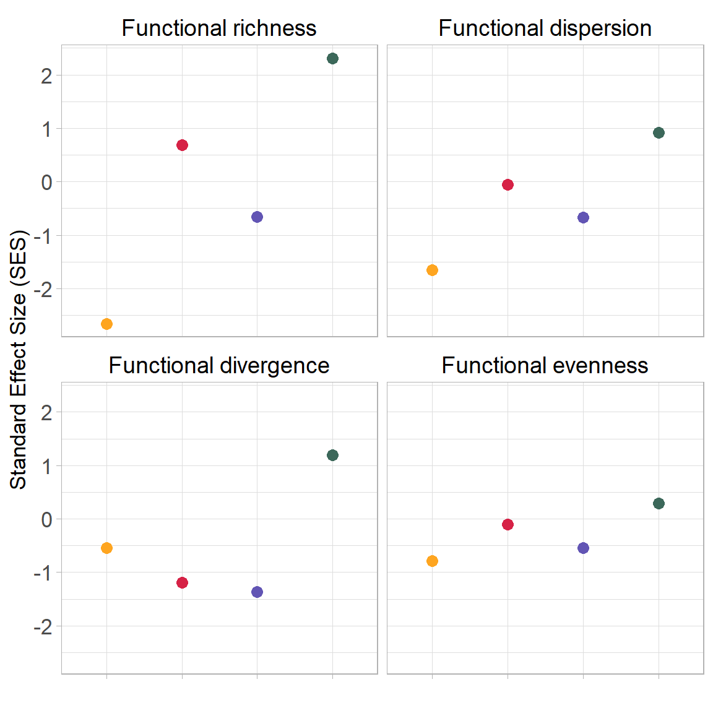
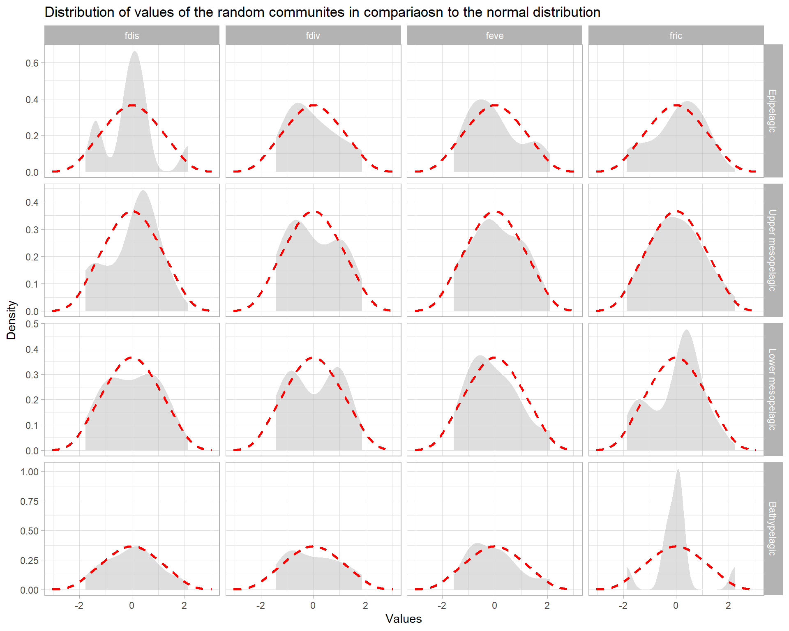
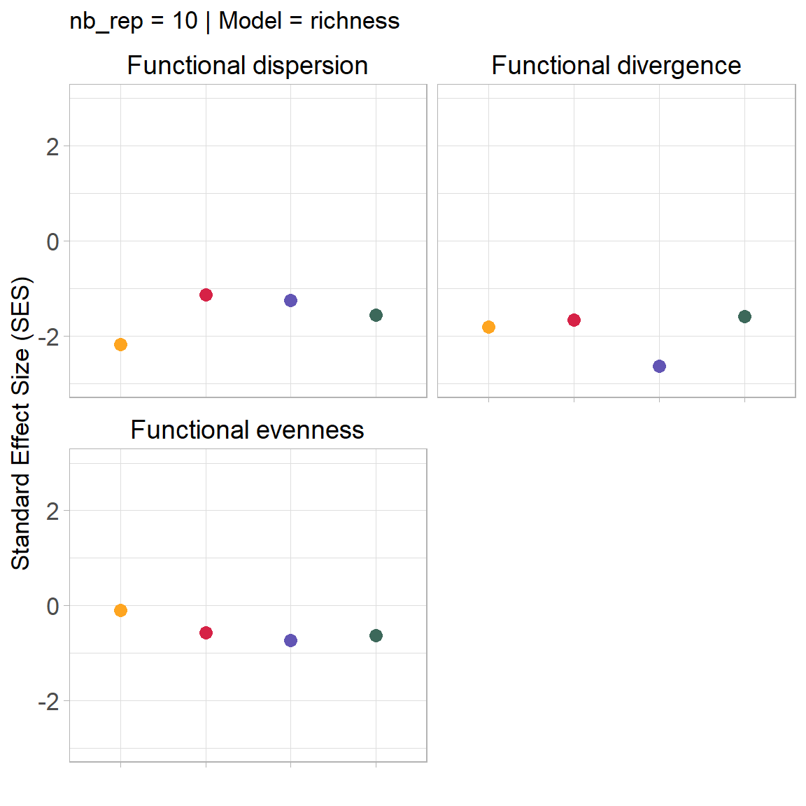
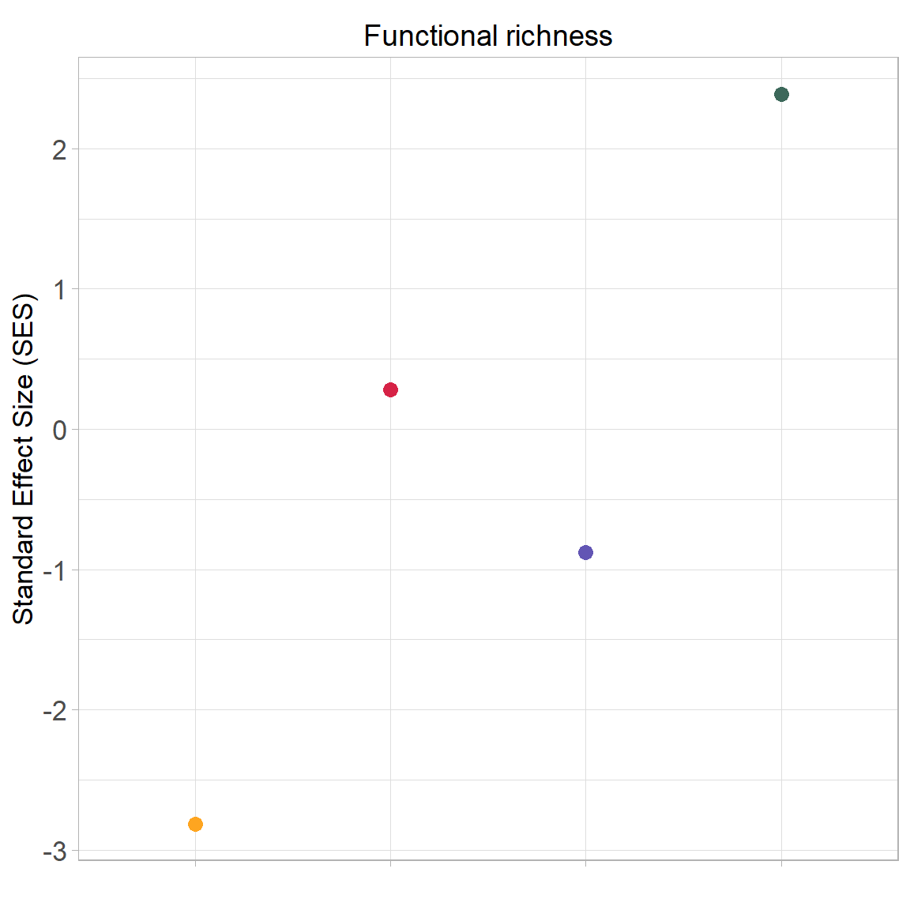
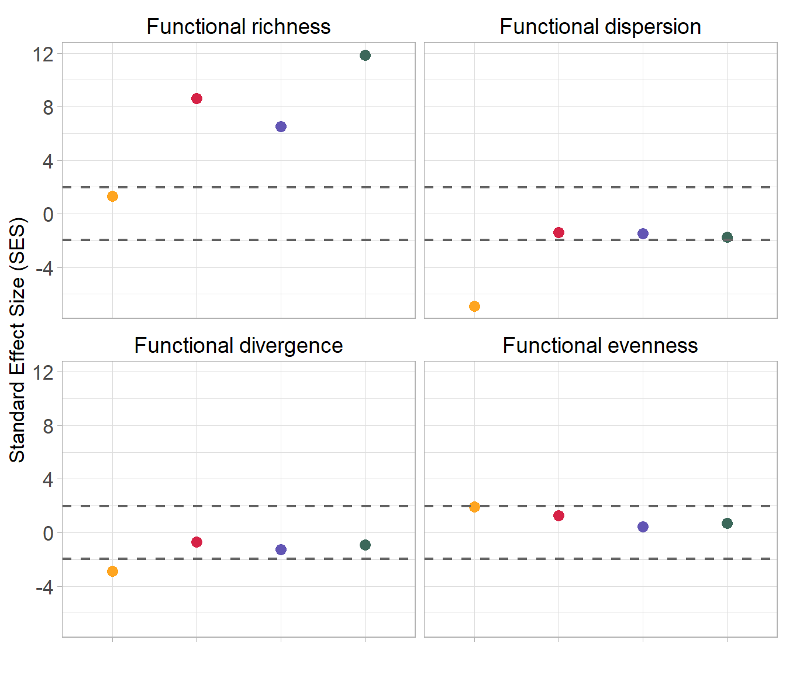

# 1. Data preparation


::: {.cell}

```{.r .cell-code}
library(dplyr)
library(traitstrap)
library(ggplot2)

morphometric_data <- utils::read.csv(here::here("data", "morphometric_data.csv"), sep = ";", header = T, dec = ".")

morpho_data <- morphometric_data %>%
  select(-c(variable_abbreviation, variable_unit)) %>%
  t() %>%
  as.data.frame() %>%
  janitor::row_to_names(row_number = 1) %>%
  `rownames<-`(NULL)%>%
  # delete for now (n=1) and Eurypharynx pelecanoides present 7 missing traits 
  filter(!species%in% c("Diaphus_sp","Eurypharynx_pelecanoides"))

# replace empty value by NA 
morpho_data[morpho_data ==""] <- NA

# Numeric variables
morpho_data[, 4:23] <- sapply(morpho_data[, 4:23], as.numeric)
```
:::

::: {.cell}

:::


## 1.1.Data imputation  
- mice algorithm: n imputation = 5, n iterations = 50


::: {.cell}

```{.r .cell-code}
#select numeric variables for imputation 
original_data <- morpho_data %>%
   filter(species!="Eurypharynx_pelecanoides") %>% 
  select(1:23)

imputation <-
  mice::mice(
    original_data,
    m = 5,
    maxit = 50,
    printFlag = F
  )

imputed_data <- mice::complete(imputation)
```
:::


## 1.2. Species * traits
- calculate functional traits 


::: {.cell}

```{.r .cell-code}
# calculate functional numeric traits
numeric_traits <- imputed_data %>%
  na.omit() %>%
  select(-individual_code) %>%
  mutate(
    eye_size = eye_diameter / head_depth,
    orbital_length = eye_diameter / standard_length,
    oral_gape_surface = mouth_width * mouth_depth / body_width * body_depth,
    oral_gape_shape = mouth_depth / mouth_width,
    oral_gape_position = distance_upper_jaws_bottom_head / head_depth,
    lower_jaw_length = lower_jaw_length / standard_length,
    head_length = head_length / standard_length,
    body_depth = body_depth / standard_length,
    pectoral_fin_position = distance_pectoral_bottom_body / body_depth_pectoral_insertion,
    pectoral_fin_insertion = prepectoral_length / standard_length,
    transversal_shape = body_depth / body_width,
    dorsal_fin_insertion = predorsal_length / standard_length,
    eye_position = eye_height / head_depth,
    operculum_volume = operculum_depth / operculum_width,
    gill_outflow = operculum_width,
    caudal_throttle_width = caudal_peduncle_min_depth
  ) %>%
  select(
    species,
    eye_size,
    orbital_length,
    gill_outflow,
    oral_gape_surface,
    oral_gape_shape,
    oral_gape_position,
    lower_jaw_length,
    head_length,
    body_depth,
    pectoral_fin_position,
    pectoral_fin_insertion,
    transversal_shape,
    caudal_throttle_width,
    dorsal_fin_insertion,
    eye_position,
    operculum_volume
  ) %>%
  group_by(species) %>%
  summarise(across(everything(), mean, na.rm = TRUE)) %>%
  arrange(species)

# categorical traits for species without NA
cat_morpho <- morpho_data %>%
  select(
    species,
    ventral_photophores,
    gland_head,
    chin_barbel,
    small_teeth,
    large_teeth,
    fang_teeth,
    retractable_teeth,
    internal_teeth,
    gill_raker_types,
    oral_gape_axis
  ) %>%
    na.omit() %>%
  distinct() %>%
  arrange(species)

# combined the two data frames
fish_traits <- numeric_traits %>%
  inner_join(cat_morpho, by = "species") %>%
  arrange(species) %>% 
  mutate(species = stringr::str_replace(species,  "Cyclothone_sp","Cyclothone")) %>% 
  filter(species!="Eurypharynx_pelecanoides") %>% 
  tibble::column_to_rownames("species")%>%
  # assign trait type 
  # as.factor for qualitative traits
  mutate_if(is.character, as.factor)%>%
  # as.ordered for ordered variables
  mutate_at(c("gill_raker_types", "oral_gape_axis"), as.ordered)
```
:::


__Data summary__


::: {.cell}

```{.r .cell-code}
fish_traits_sum <- fish_traits %>% 
  mutate(across(where(is.numeric), round, 2))

## Display the table ----
htmltools::tagList(DT::datatable(fish_traits_sum))
```

::: {.cell-output-display}


```{=html}
<div class="datatables html-widget html-fill-item" id="htmlwidget-7544640719dab9647968" style="width:100%;height:auto;"></div>
<script type="application/json" data-for="htmlwidget-7544640719dab9647968">{"x":{"filter":"none","vertical":false,"data":[["Anoplogaster_cornuta","Arctozenus_risso","Argyropelecus_hemigymnus","Argyropelecus_olfersii","Bathylagus_euryops","Benthosema_glaciale","Bolinichthys_supralateralis","Borostomias_antarcticus","Ceratoscopelus_maderensis","Chauliodus_sloani","Cyclothone","Derichthys_serpentinus","Diaphus_metopoclampus","Evermannella_balbo","Gonostoma_elongatum","Holtbyrnia_anomala","Holtbyrnia_macrops","Lampanyctus_ater","Lampanyctus_crocodilus","Lampanyctus_macdonaldi","Lestidiops_sphyrenoides","Lobianchia_gemellarii","Malacosteus_niger","Maulisia_argipalla","Maulisia_mauli","Maulisia_microlepis","Maurolicus_muelleri","Melanostigma_atlanticum","Melanostomias_bartonbeani","Myctophum_punctatum","Normichthys_operosus","Notoscopelus_bolini","Notoscopelus_kroyeri","Paralepis_coregonoides","Photostylus_pycnopterus","Sagamichthys_schnakenbecki","Searsia_koefoedi","Serrivomer_beanii","Sigmops_bathyphilus","Stomias_boa","Xenodermichthys_copei"],[0.19,0.68,0.25,0.25,0.8100000000000001,0.55,0.6899999999999999,0.39,0.62,0.32,0.29,0.71,0.38,0.46,0.26,0.7,0.59,0.59,0.46,0.46,0.64,0.47,0.57,0.5600000000000001,0.54,0.4,0.54,0.57,0.34,0.58,0.59,0.59,0.52,0.66,0.32,0.65,0.57,0.41,0.34,0.32,0.65],[0.07000000000000001,0.04,0.11,0.12,0.1,0.1,0.1,0.05,0.09,0.03,0.02,0.02,0.09,0.06,0.02,0.11,0.1,0.05,0.05,0.05,0.03,0.06,0.06,0.09,0.08,0.06,0.1,0.04,0.03,0.09,0.11,0.06,0.06,0.05,0.03,0.09,0.08,0.01,0.03,0.02,0.09],[20.92,5.68,5.36,17.14,8.539999999999999,4.76,12.47,15.8,5.52,13.62,7.69,6.92,6.37,9.279999999999999,27.92,9.56,9.279999999999999,18.38,20.14,25,5.09,15.46,18.71,15.52,15.73,21.49,3.59,4.03,18.12,5.54,9.43,9.630000000000001,6.78,4.9,6.55,11.76,9.19,6.95,18.1,6.29,19.9],[3706.73,138.11,554.49,3042.32,215.67,288.1,857.14,2308.8,281.62,1427.56,504.34,102.21,496.34,746.33,6250.38,557.98,870.85,1516.36,1550.6,2223.94,183.1,1226.9,4216.4,3465.85,2055.91,1384.77,186.85,78.40000000000001,2537.25,234.42,487.27,486.45,258.9,207.52,80.09999999999999,810.9,554.64,121.05,4544.84,715.4400000000001,250.39],[0.49,2.7,1.23,0.99,1.21,1.16,1.15,0.95,2,2.2,2.23,1.69,0.92,1.28,0.61,1.46,1.25,1.14,1.28,1.16,2.3,1.1,0.85,1.23,1.16,1.25,1.29,1.35,1.4,1.34,1.17,1.28,1.57,1.22,1.08,1.32,1.1,0.53,1.02,0.76,1.75],[0.4,0.7,0.54,0.72,0.35,0.33,0.34,0.48,0.5600000000000001,0.71,0.79,0.49,0.35,0.58,0.47,0.47,0.4,0.57,0.77,0.57,0.55,0.52,0.35,0.46,0.37,0.2,0.59,0.49,0.62,0.57,0.5600000000000001,0.49,0.62,0.42,0.5600000000000001,0.36,0.52,0.59,0.65,0.79,0.64],[0.29,0.12,0.25,0.27,0.07000000000000001,0.19,0.2,0.2,0.21,0.11,0.2,0.04,0.19,0.16,0.18,0.21,0.21,0.2,0.21,0.2,0.1,0.22,0.25,0.21,0.21,0.17,0.17,0.04,0.12,0.16,0.18,0.2,0.2,0.13,0.08,0.16,0.14,0.09,0.23,0.1,0.11],[0.35,0.23,0.3,0.31,0.22,0.26,0.29,0.22,0.31,0.14,0.22,0.09,0.26,0.22,0.21,0.37,0.31,0.23,0.26,0.25,0.18,0.27,0.23,0.36,0.34,0.26,0.29,0.13,0.14,0.24,0.3,0.25,0.26,0.25,0.16,0.3,0.25,0.15,0.25,0.11,0.23],[0.5,0.07000000000000001,0.55,0.65,0.18,0.23,0.24,0.15,0.2,0.11,0.14,0.06,0.29,0.19,0.14,0.2,0.19,0.16,0.17,0.18,0.07000000000000001,0.24,0.18,0.22,0.2,0.21,0.23,0.09,0.13,0.22,0.22,0.2,0.19,0.09,0.15,0.16,0.21,0.03,0.15,0.08,0.16],[0.33,0.28,0.23,0.25,0.2,0.44,0.46,0.18,0.48,0.29,0.2,0.66,0.24,0.22,0.21,0.25,0.25,0.29,0.38,0.19,0.36,0.27,0.21,0.2,0.19,0.17,0.23,0.32,0.22,0.47,0.18,0.29,0.25,0.22,0.47,0.21,0.2,1,0.2,0.18,0.22],[0.4,0.24,0.28,0.26,0.26,0.3,0.33,0.24,0.34,0.15,0.23,0.13,0.35,0.23,0.22,0.38,0.36,0.26,0.29,0.4,0.19,0.29,0.17,0.37,0.36,0.33,0.27,0.15,0.16,0.28,0.33,0.28,0.29,0.27,0.18,0.37,0.26,0,0.29,0.12,0.24],[0.04,0.01,0.25,0.12,0.03,0.09,0.02,0.04,0.03,0.02,0.07000000000000001,0.01,0.06,0.03,0.02,0.06,0.04,0.02,0.02,0.02,0.02,0.03,0.02,0.07000000000000001,0.03,0.01,0.18,0.04,0.02,0.03,0.02,0.03,0.03,0.07000000000000001,0.03,0.04,0.02,0,0.08,0.01,0.02],[10.46,3.64,3.43,5.98,6.3,3.35,10.8,5.53,5.46,6.19,2.84,2.24,5.94,6.26,12.76,4.01,6.08,8.56,11.33,13.31,2.92,8.9,8.029999999999999,5.81,7.61,18.18,2.2,1.35,4.79,4.29,8.539999999999999,6.79,7.07,2.6,3.58,5.83,10.18,1.21,3.3,3.47,5],[0.44,0.66,0.36,0.33,0.46,0.47,0.45,0.59,0.5,0.26,0.54,0.31,0.4,0.43,0.57,0.63,0.64,0.44,0.45,0.45,0.6,0.41,0.83,0.64,0.63,0.64,0.55,0.48,0.85,0.43,0.68,0.37,0.41,0.63,0.78,0.62,0.64,0.33,0.55,0.89,0.57],[0.72,0.61,0.84,0.77,0.68,0.52,0.59,0.64,0.6,0.76,0.95,0.68,0.5,0.8,0.6899999999999999,0.68,0.68,0.64,0.63,0.67,0.61,0.63,0.61,0.68,0.64,0.74,0.63,0.65,0.7,0.59,0.6,0.55,0.59,0.68,0.78,0.59,0.6,0.73,0.7,0.71,0.8],[1.92,1.25,2.07,1.2,1.12,1.62,1.27,0.9,1.86,1.71,1.01,1.44,1.83,1.34,1.13,1.01,1.26,0.75,0.79,0.7,1.4,0.92,1.43,1.05,1.14,1.56,1.4,1.39,1.48,1.94,1.56,1.03,1.93,0.96,1.44,0.92,1.69,1.8,0.8,2.77,0.68],["A","A","P","P","A","P","P","P","P","P","P","P","P","A","P","A","P","P","P","P","A","P","A","P","P","A","P","A","P","P","P","P","P","A","P","P","P","A","P","P","A"],["A","A","A","A","A","A","A","A","A","P","A","A","A","A","A","A","A","A","A","A","A","A","P","A","A","A","A","A","P","A","A","A","A","A","A","A","A","A","A","P","A"],["A","A","A","A","A","A","A","P","A","A","A","A","A","A","A","A","A","A","A","A","A","A","A","A","A","A","A","A","P","A","A","A","A","A","A","A","A","A","A","P","A"],["A","P","P","P","P","P","A","P","P","A","A","P","P","A","P","P","P","P","P","P","P","P","A","P","P","P","P","A","A","P","P","P","P","A","P","P","P","P","P","P","P"],["P","A","A","A","A","A","A","P","A","P","P","A","A","P","P","A","A","A","A","P","A","P","P","A","A","A","A","A","P","A","A","A","A","A","A","A","A","A","P","A","A"],["P","A","A","A","A","A","A","P","A","P","A","A","A","P","A","A","A","A","A","A","A","A","P","A","A","A","A","A","P","A","A","A","A","A","A","A","A","A","A","P","A"],["A","A","A","A","A","A","A","A","A","A","A","A","A","P","A","A","A","A","A","A","A","A","A","A","A","A","A","A","A","A","A","A","A","A","A","A","A","A","A","A","A"],["P","P","A","A","P","P","P","P","P","A","P","A","A","A","P","A","A","P","P","P","P","P","P","P","P","P","A","A","P","P","P","P","P","P","A","A","P","P","P","P","A"],["C","B","C","C","C","B","C","C","C","A","C","A","C","A","C","C","C","C","C","C","B","C","A","C","C","C","C","B","A","C","C","C","C","A","C","C","C","A","C","A","C"],["1","3","1","1","2","3","2","2","3","1","2","3","1","1","1","3","3","2","3","2","3","2","1","2","2","2","2","3","3","3","2","3","3","3","1","2","2","3","2","2","2"]],"container":"<table class=\"display\">\n  <thead>\n    <tr>\n      <th> <\/th>\n      <th>eye_size<\/th>\n      <th>orbital_length<\/th>\n      <th>gill_outflow<\/th>\n      <th>oral_gape_surface<\/th>\n      <th>oral_gape_shape<\/th>\n      <th>oral_gape_position<\/th>\n      <th>lower_jaw_length<\/th>\n      <th>head_length<\/th>\n      <th>body_depth<\/th>\n      <th>pectoral_fin_position<\/th>\n      <th>pectoral_fin_insertion<\/th>\n      <th>transversal_shape<\/th>\n      <th>caudal_throttle_width<\/th>\n      <th>dorsal_fin_insertion<\/th>\n      <th>eye_position<\/th>\n      <th>operculum_volume<\/th>\n      <th>ventral_photophores<\/th>\n      <th>gland_head<\/th>\n      <th>chin_barbel<\/th>\n      <th>small_teeth<\/th>\n      <th>large_teeth<\/th>\n      <th>fang_teeth<\/th>\n      <th>retractable_teeth<\/th>\n      <th>internal_teeth<\/th>\n      <th>gill_raker_types<\/th>\n      <th>oral_gape_axis<\/th>\n    <\/tr>\n  <\/thead>\n<\/table>","options":{"columnDefs":[{"className":"dt-right","targets":[1,2,3,4,5,6,7,8,9,10,11,12,13,14,15,16]},{"orderable":false,"targets":0},{"name":" ","targets":0},{"name":"eye_size","targets":1},{"name":"orbital_length","targets":2},{"name":"gill_outflow","targets":3},{"name":"oral_gape_surface","targets":4},{"name":"oral_gape_shape","targets":5},{"name":"oral_gape_position","targets":6},{"name":"lower_jaw_length","targets":7},{"name":"head_length","targets":8},{"name":"body_depth","targets":9},{"name":"pectoral_fin_position","targets":10},{"name":"pectoral_fin_insertion","targets":11},{"name":"transversal_shape","targets":12},{"name":"caudal_throttle_width","targets":13},{"name":"dorsal_fin_insertion","targets":14},{"name":"eye_position","targets":15},{"name":"operculum_volume","targets":16},{"name":"ventral_photophores","targets":17},{"name":"gland_head","targets":18},{"name":"chin_barbel","targets":19},{"name":"small_teeth","targets":20},{"name":"large_teeth","targets":21},{"name":"fang_teeth","targets":22},{"name":"retractable_teeth","targets":23},{"name":"internal_teeth","targets":24},{"name":"gill_raker_types","targets":25},{"name":"oral_gape_axis","targets":26}],"order":[],"autoWidth":false,"orderClasses":false}},"evals":[],"jsHooks":[]}</script>
```


:::
:::


__traits correlation__


::: {.cell}

```{.r .cell-code}
M <-cor(numeric_traits[, c(-1)])

ggcorrplot::ggcorrplot(M, hc.order = TRUE, type = "lower",
                       lab = TRUE, tl.cex = 9, lab_size = 3)
```

::: {.cell-output-display}
{width=768}
:::
:::

::: {.cell}

```{.r .cell-code}
# list of species 
sp_names <- c(rownames(fish_traits))

# taxonomic_families
taxonomic_families <- sp_names %>%
  as.data.frame() %>%
  `colnames<-`("species") %>% 
  mutate(
    family = case_when(
      species %in%
        c(
          "Benthosema_glaciale",
          "Ceratoscopelus_maderensis",
          "Diaphus_metopoclampus",
          "Lampanyctus_ater",
          "Lampanyctus_crocodilus",
          "Lampanyctus_macdonaldi",
          "Lobianchia_gemellarii",
          "Myctophum_punctatum",
          "Notoscopelus_bolini",
          "Notoscopelus_kroyeri",
          "Bolinichthys_supralateralis"
        ) ~ "Myctophidae",
      species %in% c(
        "Borostomias_antarcticus",
        "Chauliodus_sloani",
        "Malacosteus_niger",
        "Melanostomias_bartonbeani",
        "Stomias_boa"
      ) ~ "Stomiidae",
      species %in% c(
        "Holtbyrnia_anomala",
        "Holtbyrnia_macrops",
        "Maulisia_argipalla",
        "Maulisia_mauli",
        "Maulisia_microlepis",
        "Normichthys_operosus",
        "Searsia_koefoedi",
        "Sagamichthys_schnakenbecki"
      ) ~ "Platytroctidae",
      species %in% c("Sigmops_bathyphilus",
                     "Gonostoma_elongatum") ~ "Gonostomatidae",
      species %in% c(
        "Argyropelecus_hemigymnus",
        "Maurolicus_muelleri",
        "Argyropelecus_olfersii"
      ) ~ "Sternoptychidae",
      species == "Anoplogaster_cornuta" ~ "Anoplogastridae",
      species %in% c("Arctozenus_risso", "Paralepis_coregonoides") ~ "Paralepididae",
      species == "Bathylagus_euryops" ~ "Bathylagidae",
      species == "Cyclothone" ~ "Gonostomatidae",
      species == "Derichthys_serpentinus" ~ "Derichthyidae",
      species == "Eurypharynx_pelecanoides" ~ "Eurypharyngidae",
      species == "Evermannella_balbo" ~ "Evermannellidae",
      species == "Lestidiops_sphyrenoides" ~ "Lestidiidae",
      species == "Melanostigma_atlanticum" ~ "Zoarcidae",
      species %in% c("Photostylus_pycnopterus",
                     "Xenodermichthys_copei") ~ "Alepocephalidae",
      species == "Serrivomer_beanii" ~ "Serrivomeridae"
    )
  )%>% 
  mutate(
    order = case_when(
      family =="Myctophidae" ~ "Myctophiformes",
      family %in% c("Stomiidae","Gonostomatidae", "Sternoptychidae") ~  "Stomiiformes",
      family %in% c("Platytroctidae","Alepocephalidae") ~ "Alepocephaliformes",
      family == "Anoplogastridae" ~ "Trachichthyiformes",
      family %in% c("Paralepididae","Evermannellidae","Lestidiidae") ~ "Aulopiformes",
      family ==  "Bathylagidae" ~ "Argentiniformes",
      family %in% c("Derichthyidae","Serrivomeridae") ~ "Anguilliformes",
      family ==  "Eurypharyngidae" ~"Saccopharyngiformes",
      family == "Zoarcidae" ~ "Perciformes",
    )
  )
```
:::


## 1.3. Species * assemblages matrix

__Number of trawl hauls per depth__

+ Epipelagic = 8 
+ Upper mesopelagic = 26 
+ Lower mesopelagic = 16 
+ Bathypelagic = 16 


::: {.cell}

```{.r .cell-code}
# Metadata
metadata <-  utils::read.csv(here::here("data", "metadata.csv"), sep = ";", header = T, dec = ".")%>%
  # calculation of standardized biomass values (vertical  trawl opening * horizontal trawl opening * distance traveled)  
  mutate(volume_filtered = 24*58*distance_trawled_m)

ggplot(metadata, aes(x=depth))  +
  ylab ("Number of trawls")+
  xlab("Immersion depth (m)")+
  geom_histogram(binwidth=100, col="white", fill=alpha("black",0.55))+
  theme_light()+
  coord_flip()+ 
  scale_x_reverse()+
  labs(fill= "")+
  guides(fill="none")+
  scale_y_continuous(breaks = c(2,4,6,8,10,12))+
  theme(axis.text.x= element_text(size=12),
        axis.text.y= element_text(size=12),
        axis.title.y = element_text( size=12),
        axis.ticks = element_blank())
```

::: {.cell-output-display}
{width=672}
:::
:::


__Biomass data__


::: {.cell}

:::

::: {.cell}

```{.r .cell-code}
biomass_sum <- depth_fish_biomass %>%
  as.data.frame() %>%
  tibble::rownames_to_column(var = "depth_layer") %>%
  tidyr::pivot_longer(!depth_layer, names_to = "species", values_to = "biomass") %>%
  group_by(depth_layer) %>%
  filter(biomass > 0) %>%
  summarise(biomass_depth = round(sum(biomass), 3),
            n = n())

htmltools::tagList(DT::datatable(biomass_sum))
```

::: {.cell-output-display}


```{=html}
<div class="datatables html-widget html-fill-item" id="htmlwidget-0b4cd213376c9ccd70a9" style="width:100%;height:auto;"></div>
<script type="application/json" data-for="htmlwidget-0b4cd213376c9ccd70a9">{"x":{"filter":"none","vertical":false,"data":[["1","2","3","4"],["Bathypelagic","Epipelagic","Lower mesopelagic","Upper mesopelagic"],[7.489,0.5649999999999999,4.768,4.549],[41,24,32,28]],"container":"<table class=\"display\">\n  <thead>\n    <tr>\n      <th> <\/th>\n      <th>depth_layer<\/th>\n      <th>biomass_depth<\/th>\n      <th>n<\/th>\n    <\/tr>\n  <\/thead>\n<\/table>","options":{"columnDefs":[{"className":"dt-right","targets":[2,3]},{"orderable":false,"targets":0},{"name":" ","targets":0},{"name":"depth_layer","targets":1},{"name":"biomass_depth","targets":2},{"name":"n","targets":3}],"order":[],"autoWidth":false,"orderClasses":false}},"evals":[],"jsHooks":[]}</script>
```


:::
:::


## 1.4. Traits types

The **first column** contains **traits name**. The **second column** contains
**traits type** following this code:

* **N**: nominal trait (factor variable)
* **O**: ordinal traits (ordered variable)
* **Q**: quantitative traits (numeric values)


::: {.cell}

```{.r .cell-code}
fish_traits_cat <- utils::read.csv(here::here("data", "fish_traits_cat.csv"), sep = ";", header = T, dec = ".") 
htmltools::tagList(DT::datatable(fish_traits_cat))
```

::: {.cell-output-display}


```{=html}
<div class="datatables html-widget html-fill-item" id="htmlwidget-e1268f85514846079a16" style="width:100%;height:auto;"></div>
<script type="application/json" data-for="htmlwidget-e1268f85514846079a16">{"x":{"filter":"none","vertical":false,"data":[["1","2","3","4","5","6","7","8","9","10","11","12","13","14","15","16","17","18","19","20","21","22","23","24","25","26"],["eye_size","orbital_length","gill_outflow","oral_gape_surface","oral_gape_shape","oral_gape_position","lower_jaw_length","head_length","body_depth","pectoral_fin_position","pectoral_fin_insertion","transversal_shape","caudal_throttle_width","dorsal_fin_insertion","eye_position","operculum_volume","ventral_photophores","gland_head","chin_barbel","small_teeth","large_teeth","fang_teeth","retractable_teeth","internal_teeth","gill_raker_types","oral_gape_axis"],["Q","Q","Q","Q","Q","Q","Q","Q","Q","Q","Q","Q","Q","Q","Q","Q","N","N","N","N","N","N","N","N","O","O"]],"container":"<table class=\"display\">\n  <thead>\n    <tr>\n      <th> <\/th>\n      <th>trait_name<\/th>\n      <th>trait_type<\/th>\n    <\/tr>\n  <\/thead>\n<\/table>","options":{"columnDefs":[{"orderable":false,"targets":0},{"name":" ","targets":0},{"name":"trait_name","targets":1},{"name":"trait_type","targets":2}],"order":[],"autoWidth":false,"orderClasses":false}},"evals":[],"jsHooks":[]}</script>
```


:::
:::


# 2.Functional spaces

## 2.1 Compute data summaries  


::: {.cell}

```{.r .cell-code}
## Summary of the assemblages * species data.frame ----
asb_sp_fish_summ <- mFD::asb.sp.summary(asb_sp_w = depth_fish_biomass)
asb_sp_fish_occ  <- asb_sp_fish_summ$"asb_sp_occ"

htmltools::tagList(DT::datatable(asb_sp_fish_occ))
```

::: {.cell-output-display}


```{=html}
<div class="datatables html-widget html-fill-item" id="htmlwidget-70f1febf6bc56d36ceb5" style="width:100%;height:auto;"></div>
<script type="application/json" data-for="htmlwidget-70f1febf6bc56d36ceb5">{"x":{"filter":"none","vertical":false,"data":[["Upper mesopelagic","Bathypelagic","Epipelagic","Lower mesopelagic"],[0,1,0,0],[1,1,1,1],[1,1,1,1],[1,1,1,1],[0,1,0,0],[1,1,1,1],[0,1,0,1],[1,1,1,1],[1,1,1,1],[1,1,1,1],[1,1,1,1],[1,1,0,1],[0,1,0,1],[1,1,0,1],[0,1,0,1],[0,1,0,0],[1,1,0,1],[1,1,1,1],[0,1,0,0],[1,1,1,1],[1,1,1,1],[1,1,0,0],[0,1,0,1],[1,1,0,1],[0,1,0,0],[1,1,1,1],[1,1,1,1],[1,1,1,1],[1,1,1,1],[1,1,1,1],[0,1,0,0],[1,1,1,1],[1,1,1,1],[0,1,0,0],[1,1,0,1],[1,1,1,1],[1,1,1,1],[0,1,1,0],[1,1,1,1],[1,1,1,1],[0,1,1,1]],"container":"<table class=\"display\">\n  <thead>\n    <tr>\n      <th> <\/th>\n      <th>Anoplogaster_cornuta<\/th>\n      <th>Arctozenus_risso<\/th>\n      <th>Argyropelecus_hemigymnus<\/th>\n      <th>Argyropelecus_olfersii<\/th>\n      <th>Bathylagus_euryops<\/th>\n      <th>Benthosema_glaciale<\/th>\n      <th>Bolinichthys_supralateralis<\/th>\n      <th>Borostomias_antarcticus<\/th>\n      <th>Ceratoscopelus_maderensis<\/th>\n      <th>Chauliodus_sloani<\/th>\n      <th>Cyclothone<\/th>\n      <th>Derichthys_serpentinus<\/th>\n      <th>Diaphus_metopoclampus<\/th>\n      <th>Evermannella_balbo<\/th>\n      <th>Gonostoma_elongatum<\/th>\n      <th>Holtbyrnia_anomala<\/th>\n      <th>Holtbyrnia_macrops<\/th>\n      <th>Lampanyctus_crocodilus<\/th>\n      <th>Lampanyctus_macdonaldi<\/th>\n      <th>Lestidiops_sphyrenoides<\/th>\n      <th>Lobianchia_gemellarii<\/th>\n      <th>Malacosteus_niger<\/th>\n      <th>Maulisia_argipalla<\/th>\n      <th>Maulisia_mauli<\/th>\n      <th>Maulisia_microlepis<\/th>\n      <th>Maurolicus_muelleri<\/th>\n      <th>Melanostigma_atlanticum<\/th>\n      <th>Melanostomias_bartonbeani<\/th>\n      <th>Myctophum_punctatum<\/th>\n      <th>Lampanyctus_ater<\/th>\n      <th>Normichthys_operosus<\/th>\n      <th>Notoscopelus_kroyeri<\/th>\n      <th>Paralepis_coregonoides<\/th>\n      <th>Photostylus_pycnopterus<\/th>\n      <th>Sagamichthys_schnakenbecki<\/th>\n      <th>Searsia_koefoedi<\/th>\n      <th>Serrivomer_beanii<\/th>\n      <th>Sigmops_bathyphilus<\/th>\n      <th>Stomias_boa<\/th>\n      <th>Xenodermichthys_copei<\/th>\n      <th>Notoscopelus_bolini<\/th>\n    <\/tr>\n  <\/thead>\n<\/table>","options":{"columnDefs":[{"className":"dt-right","targets":[1,2,3,4,5,6,7,8,9,10,11,12,13,14,15,16,17,18,19,20,21,22,23,24,25,26,27,28,29,30,31,32,33,34,35,36,37,38,39,40,41]},{"orderable":false,"targets":0},{"name":" ","targets":0},{"name":"Anoplogaster_cornuta","targets":1},{"name":"Arctozenus_risso","targets":2},{"name":"Argyropelecus_hemigymnus","targets":3},{"name":"Argyropelecus_olfersii","targets":4},{"name":"Bathylagus_euryops","targets":5},{"name":"Benthosema_glaciale","targets":6},{"name":"Bolinichthys_supralateralis","targets":7},{"name":"Borostomias_antarcticus","targets":8},{"name":"Ceratoscopelus_maderensis","targets":9},{"name":"Chauliodus_sloani","targets":10},{"name":"Cyclothone","targets":11},{"name":"Derichthys_serpentinus","targets":12},{"name":"Diaphus_metopoclampus","targets":13},{"name":"Evermannella_balbo","targets":14},{"name":"Gonostoma_elongatum","targets":15},{"name":"Holtbyrnia_anomala","targets":16},{"name":"Holtbyrnia_macrops","targets":17},{"name":"Lampanyctus_crocodilus","targets":18},{"name":"Lampanyctus_macdonaldi","targets":19},{"name":"Lestidiops_sphyrenoides","targets":20},{"name":"Lobianchia_gemellarii","targets":21},{"name":"Malacosteus_niger","targets":22},{"name":"Maulisia_argipalla","targets":23},{"name":"Maulisia_mauli","targets":24},{"name":"Maulisia_microlepis","targets":25},{"name":"Maurolicus_muelleri","targets":26},{"name":"Melanostigma_atlanticum","targets":27},{"name":"Melanostomias_bartonbeani","targets":28},{"name":"Myctophum_punctatum","targets":29},{"name":"Lampanyctus_ater","targets":30},{"name":"Normichthys_operosus","targets":31},{"name":"Notoscopelus_kroyeri","targets":32},{"name":"Paralepis_coregonoides","targets":33},{"name":"Photostylus_pycnopterus","targets":34},{"name":"Sagamichthys_schnakenbecki","targets":35},{"name":"Searsia_koefoedi","targets":36},{"name":"Serrivomer_beanii","targets":37},{"name":"Sigmops_bathyphilus","targets":38},{"name":"Stomias_boa","targets":39},{"name":"Xenodermichthys_copei","targets":40},{"name":"Notoscopelus_bolini","targets":41}],"order":[],"autoWidth":false,"orderClasses":false}},"evals":[],"jsHooks":[]}</script>
```


:::
:::


## 2.2 Computing distances between species based on functional traits
- We have non-continuous traits so we use the __Gower distance__ _(metric = "gower")_ as this method allows traits weighting.
- __scale_euclid__ = TRUE


::: {.cell}

```{.r .cell-code}
sp_dist_fish <- mFD::funct.dist(
  sp_tr         = fish_traits,
  tr_cat        = fish_traits_cat,
  metric        = "gower",
  scale_euclid  = "scale_center",
  ordinal_var   = "classic",
  weight_type   = "equal",
  stop_if_NA    = TRUE)
```
:::


## 2.3 Building functional spaces and chosing the best one
### 2.3.1 Computing several multimensional functional spaces and assessing their quality

- mFD evaluates the quality of PCoA-based multidimensional spaces according to the deviation between trait-based distances and distances in the functional space (extension of Maire et al. (2015) framework). 


::: {.cell}

```{.r .cell-code}
fspaces_quality_fish <- mFD::quality.fspaces(
  sp_dist             = sp_dist_fish,
  maxdim_pcoa         = 10,
  deviation_weighting = "absolute",
  fdist_scaling       = FALSE,
  fdendro             = "average")

## Quality metrics of functional spaces ----
round(fspaces_quality_fish$"quality_fspaces", 3)
```

::: {.cell-output .cell-output-stdout}

```
               mad
pcoa_1d      0.142
pcoa_2d      0.079
pcoa_3d      0.050
pcoa_4d      0.030
pcoa_5d      0.023
pcoa_6d      0.017
pcoa_7d      0.014
pcoa_8d      0.015
pcoa_9d      0.017
pcoa_10d     0.019
tree_average 0.040
```


:::
:::


__Variance explained by each axis__


::: {.cell}

```{.r .cell-code}
# Extract eigenvalues information
eigenvalues_info <- fspaces_quality_fish$"details_fspaces"$"pc_eigenvalues"

# Create a dataframe to store the results
variance_df <- data.frame(
  PC = c("PC1", "PC2", "PC3", "PC4"),
  VarianceExplained = c(
    eigenvalues_info[1, "Cum_corr_eig"] * 100,
    (eigenvalues_info[2, "Cum_corr_eig"] - eigenvalues_info[1, "Cum_corr_eig"]) * 100,
    (eigenvalues_info[3, "Cum_corr_eig"] - eigenvalues_info[2, "Cum_corr_eig"]) * 100,
    (eigenvalues_info[4, "Cum_corr_eig"] - eigenvalues_info[3, "Cum_corr_eig"]) * 100
  )
) %>% 
  mutate(across(where(is.numeric), round, 2))

htmltools::tagList(DT::datatable(variance_df))
```

::: {.cell-output-display}


```{=html}
<div class="datatables html-widget html-fill-item" id="htmlwidget-94a407ae591634c4c220" style="width:100%;height:auto;"></div>
<script type="application/json" data-for="htmlwidget-94a407ae591634c4c220">{"x":{"filter":"none","vertical":false,"data":[["1","2","3","4"],["PC1","PC2","PC3","PC4"],[16.29,12.38,7.98,7.27]],"container":"<table class=\"display\">\n  <thead>\n    <tr>\n      <th> <\/th>\n      <th>PC<\/th>\n      <th>VarianceExplained<\/th>\n    <\/tr>\n  <\/thead>\n<\/table>","options":{"columnDefs":[{"className":"dt-right","targets":2},{"orderable":false,"targets":0},{"name":" ","targets":0},{"name":"PC","targets":1},{"name":"VarianceExplained","targets":2}],"order":[],"autoWidth":false,"orderClasses":false}},"evals":[],"jsHooks":[]}</script>
```


:::
:::


### 2.3.2 Illustrating the quality of the functional spaces


::: {.cell}

```{.r .cell-code}
mFD::quality.fspaces.plot(
  fspaces_quality            = fspaces_quality_fish,
  quality_metric             = "mad",
  fspaces_plot               = c("tree_average", "pcoa_2d", "pcoa_3d", 
                                 "pcoa_4d", "pcoa_5d", "pcoa_6d"),
  name_file                  = NULL,
  range_dist                 = NULL,
  range_dev                  = NULL,
  range_qdev                 = NULL,
  gradient_deviation         = c(neg = "darkblue", nul = "grey80", pos = "darkred"),
  gradient_deviation_quality = c(low = "yellow", high = "red"),
  x_lab                      = "Trait-based distance")
```

::: {.cell-output-display}
{width=1248}
:::
:::


### 2.3.3 Testing the correlation between functional axes and traits


::: {.cell}

```{.r .cell-code}
sp_faxes_coord_fish <- fspaces_quality_fish$"details_fspaces"$"sp_pc_coord"

# As we have 26 traits we have to split the df to see correlation between functional axes and traits 
# first set ----
fish_traits_1 <- fish_traits%>%
  select(1:9)

fish_tr_faxes <- mFD::traits.faxes.cor(
  sp_tr          = fish_traits_1, 
  sp_faxes_coord = sp_faxes_coord_fish[ , c("PC1", "PC2", "PC3", "PC4")], 
  plot           = T)

## Print traits with significant effect ----
fish_tr_faxes$"tr_faxes_stat"[which(fish_tr_faxes$"tr_faxes_stat"$"p.value" < 0.05), ]
```

::: {.cell-output .cell-output-stdout}

```
                trait axis         test stat value p.value
1            eye_size  PC1 Linear Model   r2 0.166  0.0083
2            eye_size  PC2 Linear Model   r2 0.189  0.0045
4            eye_size  PC4 Linear Model   r2 0.168  0.0077
5      orbital_length  PC1 Linear Model   r2 0.405  0.0000
6      orbital_length  PC2 Linear Model   r2 0.109  0.0346
10       gill_outflow  PC2 Linear Model   r2 0.476  0.0000
13  oral_gape_surface  PC1 Linear Model   r2 0.135  0.0181
14  oral_gape_surface  PC2 Linear Model   r2 0.471  0.0000
18    oral_gape_shape  PC2 Linear Model   r2 0.163  0.0088
24 oral_gape_position  PC4 Linear Model   r2 0.243  0.0011
26   lower_jaw_length  PC2 Linear Model   r2 0.683  0.0000
29        head_length  PC1 Linear Model   r2 0.325  0.0001
30        head_length  PC2 Linear Model   r2 0.378  0.0000
34         body_depth  PC2 Linear Model   r2 0.375  0.0000
35         body_depth  PC3 Linear Model   r2 0.174  0.0066
```


:::

```{.r .cell-code}
## Plot ----
fish_tr_faxes$"tr_faxes_plot"
```

::: {.cell-output-display}
{width=1344}
:::
:::

::: {.cell}

```{.r .cell-code}
# second set ----
fish_traits_2 <- fish_traits%>%
  select(10:18)

fish_tr_faxes_2 <- mFD::traits.faxes.cor(
  sp_tr          = fish_traits_2, 
  sp_faxes_coord = sp_faxes_coord_fish[ , c("PC1", "PC2", "PC3", "PC4")], 
  plot           = T)

## Print traits with significant effect ----
fish_tr_faxes_2$"tr_faxes_stat"[which(fish_tr_faxes_2$"tr_faxes_stat"$"p.value" < 0.05), ]
```

::: {.cell-output .cell-output-stdout}

```
                    trait axis           test stat value p.value
2   pectoral_fin_position  PC2   Linear Model   r2 0.268  0.0005
5  pectoral_fin_insertion  PC1   Linear Model   r2 0.283  0.0003
6  pectoral_fin_insertion  PC2   Linear Model   r2 0.394  0.0000
9       transversal_shape  PC1   Linear Model   r2 0.116  0.0294
11      transversal_shape  PC3   Linear Model   r2 0.204  0.0031
14  caudal_throttle_width  PC2   Linear Model   r2 0.397  0.0000
19   dorsal_fin_insertion  PC3   Linear Model   r2 0.173  0.0068
23           eye_position  PC3   Linear Model   r2 0.192  0.0041
32    ventral_photophores  PC4 Kruskal-Wallis eta2 0.590  0.0000
33             gland_head  PC1 Kruskal-Wallis eta2 0.245  0.0011
```


:::

```{.r .cell-code}
## Plot ----
fish_tr_faxes_2$"tr_faxes_plot"
```

::: {.cell-output-display}
{width=1344}
:::
:::

::: {.cell}

```{.r .cell-code}
# third set ----
fish_traits_3 <- fish_traits%>%
  select(19:26)

fish_tr_faxes_3 <- mFD::traits.faxes.cor(
  sp_tr          = fish_traits_3, 
  sp_faxes_coord = sp_faxes_coord_fish[ , c("PC1", "PC2", "PC3", "PC4")], 
  plot           = T)

## Print traits with significant effect ----
fish_tr_faxes_3$"tr_faxes_stat"[which(fish_tr_faxes_3$"tr_faxes_stat"$"p.value" < 0.05), ]
```

::: {.cell-output .cell-output-stdout}

```
              trait axis           test stat value p.value
1       chin_barbel  PC1 Kruskal-Wallis eta2 0.142  0.0107
3       chin_barbel  PC3 Kruskal-Wallis eta2 0.155  0.0080
4       chin_barbel  PC4 Kruskal-Wallis eta2 0.148  0.0092
5       small_teeth  PC1 Kruskal-Wallis eta2 0.317  0.0003
9       large_teeth  PC1 Kruskal-Wallis eta2 0.467  0.0000
10      large_teeth  PC2 Kruskal-Wallis eta2 0.214  0.0022
13       fang_teeth  PC1 Kruskal-Wallis eta2 0.410  0.0000
21   internal_teeth  PC1 Kruskal-Wallis eta2 0.073  0.0499
23   internal_teeth  PC3 Kruskal-Wallis eta2 0.641  0.0000
25 gill_raker_types  PC1 Kruskal-Wallis eta2 0.327  0.0007
26 gill_raker_types  PC2 Kruskal-Wallis eta2 0.366  0.0004
30   oral_gape_axis  PC2 Kruskal-Wallis eta2 0.396  0.0002
31   oral_gape_axis  PC3 Kruskal-Wallis eta2 0.269  0.0022
```


:::

```{.r .cell-code}
## Plot ----
fish_tr_faxes_3$"tr_faxes_plot"
```

::: {.cell-output-display}
{width=1344}
:::
:::


__Summary of traits with a significant effect__


::: {.cell}

```{.r .cell-code}
sp_faxes_coord_fish <- fspaces_quality_fish$"details_fspaces"$"sp_pc_coord"

fish_tr_faxes <- mFD::traits.faxes.cor(
  sp_tr          = fish_traits, 
  sp_faxes_coord = sp_faxes_coord_fish[ , c("PC1", "PC2", "PC3", "PC4")], 
  plot           = F)

## Print traits with significant effect ----
traits_effect <- fish_tr_faxes[which(fish_tr_faxes$p.value< 0.05),] %>% 
  as.data.frame() %>% 
  arrange(axis, desc(value))

htmltools::tagList(DT::datatable(traits_effect))
```

::: {.cell-output-display}


```{=html}
<div class="datatables html-widget html-fill-item" id="htmlwidget-bd997521dbaa30c0fef1" style="width:100%;height:auto;"></div>
<script type="application/json" data-for="htmlwidget-bd997521dbaa30c0fef1">{"x":{"filter":"none","vertical":false,"data":[["1","2","3","4","5","6","7","8","9","10","11","12","13","14","15","16","17","18","19","20","21","22","23","24","25","26","27","28","29","30","31","32","33","34","35","36","37","38"],["large_teeth","fang_teeth","orbital_length","gill_raker_types","head_length","small_teeth","pectoral_fin_insertion","gland_head","eye_size","chin_barbel","oral_gape_surface","transversal_shape","internal_teeth","lower_jaw_length","gill_outflow","oral_gape_surface","caudal_throttle_width","oral_gape_axis","pectoral_fin_insertion","head_length","body_depth","gill_raker_types","pectoral_fin_position","large_teeth","eye_size","oral_gape_shape","orbital_length","internal_teeth","oral_gape_axis","transversal_shape","eye_position","body_depth","dorsal_fin_insertion","chin_barbel","ventral_photophores","oral_gape_position","eye_size","chin_barbel"],["PC1","PC1","PC1","PC1","PC1","PC1","PC1","PC1","PC1","PC1","PC1","PC1","PC1","PC2","PC2","PC2","PC2","PC2","PC2","PC2","PC2","PC2","PC2","PC2","PC2","PC2","PC2","PC3","PC3","PC3","PC3","PC3","PC3","PC3","PC4","PC4","PC4","PC4"],["Kruskal-Wallis","Kruskal-Wallis","Linear Model","Kruskal-Wallis","Linear Model","Kruskal-Wallis","Linear Model","Kruskal-Wallis","Linear Model","Kruskal-Wallis","Linear Model","Linear Model","Kruskal-Wallis","Linear Model","Linear Model","Linear Model","Linear Model","Kruskal-Wallis","Linear Model","Linear Model","Linear Model","Kruskal-Wallis","Linear Model","Kruskal-Wallis","Linear Model","Linear Model","Linear Model","Kruskal-Wallis","Kruskal-Wallis","Linear Model","Linear Model","Linear Model","Linear Model","Kruskal-Wallis","Kruskal-Wallis","Linear Model","Linear Model","Kruskal-Wallis"],["eta2","eta2","r2","eta2","r2","eta2","r2","eta2","r2","eta2","r2","r2","eta2","r2","r2","r2","r2","eta2","r2","r2","r2","eta2","r2","eta2","r2","r2","r2","eta2","eta2","r2","r2","r2","r2","eta2","eta2","r2","r2","eta2"],[0.467,0.41,0.405,0.327,0.325,0.317,0.283,0.245,0.166,0.142,0.135,0.116,0.073,0.6830000000000001,0.476,0.471,0.397,0.396,0.394,0.378,0.375,0.366,0.268,0.214,0.189,0.163,0.109,0.641,0.269,0.204,0.192,0.174,0.173,0.155,0.59,0.243,0.168,0.148],[0,0,0,0.0007,0.0001,0.0003,0.0003,0.0011,0.0083,0.0107,0.0181,0.0294,0.0499,0,0,0,0,0.0002,0,0,0,0.0004,0.0005,0.0022,0.0045,0.008800000000000001,0.0346,0,0.0022,0.0031,0.0041,0.0066,0.0068,0.008,0,0.0011,0.0077,0.0092]],"container":"<table class=\"display\">\n  <thead>\n    <tr>\n      <th> <\/th>\n      <th>trait<\/th>\n      <th>axis<\/th>\n      <th>test<\/th>\n      <th>stat<\/th>\n      <th>value<\/th>\n      <th>p.value<\/th>\n    <\/tr>\n  <\/thead>\n<\/table>","options":{"columnDefs":[{"className":"dt-right","targets":[5,6]},{"orderable":false,"targets":0},{"name":" ","targets":0},{"name":"trait","targets":1},{"name":"axis","targets":2},{"name":"test","targets":3},{"name":"stat","targets":4},{"name":"value","targets":5},{"name":"p.value","targets":6}],"order":[],"autoWidth":false,"orderClasses":false}},"evals":[],"jsHooks":[]}</script>
```


:::
:::


## 2.4 Plotting the selected functional space and position of species


::: {.cell}

```{.r .cell-code}
# Convert sp_faxes_coord_fish to a data frame
sp_coord_community <- as.data.frame(sp_faxes_coord_fish[, c("PC1", "PC2")]) %>%
  tibble::rownames_to_column(var = "species")

# Depth_layer ----
# Transform biomass data
sp_all_layers <- depth_fish_biomass %>%
  as.data.frame() %>%
  tibble::rownames_to_column(var = "depth_layer") %>%
  tidyr::pivot_longer(!depth_layer, values_to = "biomass", names_to = "species") %>%
  filter(biomass > 0)

# Create a list to store data frames for each depth layer
all_data_layers <- lapply(unique(sp_all_layers$depth_layer), function(layer) {
  sp_layer <- sp_all_layers %>%
    filter(depth_layer == layer)
  
  # Mark presence or absence
  sp_coord_layer <- sp_coord_community %>%
    mutate(layer_presence = ifelse(species %in% sp_layer$species, "yes", "no")) %>%
    mutate(depth_layer = layer)
  
  return(sp_coord_layer)
})

# Combine all layers into one data frame
sp_coord_community_all_layers <- bind_rows(all_data_layers)

# Function to calculate the convex hull for a given data frame
calculate_hull <- function(data) {
  if (nrow(data) < 3) return(data)  # Handle cases with fewer than 3 points
  data %>%
    slice(chull(PC1, PC2))
}

# Initialize lists to store hulls
hull_all_combined <- NULL
hull_layer_combined <- NULL

for(layer in unique(sp_coord_community_all_layers$depth_layer)) {
  sp_layer <- sp_coord_community_all_layers %>%
    filter(depth_layer == layer)
  
  hull_all <- calculate_hull(sp_layer) %>%
    mutate(depth_layer = layer, type = "all")
  
  hull_layer <- calculate_hull(sp_layer %>% filter(layer_presence == "yes")) %>%
    mutate(depth_layer = layer, type = "present")
  
  hull_all_combined <- bind_rows(hull_all_combined, hull_all)
  hull_layer_combined <- bind_rows(hull_layer_combined, hull_layer)
}

# Define depth layer levels in desired order
depth_levels <- c("Epipelagic", "Upper mesopelagic", "Lower mesopelagic", "Bathypelagic")

# Ensure depth_layer is a factor with specified levels
sp_coord_community_all_layers$depth_layer <- factor(sp_coord_community_all_layers$depth_layer, levels = depth_levels)
hull_all_combined$depth_layer <- factor(hull_all_combined$depth_layer, levels = depth_levels)
hull_layer_combined$depth_layer <- factor(hull_layer_combined$depth_layer, levels = depth_levels)

# Define colors for each depth layer
depth_colors <- c("Epipelagic" = "#FEA520", 
                  "Upper mesopelagic" = "#D62246", 
                  "Lower mesopelagic" = "#6255B4", 
                  "Bathypelagic" = "#3C685A")

# Plotting
plot_depth <- ggplot() +
  # Plot present species
  geom_point(data = sp_coord_community_all_layers %>% filter(layer_presence == "yes"), 
             aes(PC1, PC2, col = depth_layer), size = 2, shape=19) +
  # Plot absent species
  geom_point(data = sp_coord_community_all_layers %>% filter(layer_presence == "no"), 
             aes(PC1, PC2), col = "grey", shape = 8, size = 2) +
  # Plot hulls
  geom_polygon(data = hull_all_combined, aes(x = PC1, y = PC2), 
               fill =  "gray70", alpha = 0.2) +
  geom_polygon(data = hull_layer_combined, aes(x = PC1, y = PC2, group = depth_layer, fill = depth_layer), 
               alpha = 0.4) +
  theme_light() +
  scale_color_manual(values = depth_colors) +
  scale_fill_manual(values = depth_colors) +
  guides(col = "none", shape = "none", fill = "none") +
  facet_wrap(~ depth_layer, nrow=1 ) +  
  theme(
    strip.text.x = element_text(size = 14, color = "gray20"),
    strip.background = element_rect(fill = "white"),
    aspect.ratio = 1,
    legend.title = element_text(size = 12),
    legend.text = element_text(size = 12),
    panel.grid.minor = element_blank(),
    panel.grid.major = element_blank()
  )


beta_fd_indices_fish <- mFD::beta.fd.multidim(
  sp_faxes_coord   = sp_faxes_coord_fish[ , c("PC1", "PC2", "PC3", "PC4")],
  asb_sp_occ       = asb_sp_fish_occ,
  check_input      = TRUE,
  beta_family      = c("Jaccard"),
  details_returned = T)
```

::: {.cell-output .cell-output-stdout}

```
Serial computing of convex hulls shaping assemblages with conv1

  |                                                                            
  |                                                                      |   0%
  |                                                                            
  |==================                                                    |  25%
  |                                                                            
  |===================================                                   |  50%
  |                                                                            
  |====================================================                  |  75%
  |                                                                            
  |======================================================================| 100%
Serial computing of intersections between pairs of assemblages with inter_geom_coord

  |                                                                            
  |                                                                      |   0%
  |                                                                            
  |============                                                          |  17%
  |                                                                            
  |=======================                                               |  33%
  |                                                                            
  |===================================                                   |  50%
  |                                                                            
  |===============================================                       |  67%
  |                                                                            
  |==========================================================            |  83%
  |                                                                            
  |======================================================================| 100%
```


:::

```{.r .cell-code}
vertices_community <-beta_fd_indices_fish$"details"$"asb_vertices"$Bathypelagic 

sp_coord_community <- as.data.frame(sp_faxes_coord_fish[, 1:2]) %>% 
  tibble::rownames_to_column(var = "species") %>% 
  mutate(vertices=case_when(species%in%vertices_community~"vertice",
                            !species%in%vertices_community~"not_vertice")) 

hull <- sp_coord_community%>% 
  slice(chull(PC1, PC2))

plot_com <- ggplot(data = sp_coord_community,aes(PC1, PC2)) +
  scale_color_manual(values = c("grey", "black"))+
  geom_point(size = 2.5, alpha=0.8, aes( shape=vertices, col= vertices)) +
  geom_polygon(data=hull, aes(x = PC1, y = PC2),
               fill = "gray70", alpha = 0.2) +
  theme_light() +
  geom_hline(yintercept = 0, linetype = 2, col = "gray45") +
  geom_vline(xintercept = 0, linetype = 2, col = "gray45") +
  guides(col = "none", shape = "none", fill = "none") +
  theme(
    strip.text.x = element_text(size = 14, color = "gray20"),
    strip.background = element_rect(fill = "white"),
    aspect.ratio = 1,
    legend.title = element_text(size = 12),
    legend.text = element_text(size = 12),
    panel.grid.minor = element_blank(),
    panel.grid.major = element_blank()
  )

ggpubr::ggarrange(
  labels = c("A","B"),
  plot_com,   
  plot_depth, 
  nrow = 2
) 
```

::: {.cell-output-display}
{width=768}
:::

```{.r .cell-code}
ggsave("functional_space.png", path = "figures", dpi = 800, height = 8, width = 10)
```
:::


# 3. SES Functional diversity indices

## 3.1.calculate and plot SES

- __Standard Effect Size (SES):__ to eliminate the influence of species richness on the functional diversity indices (Mouchet et al., 2010). Measures the deviation from the random expectation in standard deviation units

- __null model frequency__: Randomize community data matrix abundances (here biomasss) within species (maintains species occurrence frequency)

- __FRic Functional Richness__: the proportion of functional space filled by species of the studied assemblage, i.e. the volume inside the convex-hull shaping species. To compute FRic the number of species must be at least higher than the number of functional axis + 1.

- __FDis Functional Dispersion__: the biomass weighted deviation of species traits values from the center of the functional space filled by the assemblage i.e. the biomass-weighted mean distance to the biomass-weighted mean trait values of the assemblage.

- __FDiv Functional Divergence__: the proportion of the biomass supported by the species with the most extreme functional traits i.e. the ones located close to the edge of the convex-hull filled by the assemblage.

- __FEve Functional Evenness__: the regularity of biomass distribution in the functional space using the Minimum Spanning Tree linking all species present in the assemblage.


::: {.cell}

```{.r .cell-code}
# Calculate functional diversity for the observed data ----
obsFD <- mFD::alpha.fd.multidim(
  sp_faxes_coord = sp_faxes_coord_fish[, c("PC1", "PC2", "PC3", "PC4")],
  asb_sp_w = depth_fish_biomass,
  ind_vect = c("fdis", "feve", "fric", "fdiv"),
  scaling = TRUE,
  check_input = TRUE,
  details_returned = F
)

obsFD_div <- obsFD$functional_diversity_indices

# Null model ----
# Define the number of replications
nb_rep <- 10

# Initialize a list to store results of random functional diversity calculations for each index
indices_names <- colnames(obsFD_div)
resultsRandomFD <- list()

for (index_name in indices_names) {
  resultsRandomFD[[index_name]] <- matrix(
    NA,
    nrow = nrow(depth_fish_biomass),
    ncol = nb_rep,
    dimnames = list(rownames(depth_fish_biomass), paste0("Sim.", 1:nb_rep))
  )
}

# Perform randomization and calculate functional diversity for each replication
for (rep in 1:nb_rep) {
  randomize_mx <- picante::randomizeMatrix(samp = depth_fish_biomass,
                                           null.model = "frequency",
                                           iterations = 1)
  
  simFD_cal <- mFD::alpha.fd.multidim(
    sp_faxes_coord = sp_faxes_coord_fish[, c("PC1", "PC2", "PC3", "PC4")],
    asb_sp_w = randomize_mx,
    ind_vect = c("fdis", "feve", "fric", "fdiv"),
    scaling = TRUE,
    check_input = TRUE,
    details_returned = F
  )
  
  simFD_div <- simFD_cal$functional_diversity_indices
  
  for (index_name in indices_names) {
    simFD_index <- simFD_div[, index_name]
    
    # Ensure that simFD_index has the same length as the number of rows in depth_fish_biomass
    if (length(simFD_index) == nrow(depth_fish_biomass)) {
      resultsRandomFD[[index_name]][, rep] <- simFD_index
    } else {
      stop(
        paste(
          "The length of",
          index_name,
          "does not match the number of rows in depth_fish_biomass"
        )
      )
    }
  }
}

# Initialize dataframes to store mean, standard deviation, effect size, and standardized effect size
meanNullFD <- data.frame(matrix(NA, nrow = nrow(depth_fish_biomass), ncol = length(indices_names)))
sdNullFD <- data.frame(matrix(NA, nrow = nrow(depth_fish_biomass), ncol = length(indices_names)))
ES_FD <- data.frame(matrix(NA, nrow = nrow(depth_fish_biomass), ncol = length(indices_names)))
SES_FD <- data.frame(matrix(NA, nrow = nrow(depth_fish_biomass), ncol = length(indices_names)))

# Set column names for the dataframes
colnames(meanNullFD) <- indices_names
colnames(sdNullFD) <- indices_names
colnames(ES_FD) <- indices_names
colnames(SES_FD) <- indices_names

# Dataframe to store SES values for testing normality
SES_values_reps <- data.frame()

# Calculate statistics and SES for each index and store SES in both dataframes
for (index_name in indices_names) {
  # Calculate mean and standard deviation of null model FD values for each index
  meanNullFD[, index_name] <- rowMeans(resultsRandomFD[[index_name]], na.rm = TRUE)
  sdNullFD[, index_name] <- apply(resultsRandomFD[[index_name]], 1, sd, na.rm = TRUE)
  
  # Calculate effect size and standardized effect size for each index
  ES_FD[, index_name] <- obsFD_div[, index_name] - meanNullFD[, index_name]
  SES_FD[, index_name] <- ES_FD[, index_name] / sdNullFD[, index_name]
  
  # Calculate SES for each repetition and add to SES_values_reps dataframe
  for (rep in 1:nb_rep) {
    SES_repetition <- (resultsRandomFD[[index_name]][, rep] - meanNullFD[, index_name]) / sdNullFD[, index_name]
    SES_values_reps <- rbind(
      SES_values_reps,
      data.frame(
        depth_layer = rownames(depth_fish_biomass),
        SES = SES_repetition,
        index = index_name,
        repetition = paste0("Rep_", rep)
      )
    )
  }
}

# Combine all results into a single dataframe
results_df <- cbind(
  obsFD_div,
  meanNullFD = meanNullFD,
  sdNullFD = sdNullFD,
  ES_FD = ES_FD,
  SES_FD = SES_FD
)

# Add row names
rownames(results_df) <- rownames(depth_fish_biomass)

# Plot ----
# Output the results dataframe
results_df_plot <- results_df %>%
  tibble::rownames_to_column(var = "depth_layer") %>%
  tidyr::pivot_longer(!depth_layer,
                      values_to = "values",
                      names_to = "indice") %>%
  mutate(indice = stringr::str_replace(indice, "^SES_", "")) %>%
  filter(indice %in% c("FD.fric",
                       "FD.fdis",
                       "FD.feve",
                       "FD.fdiv"))


results_df_plot$depth_layer <- factor(
  results_df_plot$depth_layer,
  levels = c(
    "Epipelagic",
    "Upper mesopelagic",
    "Lower mesopelagic",
    "Bathypelagic"
  )
)
results_df_plot$indice <- factor(
  results_df_plot$indice,
  levels = c("FD.fric",
             "FD.fdis",
             "FD.fdiv",
             "FD.feve"),
  labels = c(
    "Functional richness",
    "Functional dispersion",
    "Functional divergence",
    "Functional evenness"
  )
)

ggplot(results_df_plot, aes(x = depth_layer, y = values, fill = depth_layer)) +
  facet_wrap(~indice) +
  geom_point(size = 3, aes(col=depth_layer)) +
  scale_color_manual(values = c("#FEA520", "#D62246", "#6255B4", "#3C685A")) +
  scale_fill_manual(values = c("#FEA520", "#D62246", "#6255B4", "#3C685A")) +
  labs(
    x = "",
    y = "Standard Effect Size (SES)") +
  theme_light() +
  theme(axis.text.x = element_blank(),
        strip.text.x = element_text(size = 14, color = "black"),
        strip.background = element_rect(fill = "white"),
        axis.title = element_text(size = 13),
        axis.text = element_text(size = 13)) +
  guides(col="none", fill="none")
```

::: {.cell-output-display}
{width=576}
:::

```{.r .cell-code}
ggsave("SES_indices_1000_depth_layer.png", path = "figures", dpi = 700, height = 6, width = 8)
```
:::


## 3.2. Normality and symmetry tests

- (Botta-Dukát, 2018)

- On the diversity index values obtained at random


::: {.cell}

```{.r .cell-code}
# normality and symetry tests ----
test_norm  <- SES_values_reps %>%
  tibble::remove_rownames() %>%
  filter(index %in% c("fdis", "fdiv", "feve", "fric"))

# Compute skewness and Lilliefors tests to check normaltiy and symetry 
stat_indices <- test_norm %>% 
  group_by(index, depth_layer) %>% 
  summarise(
    skewness = round(e1071::skewness(SES),2),
    Lilliefors_pvalue = round(nortest::lillie.test(SES)$p.value,2)
  )

htmltools::tagList(DT::datatable(stat_indices))
```

::: {.cell-output-display}


```{=html}
<div class="datatables html-widget html-fill-item" id="htmlwidget-a89b55b53b7eab8a7750" style="width:100%;height:auto;"></div>
<script type="application/json" data-for="htmlwidget-a89b55b53b7eab8a7750">{"x":{"filter":"none","vertical":false,"data":[["1","2","3","4","5","6","7","8","9","10","11","12","13","14","15","16"],["fdis","fdis","fdis","fdis","fdiv","fdiv","fdiv","fdiv","feve","feve","feve","feve","fric","fric","fric","fric"],["Bathypelagic","Epipelagic","Lower mesopelagic","Upper mesopelagic","Bathypelagic","Epipelagic","Lower mesopelagic","Upper mesopelagic","Bathypelagic","Epipelagic","Lower mesopelagic","Upper mesopelagic","Bathypelagic","Epipelagic","Lower mesopelagic","Upper mesopelagic"],[-0.2,1.49,-0,0.08,-0.05,0.65,0.72,-0.26,0.75,0.61,0.38,0.85,0.36,0.37,0.3,0.08],[0.36,0,0.95,0.09,0.68,0.27,0.66,0.53,0.02,0.05,0.97,0.15,0.06,0.37,0.06,0.27]],"container":"<table class=\"display\">\n  <thead>\n    <tr>\n      <th> <\/th>\n      <th>index<\/th>\n      <th>depth_layer<\/th>\n      <th>skewness<\/th>\n      <th>Lilliefors_pvalue<\/th>\n    <\/tr>\n  <\/thead>\n<\/table>","options":{"columnDefs":[{"className":"dt-right","targets":[3,4]},{"orderable":false,"targets":0},{"name":" ","targets":0},{"name":"index","targets":1},{"name":"depth_layer","targets":2},{"name":"skewness","targets":3},{"name":"Lilliefors_pvalue","targets":4}],"order":[],"autoWidth":false,"orderClasses":false}},"evals":[],"jsHooks":[]}</script>
```


:::
:::


- the red dashed line = normal distribution


::: {.cell}

```{.r .cell-code}
test_norm$depth_layer <- factor(
  test_norm$depth_layer,
  levels = c(
    "Epipelagic",
    "Upper mesopelagic",
    "Lower mesopelagic",
    "Bathypelagic"
  )
)

# Density plot with normal density overlay
ggpubr::ggdensity(test_norm, x = "SES", fill = "gray", col = "white") +
  facet_grid(depth_layer~index, scales = "free") +
  ggpubr::stat_overlay_normal_density(color = "red", linetype = "dashed", size = 1) +  
  theme_light() +
  labs(title = "Distribution of values of the random communites in compariaosn to the normal distribution",
       x = "Values", 
       y = "Density")
```

::: {.cell-output-display}
{width=960}
:::
:::


# 4. CWM 

## 4.1. CWM booststrap by depth layer 

- each trawl is a replica 

- non parametric Bootstrap 


::: {.cell}

```{.r .cell-code}
# Trait 
trait_boot <- morpho_data%>% 
  inner_join(metadata) %>% 
  select(-c(individual_code, years, longitude_start,
            latitude_start, longitude_end, longitude_end,
            volume_filtered, distance_trawled_m)) %>% 
  mutate(
    eye_size = eye_diameter / head_depth,
    orbital_length = eye_diameter / standard_length,
    oral_gape_surface = mouth_width * mouth_depth / body_width * body_depth,
    oral_gape_shape = mouth_depth / mouth_width,
    oral_gape_position = distance_upper_jaws_bottom_head / head_depth,
    lower_jaw_length = lower_jaw_length / standard_length,
    head_length = head_length / standard_length,
    body_depth = body_depth / standard_length,
    pectoral_fin_position = distance_pectoral_bottom_body / body_depth_pectoral_insertion,
    pectoral_fin_insertion = prepectoral_length / standard_length,
    transversal_shape = body_depth / body_width,
    dorsal_fin_insertion = predorsal_length / standard_length,
    eye_position = eye_height / head_depth,
    operculum_volume = operculum_depth / operculum_width,
    gill_outflow = operculum_width,
    caudal_throttle_width = caudal_peduncle_min_depth
  ) %>%
  select(
    depth,
    species,
    eye_size,
    orbital_length,
    gill_outflow,
    oral_gape_surface,
    oral_gape_shape,
    oral_gape_position,
    lower_jaw_length,
    head_length,
    body_depth,
    pectoral_fin_position,
    pectoral_fin_insertion,
    transversal_shape,
    caudal_throttle_width,
    dorsal_fin_insertion,
    eye_position,
    operculum_volume,
    ventral_photophores, 
    gland_head,
    chin_barbel, 
    small_teeth, 
    large_teeth, 
    fang_teeth, 
    retractable_teeth, 
    internal_teeth
  ) %>%
  mutate_at(vars(ventral_photophores, 
                 gland_head,
                 chin_barbel, 
                 small_teeth, 
                 large_teeth, 
                 fang_teeth, 
                 retractable_teeth, 
                 internal_teeth), 
            funs(ifelse(. == "P", 1, ifelse(. == "A", 0, .)))) %>% 
  mutate(across(all_of(c("ventral_photophores", 
                         "gland_head",
                         "chin_barbel", 
                         "small_teeth", 
                         "large_teeth", 
                         "fang_teeth", 
                         "retractable_teeth", 
                         "internal_teeth")), as.numeric)) %>% 
  tidyr::pivot_longer(!c(species,depth), names_to = "trait", values_to = "values")%>%
  # add column with depth layer
  mutate(
    depth_layer = case_when(
      between(depth, 0, 174) ~ "Epipelagic",
      between(depth, 175, 699) ~ "Upper mesopelagic",
      between(depth, 700, 999) ~ "Lower mesopelagic",
      between(depth, 1000, 2000) ~ "Bathypelagic"))

# Community 
community <-  rbind(data_biomass_2002_2019, data_biomass_2021_2022)%>%
  as.data.frame()%>%
  left_join(metadata) %>%
  select(species, biomass_sp, depth, volume_filtered)%>%
  # add column with depth layer
  mutate(
    depth_layer = case_when(
      between(depth, 0, 174) ~ "Epipelagic",
      between(depth, 175, 699) ~ "Upper mesopelagic",
      between(depth, 700, 999) ~ "Lower mesopelagic",
      between(depth, 1000, 2000) ~ "Bathypelagic"))%>%
  replace(is.na(.), 0)%>%
  group_by(species, depth)%>%
  mutate(biomass=sum(biomass_sp))%>%
  select(-c(biomass_sp))%>%
  distinct()%>%
  select(-c(volume_filtered)) %>% 
  filter(biomass>0)

trait_filling <- traitstrap::trait_fill(
  # input data (mandatory)
  comm = community,
  traits = trait_boot,
  
  # specifies columns in your data (mandatory)
  abundance_col = "biomass",
  taxon_col = "species",
  trait_col = "trait",
  value_col = "values",
  
  # specifies sampling hierarchy
  scale_hierarchy = c("depth_layer", "depth"),
  
  # min number of samples
  min_n_in_sample = 5
)

# run nonparametric bootstrapping
np_bootstrapped_moments <- traitstrap::trait_np_bootstrap(
  trait_filling, 
  nrep = 100
)

sum_boot_moment <- trait_summarise_boot_moments(
  np_bootstrapped_moments
) %>% 
  mutate(trait= gsub("_"," ", trait)) %>% 
   mutate(trait=stringr::str_to_sentence(trait)) 

sum_boot_moment$depth_layer <- factor(
  sum_boot_moment$depth_layer,
  levels = c(
    "Epipelagic",
    "Upper mesopelagic",
    "Lower mesopelagic",
    "Bathypelagic"
  )
) 

# order traits 
sum_boot_moment$trait <- factor(
  sum_boot_moment$trait,
  levels = c(
    "Caudal throttle width",
    "Oral gape surface",
    "Gill outflow",
    "Large teeth",
    "Eye size",
    "Orbital length",
    "Small teeth",
    "Transversal shape",
    "Body depth",
    "Dorsal fin insertion",
    "Eye position",
    "Oral gape shape",
    "Oral gape position",
    "Internal teeth",
    "Lower jaw length",
    "Pectoral fin position",
    "Ventral photophores",
    "Operculum volume",
    "Pectoral fin insertion",
    "Head length",
    "Chin barbel",
    "Fang teeth",
    "Gland head",
    "Retractable teeth"
  )
) 

ggplot(sum_boot_moment, aes(x = depth_layer, y = mean)) + 
  geom_point(alpha = 0.5, size = 1, position = position_jitter(width = 0.2), aes(col=depth_layer)) +
  geom_boxplot(aes(group=depth_layer, col=depth_layer, fill=depth_layer), alpha=0.1)+
  scale_color_manual(values = c("#FEA520", "#D62246", "#6255B4", "#3C685A")) +
  scale_fill_manual(values = c("#FEA520", "#D62246", "#6255B4", "#3C685A")) +
  facet_wrap(~trait, scales = "free", ncol = 4) +
  theme_light() +
  labs(y="Community biomass-weighted mean (CWM) ")+
  guides(col="none", fill="none")+
  theme(axis.text.x = element_blank(),
        axis.title.x = element_blank(),
        panel.grid.minor = element_blank(),
        #panel.grid.major = element_blank(),
        axis.title.y.left = element_text(size = 16),
        axis.title.y = element_text(size = 16),
        axis.text.y = element_text(size = 15),
        strip.background = element_rect(fill = "white"),
        strip.text.x = element_text(size = 16, color = "black"))
```

::: {.cell-output-display}
{width=1056}
:::

```{.r .cell-code}
ggsave("CWM_boot_sum.png", path = "figures", dpi = 800, height = 13, width = 12)
```
:::


## 4.2. PCA CWM 


::: {.cell}

```{.r .cell-code}
sum_boot_moment_pca <- trait_summarise_boot_moments(
  np_bootstrapped_moments
) %>% 
  ungroup() %>% 
  mutate(trait= gsub("_"," ", trait)) %>% 
  mutate(trait=stringr::str_to_sentence(trait)) %>% 
  select(c(trait, depth_layer, mean)) %>% 
  group_by(
    depth_layer, trait
  ) %>% 
  summarise(median_value= median(mean)) %>% 
  distinct() %>% 
  ungroup() %>% 
  tidyr::pivot_wider(id_cols=depth_layer, values_from = "median_value", names_from = "trait") %>% 
  tibble::column_to_rownames(var = "depth_layer")

res.pca <- FactoMineR::PCA(sum_boot_moment_pca, graph = FALSE)

res.pca <- FactoMineR::PCA(sum_boot_moment_pca, graph = FALSE)

factoextra::fviz_pca_biplot(res.pca, repel = TRUE,
                            pointsize = 2,
                            arrowsize = 0.2,
                            label="var",
                            title = "", 
                            col.var = "gray50")+
  theme_light()+
  theme(panel.grid.minor =  element_blank(),
        panel.grid.major = element_blank())+
  labs(x="Dimension 1 (50.7%)", y= "Dimension 2 (39.0%)")
```

::: {.cell-output-display}
{width=864}
:::

```{.r .cell-code}
ggsave("PCA_CWM.png", path = "figures", dpi = 700, height = 5, width = 8)
```
:::


# 5. Functional rarity

- Uniqueness - geographical restrectiveness


::: {.cell}
::: {.cell-output-display}
{width=864}
:::
:::


__which traits are mainly driving uniqueness ?__


::: {.cell}

```{.r .cell-code}
df <- fish_traits %>%
  as.data.frame() %>%
  tibble::rownames_to_column(var = "species") %>%
  left_join(sp_ui) %>%
  tibble::column_to_rownames(var = "species")

# Identify numerical and categorical traits
numeric_traits <- colnames(df)[sapply(df, is.numeric) &
                                 colnames(df) != "Ui"]

categorical_traits <- colnames(df)[!sapply(df, is.numeric) &
                                     colnames(df) != "Ui"]

# Initialize a data frame to store all results
combined_results_df <- data.frame(
  Trait = character(0),
  Type = character(0),
  Eta_R_squared = numeric(0),
  P_value = numeric(0),
  stringsAsFactors = FALSE
)

# Step 1: Perform Kruskal-Wallis test for categorical traits
for (categorical_trait in categorical_traits) {
  kruskal_result <- kruskal.test(df$Ui ~ df[[categorical_trait]])
  
  # Calculate eta-squared for Kruskal-Wallis
  n_groups <- length(unique(df[[categorical_trait]]))
  n_total <- length(df$Ui)
  h_value <- kruskal_result$statistic
  eta_squared <- (h_value - (n_groups - 1)) / (n_total - n_groups)
  
  combined_results_df <- rbind(
    combined_results_df,
    data.frame(
      Trait = categorical_trait,
      Type = "Categorical",
      Eta_R_squared = as.numeric(format(eta_squared, scientific = FALSE)),
      P_value = as.numeric(format(kruskal_result$p.value, scientific = FALSE)),
      stringsAsFactors = FALSE
    )
  )
}

# Step 2: Fit linear models for numerical traits
for (numeric_trait in numeric_traits) {
  lm_result <- lm(Ui ~ df[[numeric_trait]], data = df)
  summary_stats <- summary(lm_result)
  
  combined_results_df <- rbind(
    combined_results_df,
    data.frame(
      Trait = numeric_trait,
      Type = "Numeric",
      Eta_R_squared = as.numeric(format(summary_stats$r.squared, scientific = FALSE)),
      P_value = as.numeric(format(
        summary_stats$coefficients[2, 4], scientific = FALSE
      )),
      stringsAsFactors = FALSE
    )
  )
}

# Round the numeric columns to three decimal places
combined_results_df[, c("Eta_R_squared", "P_value")] <-
  round(combined_results_df[, c("Eta_R_squared", "P_value")], 3)

htmltools::tagList(DT::datatable(combined_results_df))
```

::: {.cell-output-display}


```{=html}
<div class="datatables html-widget html-fill-item" id="htmlwidget-0dd12d58f634a630a365" style="width:100%;height:auto;"></div>
<script type="application/json" data-for="htmlwidget-0dd12d58f634a630a365">{"x":{"filter":"none","vertical":false,"data":[["1","2","3","4","5","6","7","8","9","10","11","12","13","14","15","16","17","18","19","20","21","22","23","24","25","26"],["ventral_photophores","gland_head","chin_barbel","small_teeth","large_teeth","fang_teeth","retractable_teeth","internal_teeth","gill_raker_types","oral_gape_axis","eye_size","orbital_length","gill_outflow","oral_gape_surface","oral_gape_shape","oral_gape_position","lower_jaw_length","head_length","body_depth","pectoral_fin_position","pectoral_fin_insertion","transversal_shape","caudal_throttle_width","dorsal_fin_insertion","eye_position","operculum_volume"],["Categorical","Categorical","Categorical","Categorical","Categorical","Categorical","Categorical","Categorical","Categorical","Categorical","Numeric","Numeric","Numeric","Numeric","Numeric","Numeric","Numeric","Numeric","Numeric","Numeric","Numeric","Numeric","Numeric","Numeric","Numeric","Numeric"],[0.08699999999999999,0.2,0.07199999999999999,0.326,0.199,0.368,0.034,0.044,0.354,0.198,0.205,0.198,0.021,0.043,0.061,0.002,0.035,0.253,0.001,0.008999999999999999,0.268,0.005,0.008,0.005,0.276,0.064],[0.036,0.003,0.051,0,0.003,0,0.128,0.098,0,0.008,0.003,0.004,0.371,0.193,0.119,0.759,0.24,0.001,0.856,0.5610000000000001,0.001,0.653,0.573,0.647,0,0.109]],"container":"<table class=\"display\">\n  <thead>\n    <tr>\n      <th> <\/th>\n      <th>Trait<\/th>\n      <th>Type<\/th>\n      <th>Eta_R_squared<\/th>\n      <th>P_value<\/th>\n    <\/tr>\n  <\/thead>\n<\/table>","options":{"columnDefs":[{"className":"dt-right","targets":[3,4]},{"orderable":false,"targets":0},{"name":" ","targets":0},{"name":"Trait","targets":1},{"name":"Type","targets":2},{"name":"Eta_R_squared","targets":3},{"name":"P_value","targets":4}],"order":[],"autoWidth":false,"orderClasses":false}},"evals":[],"jsHooks":[]}</script>
```


:::
:::


# 6. Appendices


::: {.cell}

```{.r .cell-code}
# Convert sp_faxes_coord_fish to a data frame
sp_coord_community_2 <- as.data.frame(sp_faxes_coord_fish[, c("PC3", "PC4")]) %>%
  tibble::rownames_to_column(var = "species")

# Create a list to store data frames for each depth layer
all_data_layers_2 <- lapply(unique(sp_all_layers$depth_layer), function(layer) {
  sp_layer <- sp_all_layers %>%
    filter(depth_layer == layer)
  
  #presence or absence
  sp_coord_layer <- sp_coord_community_2 %>%
    mutate(layer_presence = ifelse(species %in% sp_layer$species, "yes", "no")) %>%
    mutate(depth_layer = layer)
  
  return(sp_coord_layer)
})

# Combine all layers into one data frame
sp_coord_community_all_layers <- bind_rows(all_data_layers_2)

# Function to calculate the convex hull for a given data frame
calculate_hull <- function(data) {
  if (nrow(data) < 3) return(data)  
  data %>%
    slice(chull(PC3, PC4))
}

# Initialize lists to store hulls
hull_all_combined <- NULL
hull_layer_combined <- NULL

for(layer in unique(sp_coord_community_all_layers$depth_layer)) {
  sp_layer <- sp_coord_community_all_layers %>%
    filter(depth_layer == layer)
  
  hull_all <- calculate_hull(sp_layer) %>%
    mutate(depth_layer = layer, type = "all")
  
  hull_layer <- calculate_hull(sp_layer %>% filter(layer_presence == "yes")) %>%
    mutate(depth_layer = layer, type = "present")
  
  hull_all_combined <- bind_rows(hull_all_combined, hull_all)
  hull_layer_combined <- bind_rows(hull_layer_combined, hull_layer)
}

# Define depth layer levels
depth_levels <- c("Epipelagic", "Upper mesopelagic", "Lower mesopelagic", "Bathypelagic")

sp_coord_community_all_layers$depth_layer <- factor(sp_coord_community_all_layers$depth_layer, levels = depth_levels)
hull_all_combined$depth_layer <- factor(hull_all_combined$depth_layer, levels = depth_levels)
hull_layer_combined$depth_layer <- factor(hull_layer_combined$depth_layer, levels = depth_levels)

# Define colors for each depth layer
depth_colors <- c("Epipelagic" = "#FEA520", 
                  "Upper mesopelagic" = "#D62246", 
                  "Lower mesopelagic" = "#6255B4", 
                  "Bathypelagic" = "#3C685A")

# Plot
plot_depth <- ggplot() +
  # Plot present species
  geom_point(data = sp_coord_community_all_layers %>% filter(layer_presence == "yes"), 
             aes(PC3, PC4, col = depth_layer), size = 2, shape=19) +
  # Plot absent species
  geom_point(data = sp_coord_community_all_layers %>% filter(layer_presence == "no"), 
             aes(PC3, PC4), col = "grey", shape = 8, size = 2) +
  # Plot hulls
  geom_polygon(data = hull_all_combined, aes(x = PC3, y = PC4), 
               fill = "gray70", alpha = 0.2) +
  geom_polygon(data = hull_layer_combined, aes(x = PC3, y = PC4, group = depth_layer, fill = depth_layer), 
               alpha = 0.4) +
  theme_light() +
  scale_color_manual(values = depth_colors) +
  scale_fill_manual(values = depth_colors) +
  guides(col = "none", shape = "none", fill = "none") +
  facet_wrap(~ depth_layer, nrow=1 ) +  
  theme(
    strip.text.x = element_text(size = 14, color = "gray20"),
    strip.background = element_rect(fill = "white"),
    aspect.ratio = 1,
    legend.title = element_text(size = 12),
    legend.text = element_text(size = 12),
    panel.grid.minor = element_blank(),
    panel.grid.major = element_blank()
  )


beta_fd_indices_fish <- mFD::beta.fd.multidim(
  sp_faxes_coord   = sp_faxes_coord_fish[ , c("PC3", "PC4", "PC3", "PC4")],
  asb_sp_occ       = asb_sp_fish_occ,
  check_input      = TRUE,
  beta_family      = c("Jaccard"),
  details_returned = T)
```

::: {.cell-output .cell-output-stdout}

```
Serial computing of convex hulls shaping assemblages with conv1

  |                                                                            
  |                                                                      |   0%
  |                                                                            
  |==================                                                    |  25%
  |                                                                            
  |===================================                                   |  50%
  |                                                                            
  |====================================================                  |  75%
  |                                                                            
  |======================================================================| 100%
Serial computing of convex hulls shaping assemblages with conv2

  |                                                                            
  |                                                                      |   0%
  |                                                                            
  |==================                                                    |  25%
  |                                                                            
  |===================================                                   |  50%
  |                                                                            
  |====================================================                  |  75%
  |                                                                            
  |======================================================================| 100%
Serial computing of intersections between pairs of assemblages with inter_geom_coord

  |                                                                            
  |                                                                      |   0%
  |                                                                            
  |============                                                          |  17%
  |                                                                            
  |=======================                                               |  33%
  |                                                                            
  |===================================                                   |  50%
  |                                                                            
  |===============================================                       |  67%
  |                                                                            
  |==========================================================            |  83%
  |                                                                            
  |======================================================================| 100%
Serial computing of intersections between pairs of assemblages with inter_rcdd_coord & qhull.opt1

  |                                                                            
  |                                                                      |   0%
  |                                                                            
  |============                                                          |  17%
  |                                                                            
  |=======================                                               |  33%
  |                                                                            
  |===================================                                   |  50%
  |                                                                            
  |===============================================                       |  67%
  |                                                                            
  |==========================================================            |  83%
  |                                                                            
  |======================================================================| 100%
Serial computing of intersections between pairs of assemblages with inter_rcdd_coord & qhull.opt2

  |                                                                            
  |                                                                      |   0%
  |                                                                            
  |============                                                          |  17%
```


:::

```{.r .cell-code}
vertices_community <-beta_fd_indices_fish$"details"$"asb_vertices"$Bathypelagic 

sp_coord_community_2 <- as.data.frame(sp_faxes_coord_fish[, 3:4]) %>% 
  tibble::rownames_to_column(var = "species") %>% 
  mutate(vertices=case_when(species%in%vertices_community~"vertice",
                            !species%in%vertices_community~"not_vertice")) 

hull <- sp_coord_community_2%>% 
  slice(chull(PC3, PC4))

plot_com <- ggplot(data = sp_coord_community_2,aes(PC3, PC4)) +
  scale_color_manual(values = c("grey", "black"))+
  geom_point(size = 2.5,aes( shape=vertices, col= vertices)) +
  geom_polygon(data=hull, aes(x = PC3, y = PC4), 
               fill = "gray70", alpha = 0.2) +
  theme_light() +
  geom_hline(yintercept = 0, linetype = 2, col = "gray45") +
  geom_vline(xintercept = 0, linetype = 2, col = "gray45") +
  guides(col = "none", shape = "none", fill = "none") +
  theme(
    strip.text.x = element_text(size = 14, color = "gray20"),
    strip.background = element_rect(fill = "white"),
    aspect.ratio = 1,
    legend.title = element_text(size = 12),
    legend.text = element_text(size = 12),
    panel.grid.minor = element_blank(),
    panel.grid.major = element_blank()
  )

ggpubr::ggarrange(
  labels = c("A","B"),
  plot_com,   
  plot_depth, 
  nrow = 2
) 
```

::: {.cell-output-display}
{width=768}
:::

```{.r .cell-code}
ggsave("functional_space_PC3_4.png", path = "figures", dpi = 800, height = 8, width = 10)
```
:::

::: {.cell}

```{.r .cell-code}
# # by depth
# station_sp <-
#   rbind(data_biomass_2002_2019, data_biomass_2021_2022) %>%
#   as.data.frame() %>%
#   left_join(metadata) %>%
#   select(species, biomass_sp, volume_filtered, station) %>%
#   # Divide biomass by the volume filtered at each trawl (g.m3)
#   mutate(biomass_cpu = (biomass_sp / volume_filtered) * 1000) %>%
#   select(species, biomass_cpu, station) %>%
#   replace(is.na(.), 0) %>%
#   group_by(species, station) %>%
#   mutate(biomass = sum(biomass_cpu)) %>%
#   select(-biomass_cpu) %>%
#   distinct() %>%
#   tidyr::pivot_wider(names_from = species, values_from = biomass) %>%
#   replace(is.na(.), 0) %>%
#   arrange(station) %>%
#   filter(!station %in% c("H0411", "L0731", "L0736")) %>%
#   tibble::column_to_rownames(var = "station") %>%
#   select(order(colnames(.))) %>%
#   as.matrix()
# 
# # if we want only presence-absence
# #station_sp <- replace(station_sp, station_sp > 0, 1)
# 
# # Calculate functional diversity for the observed data ----
# obsFD <- mFD::alpha.fd.multidim(
#   sp_faxes_coord = sp_faxes_coord_fish[, c("PC1", "PC2", "PC3", "PC4")],
#   asb_sp_w = station_sp,
#   scaling = TRUE,
#   check_input = TRUE,
#   details_returned = F
# )
# 
# obsFD_div <- obsFD$functional_diversity_indices
# 
# # Null model ----
# # Define the number of replications
# nb_rep <- 10
# 
# # Initialize a list to store results of random functional diversity calculations for each index
# indices_names <- colnames(obsFD_div)
# resultsRandomFD <- list()
# 
# for (index_name in indices_names) {
#   resultsRandomFD[[index_name]] <- matrix(
#     NA,
#     nrow = nrow(station_sp),
#     ncol = nb_rep,
#     dimnames = list(rownames(station_sp), paste0("Sim.", 1:nb_rep))
#   )
# }
# 
# # Perform randomization and calculate functional diversity for each replication
# for (rep in 1:nb_rep) {
#   randomize_mx <- picante::randomizeMatrix(samp = station_sp,
#                                            null.model = "frequency",
#                                            iterations = 1)
#   
#   simFD_cal <- mFD::alpha.fd.multidim(
#     sp_faxes_coord = sp_faxes_coord_fish[, c("PC1", "PC2", "PC3", "PC4")],
#     asb_sp_w = randomize_mx,
#     scaling = TRUE,
#     check_input = TRUE,
#     details_returned = F
#   )
#   
#   simFD_div <- simFD_cal$functional_diversity_indices
#   
#   for (index_name in indices_names) {
#     simFD_index <- simFD_div[, index_name]
#     
#     # Ensure that simFD_index has the same length as the number of rows in station_sp
#     if (length(simFD_index) == nrow(station_sp)) {
#       resultsRandomFD[[index_name]][, rep] <- simFD_index
#     } else {
#       stop(
#         paste(
#           "The length of",
#           index_name,
#           "does not match the number of rows in station_sp"
#         )
#       )
#     }
#   }
# }
# 
# # Initialize dataframes to store mean, standard deviation, effect size, and standardized effect size
# meanNullFD <-
#   data.frame(matrix(
#     NA,
#     nrow = nrow(station_sp),
#     ncol = length(indices_names)
#   ))
# sdNullFD <-
#   data.frame(matrix(
#     NA,
#     nrow = nrow(station_sp),
#     ncol = length(indices_names)
#   ))
# ES_FD <-
#   data.frame(matrix(
#     NA,
#     nrow = nrow(station_sp),
#     ncol = length(indices_names)
#   ))
# SES_FD <-
#   data.frame(matrix(
#     NA,
#     nrow = nrow(station_sp),
#     ncol = length(indices_names)
#   ))
# 
# # Set column names for the dataframes
# colnames(meanNullFD) <- indices_names
# colnames(sdNullFD) <- indices_names
# colnames(ES_FD) <- indices_names
# colnames(SES_FD) <- indices_names
# 
# # Calculate statistics for each index
# for (index_name in indices_names) {
#   # Calculate mean and standard deviation of null model FD values for each index
#   meanNullFD[, index_name] <-
#     rowMeans(resultsRandomFD[[index_name]], na.rm = TRUE)
#   sdNullFD[, index_name] <-
#     apply(resultsRandomFD[[index_name]], 1, sd, na.rm = TRUE)
#   
#   # Calculate effect size and standardized effect size for each index
#   ES_FD[, index_name] <-
#     obsFD_div[, index_name] - meanNullFD[, index_name]
#   SES_FD[, index_name] <-
#     ES_FD[, index_name] / sdNullFD[, index_name]
# }
# 
# # Combine all results into a single dataframe
# results_df <- cbind(
#   obsFD_div,
#   meanNullFD = meanNullFD,
#   sdNullFD = sdNullFD,
#   ES_FD = ES_FD,
#   SES_FD = SES_FD
# )
# 
# # Add row names
# rownames(results_df) <- rownames(station_sp)
# 
# # Plot  ----
# # Output the results dataframe
# results_df_plot <- results_df %>%
#   tibble::rownames_to_column(var = "station") %>%
#   inner_join(metadata %>% select(station, depth), by = "station") %>%
#   mutate(
#     depth_layer = case_when(
#       between(depth, 0, 174) ~ "Epipelagic",
#       between(depth, 175, 699) ~ "Upper mesopelagic",
#       between(depth, 700, 999) ~ "Lower mesopelagic",
#       between(depth, 1000, 2000) ~ "Bathypelagic"
#     )
#   ) %>%
#   select(-station) %>%
#   tidyr::pivot_longer(!c(depth, depth_layer),
#                       values_to = "values",
#                       names_to = "indice") %>%
#   mutate(indice = stringr::str_replace(indice, "^SES_", "")) %>%
#   filter(indice %in% c("FD.fric",
#                        "FD.fdis",
#                        "FD.feve",
#                        "FD.fdiv"))
# 
# results_df_plot$depth_layer <- factor(
#   results_df_plot$depth_layer,
#   levels = c(
#     "Epipelagic",
#     "Upper mesopelagic",
#     "Lower mesopelagic",
#     "Bathypelagic"
#   )
# )
# results_df_plot$indice <- factor(
#   results_df_plot$indice,
#   levels = c("FD.fric",
#              "FD.fdis",
#              "FD.fdiv",
#              "FD.feve"),
#   labels = c(
#     "Functional richness",
#     "Functional dispersion",
#     "Functional divergence",
#     "Functional evenness"
#   )
# )
# 
# ggplot(results_df_plot, aes(x = depth_layer, y = values, fill = depth_layer)) +
#   facet_wrap(~indice, scales = "free") +
#   geom_point(alpha = 0.5, size = 1, position = position_jitter(width = 0.2), aes(col=depth_layer)) +
#   geom_boxplot(alpha = 0.1, outlier.shape = NA, width = 0.5, aes(col=depth_layer, fill=depth_layer))+
#   scale_color_manual(values = c("#FEA520", "#D62246", "#6255B4", "#3C685A")) +
#   scale_fill_manual(values = c("#FEA520", "#D62246", "#6255B4", "#3C685A")) +
#   labs(
#     x = "",
#     y = "Standard Effect Size (SES)") +
#   theme_light() +
#   theme(axis.text.x = element_blank(),
#         strip.text.x = element_text(size = 14, color = "black"),
#         strip.background = element_rect(fill = "white"),
#         axis.title = element_text(size = 13),
#         axis.text = element_text(size = 13))+
#   geom_hline(yintercept = 1.96, linetype = "dashed", color = "gray50", linewidth = 0.8)+
#   geom_hline(yintercept = -1.96, linetype = "dashed", color = "gray50", linewidth = 0.8)+
#   guides(col="none", fill="none")

#ggsave("SES_indices_1000.png", path = "figures", dpi = 700, height = 7, width = 9)
```
:::


# 7. Nouveaux tests modèles nuls 
## 7.1. Model "richness" by depth layer 

Model of randomization = "richness" & by depth layer la biomasse des espèces est donc randomisée par couche de profondeur (seules les espèces présentes dans la couche de profondeur).
Dans ce cas, je n'obtiens pas de valeurs de SES pour la richesse fonctionelle car cet indice ne prend pas en compte la biomasse des espèces, seulement leur présence et donc j'obtiens les mêmes valeurs de Functional richness pour les valeurs observées et les valeurs simulées donc les valeurs de SES sont toujours = 0 (que les valeurs de biomasses soient randomisées ou pas ça ne change rien)


::: {.cell}

```{.r .cell-code}
# Calculate functional diversity for the observed data ----
obsFD <- mFD::alpha.fd.multidim(
  sp_faxes_coord = sp_faxes_coord_fish[, c("PC1", "PC2", "PC3", "PC4")],
  asb_sp_w = depth_fish_biomass,
  ind_vect = c("fdis", "feve", "fdiv"),
  scaling = TRUE,
  check_input = TRUE,
  details_returned = FALSE
)

obsFD_div <- obsFD$functional_diversity_indices

# Null model ----
# Define the number of replications
nb_rep <- 10
null_model_used <- "richness"

# Initialize a list to store results of random functional diversity calculations for each index
indices_names <- colnames(obsFD_div)
resultsRandomFD <- list()
randomized_matrices <- list()  # List to store randomized matrices

for (index_name in indices_names) {
  resultsRandomFD[[index_name]] <- matrix(
    NA,
    nrow = nrow(depth_fish_biomass),
    ncol = nb_rep,
    dimnames = list(rownames(depth_fish_biomass), paste0("Sim.", 1:nb_rep))
  )
}

# Perform randomization and calculate functional diversity for each depth layer
for (depth_layer in unique(rownames(depth_fish_biomass))) {
  # Subset biomass matrix for the current depth layer
  sub_biomass <- depth_fish_biomass[rownames(depth_fish_biomass) == depth_layer, , drop = FALSE]
  
  # Filter species with biomass > 0
  sub_biomass <- sub_biomass[, colSums(sub_biomass) > 0, drop = FALSE]
  
  for (rep in 1:nb_rep) {
    randomize_mx <- picante::randomizeMatrix(
      samp = sub_biomass,
      null.model = null_model_used,
      iterations = 1
    )
    
    # Store the randomized matrix
    randomized_matrices[[paste0(depth_layer, "_Rep_", rep)]] <- randomize_mx
    
    simFD_cal <- mFD::alpha.fd.multidim(
      sp_faxes_coord = sp_faxes_coord_fish[, c("PC1", "PC2", "PC3", "PC4")],
      asb_sp_w = randomize_mx,
      ind_vect = c("fdis", "feve", "fdiv"),
      scaling = TRUE,
      check_input = TRUE,
      details_returned = FALSE
    )
    
    simFD_div <- simFD_cal$functional_diversity_indices
    
    for (index_name in indices_names) {
      simFD_index <- simFD_div[, index_name]
      
      if (length(simFD_index) == nrow(sub_biomass)) {
        resultsRandomFD[[index_name]][rownames(sub_biomass), rep] <- simFD_index
      } else {
        stop(
          paste(
            "The length of",
            index_name,
            "does not match the number of rows in sub_biomass for depth layer", depth_layer
          )
        )
      }
    }
  }
}

# Initialize dataframes to store mean, standard deviation, effect size, and standardized effect size
meanNullFD <- data.frame(matrix(NA, nrow = nrow(depth_fish_biomass), ncol = length(indices_names)))
sdNullFD <- data.frame(matrix(NA, nrow = nrow(depth_fish_biomass), ncol = length(indices_names)))
ES_FD <- data.frame(matrix(NA, nrow = nrow(depth_fish_biomass), ncol = length(indices_names)))
SES_FD <- data.frame(matrix(NA, nrow = nrow(depth_fish_biomass), ncol = length(indices_names)))

# Set column names for the dataframes
colnames(meanNullFD) <- indices_names
colnames(sdNullFD) <- indices_names
colnames(ES_FD) <- indices_names
colnames(SES_FD) <- indices_names

# Dataframe to store SES values for testing normality
SES_values_reps <- data.frame()

# Calculate statistics and SES for each index and store SES in both dataframes
for (index_name in indices_names) {
  # Calculate mean and standard deviation of null model FD values for each index
  meanNullFD[, index_name] <- rowMeans(resultsRandomFD[[index_name]], na.rm = TRUE)
  sdNullFD[, index_name] <- apply(resultsRandomFD[[index_name]], 1, sd, na.rm = TRUE)
  
  # Calculate effect size and standardized effect size for each index
  ES_FD[, index_name] <- obsFD_div[, index_name] - meanNullFD[, index_name]
  SES_FD[, index_name] <- ES_FD[, index_name] / sdNullFD[, index_name]
  
  # Calculate SES for each repetition and add to SES_values_reps dataframe
  for (rep in 1:nb_rep) {
    SES_repetition <- (resultsRandomFD[[index_name]][, rep] - meanNullFD[, index_name]) / sdNullFD[, index_name]
    SES_values_reps <- rbind(
      SES_values_reps,
      data.frame(
        depth_layer = rownames(depth_fish_biomass),
        SES = SES_repetition,
        index = index_name,
        repetition = paste0("Rep_", rep)
      )
    )
  }
}

# Combine all results into a single dataframe
results_df <- cbind(
  obsFD_div,
  meanNullFD = meanNullFD,
  sdNullFD = sdNullFD,
  ES_FD = ES_FD,
  SES_FD = SES_FD
)

# Add row names
rownames(results_df) <- rownames(depth_fish_biomass)

# Plot ----
# Output the results dataframe
results_df_plot <- results_df %>%
  tibble::rownames_to_column(var = "depth_layer") %>%
  tidyr::pivot_longer(!depth_layer,
                      values_to = "values",
                      names_to = "indice") %>%
  filter(indice %in% c("SES_FD.fdis",
                       "SES_FD.fdiv",
                       "SES_FD.feve"))


results_df_plot$depth_layer <- factor(
  results_df_plot$depth_layer,
  levels = c(
    "Epipelagic",
    "Upper mesopelagic",
    "Lower mesopelagic",
    "Bathypelagic"
  )
)
results_df_plot$indice <- factor(
  results_df_plot$indice,
  levels = c("SES_FD.fdis",
             "SES_FD.fdiv",
             "SES_FD.feve"),
  labels = c(
    "Functional dispersion",
    "Functional divergence",
    "Functional evenness"
  )
)

ggplot(results_df_plot, aes(x = depth_layer, y = values, fill = depth_layer)) +
  facet_wrap(~indice, ncol=2) +
  geom_point(size = 3, aes(col = depth_layer)) +
  scale_color_manual(values = c("#FEA520", "#D62246", "#6255B4", "#3C685A")) +
  scale_fill_manual(values = c("#FEA520", "#D62246", "#6255B4", "#3C685A")) +
  labs(
    x = "",
    y = "Standard Effect Size (SES)",
    title = paste("nb_rep =", nb_rep, "| Model =", null_model_used)
  ) +
  theme_light() +
  ylim(c(-3,3))+
  theme(
    axis.text.x = element_blank(),
    strip.text.x = element_text(size = 14, color = "black"),
    strip.background = element_rect(fill = "white"),
    axis.title = element_text(size = 13),
    axis.text = element_text(size = 13)
  ) +
  guides(col = "none", fill = "none")
```

::: {.cell-output-display}
{width=576}
:::

```{.r .cell-code}
ggsave("SES_by_depth_layer_richness2.png", path = "figures", dpi = 700, height = 6, width = 8)
```
:::


### 7.1.1. tests normalité et symétrie


::: {.cell}

```{.r .cell-code}
# normality and symetry tests ----
test_norm  <- SES_values_reps %>%
  tibble::remove_rownames() %>%
  filter(index %in% c("fdis", "fdiv", "feve"))

# Compute skewness and Lilliefors tests to check normality and symmetry 
stat_indices <- test_norm %>% 
  group_by(index, depth_layer) %>% 
  summarise(
    skewness = round(e1071::skewness(SES),2),
    Lilliefors_pvalue = round(nortest::lillie.test(SES)$p.value,2)
  )

htmltools::tagList(DT::datatable(stat_indices))
```

::: {.cell-output-display}


```{=html}
<div class="datatables html-widget html-fill-item" id="htmlwidget-0a1479582c8d24045c14" style="width:100%;height:auto;"></div>
<script type="application/json" data-for="htmlwidget-0a1479582c8d24045c14">{"x":{"filter":"none","vertical":false,"data":[["1","2","3","4","5","6","7","8","9","10","11","12"],["fdis","fdis","fdis","fdis","fdiv","fdiv","fdiv","fdiv","feve","feve","feve","feve"],["Bathypelagic","Epipelagic","Lower mesopelagic","Upper mesopelagic","Bathypelagic","Epipelagic","Lower mesopelagic","Upper mesopelagic","Bathypelagic","Epipelagic","Lower mesopelagic","Upper mesopelagic"],[0.8100000000000001,-0.14,-0.55,0.31,-0.49,-0.19,-0.7,0.54,-0.28,0.38,-0.49,-0.05],[0.25,1,0.03,0.43,0.12,0.08,0.03,0.42,0.54,0.47,0.63,0.2]],"container":"<table class=\"display\">\n  <thead>\n    <tr>\n      <th> <\/th>\n      <th>index<\/th>\n      <th>depth_layer<\/th>\n      <th>skewness<\/th>\n      <th>Lilliefors_pvalue<\/th>\n    <\/tr>\n  <\/thead>\n<\/table>","options":{"columnDefs":[{"className":"dt-right","targets":[3,4]},{"orderable":false,"targets":0},{"name":" ","targets":0},{"name":"index","targets":1},{"name":"depth_layer","targets":2},{"name":"skewness","targets":3},{"name":"Lilliefors_pvalue","targets":4}],"order":[],"autoWidth":false,"orderClasses":false}},"evals":[],"jsHooks":[]}</script>
```


:::
:::


## 7.2. Model "frequency" all the community
- est-ce que chaque assemblage est + ou - riche fonctionnellment par rapport à l'ensemble des espèces potentiellement présentes au sein de la communauté (donc matrice randomisée sur l'ensemble des couches)


::: {.cell}

```{.r .cell-code}
# Calculate functional diversity for the observed data ----
obsFD <- mFD::alpha.fd.multidim(
  sp_faxes_coord = sp_faxes_coord_fish[, c("PC1", "PC2", "PC3", "PC4")],
  asb_sp_w = depth_fish_biomass,
  ind_vect = c("fric"),
  scaling = TRUE,
  check_input = TRUE,
  details_returned = F
)

obsFD_div <- obsFD$functional_diversity_indices

# Null model ----
# Define the number of replications
nb_rep <- 10

# Initialize a list to store results of random functional diversity calculations for each index
indices_names <- colnames(obsFD_div)
resultsRandomFD <- list()

for (index_name in indices_names) {
  resultsRandomFD[[index_name]] <- matrix(
    NA,
    nrow = nrow(depth_fish_biomass),
    ncol = nb_rep,
    dimnames = list(rownames(depth_fish_biomass), paste0("Sim.", 1:nb_rep))
  )
}

# Perform randomization and calculate functional diversity for each replication
for (rep in 1:nb_rep) {
  randomize_mx <- picante::randomizeMatrix(samp = depth_fish_biomass,
                                           null.model = "frequency",
                                           iterations = 1)
  
  simFD_cal <- mFD::alpha.fd.multidim(
    sp_faxes_coord = sp_faxes_coord_fish[, c("PC1", "PC2", "PC3", "PC4")],
    asb_sp_w = randomize_mx,
    ind_vect = c("fric"),
    scaling = TRUE,
    check_input = TRUE,
    details_returned = F
  )
  
  simFD_div <- simFD_cal$functional_diversity_indices
  
  for (index_name in indices_names) {
    simFD_index <- simFD_div[, index_name]
    
    # Ensure that simFD_index has the same length as the number of rows in depth_fish_biomass
    if (length(simFD_index) == nrow(depth_fish_biomass)) {
      resultsRandomFD[[index_name]][, rep] <- simFD_index
    } else {
      stop(
        paste(
          "The length of",
          index_name,
          "does not match the number of rows in depth_fish_biomass"
        )
      )
    }
  }
}

# Initialize dataframes to store mean, standard deviation, effect size, and standardized effect size
meanNullFD <- data.frame(matrix(NA, nrow = nrow(depth_fish_biomass), ncol = length(indices_names)))
sdNullFD <- data.frame(matrix(NA, nrow = nrow(depth_fish_biomass), ncol = length(indices_names)))
ES_FD <- data.frame(matrix(NA, nrow = nrow(depth_fish_biomass), ncol = length(indices_names)))
SES_FD <- data.frame(matrix(NA, nrow = nrow(depth_fish_biomass), ncol = length(indices_names)))

# Set column names for the dataframes
colnames(meanNullFD) <- indices_names
colnames(sdNullFD) <- indices_names
colnames(ES_FD) <- indices_names
colnames(SES_FD) <- indices_names

# Dataframe to store SES values for testing normality
SES_values_reps <- data.frame()

# Calculate statistics and SES for each index and store SES in both dataframes
for (index_name in indices_names) {
  # Calculate mean and standard deviation of null model FD values for each index
  meanNullFD[, index_name] <- rowMeans(resultsRandomFD[[index_name]], na.rm = TRUE)
  sdNullFD[, index_name] <- apply(resultsRandomFD[[index_name]], 1, sd, na.rm = TRUE)
  
  # Calculate effect size and standardized effect size for each index
  ES_FD[, index_name] <- obsFD_div[, index_name] - meanNullFD[, index_name]
  SES_FD[, index_name] <- ES_FD[, index_name] / sdNullFD[, index_name]
  
  # Calculate SES for each repetition and add to SES_values_reps dataframe
  for (rep in 1:nb_rep) {
    SES_repetition <- (resultsRandomFD[[index_name]][, rep] - meanNullFD[, index_name]) / sdNullFD[, index_name]
    SES_values_reps <- rbind(
      SES_values_reps,
      data.frame(
        depth_layer = rownames(depth_fish_biomass),
        SES = SES_repetition,
        index = index_name,
        repetition = paste0("Rep_", rep)
      )
    )
  }
}

# Combine all results into a single dataframe
results_df <- cbind(
  obsFD_div,
  meanNullFD = meanNullFD,
  sdNullFD = sdNullFD,
  ES_FD = ES_FD,
  SES_FD = SES_FD
)

# Add row names
rownames(results_df) <- rownames(depth_fish_biomass)

# Plot ----
# Output the results dataframe
results_df_plot <- results_df %>%
  tibble::rownames_to_column(var = "depth_layer") %>%
  tidyr::pivot_longer(!depth_layer,
                      values_to = "values",
                      names_to = "indice") %>%
  filter(indice %in% c("SES_FD.fric"))


results_df_plot$depth_layer <- factor(
  results_df_plot$depth_layer,
  levels = c(
    "Epipelagic",
    "Upper mesopelagic",
    "Lower mesopelagic",
    "Bathypelagic"
  )
)

results_df_plot$indice <- factor(
  results_df_plot$indice,
  levels = c("SES_FD.fric"),
  labels = c(
    "Functional richness"
  )
)

ggplot(results_df_plot, aes(x = depth_layer, y = values, fill = depth_layer)) +
  facet_wrap(~indice) +
  geom_point(size = 3, aes(col=depth_layer)) +
  scale_color_manual(values = c("#FEA520", "#D62246", "#6255B4", "#3C685A")) +
  scale_fill_manual(values = c("#FEA520", "#D62246", "#6255B4", "#3C685A")) +
  labs(
    x = "",
    y = "Standard Effect Size (SES)") +
  theme_light() +
  theme(axis.text.x = element_blank(),
        strip.text.x = element_text(size = 14, color = "black"),
        strip.background = element_rect(fill = "white"),
        axis.title = element_text(size = 13),
        axis.text = element_text(size = 13)) +
  guides(col="none", fill="none")
```

::: {.cell-output-display}
{width=576}
:::

```{.r .cell-code}
ggsave("SES_frequency_community.png", path = "figures", dpi = 700, height = 3, width = 4)
```
:::


### 7.2.1. tests normalité et symétrie


::: {.cell}

```{.r .cell-code}
# normality and symmetry tests ----
test_norm  <- SES_values_reps %>%
  tibble::remove_rownames() %>%
  filter(index %in% c("fric"))

# Compute skewness and Lilliefors tests to check normality and symmetry 
stat_indices <- test_norm %>% 
  summarise(
    skewness = round(e1071::skewness(SES),2),
    Lilliefors_pvalue = round(nortest::lillie.test(SES)$p.value,2)
  )

htmltools::tagList(DT::datatable(stat_indices))
```

::: {.cell-output-display}


```{=html}
<div class="datatables html-widget html-fill-item" id="htmlwidget-2f4fcb8bd426f05e97e8" style="width:100%;height:auto;"></div>
<script type="application/json" data-for="htmlwidget-2f4fcb8bd426f05e97e8">{"x":{"filter":"none","vertical":false,"data":[["1"],[-0.25],[0.21]],"container":"<table class=\"display\">\n  <thead>\n    <tr>\n      <th> <\/th>\n      <th>skewness<\/th>\n      <th>Lilliefors_pvalue<\/th>\n    <\/tr>\n  <\/thead>\n<\/table>","options":{"columnDefs":[{"className":"dt-right","targets":[1,2]},{"orderable":false,"targets":0},{"name":" ","targets":0},{"name":"skewness","targets":1},{"name":"Lilliefors_pvalue","targets":2}],"order":[],"autoWidth":false,"orderClasses":false}},"evals":[],"jsHooks":[]}</script>
```


:::
:::


# 8. dbFD package 


::: {.cell}

```{.r .cell-code}
# Load required libraries
library(mFD)
library(tibble)
library(tidyr)
library(ggplot2)
library(tidyverse)
library(FD)
library(ade4)
library(geometry)

source("R/Anik/sp_tr_en_tr_cat.R")  

# Load data
depth_fish_biomass <- read.csv(here::here("data", "depth_fish_biomass.csv"), row.names = 1, sep = ";", dec = ".")
fish_traits <- read.csv(here::here("data", "fish_traits.csv"), row.names = 1, sep = ";", dec = ".")

# Convert character traits to factor
fish_traits <- fish_traits %>% mutate(across(where(is.character), as.factor))

# Function to randomize traits while preserving factor levels
randomize_traits <- function(traits_mat) {
  randomized_mat <- traits_mat
  for (trait in colnames(traits_mat)) {
    if (is.factor(traits_mat[[trait]])) {
      randomized_mat[[trait]] <- factor(sample(traits_mat[[trait]], replace = FALSE), levels = levels(traits_mat[[trait]]))
    } else {
      randomized_mat[[trait]] <- sample(traits_mat[[trait]], replace = FALSE)
    }
  }
  return(randomized_mat)
}

# Number of simulations
n_simulations <- 99

# Depth layers
depth_layers <- rownames(depth_fish_biomass)

# Liste des indices à calculer
indices <- c("FRic", "FDis", "RaoQ", "FEve", "FDiv") 

# Matrices pour stocker les résultats observés et simulés
dbFD_result_obs <- matrix(NA, nrow = length(depth_layers), ncol = length(indices), 
                          dimnames = list(depth_layers, indices))

dbFD_result_sim <- array(NA, dim = c(length(depth_layers), n_simulations, length(indices)), 
                         dimnames = list(depth_layers, paste0("Sim.", 1:n_simulations), indices))

# Boucle sur chaque couche de profondeur
for (layer in depth_layers) {
  
  # Sélectionner les espèces présentes
  species_in_layer <- colnames(depth_fish_biomass)[depth_fish_biomass[layer, ] > 0]
  
  # Filtrer les traits et retirer les colonnes constantes
  traits_layer <- fish_traits[species_in_layer, , drop = FALSE] %>%
    select(where(~ length(unique(.)) > 1))  
  
  # Skip si aucun trait variable
  if (ncol(traits_layer) == 0) next  
  
  # Formatage correct de biomass_layer avec la couche de profondeur en rownames
  biomass_layer <- matrix(as.numeric(depth_fish_biomass[layer, species_in_layer, drop = FALSE]), 
                          nrow = 1, dimnames = list(layer, species_in_layer))
  
  # Calcul des indices observés avec dbFD
  dbFD_result <- dbFD(x = traits_layer, w.abun = TRUE, m = 4, a = biomass_layer)
  
  # Stockage des valeurs observées
  dbFD_result_obs[layer, "FRic"] <- dbFD_result$FRic
  dbFD_result_obs[layer, "FDis"] <- dbFD_result$FDis
  dbFD_result_obs[layer, "RaoQ"] <- dbFD_result$RaoQ
  dbFD_result_obs[layer, "FEve"] <- dbFD_result$FEve
  dbFD_result_obs[layer, "FDiv"] <- dbFD_result$FDiv  
  
  # Simulations pour chaque couche
  for (sim in 1:n_simulations) {
    randomized_traits <- randomize_traits(traits_layer)
    
    dbFD_sim_result <- dbFD(x = randomized_traits, w.abun = TRUE, m = 4, a = biomass_layer)
    
    # Stockage des valeurs simulées
    dbFD_result_sim[layer, sim, "FRic"] <- dbFD_sim_result$FRic
    dbFD_result_sim[layer, sim, "FDis"] <- dbFD_sim_result$FDis
    dbFD_result_sim[layer, sim, "RaoQ"] <- dbFD_sim_result$RaoQ
    dbFD_result_sim[layer, sim, "FEve"] <- dbFD_sim_result$FEve
    dbFD_result_sim[layer, sim, "FDiv"] <- dbFD_sim_result$FDiv  # Ajout de FDiv
  }  
}
```

::: {.cell-output .cell-output-stdout}

```
Species x species distance matrix was not Euclidean. 'sqrt' correction was applied. 
FRic: Dimensionality reduction was required. The last 23 PCoA axes (out of 27 in total) were removed. 
FRic: Quality of the reduced-space representation (based on corrected distance matrix) = 0.5592442 
Species x species distance matrix was not Euclidean. 'sqrt' correction was applied. 
FRic: Dimensionality reduction was required. The last 23 PCoA axes (out of 27 in total) were removed. 
FRic: Quality of the reduced-space representation (based on corrected distance matrix) = 0.3799976 
Species x species distance matrix was not Euclidean. 'sqrt' correction was applied. 
FRic: Dimensionality reduction was required. The last 23 PCoA axes (out of 27 in total) were removed. 
FRic: Quality of the reduced-space representation (based on corrected distance matrix) = 0.4047834 
Species x species distance matrix was not Euclidean. 'sqrt' correction was applied. 
FRic: Dimensionality reduction was required. The last 23 PCoA axes (out of 27 in total) were removed. 
FRic: Quality of the reduced-space representation (based on corrected distance matrix) = 0.3962031 
Species x species distance matrix was not Euclidean. 'sqrt' correction was applied. 
FRic: Dimensionality reduction was required. The last 23 PCoA axes (out of 27 in total) were removed. 
FRic: Quality of the reduced-space representation (based on corrected distance matrix) = 0.3991085 
Species x species distance matrix was not Euclidean. 'sqrt' correction was applied. 
FRic: Dimensionality reduction was required. The last 23 PCoA axes (out of 27 in total) were removed. 
FRic: Quality of the reduced-space representation (based on corrected distance matrix) = 0.3828376 
Species x species distance matrix was not Euclidean. 'sqrt' correction was applied. 
FRic: Dimensionality reduction was required. The last 23 PCoA axes (out of 27 in total) were removed. 
FRic: Quality of the reduced-space representation (based on corrected distance matrix) = 0.4053748 
Species x species distance matrix was not Euclidean. 'sqrt' correction was applied. 
FRic: Dimensionality reduction was required. The last 23 PCoA axes (out of 27 in total) were removed. 
FRic: Quality of the reduced-space representation (based on corrected distance matrix) = 0.4023284 
Species x species distance matrix was not Euclidean. 'sqrt' correction was applied. 
FRic: Dimensionality reduction was required. The last 23 PCoA axes (out of 27 in total) were removed. 
FRic: Quality of the reduced-space representation (based on corrected distance matrix) = 0.3902178 
Species x species distance matrix was not Euclidean. 'sqrt' correction was applied. 
FRic: Dimensionality reduction was required. The last 23 PCoA axes (out of 27 in total) were removed. 
FRic: Quality of the reduced-space representation (based on corrected distance matrix) = 0.4048104 
Species x species distance matrix was not Euclidean. 'sqrt' correction was applied. 
FRic: Dimensionality reduction was required. The last 23 PCoA axes (out of 27 in total) were removed. 
FRic: Quality of the reduced-space representation (based on corrected distance matrix) = 0.404792 
Species x species distance matrix was not Euclidean. 'sqrt' correction was applied. 
FRic: Dimensionality reduction was required. The last 23 PCoA axes (out of 27 in total) were removed. 
FRic: Quality of the reduced-space representation (based on corrected distance matrix) = 0.3766959 
Species x species distance matrix was not Euclidean. 'sqrt' correction was applied. 
FRic: Dimensionality reduction was required. The last 23 PCoA axes (out of 27 in total) were removed. 
FRic: Quality of the reduced-space representation (based on corrected distance matrix) = 0.3911287 
Species x species distance matrix was not Euclidean. 'sqrt' correction was applied. 
FRic: Dimensionality reduction was required. The last 23 PCoA axes (out of 27 in total) were removed. 
FRic: Quality of the reduced-space representation (based on corrected distance matrix) = 0.3862699 
Species x species distance matrix was not Euclidean. 'sqrt' correction was applied. 
FRic: Dimensionality reduction was required. The last 23 PCoA axes (out of 27 in total) were removed. 
FRic: Quality of the reduced-space representation (based on corrected distance matrix) = 0.3746401 
Species x species distance matrix was not Euclidean. 'sqrt' correction was applied. 
FRic: Dimensionality reduction was required. The last 23 PCoA axes (out of 27 in total) were removed. 
FRic: Quality of the reduced-space representation (based on corrected distance matrix) = 0.4136035 
Species x species distance matrix was not Euclidean. 'sqrt' correction was applied. 
FRic: Dimensionality reduction was required. The last 23 PCoA axes (out of 27 in total) were removed. 
FRic: Quality of the reduced-space representation (based on corrected distance matrix) = 0.3775433 
Species x species distance matrix was not Euclidean. 'sqrt' correction was applied. 
FRic: Dimensionality reduction was required. The last 23 PCoA axes (out of 27 in total) were removed. 
FRic: Quality of the reduced-space representation (based on corrected distance matrix) = 0.3810074 
Species x species distance matrix was not Euclidean. 'sqrt' correction was applied. 
FRic: Dimensionality reduction was required. The last 23 PCoA axes (out of 27 in total) were removed. 
FRic: Quality of the reduced-space representation (based on corrected distance matrix) = 0.3963843 
Species x species distance matrix was not Euclidean. 'sqrt' correction was applied. 
FRic: Dimensionality reduction was required. The last 23 PCoA axes (out of 27 in total) were removed. 
FRic: Quality of the reduced-space representation (based on corrected distance matrix) = 0.4042523 
Species x species distance matrix was not Euclidean. 'sqrt' correction was applied. 
FRic: Dimensionality reduction was required. The last 23 PCoA axes (out of 27 in total) were removed. 
FRic: Quality of the reduced-space representation (based on corrected distance matrix) = 0.3887518 
Species x species distance matrix was not Euclidean. 'sqrt' correction was applied. 
FRic: Dimensionality reduction was required. The last 23 PCoA axes (out of 27 in total) were removed. 
FRic: Quality of the reduced-space representation (based on corrected distance matrix) = 0.3863863 
Species x species distance matrix was not Euclidean. 'sqrt' correction was applied. 
FRic: Dimensionality reduction was required. The last 23 PCoA axes (out of 27 in total) were removed. 
FRic: Quality of the reduced-space representation (based on corrected distance matrix) = 0.4025891 
Species x species distance matrix was not Euclidean. 'sqrt' correction was applied. 
FRic: Dimensionality reduction was required. The last 23 PCoA axes (out of 27 in total) were removed. 
FRic: Quality of the reduced-space representation (based on corrected distance matrix) = 0.3947365 
Species x species distance matrix was not Euclidean. 'sqrt' correction was applied. 
FRic: Dimensionality reduction was required. The last 23 PCoA axes (out of 27 in total) were removed. 
FRic: Quality of the reduced-space representation (based on corrected distance matrix) = 0.3848704 
Species x species distance matrix was not Euclidean. 'sqrt' correction was applied. 
FRic: Dimensionality reduction was required. The last 23 PCoA axes (out of 27 in total) were removed. 
FRic: Quality of the reduced-space representation (based on corrected distance matrix) = 0.4191625 
Species x species distance matrix was not Euclidean. 'sqrt' correction was applied. 
FRic: Dimensionality reduction was required. The last 23 PCoA axes (out of 27 in total) were removed. 
FRic: Quality of the reduced-space representation (based on corrected distance matrix) = 0.3971385 
Species x species distance matrix was not Euclidean. 'sqrt' correction was applied. 
FRic: Dimensionality reduction was required. The last 23 PCoA axes (out of 27 in total) were removed. 
FRic: Quality of the reduced-space representation (based on corrected distance matrix) = 0.3885376 
Species x species distance matrix was not Euclidean. 'sqrt' correction was applied. 
FRic: Dimensionality reduction was required. The last 23 PCoA axes (out of 27 in total) were removed. 
FRic: Quality of the reduced-space representation (based on corrected distance matrix) = 0.3922654 
Species x species distance matrix was not Euclidean. 'sqrt' correction was applied. 
FRic: Dimensionality reduction was required. The last 23 PCoA axes (out of 27 in total) were removed. 
FRic: Quality of the reduced-space representation (based on corrected distance matrix) = 0.4083638 
Species x species distance matrix was not Euclidean. 'sqrt' correction was applied. 
FRic: Dimensionality reduction was required. The last 23 PCoA axes (out of 27 in total) were removed. 
FRic: Quality of the reduced-space representation (based on corrected distance matrix) = 0.3846286 
Species x species distance matrix was not Euclidean. 'sqrt' correction was applied. 
FRic: Dimensionality reduction was required. The last 23 PCoA axes (out of 27 in total) were removed. 
FRic: Quality of the reduced-space representation (based on corrected distance matrix) = 0.3883045 
Species x species distance matrix was not Euclidean. 'sqrt' correction was applied. 
FRic: Dimensionality reduction was required. The last 23 PCoA axes (out of 27 in total) were removed. 
FRic: Quality of the reduced-space representation (based on corrected distance matrix) = 0.3824085 
Species x species distance matrix was not Euclidean. 'sqrt' correction was applied. 
FRic: Dimensionality reduction was required. The last 23 PCoA axes (out of 27 in total) were removed. 
FRic: Quality of the reduced-space representation (based on corrected distance matrix) = 0.3812503 
Species x species distance matrix was not Euclidean. 'sqrt' correction was applied. 
FRic: Dimensionality reduction was required. The last 23 PCoA axes (out of 27 in total) were removed. 
FRic: Quality of the reduced-space representation (based on corrected distance matrix) = 0.3802494 
Species x species distance matrix was not Euclidean. 'sqrt' correction was applied. 
FRic: Dimensionality reduction was required. The last 23 PCoA axes (out of 27 in total) were removed. 
FRic: Quality of the reduced-space representation (based on corrected distance matrix) = 0.3921416 
Species x species distance matrix was not Euclidean. 'sqrt' correction was applied. 
FRic: Dimensionality reduction was required. The last 23 PCoA axes (out of 27 in total) were removed. 
FRic: Quality of the reduced-space representation (based on corrected distance matrix) = 0.3648752 
Species x species distance matrix was not Euclidean. 'sqrt' correction was applied. 
FRic: Dimensionality reduction was required. The last 23 PCoA axes (out of 27 in total) were removed. 
FRic: Quality of the reduced-space representation (based on corrected distance matrix) = 0.3843455 
Species x species distance matrix was not Euclidean. 'sqrt' correction was applied. 
FRic: Dimensionality reduction was required. The last 23 PCoA axes (out of 27 in total) were removed. 
FRic: Quality of the reduced-space representation (based on corrected distance matrix) = 0.3861762 
Species x species distance matrix was not Euclidean. 'sqrt' correction was applied. 
FRic: Dimensionality reduction was required. The last 23 PCoA axes (out of 27 in total) were removed. 
FRic: Quality of the reduced-space representation (based on corrected distance matrix) = 0.3908481 
Species x species distance matrix was not Euclidean. 'sqrt' correction was applied. 
FRic: Dimensionality reduction was required. The last 23 PCoA axes (out of 27 in total) were removed. 
FRic: Quality of the reduced-space representation (based on corrected distance matrix) = 0.3941098 
Species x species distance matrix was not Euclidean. 'sqrt' correction was applied. 
FRic: Dimensionality reduction was required. The last 23 PCoA axes (out of 27 in total) were removed. 
FRic: Quality of the reduced-space representation (based on corrected distance matrix) = 0.4051832 
Species x species distance matrix was not Euclidean. 'sqrt' correction was applied. 
FRic: Dimensionality reduction was required. The last 23 PCoA axes (out of 27 in total) were removed. 
FRic: Quality of the reduced-space representation (based on corrected distance matrix) = 0.3912241 
Species x species distance matrix was not Euclidean. 'sqrt' correction was applied. 
FRic: Dimensionality reduction was required. The last 23 PCoA axes (out of 27 in total) were removed. 
FRic: Quality of the reduced-space representation (based on corrected distance matrix) = 0.3852661 
Species x species distance matrix was not Euclidean. 'sqrt' correction was applied. 
FRic: Dimensionality reduction was required. The last 23 PCoA axes (out of 27 in total) were removed. 
FRic: Quality of the reduced-space representation (based on corrected distance matrix) = 0.3893313 
Species x species distance matrix was not Euclidean. 'sqrt' correction was applied. 
FRic: Dimensionality reduction was required. The last 23 PCoA axes (out of 27 in total) were removed. 
FRic: Quality of the reduced-space representation (based on corrected distance matrix) = 0.390102 
Species x species distance matrix was not Euclidean. 'sqrt' correction was applied. 
FRic: Dimensionality reduction was required. The last 23 PCoA axes (out of 27 in total) were removed. 
FRic: Quality of the reduced-space representation (based on corrected distance matrix) = 0.3765947 
Species x species distance matrix was not Euclidean. 'sqrt' correction was applied. 
FRic: Dimensionality reduction was required. The last 23 PCoA axes (out of 27 in total) were removed. 
FRic: Quality of the reduced-space representation (based on corrected distance matrix) = 0.4147487 
Species x species distance matrix was not Euclidean. 'sqrt' correction was applied. 
FRic: Dimensionality reduction was required. The last 23 PCoA axes (out of 27 in total) were removed. 
FRic: Quality of the reduced-space representation (based on corrected distance matrix) = 0.4130153 
Species x species distance matrix was not Euclidean. 'sqrt' correction was applied. 
FRic: Dimensionality reduction was required. The last 23 PCoA axes (out of 27 in total) were removed. 
FRic: Quality of the reduced-space representation (based on corrected distance matrix) = 0.379507 
Species x species distance matrix was not Euclidean. 'sqrt' correction was applied. 
FRic: Dimensionality reduction was required. The last 23 PCoA axes (out of 27 in total) were removed. 
FRic: Quality of the reduced-space representation (based on corrected distance matrix) = 0.3951045 
Species x species distance matrix was not Euclidean. 'sqrt' correction was applied. 
FRic: Dimensionality reduction was required. The last 23 PCoA axes (out of 27 in total) were removed. 
FRic: Quality of the reduced-space representation (based on corrected distance matrix) = 0.3989288 
Species x species distance matrix was not Euclidean. 'sqrt' correction was applied. 
FRic: Dimensionality reduction was required. The last 23 PCoA axes (out of 27 in total) were removed. 
FRic: Quality of the reduced-space representation (based on corrected distance matrix) = 0.408112 
Species x species distance matrix was not Euclidean. 'sqrt' correction was applied. 
FRic: Dimensionality reduction was required. The last 23 PCoA axes (out of 27 in total) were removed. 
FRic: Quality of the reduced-space representation (based on corrected distance matrix) = 0.3834656 
Species x species distance matrix was not Euclidean. 'sqrt' correction was applied. 
FRic: Dimensionality reduction was required. The last 23 PCoA axes (out of 27 in total) were removed. 
FRic: Quality of the reduced-space representation (based on corrected distance matrix) = 0.3869277 
Species x species distance matrix was not Euclidean. 'sqrt' correction was applied. 
FRic: Dimensionality reduction was required. The last 23 PCoA axes (out of 27 in total) were removed. 
FRic: Quality of the reduced-space representation (based on corrected distance matrix) = 0.3966596 
Species x species distance matrix was not Euclidean. 'sqrt' correction was applied. 
FRic: Dimensionality reduction was required. The last 23 PCoA axes (out of 27 in total) were removed. 
FRic: Quality of the reduced-space representation (based on corrected distance matrix) = 0.3965808 
Species x species distance matrix was not Euclidean. 'sqrt' correction was applied. 
FRic: Dimensionality reduction was required. The last 23 PCoA axes (out of 27 in total) were removed. 
FRic: Quality of the reduced-space representation (based on corrected distance matrix) = 0.4003627 
Species x species distance matrix was not Euclidean. 'sqrt' correction was applied. 
FRic: Dimensionality reduction was required. The last 23 PCoA axes (out of 27 in total) were removed. 
FRic: Quality of the reduced-space representation (based on corrected distance matrix) = 0.3802167 
Species x species distance matrix was not Euclidean. 'sqrt' correction was applied. 
FRic: Dimensionality reduction was required. The last 23 PCoA axes (out of 27 in total) were removed. 
FRic: Quality of the reduced-space representation (based on corrected distance matrix) = 0.4047851 
Species x species distance matrix was not Euclidean. 'sqrt' correction was applied. 
FRic: Dimensionality reduction was required. The last 23 PCoA axes (out of 27 in total) were removed. 
FRic: Quality of the reduced-space representation (based on corrected distance matrix) = 0.398189 
Species x species distance matrix was not Euclidean. 'sqrt' correction was applied. 
FRic: Dimensionality reduction was required. The last 23 PCoA axes (out of 27 in total) were removed. 
FRic: Quality of the reduced-space representation (based on corrected distance matrix) = 0.3843179 
Species x species distance matrix was not Euclidean. 'sqrt' correction was applied. 
FRic: Dimensionality reduction was required. The last 23 PCoA axes (out of 27 in total) were removed. 
FRic: Quality of the reduced-space representation (based on corrected distance matrix) = 0.3983072 
Species x species distance matrix was not Euclidean. 'sqrt' correction was applied. 
FRic: Dimensionality reduction was required. The last 23 PCoA axes (out of 27 in total) were removed. 
FRic: Quality of the reduced-space representation (based on corrected distance matrix) = 0.3886053 
Species x species distance matrix was not Euclidean. 'sqrt' correction was applied. 
FRic: Dimensionality reduction was required. The last 23 PCoA axes (out of 27 in total) were removed. 
FRic: Quality of the reduced-space representation (based on corrected distance matrix) = 0.3886593 
Species x species distance matrix was not Euclidean. 'sqrt' correction was applied. 
FRic: Dimensionality reduction was required. The last 23 PCoA axes (out of 27 in total) were removed. 
FRic: Quality of the reduced-space representation (based on corrected distance matrix) = 0.418399 
Species x species distance matrix was not Euclidean. 'sqrt' correction was applied. 
FRic: Dimensionality reduction was required. The last 23 PCoA axes (out of 27 in total) were removed. 
FRic: Quality of the reduced-space representation (based on corrected distance matrix) = 0.3814718 
Species x species distance matrix was not Euclidean. 'sqrt' correction was applied. 
FRic: Dimensionality reduction was required. The last 23 PCoA axes (out of 27 in total) were removed. 
FRic: Quality of the reduced-space representation (based on corrected distance matrix) = 0.3824985 
Species x species distance matrix was not Euclidean. 'sqrt' correction was applied. 
FRic: Dimensionality reduction was required. The last 23 PCoA axes (out of 27 in total) were removed. 
FRic: Quality of the reduced-space representation (based on corrected distance matrix) = 0.3984591 
Species x species distance matrix was not Euclidean. 'sqrt' correction was applied. 
FRic: Dimensionality reduction was required. The last 23 PCoA axes (out of 27 in total) were removed. 
FRic: Quality of the reduced-space representation (based on corrected distance matrix) = 0.3822724 
Species x species distance matrix was not Euclidean. 'sqrt' correction was applied. 
FRic: Dimensionality reduction was required. The last 23 PCoA axes (out of 27 in total) were removed. 
FRic: Quality of the reduced-space representation (based on corrected distance matrix) = 0.3933469 
Species x species distance matrix was not Euclidean. 'sqrt' correction was applied. 
FRic: Dimensionality reduction was required. The last 23 PCoA axes (out of 27 in total) were removed. 
FRic: Quality of the reduced-space representation (based on corrected distance matrix) = 0.4031128 
Species x species distance matrix was not Euclidean. 'sqrt' correction was applied. 
FRic: Dimensionality reduction was required. The last 23 PCoA axes (out of 27 in total) were removed. 
FRic: Quality of the reduced-space representation (based on corrected distance matrix) = 0.386262 
Species x species distance matrix was not Euclidean. 'sqrt' correction was applied. 
FRic: Dimensionality reduction was required. The last 23 PCoA axes (out of 27 in total) were removed. 
FRic: Quality of the reduced-space representation (based on corrected distance matrix) = 0.4006911 
Species x species distance matrix was not Euclidean. 'sqrt' correction was applied. 
FRic: Dimensionality reduction was required. The last 23 PCoA axes (out of 27 in total) were removed. 
FRic: Quality of the reduced-space representation (based on corrected distance matrix) = 0.4096291 
Species x species distance matrix was not Euclidean. 'sqrt' correction was applied. 
FRic: Dimensionality reduction was required. The last 23 PCoA axes (out of 27 in total) were removed. 
FRic: Quality of the reduced-space representation (based on corrected distance matrix) = 0.3956703 
Species x species distance matrix was not Euclidean. 'sqrt' correction was applied. 
FRic: Dimensionality reduction was required. The last 23 PCoA axes (out of 27 in total) were removed. 
FRic: Quality of the reduced-space representation (based on corrected distance matrix) = 0.3807992 
Species x species distance matrix was not Euclidean. 'sqrt' correction was applied. 
FRic: Dimensionality reduction was required. The last 23 PCoA axes (out of 27 in total) were removed. 
FRic: Quality of the reduced-space representation (based on corrected distance matrix) = 0.426164 
Species x species distance matrix was not Euclidean. 'sqrt' correction was applied. 
FRic: Dimensionality reduction was required. The last 23 PCoA axes (out of 27 in total) were removed. 
FRic: Quality of the reduced-space representation (based on corrected distance matrix) = 0.4013098 
Species x species distance matrix was not Euclidean. 'sqrt' correction was applied. 
FRic: Dimensionality reduction was required. The last 23 PCoA axes (out of 27 in total) were removed. 
FRic: Quality of the reduced-space representation (based on corrected distance matrix) = 0.4092845 
Species x species distance matrix was not Euclidean. 'sqrt' correction was applied. 
FRic: Dimensionality reduction was required. The last 23 PCoA axes (out of 27 in total) were removed. 
FRic: Quality of the reduced-space representation (based on corrected distance matrix) = 0.4040044 
Species x species distance matrix was not Euclidean. 'sqrt' correction was applied. 
FRic: Dimensionality reduction was required. The last 23 PCoA axes (out of 27 in total) were removed. 
FRic: Quality of the reduced-space representation (based on corrected distance matrix) = 0.3925745 
Species x species distance matrix was not Euclidean. 'sqrt' correction was applied. 
FRic: Dimensionality reduction was required. The last 23 PCoA axes (out of 27 in total) were removed. 
FRic: Quality of the reduced-space representation (based on corrected distance matrix) = 0.3946399 
Species x species distance matrix was not Euclidean. 'sqrt' correction was applied. 
FRic: Dimensionality reduction was required. The last 23 PCoA axes (out of 27 in total) were removed. 
FRic: Quality of the reduced-space representation (based on corrected distance matrix) = 0.4074047 
Species x species distance matrix was not Euclidean. 'sqrt' correction was applied. 
FRic: Dimensionality reduction was required. The last 23 PCoA axes (out of 27 in total) were removed. 
FRic: Quality of the reduced-space representation (based on corrected distance matrix) = 0.4036128 
Species x species distance matrix was not Euclidean. 'sqrt' correction was applied. 
FRic: Dimensionality reduction was required. The last 23 PCoA axes (out of 27 in total) were removed. 
FRic: Quality of the reduced-space representation (based on corrected distance matrix) = 0.3957328 
Species x species distance matrix was not Euclidean. 'sqrt' correction was applied. 
FRic: Dimensionality reduction was required. The last 23 PCoA axes (out of 27 in total) were removed. 
FRic: Quality of the reduced-space representation (based on corrected distance matrix) = 0.3803934 
Species x species distance matrix was not Euclidean. 'sqrt' correction was applied. 
FRic: Dimensionality reduction was required. The last 23 PCoA axes (out of 27 in total) were removed. 
FRic: Quality of the reduced-space representation (based on corrected distance matrix) = 0.3903117 
Species x species distance matrix was not Euclidean. 'sqrt' correction was applied. 
FRic: Dimensionality reduction was required. The last 23 PCoA axes (out of 27 in total) were removed. 
FRic: Quality of the reduced-space representation (based on corrected distance matrix) = 0.4131318 
Species x species distance matrix was not Euclidean. 'sqrt' correction was applied. 
FRic: Dimensionality reduction was required. The last 23 PCoA axes (out of 27 in total) were removed. 
FRic: Quality of the reduced-space representation (based on corrected distance matrix) = 0.3939651 
Species x species distance matrix was not Euclidean. 'sqrt' correction was applied. 
FRic: Dimensionality reduction was required. The last 23 PCoA axes (out of 27 in total) were removed. 
FRic: Quality of the reduced-space representation (based on corrected distance matrix) = 0.3690823 
Species x species distance matrix was not Euclidean. 'sqrt' correction was applied. 
FRic: Dimensionality reduction was required. The last 23 PCoA axes (out of 27 in total) were removed. 
FRic: Quality of the reduced-space representation (based on corrected distance matrix) = 0.3803823 
Species x species distance matrix was not Euclidean. 'sqrt' correction was applied. 
FRic: Dimensionality reduction was required. The last 23 PCoA axes (out of 27 in total) were removed. 
FRic: Quality of the reduced-space representation (based on corrected distance matrix) = 0.3818765 
Species x species distance matrix was not Euclidean. 'sqrt' correction was applied. 
FRic: Dimensionality reduction was required. The last 23 PCoA axes (out of 27 in total) were removed. 
FRic: Quality of the reduced-space representation (based on corrected distance matrix) = 0.3965596 
Species x species distance matrix was not Euclidean. 'sqrt' correction was applied. 
FRic: Dimensionality reduction was required. The last 23 PCoA axes (out of 27 in total) were removed. 
FRic: Quality of the reduced-space representation (based on corrected distance matrix) = 0.4026739 
Species x species distance matrix was not Euclidean. 'sqrt' correction was applied. 
FRic: Dimensionality reduction was required. The last 23 PCoA axes (out of 27 in total) were removed. 
FRic: Quality of the reduced-space representation (based on corrected distance matrix) = 0.3814306 
Species x species distance matrix was not Euclidean. 'sqrt' correction was applied. 
FRic: Dimensionality reduction was required. The last 23 PCoA axes (out of 27 in total) were removed. 
FRic: Quality of the reduced-space representation (based on corrected distance matrix) = 0.3812129 
Species x species distance matrix was not Euclidean. 'sqrt' correction was applied. 
FRic: Dimensionality reduction was required. The last 23 PCoA axes (out of 27 in total) were removed. 
FRic: Quality of the reduced-space representation (based on corrected distance matrix) = 0.3920822 
Species x species distance matrix was not Euclidean. 'sqrt' correction was applied. 
FRic: Dimensionality reduction was required. The last 23 PCoA axes (out of 27 in total) were removed. 
FRic: Quality of the reduced-space representation (based on corrected distance matrix) = 0.3938952 
Species x species distance matrix was not Euclidean. 'sqrt' correction was applied. 
FRic: Dimensionality reduction was required. The last 23 PCoA axes (out of 27 in total) were removed. 
FRic: Quality of the reduced-space representation (based on corrected distance matrix) = 0.3993839 
Species x species distance matrix was not Euclidean. 'sqrt' correction was applied. 
FRic: Dimensionality reduction was required. The last 36 PCoA axes (out of 40 in total) were removed. 
FRic: Quality of the reduced-space representation (based on corrected distance matrix) = 0.5137392 
Species x species distance matrix was not Euclidean. 'sqrt' correction was applied. 
FRic: Dimensionality reduction was required. The last 36 PCoA axes (out of 40 in total) were removed. 
FRic: Quality of the reduced-space representation (based on corrected distance matrix) = 0.3467765 
Species x species distance matrix was not Euclidean. 'sqrt' correction was applied. 
FRic: Dimensionality reduction was required. The last 36 PCoA axes (out of 40 in total) were removed. 
FRic: Quality of the reduced-space representation (based on corrected distance matrix) = 0.3516411 
Species x species distance matrix was not Euclidean. 'sqrt' correction was applied. 
FRic: Dimensionality reduction was required. The last 36 PCoA axes (out of 40 in total) were removed. 
FRic: Quality of the reduced-space representation (based on corrected distance matrix) = 0.3525279 
Species x species distance matrix was not Euclidean. 'sqrt' correction was applied. 
FRic: Dimensionality reduction was required. The last 36 PCoA axes (out of 40 in total) were removed. 
FRic: Quality of the reduced-space representation (based on corrected distance matrix) = 0.3521166 
Species x species distance matrix was not Euclidean. 'sqrt' correction was applied. 
FRic: Dimensionality reduction was required. The last 36 PCoA axes (out of 40 in total) were removed. 
FRic: Quality of the reduced-space representation (based on corrected distance matrix) = 0.34967 
Species x species distance matrix was not Euclidean. 'sqrt' correction was applied. 
FRic: Dimensionality reduction was required. The last 36 PCoA axes (out of 40 in total) were removed. 
FRic: Quality of the reduced-space representation (based on corrected distance matrix) = 0.3554568 
Species x species distance matrix was not Euclidean. 'sqrt' correction was applied. 
FRic: Dimensionality reduction was required. The last 36 PCoA axes (out of 40 in total) were removed. 
FRic: Quality of the reduced-space representation (based on corrected distance matrix) = 0.3504907 
Species x species distance matrix was not Euclidean. 'sqrt' correction was applied. 
FRic: Dimensionality reduction was required. The last 36 PCoA axes (out of 40 in total) were removed. 
FRic: Quality of the reduced-space representation (based on corrected distance matrix) = 0.350101 
Species x species distance matrix was not Euclidean. 'sqrt' correction was applied. 
FRic: Dimensionality reduction was required. The last 36 PCoA axes (out of 40 in total) were removed. 
FRic: Quality of the reduced-space representation (based on corrected distance matrix) = 0.353793 
Species x species distance matrix was not Euclidean. 'sqrt' correction was applied. 
FRic: Dimensionality reduction was required. The last 36 PCoA axes (out of 40 in total) were removed. 
FRic: Quality of the reduced-space representation (based on corrected distance matrix) = 0.3578851 
Species x species distance matrix was not Euclidean. 'sqrt' correction was applied. 
FRic: Dimensionality reduction was required. The last 36 PCoA axes (out of 40 in total) were removed. 
FRic: Quality of the reduced-space representation (based on corrected distance matrix) = 0.3665791 
Species x species distance matrix was not Euclidean. 'sqrt' correction was applied. 
FRic: Dimensionality reduction was required. The last 36 PCoA axes (out of 40 in total) were removed. 
FRic: Quality of the reduced-space representation (based on corrected distance matrix) = 0.3630778 
Species x species distance matrix was not Euclidean. 'sqrt' correction was applied. 
FRic: Dimensionality reduction was required. The last 36 PCoA axes (out of 40 in total) were removed. 
FRic: Quality of the reduced-space representation (based on corrected distance matrix) = 0.3538758 
Species x species distance matrix was not Euclidean. 'sqrt' correction was applied. 
FRic: Dimensionality reduction was required. The last 36 PCoA axes (out of 40 in total) were removed. 
FRic: Quality of the reduced-space representation (based on corrected distance matrix) = 0.355325 
Species x species distance matrix was not Euclidean. 'sqrt' correction was applied. 
FRic: Dimensionality reduction was required. The last 36 PCoA axes (out of 40 in total) were removed. 
FRic: Quality of the reduced-space representation (based on corrected distance matrix) = 0.356775 
Species x species distance matrix was not Euclidean. 'sqrt' correction was applied. 
FRic: Dimensionality reduction was required. The last 36 PCoA axes (out of 40 in total) were removed. 
FRic: Quality of the reduced-space representation (based on corrected distance matrix) = 0.3586342 
Species x species distance matrix was not Euclidean. 'sqrt' correction was applied. 
FRic: Dimensionality reduction was required. The last 36 PCoA axes (out of 40 in total) were removed. 
FRic: Quality of the reduced-space representation (based on corrected distance matrix) = 0.3592159 
Species x species distance matrix was not Euclidean. 'sqrt' correction was applied. 
FRic: Dimensionality reduction was required. The last 36 PCoA axes (out of 40 in total) were removed. 
FRic: Quality of the reduced-space representation (based on corrected distance matrix) = 0.3576532 
Species x species distance matrix was not Euclidean. 'sqrt' correction was applied. 
FRic: Dimensionality reduction was required. The last 36 PCoA axes (out of 40 in total) were removed. 
FRic: Quality of the reduced-space representation (based on corrected distance matrix) = 0.3564283 
Species x species distance matrix was not Euclidean. 'sqrt' correction was applied. 
FRic: Dimensionality reduction was required. The last 36 PCoA axes (out of 40 in total) were removed. 
FRic: Quality of the reduced-space representation (based on corrected distance matrix) = 0.3575672 
Species x species distance matrix was not Euclidean. 'sqrt' correction was applied. 
FRic: Dimensionality reduction was required. The last 36 PCoA axes (out of 40 in total) were removed. 
FRic: Quality of the reduced-space representation (based on corrected distance matrix) = 0.3626749 
Species x species distance matrix was not Euclidean. 'sqrt' correction was applied. 
FRic: Dimensionality reduction was required. The last 36 PCoA axes (out of 40 in total) were removed. 
FRic: Quality of the reduced-space representation (based on corrected distance matrix) = 0.3492546 
Species x species distance matrix was not Euclidean. 'sqrt' correction was applied. 
FRic: Dimensionality reduction was required. The last 36 PCoA axes (out of 40 in total) were removed. 
FRic: Quality of the reduced-space representation (based on corrected distance matrix) = 0.3469299 
Species x species distance matrix was not Euclidean. 'sqrt' correction was applied. 
FRic: Dimensionality reduction was required. The last 36 PCoA axes (out of 40 in total) were removed. 
FRic: Quality of the reduced-space representation (based on corrected distance matrix) = 0.3655509 
Species x species distance matrix was not Euclidean. 'sqrt' correction was applied. 
FRic: Dimensionality reduction was required. The last 36 PCoA axes (out of 40 in total) were removed. 
FRic: Quality of the reduced-space representation (based on corrected distance matrix) = 0.3423784 
Species x species distance matrix was not Euclidean. 'sqrt' correction was applied. 
FRic: Dimensionality reduction was required. The last 36 PCoA axes (out of 40 in total) were removed. 
FRic: Quality of the reduced-space representation (based on corrected distance matrix) = 0.3492245 
Species x species distance matrix was not Euclidean. 'sqrt' correction was applied. 
FRic: Dimensionality reduction was required. The last 36 PCoA axes (out of 40 in total) were removed. 
FRic: Quality of the reduced-space representation (based on corrected distance matrix) = 0.340173 
Species x species distance matrix was not Euclidean. 'sqrt' correction was applied. 
FRic: Dimensionality reduction was required. The last 36 PCoA axes (out of 40 in total) were removed. 
FRic: Quality of the reduced-space representation (based on corrected distance matrix) = 0.3570512 
Species x species distance matrix was not Euclidean. 'sqrt' correction was applied. 
FRic: Dimensionality reduction was required. The last 36 PCoA axes (out of 40 in total) were removed. 
FRic: Quality of the reduced-space representation (based on corrected distance matrix) = 0.3611932 
Species x species distance matrix was not Euclidean. 'sqrt' correction was applied. 
FRic: Dimensionality reduction was required. The last 36 PCoA axes (out of 40 in total) were removed. 
FRic: Quality of the reduced-space representation (based on corrected distance matrix) = 0.3591562 
Species x species distance matrix was not Euclidean. 'sqrt' correction was applied. 
FRic: Dimensionality reduction was required. The last 36 PCoA axes (out of 40 in total) were removed. 
FRic: Quality of the reduced-space representation (based on corrected distance matrix) = 0.34425 
Species x species distance matrix was not Euclidean. 'sqrt' correction was applied. 
FRic: Dimensionality reduction was required. The last 36 PCoA axes (out of 40 in total) were removed. 
FRic: Quality of the reduced-space representation (based on corrected distance matrix) = 0.3577655 
Species x species distance matrix was not Euclidean. 'sqrt' correction was applied. 
FRic: Dimensionality reduction was required. The last 36 PCoA axes (out of 40 in total) were removed. 
FRic: Quality of the reduced-space representation (based on corrected distance matrix) = 0.3509508 
Species x species distance matrix was not Euclidean. 'sqrt' correction was applied. 
FRic: Dimensionality reduction was required. The last 36 PCoA axes (out of 40 in total) were removed. 
FRic: Quality of the reduced-space representation (based on corrected distance matrix) = 0.3511162 
Species x species distance matrix was not Euclidean. 'sqrt' correction was applied. 
FRic: Dimensionality reduction was required. The last 36 PCoA axes (out of 40 in total) were removed. 
FRic: Quality of the reduced-space representation (based on corrected distance matrix) = 0.3361061 
Species x species distance matrix was not Euclidean. 'sqrt' correction was applied. 
FRic: Dimensionality reduction was required. The last 36 PCoA axes (out of 40 in total) were removed. 
FRic: Quality of the reduced-space representation (based on corrected distance matrix) = 0.3460557 
Species x species distance matrix was not Euclidean. 'sqrt' correction was applied. 
FRic: Dimensionality reduction was required. The last 36 PCoA axes (out of 40 in total) were removed. 
FRic: Quality of the reduced-space representation (based on corrected distance matrix) = 0.3603158 
Species x species distance matrix was not Euclidean. 'sqrt' correction was applied. 
FRic: Dimensionality reduction was required. The last 36 PCoA axes (out of 40 in total) were removed. 
FRic: Quality of the reduced-space representation (based on corrected distance matrix) = 0.3590955 
Species x species distance matrix was not Euclidean. 'sqrt' correction was applied. 
FRic: Dimensionality reduction was required. The last 36 PCoA axes (out of 40 in total) were removed. 
FRic: Quality of the reduced-space representation (based on corrected distance matrix) = 0.365476 
Species x species distance matrix was not Euclidean. 'sqrt' correction was applied. 
FRic: Dimensionality reduction was required. The last 36 PCoA axes (out of 40 in total) were removed. 
FRic: Quality of the reduced-space representation (based on corrected distance matrix) = 0.3563707 
Species x species distance matrix was not Euclidean. 'sqrt' correction was applied. 
FRic: Dimensionality reduction was required. The last 36 PCoA axes (out of 40 in total) were removed. 
FRic: Quality of the reduced-space representation (based on corrected distance matrix) = 0.3771853 
Species x species distance matrix was not Euclidean. 'sqrt' correction was applied. 
FRic: Dimensionality reduction was required. The last 36 PCoA axes (out of 40 in total) were removed. 
FRic: Quality of the reduced-space representation (based on corrected distance matrix) = 0.3594326 
Species x species distance matrix was not Euclidean. 'sqrt' correction was applied. 
FRic: Dimensionality reduction was required. The last 36 PCoA axes (out of 40 in total) were removed. 
FRic: Quality of the reduced-space representation (based on corrected distance matrix) = 0.3400072 
Species x species distance matrix was not Euclidean. 'sqrt' correction was applied. 
FRic: Dimensionality reduction was required. The last 36 PCoA axes (out of 40 in total) were removed. 
FRic: Quality of the reduced-space representation (based on corrected distance matrix) = 0.3445086 
Species x species distance matrix was not Euclidean. 'sqrt' correction was applied. 
FRic: Dimensionality reduction was required. The last 36 PCoA axes (out of 40 in total) were removed. 
FRic: Quality of the reduced-space representation (based on corrected distance matrix) = 0.3412778 
Species x species distance matrix was not Euclidean. 'sqrt' correction was applied. 
FRic: Dimensionality reduction was required. The last 36 PCoA axes (out of 40 in total) were removed. 
FRic: Quality of the reduced-space representation (based on corrected distance matrix) = 0.3671466 
Species x species distance matrix was not Euclidean. 'sqrt' correction was applied. 
FRic: Dimensionality reduction was required. The last 36 PCoA axes (out of 40 in total) were removed. 
FRic: Quality of the reduced-space representation (based on corrected distance matrix) = 0.3530853 
Species x species distance matrix was not Euclidean. 'sqrt' correction was applied. 
FRic: Dimensionality reduction was required. The last 36 PCoA axes (out of 40 in total) were removed. 
FRic: Quality of the reduced-space representation (based on corrected distance matrix) = 0.3570254 
Species x species distance matrix was not Euclidean. 'sqrt' correction was applied. 
FRic: Dimensionality reduction was required. The last 36 PCoA axes (out of 40 in total) were removed. 
FRic: Quality of the reduced-space representation (based on corrected distance matrix) = 0.3504424 
Species x species distance matrix was not Euclidean. 'sqrt' correction was applied. 
FRic: Dimensionality reduction was required. The last 36 PCoA axes (out of 40 in total) were removed. 
FRic: Quality of the reduced-space representation (based on corrected distance matrix) = 0.3587586 
Species x species distance matrix was not Euclidean. 'sqrt' correction was applied. 
FRic: Dimensionality reduction was required. The last 36 PCoA axes (out of 40 in total) were removed. 
FRic: Quality of the reduced-space representation (based on corrected distance matrix) = 0.3576827 
Species x species distance matrix was not Euclidean. 'sqrt' correction was applied. 
FRic: Dimensionality reduction was required. The last 36 PCoA axes (out of 40 in total) were removed. 
FRic: Quality of the reduced-space representation (based on corrected distance matrix) = 0.3475516 
Species x species distance matrix was not Euclidean. 'sqrt' correction was applied. 
FRic: Dimensionality reduction was required. The last 36 PCoA axes (out of 40 in total) were removed. 
FRic: Quality of the reduced-space representation (based on corrected distance matrix) = 0.3637498 
Species x species distance matrix was not Euclidean. 'sqrt' correction was applied. 
FRic: Dimensionality reduction was required. The last 36 PCoA axes (out of 40 in total) were removed. 
FRic: Quality of the reduced-space representation (based on corrected distance matrix) = 0.3687818 
Species x species distance matrix was not Euclidean. 'sqrt' correction was applied. 
FRic: Dimensionality reduction was required. The last 36 PCoA axes (out of 40 in total) were removed. 
FRic: Quality of the reduced-space representation (based on corrected distance matrix) = 0.3711291 
Species x species distance matrix was not Euclidean. 'sqrt' correction was applied. 
FRic: Dimensionality reduction was required. The last 36 PCoA axes (out of 40 in total) were removed. 
FRic: Quality of the reduced-space representation (based on corrected distance matrix) = 0.3541053 
Species x species distance matrix was not Euclidean. 'sqrt' correction was applied. 
FRic: Dimensionality reduction was required. The last 36 PCoA axes (out of 40 in total) were removed. 
FRic: Quality of the reduced-space representation (based on corrected distance matrix) = 0.3409258 
Species x species distance matrix was not Euclidean. 'sqrt' correction was applied. 
FRic: Dimensionality reduction was required. The last 36 PCoA axes (out of 40 in total) were removed. 
FRic: Quality of the reduced-space representation (based on corrected distance matrix) = 0.3428169 
Species x species distance matrix was not Euclidean. 'sqrt' correction was applied. 
FRic: Dimensionality reduction was required. The last 36 PCoA axes (out of 40 in total) were removed. 
FRic: Quality of the reduced-space representation (based on corrected distance matrix) = 0.3426542 
Species x species distance matrix was not Euclidean. 'sqrt' correction was applied. 
FRic: Dimensionality reduction was required. The last 36 PCoA axes (out of 40 in total) were removed. 
FRic: Quality of the reduced-space representation (based on corrected distance matrix) = 0.3471379 
Species x species distance matrix was not Euclidean. 'sqrt' correction was applied. 
FRic: Dimensionality reduction was required. The last 36 PCoA axes (out of 40 in total) were removed. 
FRic: Quality of the reduced-space representation (based on corrected distance matrix) = 0.3702341 
Species x species distance matrix was not Euclidean. 'sqrt' correction was applied. 
FRic: Dimensionality reduction was required. The last 36 PCoA axes (out of 40 in total) were removed. 
FRic: Quality of the reduced-space representation (based on corrected distance matrix) = 0.3465523 
Species x species distance matrix was not Euclidean. 'sqrt' correction was applied. 
FRic: Dimensionality reduction was required. The last 36 PCoA axes (out of 40 in total) were removed. 
FRic: Quality of the reduced-space representation (based on corrected distance matrix) = 0.3513077 
Species x species distance matrix was not Euclidean. 'sqrt' correction was applied. 
FRic: Dimensionality reduction was required. The last 36 PCoA axes (out of 40 in total) were removed. 
FRic: Quality of the reduced-space representation (based on corrected distance matrix) = 0.3639999 
Species x species distance matrix was not Euclidean. 'sqrt' correction was applied. 
FRic: Dimensionality reduction was required. The last 36 PCoA axes (out of 40 in total) were removed. 
FRic: Quality of the reduced-space representation (based on corrected distance matrix) = 0.3479381 
Species x species distance matrix was not Euclidean. 'sqrt' correction was applied. 
FRic: Dimensionality reduction was required. The last 36 PCoA axes (out of 40 in total) were removed. 
FRic: Quality of the reduced-space representation (based on corrected distance matrix) = 0.3513193 
Species x species distance matrix was not Euclidean. 'sqrt' correction was applied. 
FRic: Dimensionality reduction was required. The last 36 PCoA axes (out of 40 in total) were removed. 
FRic: Quality of the reduced-space representation (based on corrected distance matrix) = 0.3386697 
Species x species distance matrix was not Euclidean. 'sqrt' correction was applied. 
FRic: Dimensionality reduction was required. The last 36 PCoA axes (out of 40 in total) were removed. 
FRic: Quality of the reduced-space representation (based on corrected distance matrix) = 0.337281 
Species x species distance matrix was not Euclidean. 'sqrt' correction was applied. 
FRic: Dimensionality reduction was required. The last 36 PCoA axes (out of 40 in total) were removed. 
FRic: Quality of the reduced-space representation (based on corrected distance matrix) = 0.3479238 
Species x species distance matrix was not Euclidean. 'sqrt' correction was applied. 
FRic: Dimensionality reduction was required. The last 36 PCoA axes (out of 40 in total) were removed. 
FRic: Quality of the reduced-space representation (based on corrected distance matrix) = 0.3581211 
Species x species distance matrix was not Euclidean. 'sqrt' correction was applied. 
FRic: Dimensionality reduction was required. The last 36 PCoA axes (out of 40 in total) were removed. 
FRic: Quality of the reduced-space representation (based on corrected distance matrix) = 0.343825 
Species x species distance matrix was not Euclidean. 'sqrt' correction was applied. 
FRic: Dimensionality reduction was required. The last 36 PCoA axes (out of 40 in total) were removed. 
FRic: Quality of the reduced-space representation (based on corrected distance matrix) = 0.3562197 
Species x species distance matrix was not Euclidean. 'sqrt' correction was applied. 
FRic: Dimensionality reduction was required. The last 36 PCoA axes (out of 40 in total) were removed. 
FRic: Quality of the reduced-space representation (based on corrected distance matrix) = 0.3567356 
Species x species distance matrix was not Euclidean. 'sqrt' correction was applied. 
FRic: Dimensionality reduction was required. The last 36 PCoA axes (out of 40 in total) were removed. 
FRic: Quality of the reduced-space representation (based on corrected distance matrix) = 0.350483 
Species x species distance matrix was not Euclidean. 'sqrt' correction was applied. 
FRic: Dimensionality reduction was required. The last 36 PCoA axes (out of 40 in total) were removed. 
FRic: Quality of the reduced-space representation (based on corrected distance matrix) = 0.3603851 
Species x species distance matrix was not Euclidean. 'sqrt' correction was applied. 
FRic: Dimensionality reduction was required. The last 36 PCoA axes (out of 40 in total) were removed. 
FRic: Quality of the reduced-space representation (based on corrected distance matrix) = 0.3514495 
Species x species distance matrix was not Euclidean. 'sqrt' correction was applied. 
FRic: Dimensionality reduction was required. The last 36 PCoA axes (out of 40 in total) were removed. 
FRic: Quality of the reduced-space representation (based on corrected distance matrix) = 0.3548373 
Species x species distance matrix was not Euclidean. 'sqrt' correction was applied. 
FRic: Dimensionality reduction was required. The last 36 PCoA axes (out of 40 in total) were removed. 
FRic: Quality of the reduced-space representation (based on corrected distance matrix) = 0.3645224 
Species x species distance matrix was not Euclidean. 'sqrt' correction was applied. 
FRic: Dimensionality reduction was required. The last 36 PCoA axes (out of 40 in total) were removed. 
FRic: Quality of the reduced-space representation (based on corrected distance matrix) = 0.3343205 
Species x species distance matrix was not Euclidean. 'sqrt' correction was applied. 
FRic: Dimensionality reduction was required. The last 36 PCoA axes (out of 40 in total) were removed. 
FRic: Quality of the reduced-space representation (based on corrected distance matrix) = 0.3500958 
Species x species distance matrix was not Euclidean. 'sqrt' correction was applied. 
FRic: Dimensionality reduction was required. The last 36 PCoA axes (out of 40 in total) were removed. 
FRic: Quality of the reduced-space representation (based on corrected distance matrix) = 0.3482274 
Species x species distance matrix was not Euclidean. 'sqrt' correction was applied. 
FRic: Dimensionality reduction was required. The last 36 PCoA axes (out of 40 in total) were removed. 
FRic: Quality of the reduced-space representation (based on corrected distance matrix) = 0.3518863 
Species x species distance matrix was not Euclidean. 'sqrt' correction was applied. 
FRic: Dimensionality reduction was required. The last 36 PCoA axes (out of 40 in total) were removed. 
FRic: Quality of the reduced-space representation (based on corrected distance matrix) = 0.3560483 
Species x species distance matrix was not Euclidean. 'sqrt' correction was applied. 
FRic: Dimensionality reduction was required. The last 36 PCoA axes (out of 40 in total) were removed. 
FRic: Quality of the reduced-space representation (based on corrected distance matrix) = 0.3564165 
Species x species distance matrix was not Euclidean. 'sqrt' correction was applied. 
FRic: Dimensionality reduction was required. The last 36 PCoA axes (out of 40 in total) were removed. 
FRic: Quality of the reduced-space representation (based on corrected distance matrix) = 0.3589606 
Species x species distance matrix was not Euclidean. 'sqrt' correction was applied. 
FRic: Dimensionality reduction was required. The last 36 PCoA axes (out of 40 in total) were removed. 
FRic: Quality of the reduced-space representation (based on corrected distance matrix) = 0.3663374 
Species x species distance matrix was not Euclidean. 'sqrt' correction was applied. 
FRic: Dimensionality reduction was required. The last 36 PCoA axes (out of 40 in total) were removed. 
FRic: Quality of the reduced-space representation (based on corrected distance matrix) = 0.3468569 
Species x species distance matrix was not Euclidean. 'sqrt' correction was applied. 
FRic: Dimensionality reduction was required. The last 36 PCoA axes (out of 40 in total) were removed. 
FRic: Quality of the reduced-space representation (based on corrected distance matrix) = 0.342982 
Species x species distance matrix was not Euclidean. 'sqrt' correction was applied. 
FRic: Dimensionality reduction was required. The last 36 PCoA axes (out of 40 in total) were removed. 
FRic: Quality of the reduced-space representation (based on corrected distance matrix) = 0.3346327 
Species x species distance matrix was not Euclidean. 'sqrt' correction was applied. 
FRic: Dimensionality reduction was required. The last 36 PCoA axes (out of 40 in total) were removed. 
FRic: Quality of the reduced-space representation (based on corrected distance matrix) = 0.3586066 
Species x species distance matrix was not Euclidean. 'sqrt' correction was applied. 
FRic: Dimensionality reduction was required. The last 36 PCoA axes (out of 40 in total) were removed. 
FRic: Quality of the reduced-space representation (based on corrected distance matrix) = 0.3421528 
Species x species distance matrix was not Euclidean. 'sqrt' correction was applied. 
FRic: Dimensionality reduction was required. The last 36 PCoA axes (out of 40 in total) were removed. 
FRic: Quality of the reduced-space representation (based on corrected distance matrix) = 0.3343921 
Species x species distance matrix was not Euclidean. 'sqrt' correction was applied. 
FRic: Dimensionality reduction was required. The last 36 PCoA axes (out of 40 in total) were removed. 
FRic: Quality of the reduced-space representation (based on corrected distance matrix) = 0.3764966 
Species x species distance matrix was not Euclidean. 'sqrt' correction was applied. 
FRic: Dimensionality reduction was required. The last 36 PCoA axes (out of 40 in total) were removed. 
FRic: Quality of the reduced-space representation (based on corrected distance matrix) = 0.360192 
Species x species distance matrix was not Euclidean. 'sqrt' correction was applied. 
FRic: Dimensionality reduction was required. The last 36 PCoA axes (out of 40 in total) were removed. 
FRic: Quality of the reduced-space representation (based on corrected distance matrix) = 0.3430119 
Species x species distance matrix was not Euclidean. 'sqrt' correction was applied. 
FRic: Dimensionality reduction was required. The last 36 PCoA axes (out of 40 in total) were removed. 
FRic: Quality of the reduced-space representation (based on corrected distance matrix) = 0.3496068 
Species x species distance matrix was not Euclidean. 'sqrt' correction was applied. 
FRic: Dimensionality reduction was required. The last 36 PCoA axes (out of 40 in total) were removed. 
FRic: Quality of the reduced-space representation (based on corrected distance matrix) = 0.355775 
Species x species distance matrix was not Euclidean. 'sqrt' correction was applied. 
FRic: Dimensionality reduction was required. The last 36 PCoA axes (out of 40 in total) were removed. 
FRic: Quality of the reduced-space representation (based on corrected distance matrix) = 0.3501236 
Species x species distance matrix was not Euclidean. 'sqrt' correction was applied. 
FRic: Dimensionality reduction was required. The last 36 PCoA axes (out of 40 in total) were removed. 
FRic: Quality of the reduced-space representation (based on corrected distance matrix) = 0.355106 
Species x species distance matrix was not Euclidean. 'sqrt' correction was applied. 
FRic: Dimensionality reduction was required. The last 19 PCoA axes (out of 23 in total) were removed. 
FRic: Quality of the reduced-space representation (based on corrected distance matrix) = 0.5874194 
Species x species distance matrix was not Euclidean. 'sqrt' correction was applied. 
FRic: Dimensionality reduction was required. The last 19 PCoA axes (out of 23 in total) were removed. 
FRic: Quality of the reduced-space representation (based on corrected distance matrix) = 0.4277026 
Species x species distance matrix was not Euclidean. 'sqrt' correction was applied. 
FRic: Dimensionality reduction was required. The last 19 PCoA axes (out of 23 in total) were removed. 
FRic: Quality of the reduced-space representation (based on corrected distance matrix) = 0.4282582 
Species x species distance matrix was not Euclidean. 'sqrt' correction was applied. 
FRic: Dimensionality reduction was required. The last 19 PCoA axes (out of 23 in total) were removed. 
FRic: Quality of the reduced-space representation (based on corrected distance matrix) = 0.3872469 
Species x species distance matrix was not Euclidean. 'sqrt' correction was applied. 
FRic: Dimensionality reduction was required. The last 19 PCoA axes (out of 23 in total) were removed. 
FRic: Quality of the reduced-space representation (based on corrected distance matrix) = 0.4032471 
Species x species distance matrix was not Euclidean. 'sqrt' correction was applied. 
FRic: Dimensionality reduction was required. The last 19 PCoA axes (out of 23 in total) were removed. 
FRic: Quality of the reduced-space representation (based on corrected distance matrix) = 0.4220621 
Species x species distance matrix was not Euclidean. 'sqrt' correction was applied. 
FRic: Dimensionality reduction was required. The last 19 PCoA axes (out of 23 in total) were removed. 
FRic: Quality of the reduced-space representation (based on corrected distance matrix) = 0.4144922 
Species x species distance matrix was not Euclidean. 'sqrt' correction was applied. 
FRic: Dimensionality reduction was required. The last 19 PCoA axes (out of 23 in total) were removed. 
FRic: Quality of the reduced-space representation (based on corrected distance matrix) = 0.413735 
Species x species distance matrix was not Euclidean. 'sqrt' correction was applied. 
FRic: Dimensionality reduction was required. The last 19 PCoA axes (out of 23 in total) were removed. 
FRic: Quality of the reduced-space representation (based on corrected distance matrix) = 0.4123191 
Species x species distance matrix was not Euclidean. 'sqrt' correction was applied. 
FRic: Dimensionality reduction was required. The last 19 PCoA axes (out of 23 in total) were removed. 
FRic: Quality of the reduced-space representation (based on corrected distance matrix) = 0.3926239 
Species x species distance matrix was not Euclidean. 'sqrt' correction was applied. 
FRic: Dimensionality reduction was required. The last 19 PCoA axes (out of 23 in total) were removed. 
FRic: Quality of the reduced-space representation (based on corrected distance matrix) = 0.4132 
Species x species distance matrix was not Euclidean. 'sqrt' correction was applied. 
FRic: Dimensionality reduction was required. The last 19 PCoA axes (out of 23 in total) were removed. 
FRic: Quality of the reduced-space representation (based on corrected distance matrix) = 0.4079302 
Species x species distance matrix was not Euclidean. 'sqrt' correction was applied. 
FRic: Dimensionality reduction was required. The last 19 PCoA axes (out of 23 in total) were removed. 
FRic: Quality of the reduced-space representation (based on corrected distance matrix) = 0.4165124 
Species x species distance matrix was not Euclidean. 'sqrt' correction was applied. 
FRic: Dimensionality reduction was required. The last 19 PCoA axes (out of 23 in total) were removed. 
FRic: Quality of the reduced-space representation (based on corrected distance matrix) = 0.419801 
Species x species distance matrix was not Euclidean. 'sqrt' correction was applied. 
FRic: Dimensionality reduction was required. The last 19 PCoA axes (out of 23 in total) were removed. 
FRic: Quality of the reduced-space representation (based on corrected distance matrix) = 0.4112991 
Species x species distance matrix was not Euclidean. 'sqrt' correction was applied. 
FRic: Dimensionality reduction was required. The last 19 PCoA axes (out of 23 in total) were removed. 
FRic: Quality of the reduced-space representation (based on corrected distance matrix) = 0.4200175 
Species x species distance matrix was not Euclidean. 'sqrt' correction was applied. 
FRic: Dimensionality reduction was required. The last 19 PCoA axes (out of 23 in total) were removed. 
FRic: Quality of the reduced-space representation (based on corrected distance matrix) = 0.3797622 
Species x species distance matrix was not Euclidean. 'sqrt' correction was applied. 
FRic: Dimensionality reduction was required. The last 19 PCoA axes (out of 23 in total) were removed. 
FRic: Quality of the reduced-space representation (based on corrected distance matrix) = 0.4133844 
Species x species distance matrix was not Euclidean. 'sqrt' correction was applied. 
FRic: Dimensionality reduction was required. The last 19 PCoA axes (out of 23 in total) were removed. 
FRic: Quality of the reduced-space representation (based on corrected distance matrix) = 0.4223836 
Species x species distance matrix was not Euclidean. 'sqrt' correction was applied. 
FRic: Dimensionality reduction was required. The last 19 PCoA axes (out of 23 in total) were removed. 
FRic: Quality of the reduced-space representation (based on corrected distance matrix) = 0.4156014 
Species x species distance matrix was not Euclidean. 'sqrt' correction was applied. 
FRic: Dimensionality reduction was required. The last 19 PCoA axes (out of 23 in total) were removed. 
FRic: Quality of the reduced-space representation (based on corrected distance matrix) = 0.4306093 
Species x species distance matrix was not Euclidean. 'sqrt' correction was applied. 
FRic: Dimensionality reduction was required. The last 19 PCoA axes (out of 23 in total) were removed. 
FRic: Quality of the reduced-space representation (based on corrected distance matrix) = 0.3980171 
Species x species distance matrix was not Euclidean. 'sqrt' correction was applied. 
FRic: Dimensionality reduction was required. The last 19 PCoA axes (out of 23 in total) were removed. 
FRic: Quality of the reduced-space representation (based on corrected distance matrix) = 0.4101516 
Species x species distance matrix was not Euclidean. 'sqrt' correction was applied. 
FRic: Dimensionality reduction was required. The last 19 PCoA axes (out of 23 in total) were removed. 
FRic: Quality of the reduced-space representation (based on corrected distance matrix) = 0.4081835 
Species x species distance matrix was not Euclidean. 'sqrt' correction was applied. 
FRic: Dimensionality reduction was required. The last 19 PCoA axes (out of 23 in total) were removed. 
FRic: Quality of the reduced-space representation (based on corrected distance matrix) = 0.4277438 
Species x species distance matrix was not Euclidean. 'sqrt' correction was applied. 
FRic: Dimensionality reduction was required. The last 19 PCoA axes (out of 23 in total) were removed. 
FRic: Quality of the reduced-space representation (based on corrected distance matrix) = 0.4026551 
Species x species distance matrix was not Euclidean. 'sqrt' correction was applied. 
FRic: Dimensionality reduction was required. The last 19 PCoA axes (out of 23 in total) were removed. 
FRic: Quality of the reduced-space representation (based on corrected distance matrix) = 0.4353471 
Species x species distance matrix was not Euclidean. 'sqrt' correction was applied. 
FRic: Dimensionality reduction was required. The last 19 PCoA axes (out of 23 in total) were removed. 
FRic: Quality of the reduced-space representation (based on corrected distance matrix) = 0.4048388 
Species x species distance matrix was not Euclidean. 'sqrt' correction was applied. 
FRic: Dimensionality reduction was required. The last 19 PCoA axes (out of 23 in total) were removed. 
FRic: Quality of the reduced-space representation (based on corrected distance matrix) = 0.3955545 
Species x species distance matrix was not Euclidean. 'sqrt' correction was applied. 
FRic: Dimensionality reduction was required. The last 19 PCoA axes (out of 23 in total) were removed. 
FRic: Quality of the reduced-space representation (based on corrected distance matrix) = 0.4236829 
Species x species distance matrix was not Euclidean. 'sqrt' correction was applied. 
FRic: Dimensionality reduction was required. The last 19 PCoA axes (out of 23 in total) were removed. 
FRic: Quality of the reduced-space representation (based on corrected distance matrix) = 0.4208463 
Species x species distance matrix was not Euclidean. 'sqrt' correction was applied. 
FRic: Dimensionality reduction was required. The last 19 PCoA axes (out of 23 in total) were removed. 
FRic: Quality of the reduced-space representation (based on corrected distance matrix) = 0.4003079 
Species x species distance matrix was not Euclidean. 'sqrt' correction was applied. 
FRic: Dimensionality reduction was required. The last 19 PCoA axes (out of 23 in total) were removed. 
FRic: Quality of the reduced-space representation (based on corrected distance matrix) = 0.3834448 
Species x species distance matrix was not Euclidean. 'sqrt' correction was applied. 
FRic: Dimensionality reduction was required. The last 19 PCoA axes (out of 23 in total) were removed. 
FRic: Quality of the reduced-space representation (based on corrected distance matrix) = 0.4093516 
Species x species distance matrix was not Euclidean. 'sqrt' correction was applied. 
FRic: Dimensionality reduction was required. The last 19 PCoA axes (out of 23 in total) were removed. 
FRic: Quality of the reduced-space representation (based on corrected distance matrix) = 0.3971437 
Species x species distance matrix was not Euclidean. 'sqrt' correction was applied. 
FRic: Dimensionality reduction was required. The last 19 PCoA axes (out of 23 in total) were removed. 
FRic: Quality of the reduced-space representation (based on corrected distance matrix) = 0.4023392 
Species x species distance matrix was not Euclidean. 'sqrt' correction was applied. 
FRic: Dimensionality reduction was required. The last 19 PCoA axes (out of 23 in total) were removed. 
FRic: Quality of the reduced-space representation (based on corrected distance matrix) = 0.3983048 
Species x species distance matrix was not Euclidean. 'sqrt' correction was applied. 
FRic: Dimensionality reduction was required. The last 19 PCoA axes (out of 23 in total) were removed. 
FRic: Quality of the reduced-space representation (based on corrected distance matrix) = 0.4260995 
Species x species distance matrix was not Euclidean. 'sqrt' correction was applied. 
FRic: Dimensionality reduction was required. The last 19 PCoA axes (out of 23 in total) were removed. 
FRic: Quality of the reduced-space representation (based on corrected distance matrix) = 0.4059951 
Species x species distance matrix was not Euclidean. 'sqrt' correction was applied. 
FRic: Dimensionality reduction was required. The last 19 PCoA axes (out of 23 in total) were removed. 
FRic: Quality of the reduced-space representation (based on corrected distance matrix) = 0.443168 
Species x species distance matrix was not Euclidean. 'sqrt' correction was applied. 
FRic: Dimensionality reduction was required. The last 19 PCoA axes (out of 23 in total) were removed. 
FRic: Quality of the reduced-space representation (based on corrected distance matrix) = 0.4179811 
Species x species distance matrix was not Euclidean. 'sqrt' correction was applied. 
FRic: Dimensionality reduction was required. The last 19 PCoA axes (out of 23 in total) were removed. 
FRic: Quality of the reduced-space representation (based on corrected distance matrix) = 0.4116542 
Species x species distance matrix was not Euclidean. 'sqrt' correction was applied. 
FRic: Dimensionality reduction was required. The last 19 PCoA axes (out of 23 in total) were removed. 
FRic: Quality of the reduced-space representation (based on corrected distance matrix) = 0.4149313 
Species x species distance matrix was not Euclidean. 'sqrt' correction was applied. 
FRic: Dimensionality reduction was required. The last 19 PCoA axes (out of 23 in total) were removed. 
FRic: Quality of the reduced-space representation (based on corrected distance matrix) = 0.3841824 
Species x species distance matrix was not Euclidean. 'sqrt' correction was applied. 
FRic: Dimensionality reduction was required. The last 19 PCoA axes (out of 23 in total) were removed. 
FRic: Quality of the reduced-space representation (based on corrected distance matrix) = 0.4025239 
Species x species distance matrix was not Euclidean. 'sqrt' correction was applied. 
FRic: Dimensionality reduction was required. The last 19 PCoA axes (out of 23 in total) were removed. 
FRic: Quality of the reduced-space representation (based on corrected distance matrix) = 0.398978 
Species x species distance matrix was not Euclidean. 'sqrt' correction was applied. 
FRic: Dimensionality reduction was required. The last 19 PCoA axes (out of 23 in total) were removed. 
FRic: Quality of the reduced-space representation (based on corrected distance matrix) = 0.3948201 
Species x species distance matrix was not Euclidean. 'sqrt' correction was applied. 
FRic: Dimensionality reduction was required. The last 19 PCoA axes (out of 23 in total) were removed. 
FRic: Quality of the reduced-space representation (based on corrected distance matrix) = 0.3803618 
Species x species distance matrix was not Euclidean. 'sqrt' correction was applied. 
FRic: Dimensionality reduction was required. The last 19 PCoA axes (out of 23 in total) were removed. 
FRic: Quality of the reduced-space representation (based on corrected distance matrix) = 0.3930186 
Species x species distance matrix was not Euclidean. 'sqrt' correction was applied. 
FRic: Dimensionality reduction was required. The last 19 PCoA axes (out of 23 in total) were removed. 
FRic: Quality of the reduced-space representation (based on corrected distance matrix) = 0.4073367 
Species x species distance matrix was not Euclidean. 'sqrt' correction was applied. 
FRic: Dimensionality reduction was required. The last 19 PCoA axes (out of 23 in total) were removed. 
FRic: Quality of the reduced-space representation (based on corrected distance matrix) = 0.4047921 
Species x species distance matrix was not Euclidean. 'sqrt' correction was applied. 
FRic: Dimensionality reduction was required. The last 19 PCoA axes (out of 23 in total) were removed. 
FRic: Quality of the reduced-space representation (based on corrected distance matrix) = 0.4142515 
Species x species distance matrix was not Euclidean. 'sqrt' correction was applied. 
FRic: Dimensionality reduction was required. The last 19 PCoA axes (out of 23 in total) were removed. 
FRic: Quality of the reduced-space representation (based on corrected distance matrix) = 0.4301497 
Species x species distance matrix was not Euclidean. 'sqrt' correction was applied. 
FRic: Dimensionality reduction was required. The last 19 PCoA axes (out of 23 in total) were removed. 
FRic: Quality of the reduced-space representation (based on corrected distance matrix) = 0.4047151 
Species x species distance matrix was not Euclidean. 'sqrt' correction was applied. 
FRic: Dimensionality reduction was required. The last 19 PCoA axes (out of 23 in total) were removed. 
FRic: Quality of the reduced-space representation (based on corrected distance matrix) = 0.4209804 
Species x species distance matrix was not Euclidean. 'sqrt' correction was applied. 
FRic: Dimensionality reduction was required. The last 19 PCoA axes (out of 23 in total) were removed. 
FRic: Quality of the reduced-space representation (based on corrected distance matrix) = 0.417193 
Species x species distance matrix was not Euclidean. 'sqrt' correction was applied. 
FRic: Dimensionality reduction was required. The last 19 PCoA axes (out of 23 in total) were removed. 
FRic: Quality of the reduced-space representation (based on corrected distance matrix) = 0.4224111 
Species x species distance matrix was not Euclidean. 'sqrt' correction was applied. 
FRic: Dimensionality reduction was required. The last 19 PCoA axes (out of 23 in total) were removed. 
FRic: Quality of the reduced-space representation (based on corrected distance matrix) = 0.4116267 
Species x species distance matrix was not Euclidean. 'sqrt' correction was applied. 
FRic: Dimensionality reduction was required. The last 19 PCoA axes (out of 23 in total) were removed. 
FRic: Quality of the reduced-space representation (based on corrected distance matrix) = 0.4028546 
Species x species distance matrix was not Euclidean. 'sqrt' correction was applied. 
FRic: Dimensionality reduction was required. The last 19 PCoA axes (out of 23 in total) were removed. 
FRic: Quality of the reduced-space representation (based on corrected distance matrix) = 0.4138229 
Species x species distance matrix was not Euclidean. 'sqrt' correction was applied. 
FRic: Dimensionality reduction was required. The last 19 PCoA axes (out of 23 in total) were removed. 
FRic: Quality of the reduced-space representation (based on corrected distance matrix) = 0.4115594 
Species x species distance matrix was not Euclidean. 'sqrt' correction was applied. 
FRic: Dimensionality reduction was required. The last 19 PCoA axes (out of 23 in total) were removed. 
FRic: Quality of the reduced-space representation (based on corrected distance matrix) = 0.4125066 
Species x species distance matrix was not Euclidean. 'sqrt' correction was applied. 
FRic: Dimensionality reduction was required. The last 19 PCoA axes (out of 23 in total) were removed. 
FRic: Quality of the reduced-space representation (based on corrected distance matrix) = 0.4065058 
Species x species distance matrix was not Euclidean. 'sqrt' correction was applied. 
FRic: Dimensionality reduction was required. The last 19 PCoA axes (out of 23 in total) were removed. 
FRic: Quality of the reduced-space representation (based on corrected distance matrix) = 0.403397 
Species x species distance matrix was not Euclidean. 'sqrt' correction was applied. 
FRic: Dimensionality reduction was required. The last 19 PCoA axes (out of 23 in total) were removed. 
FRic: Quality of the reduced-space representation (based on corrected distance matrix) = 0.4145133 
Species x species distance matrix was not Euclidean. 'sqrt' correction was applied. 
FRic: Dimensionality reduction was required. The last 19 PCoA axes (out of 23 in total) were removed. 
FRic: Quality of the reduced-space representation (based on corrected distance matrix) = 0.4014347 
Species x species distance matrix was not Euclidean. 'sqrt' correction was applied. 
FRic: Dimensionality reduction was required. The last 19 PCoA axes (out of 23 in total) were removed. 
FRic: Quality of the reduced-space representation (based on corrected distance matrix) = 0.4089572 
Species x species distance matrix was not Euclidean. 'sqrt' correction was applied. 
FRic: Dimensionality reduction was required. The last 19 PCoA axes (out of 23 in total) were removed. 
FRic: Quality of the reduced-space representation (based on corrected distance matrix) = 0.3775633 
Species x species distance matrix was not Euclidean. 'sqrt' correction was applied. 
FRic: Dimensionality reduction was required. The last 19 PCoA axes (out of 23 in total) were removed. 
FRic: Quality of the reduced-space representation (based on corrected distance matrix) = 0.4158956 
Species x species distance matrix was not Euclidean. 'sqrt' correction was applied. 
FRic: Dimensionality reduction was required. The last 19 PCoA axes (out of 23 in total) were removed. 
FRic: Quality of the reduced-space representation (based on corrected distance matrix) = 0.4160706 
Species x species distance matrix was not Euclidean. 'sqrt' correction was applied. 
FRic: Dimensionality reduction was required. The last 19 PCoA axes (out of 23 in total) were removed. 
FRic: Quality of the reduced-space representation (based on corrected distance matrix) = 0.4073355 
Species x species distance matrix was not Euclidean. 'sqrt' correction was applied. 
FRic: Dimensionality reduction was required. The last 19 PCoA axes (out of 23 in total) were removed. 
FRic: Quality of the reduced-space representation (based on corrected distance matrix) = 0.3972817 
Species x species distance matrix was not Euclidean. 'sqrt' correction was applied. 
FRic: Dimensionality reduction was required. The last 19 PCoA axes (out of 23 in total) were removed. 
FRic: Quality of the reduced-space representation (based on corrected distance matrix) = 0.408401 
Species x species distance matrix was not Euclidean. 'sqrt' correction was applied. 
FRic: Dimensionality reduction was required. The last 19 PCoA axes (out of 23 in total) were removed. 
FRic: Quality of the reduced-space representation (based on corrected distance matrix) = 0.4339081 
Species x species distance matrix was not Euclidean. 'sqrt' correction was applied. 
FRic: Dimensionality reduction was required. The last 19 PCoA axes (out of 23 in total) were removed. 
FRic: Quality of the reduced-space representation (based on corrected distance matrix) = 0.4215362 
Species x species distance matrix was not Euclidean. 'sqrt' correction was applied. 
FRic: Dimensionality reduction was required. The last 19 PCoA axes (out of 23 in total) were removed. 
FRic: Quality of the reduced-space representation (based on corrected distance matrix) = 0.3968654 
Species x species distance matrix was not Euclidean. 'sqrt' correction was applied. 
FRic: Dimensionality reduction was required. The last 19 PCoA axes (out of 23 in total) were removed. 
FRic: Quality of the reduced-space representation (based on corrected distance matrix) = 0.4216986 
Species x species distance matrix was not Euclidean. 'sqrt' correction was applied. 
FRic: Dimensionality reduction was required. The last 19 PCoA axes (out of 23 in total) were removed. 
FRic: Quality of the reduced-space representation (based on corrected distance matrix) = 0.4124716 
Species x species distance matrix was not Euclidean. 'sqrt' correction was applied. 
FRic: Dimensionality reduction was required. The last 19 PCoA axes (out of 23 in total) were removed. 
FRic: Quality of the reduced-space representation (based on corrected distance matrix) = 0.4163648 
Species x species distance matrix was not Euclidean. 'sqrt' correction was applied. 
FRic: Dimensionality reduction was required. The last 19 PCoA axes (out of 23 in total) were removed. 
FRic: Quality of the reduced-space representation (based on corrected distance matrix) = 0.3852476 
Species x species distance matrix was not Euclidean. 'sqrt' correction was applied. 
FRic: Dimensionality reduction was required. The last 19 PCoA axes (out of 23 in total) were removed. 
FRic: Quality of the reduced-space representation (based on corrected distance matrix) = 0.4170657 
Species x species distance matrix was not Euclidean. 'sqrt' correction was applied. 
FRic: Dimensionality reduction was required. The last 19 PCoA axes (out of 23 in total) were removed. 
FRic: Quality of the reduced-space representation (based on corrected distance matrix) = 0.4082208 
Species x species distance matrix was not Euclidean. 'sqrt' correction was applied. 
FRic: Dimensionality reduction was required. The last 19 PCoA axes (out of 23 in total) were removed. 
FRic: Quality of the reduced-space representation (based on corrected distance matrix) = 0.3770814 
Species x species distance matrix was not Euclidean. 'sqrt' correction was applied. 
FRic: Dimensionality reduction was required. The last 19 PCoA axes (out of 23 in total) were removed. 
FRic: Quality of the reduced-space representation (based on corrected distance matrix) = 0.4143587 
Species x species distance matrix was not Euclidean. 'sqrt' correction was applied. 
FRic: Dimensionality reduction was required. The last 19 PCoA axes (out of 23 in total) were removed. 
FRic: Quality of the reduced-space representation (based on corrected distance matrix) = 0.4052251 
Species x species distance matrix was not Euclidean. 'sqrt' correction was applied. 
FRic: Dimensionality reduction was required. The last 19 PCoA axes (out of 23 in total) were removed. 
FRic: Quality of the reduced-space representation (based on corrected distance matrix) = 0.4189482 
Species x species distance matrix was not Euclidean. 'sqrt' correction was applied. 
FRic: Dimensionality reduction was required. The last 19 PCoA axes (out of 23 in total) were removed. 
FRic: Quality of the reduced-space representation (based on corrected distance matrix) = 0.4432004 
Species x species distance matrix was not Euclidean. 'sqrt' correction was applied. 
FRic: Dimensionality reduction was required. The last 19 PCoA axes (out of 23 in total) were removed. 
FRic: Quality of the reduced-space representation (based on corrected distance matrix) = 0.4232666 
Species x species distance matrix was not Euclidean. 'sqrt' correction was applied. 
FRic: Dimensionality reduction was required. The last 19 PCoA axes (out of 23 in total) were removed. 
FRic: Quality of the reduced-space representation (based on corrected distance matrix) = 0.4103569 
Species x species distance matrix was not Euclidean. 'sqrt' correction was applied. 
FRic: Dimensionality reduction was required. The last 19 PCoA axes (out of 23 in total) were removed. 
FRic: Quality of the reduced-space representation (based on corrected distance matrix) = 0.4111617 
Species x species distance matrix was not Euclidean. 'sqrt' correction was applied. 
FRic: Dimensionality reduction was required. The last 19 PCoA axes (out of 23 in total) were removed. 
FRic: Quality of the reduced-space representation (based on corrected distance matrix) = 0.4079408 
Species x species distance matrix was not Euclidean. 'sqrt' correction was applied. 
FRic: Dimensionality reduction was required. The last 19 PCoA axes (out of 23 in total) were removed. 
FRic: Quality of the reduced-space representation (based on corrected distance matrix) = 0.4101993 
Species x species distance matrix was not Euclidean. 'sqrt' correction was applied. 
FRic: Dimensionality reduction was required. The last 19 PCoA axes (out of 23 in total) were removed. 
FRic: Quality of the reduced-space representation (based on corrected distance matrix) = 0.4117218 
Species x species distance matrix was not Euclidean. 'sqrt' correction was applied. 
FRic: Dimensionality reduction was required. The last 19 PCoA axes (out of 23 in total) were removed. 
FRic: Quality of the reduced-space representation (based on corrected distance matrix) = 0.411363 
Species x species distance matrix was not Euclidean. 'sqrt' correction was applied. 
FRic: Dimensionality reduction was required. The last 19 PCoA axes (out of 23 in total) were removed. 
FRic: Quality of the reduced-space representation (based on corrected distance matrix) = 0.3803408 
Species x species distance matrix was not Euclidean. 'sqrt' correction was applied. 
FRic: Dimensionality reduction was required. The last 19 PCoA axes (out of 23 in total) were removed. 
FRic: Quality of the reduced-space representation (based on corrected distance matrix) = 0.4102198 
Species x species distance matrix was not Euclidean. 'sqrt' correction was applied. 
FRic: Dimensionality reduction was required. The last 19 PCoA axes (out of 23 in total) were removed. 
FRic: Quality of the reduced-space representation (based on corrected distance matrix) = 0.4108237 
Species x species distance matrix was not Euclidean. 'sqrt' correction was applied. 
FRic: Dimensionality reduction was required. The last 19 PCoA axes (out of 23 in total) were removed. 
FRic: Quality of the reduced-space representation (based on corrected distance matrix) = 0.3929971 
Species x species distance matrix was not Euclidean. 'sqrt' correction was applied. 
FRic: Dimensionality reduction was required. The last 19 PCoA axes (out of 23 in total) were removed. 
FRic: Quality of the reduced-space representation (based on corrected distance matrix) = 0.4054456 
Species x species distance matrix was not Euclidean. 'sqrt' correction was applied. 
FRic: Dimensionality reduction was required. The last 19 PCoA axes (out of 23 in total) were removed. 
FRic: Quality of the reduced-space representation (based on corrected distance matrix) = 0.3944532 
Species x species distance matrix was not Euclidean. 'sqrt' correction was applied. 
FRic: Dimensionality reduction was required. The last 27 PCoA axes (out of 31 in total) were removed. 
FRic: Quality of the reduced-space representation (based on corrected distance matrix) = 0.535749 
Species x species distance matrix was not Euclidean. 'sqrt' correction was applied. 
FRic: Dimensionality reduction was required. The last 27 PCoA axes (out of 31 in total) were removed. 
FRic: Quality of the reduced-space representation (based on corrected distance matrix) = 0.3698298 
Species x species distance matrix was not Euclidean. 'sqrt' correction was applied. 
FRic: Dimensionality reduction was required. The last 27 PCoA axes (out of 31 in total) were removed. 
FRic: Quality of the reduced-space representation (based on corrected distance matrix) = 0.3878549 
Species x species distance matrix was not Euclidean. 'sqrt' correction was applied. 
FRic: Dimensionality reduction was required. The last 27 PCoA axes (out of 31 in total) were removed. 
FRic: Quality of the reduced-space representation (based on corrected distance matrix) = 0.3743685 
Species x species distance matrix was not Euclidean. 'sqrt' correction was applied. 
FRic: Dimensionality reduction was required. The last 27 PCoA axes (out of 31 in total) were removed. 
FRic: Quality of the reduced-space representation (based on corrected distance matrix) = 0.3899748 
Species x species distance matrix was not Euclidean. 'sqrt' correction was applied. 
FRic: Dimensionality reduction was required. The last 27 PCoA axes (out of 31 in total) were removed. 
FRic: Quality of the reduced-space representation (based on corrected distance matrix) = 0.3790223 
Species x species distance matrix was not Euclidean. 'sqrt' correction was applied. 
FRic: Dimensionality reduction was required. The last 27 PCoA axes (out of 31 in total) were removed. 
FRic: Quality of the reduced-space representation (based on corrected distance matrix) = 0.3596004 
Species x species distance matrix was not Euclidean. 'sqrt' correction was applied. 
FRic: Dimensionality reduction was required. The last 27 PCoA axes (out of 31 in total) were removed. 
FRic: Quality of the reduced-space representation (based on corrected distance matrix) = 0.3791912 
Species x species distance matrix was not Euclidean. 'sqrt' correction was applied. 
FRic: Dimensionality reduction was required. The last 27 PCoA axes (out of 31 in total) were removed. 
FRic: Quality of the reduced-space representation (based on corrected distance matrix) = 0.3592363 
Species x species distance matrix was not Euclidean. 'sqrt' correction was applied. 
FRic: Dimensionality reduction was required. The last 27 PCoA axes (out of 31 in total) were removed. 
FRic: Quality of the reduced-space representation (based on corrected distance matrix) = 0.3763115 
Species x species distance matrix was not Euclidean. 'sqrt' correction was applied. 
FRic: Dimensionality reduction was required. The last 27 PCoA axes (out of 31 in total) were removed. 
FRic: Quality of the reduced-space representation (based on corrected distance matrix) = 0.3520795 
Species x species distance matrix was not Euclidean. 'sqrt' correction was applied. 
FRic: Dimensionality reduction was required. The last 27 PCoA axes (out of 31 in total) were removed. 
FRic: Quality of the reduced-space representation (based on corrected distance matrix) = 0.3727414 
Species x species distance matrix was not Euclidean. 'sqrt' correction was applied. 
FRic: Dimensionality reduction was required. The last 27 PCoA axes (out of 31 in total) were removed. 
FRic: Quality of the reduced-space representation (based on corrected distance matrix) = 0.3922666 
Species x species distance matrix was not Euclidean. 'sqrt' correction was applied. 
FRic: Dimensionality reduction was required. The last 27 PCoA axes (out of 31 in total) were removed. 
FRic: Quality of the reduced-space representation (based on corrected distance matrix) = 0.3809939 
Species x species distance matrix was not Euclidean. 'sqrt' correction was applied. 
FRic: Dimensionality reduction was required. The last 27 PCoA axes (out of 31 in total) were removed. 
FRic: Quality of the reduced-space representation (based on corrected distance matrix) = 0.356703 
Species x species distance matrix was not Euclidean. 'sqrt' correction was applied. 
FRic: Dimensionality reduction was required. The last 27 PCoA axes (out of 31 in total) were removed. 
FRic: Quality of the reduced-space representation (based on corrected distance matrix) = 0.374572 
Species x species distance matrix was not Euclidean. 'sqrt' correction was applied. 
FRic: Dimensionality reduction was required. The last 27 PCoA axes (out of 31 in total) were removed. 
FRic: Quality of the reduced-space representation (based on corrected distance matrix) = 0.3576206 
Species x species distance matrix was not Euclidean. 'sqrt' correction was applied. 
FRic: Dimensionality reduction was required. The last 27 PCoA axes (out of 31 in total) were removed. 
FRic: Quality of the reduced-space representation (based on corrected distance matrix) = 0.3669458 
Species x species distance matrix was not Euclidean. 'sqrt' correction was applied. 
FRic: Dimensionality reduction was required. The last 27 PCoA axes (out of 31 in total) were removed. 
FRic: Quality of the reduced-space representation (based on corrected distance matrix) = 0.3784061 
Species x species distance matrix was not Euclidean. 'sqrt' correction was applied. 
FRic: Dimensionality reduction was required. The last 27 PCoA axes (out of 31 in total) were removed. 
FRic: Quality of the reduced-space representation (based on corrected distance matrix) = 0.3765365 
Species x species distance matrix was not Euclidean. 'sqrt' correction was applied. 
FRic: Dimensionality reduction was required. The last 27 PCoA axes (out of 31 in total) were removed. 
FRic: Quality of the reduced-space representation (based on corrected distance matrix) = 0.3625192 
Species x species distance matrix was not Euclidean. 'sqrt' correction was applied. 
FRic: Dimensionality reduction was required. The last 27 PCoA axes (out of 31 in total) were removed. 
FRic: Quality of the reduced-space representation (based on corrected distance matrix) = 0.3696057 
Species x species distance matrix was not Euclidean. 'sqrt' correction was applied. 
FRic: Dimensionality reduction was required. The last 27 PCoA axes (out of 31 in total) were removed. 
FRic: Quality of the reduced-space representation (based on corrected distance matrix) = 0.369098 
Species x species distance matrix was not Euclidean. 'sqrt' correction was applied. 
FRic: Dimensionality reduction was required. The last 27 PCoA axes (out of 31 in total) were removed. 
FRic: Quality of the reduced-space representation (based on corrected distance matrix) = 0.3862997 
Species x species distance matrix was not Euclidean. 'sqrt' correction was applied. 
FRic: Dimensionality reduction was required. The last 27 PCoA axes (out of 31 in total) were removed. 
FRic: Quality of the reduced-space representation (based on corrected distance matrix) = 0.3719632 
Species x species distance matrix was not Euclidean. 'sqrt' correction was applied. 
FRic: Dimensionality reduction was required. The last 27 PCoA axes (out of 31 in total) were removed. 
FRic: Quality of the reduced-space representation (based on corrected distance matrix) = 0.3731989 
Species x species distance matrix was not Euclidean. 'sqrt' correction was applied. 
FRic: Dimensionality reduction was required. The last 27 PCoA axes (out of 31 in total) were removed. 
FRic: Quality of the reduced-space representation (based on corrected distance matrix) = 0.3531653 
Species x species distance matrix was not Euclidean. 'sqrt' correction was applied. 
FRic: Dimensionality reduction was required. The last 27 PCoA axes (out of 31 in total) were removed. 
FRic: Quality of the reduced-space representation (based on corrected distance matrix) = 0.3702458 
Species x species distance matrix was not Euclidean. 'sqrt' correction was applied. 
FRic: Dimensionality reduction was required. The last 27 PCoA axes (out of 31 in total) were removed. 
FRic: Quality of the reduced-space representation (based on corrected distance matrix) = 0.3783684 
Species x species distance matrix was not Euclidean. 'sqrt' correction was applied. 
FRic: Dimensionality reduction was required. The last 27 PCoA axes (out of 31 in total) were removed. 
FRic: Quality of the reduced-space representation (based on corrected distance matrix) = 0.3681174 
Species x species distance matrix was not Euclidean. 'sqrt' correction was applied. 
FRic: Dimensionality reduction was required. The last 27 PCoA axes (out of 31 in total) were removed. 
FRic: Quality of the reduced-space representation (based on corrected distance matrix) = 0.3559033 
Species x species distance matrix was not Euclidean. 'sqrt' correction was applied. 
FRic: Dimensionality reduction was required. The last 27 PCoA axes (out of 31 in total) were removed. 
FRic: Quality of the reduced-space representation (based on corrected distance matrix) = 0.3736394 
Species x species distance matrix was not Euclidean. 'sqrt' correction was applied. 
FRic: Dimensionality reduction was required. The last 27 PCoA axes (out of 31 in total) were removed. 
FRic: Quality of the reduced-space representation (based on corrected distance matrix) = 0.3739289 
Species x species distance matrix was not Euclidean. 'sqrt' correction was applied. 
FRic: Dimensionality reduction was required. The last 27 PCoA axes (out of 31 in total) were removed. 
FRic: Quality of the reduced-space representation (based on corrected distance matrix) = 0.3640517 
Species x species distance matrix was not Euclidean. 'sqrt' correction was applied. 
FRic: Dimensionality reduction was required. The last 27 PCoA axes (out of 31 in total) were removed. 
FRic: Quality of the reduced-space representation (based on corrected distance matrix) = 0.3625299 
Species x species distance matrix was not Euclidean. 'sqrt' correction was applied. 
FRic: Dimensionality reduction was required. The last 27 PCoA axes (out of 31 in total) were removed. 
FRic: Quality of the reduced-space representation (based on corrected distance matrix) = 0.372615 
Species x species distance matrix was not Euclidean. 'sqrt' correction was applied. 
FRic: Dimensionality reduction was required. The last 27 PCoA axes (out of 31 in total) were removed. 
FRic: Quality of the reduced-space representation (based on corrected distance matrix) = 0.3514366 
Species x species distance matrix was not Euclidean. 'sqrt' correction was applied. 
FRic: Dimensionality reduction was required. The last 27 PCoA axes (out of 31 in total) were removed. 
FRic: Quality of the reduced-space representation (based on corrected distance matrix) = 0.3739934 
Species x species distance matrix was not Euclidean. 'sqrt' correction was applied. 
FRic: Dimensionality reduction was required. The last 27 PCoA axes (out of 31 in total) were removed. 
FRic: Quality of the reduced-space representation (based on corrected distance matrix) = 0.3852696 
Species x species distance matrix was not Euclidean. 'sqrt' correction was applied. 
FRic: Dimensionality reduction was required. The last 27 PCoA axes (out of 31 in total) were removed. 
FRic: Quality of the reduced-space representation (based on corrected distance matrix) = 0.3579496 
Species x species distance matrix was not Euclidean. 'sqrt' correction was applied. 
FRic: Dimensionality reduction was required. The last 27 PCoA axes (out of 31 in total) were removed. 
FRic: Quality of the reduced-space representation (based on corrected distance matrix) = 0.3825319 
Species x species distance matrix was not Euclidean. 'sqrt' correction was applied. 
FRic: Dimensionality reduction was required. The last 27 PCoA axes (out of 31 in total) were removed. 
FRic: Quality of the reduced-space representation (based on corrected distance matrix) = 0.38281 
Species x species distance matrix was not Euclidean. 'sqrt' correction was applied. 
FRic: Dimensionality reduction was required. The last 27 PCoA axes (out of 31 in total) were removed. 
FRic: Quality of the reduced-space representation (based on corrected distance matrix) = 0.3787374 
Species x species distance matrix was not Euclidean. 'sqrt' correction was applied. 
FRic: Dimensionality reduction was required. The last 27 PCoA axes (out of 31 in total) were removed. 
FRic: Quality of the reduced-space representation (based on corrected distance matrix) = 0.3597412 
Species x species distance matrix was not Euclidean. 'sqrt' correction was applied. 
FRic: Dimensionality reduction was required. The last 27 PCoA axes (out of 31 in total) were removed. 
FRic: Quality of the reduced-space representation (based on corrected distance matrix) = 0.3746578 
Species x species distance matrix was not Euclidean. 'sqrt' correction was applied. 
FRic: Dimensionality reduction was required. The last 27 PCoA axes (out of 31 in total) were removed. 
FRic: Quality of the reduced-space representation (based on corrected distance matrix) = 0.3573191 
Species x species distance matrix was not Euclidean. 'sqrt' correction was applied. 
FRic: Dimensionality reduction was required. The last 27 PCoA axes (out of 31 in total) were removed. 
FRic: Quality of the reduced-space representation (based on corrected distance matrix) = 0.3544962 
Species x species distance matrix was not Euclidean. 'sqrt' correction was applied. 
FRic: Dimensionality reduction was required. The last 27 PCoA axes (out of 31 in total) were removed. 
FRic: Quality of the reduced-space representation (based on corrected distance matrix) = 0.3399768 
Species x species distance matrix was not Euclidean. 'sqrt' correction was applied. 
FRic: Dimensionality reduction was required. The last 27 PCoA axes (out of 31 in total) were removed. 
FRic: Quality of the reduced-space representation (based on corrected distance matrix) = 0.3656062 
Species x species distance matrix was not Euclidean. 'sqrt' correction was applied. 
FRic: Dimensionality reduction was required. The last 27 PCoA axes (out of 31 in total) were removed. 
FRic: Quality of the reduced-space representation (based on corrected distance matrix) = 0.3640283 
Species x species distance matrix was not Euclidean. 'sqrt' correction was applied. 
FRic: Dimensionality reduction was required. The last 27 PCoA axes (out of 31 in total) were removed. 
FRic: Quality of the reduced-space representation (based on corrected distance matrix) = 0.3930996 
Species x species distance matrix was not Euclidean. 'sqrt' correction was applied. 
FRic: Dimensionality reduction was required. The last 27 PCoA axes (out of 31 in total) were removed. 
FRic: Quality of the reduced-space representation (based on corrected distance matrix) = 0.3974442 
Species x species distance matrix was not Euclidean. 'sqrt' correction was applied. 
FRic: Dimensionality reduction was required. The last 27 PCoA axes (out of 31 in total) were removed. 
FRic: Quality of the reduced-space representation (based on corrected distance matrix) = 0.388421 
Species x species distance matrix was not Euclidean. 'sqrt' correction was applied. 
FRic: Dimensionality reduction was required. The last 27 PCoA axes (out of 31 in total) were removed. 
FRic: Quality of the reduced-space representation (based on corrected distance matrix) = 0.3489135 
Species x species distance matrix was not Euclidean. 'sqrt' correction was applied. 
FRic: Dimensionality reduction was required. The last 27 PCoA axes (out of 31 in total) were removed. 
FRic: Quality of the reduced-space representation (based on corrected distance matrix) = 0.3571949 
Species x species distance matrix was not Euclidean. 'sqrt' correction was applied. 
FRic: Dimensionality reduction was required. The last 27 PCoA axes (out of 31 in total) were removed. 
FRic: Quality of the reduced-space representation (based on corrected distance matrix) = 0.3711707 
Species x species distance matrix was not Euclidean. 'sqrt' correction was applied. 
FRic: Dimensionality reduction was required. The last 27 PCoA axes (out of 31 in total) were removed. 
FRic: Quality of the reduced-space representation (based on corrected distance matrix) = 0.361986 
Species x species distance matrix was not Euclidean. 'sqrt' correction was applied. 
FRic: Dimensionality reduction was required. The last 27 PCoA axes (out of 31 in total) were removed. 
FRic: Quality of the reduced-space representation (based on corrected distance matrix) = 0.3876442 
Species x species distance matrix was not Euclidean. 'sqrt' correction was applied. 
FRic: Dimensionality reduction was required. The last 27 PCoA axes (out of 31 in total) were removed. 
FRic: Quality of the reduced-space representation (based on corrected distance matrix) = 0.3600762 
Species x species distance matrix was not Euclidean. 'sqrt' correction was applied. 
FRic: Dimensionality reduction was required. The last 27 PCoA axes (out of 31 in total) were removed. 
FRic: Quality of the reduced-space representation (based on corrected distance matrix) = 0.3716178 
Species x species distance matrix was not Euclidean. 'sqrt' correction was applied. 
FRic: Dimensionality reduction was required. The last 27 PCoA axes (out of 31 in total) were removed. 
FRic: Quality of the reduced-space representation (based on corrected distance matrix) = 0.3905203 
Species x species distance matrix was not Euclidean. 'sqrt' correction was applied. 
FRic: Dimensionality reduction was required. The last 27 PCoA axes (out of 31 in total) were removed. 
FRic: Quality of the reduced-space representation (based on corrected distance matrix) = 0.3573766 
Species x species distance matrix was not Euclidean. 'sqrt' correction was applied. 
FRic: Dimensionality reduction was required. The last 27 PCoA axes (out of 31 in total) were removed. 
FRic: Quality of the reduced-space representation (based on corrected distance matrix) = 0.3620874 
Species x species distance matrix was not Euclidean. 'sqrt' correction was applied. 
FRic: Dimensionality reduction was required. The last 27 PCoA axes (out of 31 in total) were removed. 
FRic: Quality of the reduced-space representation (based on corrected distance matrix) = 0.3788972 
Species x species distance matrix was not Euclidean. 'sqrt' correction was applied. 
FRic: Dimensionality reduction was required. The last 27 PCoA axes (out of 31 in total) were removed. 
FRic: Quality of the reduced-space representation (based on corrected distance matrix) = 0.3694852 
Species x species distance matrix was not Euclidean. 'sqrt' correction was applied. 
FRic: Dimensionality reduction was required. The last 27 PCoA axes (out of 31 in total) were removed. 
FRic: Quality of the reduced-space representation (based on corrected distance matrix) = 0.3614896 
Species x species distance matrix was not Euclidean. 'sqrt' correction was applied. 
FRic: Dimensionality reduction was required. The last 27 PCoA axes (out of 31 in total) were removed. 
FRic: Quality of the reduced-space representation (based on corrected distance matrix) = 0.3729697 
Species x species distance matrix was not Euclidean. 'sqrt' correction was applied. 
FRic: Dimensionality reduction was required. The last 27 PCoA axes (out of 31 in total) were removed. 
FRic: Quality of the reduced-space representation (based on corrected distance matrix) = 0.3734026 
Species x species distance matrix was not Euclidean. 'sqrt' correction was applied. 
FRic: Dimensionality reduction was required. The last 27 PCoA axes (out of 31 in total) were removed. 
FRic: Quality of the reduced-space representation (based on corrected distance matrix) = 0.3717414 
Species x species distance matrix was not Euclidean. 'sqrt' correction was applied. 
FRic: Dimensionality reduction was required. The last 27 PCoA axes (out of 31 in total) were removed. 
FRic: Quality of the reduced-space representation (based on corrected distance matrix) = 0.3789075 
Species x species distance matrix was not Euclidean. 'sqrt' correction was applied. 
FRic: Dimensionality reduction was required. The last 27 PCoA axes (out of 31 in total) were removed. 
FRic: Quality of the reduced-space representation (based on corrected distance matrix) = 0.37273 
Species x species distance matrix was not Euclidean. 'sqrt' correction was applied. 
FRic: Dimensionality reduction was required. The last 27 PCoA axes (out of 31 in total) were removed. 
FRic: Quality of the reduced-space representation (based on corrected distance matrix) = 0.3693676 
Species x species distance matrix was not Euclidean. 'sqrt' correction was applied. 
FRic: Dimensionality reduction was required. The last 27 PCoA axes (out of 31 in total) were removed. 
FRic: Quality of the reduced-space representation (based on corrected distance matrix) = 0.3811557 
Species x species distance matrix was not Euclidean. 'sqrt' correction was applied. 
FRic: Dimensionality reduction was required. The last 27 PCoA axes (out of 31 in total) were removed. 
FRic: Quality of the reduced-space representation (based on corrected distance matrix) = 0.374026 
Species x species distance matrix was not Euclidean. 'sqrt' correction was applied. 
FRic: Dimensionality reduction was required. The last 27 PCoA axes (out of 31 in total) were removed. 
FRic: Quality of the reduced-space representation (based on corrected distance matrix) = 0.3742018 
Species x species distance matrix was not Euclidean. 'sqrt' correction was applied. 
FRic: Dimensionality reduction was required. The last 27 PCoA axes (out of 31 in total) were removed. 
FRic: Quality of the reduced-space representation (based on corrected distance matrix) = 0.3915909 
Species x species distance matrix was not Euclidean. 'sqrt' correction was applied. 
FRic: Dimensionality reduction was required. The last 27 PCoA axes (out of 31 in total) were removed. 
FRic: Quality of the reduced-space representation (based on corrected distance matrix) = 0.3696418 
Species x species distance matrix was not Euclidean. 'sqrt' correction was applied. 
FRic: Dimensionality reduction was required. The last 27 PCoA axes (out of 31 in total) were removed. 
FRic: Quality of the reduced-space representation (based on corrected distance matrix) = 0.3886588 
Species x species distance matrix was not Euclidean. 'sqrt' correction was applied. 
FRic: Dimensionality reduction was required. The last 27 PCoA axes (out of 31 in total) were removed. 
FRic: Quality of the reduced-space representation (based on corrected distance matrix) = 0.3561602 
Species x species distance matrix was not Euclidean. 'sqrt' correction was applied. 
FRic: Dimensionality reduction was required. The last 27 PCoA axes (out of 31 in total) were removed. 
FRic: Quality of the reduced-space representation (based on corrected distance matrix) = 0.3749333 
Species x species distance matrix was not Euclidean. 'sqrt' correction was applied. 
FRic: Dimensionality reduction was required. The last 27 PCoA axes (out of 31 in total) were removed. 
FRic: Quality of the reduced-space representation (based on corrected distance matrix) = 0.3658189 
Species x species distance matrix was not Euclidean. 'sqrt' correction was applied. 
FRic: Dimensionality reduction was required. The last 27 PCoA axes (out of 31 in total) were removed. 
FRic: Quality of the reduced-space representation (based on corrected distance matrix) = 0.3611956 
Species x species distance matrix was not Euclidean. 'sqrt' correction was applied. 
FRic: Dimensionality reduction was required. The last 27 PCoA axes (out of 31 in total) were removed. 
FRic: Quality of the reduced-space representation (based on corrected distance matrix) = 0.3519547 
Species x species distance matrix was not Euclidean. 'sqrt' correction was applied. 
FRic: Dimensionality reduction was required. The last 27 PCoA axes (out of 31 in total) were removed. 
FRic: Quality of the reduced-space representation (based on corrected distance matrix) = 0.3608021 
Species x species distance matrix was not Euclidean. 'sqrt' correction was applied. 
FRic: Dimensionality reduction was required. The last 27 PCoA axes (out of 31 in total) were removed. 
FRic: Quality of the reduced-space representation (based on corrected distance matrix) = 0.3664899 
Species x species distance matrix was not Euclidean. 'sqrt' correction was applied. 
FRic: Dimensionality reduction was required. The last 27 PCoA axes (out of 31 in total) were removed. 
FRic: Quality of the reduced-space representation (based on corrected distance matrix) = 0.3803946 
Species x species distance matrix was not Euclidean. 'sqrt' correction was applied. 
FRic: Dimensionality reduction was required. The last 27 PCoA axes (out of 31 in total) were removed. 
FRic: Quality of the reduced-space representation (based on corrected distance matrix) = 0.3661657 
Species x species distance matrix was not Euclidean. 'sqrt' correction was applied. 
FRic: Dimensionality reduction was required. The last 27 PCoA axes (out of 31 in total) were removed. 
FRic: Quality of the reduced-space representation (based on corrected distance matrix) = 0.3691335 
Species x species distance matrix was not Euclidean. 'sqrt' correction was applied. 
FRic: Dimensionality reduction was required. The last 27 PCoA axes (out of 31 in total) were removed. 
FRic: Quality of the reduced-space representation (based on corrected distance matrix) = 0.3794733 
Species x species distance matrix was not Euclidean. 'sqrt' correction was applied. 
FRic: Dimensionality reduction was required. The last 27 PCoA axes (out of 31 in total) were removed. 
FRic: Quality of the reduced-space representation (based on corrected distance matrix) = 0.3651937 
Species x species distance matrix was not Euclidean. 'sqrt' correction was applied. 
FRic: Dimensionality reduction was required. The last 27 PCoA axes (out of 31 in total) were removed. 
FRic: Quality of the reduced-space representation (based on corrected distance matrix) = 0.3503887 
Species x species distance matrix was not Euclidean. 'sqrt' correction was applied. 
FRic: Dimensionality reduction was required. The last 27 PCoA axes (out of 31 in total) were removed. 
FRic: Quality of the reduced-space representation (based on corrected distance matrix) = 0.3538472 
Species x species distance matrix was not Euclidean. 'sqrt' correction was applied. 
FRic: Dimensionality reduction was required. The last 27 PCoA axes (out of 31 in total) were removed. 
FRic: Quality of the reduced-space representation (based on corrected distance matrix) = 0.3612382 
Species x species distance matrix was not Euclidean. 'sqrt' correction was applied. 
FRic: Dimensionality reduction was required. The last 27 PCoA axes (out of 31 in total) were removed. 
FRic: Quality of the reduced-space representation (based on corrected distance matrix) = 0.3878854 
Species x species distance matrix was not Euclidean. 'sqrt' correction was applied. 
FRic: Dimensionality reduction was required. The last 27 PCoA axes (out of 31 in total) were removed. 
FRic: Quality of the reduced-space representation (based on corrected distance matrix) = 0.3594247 
Species x species distance matrix was not Euclidean. 'sqrt' correction was applied. 
FRic: Dimensionality reduction was required. The last 27 PCoA axes (out of 31 in total) were removed. 
FRic: Quality of the reduced-space representation (based on corrected distance matrix) = 0.3626944 
Species x species distance matrix was not Euclidean. 'sqrt' correction was applied. 
FRic: Dimensionality reduction was required. The last 27 PCoA axes (out of 31 in total) were removed. 
FRic: Quality of the reduced-space representation (based on corrected distance matrix) = 0.3674468 
Species x species distance matrix was not Euclidean. 'sqrt' correction was applied. 
FRic: Dimensionality reduction was required. The last 27 PCoA axes (out of 31 in total) were removed. 
FRic: Quality of the reduced-space representation (based on corrected distance matrix) = 0.3776421 
Species x species distance matrix was not Euclidean. 'sqrt' correction was applied. 
FRic: Dimensionality reduction was required. The last 27 PCoA axes (out of 31 in total) were removed. 
FRic: Quality of the reduced-space representation (based on corrected distance matrix) = 0.365041 
Species x species distance matrix was not Euclidean. 'sqrt' correction was applied. 
FRic: Dimensionality reduction was required. The last 27 PCoA axes (out of 31 in total) were removed. 
FRic: Quality of the reduced-space representation (based on corrected distance matrix) = 0.3600584 
```


:::

```{.r .cell-code}
# Calcul du SES (Standardized Effect Size) pour chaque indice séparément
SES_results <- data.frame(depth_layer = rownames(dbFD_result_obs))

for (index in indices) {
  meanNullFD <- rowMeans(dbFD_result_sim[, , index], na.rm = TRUE)
  sdNullFD <- apply(dbFD_result_sim[, , index], 1, sd, na.rm = TRUE)
  SES_results[[index]] <- (dbFD_result_obs[, index] - meanNullFD) / sdNullFD
}

# Transformation des résultats pour ggplot
results_df <- pivot_longer(SES_results, cols = -depth_layer, names_to = "Index", values_to = "SES_FD")

# Convertir depth_layer en facteur pour le bon ordre
results_df$depth_layer <- factor(results_df$depth_layer, levels = c("Epipelagic", "Upper mesopelagic", "Lower mesopelagic", "Bathypelagic"))


# Plot 
ggplot(results_df, aes(x = depth_layer, y = SES_FD, color = depth_layer)) +
  geom_point(size = 3) +
  geom_hline(yintercept = c(1.96, -1.96), linetype = "dashed", color = "gray50") +
  scale_color_manual(values = c("#FEA520", "#D62246", "#6255B4", "#3C685A")) +
  labs(x = "", y = "Standard Effect Size (SES)") +
  facet_wrap(~Index) +
  theme_light() +
  theme(axis.text.x = element_blank())
```

::: {.cell-output-display}
{width=864}
:::

```{.r .cell-code}
ggsave("SES_dbFD.png", path = "figures", dpi = 700, height = 5, width = 7)
```
:::
