# 1. Data preparation


::: {.cell}

```{.r .cell-code}
library(dplyr)
library(traitstrap)
library(ggplot2)

morphometric_data <- utils::read.csv(here::here("data", "morphometric_data.csv"), sep = ";", header = T, dec = ".")

morpho_data <- morphometric_data %>%
  select(-c(variable_abbreviation, variable_unit)) %>%
  t() %>%
  as.data.frame() %>%
  janitor::row_to_names(row_number = 1) %>%
  `rownames<-`(NULL)%>%
  # delete for now (n=1) and Eurypharynx pelecanoides present 7 missing traits 
  filter(!species%in% c("Diaphus_sp","Eurypharynx_pelecanoides"))

# replace empty value by NA 
morpho_data[morpho_data ==""] <- NA

# Numeric variables
morpho_data[, 4:23] <- sapply(morpho_data[, 4:23], as.numeric)
```
:::


 
## 1.1.Data imputation  
- mice algorithm: n imputation = 5, n iterations = 50

::: {.cell}

```{.r .cell-code}
#select numeric variables for imputation 
original_data <- morpho_data %>%
   filter(species!="Eurypharynx_pelecanoides") %>% 
  select(1:23)

imputation <-
  mice::mice(
    original_data,
    m = 5,
    maxit = 50,
    printFlag = F
  )

imputed_data <- mice::complete(imputation)
```
:::


## 1.2. Species * traits
- calculate functional traits 

::: {.cell}

```{.r .cell-code}
# calculate functional numeric traits
numeric_traits <- imputed_data %>%
  na.omit() %>%
  select(-individual_code) %>%
  mutate(
    eye_size = eye_diameter / head_depth,
    orbital_length = eye_diameter / standard_length,
    oral_gape_surface = mouth_width * mouth_depth / body_width * body_depth,
    oral_gape_shape = mouth_depth / mouth_width,
    oral_gape_position = distance_upper_jaws_bottom_head / head_depth,
    lower_jaw_length = lower_jaw_length / standard_length,
    head_length = head_length / standard_length,
    body_depth = body_depth / standard_length,
    pectoral_fin_position = distance_pectoral_bottom_body / body_depth_pectoral_insertion,
    pectoral_fin_insertion = prepectoral_length / standard_length,
    transversal_shape = body_depth / body_width,
    dorsal_fin_insertion = predorsal_length / standard_length,
    eye_position = eye_height / head_depth,
    operculum_volume = operculum_depth / operculum_width,
    gill_outflow = operculum_width,
    caudal_throttle_width = caudal_peduncle_min_depth
  ) %>%
  select(
    species,
    eye_size,
    orbital_length,
    gill_outflow,
    oral_gape_surface,
    oral_gape_shape,
    oral_gape_position,
    lower_jaw_length,
    head_length,
    body_depth,
    pectoral_fin_position,
    pectoral_fin_insertion,
    transversal_shape,
    caudal_throttle_width,
    dorsal_fin_insertion,
    eye_position,
    operculum_volume
  ) %>%
  group_by(species) %>%
  summarise(across(everything(), mean, na.rm = TRUE)) %>%
  arrange(species)

# categorical traits for species without NA
cat_morpho <- morpho_data %>%
  select(
    species,
    ventral_photophores,
    gland_head,
    chin_barbel,
    small_teeth,
    large_teeth,
    fang_teeth,
    retractable_teeth,
    internal_teeth,
    gill_raker_types,
    oral_gape_axis
  ) %>%
    na.omit() %>%
  distinct() %>%
  arrange(species)

# combined the two data frames
fish_traits <- numeric_traits %>%
  inner_join(cat_morpho, by = "species") %>%
  arrange(species) %>% 
  mutate(species = stringr::str_replace(species,  "Cyclothone_sp","Cyclothone")) %>% 
  filter(species!="Eurypharynx_pelecanoides") %>% 
  tibble::column_to_rownames("species")%>%
  # assign trait type 
  # as.factor for qualitative traits
  mutate_if(is.character, as.factor)%>%
  # as.ordered for ordered variables
  mutate_at(c("gill_raker_types", "oral_gape_axis"), as.ordered)
```
:::


__Data summary__


::: {.cell}

```{.r .cell-code}
fish_traits_sum <- fish_traits %>% 
  mutate(across(where(is.numeric), round, 2))

## Display the table ----
htmltools::tagList(DT::datatable(fish_traits_sum))
```

::: {.cell-output-display}

```{=html}
<div class="datatables html-widget html-fill-item" id="htmlwidget-0d2c72bb8c19da44afca" style="width:100%;height:auto;"></div>
<script type="application/json" data-for="htmlwidget-0d2c72bb8c19da44afca">{"x":{"filter":"none","vertical":false,"data":[["Anoplogaster_cornuta","Arctozenus_risso","Argyropelecus_hemigymnus","Argyropelecus_olfersii","Bathylagus_euryops","Benthosema_glaciale","Bolinichthys_supralateralis","Borostomias_antarcticus","Ceratoscopelus_maderensis","Chauliodus_sloani","Cyclothone","Derichthys_serpentinus","Diaphus_metopoclampus","Evermannella_balbo","Gonostoma_elongatum","Holtbyrnia_anomala","Holtbyrnia_macrops","Lampanyctus_ater","Lampanyctus_crocodilus","Lampanyctus_macdonaldi","Lestidiops_sphyrenoides","Lobianchia_gemellarii","Malacosteus_niger","Maulisia_argipalla","Maulisia_mauli","Maulisia_microlepis","Maurolicus_muelleri","Melanostigma_atlanticum","Melanostomias_bartonbeani","Myctophum_punctatum","Normichthys_operosus","Notoscopelus_bolini","Notoscopelus_kroyeri","Paralepis_coregonoides","Photostylus_pycnopterus","Sagamichthys_schnakenbecki","Searsia_koefoedi","Serrivomer_beanii","Sigmops_bathyphilus","Stomias_boa","Xenodermichthys_copei"],[0.19,0.68,0.25,0.25,0.8100000000000001,0.55,0.6899999999999999,0.39,0.62,0.32,0.29,0.71,0.38,0.46,0.26,0.7,0.59,0.59,0.46,0.46,0.64,0.47,0.57,0.5600000000000001,0.54,0.4,0.54,0.57,0.34,0.58,0.59,0.59,0.52,0.66,0.32,0.65,0.57,0.41,0.34,0.32,0.65],[0.07000000000000001,0.04,0.11,0.12,0.1,0.1,0.1,0.05,0.09,0.03,0.02,0.02,0.09,0.06,0.02,0.11,0.1,0.05,0.05,0.05,0.03,0.06,0.06,0.09,0.08,0.06,0.1,0.04,0.03,0.09,0.11,0.06,0.06,0.05,0.03,0.09,0.08,0.01,0.03,0.02,0.09],[20.92,5.53,5.11,17.14,8.539999999999999,4.76,12.47,15.8,5.52,10.57,7.62,5.4,6.37,9.279999999999999,27.92,9.56,9.279999999999999,18.38,20.56,25,4.64,15.46,21.59,15.52,15.73,21.49,3.59,4.03,18.12,5.58,9.43,9.630000000000001,6.78,4.9,6.55,11.76,9.19,6.95,18.1,6.29,19.9],[4246.02,132.88,554.34,3042.32,215.67,288.1,857.14,2308.8,283.45,1427.56,430.95,102.21,496.34,746.33,6250.38,687.09,870.85,1516.36,1550.6,2223.94,178.02,1226.9,4216.4,3465.85,2055.91,1384.77,186.85,78.40000000000001,2537.25,234.42,482.47,486.45,256.33,211.72,80.09999999999999,812.01,562.1900000000001,121.05,4544.84,752.88,250.39],[0.53,2.66,1.29,0.99,1.21,1.16,1.15,0.95,2,2.2,2.14,1.69,0.92,1.28,0.61,0.97,1.25,1.14,1.28,1.16,2.44,1.1,0.85,1.23,1.16,1.25,1.29,1.35,1.4,1.34,1.16,1.28,1.63,1.18,1.08,1.31,1.09,0.53,1.02,0.6899999999999999,1.75],[0.4,0.7,0.54,0.73,0.35,0.33,0.34,0.48,0.5600000000000001,0.71,0.79,0.49,0.35,0.58,0.47,0.47,0.4,0.57,0.77,0.57,0.55,0.52,0.35,0.46,0.37,0.2,0.59,0.49,0.62,0.57,0.5600000000000001,0.49,0.62,0.42,0.5600000000000001,0.36,0.52,0.59,0.65,0.77,0.64],[0.29,0.12,0.25,0.27,0.07000000000000001,0.19,0.2,0.2,0.21,0.11,0.2,0.04,0.19,0.16,0.18,0.21,0.21,0.2,0.21,0.2,0.1,0.22,0.25,0.21,0.21,0.17,0.17,0.04,0.12,0.16,0.18,0.2,0.2,0.13,0.08,0.16,0.14,0.09,0.23,0.1,0.11],[0.35,0.23,0.3,0.31,0.22,0.26,0.29,0.22,0.31,0.14,0.22,0.09,0.26,0.22,0.21,0.37,0.31,0.23,0.26,0.25,0.18,0.27,0.23,0.36,0.34,0.26,0.29,0.13,0.14,0.24,0.3,0.25,0.26,0.25,0.16,0.3,0.25,0.15,0.25,0.11,0.23],[0.5,0.07000000000000001,0.55,0.65,0.18,0.23,0.24,0.15,0.2,0.11,0.14,0.06,0.29,0.19,0.14,0.2,0.19,0.16,0.17,0.18,0.07000000000000001,0.24,0.18,0.22,0.2,0.21,0.23,0.09,0.13,0.22,0.22,0.2,0.19,0.09,0.15,0.16,0.21,0.03,0.15,0.08,0.16],[0.33,0.28,0.23,0.25,0.2,0.44,0.46,0.18,0.48,0.29,0.2,0.66,0.24,0.22,0.21,0.25,0.25,0.29,0.38,0.19,0.36,0.27,0.21,0.2,0.19,0.17,0.23,0.27,0.22,0.47,0.18,0.29,0.25,0.22,0.47,0.22,0.2,1,0.2,0.18,0.22],[0.4,0.24,0.28,0.26,0.26,0.3,0.33,0.24,0.34,0.15,0.23,0.13,0.35,0.23,0.22,0.38,0.36,0.26,0.29,0.4,0.19,0.29,0.17,0.37,0.36,0.33,0.27,0.14,0.16,0.28,0.33,0.28,0.29,0.27,0.18,0.37,0.26,0,0.29,0.12,0.24],[0.04,0.01,0.25,0.12,0.03,0.09,0.02,0.04,0.03,0.02,0.07000000000000001,0.01,0.06,0.03,0.02,0.06,0.04,0.02,0.02,0.02,0.02,0.03,0.02,0.07000000000000001,0.03,0.01,0.18,0.04,0.02,0.03,0.02,0.03,0.03,0.07000000000000001,0.03,0.04,0.02,0,0.08,0.01,0.02],[10.46,3.64,3.43,5.98,6.3,3.35,10.8,5.53,5.46,6.19,2.84,2.24,5.94,6.26,12.76,4.01,6.08,8.56,11.33,13.31,2.92,8.9,8.029999999999999,5.81,7.61,18.18,2.2,1.35,4.79,4.29,8.539999999999999,6.79,7.19,2.6,3.58,5.83,10.18,1.21,3.3,3.47,5],[0.44,0.67,0.36,0.34,0.46,0.47,0.45,0.58,0.5,0.26,0.54,0.31,0.4,0.43,0.57,0.63,0.64,0.44,0.45,0.45,0.6,0.41,0.83,0.64,0.63,0.64,0.55,0.47,0.85,0.43,0.68,0.37,0.41,0.63,0.78,0.62,0.64,0.33,0.55,0.89,0.57],[0.72,0.61,0.84,0.79,0.68,0.52,0.59,0.64,0.6,0.76,0.95,0.68,0.5,0.8,0.6899999999999999,0.68,0.68,0.64,0.63,0.67,0.61,0.63,0.61,0.68,0.64,0.74,0.63,0.65,0.7,0.59,0.6,0.55,0.59,0.68,0.78,0.59,0.6,0.73,0.7,0.71,0.8],[1.92,1.3,2.15,1.2,1.12,1.62,1.27,0.9,1.86,2.02,0.96,1.69,1.83,1.34,1.13,1.01,1.26,0.75,0.76,0.7,1.5,0.92,1.07,1.05,1.14,1.56,1.4,1.39,1.48,1.91,1.56,1.03,1.93,0.96,1.44,0.92,1.69,1.8,0.8,2.77,0.68],["A","A","P","P","A","P","P","P","P","P","P","P","P","A","P","A","P","P","P","P","A","P","A","P","P","A","P","A","P","P","P","P","P","A","P","P","P","A","P","P","A"],["A","A","A","A","A","A","A","A","A","P","A","A","A","A","A","A","A","A","A","A","A","A","P","A","A","A","A","A","P","A","A","A","A","A","A","A","A","A","A","P","A"],["A","A","A","A","A","A","A","P","A","A","A","A","A","A","A","A","A","A","A","A","A","A","A","A","A","A","A","A","P","A","A","A","A","A","A","A","A","A","A","P","A"],["A","P","P","P","P","P","A","P","P","A","A","P","P","A","P","P","P","P","P","P","P","P","A","P","P","P","P","A","A","P","P","P","P","A","P","P","P","P","P","P","P"],["P","A","A","A","A","A","A","P","A","P","P","A","A","P","P","A","A","A","A","P","A","P","P","A","A","A","A","A","P","A","A","A","A","A","A","A","A","A","P","A","A"],["P","A","A","A","A","A","A","P","A","P","A","A","A","P","A","A","A","A","A","A","A","A","P","A","A","A","A","A","P","A","A","A","A","A","A","A","A","A","A","P","A"],["A","A","A","A","A","A","A","A","A","A","A","A","A","P","A","A","A","A","A","A","A","A","A","A","A","A","A","A","A","A","A","A","A","A","A","A","A","A","A","A","A"],["P","P","A","A","P","P","P","P","P","A","P","A","A","A","P","A","A","P","P","P","P","P","P","P","P","P","A","A","P","P","P","P","P","P","A","A","P","P","P","P","A"],["C","B","C","C","C","B","C","C","C","A","C","A","C","A","C","C","C","C","C","C","B","C","A","C","C","C","C","B","A","C","C","C","C","A","C","C","C","A","C","A","C"],["1","3","1","1","2","3","2","2","3","1","2","3","1","1","1","3","3","2","3","2","3","2","1","2","2","2","2","3","3","3","2","3","3","3","1","2","2","3","2","2","2"]],"container":"<table class=\"display\">\n  <thead>\n    <tr>\n      <th> <\/th>\n      <th>eye_size<\/th>\n      <th>orbital_length<\/th>\n      <th>gill_outflow<\/th>\n      <th>oral_gape_surface<\/th>\n      <th>oral_gape_shape<\/th>\n      <th>oral_gape_position<\/th>\n      <th>lower_jaw_length<\/th>\n      <th>head_length<\/th>\n      <th>body_depth<\/th>\n      <th>pectoral_fin_position<\/th>\n      <th>pectoral_fin_insertion<\/th>\n      <th>transversal_shape<\/th>\n      <th>caudal_throttle_width<\/th>\n      <th>dorsal_fin_insertion<\/th>\n      <th>eye_position<\/th>\n      <th>operculum_volume<\/th>\n      <th>ventral_photophores<\/th>\n      <th>gland_head<\/th>\n      <th>chin_barbel<\/th>\n      <th>small_teeth<\/th>\n      <th>large_teeth<\/th>\n      <th>fang_teeth<\/th>\n      <th>retractable_teeth<\/th>\n      <th>internal_teeth<\/th>\n      <th>gill_raker_types<\/th>\n      <th>oral_gape_axis<\/th>\n    <\/tr>\n  <\/thead>\n<\/table>","options":{"columnDefs":[{"className":"dt-right","targets":[1,2,3,4,5,6,7,8,9,10,11,12,13,14,15,16]},{"orderable":false,"targets":0},{"name":" ","targets":0},{"name":"eye_size","targets":1},{"name":"orbital_length","targets":2},{"name":"gill_outflow","targets":3},{"name":"oral_gape_surface","targets":4},{"name":"oral_gape_shape","targets":5},{"name":"oral_gape_position","targets":6},{"name":"lower_jaw_length","targets":7},{"name":"head_length","targets":8},{"name":"body_depth","targets":9},{"name":"pectoral_fin_position","targets":10},{"name":"pectoral_fin_insertion","targets":11},{"name":"transversal_shape","targets":12},{"name":"caudal_throttle_width","targets":13},{"name":"dorsal_fin_insertion","targets":14},{"name":"eye_position","targets":15},{"name":"operculum_volume","targets":16},{"name":"ventral_photophores","targets":17},{"name":"gland_head","targets":18},{"name":"chin_barbel","targets":19},{"name":"small_teeth","targets":20},{"name":"large_teeth","targets":21},{"name":"fang_teeth","targets":22},{"name":"retractable_teeth","targets":23},{"name":"internal_teeth","targets":24},{"name":"gill_raker_types","targets":25},{"name":"oral_gape_axis","targets":26}],"order":[],"autoWidth":false,"orderClasses":false}},"evals":[],"jsHooks":[]}</script>
```

:::
:::


__traits correlation__

::: {.cell}

```{.r .cell-code}
M <-cor(numeric_traits[, c(-1)])

ggcorrplot::ggcorrplot(M, hc.order = TRUE, type = "lower",
                       lab = TRUE, tl.cex = 9, lab_size = 3)
```

::: {.cell-output-display}
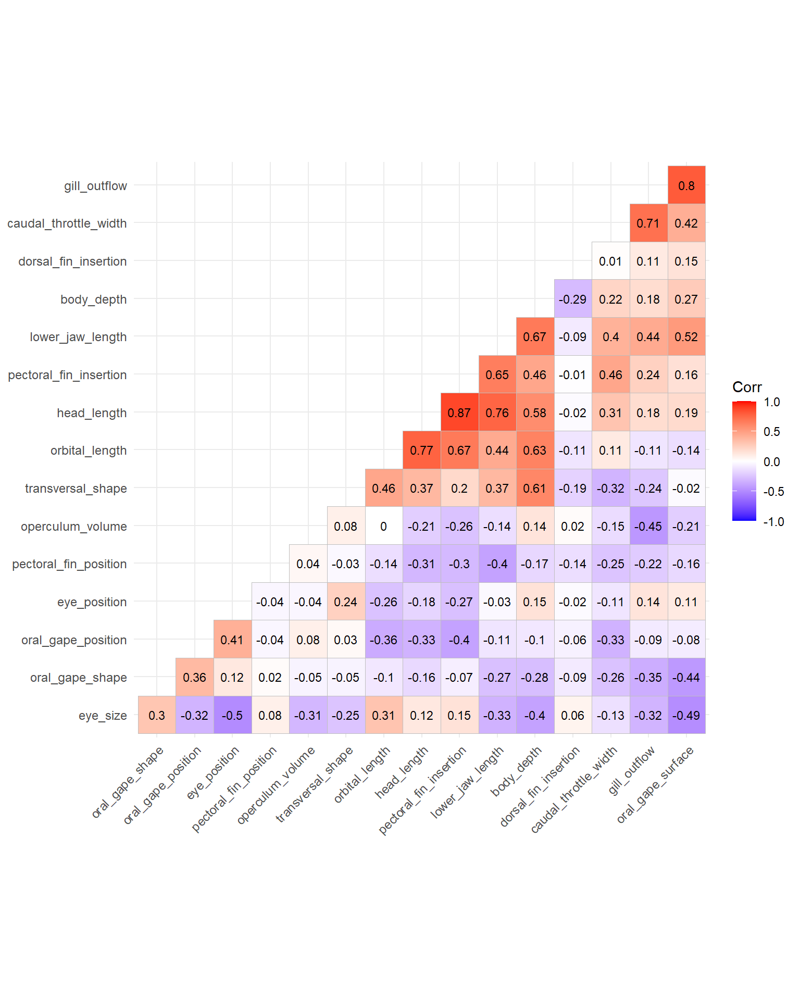{width=768}
:::
:::

::: {.cell}

```{.r .cell-code}
# list of species 
sp_names <- c(rownames(fish_traits))

# taxonomic_families
taxonomic_families <- sp_names %>%
  as.data.frame() %>%
  `colnames<-`("species") %>% 
  mutate(
    family = case_when(
      species %in%
        c(
          "Benthosema_glaciale",
          "Ceratoscopelus_maderensis",
          "Diaphus_metopoclampus",
          "Lampanyctus_ater",
          "Lampanyctus_crocodilus",
          "Lampanyctus_macdonaldi",
          "Lobianchia_gemellarii",
          "Myctophum_punctatum",
          "Notoscopelus_bolini",
          "Notoscopelus_kroyeri",
          "Bolinichthys_supralateralis"
        ) ~ "Myctophidae",
      species %in% c(
        "Borostomias_antarcticus",
        "Chauliodus_sloani",
        "Malacosteus_niger",
        "Melanostomias_bartonbeani",
        "Stomias_boa"
      ) ~ "Stomiidae",
      species %in% c(
        "Holtbyrnia_anomala",
        "Holtbyrnia_macrops",
        "Maulisia_argipalla",
        "Maulisia_mauli",
        "Maulisia_microlepis",
        "Normichthys_operosus",
        "Searsia_koefoedi",
        "Sagamichthys_schnakenbecki"
      ) ~ "Platytroctidae",
      species %in% c("Sigmops_bathyphilus",
                     "Gonostoma_elongatum") ~ "Gonostomatidae",
      species %in% c(
        "Argyropelecus_hemigymnus",
        "Maurolicus_muelleri",
        "Argyropelecus_olfersii"
      ) ~ "Sternoptychidae",
      species == "Anoplogaster_cornuta" ~ "Anoplogastridae",
      species %in% c("Arctozenus_risso", "Paralepis_coregonoides") ~ "Paralepididae",
      species == "Bathylagus_euryops" ~ "Bathylagidae",
      species == "Cyclothone" ~ "Gonostomatidae",
      species == "Derichthys_serpentinus" ~ "Derichthyidae",
      species == "Eurypharynx_pelecanoides" ~ "Eurypharyngidae",
      species == "Evermannella_balbo" ~ "Evermannellidae",
      species == "Lestidiops_sphyrenoides" ~ "Lestidiidae",
      species == "Melanostigma_atlanticum" ~ "Zoarcidae",
      species %in% c("Photostylus_pycnopterus",
                     "Xenodermichthys_copei") ~ "Alepocephalidae",
      species == "Serrivomer_beanii" ~ "Serrivomeridae"
    )
  )%>% 
  mutate(
    order = case_when(
      family =="Myctophidae" ~ "Myctophiformes",
      family %in% c("Stomiidae","Gonostomatidae", "Sternoptychidae") ~  "Stomiiformes",
      family %in% c("Platytroctidae","Alepocephalidae") ~ "Alepocephaliformes",
      family == "Anoplogastridae" ~ "Trachichthyiformes",
      family %in% c("Paralepididae","Evermannellidae","Lestidiidae") ~ "Aulopiformes",
      family ==  "Bathylagidae" ~ "Argentiniformes",
      family %in% c("Derichthyidae","Serrivomeridae") ~ "Anguilliformes",
      family ==  "Eurypharyngidae" ~"Saccopharyngiformes",
      family == "Zoarcidae" ~ "Perciformes",
    )
  )
```
:::


## 1.3. Species * assemblages matrix

__Number of trawl hauls per depth__

+ Epipelagic = 8 
+ Upper mesopelagic = 26 
+ Lower mesopelagic = 16 
+ Bathypelagic = 16 

::: {.cell}

```{.r .cell-code}
# Metadata
metadata <-  utils::read.csv(here::here("data", "metadata.csv"), sep = ";", header = T, dec = ".")%>%
  # calculation of standardized biomass values (vertical  trawl opening * horizontal trawl opening * distance traveled)  
  mutate(volume_filtered = 24*58*distance)

ggplot(metadata, aes(x=depth))  +
  ylab ("Number of trawls")+
  xlab("Immersion depth (m)")+
  geom_histogram(binwidth=100, col="white", fill=alpha("black",0.55))+
  theme_light()+
  coord_flip()+ 
  scale_x_reverse()+
  labs(fill= "")+
  guides(fill="none")+
  scale_y_continuous(breaks = c(2,4,6,8,10,12))+
  theme(axis.text.x= element_text(size=12),
        axis.text.y= element_text(size=12),
        axis.title.y = element_text( size=12),
        axis.ticks = element_blank())
```

::: {.cell-output-display}
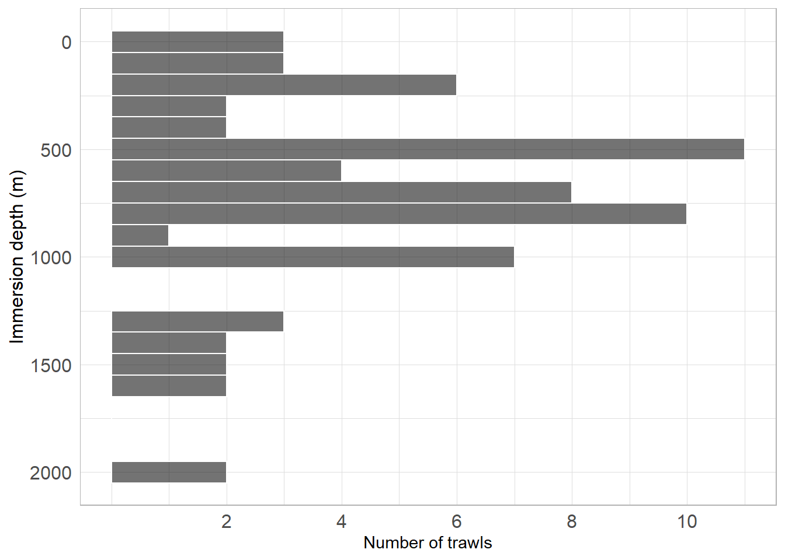{width=672}
:::
:::


__Biomass data__

::: {.cell}

:::

::: {.cell}

```{.r .cell-code}
biomass_sum <- depth_fish_biomass %>%
  as.data.frame() %>%
  tibble::rownames_to_column(var = "depth_layer") %>%
  tidyr::pivot_longer(!depth_layer, names_to = "species", values_to = "biomass") %>%
  group_by(depth_layer) %>%
  filter(biomass > 0) %>%
  summarise(biomass_depth = round(sum(biomass), 3),
            n = n())

htmltools::tagList(DT::datatable(biomass_sum))
```

::: {.cell-output-display}

```{=html}
<div class="datatables html-widget html-fill-item" id="htmlwidget-92a04c1631d203e30dd2" style="width:100%;height:auto;"></div>
<script type="application/json" data-for="htmlwidget-92a04c1631d203e30dd2">{"x":{"filter":"none","vertical":false,"data":[["1","2","3","4"],["Bathypelagic","Epipelagic","Lower mesopelagic","Upper mesopelagic"],[7.489,0.5649999999999999,4.768,4.549],[41,24,32,28]],"container":"<table class=\"display\">\n  <thead>\n    <tr>\n      <th> <\/th>\n      <th>depth_layer<\/th>\n      <th>biomass_depth<\/th>\n      <th>n<\/th>\n    <\/tr>\n  <\/thead>\n<\/table>","options":{"columnDefs":[{"className":"dt-right","targets":[2,3]},{"orderable":false,"targets":0},{"name":" ","targets":0},{"name":"depth_layer","targets":1},{"name":"biomass_depth","targets":2},{"name":"n","targets":3}],"order":[],"autoWidth":false,"orderClasses":false}},"evals":[],"jsHooks":[]}</script>
```

:::
:::


## 1.4. Traits types

The **first column** contains **traits name**. The **second column** contains
**traits type** following this code:

* **N**: nominal trait (factor variable)
* **O**: ordinal traits (ordered variable)
* **Q**: quantitative traits (numeric values)


::: {.cell}

```{.r .cell-code}
fish_traits_cat <- utils::read.csv(here::here("data", "fish_traits_cat.csv"), sep = ";", header = T, dec = ".") 
htmltools::tagList(DT::datatable(fish_traits_cat))
```

::: {.cell-output-display}

```{=html}
<div class="datatables html-widget html-fill-item" id="htmlwidget-5696955e4eee303ddf2b" style="width:100%;height:auto;"></div>
<script type="application/json" data-for="htmlwidget-5696955e4eee303ddf2b">{"x":{"filter":"none","vertical":false,"data":[["1","2","3","4","5","6","7","8","9","10","11","12","13","14","15","16","17","18","19","20","21","22","23","24","25","26"],["eye_size","orbital_length","gill_outflow","oral_gape_surface","oral_gape_shape","oral_gape_position","lower_jaw_length","head_length","body_depth","pectoral_fin_position","pectoral_fin_insertion","transversal_shape","caudal_throttle_width","dorsal_fin_insertion","eye_position","operculum_volume","ventral_photophores","gland_head","chin_barbel","small_teeth","large_teeth","fang_teeth","retractable_teeth","internal_teeth","gill_raker_types","oral_gape_axis"],["Q","Q","Q","Q","Q","Q","Q","Q","Q","Q","Q","Q","Q","Q","Q","Q","N","N","N","N","N","N","N","N","O","O"]],"container":"<table class=\"display\">\n  <thead>\n    <tr>\n      <th> <\/th>\n      <th>trait_name<\/th>\n      <th>trait_type<\/th>\n    <\/tr>\n  <\/thead>\n<\/table>","options":{"columnDefs":[{"orderable":false,"targets":0},{"name":" ","targets":0},{"name":"trait_name","targets":1},{"name":"trait_type","targets":2}],"order":[],"autoWidth":false,"orderClasses":false}},"evals":[],"jsHooks":[]}</script>
```

:::
:::


# 2.Functional spaces

## 2.1 Compute data summaries  


::: {.cell}

```{.r .cell-code}
## Summary of the assemblages * species data.frame ----
asb_sp_fish_summ <- mFD::asb.sp.summary(asb_sp_w = depth_fish_biomass)
asb_sp_fish_occ  <- asb_sp_fish_summ$"asb_sp_occ"

htmltools::tagList(DT::datatable(asb_sp_fish_occ))
```

::: {.cell-output-display}

```{=html}
<div class="datatables html-widget html-fill-item" id="htmlwidget-7d8c05e33d5d362bc96e" style="width:100%;height:auto;"></div>
<script type="application/json" data-for="htmlwidget-7d8c05e33d5d362bc96e">{"x":{"filter":"none","vertical":false,"data":[["Upper mesopelagic","Bathypelagic","Epipelagic","Lower mesopelagic"],[0,1,0,0],[1,1,1,1],[1,1,1,1],[1,1,1,1],[0,1,0,0],[1,1,1,1],[0,1,0,1],[1,1,1,1],[1,1,1,1],[1,1,1,1],[1,1,1,1],[1,1,0,1],[0,1,0,1],[1,1,0,1],[0,1,0,1],[0,1,0,0],[1,1,0,1],[1,1,1,1],[0,1,0,0],[1,1,1,1],[1,1,1,1],[1,1,0,0],[0,1,0,1],[1,1,0,1],[0,1,0,0],[1,1,1,1],[1,1,1,1],[1,1,1,1],[1,1,1,1],[1,1,1,1],[0,1,0,0],[1,1,1,1],[1,1,1,1],[0,1,0,0],[1,1,0,1],[1,1,1,1],[1,1,1,1],[0,1,1,0],[1,1,1,1],[1,1,1,1],[0,1,1,1]],"container":"<table class=\"display\">\n  <thead>\n    <tr>\n      <th> <\/th>\n      <th>Anoplogaster_cornuta<\/th>\n      <th>Arctozenus_risso<\/th>\n      <th>Argyropelecus_hemigymnus<\/th>\n      <th>Argyropelecus_olfersii<\/th>\n      <th>Bathylagus_euryops<\/th>\n      <th>Benthosema_glaciale<\/th>\n      <th>Bolinichthys_supralateralis<\/th>\n      <th>Borostomias_antarcticus<\/th>\n      <th>Ceratoscopelus_maderensis<\/th>\n      <th>Chauliodus_sloani<\/th>\n      <th>Cyclothone<\/th>\n      <th>Derichthys_serpentinus<\/th>\n      <th>Diaphus_metopoclampus<\/th>\n      <th>Evermannella_balbo<\/th>\n      <th>Gonostoma_elongatum<\/th>\n      <th>Holtbyrnia_anomala<\/th>\n      <th>Holtbyrnia_macrops<\/th>\n      <th>Lampanyctus_crocodilus<\/th>\n      <th>Lampanyctus_macdonaldi<\/th>\n      <th>Lestidiops_sphyrenoides<\/th>\n      <th>Lobianchia_gemellarii<\/th>\n      <th>Malacosteus_niger<\/th>\n      <th>Maulisia_argipalla<\/th>\n      <th>Maulisia_mauli<\/th>\n      <th>Maulisia_microlepis<\/th>\n      <th>Maurolicus_muelleri<\/th>\n      <th>Melanostigma_atlanticum<\/th>\n      <th>Melanostomias_bartonbeani<\/th>\n      <th>Myctophum_punctatum<\/th>\n      <th>Lampanyctus_ater<\/th>\n      <th>Normichthys_operosus<\/th>\n      <th>Notoscopelus_kroyeri<\/th>\n      <th>Paralepis_coregonoides<\/th>\n      <th>Photostylus_pycnopterus<\/th>\n      <th>Sagamichthys_schnakenbecki<\/th>\n      <th>Searsia_koefoedi<\/th>\n      <th>Serrivomer_beanii<\/th>\n      <th>Sigmops_bathyphilus<\/th>\n      <th>Stomias_boa<\/th>\n      <th>Xenodermichthys_copei<\/th>\n      <th>Notoscopelus_bolini<\/th>\n    <\/tr>\n  <\/thead>\n<\/table>","options":{"columnDefs":[{"className":"dt-right","targets":[1,2,3,4,5,6,7,8,9,10,11,12,13,14,15,16,17,18,19,20,21,22,23,24,25,26,27,28,29,30,31,32,33,34,35,36,37,38,39,40,41]},{"orderable":false,"targets":0},{"name":" ","targets":0},{"name":"Anoplogaster_cornuta","targets":1},{"name":"Arctozenus_risso","targets":2},{"name":"Argyropelecus_hemigymnus","targets":3},{"name":"Argyropelecus_olfersii","targets":4},{"name":"Bathylagus_euryops","targets":5},{"name":"Benthosema_glaciale","targets":6},{"name":"Bolinichthys_supralateralis","targets":7},{"name":"Borostomias_antarcticus","targets":8},{"name":"Ceratoscopelus_maderensis","targets":9},{"name":"Chauliodus_sloani","targets":10},{"name":"Cyclothone","targets":11},{"name":"Derichthys_serpentinus","targets":12},{"name":"Diaphus_metopoclampus","targets":13},{"name":"Evermannella_balbo","targets":14},{"name":"Gonostoma_elongatum","targets":15},{"name":"Holtbyrnia_anomala","targets":16},{"name":"Holtbyrnia_macrops","targets":17},{"name":"Lampanyctus_crocodilus","targets":18},{"name":"Lampanyctus_macdonaldi","targets":19},{"name":"Lestidiops_sphyrenoides","targets":20},{"name":"Lobianchia_gemellarii","targets":21},{"name":"Malacosteus_niger","targets":22},{"name":"Maulisia_argipalla","targets":23},{"name":"Maulisia_mauli","targets":24},{"name":"Maulisia_microlepis","targets":25},{"name":"Maurolicus_muelleri","targets":26},{"name":"Melanostigma_atlanticum","targets":27},{"name":"Melanostomias_bartonbeani","targets":28},{"name":"Myctophum_punctatum","targets":29},{"name":"Lampanyctus_ater","targets":30},{"name":"Normichthys_operosus","targets":31},{"name":"Notoscopelus_kroyeri","targets":32},{"name":"Paralepis_coregonoides","targets":33},{"name":"Photostylus_pycnopterus","targets":34},{"name":"Sagamichthys_schnakenbecki","targets":35},{"name":"Searsia_koefoedi","targets":36},{"name":"Serrivomer_beanii","targets":37},{"name":"Sigmops_bathyphilus","targets":38},{"name":"Stomias_boa","targets":39},{"name":"Xenodermichthys_copei","targets":40},{"name":"Notoscopelus_bolini","targets":41}],"order":[],"autoWidth":false,"orderClasses":false}},"evals":[],"jsHooks":[]}</script>
```

:::
:::


## 2.2 Computing distances between species based on functional traits
- We have non-continuous traits so we use the __Gower distance__ _(metric = "gower")_ as this method allows traits weighting.
- __scale_euclid__ = TRUE

::: {.cell}

```{.r .cell-code}
sp_dist_fish <- mFD::funct.dist(
  sp_tr         = fish_traits,
  tr_cat        = fish_traits_cat,
  metric        = "gower",
  scale_euclid  = "scale_center",
  ordinal_var   = "classic",
  weight_type   = "equal",
  stop_if_NA    = TRUE)
```
:::


## 2.3 Building functional spaces and chosing the best one
### 2.3.1 Computing several multimensional functional spaces and assessing their quality

- mFD evaluates the quality of PCoA-based multidimensional spaces according to the deviation between trait-based distances and distances in the functional space (extension of Maire et al. (2015) framework). 


::: {.cell}

```{.r .cell-code}
fspaces_quality_fish <- mFD::quality.fspaces(
  sp_dist             = sp_dist_fish,
  maxdim_pcoa         = 10,
  deviation_weighting = "absolute",
  fdist_scaling       = FALSE,
  fdendro             = "average")

## Quality metrics of functional spaces ----
round(fspaces_quality_fish$"quality_fspaces", 3)
```

::: {.cell-output .cell-output-stdout}
```
               mad
pcoa_1d      0.143
pcoa_2d      0.079
pcoa_3d      0.050
pcoa_4d      0.030
pcoa_5d      0.023
pcoa_6d      0.017
pcoa_7d      0.014
pcoa_8d      0.015
pcoa_9d      0.017
pcoa_10d     0.019
tree_average 0.040
```
:::
:::


__Variance explained by each axis__

::: {.cell}

```{.r .cell-code}
# Extract eigenvalues information
eigenvalues_info <- fspaces_quality_fish$"details_fspaces"$"pc_eigenvalues"

# Create a dataframe to store the results
variance_df <- data.frame(
  PC = c("PC1", "PC2", "PC3", "PC4"),
  VarianceExplained = c(
    eigenvalues_info[1, "Cum_corr_eig"] * 100,
    (eigenvalues_info[2, "Cum_corr_eig"] - eigenvalues_info[1, "Cum_corr_eig"]) * 100,
    (eigenvalues_info[3, "Cum_corr_eig"] - eigenvalues_info[2, "Cum_corr_eig"]) * 100,
    (eigenvalues_info[4, "Cum_corr_eig"] - eigenvalues_info[3, "Cum_corr_eig"]) * 100
  )
) %>% 
  mutate(across(where(is.numeric), round, 2))

htmltools::tagList(DT::datatable(variance_df))
```

::: {.cell-output-display}

```{=html}
<div class="datatables html-widget html-fill-item" id="htmlwidget-ed19af33525acbbe1dbe" style="width:100%;height:auto;"></div>
<script type="application/json" data-for="htmlwidget-ed19af33525acbbe1dbe">{"x":{"filter":"none","vertical":false,"data":[["1","2","3","4"],["PC1","PC2","PC3","PC4"],[15.8,12.26,7.93,7.14]],"container":"<table class=\"display\">\n  <thead>\n    <tr>\n      <th> <\/th>\n      <th>PC<\/th>\n      <th>VarianceExplained<\/th>\n    <\/tr>\n  <\/thead>\n<\/table>","options":{"columnDefs":[{"className":"dt-right","targets":2},{"orderable":false,"targets":0},{"name":" ","targets":0},{"name":"PC","targets":1},{"name":"VarianceExplained","targets":2}],"order":[],"autoWidth":false,"orderClasses":false}},"evals":[],"jsHooks":[]}</script>
```

:::
:::


### 2.3.2 Illustrating the quality of the functional spaces


::: {.cell}

```{.r .cell-code}
mFD::quality.fspaces.plot(
  fspaces_quality            = fspaces_quality_fish,
  quality_metric             = "mad",
  fspaces_plot               = c("tree_average", "pcoa_2d", "pcoa_3d", 
                                 "pcoa_4d", "pcoa_5d", "pcoa_6d"),
  name_file                  = NULL,
  range_dist                 = NULL,
  range_dev                  = NULL,
  range_qdev                 = NULL,
  gradient_deviation         = c(neg = "darkblue", nul = "grey80", pos = "darkred"),
  gradient_deviation_quality = c(low = "yellow", high = "red"),
  x_lab                      = "Trait-based distance")
```

::: {.cell-output-display}
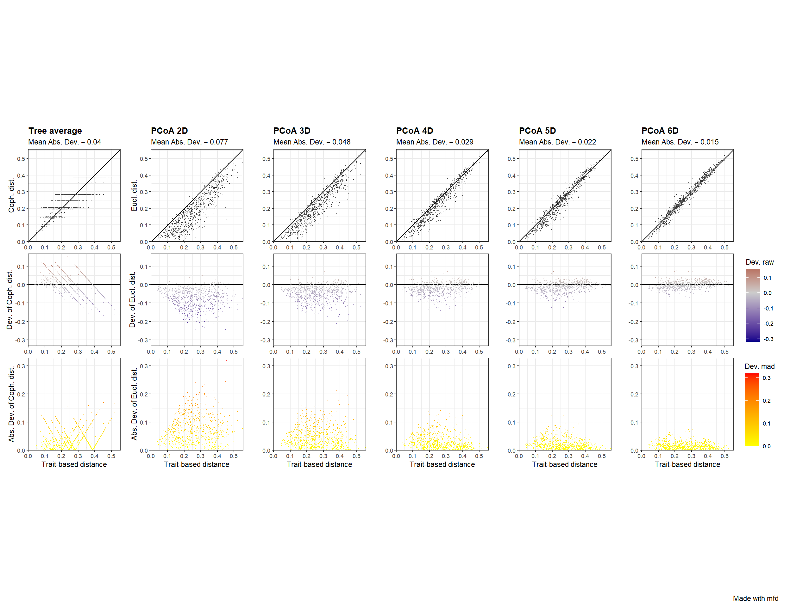{width=1248}
:::
:::


### 2.3.3 Testing the correlation between functional axes and traits

::: {.cell}

```{.r .cell-code}
sp_faxes_coord_fish <- fspaces_quality_fish$"details_fspaces"$"sp_pc_coord"

# As we have 26 traits we have to split the df to see correlation between functional axes and traits 
# first set ----
fish_traits_1 <- fish_traits%>%
  select(1:9)

fish_tr_faxes <- mFD::traits.faxes.cor(
  sp_tr          = fish_traits_1, 
  sp_faxes_coord = sp_faxes_coord_fish[ , c("PC1", "PC2", "PC3", "PC4")], 
  plot           = T)

## Print traits with significant effect ----
fish_tr_faxes$"tr_faxes_stat"[which(fish_tr_faxes$"tr_faxes_stat"$"p.value" < 0.05), ]
```

::: {.cell-output .cell-output-stdout}
```
                trait axis         test stat value p.value
1            eye_size  PC1 Linear Model   r2 0.165  0.0084
2            eye_size  PC2 Linear Model   r2 0.162  0.0091
3            eye_size  PC3 Linear Model   r2 0.134  0.0185
4            eye_size  PC4 Linear Model   r2 0.145  0.0139
5      orbital_length  PC1 Linear Model   r2 0.400  0.0000
6      orbital_length  PC2 Linear Model   r2 0.114  0.0306
10       gill_outflow  PC2 Linear Model   r2 0.509  0.0000
13  oral_gape_surface  PC1 Linear Model   r2 0.141  0.0157
14  oral_gape_surface  PC2 Linear Model   r2 0.489  0.0000
18    oral_gape_shape  PC2 Linear Model   r2 0.163  0.0089
24 oral_gape_position  PC4 Linear Model   r2 0.206  0.0029
26   lower_jaw_length  PC2 Linear Model   r2 0.692  0.0000
29        head_length  PC1 Linear Model   r2 0.316  0.0001
30        head_length  PC2 Linear Model   r2 0.398  0.0000
34         body_depth  PC2 Linear Model   r2 0.358  0.0000
35         body_depth  PC3 Linear Model   r2 0.197  0.0037
```
:::

```{.r .cell-code}
## Plot ----
fish_tr_faxes$"tr_faxes_plot"
```

::: {.cell-output-display}
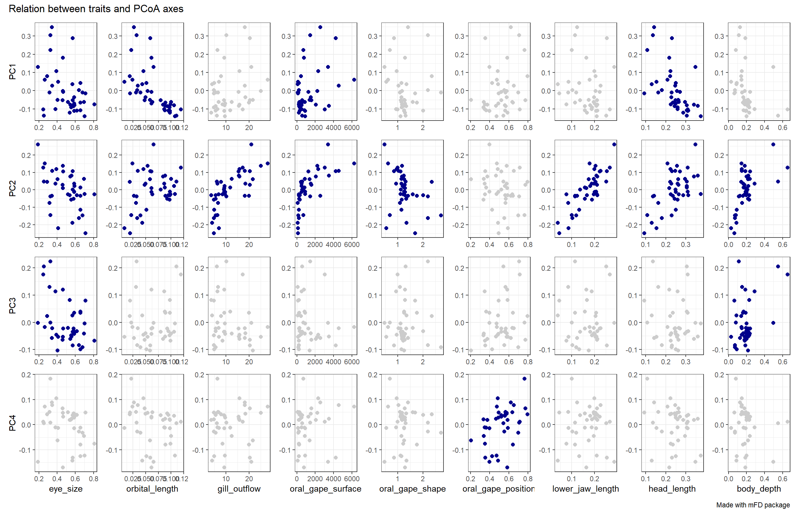{width=1344}
:::
:::

::: {.cell}

```{.r .cell-code}
# second set ----
fish_traits_2 <- fish_traits%>%
  select(10:18)

fish_tr_faxes_2 <- mFD::traits.faxes.cor(
  sp_tr          = fish_traits_2, 
  sp_faxes_coord = sp_faxes_coord_fish[ , c("PC1", "PC2", "PC3", "PC4")], 
  plot           = T)

## Print traits with significant effect ----
fish_tr_faxes_2$"tr_faxes_stat"[which(fish_tr_faxes_2$"tr_faxes_stat"$"p.value" < 0.05), ]
```

::: {.cell-output .cell-output-stdout}
```
                    trait axis           test stat value p.value
2   pectoral_fin_position  PC2   Linear Model   r2 0.260  0.0007
5  pectoral_fin_insertion  PC1   Linear Model   r2 0.273  0.0005
6  pectoral_fin_insertion  PC2   Linear Model   r2 0.409  0.0000
9       transversal_shape  PC1   Linear Model   r2 0.116  0.0294
11      transversal_shape  PC3   Linear Model   r2 0.228  0.0016
14  caudal_throttle_width  PC2   Linear Model   r2 0.403  0.0000
19   dorsal_fin_insertion  PC3   Linear Model   r2 0.174  0.0066
23           eye_position  PC3   Linear Model   r2 0.201  0.0033
26       operculum_volume  PC2   Linear Model   r2 0.126  0.0230
32    ventral_photophores  PC4 Kruskal-Wallis eta2 0.590  0.0000
33             gland_head  PC1 Kruskal-Wallis eta2 0.245  0.0011
```
:::

```{.r .cell-code}
## Plot ----
fish_tr_faxes_2$"tr_faxes_plot"
```

::: {.cell-output-display}
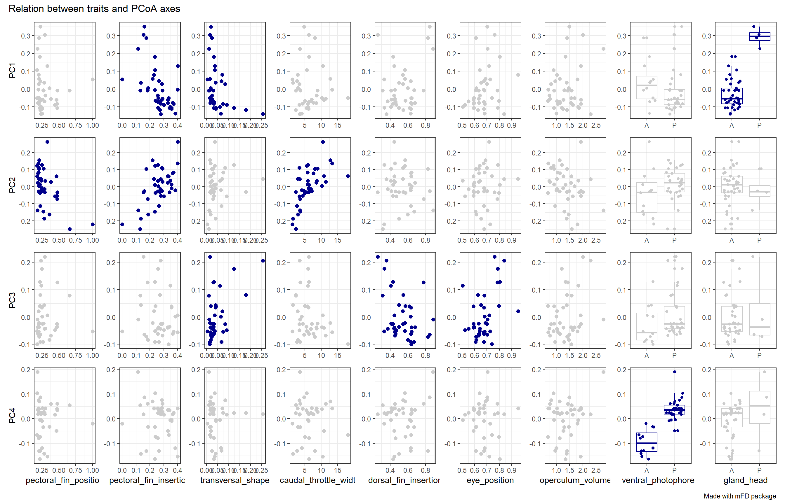{width=1344}
:::
:::

::: {.cell}

```{.r .cell-code}
# third set ----
fish_traits_3 <- fish_traits%>%
  select(19:26)

fish_tr_faxes_3 <- mFD::traits.faxes.cor(
  sp_tr          = fish_traits_3, 
  sp_faxes_coord = sp_faxes_coord_fish[ , c("PC1", "PC2", "PC3", "PC4")], 
  plot           = T)

## Print traits with significant effect ----
fish_tr_faxes_3$"tr_faxes_stat"[which(fish_tr_faxes_3$"tr_faxes_stat"$"p.value" < 0.05), ]
```

::: {.cell-output .cell-output-stdout}
```
              trait axis           test stat value p.value
1       chin_barbel  PC1 Kruskal-Wallis eta2 0.142  0.0107
4       chin_barbel  PC4 Kruskal-Wallis eta2 0.183  0.0043
5       small_teeth  PC1 Kruskal-Wallis eta2 0.323  0.0002
9       large_teeth  PC1 Kruskal-Wallis eta2 0.467  0.0000
10      large_teeth  PC2 Kruskal-Wallis eta2 0.201  0.0030
13       fang_teeth  PC1 Kruskal-Wallis eta2 0.410  0.0000
21   internal_teeth  PC1 Kruskal-Wallis eta2 0.073  0.0499
23   internal_teeth  PC3 Kruskal-Wallis eta2 0.626  0.0000
25 gill_raker_types  PC1 Kruskal-Wallis eta2 0.327  0.0007
26 gill_raker_types  PC2 Kruskal-Wallis eta2 0.369  0.0003
30   oral_gape_axis  PC2 Kruskal-Wallis eta2 0.371  0.0003
31   oral_gape_axis  PC3 Kruskal-Wallis eta2 0.224  0.0053
```
:::

```{.r .cell-code}
## Plot ----
fish_tr_faxes_3$"tr_faxes_plot"
```

::: {.cell-output-display}
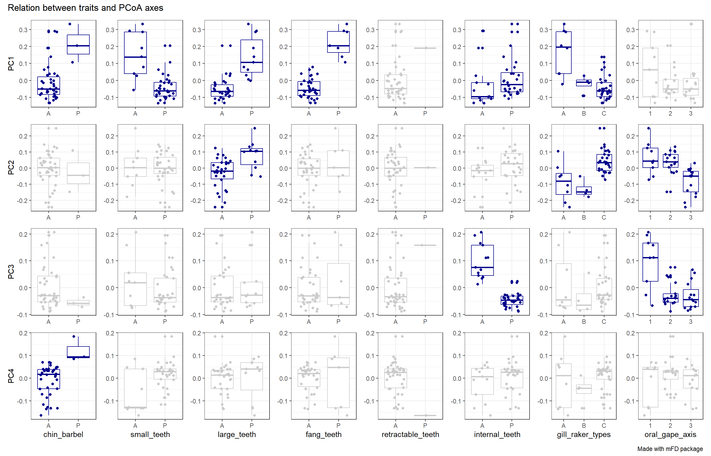{width=1344}
:::
:::


__Summary of traits with a significant effect__


::: {.cell}

```{.r .cell-code}
sp_faxes_coord_fish <- fspaces_quality_fish$"details_fspaces"$"sp_pc_coord"

fish_tr_faxes <- mFD::traits.faxes.cor(
  sp_tr          = fish_traits, 
  sp_faxes_coord = sp_faxes_coord_fish[ , c("PC1", "PC2", "PC3", "PC4")], 
  plot           = F)

## Print traits with significant effect ----
traits_effect <- fish_tr_faxes[which(fish_tr_faxes$p.value< 0.05),] %>% 
  as.data.frame() %>% 
  arrange(axis, desc(value))

htmltools::tagList(DT::datatable(traits_effect))
```

::: {.cell-output-display}

```{=html}
<div class="datatables html-widget html-fill-item" id="htmlwidget-832a481f4b0e2696fa8c" style="width:100%;height:auto;"></div>
<script type="application/json" data-for="htmlwidget-832a481f4b0e2696fa8c">{"x":{"filter":"none","vertical":false,"data":[["1","2","3","4","5","6","7","8","9","10","11","12","13","14","15","16","17","18","19","20","21","22","23","24","25","26","27","28","29","30","31","32","33","34","35","36","37","38","39"],["large_teeth","fang_teeth","orbital_length","gill_raker_types","small_teeth","head_length","pectoral_fin_insertion","gland_head","eye_size","chin_barbel","oral_gape_surface","transversal_shape","internal_teeth","lower_jaw_length","gill_outflow","oral_gape_surface","pectoral_fin_insertion","caudal_throttle_width","head_length","oral_gape_axis","gill_raker_types","body_depth","pectoral_fin_position","large_teeth","oral_gape_shape","eye_size","operculum_volume","orbital_length","internal_teeth","transversal_shape","oral_gape_axis","eye_position","body_depth","dorsal_fin_insertion","eye_size","ventral_photophores","oral_gape_position","chin_barbel","eye_size"],["PC1","PC1","PC1","PC1","PC1","PC1","PC1","PC1","PC1","PC1","PC1","PC1","PC1","PC2","PC2","PC2","PC2","PC2","PC2","PC2","PC2","PC2","PC2","PC2","PC2","PC2","PC2","PC2","PC3","PC3","PC3","PC3","PC3","PC3","PC3","PC4","PC4","PC4","PC4"],["Kruskal-Wallis","Kruskal-Wallis","Linear Model","Kruskal-Wallis","Kruskal-Wallis","Linear Model","Linear Model","Kruskal-Wallis","Linear Model","Kruskal-Wallis","Linear Model","Linear Model","Kruskal-Wallis","Linear Model","Linear Model","Linear Model","Linear Model","Linear Model","Linear Model","Kruskal-Wallis","Kruskal-Wallis","Linear Model","Linear Model","Kruskal-Wallis","Linear Model","Linear Model","Linear Model","Linear Model","Kruskal-Wallis","Linear Model","Kruskal-Wallis","Linear Model","Linear Model","Linear Model","Linear Model","Kruskal-Wallis","Linear Model","Kruskal-Wallis","Linear Model"],["eta2","eta2","r2","eta2","eta2","r2","r2","eta2","r2","eta2","r2","r2","eta2","r2","r2","r2","r2","r2","r2","eta2","eta2","r2","r2","eta2","r2","r2","r2","r2","eta2","r2","eta2","r2","r2","r2","r2","eta2","r2","eta2","r2"],[0.467,0.41,0.4,0.327,0.323,0.316,0.273,0.245,0.165,0.142,0.141,0.116,0.073,0.6919999999999999,0.509,0.489,0.409,0.403,0.398,0.371,0.369,0.358,0.26,0.201,0.163,0.162,0.126,0.114,0.626,0.228,0.224,0.201,0.197,0.174,0.134,0.59,0.206,0.183,0.145],[0,0,0,0.0007,0.0002,0.0001,0.0005,0.0011,0.008399999999999999,0.0107,0.0157,0.0294,0.0499,0,0,0,0,0,0,0.0003,0.0003,0,0.0007,0.003,0.0089,0.0091,0.023,0.0306,0,0.0016,0.0053,0.0033,0.0037,0.0066,0.0185,0,0.0029,0.0043,0.0139]],"container":"<table class=\"display\">\n  <thead>\n    <tr>\n      <th> <\/th>\n      <th>trait<\/th>\n      <th>axis<\/th>\n      <th>test<\/th>\n      <th>stat<\/th>\n      <th>value<\/th>\n      <th>p.value<\/th>\n    <\/tr>\n  <\/thead>\n<\/table>","options":{"columnDefs":[{"className":"dt-right","targets":[5,6]},{"orderable":false,"targets":0},{"name":" ","targets":0},{"name":"trait","targets":1},{"name":"axis","targets":2},{"name":"test","targets":3},{"name":"stat","targets":4},{"name":"value","targets":5},{"name":"p.value","targets":6}],"order":[],"autoWidth":false,"orderClasses":false}},"evals":[],"jsHooks":[]}</script>
```

:::
:::


## 2.4 Plotting the selected functional space and position of species

::: {.cell}

```{.r .cell-code}
# Convert sp_faxes_coord_fish to a data frame
sp_coord_community <- as.data.frame(sp_faxes_coord_fish[, c("PC1", "PC2")]) %>%
  tibble::rownames_to_column(var = "species")

# Depth_layer ----
# Transform biomass data
sp_all_layers <- depth_fish_biomass %>%
  as.data.frame() %>%
  tibble::rownames_to_column(var = "depth_layer") %>%
  tidyr::pivot_longer(!depth_layer, values_to = "biomass", names_to = "species") %>%
  filter(biomass > 0)

# Create a list to store data frames for each depth layer
all_data_layers <- lapply(unique(sp_all_layers$depth_layer), function(layer) {
  sp_layer <- sp_all_layers %>%
    filter(depth_layer == layer)
  
  # Mark presence or absence
  sp_coord_layer <- sp_coord_community %>%
    mutate(layer_presence = ifelse(species %in% sp_layer$species, "yes", "no")) %>%
    mutate(depth_layer = layer)
  
  return(sp_coord_layer)
})

# Combine all layers into one data frame
sp_coord_community_all_layers <- bind_rows(all_data_layers)

# Function to calculate the convex hull for a given data frame
calculate_hull <- function(data) {
  if (nrow(data) < 3) return(data)  # Handle cases with fewer than 3 points
  data %>%
    slice(chull(PC1, PC2))
}

# Initialize lists to store hulls
hull_all_combined <- NULL
hull_layer_combined <- NULL

for(layer in unique(sp_coord_community_all_layers$depth_layer)) {
  sp_layer <- sp_coord_community_all_layers %>%
    filter(depth_layer == layer)
  
  hull_all <- calculate_hull(sp_layer) %>%
    mutate(depth_layer = layer, type = "all")
  
  hull_layer <- calculate_hull(sp_layer %>% filter(layer_presence == "yes")) %>%
    mutate(depth_layer = layer, type = "present")
  
  hull_all_combined <- bind_rows(hull_all_combined, hull_all)
  hull_layer_combined <- bind_rows(hull_layer_combined, hull_layer)
}

# Define depth layer levels in desired order
depth_levels <- c("Epipelagic", "Upper mesopelagic", "Lower mesopelagic", "Bathypelagic")

# Ensure depth_layer is a factor with specified levels
sp_coord_community_all_layers$depth_layer <- factor(sp_coord_community_all_layers$depth_layer, levels = depth_levels)
hull_all_combined$depth_layer <- factor(hull_all_combined$depth_layer, levels = depth_levels)
hull_layer_combined$depth_layer <- factor(hull_layer_combined$depth_layer, levels = depth_levels)

# Define colors for each depth layer
depth_colors <- c("Epipelagic" = "#FEA520", 
                  "Upper mesopelagic" = "#D62246", 
                  "Lower mesopelagic" = "#6255B4", 
                  "Bathypelagic" = "#3C685A")

# Plotting
plot_depth <- ggplot() +
  # Plot present species
  geom_point(data = sp_coord_community_all_layers %>% filter(layer_presence == "yes"), 
             aes(PC1, PC2, col = depth_layer), size = 2, shape=19) +
  # Plot absent species
  geom_point(data = sp_coord_community_all_layers %>% filter(layer_presence == "no"), 
             aes(PC1, PC2), col = "grey", shape = 8, size = 2) +
  # Plot hulls
  geom_polygon(data = hull_all_combined, aes(x = PC1, y = PC2), 
               fill = "lightgrey", alpha = 0.2) +
  geom_polygon(data = hull_layer_combined, aes(x = PC1, y = PC2, group = depth_layer, fill = depth_layer), 
               alpha = 0.3) +
  theme_light() +
  scale_color_manual(values = depth_colors) +
  scale_fill_manual(values = depth_colors) +
  guides(col = "none", shape = "none", fill = "none") +
  facet_wrap(~ depth_layer, nrow=1 ) +  
  theme(
    strip.text.x = element_text(size = 14, color = "gray20"),
    strip.background = element_rect(fill = "white"),
    aspect.ratio = 1,
    legend.title = element_text(size = 12),
    legend.text = element_text(size = 12),
    panel.grid.minor = element_blank(),
    panel.grid.major = element_blank()
  )


beta_fd_indices_fish <- mFD::beta.fd.multidim(
  sp_faxes_coord   = sp_faxes_coord_fish[ , c("PC1", "PC2", "PC3", "PC4")],
  asb_sp_occ       = asb_sp_fish_occ,
  check_input      = TRUE,
  beta_family      = c("Jaccard"),
  details_returned = T)
```

::: {.cell-output .cell-output-stdout}
```
Serial computing of convex hulls shaping assemblages with conv1

  |                                                                            
  |                                                                      |   0%
  |                                                                            
  |==================                                                    |  25%
  |                                                                            
  |===================================                                   |  50%
  |                                                                            
  |====================================================                  |  75%
  |                                                                            
  |======================================================================| 100%
Serial computing of intersections between pairs of assemblages with inter_geom_coord

  |                                                                            
  |                                                                      |   0%
  |                                                                            
  |============                                                          |  17%
  |                                                                            
  |=======================                                               |  33%
  |                                                                            
  |===================================                                   |  50%
  |                                                                            
  |===============================================                       |  67%
  |                                                                            
  |==========================================================            |  83%
  |                                                                            
  |======================================================================| 100%
```
:::

```{.r .cell-code}
vertices_community <-beta_fd_indices_fish$"details"$"asb_vertices"$Bathypelagic 

sp_coord_community <- as.data.frame(sp_faxes_coord_fish[, 1:2]) %>% 
  tibble::rownames_to_column(var = "species") %>% 
  mutate(vertices=case_when(species%in%vertices_community~"vertice",
                            !species%in%vertices_community~"not_vertice")) 

hull <- sp_coord_community%>% 
  slice(chull(PC1, PC2))

plot_com <- ggplot(data = sp_coord_community,aes(PC1, PC2)) +
  scale_color_manual(values = c("grey", "black"))+
  geom_point(size = 2.5, alpha=0.8, aes( shape=vertices, col= vertices)) +
  geom_polygon(data=hull, aes(x = PC1, y = PC2), 
               fill = "lightgrey", alpha = 0.2) +
  theme_light() +
  geom_hline(yintercept = 0, linetype = 2, col = "gray45") +
  geom_vline(xintercept = 0, linetype = 2, col = "gray45") +
  guides(col = "none", shape = "none", fill = "none") +
  theme(
    strip.text.x = element_text(size = 14, color = "gray20"),
    strip.background = element_rect(fill = "white"),
    aspect.ratio = 1,
    legend.title = element_text(size = 12),
    legend.text = element_text(size = 12),
    panel.grid.minor = element_blank(),
    panel.grid.major = element_blank()
  )

ggpubr::ggarrange(
  labels = c("A","B"),
  plot_com,   
  plot_depth, 
  nrow = 2
) 
```

::: {.cell-output-display}
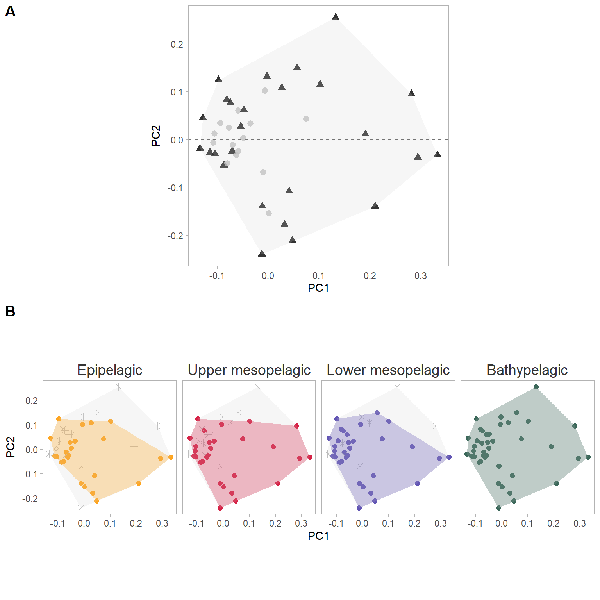{width=768}
:::

```{.r .cell-code}
ggsave("functional_space.png", path = "figures", dpi = 800, height = 8, width = 10)
```
:::


# 3. SES Functional diversity indices 

- __Standard Effect Size (SES):__ to eliminate the influence of species richness on the functional diversity indices (Mouchet et al., 2010). Measures the deviation from the random expectation in standard deviation units

- __null model frequency__: Randomize community data matrix abundances (here biomasss) within species (maintains species occurrence frequency)

- __FRic Functional Richness__: the proportion of functional space filled by species of the studied assemblage, i.e. the volume inside the convex-hull shaping species. To compute FRic the number of species must be at least higher than the number of functional axis + 1.

- __FDis Functional Dispersion__: the biomass weighted deviation of species traits values from the center of the functional space filled by the assemblage i.e. the biomass-weighted mean distance to the biomass-weighted mean trait values of the assemblage.

- __FDiv Functional Divergence__: the proportion of the biomass supported by the species with the most extreme functional traits i.e. the ones located close to the edge of the convex-hull filled by the assemblage.

- __FEve Functional Evenness__: the regularity of biomass distribution in the functional space using the Minimum Spanning Tree linking all species present in the assemblage.


::: {.cell}

```{.r .cell-code}
# by depth
station_sp <-
  rbind(data_biomass_2002_2019, data_biomass_2021_2022) %>%
  as.data.frame() %>%
  left_join(metadata) %>%
  select(species, biomass_sp, volume_filtered, station) %>%
  # Divide biomass by the volume filtered at each trawl (g.m3)
  mutate(biomass_cpu = (biomass_sp / volume_filtered) * 1000) %>%
  select(species, biomass_cpu, station) %>%
  replace(is.na(.), 0) %>%
  group_by(species, station) %>%
  mutate(biomass = sum(biomass_cpu)) %>%
  select(-biomass_cpu) %>%
  distinct() %>%
  tidyr::pivot_wider(names_from = species, values_from = biomass) %>%
  replace(is.na(.), 0) %>%
  arrange(station) %>%
  filter(!station %in% c("H0411", "L0731", "L0736")) %>%
  tibble::column_to_rownames(var = "station") %>%
  select(order(colnames(.))) %>%
  as.matrix()

# if we want only presence-absence
#station_sp <- replace(station_sp, station_sp > 0, 1)

# Calculate functional diversity for the observed data ----
obsFD <- mFD::alpha.fd.multidim(
  sp_faxes_coord = sp_faxes_coord_fish[, c("PC1", "PC2", "PC3", "PC4")],
  asb_sp_w = station_sp,
  scaling = TRUE,
  check_input = TRUE,
  details_returned = F
)

obsFD_div <- obsFD$functional_diversity_indices

# Null model ----
# Define the number of replications
nb_rep <- 100

# Initialize a list to store results of random functional diversity calculations for each index
indices_names <- colnames(obsFD_div)
resultsRandomFD <- list()

for (index_name in indices_names) {
  resultsRandomFD[[index_name]] <- matrix(
    NA,
    nrow = nrow(station_sp),
    ncol = nb_rep,
    dimnames = list(rownames(station_sp), paste0("Sim.", 1:nb_rep))
  )
}

# Perform randomization and calculate functional diversity for each replication
for (rep in 1:nb_rep) {
  randomize_mx <- picante::randomizeMatrix(samp = station_sp,
                                           null.model = "frequency",
                                           iterations = 1)
  
  simFD_cal <- mFD::alpha.fd.multidim(
    sp_faxes_coord = sp_faxes_coord_fish[, c("PC1", "PC2", "PC3", "PC4")],
    asb_sp_w = randomize_mx,
    scaling = TRUE,
    check_input = TRUE,
    details_returned = F
  )
  
  simFD_div <- simFD_cal$functional_diversity_indices
  
  for (index_name in indices_names) {
    simFD_index <- simFD_div[, index_name]
    
    # Ensure that simFD_index has the same length as the number of rows in station_sp
    if (length(simFD_index) == nrow(station_sp)) {
      resultsRandomFD[[index_name]][, rep] <- simFD_index
    } else {
      stop(
        paste(
          "The length of",
          index_name,
          "does not match the number of rows in station_sp"
        )
      )
    }
  }
}

# Initialize dataframes to store mean, standard deviation, effect size, and standardized effect size
meanNullFD <-
  data.frame(matrix(
    NA,
    nrow = nrow(station_sp),
    ncol = length(indices_names)
  ))
sdNullFD <-
  data.frame(matrix(
    NA,
    nrow = nrow(station_sp),
    ncol = length(indices_names)
  ))
ES_FD <-
  data.frame(matrix(
    NA,
    nrow = nrow(station_sp),
    ncol = length(indices_names)
  ))
SES_FD <-
  data.frame(matrix(
    NA,
    nrow = nrow(station_sp),
    ncol = length(indices_names)
  ))

# Set column names for the dataframes
colnames(meanNullFD) <- indices_names
colnames(sdNullFD) <- indices_names
colnames(ES_FD) <- indices_names
colnames(SES_FD) <- indices_names

# Calculate statistics for each index
for (index_name in indices_names) {
  # Calculate mean and standard deviation of null model FD values for each index
  meanNullFD[, index_name] <-
    rowMeans(resultsRandomFD[[index_name]], na.rm = TRUE)
  sdNullFD[, index_name] <-
    apply(resultsRandomFD[[index_name]], 1, sd, na.rm = TRUE)
  
  # Calculate effect size and standardized effect size for each index
  ES_FD[, index_name] <-
    obsFD_div[, index_name] - meanNullFD[, index_name]
  SES_FD[, index_name] <-
    ES_FD[, index_name] / sdNullFD[, index_name]
}

# Combine all results into a single dataframe
results_df <- cbind(
  obsFD_div,
  meanNullFD = meanNullFD,
  sdNullFD = sdNullFD,
  ES_FD = ES_FD,
  SES_FD = SES_FD
)

# Add row names
rownames(results_df) <- rownames(station_sp)

# Plot  ----
# Output the results dataframe
results_df_plot <- results_df %>%
  tibble::rownames_to_column(var = "station") %>%
  inner_join(metadata %>% select(station, depth), by = "station") %>%
  mutate(
    depth_layer = case_when(
      between(depth, 0, 174) ~ "Epipelagic",
      between(depth, 175, 699) ~ "Upper mesopelagic",
      between(depth, 700, 999) ~ "Lower mesopelagic",
      between(depth, 1000, 2000) ~ "Bathypelagic"
    )
  ) %>%
  select(-station) %>%
  tidyr::pivot_longer(!c(depth, depth_layer),
                      values_to = "values",
                      names_to = "indice") %>%
  mutate(indice = stringr::str_replace(indice, "^SES_", "")) %>%
  filter(indice %in% c("FD.fric",
                       "FD.fdis",
                       "FD.feve",
                       "FD.fdiv"))

results_df_plot$depth_layer <- factor(
  results_df_plot$depth_layer,
  levels = c(
    "Epipelagic",
    "Upper mesopelagic",
    "Lower mesopelagic",
    "Bathypelagic"
  )
)
results_df_plot$indice <- factor(
  results_df_plot$indice,
  levels = c("FD.fric",
             "FD.fdis",
             "FD.fdiv",
             "FD.feve"),
  labels = c(
    "Functional richness",
    "Functional dispersion",
    "Functional divergence",
    "Functional evenness"
  )
)

ggplot(results_df_plot, aes(x = depth_layer, y = values, fill = depth_layer)) +
  facet_wrap(~indice, scales = "free") +
  geom_point(alpha = 0.5, size = 1, position = position_jitter(width = 0.2), aes(col=depth_layer)) +
  geom_boxplot(alpha = 0.1, outlier.shape = NA, width = 0.5, aes(col=depth_layer, fill=depth_layer))+
  scale_color_manual(values = c("#FEA520", "#D62246", "#6255B4", "#3C685A")) +
  scale_fill_manual(values = c("#FEA520", "#D62246", "#6255B4", "#3C685A")) +
  labs(
    x = "",
    y = "Standard Effect Size (SES)") +
  theme_light() +
  theme(axis.text.x = element_blank(),
        strip.text.x = element_text(size = 14, color = "black"),
        strip.background = element_rect(fill = "white"),
        axis.title = element_text(size = 13),
        axis.text = element_text(size = 13))+
  geom_hline(yintercept = 1.96, linetype = "dashed", color = "gray50", linewidth = 0.8)+
  geom_hline(yintercept = -1.96, linetype = "dashed", color = "gray50", linewidth = 0.8)+
  guides(col="none", fill="none")
```

::: {.cell-output-display}
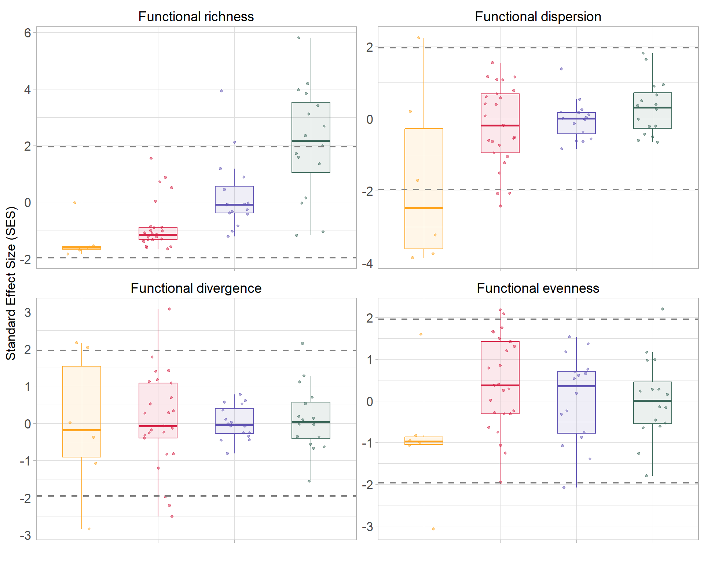{width=960}
:::

```{.r .cell-code}
ggsave("SES_indices_1000.png", path = "figures", dpi = 700, height = 7, width = 9)
```
:::


# 4. CWM 

## 4.1. CWM booststrap by depth layer 

- each trawl is a replica 

- non parametric Bootstrap 


::: {.cell}

```{.r .cell-code}
# Trait 
trait_boot <- morpho_data%>% 
  inner_join(metadata) %>% 
  select(-c(individual_code, years, longitude_start,
            latitude_start, longitude_end, longitude_end,
            volume_filtered, distance)) %>% 
  mutate(
    eye_size = eye_diameter / head_depth,
    orbital_length = eye_diameter / standard_length,
    oral_gape_surface = mouth_width * mouth_depth / body_width * body_depth,
    oral_gape_shape = mouth_depth / mouth_width,
    oral_gape_position = distance_upper_jaws_bottom_head / head_depth,
    lower_jaw_length = lower_jaw_length / standard_length,
    head_length = head_length / standard_length,
    body_depth = body_depth / standard_length,
    pectoral_fin_position = distance_pectoral_bottom_body / body_depth_pectoral_insertion,
    pectoral_fin_insertion = prepectoral_length / standard_length,
    transversal_shape = body_depth / body_width,
    dorsal_fin_insertion = predorsal_length / standard_length,
    eye_position = eye_height / head_depth,
    operculum_volume = operculum_depth / operculum_width,
    gill_outflow = operculum_width,
    caudal_throttle_width = caudal_peduncle_min_depth
  ) %>%
  select(
    depth,
    species,
    eye_size,
    orbital_length,
    gill_outflow,
    oral_gape_surface,
    oral_gape_shape,
    oral_gape_position,
    lower_jaw_length,
    head_length,
    body_depth,
    pectoral_fin_position,
    pectoral_fin_insertion,
    transversal_shape,
    caudal_throttle_width,
    dorsal_fin_insertion,
    eye_position,
    operculum_volume,
    ventral_photophores, 
    gland_head,
    chin_barbel, 
    small_teeth, 
    large_teeth, 
    fang_teeth, 
    retractable_teeth, 
    internal_teeth
  ) %>%
  mutate_at(vars(ventral_photophores, 
                 gland_head,
                 chin_barbel, 
                 small_teeth, 
                 large_teeth, 
                 fang_teeth, 
                 retractable_teeth, 
                 internal_teeth), 
            funs(ifelse(. == "P", 1, ifelse(. == "A", 0, .)))) %>% 
  mutate(across(all_of(c("ventral_photophores", 
                         "gland_head",
                         "chin_barbel", 
                         "small_teeth", 
                         "large_teeth", 
                         "fang_teeth", 
                         "retractable_teeth", 
                         "internal_teeth")), as.numeric)) %>% 
  tidyr::pivot_longer(!c(species,depth), names_to = "trait", values_to = "values")%>%
  # add column with depth layer
  mutate(
    depth_layer = case_when(
      between(depth, 0, 174) ~ "Epipelagic",
      between(depth, 175, 699) ~ "Upper mesopelagic",
      between(depth, 700, 999) ~ "Lower mesopelagic",
      between(depth, 1000, 2000) ~ "Bathypelagic"))

# Community 
community <-  rbind(data_biomass_2002_2019, data_biomass_2021_2022)%>%
  as.data.frame()%>%
  left_join(metadata) %>%
  select(species, biomass_sp, depth, volume_filtered)%>%
  # add column with depth layer
  mutate(
    depth_layer = case_when(
      between(depth, 0, 174) ~ "Epipelagic",
      between(depth, 175, 699) ~ "Upper mesopelagic",
      between(depth, 700, 999) ~ "Lower mesopelagic",
      between(depth, 1000, 2000) ~ "Bathypelagic"))%>%
  replace(is.na(.), 0)%>%
  group_by(species, depth)%>%
  mutate(biomass=sum(biomass_sp))%>%
  select(-c(biomass_sp))%>%
  distinct()%>%
  select(-c(volume_filtered)) %>% 
  filter(biomass>0)

trait_filling <- traitstrap::trait_fill(
  # input data (mandatory)
  comm = community,
  traits = trait_boot,
  
  # specifies columns in your data (mandatory)
  abundance_col = "biomass",
  taxon_col = "species",
  trait_col = "trait",
  value_col = "values",
  
  # specifies sampling hierarchy
  scale_hierarchy = c("depth_layer", "depth"),
  
  # min number of samples
  min_n_in_sample = 5
)

# run nonparametric bootstrapping
np_bootstrapped_moments <- traitstrap::trait_np_bootstrap(
  trait_filling, 
  nrep = 100
)

sum_boot_moment <- trait_summarise_boot_moments(
  np_bootstrapped_moments
) %>% 
  mutate(trait= gsub("_"," ", trait)) %>% 
   mutate(trait=stringr::str_to_sentence(trait)) 


sum_boot_moment$depth_layer <- factor(
  sum_boot_moment$depth_layer,
  levels = c(
    "Epipelagic",
    "Upper mesopelagic",
    "Lower mesopelagic",
    "Bathypelagic"
  )
) 

# order traits 
sum_boot_moment$trait <- factor(
  sum_boot_moment$trait,
  levels = c(
    "Caudal throttle width",
    "Oral gape surface",
    "Gill outflow",
    "Large teeth",
    "Eye size",
    "Orbital length",
    "Small teeth",
    "Transversal shape",
    "Body depth",
    "Dorsal fin insertion",
    "Eye position",
    "Oral gape shape",
    "Oral gape position",
    "Internal teeth",
    "Lower jaw length",
    "Pectoral fin position",
    "Ventral photophores",
    "Operculum volume",
    "Pectoral fin insertion",
    "Head length",
    "Chin barbel",
    "Fang teeth",
    "Gland head",
    "Retractable teeth"
  )
) 

ggplot(sum_boot_moment, aes(x = depth_layer, y = mean)) + 
  geom_point(alpha = 0.5, size = 1, position = position_jitter(width = 0.2), aes(col=depth_layer)) +
  geom_boxplot(aes(group=depth_layer, col=depth_layer, fill=depth_layer), alpha=0.1)+
  scale_color_manual(values = c("#FEA520", "#D62246", "#6255B4", "#3C685A")) +
  scale_fill_manual(values = c("#FEA520", "#D62246", "#6255B4", "#3C685A")) +
  facet_wrap(~trait, scales = "free", ncol = 4) +
  theme_light() +
  labs(y="Community biomass-weighted mean (CWM) ")+
  guides(col="none", fill="none")+
  theme(axis.text.x = element_blank(),
        axis.title.x = element_blank(),
        panel.grid.minor = element_blank(),
        #panel.grid.major = element_blank(),
        axis.title.y.left = element_text(size = 16),
        axis.title.y = element_text(size = 16),
        axis.text.y = element_text(size = 15),
        strip.background = element_rect(fill = "white"),
        strip.text.x = element_text(size = 16, color = "black"))
```

::: {.cell-output-display}
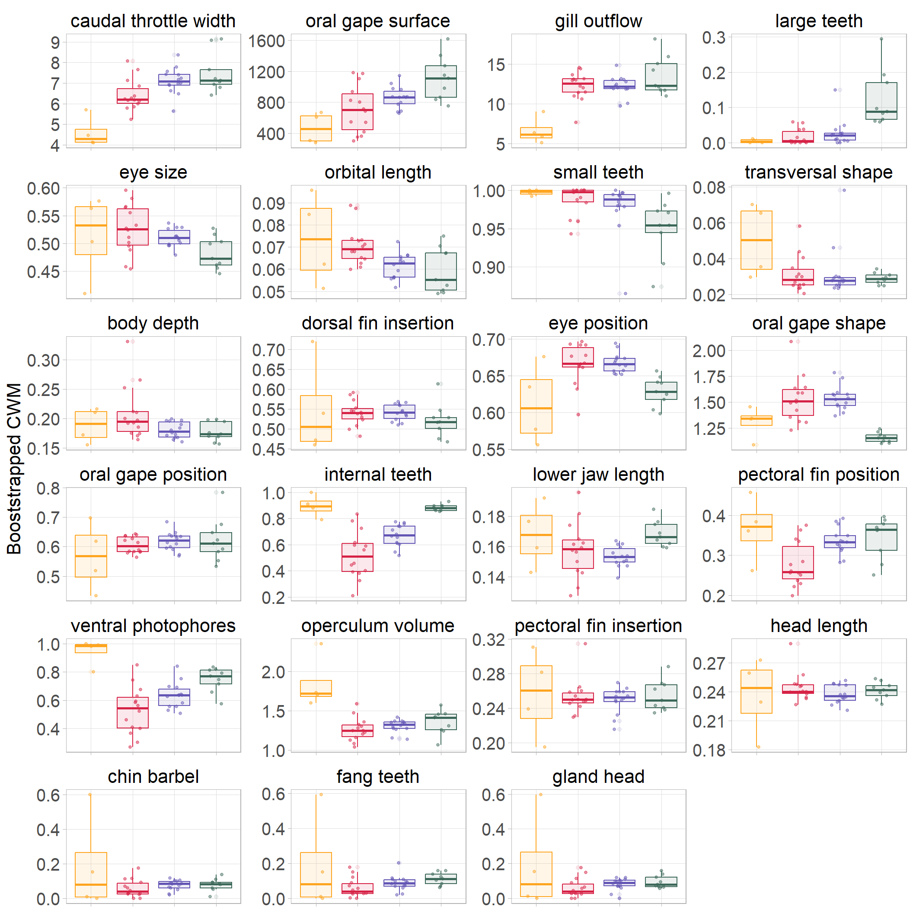{width=1056}
:::

```{.r .cell-code}
ggsave("CWM_boot_sum.png", path = "figures", dpi = 800, height = 13, width = 12)
```
:::


## 4.2. PCA CWM 


::: {.cell}

```{.r .cell-code}
sum_boot_moment_pca <- trait_summarise_boot_moments(
  np_bootstrapped_moments
) %>% 
  ungroup() %>% 
  mutate(trait= gsub("_"," ", trait)) %>% 
  mutate(trait=stringr::str_to_sentence(trait)) %>% 
  select(c(trait, depth_layer, mean)) %>% 
  group_by(
    depth_layer, trait
  ) %>% 
  summarise(median_value= median(mean)) %>% 
  distinct() %>% 
  ungroup() %>% 
  tidyr::pivot_wider(id_cols=depth_layer, values_from = "median_value", names_from = "trait") %>% 
  tibble::column_to_rownames(var = "depth_layer")

res.pca <- FactoMineR::PCA(sum_boot_moment_pca, graph = FALSE)

res.pca <- FactoMineR::PCA(sum_boot_moment_pca, graph = FALSE)


factoextra::fviz_pca_biplot(res.pca, repel = TRUE,
                            pointsize = 2,
                            arrowsize = 0.2,
                            label="var",
                            title = "", 
                            col.var = "contrib",
                            gradient.cols = c("white", "gray80", "gray40"))+
  theme_light()+
  theme(panel.grid.minor =  element_blank(),
        panel.grid.major = element_blank())
```

::: {.cell-output-display}
{width=864}
:::

```{.r .cell-code}
ggsave("PCA_CWM.png", path = "figures", dpi = 700, height = 6, width = 9)
```
:::


# 5. Functional rarity

- Uniqueness - geographical restrectiveness

::: {.cell}
::: {.cell-output-display}
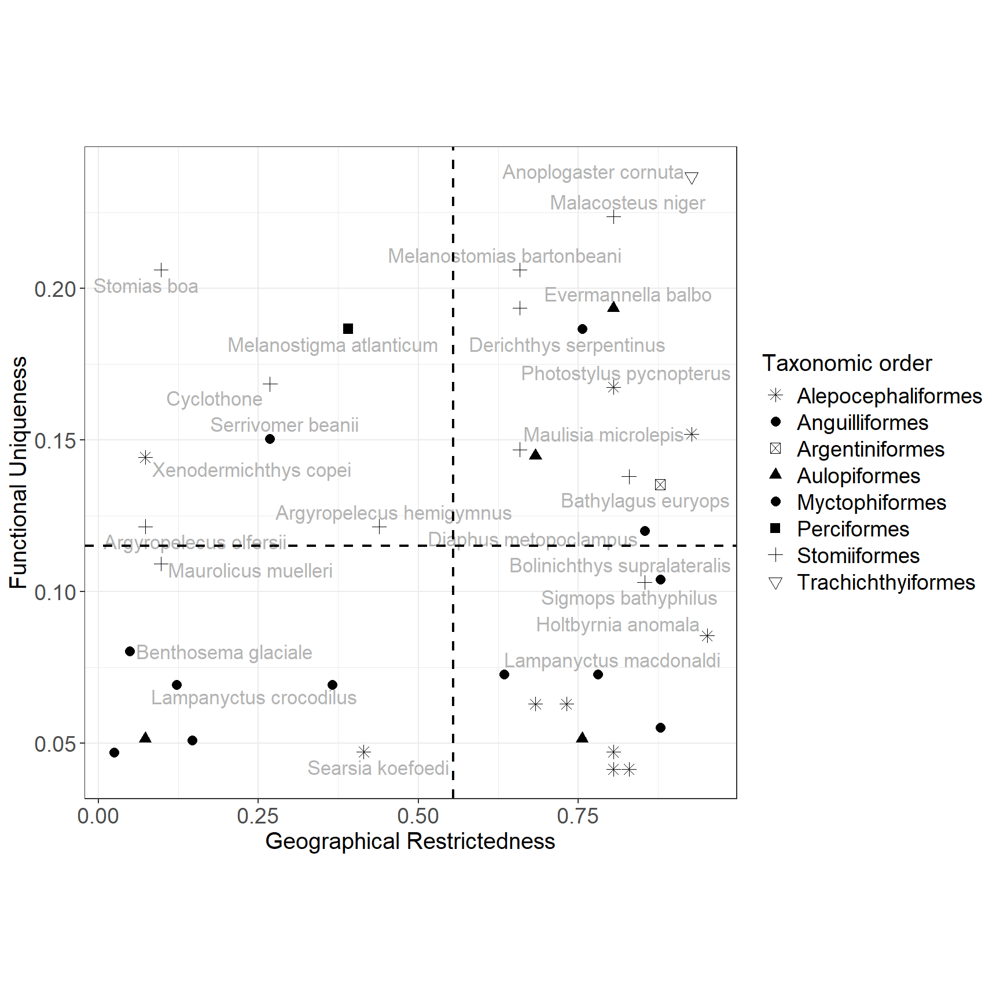{width=864}
:::
:::


__which traits are mainly driving uniqueness ?__


::: {.cell}

```{.r .cell-code}
df <- fish_traits %>%
  as.data.frame() %>%
  tibble::rownames_to_column(var = "species") %>%
  left_join(sp_ui) %>%
  tibble::column_to_rownames(var = "species")

# Identify numerical and categorical traits
numeric_traits <- colnames(df)[sapply(df, is.numeric) &
                                 colnames(df) != "Ui"]

categorical_traits <- colnames(df)[!sapply(df, is.numeric) &
                                     colnames(df) != "Ui"]

# Initialize a data frame to store all results
combined_results_df <- data.frame(
  Trait = character(0),
  Type = character(0),
  Eta_R_squared = numeric(0),
  P_value = numeric(0),
  stringsAsFactors = FALSE
)

# Step 1: Perform Kruskal-Wallis test for categorical traits
for (categorical_trait in categorical_traits) {
  kruskal_result <- kruskal.test(df$Ui ~ df[[categorical_trait]])
  
  # Calculate eta-squared for Kruskal-Wallis
  n_groups <- length(unique(df[[categorical_trait]]))
  n_total <- length(df$Ui)
  h_value <- kruskal_result$statistic
  eta_squared <- (h_value - (n_groups - 1)) / (n_total - n_groups)
  
  combined_results_df <- rbind(
    combined_results_df,
    data.frame(
      Trait = categorical_trait,
      Type = "Categorical",
      Eta_R_squared = as.numeric(format(eta_squared, scientific = FALSE)),
      P_value = as.numeric(format(kruskal_result$p.value, scientific = FALSE)),
      stringsAsFactors = FALSE
    )
  )
}

# Step 2: Fit linear models for numerical traits
for (numeric_trait in numeric_traits) {
  lm_result <- lm(Ui ~ df[[numeric_trait]], data = df)
  summary_stats <- summary(lm_result)
  
  combined_results_df <- rbind(
    combined_results_df,
    data.frame(
      Trait = numeric_trait,
      Type = "Numeric",
      Eta_R_squared = as.numeric(format(summary_stats$r.squared, scientific = FALSE)),
      P_value = as.numeric(format(
        summary_stats$coefficients[2, 4], scientific = FALSE
      )),
      stringsAsFactors = FALSE
    )
  )
}

# Round the numeric columns to three decimal places
combined_results_df[, c("Eta_R_squared", "P_value")] <-
  round(combined_results_df[, c("Eta_R_squared", "P_value")], 3)

htmltools::tagList(DT::datatable(combined_results_df))
```

::: {.cell-output-display}

```{=html}
<div class="datatables html-widget html-fill-item" id="htmlwidget-3c408025883abc1a8210" style="width:100%;height:auto;"></div>
<script type="application/json" data-for="htmlwidget-3c408025883abc1a8210">{"x":{"filter":"none","vertical":false,"data":[["1","2","3","4","5","6","7","8","9","10","11","12","13","14","15","16","17","18","19","20","21","22","23","24","25","26"],["ventral_photophores","gland_head","chin_barbel","small_teeth","large_teeth","fang_teeth","retractable_teeth","internal_teeth","gill_raker_types","oral_gape_axis","eye_size","orbital_length","gill_outflow","oral_gape_surface","oral_gape_shape","oral_gape_position","lower_jaw_length","head_length","body_depth","pectoral_fin_position","pectoral_fin_insertion","transversal_shape","caudal_throttle_width","dorsal_fin_insertion","eye_position","operculum_volume"],["Categorical","Categorical","Categorical","Categorical","Categorical","Categorical","Categorical","Categorical","Categorical","Categorical","Numeric","Numeric","Numeric","Numeric","Numeric","Numeric","Numeric","Numeric","Numeric","Numeric","Numeric","Numeric","Numeric","Numeric","Numeric","Numeric"],[0.09,0.2,0.067,0.332,0.194,0.361,0.034,0.044,0.367,0.193,0.205,0.199,0.019,0.048,0.057,0.003,0.036,0.257,0.001,0.008999999999999999,0.273,0.005,0.008,0.003,0.274,0.059],[0.034,0.003,0.057,0,0.003,0,0.128,0.098,0,0.008999999999999999,0.003,0.003,0.395,0.169,0.133,0.75,0.233,0.001,0.855,0.5649999999999999,0,0.646,0.57,0.735,0,0.127]],"container":"<table class=\"display\">\n  <thead>\n    <tr>\n      <th> <\/th>\n      <th>Trait<\/th>\n      <th>Type<\/th>\n      <th>Eta_R_squared<\/th>\n      <th>P_value<\/th>\n    <\/tr>\n  <\/thead>\n<\/table>","options":{"columnDefs":[{"className":"dt-right","targets":[3,4]},{"orderable":false,"targets":0},{"name":" ","targets":0},{"name":"Trait","targets":1},{"name":"Type","targets":2},{"name":"Eta_R_squared","targets":3},{"name":"P_value","targets":4}],"order":[],"autoWidth":false,"orderClasses":false}},"evals":[],"jsHooks":[]}</script>
```

:::
:::


# 6. Appendices

::: {.cell}

```{.r .cell-code}
# Convert sp_faxes_coord_fish to a data frame
sp_coord_community_2 <- as.data.frame(sp_faxes_coord_fish[, c("PC3", "PC4")]) %>%
  tibble::rownames_to_column(var = "species")

# Create a list to store data frames for each depth layer
all_data_layers_2 <- lapply(unique(sp_all_layers$depth_layer), function(layer) {
  sp_layer <- sp_all_layers %>%
    filter(depth_layer == layer)
  
  #presence or absence
  sp_coord_layer <- sp_coord_community_2 %>%
    mutate(layer_presence = ifelse(species %in% sp_layer$species, "yes", "no")) %>%
    mutate(depth_layer = layer)
  
  return(sp_coord_layer)
})

# Combine all layers into one data frame
sp_coord_community_all_layers <- bind_rows(all_data_layers_2)

# Function to calculate the convex hull for a given data frame
calculate_hull <- function(data) {
  if (nrow(data) < 3) return(data)  
  data %>%
    slice(chull(PC3, PC4))
}

# Initialize lists to store hulls
hull_all_combined <- NULL
hull_layer_combined <- NULL

for(layer in unique(sp_coord_community_all_layers$depth_layer)) {
  sp_layer <- sp_coord_community_all_layers %>%
    filter(depth_layer == layer)
  
  hull_all <- calculate_hull(sp_layer) %>%
    mutate(depth_layer = layer, type = "all")
  
  hull_layer <- calculate_hull(sp_layer %>% filter(layer_presence == "yes")) %>%
    mutate(depth_layer = layer, type = "present")
  
  hull_all_combined <- bind_rows(hull_all_combined, hull_all)
  hull_layer_combined <- bind_rows(hull_layer_combined, hull_layer)
}

# Define depth layer levels
depth_levels <- c("Epipelagic", "Upper mesopelagic", "Lower mesopelagic", "Bathypelagic")

sp_coord_community_all_layers$depth_layer <- factor(sp_coord_community_all_layers$depth_layer, levels = depth_levels)
hull_all_combined$depth_layer <- factor(hull_all_combined$depth_layer, levels = depth_levels)
hull_layer_combined$depth_layer <- factor(hull_layer_combined$depth_layer, levels = depth_levels)

# Define colors for each depth layer
depth_colors <- c("Epipelagic" = "#FEA520", 
                  "Upper mesopelagic" = "#D62246", 
                  "Lower mesopelagic" = "#6255B4", 
                  "Bathypelagic" = "#3C685A")

# Plot
plot_depth <- ggplot() +
  # Plot present species
  geom_point(data = sp_coord_community_all_layers %>% filter(layer_presence == "yes"), 
             aes(PC3, PC4, col = depth_layer), size = 2, shape=19) +
  # Plot absent species
  geom_point(data = sp_coord_community_all_layers %>% filter(layer_presence == "no"), 
             aes(PC3, PC4), col = "grey", shape = 8, size = 2) +
  # Plot hulls
  geom_polygon(data = hull_all_combined, aes(x = PC3, y = PC4), 
               fill = "lightgrey", alpha = 0.2) +
  geom_polygon(data = hull_layer_combined, aes(x = PC3, y = PC4, group = depth_layer, fill = depth_layer), 
               alpha = 0.3) +
  theme_light() +
  scale_color_manual(values = depth_colors) +
  scale_fill_manual(values = depth_colors) +
  guides(col = "none", shape = "none", fill = "none") +
  facet_wrap(~ depth_layer, nrow=1 ) +  
  theme(
    strip.text.x = element_text(size = 14, color = "gray20"),
    strip.background = element_rect(fill = "white"),
    aspect.ratio = 1,
    legend.title = element_text(size = 12),
    legend.text = element_text(size = 12),
    panel.grid.minor = element_blank(),
    panel.grid.major = element_blank()
  )


beta_fd_indices_fish <- mFD::beta.fd.multidim(
  sp_faxes_coord   = sp_faxes_coord_fish[ , c("PC3", "PC4", "PC3", "PC4")],
  asb_sp_occ       = asb_sp_fish_occ,
  check_input      = TRUE,
  beta_family      = c("Jaccard"),
  details_returned = T)
```

::: {.cell-output .cell-output-stdout}
```
Serial computing of convex hulls shaping assemblages with conv1

  |                                                                            
  |                                                                      |   0%
  |                                                                            
  |==================                                                    |  25%
  |                                                                            
  |===================================                                   |  50%
  |                                                                            
  |====================================================                  |  75%
  |                                                                            
  |======================================================================| 100%
Serial computing of convex hulls shaping assemblages with conv2

  |                                                                            
  |                                                                      |   0%
  |                                                                            
  |==================                                                    |  25%
  |                                                                            
  |===================================                                   |  50%
  |                                                                            
  |====================================================                  |  75%
  |                                                                            
  |======================================================================| 100%
Serial computing of intersections between pairs of assemblages with inter_geom_coord

  |                                                                            
  |                                                                      |   0%
  |                                                                            
  |============                                                          |  17%
  |                                                                            
  |=======================                                               |  33%
  |                                                                            
  |===================================                                   |  50%
  |                                                                            
  |===============================================                       |  67%
  |                                                                            
  |==========================================================            |  83%
  |                                                                            
  |======================================================================| 100%
Serial computing of intersections between pairs of assemblages with inter_rcdd_coord & qhull.opt1

  |                                                                            
  |                                                                      |   0%
  |                                                                            
  |============                                                          |  17%
  |                                                                            
  |=======================                                               |  33%
  |                                                                            
  |===================================                                   |  50%
  |                                                                            
  |===============================================                       |  67%
  |                                                                            
  |==========================================================            |  83%
  |                                                                            
  |======================================================================| 100%
Serial computing of intersections between pairs of assemblages with inter_rcdd_coord & qhull.opt2

  |                                                                            
  |                                                                      |   0%
  |                                                                            
  |============                                                          |  17%
```
:::

```{.r .cell-code}
vertices_community <-beta_fd_indices_fish$"details"$"asb_vertices"$Bathypelagic 

sp_coord_community_2 <- as.data.frame(sp_faxes_coord_fish[, 3:4]) %>% 
  tibble::rownames_to_column(var = "species") %>% 
  mutate(vertices=case_when(species%in%vertices_community~"vertice",
                            !species%in%vertices_community~"not_vertice")) 

hull <- sp_coord_community_2%>% 
  slice(chull(PC3, PC4))

plot_com <- ggplot(data = sp_coord_community_2,aes(PC3, PC4)) +
  scale_color_manual(values = c("grey", "black"))+
  geom_point(size = 2.5,aes( shape=vertices, col= vertices)) +
  geom_polygon(data=hull, aes(x = PC3, y = PC4), 
               fill = "lightgrey", alpha = 0.2) +
  theme_light() +
  geom_hline(yintercept = 0, linetype = 2, col = "gray45") +
  geom_vline(xintercept = 0, linetype = 2, col = "gray45") +
  guides(col = "none", shape = "none", fill = "none") +
  theme(
    strip.text.x = element_text(size = 14, color = "gray20"),
    strip.background = element_rect(fill = "white"),
    aspect.ratio = 1,
    legend.title = element_text(size = 12),
    legend.text = element_text(size = 12),
    panel.grid.minor = element_blank(),
    panel.grid.major = element_blank()
  )

ggpubr::ggarrange(
  labels = c("A","B"),
  plot_com,   
  plot_depth, 
  nrow = 2
) 
```

::: {.cell-output-display}
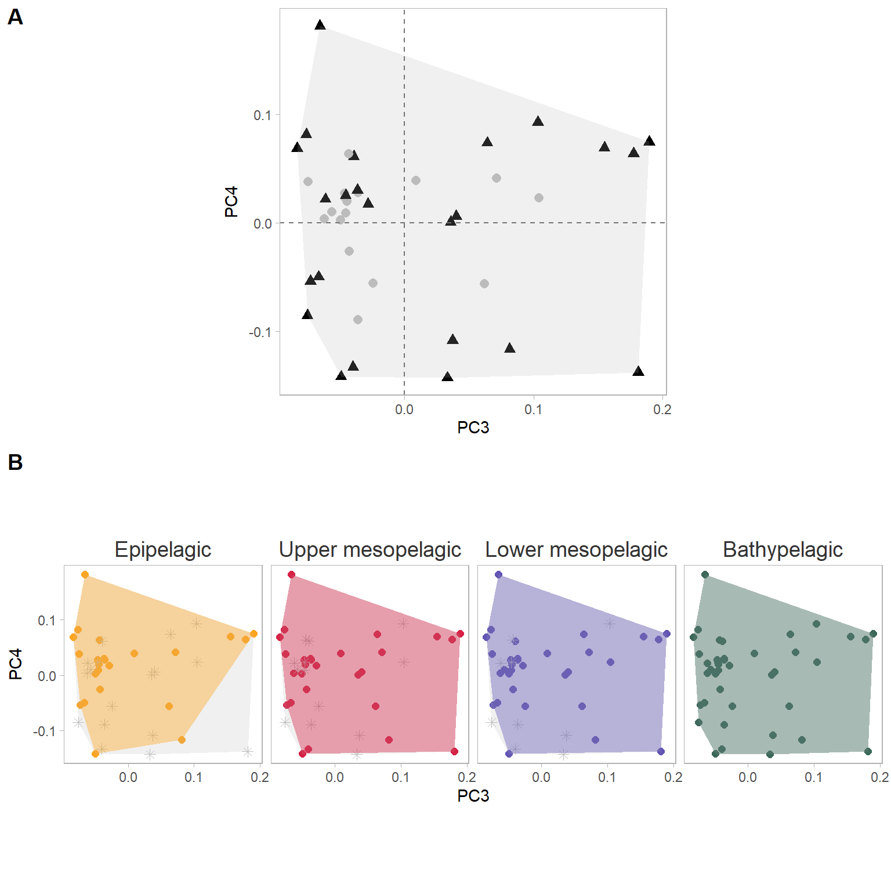{width=768}
:::

```{.r .cell-code}
ggsave("functional_space_PC3_4.png", path = "figures", dpi = 800, height = 8, width = 10)
```
:::
